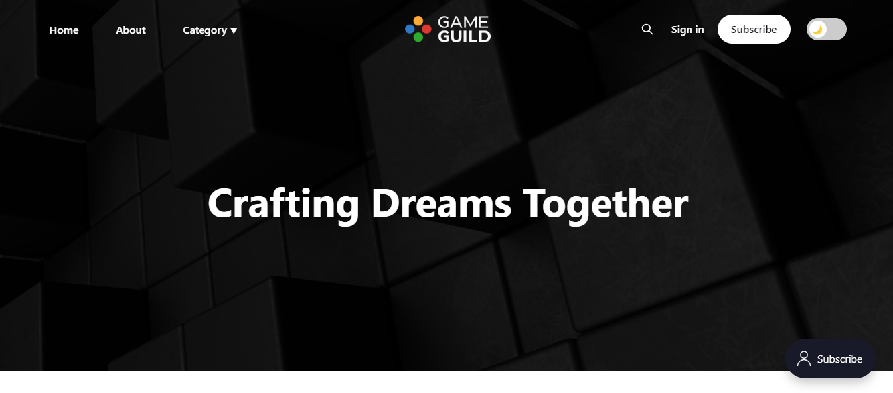
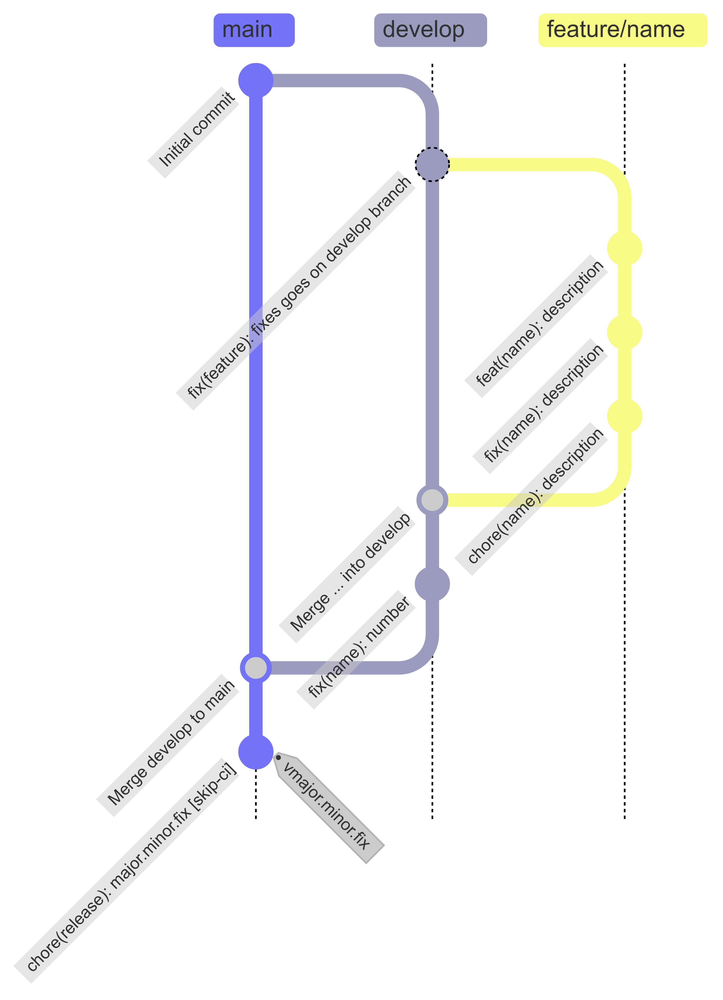

<div align="center">

<!-- Replace documentation/banner.png with your actual banner image -->
<a href="https://gameguild.gg">

</a>

<br/>


>)
>)

# GameGuild

### The game industry was built by communities. We're building the platform they deserve.

Most game developers work alone or in small teams, without access to the networks, mentoring, and infrastructure that studios take for granted. GameGuild exists to change that.

We are an **open source platform** where game developers **find each other**, **learn together**, and **ship their games** — without gatekeepers, without paywalls on knowledge, and without giving up ownership of their work.

[Website](https://gameguild.gg) · [Discord](https://discord.com/invite/9CdJeQ2XKB?ref=gameguild.gg) · [Issues](https://github.com/gameguild-gg/gameguild/issues) · [Contributing](CONTRIBUTING.md)

</div>

---

## Table of contents

- [Why GameGuild](#why-gameguild)
- [Screenshots](#screenshots)
- [Architecture](#architecture)
- [Tech stack](#tech-stack)
- [Quick start](#quick-start)
- [Get involved](#get-involved)
- [FAQ](#faq)
- [Community](#community)
- [Project health](#project-health)
- [License](#license)
- [Legal](#legal)

## Why GameGuild

Talent is everywhere. Opportunity is not. Thousands of skilled developers never finish a game — not because they lack ability, but because they lack connection: a mentor to guide them, a team to complement their skills, a community to test and support their work.

GameGuild is the infrastructure for that connection:

<table>
<tr>
<td align="center" valign="top" width="33%">
<h3>Collaborate</h3>
Find teammates, join workshops, attend lectures, and coordinate projects across time zones.
</td>
<td align="center" valign="top" width="33%">
<h3>Learn</h3>
Access mentoring from experienced developers. Share knowledge through courses, articles, and live sessions.
</td>
<td align="center" valign="top" width="33%">
<h3>Launch</h3>
Showcase your game, get playtesting feedback, and reach players. Keep ownership of everything you create.
</td>
</tr>
</table>

This isn't a marketplace. It's a guild — a place where developers grow by helping each other grow.

## Screenshots

A quick look at what you can do inside GameGuild.

<table>
<tr>
<td align="center" width="50%">
<b>Home</b><br/>

</td>
<td align="center" width="50%">
<b>Course management</b><br/>

</td>
</tr>
<tr>
<td align="center" width="50%">
<b>Online course editor</b><br/>

</td>
<td align="center" width="50%">
<b>Online IDE</b><br/>

</td>
</tr>
</table>

## Architecture

Monorepo managed with npm workspaces.

| Component | Path | Stack |
|-----------|------|-------|
| API | `apps/api/` | .NET (C#) |
| Web | `apps/web/` | Next.js |
| Shared packages | `packages/` | TypeScript |
| Documentation | `docs/` | Markdown |

## Tech stack

Click any badge to visit the project's homepage.

**Frontend**

[](https://nextjs.org/)
[](https://react.dev/)
[](https://www.typescriptlang.org/)
[](https://tailwindcss.com/)
[](https://ui.shadcn.com/)

**Backend**

[](https://dotnet.microsoft.com/)
[](https://chillicream.com/docs/hotchocolate)
[](https://learn.microsoft.com/en-us/ef/core/)
[](https://graphql.org/)
[](https://www.postgresql.org/)

**Platform & runtime**

[](https://webassembly.org/)
[](https://www.docker.com/)
[](https://github.com/features/actions)

**Languages supported by the online IDE**

[](https://en.cppreference.com/w/c)
[](https://isocpp.org/)
[](https://learn.microsoft.com/en-us/dotnet/csharp/)
[](https://www.python.org/)
[](https://developer.mozilla.org/docs/Web/JavaScript)
[](https://www.typescriptlang.org/)
[](https://www.ruby-lang.org/)
[](https://www.php.net/)
[](https://www.lua.org/)
[](https://webassembly.github.io/spec/core/text/index.html)
[](https://en.wikipedia.org/wiki/SQL)

## Quick start

> Full setup for all platforms: [DEVELOPMENT.md](DEVELOPMENT.md)

**Prerequisites:** [Docker](https://docs.docker.com/get-docker/) · [Node.js](https://nodejs.org/) >= 18 · [.NET SDK](https://dotnet.microsoft.com/download)

```bash
git clone https://github.com/gameguild-gg/gameguild.git
cd gameguild
npm install
cp .env.example .env
docker compose up -d
npm run dev
```

Web: `http://localhost:3000` — API: `http://localhost:5295`

## Get involved

GameGuild is built by its community. There's a place for you whether you write code, design interfaces, create content, or just report bugs.

1. Read the [Contributing Guide](CONTRIBUTING.md)
2. Pick an issue labeled [`good first issue`](https://github.com/gameguild-gg/gameguild/labels/good%20first%20issue)
3. Fork, branch, and open a pull request

By contributing, you agree to the [CLA](CONTRIBUTOR_LICENSE_AGREEMENT.md.md). Please review our [Code of Conduct](CODE_OF_CONDUCT.md).

## FAQ

<details>
<summary><b>Is GameGuild really free?</b></summary>

Yes. The platform is open source under the [MIT License](LICENSE-MIT.md) and the hosted version at [gameguild.gg](https://gameguild.gg) is free to use. A [Commercial License](LICENSE.md) exists only for organizations that need contractual support and guarantees.

</details>

<details>
<summary><b>Can I self-host GameGuild?</b></summary>

Yes. The entire stack runs locally with `docker compose up -d` and can be deployed to any infrastructure you control. See [DEVELOPMENT.md](DEVELOPMENT.md) for details.

</details>

<details>
<summary><b>How is this different from itch.io, or online course platforms?</b></summary>

Itch.io is for distribution, and course platforms are for lessons. GameGuild combines **collaboration, learning, and launching** in one open platform designed specifically for game developers — with an online IDE, course editor, playtesting tools, and team coordination built in.

</details>

<details>
<summary><b>Do I need to know C# and TypeScript to contribute?</b></summary>

No. There are [`good first issue`](https://github.com/gameguild-gg/gameguild/labels/good%20first%20issue) tasks across docs, design, content, QA, and translations. Code contributions are welcome in the language of the area you want to touch.

</details>

<details>
<summary><b>Where do I report a security issue?</b></summary>

Please follow the responsible disclosure process in [SECURITY.md](SECURITY.md). Do not open public issues for security vulnerabilities.

</details>

## Community

Join us where the conversation happens:

<div style="display: flex; flex-wrap: wrap; gap: 12px; align-items: center;">
  <a href="https://discord.com/invite/9CdJeQ2XKB?ref=gameguild.gg" title="Discord"></a>
  <a href="https://instagram.com/" title="Instagram"></a>
  <a href="https://www.youtube.com/@AwesomeGamedevGuild" title="YouTube"></a>
  <a href="https://chat.whatsapp.com/CAboWKtosP673f9EkzxKNb" title="WhatsApp"></a>
  <a href="https://x.com/GameGuildDev" title="X"></a>
  <a href="https://bsky.app/profile/gameguild.bsky.social" title="BlueSky"></a>
  <a href="https://mastodon.social/@game-guild" title="Mastodon"></a>
  <a href="https://www.tiktok.com/@awesomegameguild" title="TikTok"></a>
  <a href="https://www.twitch.tv/awesomegamedevguild" title="Twitch"></a>
  <a href="http://gameguild.itch.io/" title="Itch.io"></a>
  <a href="https://gamejolt.com/@game-guild" title="GameJolt"></a>
</div>

<sub>Icons by <a href="https://icons8.com/">Icons8</a></sub>

## Project health

### Star history

How the project's popularity has grown over time.

[](https://star-history.com/#gameguild-gg/gameguild&Date)

### Repository evolution (Gource)

Animated visualization of the repository history — every file and contributor over time. Generated with [Gource](https://gource.io/).

[](https://gameguild-gg.github.io/gameguild/gource.mp4)

### Branching model (GitFlow)

We follow the [GitFlow](https://nvie.com/posts/a-successful-git-branching-model/) branching model: `main` holds production-ready code, `develop` integrates ongoing work, and short-lived `feature/*`, `release/*`, and `hotfix/*` branches feed into them. See our full workflow guide: [link em breve]().



## License

Dual-licensed:

- **[MIT License](LICENSE-MIT.md)** — Free for any use. No support or warranty.
- **[Commercial License](LICENSE.md)** — For organizations that need contractual support, maintenance, and guarantees.

Questions? [gameguild.gg/contact](https://gameguild.gg/contact)

## Legal

- [CLA](CLA.md) — Contributor License Agreement
- [Code of Conduct](CODE_OF_CONDUCT.md)
- [Security Policy](SECURITY.md)
- [Legal](LEGAL.md) — Intellectual property and disputes
