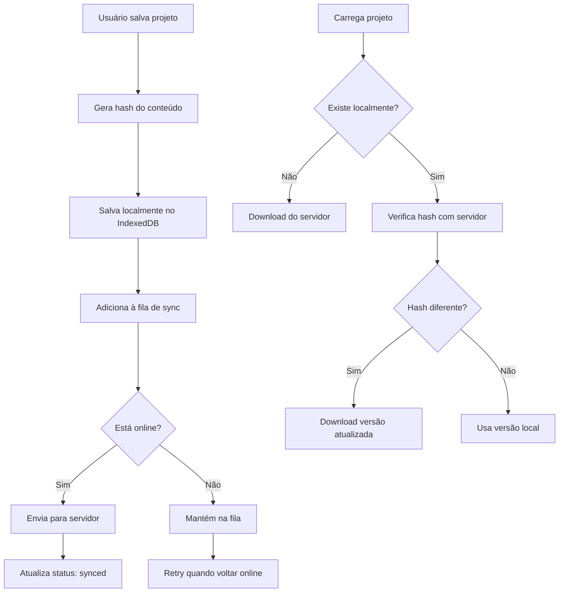

# Arquitetura do Sistema GGLexical Editor

## Visão Geral

O GGLexical Editor é um sistema de edição de conteúdo rico baseado em Lexical (Facebook) com capacidades avançadas de armazenamento local e sincronização em nuvem. A arquitetura é dividida em múltiplas camadas que trabalham em conjunto para fornecer uma experiência fluida de criação, edição e visualização de conteúdo.

## Estrutura de Páginas

### 1. Landing Page (`/gglexical`)
- **Função**: Página inicial que apresenta o sistema ao usuário
- **Componentes principais**:
  - Cards de navegação para Studio e Viewer
  - Apresentação de features do editor e visualizador
  - Links diretos para ambas as funcionalidades

### 2. Studio Page (`/gglexical/studio`)
- **Função**: Ambiente completo de edição de conteúdo
- **Características**:
  - Editor Lexical com rich text
  - Sistema de projetos com auto-save
  - Gerenciamento de tags
  - Ferramentas de import/export
  - Controle de tamanho e limites de armazenamento

### 3. Viewer Page (`/gglexical/viewer`)
- **Função**: Visualização otimizada do conteúdo
- **Características**:
  - Renderização limpa e responsiva
  - Sistema de navegação entre projetos
  - Table of Contents automático
  - Sidebar com lista de projetos

## Estruturas de Dados

### ProjectData
```typescript
interface ProjectData {
  id: string              // UUID único do projeto
  name: string            // Nome/título do projeto
  data: string            // Estado serializado do editor Lexical (JSON)
  tags: string[]          // Array de tags para categorização
  size: number            // Tamanho estimado em KB
  createdAt: string       // Data de criação (ISO string)
  updatedAt: string       // Data da última atualização (ISO string)
  hash?: string           // Hash para verificação de integridade/sync
  syncStatus?: "synced" | "pending" | "conflict" | "local-only"
  storageType: "local" | "cloud"  // Tipo de armazenamento do projeto
}
```

### TagData
```typescript
interface TagData {
  id: string              // UUID único da tag
  name: string            // Nome da tag
  projectIds: string[]    // Array de IDs dos projetos que usam esta tag
}
```

### ProjectMetadata
```typescript
interface ProjectMetadata {
  id: string
  name: string
  tags: string[]
  size: number
  hash: string
  createdAt: string
  updatedAt: string
  syncStatus?: "synced" | "pending" | "conflict" | "local-only"
  storageType: "local" | "cloud"  // Tipo de armazenamento do projeto
}
```

## Sistema de Armazenamento Local

### IndexedDB - Enhanced Storage Adapter

O sistema utiliza uma implementação robusta de IndexedDB através da classe `EnhancedStorageAdapter`:

#### Stores do IndexedDB:
1. **`projects`** - Armazena os dados completos dos projetos
   - Key: `id` (string)
   - Dados: `ProjectData` completo

2. **`project_metadata`** - Metadados otimizados para sync
   - Key: `id` (string)
   - Index: `hash` para verificação rápida
   - Dados: `ProjectMetadata`

3. **`tag_data`** - Sistema de tags modernizado
   - Key: `id` (string)
   - Index: `name` (único)
   - Dados: `TagData`

4. **`tags`** (Legacy) - Sistema de tags antigo (mantido para compatibilidade)

#### Funcionalidades do Storage:

##### Operações CRUD:
- `save(id, name, data, tags)` - Salva/atualiza projeto
- `load(id)` - Carrega projeto (com sync automático)
- `delete(id)` - Remove projeto e ajusta relacionamentos de tags
- `list()` - Lista todos os projetos

##### Busca e Filtragem:
- `searchProjects(searchTerm, tags, filterMode, storageTypeFilter)` - Busca por termo, tags e/ou tipo de armazenamento
- `getAllTags()` - Retorna todas as tags com contagem de uso
- `getProjectsByStorageType(storageType)` - Filtra projetos por tipo de armazenamento
- `getStorageTypeStats()` - Estatísticas de distribuição entre local e cloud

##### Gerenciamento de Tags:
- Sistema bidirecional: projetos → tags e tags → projetos
- Contagem automática de uso
- Limpeza automática de tags órfãs
- Relacionamentos eficientes através de `projectIds`

##### Gerenciamento de Tipos de Armazenamento:
- **Local**: Projetos armazenados apenas localmente no IndexedDB
- **Cloud**: Projetos sincronizados com servidor remoto (baixados localmente para edição)
- Filtros de busca por tipo de armazenamento
- Migração automática de projetos existentes (padrão: "local")
- Interface visual com ícones distintivos (📱 local, ☁️ cloud)
- Sincronização transparente: projetos cloud são baixados localmente para trabalho offline

## Sistema de Sincronização (Preparado para Nuvem)

### Arquitetura de Sync

O sistema possui uma arquitetura completa de sincronização preparada para integração com backend:

#### Componentes Principais:

##### 1. SyncManager
- **Função**: Orquestra todas as operações de sincronização
- **Responsabilidades**:
  - Gerencia conexão com servidor
  - Controla fila de sincronização
  - Detecta conflitos
  - Monitora status online/offline

##### 2. SyncQueue
- **Função**: Fila de operações pendentes
- **Características**:
  - Persistência das operações não sincronizadas
  - Retry automático em caso de falha
  - Priorização de operações

##### 3. HashManager
- **Função**: Geração e verificação de hashes
- **Uso**: Detecção eficiente de mudanças sem transfer completo

##### 4. ApiClient
- **Função**: Comunicação HTTP com servidor
- **Endpoints preparados**:
  - `GET /projects/metadata` - Lista metadados dos projetos
  - `GET /projects/{id}` - Download de projeto específico
  - `POST /projects` - Upload de novo projeto
  - `PUT /projects/{id}` - Atualização de projeto
  - `GET /projects/{id}/hash` - Verificação de hash

#### Fluxo de Sincronização:



#### Configuração de Sync (SyncConfig):

```typescript
interface SyncConfig {
  enabled: boolean          // Liga/desliga sincronização
  serverUrl: string         // URL do servidor de sync
  timeout: number           // Timeout das requisições
  retries: number           // Número de tentativas
  autoSync: boolean         // Sync automático
  syncInterval: number      // Intervalo de sync em ms
  batchSize: number         // Tamanho do batch de sync
  debugMode: boolean        // Modo debug
}
```

## Fluxo de Dados

### 1. Criação/Edição de Projeto:

```
Editor Lexical → Estado serializado → ProjectData → 
EnhancedStorageAdapter → IndexedDB → SyncQueue → Servidor (futuro)
```

### 2. Carregamento de Projeto:

```
Interface → EnhancedStorageAdapter → IndexedDB ⟷ SyncManager → 
Servidor (verificação de hash) → Editor Lexical
```

### 3. Gerenciamento de Tags:

```
Interface → ProjectData.tags → TagData (relacionamentos) → 
IndexedDB (tag_data store) → Interface (autocomplete/filtros)
```

## Componentes da Interface

### Editor Components:
- **LexicalEditor**: Editor principal baseado em Lexical
- **EditorToolbar**: Barra de ferramentas de formatação
- **FloatingToolbar**: Toolbar contextual
- **ContentInsertPlugin**: Sistema de inserção de elementos especiais

### Dialog Components:
- **OpenProjectDialog**: Navegação e abertura de projetos
- **CreateProjectDialog**: Criação de novos projetos
- **SaveAsDialog**: Salvar projeto com novo nome
- **ImportProjectDialog**: Importação de arquivos .zip/.gglexical

### Preview Components:
- **PreviewRenderer**: Renderização otimizada para leitura
- **ProjectSidebarList**: Lista lateral de projetos
- **PreviewTableOfContents**: Índice automático

## Recursos Avançados

### 1. Sistema de Filtros Inteligentes:
- **Busca por texto**: Busca no nome e conteúdo dos projetos
- **Filtros por tags**: Modo "any" (qualquer tag) ou "all" (todas as tags)
- **Filtro por tipo de armazenamento**: Local ou Cloud
- **Combinação de filtros**: Todos os filtros trabalham em conjunto
- **Interface responsiva**: Filtros colapsáveis em dispositivos móveis
- **Indicadores visuais**: Badges coloridos por tipo de armazenamento (local/cloud)

### 2. Sistema de Nodes Customizados:
- **ImageNode**: Imagens com redimensionamento
- **VideoNode**: Vídeos embarcados
- **AudioNode**: Players de áudio
- **QuizNode**: Questionários interativos
- **CodeNode**: Blocos de código com sintaxe highlighting
- **MermaidNode**: Diagramas Mermaid
- **PresentationNode**: Slides/apresentações

### 3. Controle de Armazenamento:
- Estimativa de tamanho em tempo real
- Limites configuráveis de armazenamento
- Alertas de proximidade do limite
- Compressão automática de imagens
- **Estratégias de armazenamento flexíveis**:
  - Projetos locais apenas (para privacidade total)
  - Projetos na nuvem (para colaboração e backup)
  - **Sistema local-first**: todos os projetos editados localmente independente do tipo

### 4. Sistema de Import/Export:
- Formato nativo `.gglexical`
- Suporte a arquivos ZIP com múltiplos projetos
- Preservação de metadados e tags
- **Preservação do tipo de armazenamento** na importação/exportação
- Validação de integridade
- **Compatibilidade com projetos local e cloud**

## Estratégias de Armazenamento

### Tipos de Armazenamento Disponíveis:

#### 1. **Local Only** (`storageType: "local"`)
- **Uso**: Projetos privados ou que não necessitam sincronização
- **Características**:
  - Armazenamento apenas no IndexedDB local
  - Sem sincronização com servidor
  - Máxima privacidade e controle
  - Performance otimizada (sem latência de rede)
  - Ideal para rascunhos, projetos pessoais ou dados sensíveis

#### 2. **Cloud Sync** (`storageType: "cloud"`)
- **Uso**: Projetos colaborativos, públicos ou que precisam estar disponíveis em múltiplos dispositivos
- **Características**:
  - Sincronização automática com servidor
  - Baixado localmente para edição offline
  - Disponível em múltiplos dispositivos
  - Backup automático na nuvem
  - Requer conectividade inicial para download
  - **Funcionamento híbrido**: mesmo sendo "cloud", o projeto é baixado e editado localmente, com sincronização periódica

### Filosofia de Armazenamento:
O sistema adota uma abordagem **"local-first"** onde:
- Todos os projetos são editados localmente para máxima performance
- Projetos "cloud" são baixados e mantidos em cache local
- Sincronização acontece em background de forma transparente
- O usuário sempre trabalha com dados locais, independente do tipo de storage

### Migração e Compatibilidade:
- **Migração automática**: Projetos existentes são marcados como "local"
- **Conversão dinâmica**: Usuário pode alterar tipo de armazenamento a qualquer momento
- **Preservação de dados**: Nenhum dado é perdido durante mudanças de tipo
- **Versionamento do banco**: Sistema suporta upgrades automáticos (v2 → v3)
- **Download sob demanda**: Projetos cloud são baixados quando necessário

## Preparação para Nuvem

### Estratégia de Migração:

1. **Fase Atual**: Armazenamento local completo com estrutura de sync preparada
2. **Fase 1**: Ativação do SyncManager com servidor básico
3. **Fase 2**: Sincronização bidirecional com resolução de conflitos
4. **Fase 3**: Colaboração em tempo real
5. **Fase 4**: Versionamento e histórico de mudanças

### Implementação Detalhada:

Para a implementação completa do armazenamento na nuvem, consulte o documento especializado:
**[📋 CLOUD_STORAGE_ORCHESTRATION.md](./CLOUD_STORAGE_ORCHESTRATION.md)**

Este documento inclui:
- Extensão do modelo Project no backend (.NET 9)
- Controllers REST API completos
- Commands/Queries/Handlers (CQRS)
- Atualização do frontend com LexicalApiClient
- Sistema de migração e configuração
- Integração com sistema de autenticação existente

### Benefícios da Arquitetura Atual:

- **Funcionalidade offline completa**
- **Performance otimizada** (dados locais)
- **Escalabilidade preparada** para sync
- **Estrutura de dados consistente** para migração
- **Zero dependência** de servidor para funcionar
- **Integração nativa** com infraestrutura GameGuild existente

## Considerações Técnicas

### Performance:
- IndexedDB para armazenamento eficiente
- Lazy loading de projetos grandes
- Índices otimizados para busca
- Debouncing de operações de auto-save
- **Cache local**: todos os projetos mantidos localmente para acesso instantâneo

### Segurança:
- Hash de integridade dos dados
- Validação de tipos nas interfaces
- Sanitização de conteúdo HTML
- Isolamento de dados por projeto

### UX/UI:
- Auto-save transparente
- Indicadores visuais de status de sync
- Recuperação automática de drafts
- Interface responsiva para diferentes dispositivos
- **Indicadores de tipo de storage**: ícones visuais distinguem projetos locais (📱) de cloud (☁️)

### Modelo de Sincronização Simplificado:
- **Local**: Dados apenas no dispositivo atual
- **Cloud**: Dados sincronizados com servidor, mas sempre editados localmente
- **Transparência**: Usuário não precisa se preocupar com localização dos dados
- **Offline-first**: Sistema funciona completamente offline, sync é complementar

---

Esta arquitetura fornece uma base sólida para um editor de conteúdo moderno, com capacidades offline completas e preparação total para evolução para um sistema colaborativo em nuvem.
