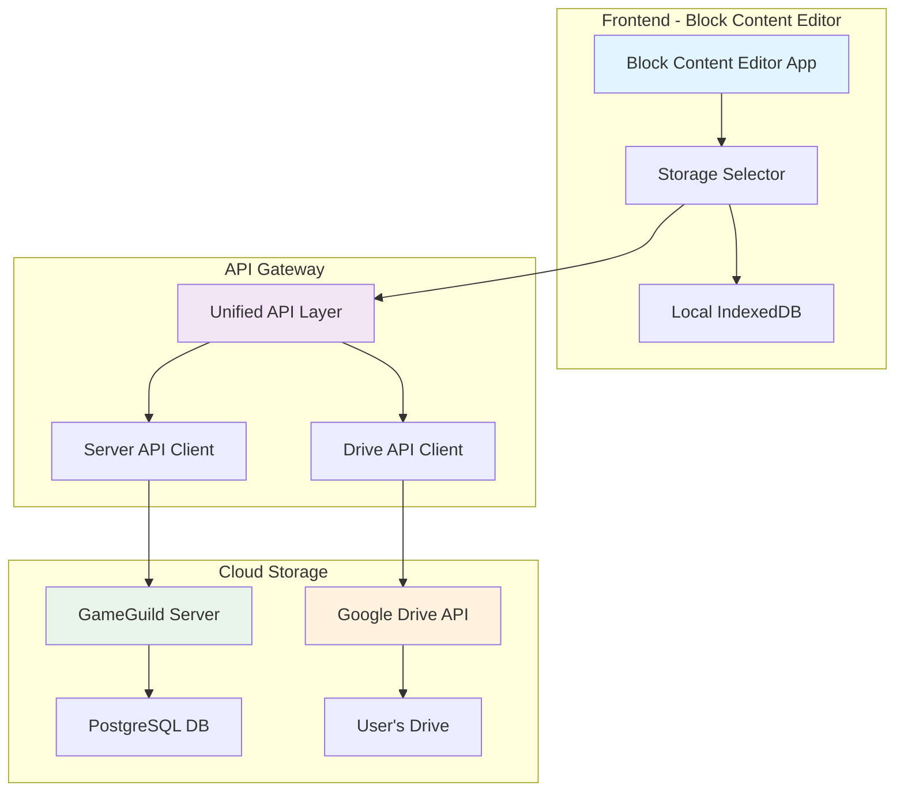

# Arquitetura Dual Cloud Storage - Block Content Editor

## Visão Geral da Arquitetura

A arquitetura proposta oferece **duas opções de armazenamento na nuvem**:

1. **Servidor GameGuild** (Plataforma/Corporativo)
2. **Google Drive** (Pessoal/Offline)



## Tipos de Armazenamento Expandidos

### 1. **Local** (`storageType: "local"`)
- Apenas IndexedDB local
- Sem sincronização
- Máxima privacidade

### 2. **Server** (`storageType: "server"`)
- Sincronização com servidor GameGuild
- Plataforma integrada
- Colaboração e compartilhamento

### 3. **Drive** (`storageType: "drive"`)
- Sincronização com Google Drive pessoal
- Uso offline/pessoal
- Controle total do usuário

## Implementação da API Unificada

### 1. Abstração do Storage Provider

```typescript
// src/lib/storage/cloud/storage-provider.ts
export interface CloudStorageProvider {
  readonly type: 'server' | 'drive';
  readonly name: string;
  
  // Authentication
  authenticate(): Promise<boolean>;
  isAuthenticated(): Promise<boolean>;
  logout(): Promise<void>;
  
  // CRUD Operations
  createProject(project: CreateProjectRequest): Promise<ProjectData>;
  getProject(id: string): Promise<ProjectData>;
  updateProject(id: string, project: UpdateProjectRequest): Promise<ProjectData>;
  deleteProject(id: string): Promise<void>;
  
  // Metadata and Search
  getProjectsMetadata(): Promise<ProjectMetadata[]>;
  searchProjects(params: SearchProjectsParams): Promise<ProjectData[]>;
  
  // Sync specific
  getProjectHash(id: string): Promise<string>;
  syncProject(project: ProjectData): Promise<SyncResult>;
}

export interface SyncResult {
  success: boolean;
  action: 'created' | 'updated' | 'deleted' | 'conflict';
  conflictData?: ProjectData;
  error?: string;
}
```

### 2. Server Storage Provider

```typescript
// src/lib/storage/cloud/server-storage-provider.ts
export class ServerStorageProvider implements CloudStorageProvider {
  readonly type = 'server' as const;
  readonly name = 'GameGuild Server';
  
  private apiClient: LexicalApiClient;
  private authService: AuthService;

  constructor(authService: AuthService) {
    this.authService = authService;
    this.apiClient = new LexicalApiClient();
  }

  async authenticate(): Promise<boolean> {
    // Uses existing GameGuild authentication
    return this.authService.isAuthenticated();
  }

  async isAuthenticated(): Promise<boolean> {
    return this.authService.isAuthenticated();
  }

  async logout(): Promise<void> {
    await this.authService.logout();
  }

  async createProject(project: CreateProjectRequest): Promise<ProjectData> {
    return this.apiClient.createProject({
      ...project,
      storageType: 'server'
    });
  }

  async getProject(id: string): Promise<ProjectData> {
    return this.apiClient.getProject(id);
  }

  async updateProject(id: string, project: UpdateProjectRequest): Promise<ProjectData> {
    return this.apiClient.updateProject(id, project);
  }

  async deleteProject(id: string): Promise<void> {
    return this.apiClient.deleteProject(id);
  }

  async getProjectsMetadata(): Promise<ProjectMetadata[]> {
    return this.apiClient.getProjectsMetadata('server');
  }

  async searchProjects(params: SearchProjectsParams): Promise<ProjectData[]> {
    return this.apiClient.searchProjects(params);
  }

  async getProjectHash(id: string): Promise<string> {
    return this.apiClient.getProjectHash(id);
  }

  async syncProject(project: ProjectData): Promise<SyncResult> {
    try {
      const serverHash = await this.getProjectHash(project.id);
      
      if (serverHash !== project.hash) {
        // Update needed
        const updatedProject = await this.updateProject(project.id, {
          name: project.name,
          data: project.data,
          tags: project.tags
        });
        
        return {
          success: true,
          action: 'updated'
        };
      }
      
      return {
        success: true,
        action: 'updated'
      };
    } catch (error) {
      return {
        success: false,
        error: error instanceof Error ? error.message : 'Unknown error'
      };
    }
  }
}
```

### 3. Google Drive Storage Provider

```typescript
// src/lib/storage/cloud/drive-storage-provider.ts
export class DriveStorageProvider implements CloudStorageProvider {
  readonly type = 'drive' as const;
  readonly name = 'Google Drive';
  
  private gapi: any;
  private isInitialized = false;
  private folderId: string | null = null;
  
  private readonly FOLDER_NAME = 'Block Content Editor Projects';
  private readonly SCOPES = [
    'https://www.googleapis.com/auth/drive.file',
    'https://www.googleapis.com/auth/drive.metadata.readonly'
  ];

  constructor() {
    this.initializeGAPI();
  }

  private async initializeGAPI(): Promise<void> {
    if (this.isInitialized) return;

    // Load Google API
    await this.loadGoogleAPI();
    
    await gapi.load('auth2', () => {
      gapi.auth2.init({
        client_id: process.env.NEXT_PUBLIC_GOOGLE_CLIENT_ID,
        scope: this.SCOPES.join(' ')
      });
    });

    await gapi.load('client', () => {
      gapi.client.init({
        apiKey: process.env.NEXT_PUBLIC_GOOGLE_API_KEY,
        clientId: process.env.NEXT_PUBLIC_GOOGLE_CLIENT_ID,
        scope: this.SCOPES.join(' ')
      }).then(() => {
        gapi.client.load('drive', 'v3');
      });
    });

    this.isInitialized = true;
  }

  private loadGoogleAPI(): Promise<void> {
    return new Promise((resolve) => {
      if (typeof gapi !== 'undefined') {
        resolve();
        return;
      }

      const script = document.createElement('script');
      script.src = 'https://apis.google.com/js/api.js';
      script.onload = () => resolve();
      document.head.appendChild(script);
    });
  }

  async authenticate(): Promise<boolean> {
    await this.initializeGAPI();
    
    const authInstance = gapi.auth2.getAuthInstance();
    
    if (!authInstance.isSignedIn.get()) {
      try {
        await authInstance.signIn();
      } catch (error) {
        console.error('Google Drive authentication failed:', error);
        return false;
      }
    }
    
    // Ensure Block Content Editor folder exists
    await this.ensureProjectFolder();
    
    return true;
  }

  async isAuthenticated(): Promise<boolean> {
    await this.initializeGAPI();
    const authInstance = gapi.auth2.getAuthInstance();
    return authInstance.isSignedIn.get();
  }

  async logout(): Promise<void> {
    const authInstance = gapi.auth2.getAuthInstance();
    await authInstance.signOut();
    this.folderId = null;
  }

  private async ensureProjectFolder(): Promise<string> {
    if (this.folderId) return this.folderId;

    // Search for existing folder
    const response = await gapi.client.drive.files.list({
      q: `name='${this.FOLDER_NAME}' and mimeType='application/vnd.google-apps.folder' and trashed=false`,
      spaces: 'drive'
    });

    if (response.result.files.length > 0) {
      this.folderId = response.result.files[0].id;
      return this.folderId;
    }

    // Create folder if not exists
    const folderResponse = await gapi.client.drive.files.create({
      resource: {
        name: this.FOLDER_NAME,
        mimeType: 'application/vnd.google-apps.folder'
      }
    });

    this.folderId = folderResponse.result.id;
    return this.folderId;
  }

  async createProject(project: CreateProjectRequest): Promise<ProjectData> {
    const folderId = await this.ensureProjectFolder();
    
    const projectData: ProjectData = {
      id: crypto.randomUUID(),
      name: project.name,
      data: project.data,
      tags: project.tags || [],
      size: new Blob([project.data]).size,
      hash: await this.generateHash(project.data),
      storageType: 'drive',
      syncStatus: 'synced',
      createdAt: new Date().toISOString(),
      updatedAt: new Date().toISOString()
    };

    const fileContent = JSON.stringify(projectData, null, 2);
    const blob = new Blob([fileContent], { type: 'application/json' });

    const metadata = {
      name: `${projectData.name}.block-content-editor`,
      parents: [folderId],
      description: `Block Content Editor project: ${projectData.name}`
    };

    const form = new FormData();
    form.append('metadata', new Blob([JSON.stringify(metadata)], {
      type: 'application/json'
    }));
    form.append('file', blob);

    const response = await fetch('https://www.googleapis.com/upload/drive/v3/files?uploadType=multipart', {
      method: 'POST',
      headers: {
        'Authorization': `Bearer ${gapi.auth2.getAuthInstance().currentUser.get().getAuthResponse().access_token}`
      },
      body: form
    });

    if (!response.ok) {
      throw new Error(`Failed to create project in Drive: ${response.statusText}`);
    }

    const driveFile = await response.json();
    
    // Store drive file ID in project metadata
    projectData.driveFileId = driveFile.id;

    return projectData;
  }

  async getProject(id: string): Promise<ProjectData> {
    const files = await this.getProjectsMetadata();
    const projectMeta = files.find(p => p.id === id);
    
    if (!projectMeta || !projectMeta.driveFileId) {
      throw new Error('Project not found in Drive');
    }

    const response = await gapi.client.drive.files.get({
      fileId: projectMeta.driveFileId,
      alt: 'media'
    });

    const projectData = JSON.parse(response.body);
    return projectData;
  }

  async updateProject(id: string, project: UpdateProjectRequest): Promise<ProjectData> {
    const existingProject = await this.getProject(id);
    
    const updatedProject: ProjectData = {
      ...existingProject,
      ...project,
      hash: await this.generateHash(project.data || existingProject.data),
      updatedAt: new Date().toISOString()
    };

    const fileContent = JSON.stringify(updatedProject, null, 2);
    const blob = new Blob([fileContent], { type: 'application/json' });

    const form = new FormData();
    form.append('file', blob);

    const response = await fetch(`https://www.googleapis.com/upload/drive/v3/files/${existingProject.driveFileId}?uploadType=media`, {
      method: 'PATCH',
      headers: {
        'Authorization': `Bearer ${gapi.auth2.getAuthInstance().currentUser.get().getAuthResponse().access_token}`
      },
      body: fileContent
    });

    if (!response.ok) {
      throw new Error(`Failed to update project in Drive: ${response.statusText}`);
    }

    return updatedProject;
  }

  async deleteProject(id: string): Promise<void> {
    const project = await this.getProject(id);
    
    if (!project.driveFileId) {
      throw new Error('Drive file ID not found');
    }

    await gapi.client.drive.files.delete({
      fileId: project.driveFileId
    });
  }

  async getProjectsMetadata(): Promise<ProjectMetadata[]> {
    const folderId = await this.ensureProjectFolder();
    
    const response = await gapi.client.drive.files.list({
      q: `'${folderId}' in parents and name contains '.block-content-editor' and trashed=false`,
      fields: 'files(id,name,modifiedTime,createdTime,size)',
      orderBy: 'modifiedTime desc'
    });

    const projects: ProjectMetadata[] = [];

    for (const file of response.result.files) {
      try {
        // Get file content to extract metadata
        const contentResponse = await gapi.client.drive.files.get({
          fileId: file.id,
          alt: 'media'
        });

        const projectData = JSON.parse(contentResponse.body);
        
        projects.push({
          id: projectData.id,
          name: projectData.name,
          tags: projectData.tags,
          size: parseInt(file.size) || projectData.size,
          hash: projectData.hash,
          storageType: 'drive',
          createdAt: file.createdTime,
          updatedAt: file.modifiedTime,
          driveFileId: file.id
        });
      } catch (error) {
        console.warn(`Failed to parse project file ${file.name}:`, error);
      }
    }

    return projects;
  }

  async searchProjects(params: SearchProjectsParams): Promise<ProjectData[]> {
    const metadata = await this.getProjectsMetadata();
    let filtered = metadata;

    // Filter by search term
    if (params.searchTerm) {
      const term = params.searchTerm.toLowerCase();
      filtered = filtered.filter(p => 
        p.name.toLowerCase().includes(term) ||
        p.tags.some(tag => tag.toLowerCase().includes(term))
      );
    }

    // Filter by tags
    if (params.tags?.length) {
      filtered = filtered.filter(p => {
        if (params.tagFilterMode === 'all') {
          return params.tags.every(tag => p.tags.includes(tag));
        } else {
          return params.tags.some(tag => p.tags.includes(tag));
        }
      });
    }

    // Load full project data
    const projects: ProjectData[] = [];
    for (const meta of filtered.slice(params.skip || 0, (params.skip || 0) + (params.take || 50))) {
      try {
        const project = await this.getProject(meta.id);
        projects.push(project);
      } catch (error) {
        console.warn(`Failed to load project ${meta.name}:`, error);
      }
    }

    return projects;
  }

  async getProjectHash(id: string): Promise<string> {
    const metadata = await this.getProjectsMetadata();
    const project = metadata.find(p => p.id === id);
    
    if (!project) {
      throw new Error('Project not found');
    }
    
    return project.hash;
  }

  async syncProject(project: ProjectData): Promise<SyncResult> {
    try {
      const driveHash = await this.getProjectHash(project.id);
      
      if (driveHash !== project.hash) {
        await this.updateProject(project.id, {
          name: project.name,
          data: project.data,
          tags: project.tags
        });
        
        return {
          success: true,
          action: 'updated'
        };
      }
      
      return {
        success: true,
        action: 'updated'
      };
    } catch (error) {
      return {
        success: false,
        error: error instanceof Error ? error.message : 'Unknown error'
      };
    }
  }

  private async generateHash(data: string): Promise<string> {
    const encoder = new TextEncoder();
    const dataBuffer = encoder.encode(data);
    const hashBuffer = await crypto.subtle.digest('SHA-256', dataBuffer);
    const hashArray = Array.from(new Uint8Array(hashBuffer));
    return hashArray.map(b => b.toString(16).padStart(2, '0')).join('');
  }
}

// Extend interfaces to support Drive
interface ProjectData {
  // ... existing fields
  driveFileId?: string; // Google Drive file ID
}

interface ProjectMetadata {
  // ... existing fields
  driveFileId?: string; // Google Drive file ID
}

interface SearchProjectsParams {
  searchTerm?: string;
  tags?: string[];
  tagFilterMode?: 'all' | 'any';
  storageType?: 'local' | 'server' | 'drive';
  skip?: number;
  take?: number;
}
```

### 4. Unified Storage Manager

```typescript
// src/lib/storage/cloud/unified-storage-manager.ts
export class UnifiedStorageManager {
  private providers: Map<string, CloudStorageProvider> = new Map();
  private localAdapter: EnhancedStorageAdapter;

  constructor(
    localAdapter: EnhancedStorageAdapter,
    authService: AuthService
  ) {
    this.localAdapter = localAdapter;
    
    // Register providers
    this.providers.set('server', new ServerStorageProvider(authService));
    this.providers.set('drive', new DriveStorageProvider());
  }

  getProvider(type: 'server' | 'drive'): CloudStorageProvider {
    const provider = this.providers.get(type);
    if (!provider) {
      throw new Error(`Storage provider ${type} not found`);
    }
    return provider;
  }

  async syncProject(projectId: string): Promise<void> {
    const project = await this.localAdapter.load(projectId);
    if (!project) {
      throw new Error('Project not found locally');
    }

    if (project.storageType === 'local') {
      // No sync needed for local projects
      return;
    }

    const provider = this.getProvider(project.storageType as 'server' | 'drive');
    
    if (!await provider.isAuthenticated()) {
      throw new Error(`Not authenticated with ${provider.name}`);
    }

    const result = await provider.syncProject(project);
    
    if (!result.success) {
      throw new Error(`Sync failed: ${result.error}`);
    }

    // Update local sync status
    await this.localAdapter.updateProjectSyncStatus(projectId, 'synced');
  }

  async downloadProject(projectId: string, storageType: 'server' | 'drive'): Promise<void> {
    const provider = this.getProvider(storageType);
    
    if (!await provider.isAuthenticated()) {
      await provider.authenticate();
    }

    const project = await provider.getProject(projectId);
    
    // Save to local storage
    await this.localAdapter.save(
      project.id,
      project.name,
      project.data,
      project.tags,
      storageType
    );
  }

  async convertProjectStorage(
    projectId: string, 
    newStorageType: 'local' | 'server' | 'drive'
  ): Promise<void> {
    const project = await this.localAdapter.load(projectId);
    if (!project) {
      throw new Error('Project not found');
    }

    const oldStorageType = project.storageType;

    if (oldStorageType === newStorageType) {
      return; // No conversion needed
    }

    // If converting FROM cloud storage, delete from old provider
    if (oldStorageType !== 'local') {
      const oldProvider = this.getProvider(oldStorageType as 'server' | 'drive');
      if (await oldProvider.isAuthenticated()) {
        try {
          await oldProvider.deleteProject(projectId);
        } catch (error) {
          console.warn(`Failed to delete from ${oldStorageType}:`, error);
        }
      }
    }

    // If converting TO cloud storage, upload to new provider
    if (newStorageType !== 'local') {
      const newProvider = this.getProvider(newStorageType);
      
      if (!await newProvider.isAuthenticated()) {
        await newProvider.authenticate();
      }

      await newProvider.createProject({
        name: project.name,
        data: project.data,
        tags: project.tags,
        storageType: newStorageType
      });
    }

    // Update local storage type
    await this.localAdapter.updateProjectStorageType(projectId, newStorageType);
  }

  async getAvailableProviders(): Promise<Array<{
    type: string;
    name: string;
    isAuthenticated: boolean;
  }>> {
    const providers = [];

    for (const [type, provider] of this.providers) {
      providers.push({
        type,
        name: provider.name,
        isAuthenticated: await provider.isAuthenticated()
      });
    }

    return providers;
  }
}
```

## Interface do Usuário

### 1. Storage Type Selector Component

```typescript
// src/components/block-content-editor/storage/storage-type-selector.tsx
export function StorageTypeSelector({
  currentStorageType,
  onStorageTypeChange,
  availableProviders
}: {
  currentStorageType: 'local' | 'server' | 'drive';
  onStorageTypeChange: (type: 'local' | 'server' | 'drive') => void;
  availableProviders: Array<{ type: string; name: string; isAuthenticated: boolean }>;
}) {
  return (
    <div className="space-y-4">
      <Label className="text-sm font-medium">Storage Location</Label>
      
      <div className="grid grid-cols-1 md:grid-cols-3 gap-3">
        {/* Local Storage */}
        <div 
          className={`
            p-4 border rounded-lg cursor-pointer transition-all
            ${currentStorageType === 'local' 
              ? 'border-blue-500 bg-blue-50 dark:bg-blue-900/20' 
              : 'border-gray-200 hover:border-gray-300'
            }
          `}
          onClick={() => onStorageTypeChange('local')}
        >
          <div className="flex items-center space-x-3">
            <HardDrive className="h-5 w-5 text-gray-600" />
            <div>
              <div className="font-medium">Local Only</div>
              <div className="text-xs text-gray-500">This device only</div>
            </div>
          </div>
          <div className="mt-2 text-xs text-gray-600">
            • Maximum privacy
            • No internet required
            • Not backed up
          </div>
        </div>

        {/* Server Storage */}
        <div 
          className={`
            p-4 border rounded-lg cursor-pointer transition-all
            ${currentStorageType === 'server' 
              ? 'border-green-500 bg-green-50 dark:bg-green-900/20' 
              : 'border-gray-200 hover:border-gray-300'
            }
          `}
          onClick={() => onStorageTypeChange('server')}
        >
          <div className="flex items-center space-x-3">
            <Server className="h-5 w-5 text-green-600" />
            <div>
              <div className="font-medium">GameGuild Server</div>
              <div className="text-xs text-gray-500">
                {availableProviders.find(p => p.type === 'server')?.isAuthenticated 
                  ? 'Connected' 
                  : 'Sign in required'
                }
              </div>
            </div>
          </div>
          <div className="mt-2 text-xs text-gray-600">
            • Collaboration features
            • Platform integration
            • Automatic backup
          </div>
        </div>

        {/* Google Drive Storage */}
        <div 
          className={`
            p-4 border rounded-lg cursor-pointer transition-all
            ${currentStorageType === 'drive' 
              ? 'border-blue-500 bg-blue-50 dark:bg-blue-900/20' 
              : 'border-gray-200 hover:border-gray-300'
            }
          `}
          onClick={() => onStorageTypeChange('drive')}
        >
          <div className="flex items-center space-x-3">
            <Cloud className="h-5 w-5 text-blue-600" />
            <div>
              <div className="font-medium">Google Drive</div>
              <div className="text-xs text-gray-500">
                {availableProviders.find(p => p.type === 'drive')?.isAuthenticated 
                  ? 'Connected' 
                  : 'Sign in required'
                }
              </div>
            </div>
          </div>
          <div className="mt-2 text-xs text-gray-600">
            • Your personal Drive
            • Full control
            • Works offline
          </div>
        </div>
      </div>
    </div>
  );
}
```

### 2. Authentication Flow Component

```typescript
// src/components/block-content-editor/storage/cloud-auth-dialog.tsx
export function CloudAuthDialog({
  storageType,
  onAuthSuccess,
  onClose
}: {
  storageType: 'server' | 'drive';
  onAuthSuccess: () => void;
  onClose: () => void;
}) {
  const [isAuthenticating, setIsAuthenticating] = useState(false);
  const [error, setError] = useState<string | null>(null);

  const handleAuthenticate = async () => {
    setIsAuthenticating(true);
    setError(null);

    try {
      const storageManager = useStorageManager();
      const provider = storageManager.getProvider(storageType);
      
      const success = await provider.authenticate();
      
      if (success) {
        onAuthSuccess();
        onClose();
        toast.success(`Connected to ${provider.name}`);
      } else {
        setError('Authentication failed');
      }
    } catch (error) {
      setError(error instanceof Error ? error.message : 'Authentication failed');
    } finally {
      setIsAuthenticating(false);
    }
  };

  return (
    <Dialog open onOpenChange={onClose}>
      <DialogContent>
        <DialogHeader>
          <DialogTitle>
            Connect to {storageType === 'server' ? 'GameGuild Server' : 'Google Drive'}
          </DialogTitle>
        </DialogHeader>
        
        <div className="space-y-4">
          {storageType === 'server' ? (
            <div>
              <p className="text-sm text-gray-600">
                Sign in to your GameGuild account to sync projects with the server.
              </p>
              <ul className="mt-2 text-xs text-gray-500 space-y-1">
                <li>• Collaborate with team members</li>
                <li>• Access from any device</li>
                <li>• Automatic backup and versioning</li>
              </ul>
            </div>
          ) : (
            <div>
              <p className="text-sm text-gray-600">
                Connect your Google Drive to save projects in your personal cloud storage.
              </p>
              <ul className="mt-2 text-xs text-gray-500 space-y-1">
                <li>• Projects saved in "Block Content Editor Projects" folder</li>
                <li>• Full control over your data</li>
                <li>• Works without internet after sync</li>
              </ul>
            </div>
          )}
          
          {error && (
            <Alert variant="destructive">
              <AlertDescription>{error}</AlertDescription>
            </Alert>
          )}
        </div>
        
        <DialogFooter>
          <Button variant="outline" onClick={onClose}>
            Cancel
          </Button>
          <Button 
            onClick={handleAuthenticate} 
            disabled={isAuthenticating}
          >
            {isAuthenticating ? (
              <>
                <Loader2 className="mr-2 h-4 w-4 animate-spin" />
                Connecting...
              </>
            ) : (
              `Connect to ${storageType === 'server' ? 'Server' : 'Google Drive'}`
            )}
          </Button>
        </DialogFooter>
      </DialogContent>
    </Dialog>
  );
}
```

## Configuração e Environment

### 1. Variáveis de Ambiente

```bash
# Frontend (.env.local)
NEXT_PUBLIC_GOOGLE_CLIENT_ID=your-google-client-id
NEXT_PUBLIC_GOOGLE_API_KEY=your-google-api-key
NEXT_PUBLIC_SERVER_API_URL=https://api.gameguild.gg
NEXT_PUBLIC_ENABLE_DRIVE_STORAGE=true
NEXT_PUBLIC_ENABLE_SERVER_STORAGE=true
```

### 2. Google Drive API Setup

```typescript
// src/lib/config/google-drive-config.ts
export const googleDriveConfig = {
  clientId: process.env.NEXT_PUBLIC_GOOGLE_CLIENT_ID!,
  apiKey: process.env.NEXT_PUBLIC_GOOGLE_API_KEY!,
  scopes: [
    'https://www.googleapis.com/auth/drive.file',
    'https://www.googleapis.com/auth/drive.metadata.readonly'
  ],
  discoveryDocs: [
    'https://www.googleapis.com/discovery/v1/apis/drive/v3/rest'
  ]
};
```

## Benefícios da Arquitetura Dual

### 1. **Flexibilidade de Uso**
- **Pessoal**: Google Drive para uso individual
- **Corporativo**: Servidor para equipes/organizações
- **Offline**: Local para máxima privacidade

### 2. **Casos de Uso Distintos**
- **Drive**: Usuários independentes, freelancers, uso pessoal
- **Server**: Empresas, equipes, colaboração, integração com plataforma
- **Local**: Dados sensíveis, desenvolvimento offline

### 3. **Escalabilidade**
- **Drive**: Escalabilidade do Google (15GB+ grátis)
- **Server**: Controle total, customização, integração
- **Local**: Sem limites de storage, apenas dispositivo

### 4. **Migração Flexível**
- Conversão dinâmica entre tipos de storage
- Import/export entre provedores
- Backup cruzado possível

## Estratégia de Implementação

### Fase 1: Infraestrutura Base
- [ ] Abstração CloudStorageProvider
- [ ] ServerStorageProvider (reutiliza API existente)
- [ ] Configuração Google Drive API

### Fase 2: Google Drive Integration
- [ ] DriveStorageProvider completo
- [ ] Sistema de autenticação Google
- [ ] Gerenciamento de pastas/arquivos

### Fase 3: UI Integration
- [ ] Storage type selector
- [ ] Authentication flows
- [ ] Migration wizards

### Fase 4: Advanced Features
- [ ] Sync conflict resolution
- [ ] Batch operations
- [ ] Offline sync queue

## Considerações Técnicas

### Segurança:
- **Drive**: OAuth 2.0, scoped permissions
- **Server**: JWT, existing auth system
- **Local**: Device-only encryption

### Performance:
- **Drive**: API rate limits, caching strategies
- **Server**: Existing optimization
- **Local**: Instant access

### Offline Support:
- Todos os tipos funcionam offline após sync inicial
- Sync queue para reconnection
- Conflict resolution strategies

Esta arquitetura oferece **máxima flexibilidade** permitindo que o Block Content Editor sirva tanto para **uso pessoal** (Drive) quanto **corporativo** (Server), mantendo sempre a opção **local** para privacidade máxima.
