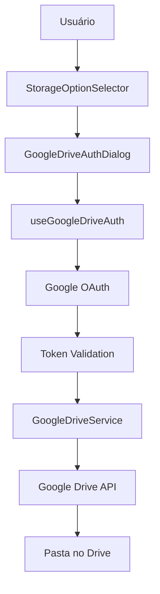

# Configuração do Google Drive para GGLexical

Este documento explica como configurar a integração segura com Google Drive para sincronização de projetos.

## 🔐 Características de Segurança

- **Permissões Mínimas**: Solicita apenas acesso aos arquivos criados pela aplicação
- **Escopo Limitado**: Usa `https://www.googleapis.com/auth/drive.file` (não acesso total ao Drive)
- **Validação de Tokens**: Verifica expiração e permissões dos tokens de acesso
- **Sanitização**: Limpa nomes de arquivos e valida dados antes do upload
- **Rate Limiting**: Controla frequência de chamadas à API
- **Cleanup Automático**: Remove dados expirados automaticamente

## 🚀 Configuração Rápida

### 1. Configurar Google Cloud Project

1. Acesse o [Google Cloud Console](https://console.cloud.google.com/)
2. Crie um novo projeto ou selecione um existente
3. No menu lateral, vá para "APIs & Services" > "Library"
4. Procure por "Google Drive API" e ative
5. Vá para "APIs & Services" > "Credentials"

### 2. Criar Credenciais OAuth 2.0

1. Clique em "Create Credentials" > "OAuth client ID"
2. Selecione "Web application"
3. Configure os campos:
   - **Name**: `GGLexical Google Drive Integration`
   - **Authorized JavaScript origins**: 
     - `http://localhost:3000` (desenvolvimento)
     - `https://your-domain.com` (produção)
   - **Authorized redirect URIs**: (deixe vazio para aplicações JavaScript)

### 3. Criar API Key

1. Clique em "Create Credentials" > "API key"
2. Restrinja a chave:
   - **Application restrictions**: HTTP referrers
   - **API restrictions**: Google Drive API
   - **Website restrictions**: Adicione seus domínios

### 4. Configurar Variáveis de Ambiente

Copie o arquivo `.env.example.google-drive` para `.env.local`:

```bash
cp .env.example.google-drive .env.local
```

Edite `.env.local` com suas credenciais:

```env
NEXT_PUBLIC_GOOGLE_DRIVE_CLIENT_ID=your_client_id.googleusercontent.com
NEXT_PUBLIC_GOOGLE_DRIVE_API_KEY=your_api_key_here
```

## 🔒 Como Funciona a Segurança

### Fluxo de Autenticação

1. **Usuário clica em "Configurar Google Drive"**
2. **Abre popup do Google OAuth** com permissões específicas
3. **Usuário autoriza** acesso limitado aos arquivos
4. **Token é validado** automaticamente pelo sistema
5. **Pasta é criada/encontrada** no Google Drive
6. **Configuração é salva** localmente

### Permissões Solicitadas

```javascript
// Escopo mínimo - apenas arquivos criados pela aplicação
const SCOPES = [
  'https://www.googleapis.com/auth/drive.file'
]
```

### Estrutura de Arquivos

```
Google Drive/
└── GGLexical Projects/          # Pasta criada pelo usuário
    ├── Projeto 1.gglexical.json # Arquivo de projeto
    ├── Projeto 2.gglexical.json
    └── ...
```

### Formato dos Arquivos

```json
{
  "id": "ggl_1638360000_abc123",
  "name": "Meu Projeto",
  "data": "eyJ0eXBlIjoia...", // Dados do editor (base64)
  "tags": ["tutorial", "exemplo"],
  "createdAt": "2023-12-01T10:00:00.000Z",
  "updatedAt": "2023-12-01T10:30:00.000Z"
}
```

## 🛡️ Medidas de Segurança Implementadas

### 1. Validação de Tokens
- Verifica expiração automaticamente
- Valida permissões necessárias
- Renova tokens quando necessário

### 2. Sanitização de Dados
- Remove caracteres perigosos dos nomes de arquivos
- Previne ataques de directory traversal
- Valida estrutura dos dados antes do upload

### 3. Rate Limiting
- Limita chamadas à API para evitar throttling
- Implementa delays entre requisições
- Monitora uso da quota da API

### 4. Cleanup Automático
- Remove dados expirados do localStorage
- Limpa tokens inválidos
- Monitora idade das sessões

### 5. Logging de Segurança
- Registra eventos de autenticação
- Monitora tentativas de acesso
- Detecta comportamentos suspeitos

## 🚨 Troubleshooting

### Erro: "Token has expired"
**Solução**: O usuário precisa se autenticar novamente. O sistema solicita automaticamente.

### Erro: "Insufficient permissions"
**Solução**: Verifique se o escopo `drive.file` está configurado corretamente.

### Erro: "Invalid Client ID"
**Solução**: Verifique se o Client ID termina com `.googleusercontent.com`.

### Erro: "Origin not authorized"
**Solução**: Adicione seu domínio nas "Authorized JavaScript origins".

## 📝 Monitoramento

### Eventos de Segurança Logados
- `google_drive_auth_success` - Autenticação bem-sucedida
- `google_drive_auth_failed` - Falha na autenticação
- `folder_creation_failed` - Erro ao criar pasta
- `token_validation_failed` - Token inválido detectado

### Métricas Recomendadas
- Taxa de autenticações bem-sucedidas
- Frequência de renovação de tokens
- Erros de API por usuário
- Tamanho médio dos projetos

## 🔄 Fluxo de Dados



## 📚 Recursos Adicionais

- [Google Drive API Documentation](https://developers.google.com/drive/api)
- [OAuth 2.0 for Client-side Applications](https://developers.google.com/identity/protocols/oauth2/javascript-implicit-flow)
- [Google API JavaScript Client](https://github.com/google/google-api-javascript-client)

## ⚠️ Limitações

- **Quota da API**: 1.000 requests por 100 segundos por usuário
- **Tamanho de arquivo**: Máximo 10MB por projeto
- **Tipos de arquivo**: Apenas JSON com projetos GGLexical
- **Conectividade**: Requer conexão com internet para sincronização
