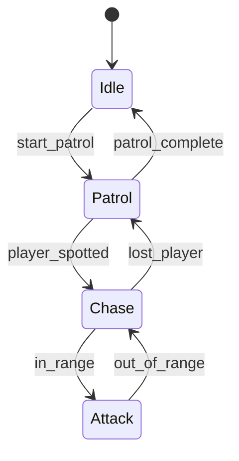

# State Machines

::: note "Preamble: Considerations on Level of Difficulty"

I do not cover State Machines in depth on the introductory AI class because in order to implement a good state machine involves:

- Building a nice UI so you can visualize the states and transitions;
- Knowledge on advanced data structures such as graphs, trees, and a more specialized search algorithims;
- Delegates, Events, Callbacks and Pointer to Functions;
- A good implementation require some kind of hierarchy and some degree of concurrency / parallelism;

These topics can be really hard for some. So I will cover only the initial concepts and implementation. This topic will be all about States and Transitions.

On `Advanced AI for Games`, we will cover in depth this topic when we cover using this knowledge into planning such as in GOAP and HTN. I consider this topic limited applicability without these topics.

I rather allow the students to implement a simple state machine on their own that really works in a meaninful timeline than.

:::

## Motivation

State machines are fundamental to game AI, providing a clear way to model behavior that changes over time. They're perfect for NPCs, UI systems, and any game entity that needs to behave differently based on current conditions.



## Finite State Machines

**Finite** means a limited, predefined set of states. Each state represents a distinct behavior or condition.

```cpp
// Basic enemy AI states
enum class EnemyState {
    IDLE,
    PATROL,
    CHASE,
    ATTACK
};

class Enemy {
private:
    EnemyState currentState;
    float patrolTimer;
    
public:
    Enemy() : currentState(EnemyState::IDLE), patrolTimer(0.0f) {}
    
    void update(float deltaTime, bool playerVisible, float playerDistance) {
        switch (currentState) {
            case EnemyState::IDLE:
                if (patrolTimer <= 0) {
                    currentState = EnemyState::PATROL;
                    patrolTimer = 5.0f;
                }
                break;
                
            case EnemyState::PATROL:
                patrolTimer -= deltaTime;
                if (playerVisible) {
                    currentState = EnemyState::CHASE;
                } else if (patrolTimer <= 0) {
                    currentState = EnemyState::IDLE;
                }
                break;
                
            case EnemyState::CHASE:
                if (playerDistance < 2.0f) {
                    currentState = EnemyState::ATTACK;
                } else if (!playerVisible) {
                    currentState = EnemyState::PATROL;
                }
                break;
                
            case EnemyState::ATTACK:
                if (playerDistance > 2.0f) {
                    currentState = EnemyState::CHASE;
                }
                break;
        }
    }
};
```

## States

A state defines:
- **What** the entity is doing
- **Entry/Exit** actions
- **Update** behavior

```cpp
class State {
public:
    virtual void enter() = 0;
    virtual void update() = 0;
    virtual void exit() = 0;
};

class PatrolState : public State {
public:
    void enter() override { /* Start patrolling */ }
    void update() override { /* Move along path */ }
    void exit() override { /* Stop movement */ }
};
``` 

## Transitions

Transitions define **when** to change states based on conditions.

```cpp
struct Transition {
    State* from;
    State* to;
    std::function<bool()> condition;
};

class StateMachine {
    State* currentState;
    std::vector<Transition> transitions;
    
public:
    void update() {
        currentState->update();
        
        for (auto& t : transitions) {
            if (t.from == currentState && t.condition()) {
                currentState->exit();
                currentState = t.to;
                currentState->enter();
                break;
            }
        }
    }
};
```

## Common Patterns

### Simple Toggle

```cpp
class ToggleState {
    bool isOn = false;
public:
    void toggle() { isOn = !isOn; }
    bool getState() const { return isOn; }
};
```

### Timer-Based Transitions

```cpp
class TimedState : public State {
    float timer = 0;
    float duration;
public:
    TimedState(float d) : duration(d) {}
    
    void update() override {
        timer += deltaTime;
        if (timer >= duration) {
            // Trigger transition
        }
    }
};
```

### Hierarchical State Machines

```cpp
class CombatState {
    enum SubState { MELEE, RANGED, BLOCKING };
    SubState currentSubState = MELEE;
    
public:
    void handleInput(InputType input) {
        switch (currentSubState) {
            case MELEE:
                if (input == InputType::BLOCK) currentSubState = BLOCKING;
                else if (input == InputType::SHOOT) currentSubState = RANGED;
                break;
            case RANGED:
                if (input == InputType::MELEE_ATTACK) currentSubState = MELEE;
                break;
            case BLOCKING:
                if (input == InputType::RELEASE_BLOCK) currentSubState = MELEE;
                break;
        }
    }
};
```

### State Stack (Pushdown Automaton)

```cpp
class StateStack {
    std::stack<GameState*> stateStack;
    
public:
    void pushState(GameState* state) {
        if (!stateStack.empty()) {
            stateStack.top()->pause();
        }
        stateStack.push(state);
        state->enter();
    }
    
    void popState() {
        if (!stateStack.empty()) {
            stateStack.top()->exit();
            stateStack.pop();
            if (!stateStack.empty()) {
                stateStack.top()->resume();
            }
        }
    }
};
```

### Guard Conditions

```cpp
class GuardedTransition {
public:
    bool canTransition(const GameContext& context) {
        return context.playerHealth > 0 && 
               context.hasWeapon && 
               context.enemiesInRange > 0;
    }
};
```

### Event-Driven States

```cpp
class EventDrivenAI {
    enum State { IDLE, INVESTIGATING, ALERTING };
    State currentState = IDLE;
    
public:
    void onEvent(EventType event) {
        switch (currentState) {
            case IDLE:
                if (event == EventType::NOISE_HEARD) {
                    currentState = INVESTIGATING;
                }
                break;
            case INVESTIGATING:
                if (event == EventType::PLAYER_SPOTTED) {
                    currentState = ALERTING;
                } else if (event == EventType::INVESTIGATION_COMPLETE) {
                    currentState = IDLE;
                }
                break;
            case ALERTING:
                if (event == EventType::PLAYER_ESCAPED) {
                    currentState = IDLE;
                }
                break;
        }
    }
};
```

## Use Cases

**Game Development:**
- Enemy AI (patrol → chase → attack)
- Player states (idle → running → jumping)
- Game flow (menu → playing → paused → game over)

**Other Applications:**
- Network protocols
- User interface flows
- Hardware control systems
- Parsing and compilation

::: tip "When to Use State Machines"

Use state machines when you have:
- Clear, discrete states
- Well-defined transitions
- Behavior that changes based on current state
- Need for predictable, debuggable logic

:::

## References

- Game Programming Patterns - [State Machines](https://gameprogrammingpatterns.com/state.html)