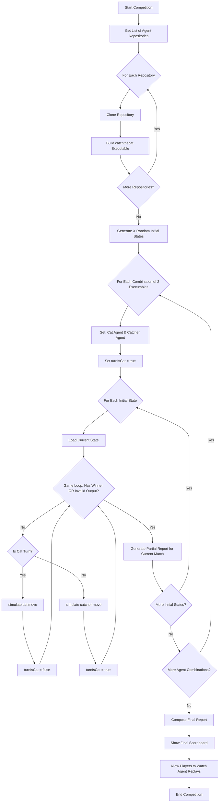

# Catch the Cat

You are in charge of creating 2 agents that will be playing the game of [Catch the Cat](https://llerrah.com/cattrap.htm).

## Game rules

The game is played on a NxN board where N is an odd number that follows the sequence of `1+4*x` with `x` starnig from `1`: `5, 9, 13, 17, 21, 25, 29, 33, 37, 41, 45, ...`. The game starts with a cat in the center of the board, and it starts with some random blocks placed randomly.

The game is played in turns, where each player can move the cat or a catcher.

### Board

The board position follows `{x, y}` notation.

The center of the board is `{0,0}` and the board is a square with `N` cells on each side.

The board is a pointy top hexagon with the first line aligned to the left. Here goes an example of a 5x5 board indexes:

```
 /  \ /  \ /  \ /  \ /  \
|-2-2|-1-2| 0-2| 1-2| 2-2|
 \  / \  / \  / \  / \  / \
  |-2-1|-1-1| 0-1| 1-1| 2-1|
 /  \ /  \ /  \ /  \ /  \ /
|-2 0|-1 0| 0 0| 1 0| 2 0|
 \  / \  / \  / \  / \  / \
  |-2 1|-1 1| 0 1| 1 1| 2 1|
 /  \ /  \ /  \ /  \ /  \ /
|-2 2|-1 2| 0 2| 1 2| 2 2|
 \  / \  / \  / \  / \  /
```

### Moves

The Cat moves in any of the 6 immediate neighbors, but it cannot move to a blocked cell.

The Catcher moves by blocking a cell. A cell can be blocked only once each turn.

### Win condition

1. If the cat is surrounded by blocked cells in all 6 directions, it cannot move and the catcher wins.
2. If the cat reaches a border cell, it wins.
3. If the cat makes invalid moves, it loses. Invalid moves are:

   - Move to a blocked cell;
   - Move to a cell that is not a neighbor;
   - Stay in the same cell;

4. The catcher makes invalid moves, it loses. Invalid moves are:

   - Block an already blocked cell;
   - Block a cell outside the board;
   - Block a cell where the cat is;

## STL Notes

We will need to build auxiliary data structures to help us with the agent implementation for the path finding in C++.

Assume we have a `Point2D` structure like this

```cpp
struct Point2D {
    int x, y;
};
```

This wont work in a `priority_queue` unless we wrap it in a struct with a priority and a custom comparator:

```cpp
struct Point2DWithPriority {
    Point2D point;
    int priority;

    // given we want to use a min heap, we need to reverse the comparison
    bool operator<(const Point2DWithPriority& other) const {
        return priority > other.priority;
    }
};
```

Now in order to make `Point2D` to work as a index in associative containers like `unordered_map`, and `unordered_set`, we need to provide a hash function.

```cpp
template <>
struct std::hash<Point2D> {
    std::size_t operator()(const Point2D& p) const {
        return std::hash<int>()(p.x) ^ std::hash<int>()(p.y);
    }
};
```

And we need to tell how to compare two `Point2D` objects for the collision detection on the hash table.

```cpp
struct Point2D {
  // ...
  bool operator==(const Point2D &other) const {
        return x == other.x && y == other.y;
  }
}
```

So, the final code should looks like something like this:

``` c++
#include <iostream>
#include <queue>
#include <unordered_map>
#include <unordered_set>

struct Point2D {
    int x;
    int y;

    Point2D(int x, int y) : x(x), y(y) {}

    bool operator==(const Point2D &other) const {
        return x == other.x && y == other.y;
    }
};

// if we want to use Point 2d as keys on hashtable structures such as umap and uset, you have to tell the STL how to hash Point2D
template <>
struct std::hash<Point2D> {
    std::size_t operator()(const Point2D &p) const {
        return std::hash<int>()(p.x) ^ (std::hash<int>()(p.y));
    }
};

// in order to use Point2D in a priority queue, we need to wrap the Point2D and add a priority field and a comparator telling how to compare two Point2DPrioritized
struct Point2DPrioritized {
    Point2D point;
    int priority;

    Point2DPrioritized(Point2D point, int priority): point(point), priority(priority) {}

    // the < and > are reversed because we will give higher priority to the ones with less value
    bool operator<(const Point2DPrioritized &other) const {
        return priority > other.priority;
    }
};

int main() {
    // this will not work!!
    // std::priority_queue<Point2D> pq;
    // pq.push(Point2D(1,2));

    std::priority_queue<Point2DPrioritized> pq;
    // this only works because the Point2DPrioritized has the operator < defined
    pq.push({Point2D(1,2), 5});

    std::unordered_set<Point2D> visited;
    // this only work because we have created the hash<Point2D> specialization at the namespace of the std
    visited.insert(Point2D(1,2));
    // the same thing works for unordered_map
    std::unordered_map<Point2D, int> point_to_value;
    point_to_value[Point2D(1,2)] = 42;
}
```

## Competition

All students enrolled in the competition will submit both agents. The agents will play against each other, and the winner will be the one that wins the most games.

The points will be counted as how many moves each one does;

If Cat Wins:

- CatPoints: SideSize * SideSize/2 - CatMoves - K*CpuCatTime;
- CatcherPoints: CatcherMoves - K\*CpuCatcherTime;

If Catcher Wins:

- CatPoints: CatMoves - K\*CpuCatTime;
- CatcherPoints: SideSize * SideSize/2 - CatcherMoves - K*CpuCatherTime;

## How to participate:

I will create an automation that will use your agents to play against each other.

1. Place the interface [below](#iagenth) in a file called `IAgent.h` on the root of your repo;
2. Agents are stateless. At every turn, the state of all classes everything will be reset.
3. The classes should be named `Cat` and `Catcher`;
4. The simulator will include `Cat.h` and `Catcher.h`, so you should have at least these two files;
5. Both agents should inherit `IAgent.h` and include `#include "IAgent.h"`;
6. All `.cpp` and `.h` files should be at the same directory level. Don't use subdirs;
7. Your submission will be a zip containing only `.h` and `.cpp` files.
8. Do not submit any file with a `main` function;

The reasoning is: I will create an automation for:

1. Receive your zip and version them for auditing purposes and diagnostics;
2. Create a folder for your user if not created yet;
3. Clear the folder and keep the executable;
4. Unzip the contents of your submission into a folder with your username;
5. Add a `main.cpp` for the simulator;
6. Compile the whole folder into one executable named as your username. Only the last working subimission will be kept;

It will generate `N` executables that will be managed and called via terminal to generate the final report with points;

The report will be generated via another automation that will generate 100 initial states randomly. All agents from all students play against each other.



### IAgent.h

```cpp title="IAgent.h"
#pragma once
#include <vector>
#include <utility>

// NO NOT CHANGE THIS FILE
struct IAgent {
public:
    /**
     * @brief the agent implementation. the center of the world is {0,0}, top left is {-sideSize/2, -sideSize/2} and the bottom right is {sideSize/2, sideSize/2}.
     *
     * @param world the world as a vector of booleans. true means there is a wall, false means there is no wall. The vector is the linearization of the matrix of the world.
     * @param catPos the position of the cat in the world {x,y} relative to the center of the world.
     * @param sideSize the side size of the world. it will be always a square that follows the sequence of 4*i+1: 5, 9, 13, 17, 21, 25, 29, 33, 37, 41, ...
     *
     * @return the position to move to {x,y}. relative to the center of the world.
     */
    virtual std::pair<int,int> move(const std::vector<bool>& world, std::pair<int,int> catPos, int sideSize ) = 0;
};
```
