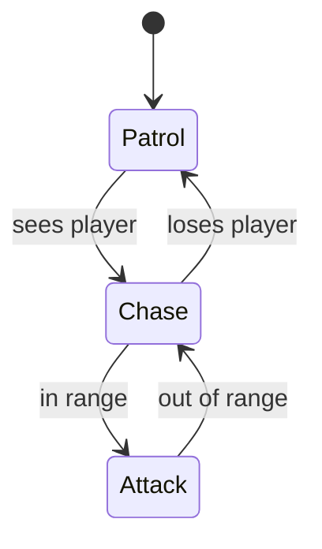

# Finite State Machines, Behavior Trees & Decision Architectures

## Finite State Machines (FSMs)



Naive implementations based on `if/else` or `switch` statements can quickly become unmanageable as complexity increases.

```c++
enum class State {
    Patrol,
    Chase,
    Attack
};
State currentState = State::Patrol;
void update() {
    switch (currentState) {
        case State::Patrol:
            patrol();
            if (seesPlayer()) {
                currentState = State::Chase;
            }
            break;
        case State::Chase:
            chase();
            if (inRange()) {
                currentState = State::Attack;
            } else if (lostPlayer()) {
                currentState = State::Patrol;
            }
            break;
        case State::Attack:
            attack();
            if (!inRange()) {
                currentState = State::Chase;
            }
            break;
    }
}
```

A more robust approach is to encapsulate states and transitions using the State Pattern, allowing for cleaner code organization and easier maintenance.

```c++
class State {
public:
    virtual void onEnter() = 0;
    virtual void execute() = 0;
    virtual void onExit() = 0;
};

class PatrolState : public State {
public:
    void onEnter() override { /* setup patrol */ }
    void execute() override { /* patrol logic */ }
    void onExit() override { /* cleanup patrol */ }
};

/// similar implementations
class ChaseState : public State {};
class AttackState : public State {};

// Finite State Machine
class FSM {
    State* currentState;
public:
    void changeState(State* newState) {
        currentState->onExit();
        currentState = newState;
        currentState->onEnter();
    }
    void update() {
        currentState->execute();
    }
};
```

But this implementation lacks a robust way to test conditions for transitions. So we need to add a way to check if transitions should occur. Use a dictionary of from-to state pairs mapped to condition functions.

```c++
class State {
public:
    virtual void onEnter() = 0;
    virtual void execute() = 0;
    virtual void onExit() = 0;
    const StateName name;
protected:
    State(StateName n) : name(n) {}
};

class PatrolState : public State {
public:
    PatrolState() : State(StateName::Patrol) {}
    void onEnter() override { /* setup patrol */ }
    void execute() override { /* patrol logic */ }
    void onExit() override { /* cleanup patrol */ }
};

// probably your condition should expect some context, like the AI agent or world state
// pass it as parameter if needed, or expose somehow
using ConditionFunc = std::function<bool()>;

class FSM {
    State* currentState;
    // Map of transitions: (fromState, toState) -> condition function
    std::map<StateName, std::map<StateName, ConditionFunc>> transitions;
    // storage of possible states
    std::map<StateName, State*> states;

public:
    void addTransition(StateName from, StateName to, ConditionFunc condition) {
        transitions[{from, to}] = condition;
    }
    void changeState(State* newState) {
        currentState->onExit();
        currentState = newState;
        currentState->onEnter();
    }
    void update() {
        // possible transitions from current state
        for (const auto& [toState, condition] : transitions[currentState->name]) {
            if (condition()) {
                changeState(states[toState]);
                break;
            }
        }

        currentState->execute();
    }
};
```

This is way more flexible and maintainable. But now it is harder to visualize and debug the state machine. For that, consider building your very own FSM editor or using existing tools to visualize and test your FSMs.

Think abou this problem: once a transition is triggered, the FSM immediately switches states. This may not be desirable in all cases. You might want to:

- delay the transition until the current state's execution is complete;
- wait until a certain condition is met;
- blend / lerp / interpolate the transition;
- implement a pending state that waits for confirmation before switching.

Some states are transactionals that the should trigger and then return the previous state. For that, consider implementing a stack-based FSM (pushdown automaton).

```c++
class StackFSM {
    std::stack<State*> stateStack;
public:
    void pushState(State* newState) {
        if (!stateStack.empty()) {
            stateStack.top()->onExit();
        }
        stateStack.push(newState);
        newState->onEnter();
    }
    void popState() {
        if (!stateStack.empty()) {
            stateStack.top()->onExit();
            stateStack.pop();
        }
        if (!stateStack.empty()) {
            stateStack.top()->onEnter();
        }
    }
    void update() {
        if (!stateStack.empty()) {
            stateStack.top()->execute();
        }
    }
};
```

But now you need to enrich it to be able to detect when to pop the state back. You can do this by adding special transition conditions that trigger a pop instead of a state change. 

::: warning "Opinion"

Personally, I see this as a code smell and would avoid it unless absolutely necessary, mostly because you can express the push/pop logic with regular states and transitions. Your time will be better spent by focusing on making a nice FSM visual editor.

:::