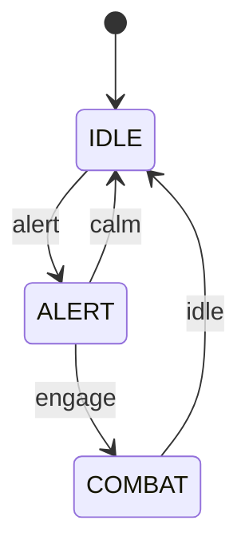

# Finite State Machine (FSM)

You are a game developer tasked with implementing a **Finite State Machine** framework that follows best practices. Your FSM should cleanly separate **states** from **transitions** and avoid the naive `switch/if-else` approach.

## Learning Objectives

- Understand the State Pattern and its advantages over naive implementations
- Implement a clean separation between states and transition logic
- Design reusable and testable FSM components
- Practice encapsulation and polymorphism in C++

## Requirements

Your FSM implementation must:

1. **Separate States and Transitions**: States should not contain transition logic. Transitions should be registered separately with condition functions.
2. **Support State Lifecycle**: Each state must have `onEnter()`, `execute()`, and `onExit()` methods.
3. **Be Data-Driven**: Transitions should be configurable at runtime, not hardcoded.
4. **Be Testable**: The FSM should be easily testable through input/output verification.

## The Scenario: Simple AI Agent

Implement an FSM for a simple AI agent with the following states:



### States

| State    | Description                             |
| -------- | --------------------------------------- |
| `IDLE`   | Agent is resting, not doing anything    |
| `ALERT`  | Agent detected something, investigating |
| `COMBAT` | Agent is engaged in combat              |

### Transitions

| From   | To     | Trigger Command |
| ------ | ------ | --------------- |
| IDLE   | ALERT  | `alert`         |
| ALERT  | COMBAT | `engage`        |
| ALERT  | IDLE   | `calm`          |
| COMBAT | IDLE   | `idle`          |

## Input Format

The input consists of:

1. First line: Initial state name (one of: `IDLE`, `ALERT`, `COMBAT`)
2. Following lines: Commands to process, one per line
3. Input ends at EOF

```
IDLE
alert
engage
idle
```

## Output Format

For each state transition and execution, output:

1. When entering a state: `ENTER:<STATE_NAME>`
2. When executing a state: `EXECUTE:<STATE_NAME>`
3. When exiting a state: `EXIT:<STATE_NAME>`
4. If a command doesn't trigger a valid transition: `INVALID:<COMMAND>`

**Important**: The initial state should trigger `ENTER` and `EXECUTE`. Each command triggers a transition check, and if valid, the full cycle: `EXIT` (old) → `ENTER` (new) → `EXECUTE` (new).

### Example

**Input:**

```
IDLE
alert
engage
idle
```

**Output:**

```
ENTER:IDLE
EXECUTE:IDLE
EXIT:IDLE
ENTER:ALERT
EXECUTE:ALERT
EXIT:ALERT
ENTER:COMBAT
EXECUTE:COMBAT
EXIT:COMBAT
ENTER:IDLE
EXECUTE:IDLE
```

### Example with Invalid Command

**Input:**

```
IDLE
engage
alert
```

**Output:**

```
ENTER:IDLE
EXECUTE:IDLE
INVALID:engage
EXIT:IDLE
ENTER:ALERT
EXECUTE:ALERT
```

## Implementation Hints

Your `fsm.h` should include:

1. **A State base class** with virtual lifecycle methods
2. **Concrete state classes** (IdleState, AlertState, CombatState)
3. **An FSM class** that:
   - Manages registered states
   - Stores transitions as a mapping of (current_state, trigger) → next_state
   - Processes commands and triggers appropriate transitions

### Architecture Suggestion

```cpp
// Pseudocode structure - you need to implement this properly!

class State {
    // Virtual methods for lifecycle
    // A way to identify the state (name/enum)
};

class FSM {
    // Current state pointer
    // Map of states by name
    // Map of transitions: (from_state, trigger) -> to_state

    // Methods to:
    // - Register states
    // - Add transitions
    // - Process commands
    // - Change states (handling exit/enter/execute)
};
```

## What NOT to Do (Naive Approach)

```cpp
// DON'T DO THIS - Hardcoded transitions in switch/if-else
void update(string command) {
    switch(currentState) {
        case IDLE:
            if(command == "alert") currentState = ALERT;
            break;
        case ALERT:
            if(command == "engage") currentState = COMBAT;
            else if(command == "calm") currentState = IDLE;
            break;
        // ... this doesn't scale!
    }
}
```

## Grading Criteria

- **Correctness** (40%): All test cases pass
- **Architecture** (30%): Clean separation of states and transitions
- **Code Quality** (20%): Proper use of OOP principles, readable code
- **Edge Cases** (10%): Handles invalid commands gracefully

## Files to Modify

- `fsm.h` - Your FSM implementation (header-only)

```c++
#ifndef FSM_H
#define FSM_H

#include <string>
#include <map>
#include <memory>
#include <functional>
#include <sstream>

namespace FSM
{

    // ============================================================================
    // HINT: You need to implement a State base class
    //
    // The State class should:
    // - Have a name (string) to identify it
    // - Have virtual lifecycle methods: onEnter(), execute(), onExit()
    // - Each method should output to the provided output stream
    //
    // Example output format:
    //   onEnter()  -> outputs "ENTER:<STATE_NAME>"
    //   execute()  -> outputs "EXECUTE:<STATE_NAME>"
    //   onExit()   -> outputs "EXIT:<STATE_NAME>"
    // ============================================================================

    class State
    {
    public:
        // TODO: Add a constructor that takes the state name
        // TODO: Add a virtual destructor
        // TODO: Add pure virtual methods: onEnter, execute, onExit
        //       These should take an std::ostream& parameter for output
        // TODO: Add a getter for the state name

        // HINT: Something like this structure...
        // explicit State(const std::string& name) : name_(name) {}
        // virtual ~State() = default;
        // virtual void onEnter(std::ostream& out) = 0;
        // ...

    protected:
        // TODO: Store the state name
        // std::string name_;
    };

    // ============================================================================
    // HINT: Implement concrete state classes
    //
    // You need: IdleState, AlertState, CombatState
    // Each should inherit from State and implement the lifecycle methods
    // ============================================================================

    // TODO: Implement IdleState
    // class IdleState : public State { ... };

    // TODO: Implement AlertState
    // class AlertState : public State { ... };

    // TODO: Implement CombatState
    // class CombatState : public State { ... };

    // ============================================================================
    // HINT: The FSM class manages states and transitions
    //
    // Key design points:
    // - Store states in a map by name for easy lookup
    // - Store transitions as: map<pair<from_state, trigger>, to_state>
    //   Or alternatively: map<from_state, map<trigger, to_state>>
    // - The FSM should NOT contain hardcoded transition logic!
    // ============================================================================

    class FiniteStateMachine
    {
    public:
        // TODO: Add methods to:

        // 1. Register a state (add it to the states map)
        void registerState(std::shared_ptr<State> state)
        {
            throw std::runtime_error("Not implemented");
        };

        // 2. Add a transition (from_state + trigger -> to_state)
        void addTransition(const std::string &from, const std::string &trigger, const std::string &to)
        {
            throw std::runtime_error("Not implemented");
        };

        // 3. Set the initial state (enter it and execute)
        void setInitialState(const std::string &stateName, std::ostream &out)
        {
            throw std::runtime_error("Not implemented");
        };

        // 4. Process a command/trigger
        //    - If valid transition exists: exit current, enter new, execute new
        //    - If no valid transition: output "INVALID:<command>"
        void processCommand(const std::string &command, std::ostream &out)
        {
            throw std::runtime_error("Not implemented");
        };

        // 5. Get current state name (useful for testing)
        std::string getCurrentStateName() const
        {
            throw std::runtime_error("Not implemented");
        };

    private:
        // TODO: Add member variables

        // HINT: You'll need something like(but feel free to do differently):
        // std::map<std::string, std::shared_ptr<State>> states_;
        // std::map<std::pair<std::string, std::string>, std::string> transitions_;
        // std::shared_ptr<State> currentState_;

        // HINT: Helper method to change states properly
        // void changeState(const std::string& newStateName, std::ostream& out);
    };

    // ============================================================================
    // HINT: Factory function to create a pre-configured FSM for the AI agent
    //
    // This function should:
    // 1. Create a FiniteStateMachine
    // 2. Register all three states (IDLE, ALERT, COMBAT)
    // 3. Add all four transitions:
    //    - IDLE + "alert" -> ALERT
    //    - ALERT + "engage" -> COMBAT
    //    - ALERT + "calm" -> IDLE
    //    - COMBAT + "idle" -> IDLE
    // 4. Return the configured FSM
    // ============================================================================

    inline FiniteStateMachine createAgentFSM()
    {
        throw std::runtime_error("Not implemented");

        // FiniteStateMachine fsm;
        // TODO: Register states and transitions on the registry
        // return fsm;
    }

    // ============================================================================
    // HINT: Helper function to run the FSM from input stream
    //
    // This reads:
    // 1. Initial state name (first line)
    // 2. Commands (remaining lines until EOF)
    //
    // And writes all FSM output to the output stream
    // ============================================================================

    inline std::string runFSM(const std::string &input)
    {
        throw std::runtime_error("Not implemented");

        std::istringstream in(input);
        std::ostringstream out;

        // TODO:
        // 1. Create the agent FSM using createAgentFSM()
        // 2. Read initial state from input
        // 3. Set the initial state
        // 4. Read and process each command

        // HINT: Something like:
        // auto fsm = createAgentFSM();
        // std::string initialState;
        // in >> initialState;
        // fsm.setInitialState(initialState, out);
        //
        // std::string command;
        // while (in >> command) {
        //     fsm.processCommand(command, out);
        // }

        return out.str();
    }

} // namespace FSM

#endif // FSM_H
```
