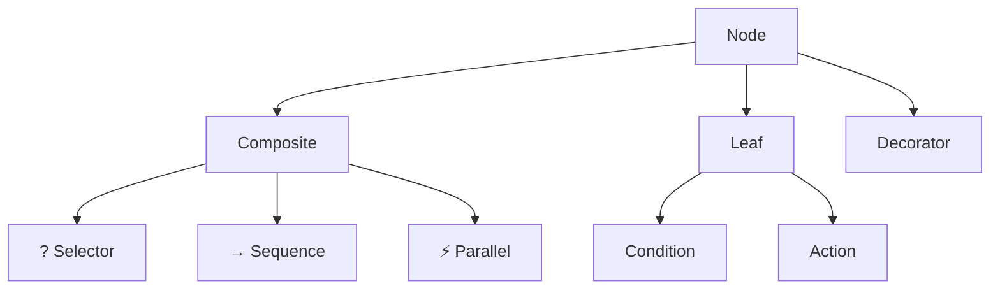
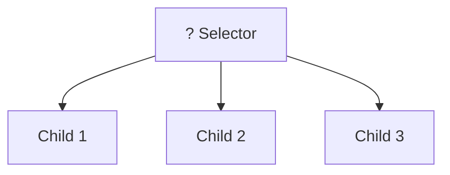
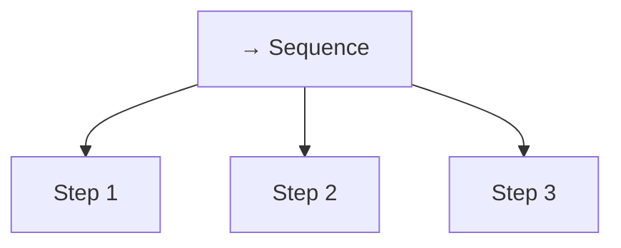
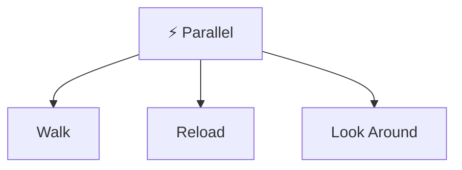
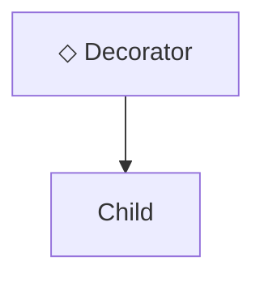
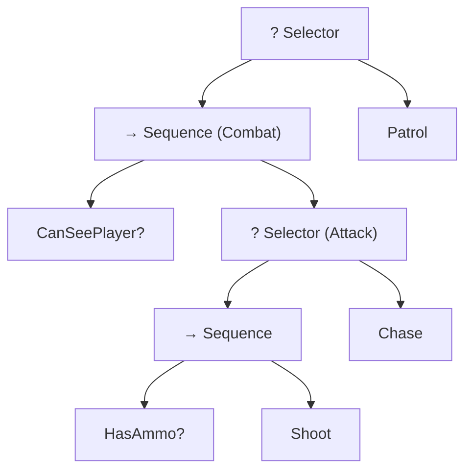
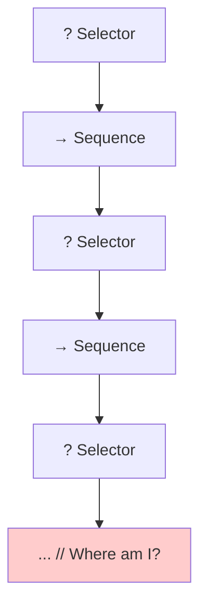
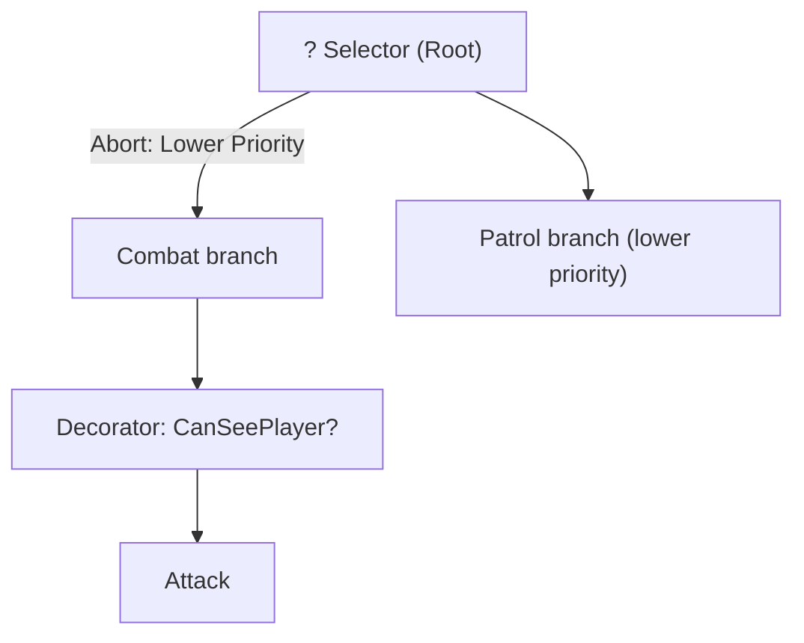

# Behavior Trees

Week 02: The Cornerstone of Modern Game AI

---

## Roadmap

- The Problem: Spaghetti AI
- Core Concepts: Status, Nodes, Composites
- Selector & Sequence
- Parallel & Decorators
- Industry Examples (F.E.A.R., Halo, Horizon Zero Dawn)
- Production Patterns & Anti-Patterns
- Event-Driven BTs & Abort Modes

---

## The Problem

How beginners write AI:

```cpp
void Enemy::update() {
    if (health <= 0) {
        die();
    } else if (health < 20) {
        flee();
    } else if (canSeePlayer()) {
        if (hasAmmo()) {
            shoot();
        } else {
            chase();
        }
    } else {
        patrol();
    }
}
```

---

## Why This Breaks

- **Unmaintainable**: Adding behaviors means touching everything
- **Hard to debug**: Which branch executed? Why?
- **No reuse**: Can't share logic between enemy types
- **Scaling nightmare**: 50+ behaviors = 🍝

> "By the end of Halo 2, our AI code was a mess of special cases." — Damián Isla, GDC 2005

---

## The Solution

**Behavior Trees** separate:

- _What to check_ (conditions)
- _What to do_ (actions)
- _How decisions flow_ (composites)

Used in: Halo 2/3/Reach, F.E.A.R., Crysis, The Division, Horizon Zero Dawn, God of War, Unreal Engine...

---

# Core Concepts

The Building Blocks

---

## The Three Magic Words

Every BT node returns exactly one of:

| Status      | Meaning                                  |
| ----------- | ---------------------------------------- |
| **Success** | "I did it!"                              |
| **Failure** | "I can't do it"                          |
| **Running** | "Still working, ask me again next frame" |

```cpp
enum class Status { Success, Failure, Running };
```

---

## Node Types Overview



---

## Leaf Nodes: Conditions

**Instant checks** — never return Running

```cpp
// "Can I see the player?" → Yes (Success) or No (Failure)
class CanSeePlayer : public Node {
    Status tick() override {
        return guard->canSeePlayer
            ? Status::Success
            : Status::Failure;
    }
};
```

Examples: `HasAmmo?`, `IsHealthLow?`, `IsPlayerInRange?`

---

## Leaf Nodes: Actions

**Do something** — can return Running

```cpp
// "Shoot!" → Done (Success) or Still shooting (Running)
class Shoot : public Node {
    Status tick() override {
        guard->ammo--;
        std::cout << "Bang!\n";
        return Status::Success;
    }
};
```

Examples: `MoveTo`, `Attack`, `PlayAnimation`, `Wait`

---

# Composite Nodes

How Decisions Flow

---

## Selector = "Try Until Something Works"



**OR logic**: Try plan A. If that fails, try plan B...

| Child returns... | Selector does...          |
| ---------------- | ------------------------- |
| Success          | Stop → return **Success** |
| Failure          | Try next child            |
| Running          | Stop → return **Running** |

---

## Selector: The Code

```cpp
class Selector : public Node {
    std::vector<NodePtr> children;
public:
    Status tick() override {
        for (auto& child : children) {
            Status s = child->tick();
            if (s != Status::Failure)
                return s;  // Success or Running
        }
        return Status::Failure;  // All failed
    }
};
```

---

## Sequence = "Do All Steps In Order"



**AND logic**: Do step 1, then 2, then 3. Any failure = total failure.

| Child returns... | Sequence does...          |
| ---------------- | ------------------------- |
| Success          | Move to next child        |
| Failure          | Stop → return **Failure** |
| Running          | Stop → return **Running** |

---

## Sequence: The Code

```cpp
class Sequence : public Node {
    std::vector<NodePtr> children;
public:
    Status tick() override {
        for (auto& child : children) {
            Status s = child->tick();
            if (s != Status::Success)
                return s;  // Failure or Running
        }
        return Status::Success;  // All succeeded
    }
};
```

---

## Parallel = "Do Multiple Things At Once"



Run all children simultaneously until a policy is met.

| Policy     | Behavior                          |
| ---------- | --------------------------------- |
| RequireOne | Success when ANY child succeeds   |
| RequireAll | Success when ALL children succeed |
| FailOnAny  | Failure when ANY child fails      |

---

## Parallel: Use Cases

- **Walk while reloading**: Both must complete
- **Patrol while listening**: Either can trigger transition
- **Aim while moving**: Continuous parallel actions

```cpp
// Enemy walks AND scans for threats simultaneously
Parallel(RequireAll) {
    MoveTo(waypoint),
    ScanForThreats()
}
```

---

# Decorators

Modify Child Behavior

---

## Decorator Types



| Decorator     | Effect                           |
| ------------- | -------------------------------- |
| **Inverter**  | Flip Success ↔ Failure           |
| **Repeater**  | Run N times                      |
| **Succeeder** | Always return Success            |
| **UntilFail** | Loop until child fails           |
| **Cooldown**  | Block re-execution for X seconds |
| **Timeout**   | Force Failure after X seconds    |

---

## Inverter: "If NOT..."

```cpp
class Inverter : public Node {
    NodePtr child;
public:
    Status tick() override {
        Status s = child->tick();
        if (s == Status::Success) return Status::Failure;
        if (s == Status::Failure) return Status::Success;
        return Status::Running;
    }
};
```

Use case: `Inverter(CanSeePlayer)` → "If player NOT visible"

---

## Repeater: "Do N Times"

```cpp
class Repeat : public Node {
    NodePtr child;
    int count, current = 0;
public:
    Status tick() override {
        while (current < count) {
            Status s = child->tick();
            if (s == Status::Running) return Status::Running;
            if (s == Status::Failure) return Status::Failure;
            current++;
        }
        current = 0;
        return Status::Success;
    }
};
```

Use case: "Fire 3 shots", "Patrol 5 waypoints"

---

# Putting It Together

A Complete Guard AI

---

## Guard AI: The Tree



---

## Guard AI: Frame-by-Frame

**No player visible:**

```
Selector tries Combat...
  Sequence checks CanSeePlayer? → Failure
Selector tries Patrol...
  Patrol → Running
```

**Player spotted, has ammo:**

```
Selector tries Combat...
  Sequence checks CanSeePlayer? → Success
  Attack tries Shoot...
    HasAmmo? → Success
    Fire → Success
```

---

## Guard AI: Out of Ammo

**Player visible, no ammo:**

```
Selector tries Combat...
  Sequence checks CanSeePlayer? → Success
  Attack tries Shoot...
    HasAmmo? → Failure
  Attack tries Chase...
    Chase → Running
```

The tree naturally falls back to chasing!

---

# Industry Case Studies

How AAA Games Use BTs

---

## Halo 2: The Birth of BTs in Games

> "We needed AI that could handle Halo's open combat spaces without scripting every situation."

— Damián Isla, Bungie (GDC 2005)

- First major use of BTs in AAA
- Replaced FSMs that couldn't scale
- Enabled emergent combat behaviors

---

## F.E.A.R.: GOAP vs BTs

Jeff Orkin's 2006 GDC talk: "Three States and a Plan"

| Approach | F.E.A.R.         | Most Games Today |
| -------- | ---------------- | ---------------- |
| System   | GOAP             | Behavior Trees   |
| Strength | Dynamic planning | Designer control |
| Weakness | Hard to debug    | Less emergent    |

Modern trend: **Hybrid** — BTs with utility scoring

---

## Horizon Zero Dawn

GDC 2018: "Beyond Killzone: Creating New AI"

- 25+ unique machine types
- All powered by Behavior Trees
- Key insight: **Subtree composition**

```
MachineBase.bt
├── CombatSubtree.bt
├── AlertSubtree.bt
└── IdleSubtree.bt

Watcher extends MachineBase with custom overrides
```

---

## The Division: Production BTs

GDC 2016: "AI Behavior Editing and Debugging"

Key tools:

- **Visual BT editor** in Snowdrop engine
- **Real-time highlighting** of active nodes
- **Recording & replay** of decision sequences
- **Breakpoints** on specific nodes

> "Reading code and mentally simulating is the LEAST effective debugging approach."

---

## God of War Ragnarok

GDC 2023: "Preparing AI Systems for God of War Ragnarok"

- Migrated from Lua scripts to Behavior Trees
- Enhanced awareness systems
- BTs control 100+ enemy types

Challenge: Balancing designer control with systemic behaviors

---

# Production Patterns

What Works at Scale

---

## Pattern: Blackboard

Decouple nodes from game state:

```cpp
// BAD: Node directly accesses game state
if (player->health < 20) ...

// GOOD: Node reads from blackboard
if (blackboard->get<int>("player_health") < 20) ...
```

Benefits:

- Testable in isolation
- Easy to mock for debugging
- Shareable between trees

---

## Pattern: Subtree Composition

Don't copy-paste node structures:

```cpp
// Define once
SubTree("CombatBehavior") {
    Sequence {
        CanSeePlayer,
        Attack
    }
}

// Reuse everywhere
GuardTree {
    Selector {
        SubTree("CombatBehavior"),  // ← Reuse
        Patrol
    }
}
```

---

## Pattern: Utility Selector

Replace fixed priorities with dynamic scoring:

```cpp
class UtilitySelector : public Node {
    Status tick() override {
        // Score each child based on context
        sortChildrenByUtility();

        // Then run like normal Selector
        for (auto& child : children) {
            Status s = child->tick();
            if (s != Status::Failure) return s;
        }
        return Status::Failure;
    }
};
```

---

# Anti-Patterns

What to Avoid

---

## Anti-Pattern: God Node

❌ **Bad**: Single node with too much logic

```cpp
class CombatNode : public Node {
    Status tick() override {
        if (canSee && hasAmmo && inRange) shoot();
        else if (canSee && !hasAmmo) chase();
        else if (heardNoise) investigate();
        else patrol();
        // ... 200 more lines
    }
};
```

✅ **Fix**: Decompose into tree structure

---

## Anti-Pattern: Deep Nesting

❌ **Bad**: 10+ levels deep



✅ **Fix**: Extract subtrees, flatten with utility

---

## Anti-Pattern: Global State Mutation

❌ **Bad**: Nodes directly modify game state

```cpp
class Attack : public Node {
    Status tick() override {
        game->player->takeDamage(10);  // Direct mutation
        game->score += 100;            // Side effect
    }
};
```

✅ **Fix**: Use commands/events, let game handle mutations

---

# Event-Driven BTs

Beyond Tick-Based Evaluation

---

## The Problem with Ticking

Every frame:

```cpp
void update() {
    tree->tick();  // Re-evaluate EVERYTHING
}
```

Even if nothing changed, we check every condition.

**Wasteful** for large trees with many agents.

---

## Event-Driven Solution

Only re-evaluate when relevant state changes:

```cpp
// Blackboard notifies tree of changes
blackboard->set("player_visible", true);
// → Triggers re-evaluation of dependent branches only

// Observer pattern
tree->observe("player_visible", [](bool val) {
    if (val) reevaluateCombatBranch();
});
```

Unreal Engine BTs use this approach.

---

## Unreal Engine: Abort Modes

| Mode           | Behavior                                      |
| -------------- | --------------------------------------------- |
| None           | Never abort                                   |
| Lower Priority | Abort if higher-priority branch becomes valid |
| Self           | Abort self if condition changes               |
| Both           | Abort in both directions                      |

---

## Abort Mode Example



Guard is patrolling. Player appears.

- Combat's decorator triggers
- Patrol is **aborted**
- Combat executes immediately

---

## Remembering Running State

Basic implementation restarts from root:

```cpp
// Frame 1: Chase returns Running
// Frame 2: Tree starts over from root!
```

Fix: Track current child index:

```cpp
class Sequence : public Node {
    size_t currentIndex = 0;  // Remember position

    Status tick() override {
        while (currentIndex < children.size()) {
            Status s = children[currentIndex]->tick();
            if (s == Status::Running) return Running;
            if (s == Status::Failure) {
                currentIndex = 0;
                return Failure;
            }
            currentIndex++;
        }
        currentIndex = 0;
        return Success;
    }
};
```

---

# Debugging BTs

Production Techniques

---

## Visual Debugging

Essential tools:

1. **Tree visualization** with active node highlighting
2. **Blackboard inspector** showing current values
3. **History log** of status returns with timestamps
4. **Breakpoints** on specific nodes or conditions

The Division's approach: record → replay → analyze

---

## Logging Strategy

```cpp
Status tick() override {
    LOG("[%s] tick() called", nodeName);
    Status s = doWork();
    LOG("[%s] returned %s", nodeName, toString(s));
    return s;
}
```

Production: Toggle per-node, per-tree, or global.

---

# Summary

---

## Key Takeaways

1. **Three statuses**: Success, Failure, Running
2. **Selector** = OR logic (fallback)
3. **Sequence** = AND logic (steps)
4. **Decorators** modify child behavior
5. **Blackboards** decouple state
6. **Event-driven** BTs scale better
7. **Avoid**: God nodes, deep nesting, global state

---

## When to Use BTs

✅ **Use BTs when:**

- Multiple behaviors with clear priorities
- Designers need to tweak AI
- Behaviors are reusable across entities

❌ **Consider alternatives when:**

- Simple 2-3 state systems (use FSM)
- Highly dynamic planning needed (use GOAP)
- Pure reaction chains (use rule systems)

---

# Questions?

Week 02: Behavior Trees
