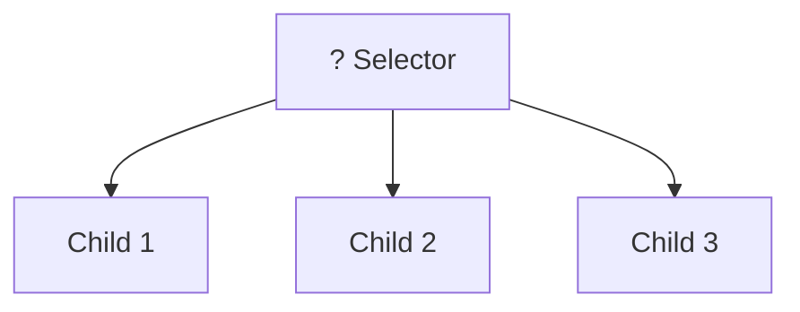
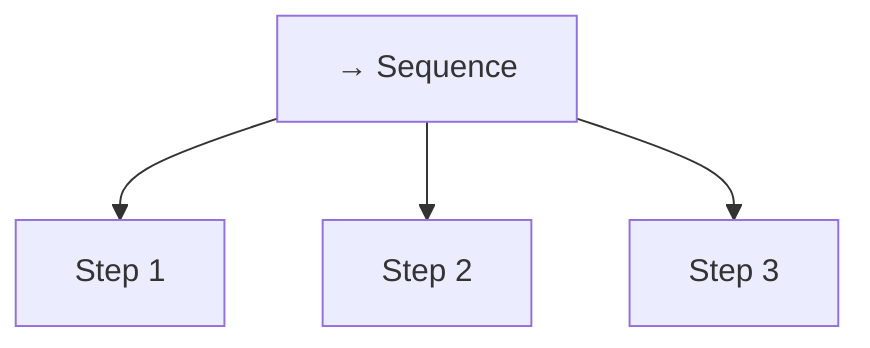
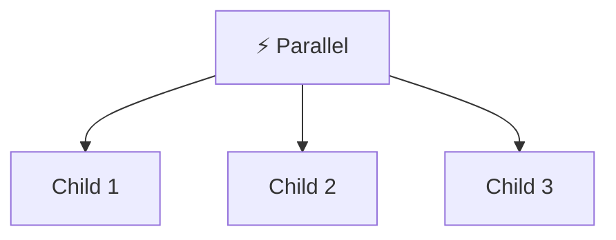
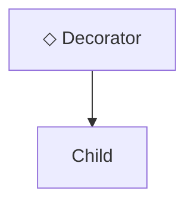
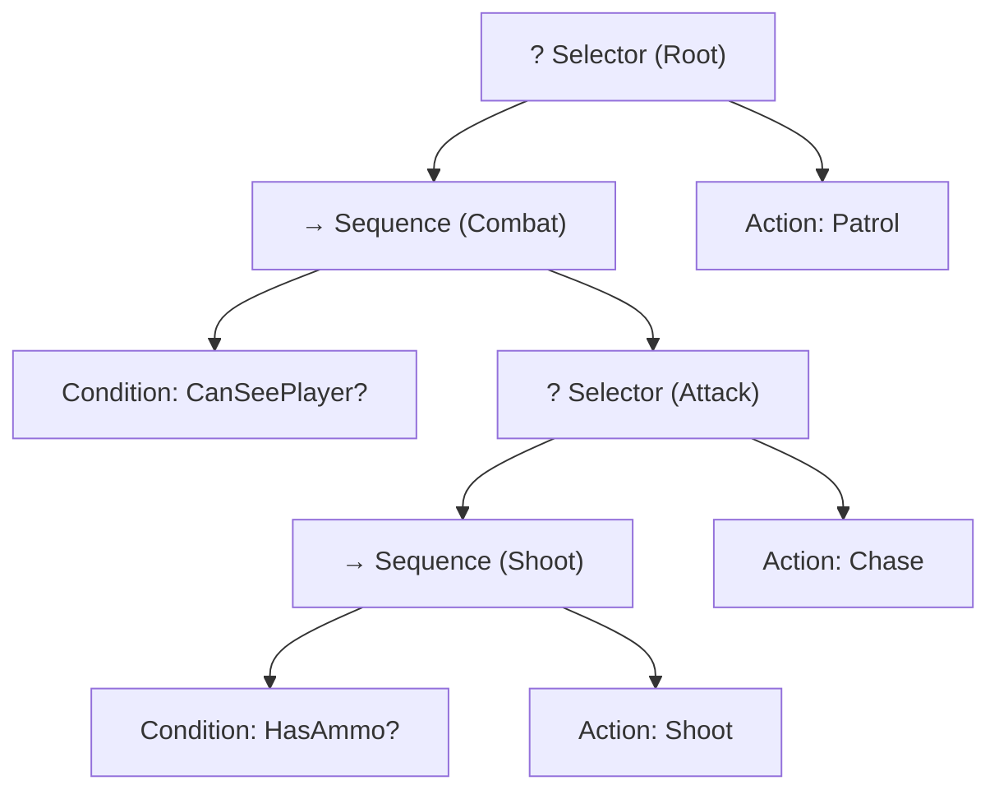

# Behavior Trees

## 1. The Problem: Spaghetti AI

Here's how beginners write AI:

```cpp
void Enemy::update() {
    if (health <= 0) {
        die();
    } else if (health < 20) {
        flee();
    } else if (canSeePlayer()) {
        if (hasAmmo()) {
            shoot();
        } else {
            chase();
        }
    } else {
        patrol();
    }
}
```

This quickly becomes unmaintainable. Adding new behaviors means touching everything.

**Solution**: Behavior Trees separate _what to check_ from _how decisions flow_.

---

## 2. The Three Magic Words

Every behavior tree node returns one of three values:

| Status      | Meaning                                  |
| ----------- | ---------------------------------------- |
| **Success** | "I did it!"                              |
| **Failure** | "I can't do it"                          |
| **Running** | "Still working, ask me again next frame" |

That's it. Every node answers: _"Did you succeed, fail, or are you still working?"_

```cpp
enum class Status { Success, Failure, Running };
```

---

## 3. Two Types of Leaf Nodes

Leaf nodes do actual work:

### Conditions — Instant checks

```cpp
// "Can I see the player?" → Yes (Success) or No (Failure)
bool canSeePlayer();  // Returns true/false instantly
```

Conditions **never** return Running. They check and answer immediately.

### Actions — Do something

```cpp
// "Shoot!" → Done (Success) or Still shooting (Running)
Status shoot();  // Might take multiple frames
```

Actions **can** return Running if they take time.

---

## 4. Selector = "Try Until Something Works"

A **Selector** tries each child in order until one succeeds.



**Think of it as**: "Try plan A. If that fails, try plan B. If that fails, try plan C."

| If child returns... | Selector does...            |
| ------------------- | --------------------------- |
| Success             | Stop and return **Success** |
| Failure             | Try the next child          |
| Running             | Stop and return **Running** |

```cpp
// Pseudocode
for each child:
    result = child.tick()
    if result != Failure:
        return result
return Failure  // All children failed
```

---

## 5. Sequence = "Do All Steps In Order"

A **Sequence** runs each child in order. All must succeed.



**Think of it as**: "Do step 1, then step 2, then step 3. If any step fails, the whole thing fails."

| If child returns... | Sequence does...            |
| ------------------- | --------------------------- |
| Success             | Move to next child          |
| Failure             | Stop and return **Failure** |
| Running             | Stop and return **Running** |

```cpp
// Pseudocode
for each child:
    result = child.tick()
    if result != Success:
        return result
return Success  // All children succeeded
```

---

## 6. Parallel = "Do Multiple Things At Once"

A **Parallel** node runs all children simultaneously until a policy is met.



**Think of it as**: "Do all these things at the same time until X succeeds or Y fails."

Common policies:

| Policy                 | Behavior                                           |
| ---------------------- | -------------------------------------------------- |
| **RequireOne**         | Return Success when any child succeeds             |
| **RequireAll**         | Return Success only when all children succeed      |
| **RequireOne + Abort** | Return Failure when any child fails (abort others) |

```cpp
// Pseudocode (RequireAll policy)
Status tick() {
    int successes = 0;
    int failures = 0;

    for each child:
        result = child.tick()
        if result == Success: successes++
        if result == Failure: failures++

    if failures > 0: return Failure
    if successes == children.size(): return Success
    return Running  // Still waiting on some children
}
```

**Use case**: An enemy that simultaneously patrols and listens for sounds, or a character that walks while reloading.

---

## 7. Decorator = "Modify a Child's Behavior"

A **Decorator** wraps a single child and changes its behavior or result.



**Common decorator types:**

### Inverter — Flip success/failure

```cpp
class Inverter : public Node {
    NodePtr child;
public:
    Status tick() override {
        Status s = child->tick();
        if (s == Status::Success) return Status::Failure;
        if (s == Status::Failure) return Status::Success;
        return Status::Running;
    }
};
```

**Use case**: "If NOT can see player" — invert a condition check.

### Repeater — Run N times

```cpp
class Repeat : public Node {
    NodePtr child;
    int count;
    int current = 0;
public:
    Repeat(NodePtr c, int n) : child(c), count(n) {}

    Status tick() override {
        while (current < count) {
            Status s = child->tick();
            if (s == Status::Running) return Status::Running;
            if (s == Status::Failure) return Status::Failure;
            current++;
        }
        current = 0;
        return Status::Success;
    }
};
```

**Use case**: "Shoot 3 times in a row" or "Patrol 5 waypoints".

### Succeeder / Failer — Force a result

```cpp
class AlwaysSucceed : public Node {
    NodePtr child;
public:
    Status tick() override {
        child->tick();
        return Status::Success;  // Ignore child's actual result
    }
};
```

**Use case**: Make a branch always succeed regardless of outcome, useful for optional tasks.

### UntilFail / UntilSucceed — Loop conditions

```cpp
class UntilFail : public Node {
    NodePtr child;
public:
    Status tick() override {
        Status s = child->tick();
        if (s == Status::Failure) return Status::Success;
        return Status::Running;  // Keep going
    }
};
```

**Use case**: "Keep patrolling until you spot the player" (patrol until CanSeePlayer fails).

---

## 8. Putting It Together: A Guard AI



### How It Runs

**Frame 1: No player visible**

```
Root (Selector) tries Combat...
  Combat (Sequence) checks CanSeePlayer? → Failure
  Combat fails
Root tries Patrol...
  Patrol → Running
Root returns Running
```

**Frame 2: Player spotted, has ammo**

```
Root tries Combat...
  Combat checks CanSeePlayer? → Success
  Combat tries Attack (Selector)...
    Attack tries Shoot (Sequence)...
      Shoot checks HasAmmo? → Success
      Shoot does Fire → Success
    Attack returns Success
  Combat returns Success
Root returns Success
```

**Frame 3: Player visible, no ammo**

```
Root tries Combat...
  Combat checks CanSeePlayer? → Success
  Combat tries Attack...
    Attack tries Shoot...
      Shoot checks HasAmmo? → Failure
    Shoot fails, Attack tries Chase...
      Chase → Running
    Attack returns Running
  Combat returns Running
Root returns Running
```

---

## 9. The Code (Minimal Version)

```cpp
#include <iostream>
#include <vector>
#include <memory>

enum class Status { Success, Failure, Running };

// Base node
class Node {
public:
    virtual ~Node() = default;
    virtual Status tick() = 0;
};

using NodePtr = std::shared_ptr<Node>;

// Selector: try children until one succeeds
class Selector : public Node {
    std::vector<NodePtr> children;
public:
    void add(NodePtr child) { children.push_back(child); }

    Status tick() override {
        for (auto& child : children) {
            Status s = child->tick();
            if (s != Status::Failure) return s;
        }
        return Status::Failure;
    }
};

// Sequence: run children until one fails
class Sequence : public Node {
    std::vector<NodePtr> children;
public:
    void add(NodePtr child) { children.push_back(child); }

    Status tick() override {
        for (auto& child : children) {
            Status s = child->tick();
            if (s != Status::Success) return s;
        }
        return Status::Success;
    }
};
```

### Custom Nodes for Your Game

```cpp
// The guard we're controlling
struct Guard {
    bool canSeePlayer = false;
    int ammo = 3;
};

Guard* guard;  // Set this before ticking the tree

// Condition: Can see player?
class CanSeePlayer : public Node {
    Status tick() override {
        return guard->canSeePlayer ? Status::Success : Status::Failure;
    }
};

// Condition: Has ammo?
class HasAmmo : public Node {
    Status tick() override {
        return guard->ammo > 0 ? Status::Success : Status::Failure;
    }
};

// Action: Shoot
class Shoot : public Node {
    Status tick() override {
        guard->ammo--;
        std::cout << "Bang! Ammo: " << guard->ammo << "\n";
        return Status::Success;
    }
};

// Action: Patrol
class Patrol : public Node {
    Status tick() override {
        std::cout << "Patrolling...\n";
        return Status::Running;
    }
};

// Action: Chase
class Chase : public Node {
    Status tick() override {
        std::cout << "Chasing!\n";
        return Status::Running;
    }
};
```

### Building and Running the Tree

```cpp
int main() {
    // Create guard
    Guard g;
    guard = &g;

    // Build tree
    auto root = std::make_shared<Selector>();

    auto combat = std::make_shared<Sequence>();
    combat->add(std::make_shared<CanSeePlayer>());

    auto attack = std::make_shared<Selector>();
    auto shoot = std::make_shared<Sequence>();
    shoot->add(std::make_shared<HasAmmo>());
    shoot->add(std::make_shared<Shoot>());
    attack->add(shoot);
    attack->add(std::make_shared<Chase>());
    combat->add(attack);

    root->add(combat);
    root->add(std::make_shared<Patrol>());

    // Simulate
    std::cout << "--- No player ---\n";
    g.canSeePlayer = false;
    root->tick();

    std::cout << "--- Player spotted ---\n";
    g.canSeePlayer = true;
    root->tick();
    root->tick();
    root->tick();

    std::cout << "--- Out of ammo ---\n";
    root->tick();

    return 0;
}
```

**Output:**

```
--- No player ---
Patrolling...
--- Player spotted ---
Bang! Ammo: 2
Bang! Ammo: 1
Bang! Ammo: 0
--- Out of ammo ---
Chasing!
```

---

## 10. Remembering Where You Paused

The simple code above has a flaw: it forgets where it was.

If Chase returns Running, next frame the tree starts over from the top. Usually that's fine (re-evaluate priorities), but sometimes you want to _resume_ a long action.

**Fix**: Track which child you're on:

```cpp
class Sequence : public Node {
    std::vector<NodePtr> children;
    size_t currentIndex = 0;  // Remember position

public:
    Status tick() override {
        while (currentIndex < children.size()) {
            Status s = children[currentIndex]->tick();
            if (s == Status::Running) return Status::Running;
            if (s == Status::Failure) { currentIndex = 0; return Status::Failure; }
            currentIndex++;
        }
        currentIndex = 0;
        return Status::Success;
    }
};
```

This lets multi-frame actions complete before moving on.

::: warning

Production engines often add **abort modes** (ex: Unreal’s “Lower Priority” / “Self”) to preempt a running branch when a higher-priority condition becomes true. Our minimal code here does **not** implement aborts; expect standard tick-based behavior. We’ll dive deeper into abort modes and event-driven BTs (see Unreal docs).

:::

---

## 11. Extensions as challenge (Optional)

1. **Add Flee**: Insert a flee behavior that triggers when health < 20. It should have higher priority than combat.

2. **Add Reload**: When out of ammo, the guard should reload (return Running for 3 frames, then Success) before shooting.

3. **Add Investigate**: When the guard hears a noise, investigate the location before returning to patrol.
