# MinMax & Alpha-Beta Pruning

## Adversarial Search for Two-Player Games

---

## Agenda

1. Two-Player Zero-Sum Games
2. Game Trees
3. The Minimax Algorithm
4. Alpha-Beta Pruning
5. Move Ordering & Optimizations

---

## Two-Player Zero-Sum Games

---

### What is a Zero-Sum Game?

- Two players take turns
- One player's gain = other player's loss
- Total utility sums to zero

**Examples:** Chess, Checkers, Tic-Tac-Toe, Go

---

### Players

- **MAX** — wants to maximize the score
- **MIN** — wants to minimize the score

We typically design AI for MAX player

---

### Game State

A game state includes:

- Current board configuration
- Whose turn it is
- Any special conditions (castling rights, en passant, etc.)

---

## Game Trees

---

### What is a Game Tree?

A tree where:

- **Nodes** = game states
- **Edges** = moves
- **Leaves** = terminal states (win/lose/draw/evaluate)

---

### Simple Game Tree

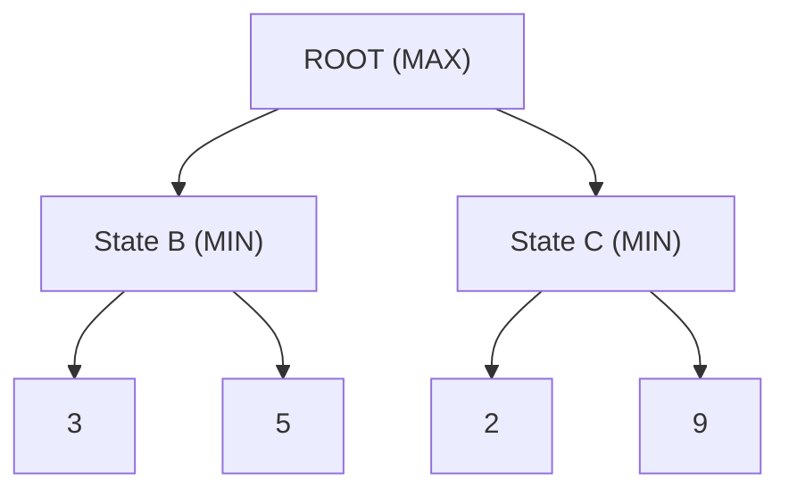

---

### Terminal States

Leaf nodes have **utility values**:

- $+\infty$ or large positive = MAX wins
- $-\infty$ or large negative = MIN wins
- $0$ = draw

---

### Evaluation Functions

For non-terminal nodes at depth limit:

```
eval(state) = weighted sum of features
```

**Chess example:**

```
eval = 9×(Q) + 5×(R) + 3×(B+N) + 1×(P) + positional_bonus
```

---

## The Minimax Algorithm

---

### Core Idea

> Each player plays **optimally**

- MAX picks move with **highest** value
- MIN picks move with **lowest** value

---

### Minimax Recursion

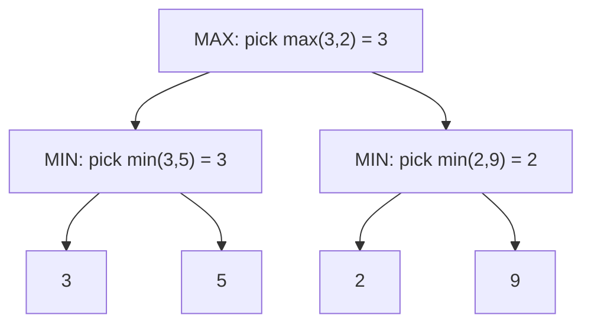

---

### Minimax Pseudocode

```cpp
int minimax(State& state, int depth, bool isMaxPlayer) {
    if (depth == 0 || isTerminal(state))
        return evaluate(state);

    if (isMaxPlayer) {
        int value = INT_MIN;
        for (auto& child : getChildren(state))
            value = std::max(value, minimax(child, depth - 1, false));
        return value;
    } else {
        int value = INT_MAX;
        for (auto& child : getChildren(state))
            value = std::min(value, minimax(child, depth - 1, true));
        return value;
    }
}
```

---

### Negamax Simplification

Key insight: $\max(a, b) = -\min(-a, -b)$

In a zero-sum game: **my score = -opponent's score**

```cpp
int negamax(State& state, int depth) {
    if (depth == 0 || isTerminal(state))
        return evaluate(state);

    int value = INT_MIN;
    for (auto& child : getChildren(state))
        value = std::max(value, -negamax(child, depth - 1));
    return value;
}
```

---

### Why Negamax Works

- Always maximize from current player's perspective
- Negate child values (opponent's best = our worst)
- Evaluation function must return score relative to current player
- One function instead of two branches

---

### Minimax Complexity

- **Branching factor:** $b$ (e.g., ~35 for chess)
- **Depth:** $d$
- **Time:** $O(b^d)$
- **Space:** $O(d)$

Chess: $35^{10} = 2.7 \times 10^{15}$ nodes (intractable!)

---

## Minimax Step-by-Step

---

### Step 1: Start at Root

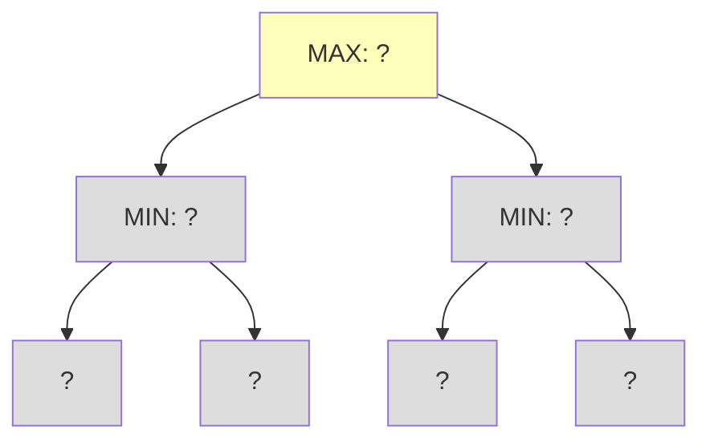

Begin at root (MAX node). Need to evaluate children first.

---

### Step 2: Go to First Child

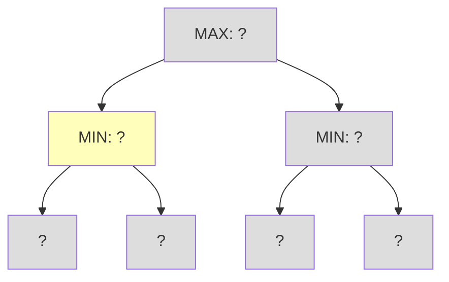

Descend to left child (MIN node). Need to evaluate its children.

---

### Step 3: Evaluate First Leaf

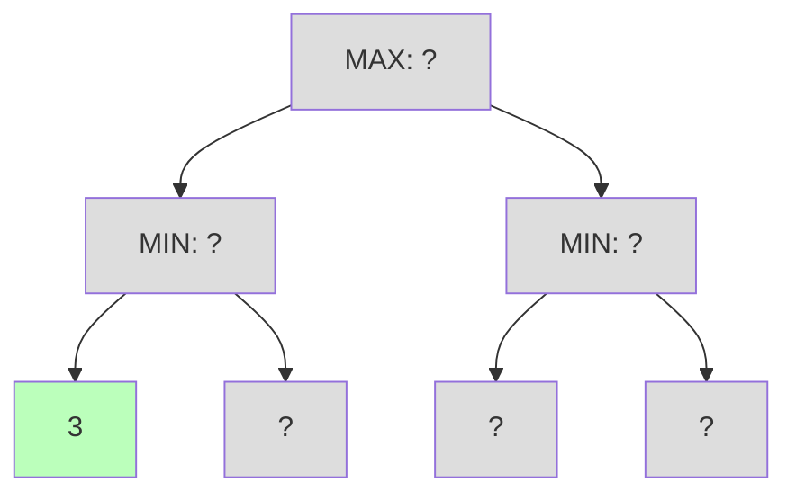

Reach leaf node. Return evaluation: **3**

---

### Step 4: Evaluate Second Leaf

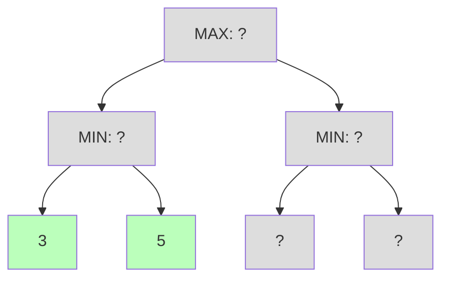

Reach second leaf. Return evaluation: **5**

---

### Step 5: MIN Chooses Minimum

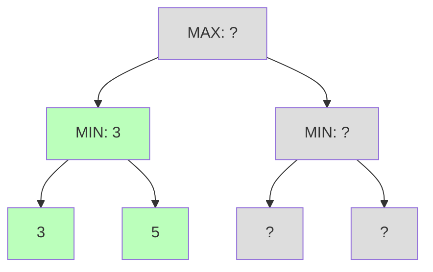

MIN picks minimum of children: **min(3, 5) = 3**

---

### Step 6: Explore Right Subtree

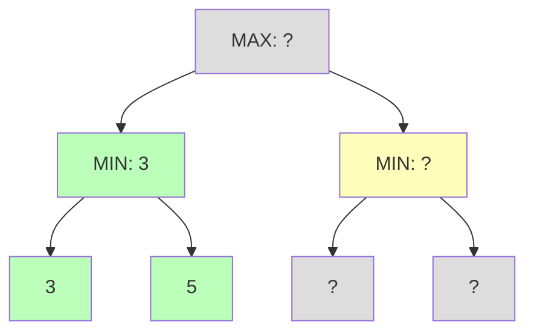

Move to right child (MIN node). Need to evaluate its children.

---

### Step 7: Evaluate Third Leaf

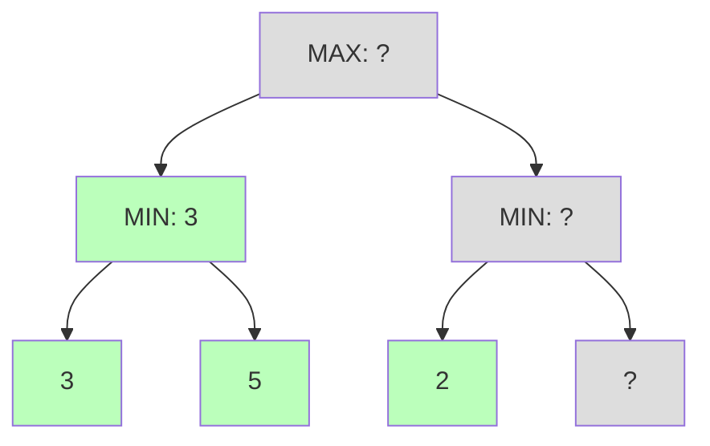

Reach leaf node. Return evaluation: **2**

---

### Step 8: Evaluate Fourth Leaf

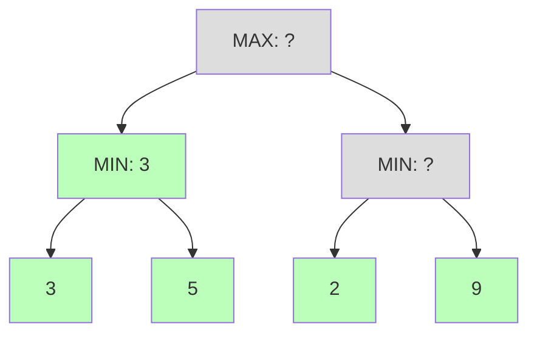

Reach last leaf. Return evaluation: **9**

---

### Step 9: MIN Chooses Minimum

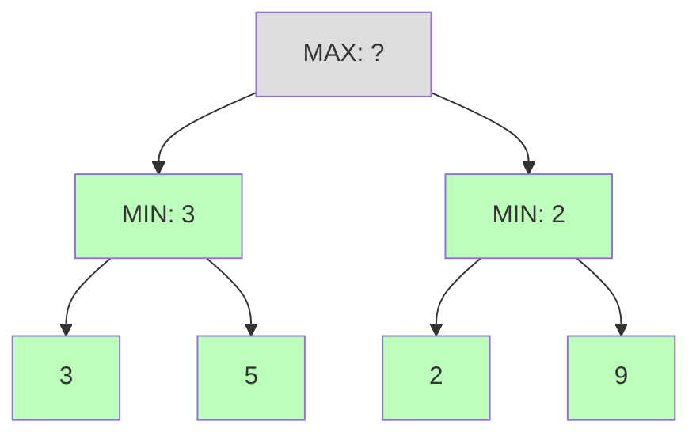

MIN picks minimum of children: **min(2, 9) = 2**

---

### Step 10: MAX Chooses Maximum

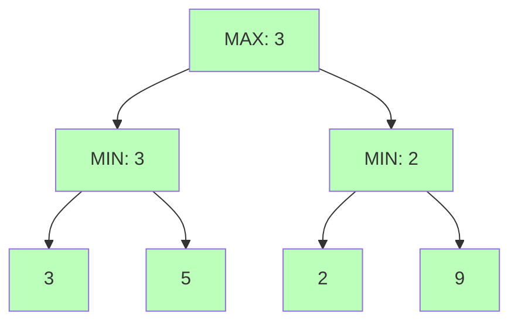

MAX picks maximum of children: **max(3, 2) = 3**

Best move leads to value **3**.

---

## Alpha-Beta Pruning

---

### The Key Insight

> If we already found a good move, we don't need to evaluate moves that the opponent would never allow.

---

### Alpha and Beta

- $\alpha$ = best value MAX can guarantee so far
- $\beta$ = best value MIN can guarantee so far

Initially: $\alpha = -\infty$, $\beta = +\infty$

---

### Pruning Condition

**At a MIN node:** if value $\leq \alpha$, prune (beta cutoff)

**At a MAX node:** if value $\geq \beta$, prune (alpha cutoff)

---

### Alpha-Beta Example

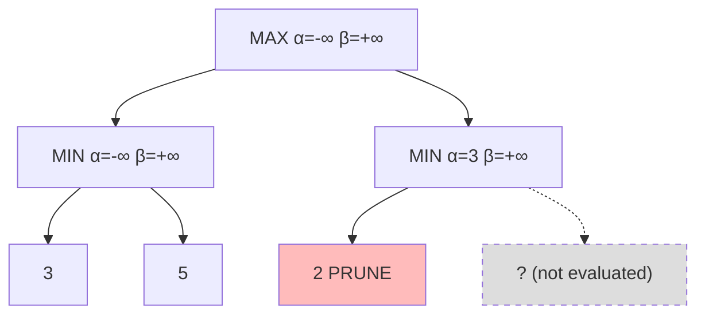

After seeing $2 \leq 3$ ($\alpha$), we prune!

---

### Step-by-Step

1. Evaluate left subtree → MIN returns 3
2. $\alpha = 3$ at root (best for MAX so far)
3. Start right subtree, see value 2
4. $2 \leq \alpha$ (3), so MIN would pick $\leq 2$
5. MAX already has 3, so **prune**!

---

### Alpha-Beta Pseudocode

```cpp
int alphaBeta(State& state, int depth, int alpha, int beta, bool isMax) {
    if (depth == 0 || isTerminal(state))
        return evaluate(state);

    if (isMax) {
        int value = INT_MIN;
        for (auto& child : getChildren(state)) {
            value = std::max(value, alphaBeta(child, depth - 1, alpha, beta, false));
            alpha = std::max(alpha, value);
            if (value >= beta)
                break;  // Beta cutoff
        }
        return value;
    } else {
        int value = INT_MAX;
        for (auto& child : getChildren(state)) {
            value = std::min(value, alphaBeta(child, depth - 1, alpha, beta, true));
            beta = std::min(beta, value);
            if (value <= alpha)
                break;  // Alpha cutoff
        }
        return value;
    }
}
```

---

### Negamax with Alpha-Beta

```cpp
int negamaxAB(State& state, int depth, int alpha, int beta) {
    if (depth == 0 || isTerminal(state))
        return evaluate(state);

    int value = INT_MIN;
    for (auto& child : getChildren(state)) {
        value = std::max(value, -negamaxAB(child, depth - 1, -beta, -alpha));
        alpha = std::max(alpha, value);
        if (alpha >= beta)
            break;  // Cutoff
    }
    return value;
}
```

---

### Alpha-Beta Savings

Where $b$ = branching factor, $d$ = search depth:

| Move Ordering | Nodes Evaluated              |
| ------------- | ---------------------------- |
| Worst case    | $O(b^d)$ (same as minimax)   |
| Random        | $O(b^{3d/4})$                |
| **Best case** | $O(b^{d/2}) = O(\sqrt{b^d})$ |

With perfect ordering: **search twice as deep!**

---

## Alpha-Beta Step-by-Step

---

### AB Step 1: Start at Root

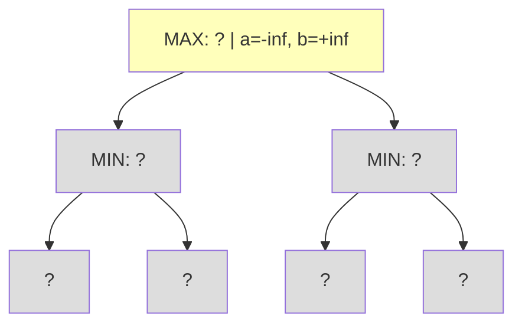

Start at root MAX node with a=-inf, b=+inf.

---

### AB Step 2: Descend to First MIN

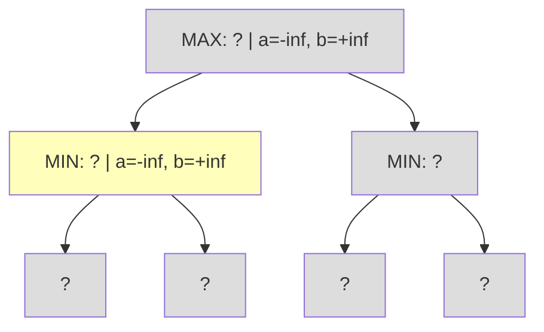

Pass a=-inf, b=+inf to first MIN child.

---

### AB Step 3: Evaluate First Leaf

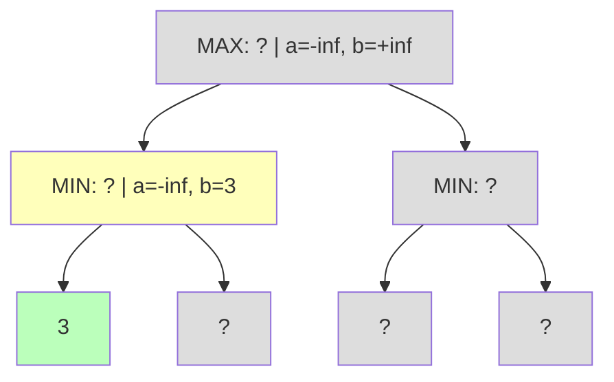

Leaf returns 3. MIN updates b=min(+inf,3)=3.

---

### AB Step 4: Evaluate Second Leaf

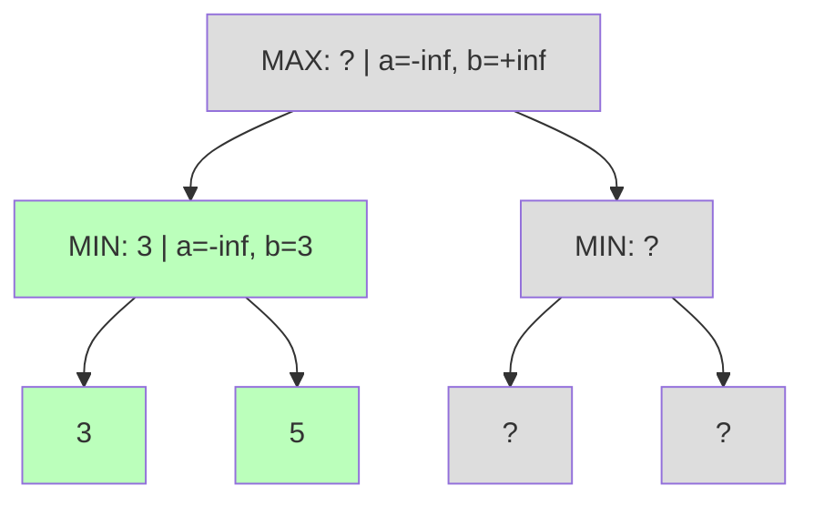

Leaf returns 5. MIN keeps b=min(3,5)=3. Returns **3**.

---

### AB Step 5: Update Alpha at Root

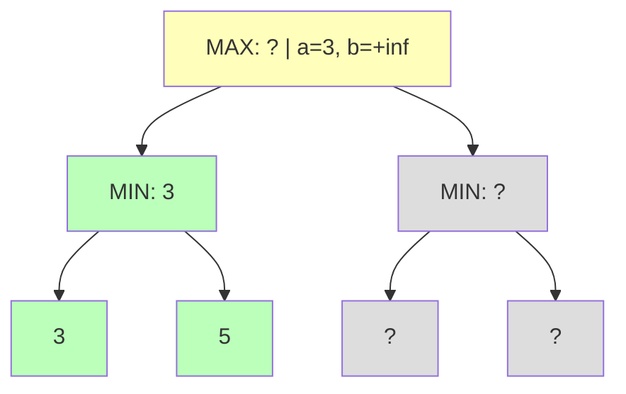

MAX receives 3. Update a=max(-inf,3)=**3**.

---

### AB Step 6: Descend to Second MIN

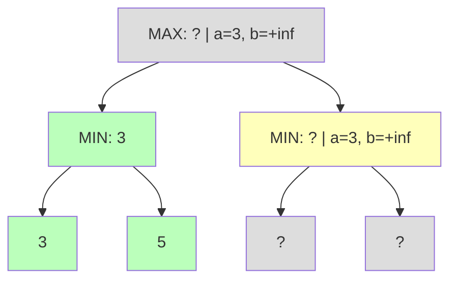

Pass a=3, b=+inf to second MIN child.

---

### AB Step 7: Evaluate Third Leaf

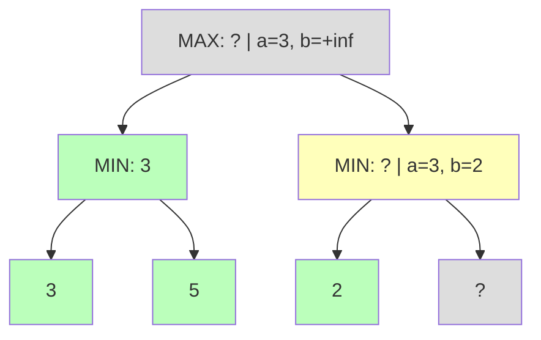

Leaf returns 2. MIN updates b=min(+inf,2)=**2**.

---

### AB Step 8: Pruning Condition Met

```mermaid
flowchart TD
    A["MAX: ? | a=3, b=+inf"] --> B["MIN: 3"]
    A --> C["MIN: 2 | a=3, b=2"]
    B --> D["3"]
    B --> E["5"]
    C --> F["2"]
    C -.-> G["PRUNED"]

    style A fill:#ddd
    style B fill:#bfb
    style C fill:#fbb
    style D fill:#bfb
    style E fill:#bfb
    style F fill:#bfb
    style G fill:#fbb,stroke-dasharray: 5 5
```

$\beta(2) \leq \alpha(3)$: Prune! MIN would return $\leq 2$, MAX already has 3.

---

### AB Step 9: Return to Root

```mermaid
flowchart TD
    A["MAX: 3 | a=3, b=+inf"] --> B["MIN: 3"]
    A --> C["MIN: 2"]
    B --> D["3"]
    B --> E["5"]
    C --> F["2"]
    C -.-> G["PRUNED"]

    style A fill:#bfb
    style B fill:#bfb
    style C fill:#bfb
    style D fill:#bfb
    style E fill:#bfb
    style F fill:#bfb
    style G fill:#fbb,stroke-dasharray: 5 5
```

MAX picks max(3,2)=**3**. Saved one node evaluation!

---

### AB Summary

- Same result as minimax (value = 3)
- Evaluated **6 nodes** instead of 7
- Savings grow exponentially with depth
- Key: pruning happens when $\beta \leq \alpha$

---

## Move Ordering

---

### Why Order Matters

```mermaid
flowchart LR
    subgraph Bad["Bad Ordering"]
        direction LR
        A1["2"] --> A2["5"] --> A3["9"]
    end
    subgraph Good["Good Ordering"]
        direction LR
        B1["9"] --> B2["5 (cut)"] --> B3["2 (cut)"]
    end
```

Search best moves first → more cutoffs

---

### Move Ordering Techniques

1. **Captures before quiet moves**
2. **MVV-LVA** (Most Valuable Victim - Least Valuable Attacker)
3. **Killer moves** (caused cutoff at same depth before)
4. **History heuristic** (moves that caused cutoffs anywhere)

---

### Killer Moves

```cpp
std::unordered_map<int, std::array<Move, 2>> killerMoves;

int search(State& state, int depth /*, ... */) {
    // Try killer moves first
    auto moves = getMoves(state);
    auto& killers = killerMoves[depth];
    prioritize(moves, killers);

    for (auto& move : moves) {
        int value = -search(apply(state, move), depth - 1 /*, ... */);
        if (cutoff) {
            killers[1] = killers[0];
            killers[0] = move;
            break;
        }
    }
}
```

---

## Transposition Tables

---

### The Problem

Same position can be reached via different move orders:

```
Path A: 1. e4 e5 2. Nf3       Path B: 1. Nf3 e5 2. e4
```

Both reach the same position:

```
    a   b   c   d   e   f   g   h
  ┌───┬───┬───┬───┬───┬───┬───┬───┐
8 │ ♜ │ ♞ │ ♝ │ ♛ │ ♚ │ ♝ │ ♞ │ ♜ │
  ├───┼───┼───┼───┼───┼───┼───┼───┤
7 │ ♟ │ ♟ │ ♟ │ ♟ │   │ ♟ │ ♟ │ ♟ │
  ├───┼───┼───┼───┼───┼───┼───┼───┤
6 │   │   │   │   │   │   │   │   │
  ├───┼───┼───┼───┼───┼───┼───┼───┤
5 │   │   │   │   │ ♟ │   │   │   │
  ├───┼───┼───┼───┼───┼───┼───┼───┤
4 │   │   │   │   │ ♙ │   │   │   │
  ├───┼───┼───┼───┼───┼───┼───┼───┤
3 │   │   │   │   │   │ ♘ │   │   │
  ├───┼───┼───┼───┼───┼───┼───┼───┤
2 │ ♙ │ ♙ │ ♙ │ ♙ │   │ ♙ │ ♙ │ ♙ │
  ├───┼───┼───┼───┼───┼───┼───┼───┤
1 │ ♖ │ ♘ │ ♗ │ ♕ │ ♔ │ ♗ │   │ ♖ │
  └───┴───┴───┴───┴───┴───┴───┴───┘
```

Why evaluate twice?

---

### Solution: Hash Table

```cpp
std::unordered_map<uint64_t, TTEntry> transpositionTable;

int search(State& state, int depth, int alpha, int beta) {
    uint64_t key = zobristHash(state);

    auto it = transpositionTable.find(key);
    if (it != transpositionTable.end() && it->second.depth >= depth)
        return it->second.value;

    // ... normal search ...

    transpositionTable[key] = {depth, value, flag};
    return value;
}
```

---

### Zobrist Hashing

```cpp
// Initialize random numbers for each piece/square
uint64_t zobrist[NUM_PIECES][NUM_SQUARES];

uint64_t hashPosition(const Board& board) {
    uint64_t h = 0;
    for (int sq = 0; sq < NUM_SQUARES; ++sq)
        if (board[sq] != EMPTY)
            h ^= zobrist[board[sq]][sq];
    return h;
}

// Incremental update
uint64_t makeMove(uint64_t hash, const Move& move) {
    hash ^= zobrist[move.piece][move.from];  // Remove
    hash ^= zobrist[move.piece][move.to];    // Place
    return hash;
}
```

---

## Putting It All Together

---

### Complete Search Framework

```mermaid
flowchart TD
    A["Generate Moves"] --> B["Order Moves"]
    B --> C["Check Transposition Table"]
    C --> D{"Cached?"}
    D -->|Yes| E["Return Cached"]
    D -->|No| F["Alpha-Beta Search"]
    F --> G["Store in TT"]
    G --> H["Return Best Move"]
```

---

### Iterative Deepening

```cpp
Move searchIterative(State& state, double maxTime) {
    Move bestMove;
    for (int depth = 1; depth <= MAX_DEPTH; ++depth) {
        if (timeExceeded(maxTime))
            break;
        bestMove = alphaBetaRoot(state, depth);
    }
    return bestMove;
}
```

- Always have a move ready
- Previous iteration guides move ordering

---

## Summary

---

### Key Takeaways

1. **Minimax** — optimal play assumes opponent plays optimally
2. **Alpha-Beta** — prune branches that can't affect result
3. **Move Ordering** — critical for pruning efficiency
4. **Transposition Tables** — avoid redundant work

---

### Complexity Comparison

| Algorithm          | Time Complexity |
| ------------------ | --------------- |
| Minimax            | $O(b^d)$        |
| Alpha-Beta (worst) | $O(b^d)$        |
| Alpha-Beta (best)  | $O(b^{d/2})$    |

**Good move ordering transforms exponential savings!**

---

### What's Next?

- Quiescence search (avoid horizon effect)
- Null-move pruning
- Late move reductions
- Monte Carlo Tree Search (MCTS)

---

## Questions?

### Resources

- [Chess Programming Wiki](https://www.chessprogramming.org)
- Millington, _AI for Games_, Chapter 8
- [Sunfish](https://github.com/thomasahle/sunfish) — 111-line chess engine
