# Minimax Search

<details>
<summary>Lecture Notes</summary>

- Heuristics
- Minimax Search
- Alpha-Beta Pruning

</details>

**Video explanations:** [Minimax Algorithm](https://www.youtube.com/watch?v=l-hh51ncgDI) | [Alpha-Beta Pruning](https://www.youtube.com/watch?v=trKjYdBASyQ)

Minimax is a decision-making algorithm for two-player, turn-based, zero-sum games. It finds the optimal move by exploring all possible game states and assuming both players play perfectly. The maximizing player tries to achieve the highest score, while the minimizing player tries to achieve the lowest.


## Heuristics

A **heuristic** is a function that estimates the value of a game state without searching to the end of the game. Since we cannot search every possible move to conclusion, heuristics let us evaluate intermediate positions and make informed decisions.

In chess, common heuristics include:

- **Material Balance**: Sum of piece values. Queen = 9, Rook = 5, Bishop/Knight = 3, Pawn = 1. The king is often assigned a very high value (e.g., 100) to prioritize its safety.
- **Pawn Structure**: Quality of pawn formations. Considers isolated, passed, doubled, and connected pawns, as well as open and closed files.
- **King Safety**: How well-protected the king is. Exposed kings are penalized.
- **Space Control**: Territory controlled by pieces. More space means greater mobility and options.
- **Piece Activity**: How actively placed each piece is. Centralized pieces are generally stronger.
- **Center Control**: Dominance of the central squares (d4, d5, e4, e5). Central control provides flexibility.
- **Initiative**: Which player is dictating the flow of the game. Having the initiative means forcing your opponent to react.

By combining these factors into a single score, we can compare positions and guide our search toward promising moves.

## Minimax Algorithm

The minimax algorithm builds a **game tree** where:

- The **root** represents the current game state
- Each **edge** represents a possible move
- Each **node** represents the resulting state after that move
- **Leaves** are either terminal states (win/loss/draw) or positions at the depth limit

The algorithm recursively explores this tree, alternating between:

- **MAX nodes**: Choose the move with the highest value (our turn)
- **MIN nodes**: Choose the move with the lowest value (opponent's turn)

In practice, we limit the search depth because exploring the entire game tree is computationally infeasible. At the depth limit, we use our heuristic function to estimate the position's value.

## Simple Minimax

```c++
// Minimax function
int minimax(const State& state, int depth, bool isMaximizingPlayer) {
    using namespace numeric_limits;
    // Base cases: terminal state or maximum depth reached
    // evaluate the board only if depth is 0 or state is terminal
    if (depth == 0 || state.isTerminal()) return state.evaluate();

    // Get all possible moves from current state
    vector<Move> moves = state.getPossibleMoves();

    // Initialize bestValue based on player, use <limits>
    int bestValue = isMaximizingPlayer ? numeric_limits<int>::min() : numeric_limits<int>::max();

    // Traverse all children
    for (const Move& move : moves) {
        // Create a new state by applying the move
        State nextState = state.applyMove(move);

        // Recursively call minimax for the new state
        int value = minimax(nextState, depth - 1, !isMaximizingPlayer);

        // Update bestValue based on player
        if (isMaximizingPlayer) {
            bestValue = max(bestValue, value);
        } else {
            bestValue = min(bestValue, value);
        }
    }

    return bestValue;
}
```

## Alpha-Beta Pruning

Alpha-beta pruning is an optimization that significantly reduces the number of nodes minimax needs to evaluate. It maintains two values:

- **Alpha**: The best value the maximizing player can guarantee
- **Beta**: The best value the minimizing player can guarantee

When we discover that a branch cannot possibly influence the final decision, we **prune** it and skip the remaining children.

```c++
// Minimax function with alpha-beta pruning
int minimax(const State& state, int depth, int alpha, int beta, bool isMaximizingPlayer) {
    // Base cases: terminal state or maximum depth reached
    // evaluate the board only if depth is 0 or state is terminal
    if (depth == 0 || state.isTerminal()) return state.evaluate();

    // Get all possible moves from current state
    vector<Move> moves = state.getPossibleMoves();

    // Initialize best value based on player
    int bestValue = isMaximizingPlayer ? numeric_limits<int>::min() : numeric_limits<int>::max();

    // Traverse all children
    for (const Move& move : moves) {
        // Create a new state by applying the move
        State nextState = state.applyMove(move);

        // Recursively call minimax for the new state with alpha-beta pruning
        int value = minimax(nextState, depth - 1, alpha, beta, !isMaximizingPlayer);

        // Update bestValue based on player
        if (isMaximizingPlayer) {
            bestValue = max(bestValue, value);
            alpha = max(alpha, bestValue);
        } else {
            bestValue = min(bestValue, value);
            beta = min(beta, bestValue);
        }

        // Alpha-beta pruning
        if (beta <= alpha)
            break; // Pruning
    }

    return bestValue;
}
```

---

## Visualizing the Game Tree

Consider a game tree with depth 3 and branching factor 2. This gives us 8 leaf nodes to evaluate:

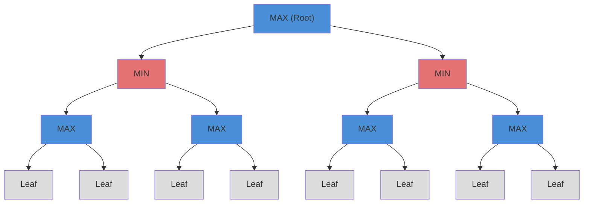

**Legend:** Blue = MAX nodes (maximizing player), Red = MIN nodes (minimizing player), Gray = Leaf nodes (evaluated by heuristic)

The algorithm evaluates leaf nodes using our heuristic function, then propagates values upward: MAX nodes select the highest child value, MIN nodes select the lowest.

## Step-by-Step Minimax Evaluation

### Step 1: Start at Root

We begin at the root MAX node. All values are unknown until we evaluate them.

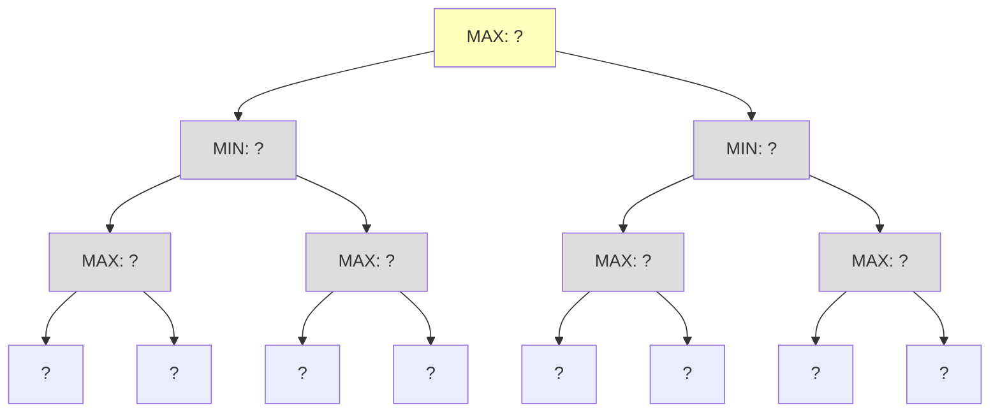

### Step 2: Descend to First Subtree

We recursively descend to the leftmost leaf first.

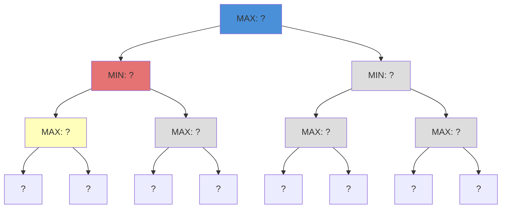

### Step 3: Evaluate First Two Leaves

Reach the leaves and evaluate them using the heuristic function.

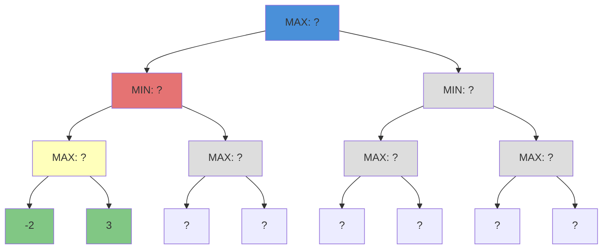

### Step 4: A00 Selects Maximum

A00 (MAX node) picks max(-2, 3) = **3**

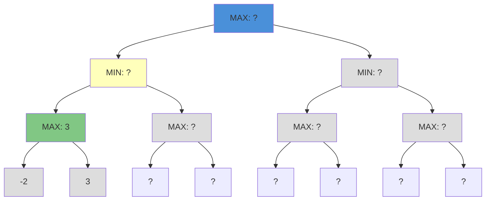

### Step 5: Evaluate A01's Leaves

Continue to next sibling. Evaluate its leaves.

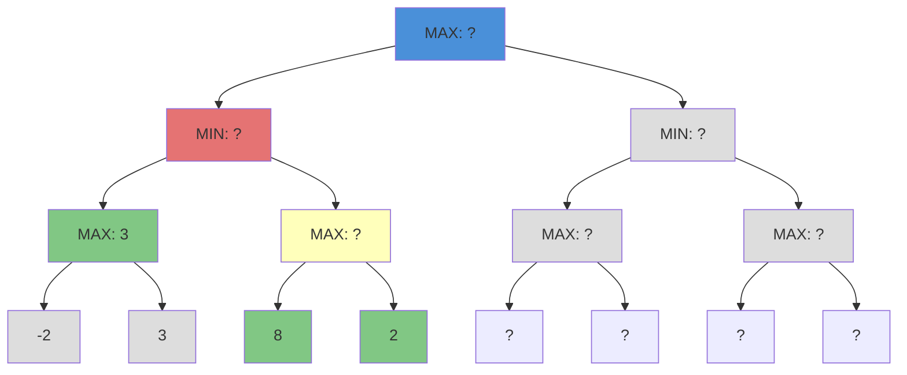

### Step 6: A01 Selects Maximum

A01 (MAX node) picks max(8, 2) = **8**

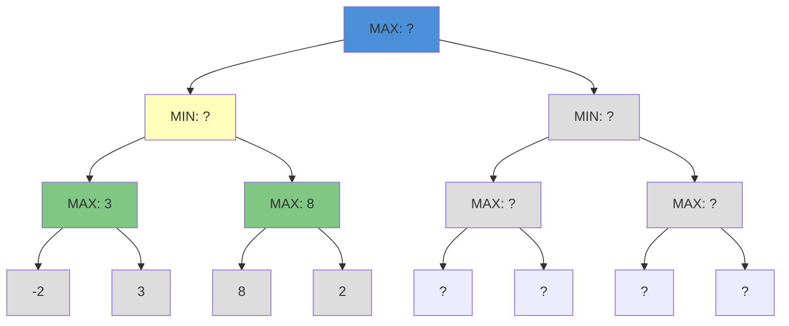

### Step 7: A0 Selects Minimum

A0 (MIN node) picks min(3, 8) = **3**

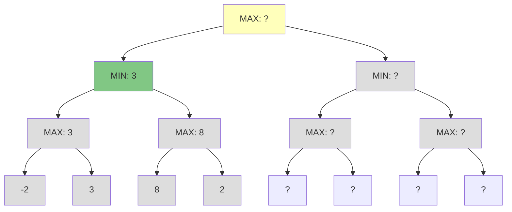

### Step 8: Explore Right Subtree (A1)

Now explore the right subtree. Evaluate A10's leaves.

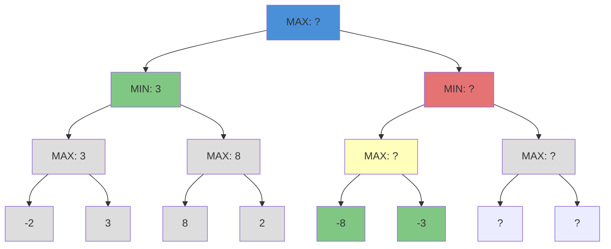

### Step 9: A10 Selects Maximum

A10 (MAX node) picks max(-8, -3) = **-3**

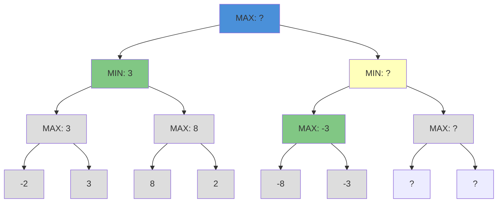

### Step 10: Evaluate A11's Leaves

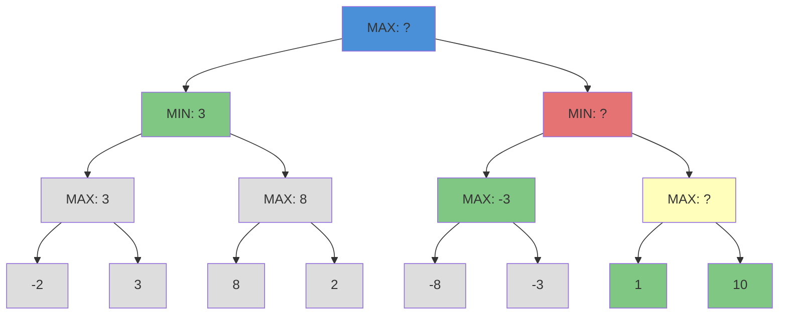

### Step 11: A11 Selects Maximum

A11 (MAX node) picks max(1, 10) = **10**

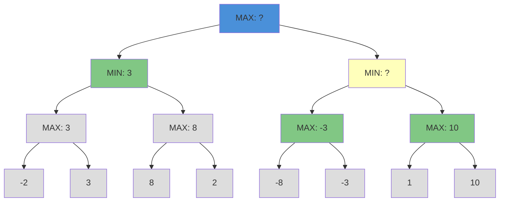

### Step 12: A1 Selects Minimum

A1 (MIN node) picks min(-3, 10) = **-3**

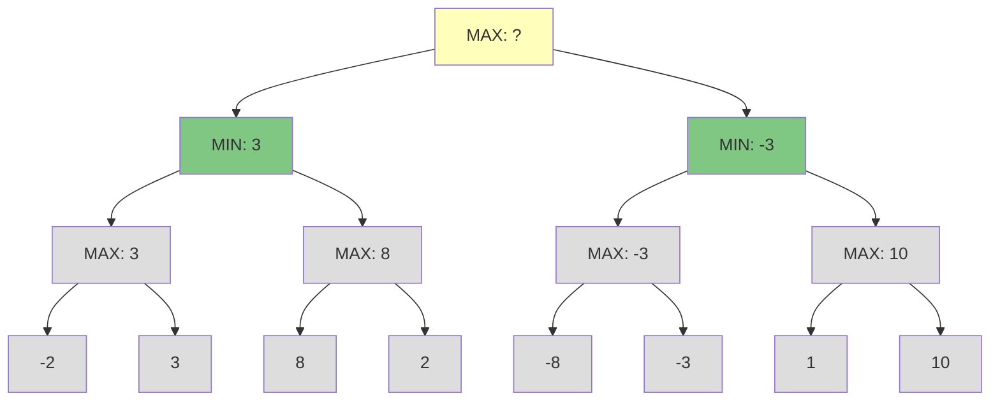

### Step 13: Root Selects Maximum

Root (MAX node) picks max(3, -3) = **3**. The best move leads to the left branch.

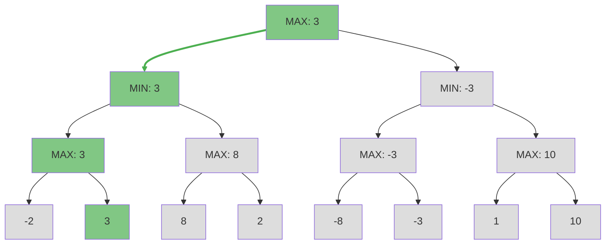

**Result:** The optimal path is highlighted in green. MAX should choose the left branch, guaranteeing a value of at least 3 regardless of how MIN responds.

**Note:** Minimax evaluated all 8 leaf nodes. With alpha-beta pruning, we can skip branches that cannot affect the outcome.

## Step-by-Step Alpha-Beta Pruning

Alpha-beta pruning eliminates branches that cannot affect the final decision. We maintain two bounds throughout the search:

- **Alpha (α):** The best value MAX can guarantee so far (starts at -∞)
- **Beta (β):** The best value MIN can guarantee so far (starts at +∞)

**Pruning condition:** When β ≤ α, the current branch cannot influence the final result and can be safely skipped.

### AB Step 1: Start at Root

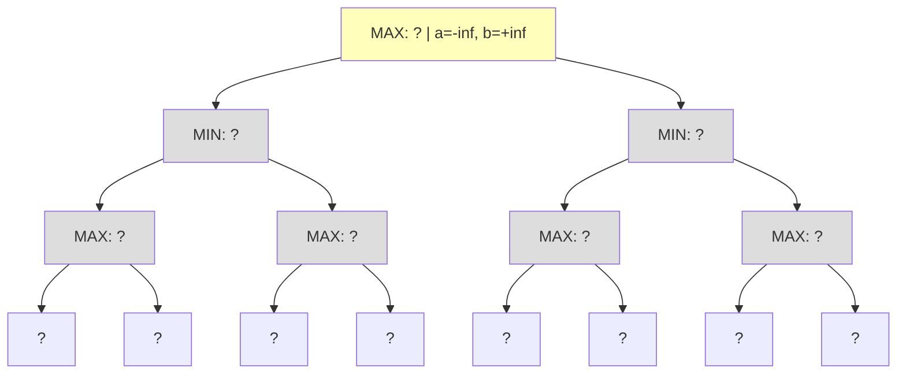

Begin at the root MAX node with α=-∞, β=+∞.

### AB Step 2: Descend to First MIN

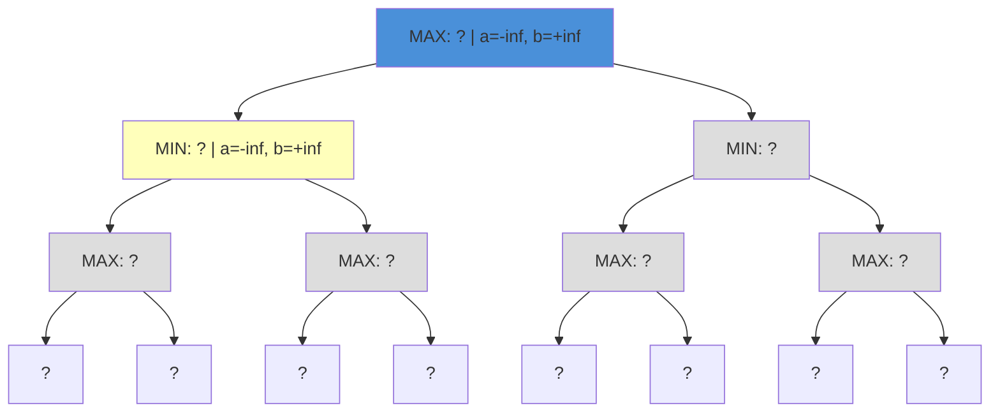

Pass α=-∞, β=+∞ to the first MIN child.

### AB Step 3: Descend to First MAX (A00)

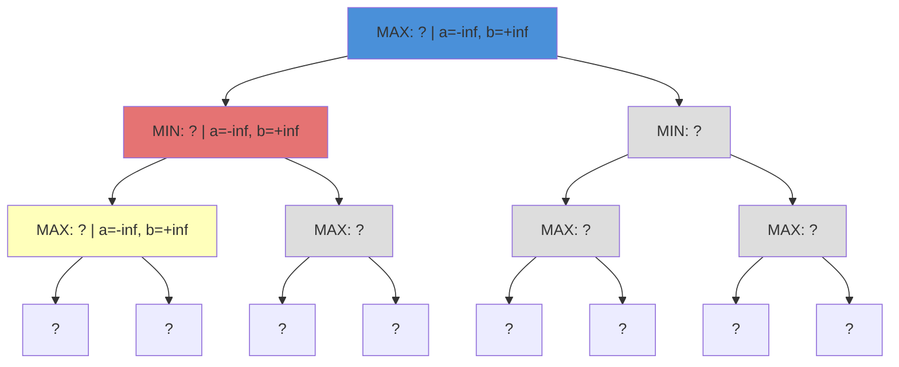

Continue descending to the first MAX grandchild.

### AB Step 4: Evaluate First Leaf (-2)

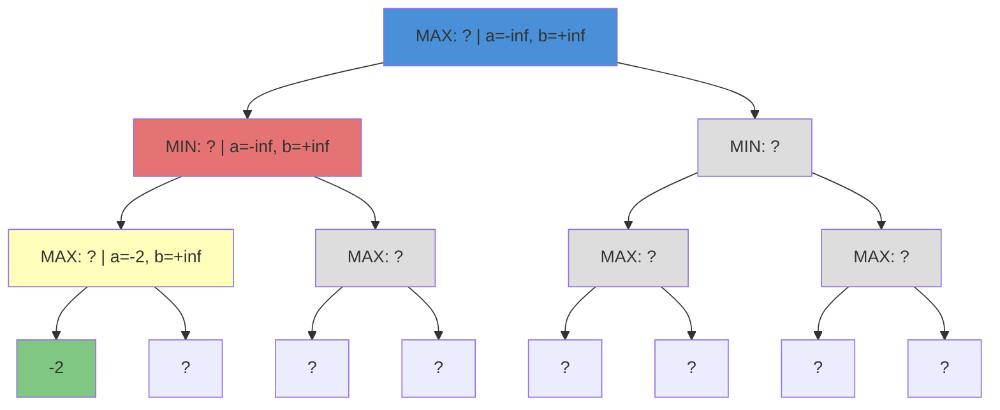

The leaf returns -2. MAX updates α = max(-∞, -2) = -2.

### AB Step 5: Evaluate Second Leaf (3)

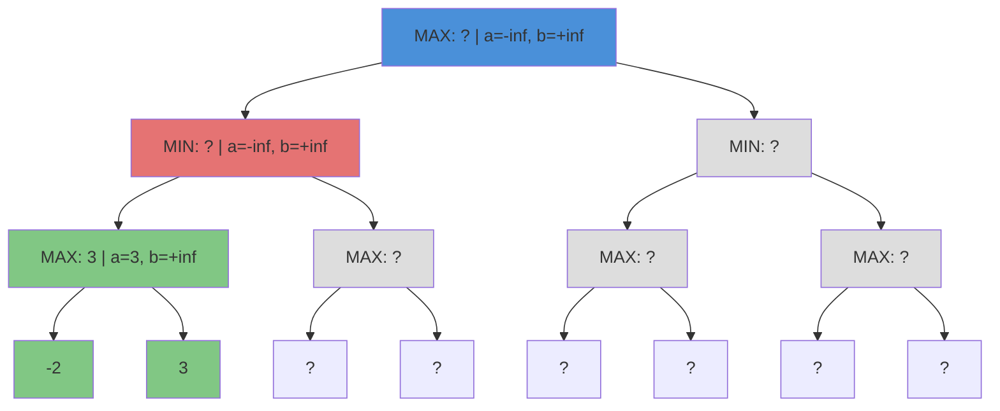

The leaf returns 3. MAX selects max(-2, 3) = **3**. Node A00 is complete.

### AB Step 6: MIN Updates Beta

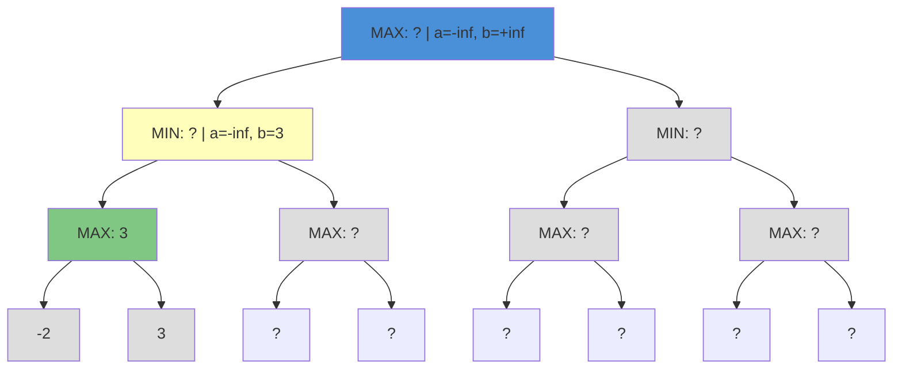

MIN receives 3 and updates β = min(+∞, 3) = **3**. Now we explore A01.

### AB Step 7: Descend to A01, Evaluate First Leaf (8)

```mermaid
flowchart TD
    A["MAX: ? | a=-inf, b=+inf"] --> A0["MIN: ? | a=-inf, b=3"]
    A --> A1["MIN: ?"]
    A0 --> A00["MAX: 3"]
    A0 --> A01["MAX: ? | a=-inf, b=3"]
    A1 --> A10["MAX: ?"]
    A1 --> A11["MAX: ?"]
    A00 --> A000["-2"]
    A00 --> A001["3"]
    A01 --> A010["8"]
    A01 --> A011["?"]
    A10 --> A100["?"]
    A10 --> A101["?"]
    A11 --> A110["?"]
    A11 --> A111["?"]

    style A fill:#4a90d9
    style A0 fill:#e57373
    style A1 fill:#ddd
    style A00 fill:#81c784
    style A01 fill:#ffb
    style A10 fill:#ddd
    style A11 fill:#ddd
    style A000 fill:#ddd
    style A001 fill:#ddd
    style A010 fill:#81c784
```

A01 receives α=-∞, β=3. The first leaf returns **8**.

### AB Step 8: Pruning at A01

```mermaid
flowchart TD
    A["MAX: ? | a=-inf, b=+inf"] --> A0["MIN: ? | a=-inf, b=3"]
    A --> A1["MIN: ?"]
    A0 --> A00["MAX: 3"]
    A0 --> A01["MAX: 8 | a=8, b=3"]
    A1 --> A10["MAX: ?"]
    A1 --> A11["MAX: ?"]
    A00 --> A000["-2"]
    A00 --> A001["3"]
    A01 --> A010["8"]
    A01 -.-> A011["PRUNED"]
    A10 --> A100["?"]
    A10 --> A101["?"]
    A11 --> A110["?"]
    A11 --> A111["?"]

    style A fill:#4a90d9
    style A0 fill:#e57373
    style A1 fill:#ddd
    style A00 fill:#81c784
    style A01 fill:#fbb
    style A10 fill:#ddd
    style A11 fill:#ddd
    style A000 fill:#ddd
    style A001 fill:#ddd
    style A010 fill:#81c784
    style A011 fill:#fbb,stroke-dasharray: 5 5
```

MAX updates α = 8. Now **α(8) ≥ β(3)**, so we **prune**! Node A011 is never evaluated.

**Why?** MAX at A01 will return at least 8. MIN at A0 already has 3 from A00. Since MIN will never choose A01 (because 8 > 3), the remaining children are irrelevant.

### AB Step 9: MIN Completes A0

```mermaid
flowchart TD
    A["MAX: ? | a=3, b=+inf"] --> A0["MIN: 3"]
    A --> A1["MIN: ?"]
    A0 --> A00["MAX: 3"]
    A0 --> A01["MAX: 8"]
    A1 --> A10["MAX: ?"]
    A1 --> A11["MAX: ?"]
    A00 --> A000["-2"]
    A00 --> A001["3"]
    A01 --> A010["8"]
    A01 -.-> A011["PRUNED"]
    A10 --> A100["?"]
    A10 --> A101["?"]
    A11 --> A110["?"]
    A11 --> A111["?"]

    style A fill:#ffb
    style A0 fill:#81c784
    style A1 fill:#ddd
    style A00 fill:#81c784
    style A01 fill:#ddd
    style A10 fill:#ddd
    style A11 fill:#ddd
    style A000 fill:#ddd
    style A001 fill:#ddd
    style A010 fill:#ddd
    style A011 fill:#fbb,stroke-dasharray: 5 5
```

MIN selects min(3, 8) = **3**. The root updates α = max(-∞, 3) = **3**.

### AB Step 10: Explore A1 Subtree

```mermaid
flowchart TD
    A["MAX: ? | a=3, b=+inf"] --> A0["MIN: 3"]
    A --> A1["MIN: ? | a=3, b=+inf"]
    A0 --> A00["MAX: 3"]
    A0 --> A01["MAX: 8"]
    A1 --> A10["MAX: ? | a=3, b=+inf"]
    A1 --> A11["MAX: ?"]
    A00 --> A000["-2"]
    A00 --> A001["3"]
    A01 --> A010["8"]
    A01 -.-> A011["PRUNED"]
    A10 --> A100["-8"]
    A10 --> A101["?"]
    A11 --> A110["?"]
    A11 --> A111["?"]

    style A fill:#4a90d9
    style A0 fill:#81c784
    style A1 fill:#e57373
    style A00 fill:#ddd
    style A01 fill:#ddd
    style A10 fill:#ffb
    style A11 fill:#ddd
    style A000 fill:#ddd
    style A001 fill:#ddd
    style A010 fill:#ddd
    style A011 fill:#fbb,stroke-dasharray: 5 5
    style A100 fill:#81c784
```

Pass α=3, β=+∞ to A1. The first leaf of A10 returns **-8**.

### AB Step 11: Continue A10

```mermaid
flowchart TD
    A["MAX: ? | a=3, b=+inf"] --> A0["MIN: 3"]
    A --> A1["MIN: ? | a=3, b=+inf"]
    A0 --> A00["MAX: 3"]
    A0 --> A01["MAX: 8"]
    A1 --> A10["MAX: -3"]
    A1 --> A11["MAX: ?"]
    A00 --> A000["-2"]
    A00 --> A001["3"]
    A01 --> A010["8"]
    A01 -.-> A011["PRUNED"]
    A10 --> A100["-8"]
    A10 --> A101["-3"]
    A11 --> A110["?"]
    A11 --> A111["?"]

    style A fill:#4a90d9
    style A0 fill:#81c784
    style A1 fill:#ffb
    style A00 fill:#ddd
    style A01 fill:#ddd
    style A10 fill:#81c784
    style A11 fill:#ddd
    style A000 fill:#ddd
    style A001 fill:#ddd
    style A010 fill:#ddd
    style A011 fill:#fbb,stroke-dasharray: 5 5
    style A100 fill:#81c784
    style A101 fill:#81c784
```

A10 evaluates both leaves: max(-8, -3) = **-3**. MIN updates β = min(+∞, -3) = **-3**.

### AB Step 12: Pruning at A1

```mermaid
flowchart TD
    A["MAX: ? | a=3, b=+inf"] --> A0["MIN: 3"]
    A --> A1["MIN: -3 | a=3, b=-3"]
    A0 --> A00["MAX: 3"]
    A0 --> A01["MAX: 8"]
    A1 --> A10["MAX: -3"]
    A1 -.-> A11["PRUNED"]
    A00 --> A000["-2"]
    A00 --> A001["3"]
    A01 --> A010["8"]
    A01 -.-> A011["PRUNED"]
    A10 --> A100["-8"]
    A10 --> A101["-3"]
    A11 -.-> A110["PRUNED"]
    A11 -.-> A111["PRUNED"]

    style A fill:#4a90d9
    style A0 fill:#81c784
    style A1 fill:#fbb
    style A00 fill:#ddd
    style A01 fill:#ddd
    style A10 fill:#81c784
    style A11 fill:#fbb,stroke-dasharray: 5 5
    style A000 fill:#ddd
    style A001 fill:#ddd
    style A010 fill:#ddd
    style A011 fill:#fbb,stroke-dasharray: 5 5
    style A100 fill:#ddd
    style A101 fill:#ddd
    style A110 fill:#fbb,stroke-dasharray: 5 5
    style A111 fill:#fbb,stroke-dasharray: 5 5
```

MIN has β = -3. Now **β(-3) ≤ α(3)**, so we **prune A11 entirely**!

**Why?** MIN at A1 will return at most -3. MAX at the root already has 3 from A0. Since MAX will never choose A1 (because -3 < 3), node A11 is irrelevant.

### AB Step 13: Final Result

```mermaid
flowchart TD
    A["MAX: 3"] --> A0["MIN: 3"]
    A --> A1["MIN: -3"]
    A0 --> A00["MAX: 3"]
    A0 --> A01["MAX: 8"]
    A1 --> A10["MAX: -3"]
    A1 -.-> A11["PRUNED"]
    A00 --> A000["-2"]
    A00 --> A001["3"]
    A01 --> A010["8"]
    A01 -.-> A011["PRUNED"]
    A10 --> A100["-8"]
    A10 --> A101["-3"]
    A11 -.-> A110["PRUNED"]
    A11 -.-> A111["PRUNED"]

    style A fill:#81c784
    style A0 fill:#81c784
    style A1 fill:#ddd
    style A00 fill:#81c784
    style A01 fill:#ddd
    style A10 fill:#ddd
    style A11 fill:#fbb,stroke-dasharray: 5 5
    style A000 fill:#ddd
    style A001 fill:#81c784
    style A010 fill:#ddd
    style A011 fill:#fbb,stroke-dasharray: 5 5
    style A100 fill:#ddd
    style A101 fill:#ddd
    style A110 fill:#fbb,stroke-dasharray: 5 5
    style A111 fill:#fbb,stroke-dasharray: 5 5

    linkStyle 0 stroke:#4caf50,stroke-width:3px
```

**Result:** Same result as minimax (value = 3), but we pruned **3 nodes** (A011, A110, A111).

### Summary

| Metric          | Minimax | Alpha-Beta |
| --------------- | ------- | ---------- |
| Nodes evaluated | 8       | 5          |
| Savings         | -       | 37.5%      |

With good move ordering, alpha-beta can reduce the search space from O(b^d) to O(b^(d/2)), effectively **doubling the search depth** for the same computational cost. This is why move ordering techniques (searching likely best moves first) are crucial for strong game-playing programs.
