# Monte Carlo Tree Search

## Stochastic Search for Complex Games

---

## Agenda

1. Limitations of Minimax
2. MCTS Overview
3. The Four Phases
4. Upper Confidence Bound (UCB1)
5. MCTS in Practice
6. AlphaGo & Neural MCTS

---

## Limitations of Minimax

---

### Where Minimax Struggles

- Branching factor too large (Go: ~250 vs Chess: ~35)
- No good evaluation function available
- Games with randomness or hidden information
- Real-time decision requirements

---

### The Go Problem

| Game           | Branching Factor | Typical Depth | Game Tree Size  |
| -------------- | ---------------- | ------------- | --------------- |
| Tic-Tac-Toe    | ~4               | 9             | $\sim 10^{5}$   |
| Chess          | ~35              | 80            | $\sim 10^{120}$ |
| **Go (19×19)** | **~250**         | **150**       | $\sim 10^{360}$ |

Minimax with alpha-beta is **infeasible** for Go!

---

### A Different Approach

Instead of exhaustive search:

> **Sample** random games and use **statistics** to guide decisions

This is the core idea behind MCTS.

---

## MCTS Overview

---

### What is MCTS?

Monte Carlo Tree Search is:

- A **best-first search** algorithm
- Guided by **random simulations** (rollouts)
- Builds a **partial game tree** incrementally
- Balances **exploration vs exploitation**

---

### Key Insight

> You don't need to evaluate every position—just **sample enough** to make a good decision.

Like polling voters instead of asking everyone.

---

### The Four Phases

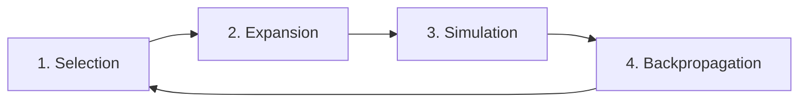

Repeat until time/iteration budget is exhausted.

---

## Phase 1: Selection

---

### Selection

Starting from the root, traverse the tree using a **tree policy** until reaching a leaf node.

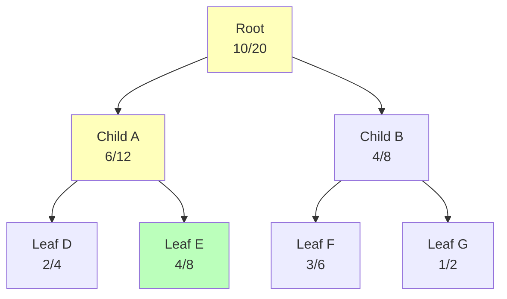

Navigate down using UCB1 to pick the most promising node.

---

### UCB1 Formula

$$UCB1 = \frac{w_i}{n_i} + C \sqrt{\frac{\ln N}{n_i}}$$

- $\frac{w_i}{n_i}$ = **exploitation** (win rate)
- $C\sqrt{\frac{\ln N}{n_i}}$ = **exploration** (visit less-explored nodes)
- $C$ = exploration constant (typically $\sqrt{2}$)

---

### Exploitation vs Exploration

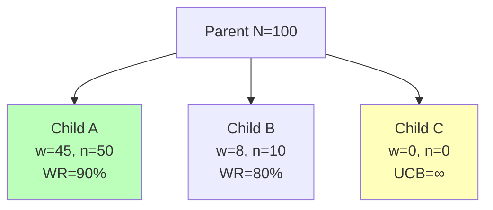

- **Child A:** High win rate → exploitation favors it
- **Child C:** Never visited → exploration favors it (UCB = ∞)

---

### Selection Code

```cpp
MCTSNode* select(MCTSNode* node) {
    while (!node->children.empty()) {
        node = *std::max_element(
            node->children.begin(),
            node->children.end(),
            [](MCTSNode* a, MCTSNode* b) {
                return a->ucb() < b->ucb();
            }
        );
    }
    return node;
}
```

---

## Phase 2: Expansion

---

### Expansion

When a leaf node is reached that is **not terminal**:

- Generate one or more child nodes
- Each child represents a legal move

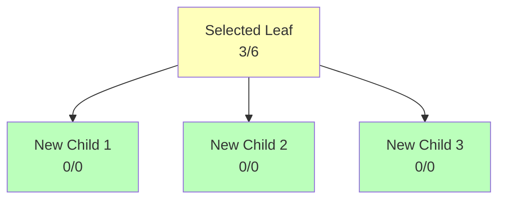

---

### Expansion Code

```cpp
void expand(MCTSNode* node) {
    std::vector<GameState> nextStates =
        node->state.getPossibleStates();

    for (const GameState& state : nextStates) {
        MCTSNode* child = new MCTSNode(state);
        child->parent = node;
        node->children.push_back(child);
    }
}
```

New nodes have visits=0, so UCB=∞ → they'll be selected next.

---

## Phase 3: Simulation

---

### Simulation (Rollout)

From the newly expanded node, play a **random game** to completion:

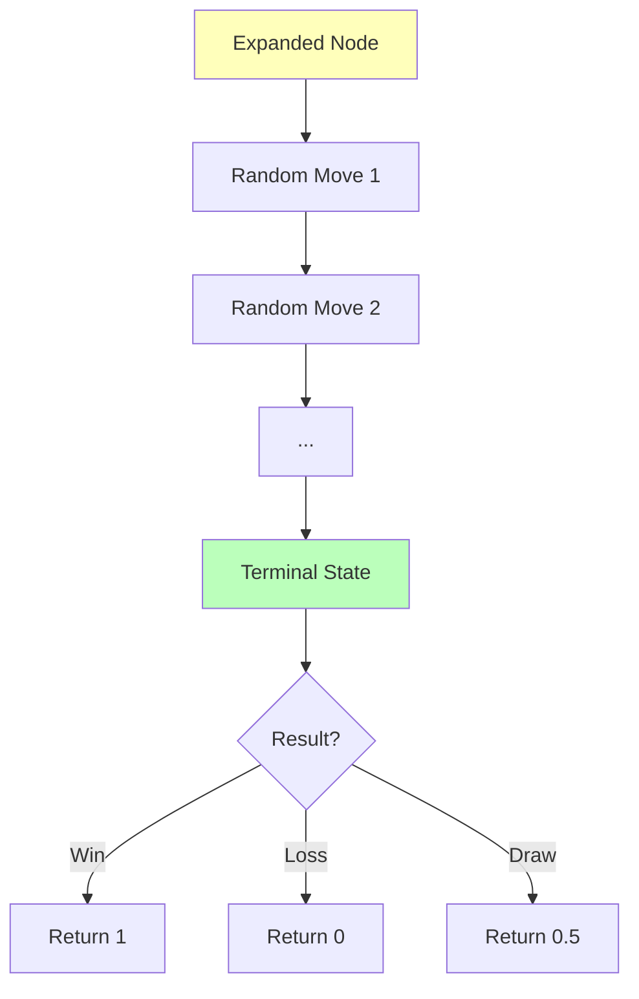

---

### Why Random Works

> The **Law of Large Numbers**: with enough random samples, the average converges to the true expected value.

Each rollout is noisy, but thousands of rollouts give reliable estimates.

---

### Simulation Code

```cpp
double simulate(MCTSNode* node) {
    GameState state = node->state;

    while (!state.isTerminal()) {
        auto moves = state.getPossibleMoves();
        // Random (uniform) policy
        state = state.applyMove(
            moves[rand() % moves.size()]
        );
    }

    // Return result from perspective of node's player
    return state.getResult(node->state.currentPlayer());
}
```

---

### Improving Rollouts

| Strategy             | Description                               |
| -------------------- | ----------------------------------------- |
| **Random** (default) | Uniform random moves — fast but noisy     |
| **Light playout**    | Simple heuristics (capture when possible) |
| **Heavy playout**    | Pattern matching, domain knowledge        |
| **Neural network**   | Learned policy (AlphaGo approach)         |

Better rollout policies → fewer iterations needed

---

## Phase 4: Backpropagation

---

### Backpropagation

Update **every node** on the path from the simulated leaf back to the root:

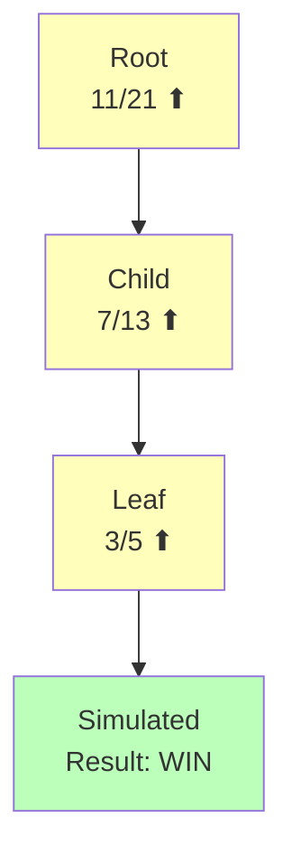

- Increment visit count: $n_i \mathrel{+}= 1$
- Add result to wins: $w_i \mathrel{+}= \text{result}$

---

### Backpropagation Code

```cpp
void backpropagate(MCTSNode* node, double result) {
    while (node != nullptr) {
        node->visits++;
        node->wins += result;
        // Flip result for opponent's perspective
        result = 1.0 - result;
        node = node->parent;
    }
}
```

**Important:** Alternate the result as you go up — your win is your parent's loss!

---

## Putting It Together

---

### The MCTS Loop

```cpp
Move mctsSearch(GameState rootState, int iterations) {
    MCTSNode* root = new MCTSNode(rootState);

    for (int i = 0; i < iterations; i++) {
        // 1. Selection
        MCTSNode* leaf = select(root);

        // 2. Expansion
        if (!leaf->state.isTerminal()) {
            expand(leaf);
            leaf = leaf->children[0]; // pick first new child
        }

        // 3. Simulation
        double result = simulate(leaf);

        // 4. Backpropagation
        backpropagate(leaf, result);
    }

    // Choose move with most visits
    return bestChild(root)->state.lastMove();
}
```

---

### Choosing the Best Move

After all iterations, select the child of root with:

| Strategy             | Formula         | When to Use               |
| -------------------- | --------------- | ------------------------- |
| **Most visits**      | $\max(n_i)$     | Most reliable (default)   |
| **Highest win rate** | $\max(w_i/n_i)$ | When sample size is equal |
| **Robust child**     | Both agree      | Tournament play           |

```cpp
MCTSNode* bestChild(MCTSNode* root) {
    return *std::max_element(
        root->children.begin(), root->children.end(),
        [](MCTSNode* a, MCTSNode* b) {
            return a->visits < b->visits;
        }
    );
}
```

---

## MCTS Step-by-Step Example

---

### Step 1: Empty Tree

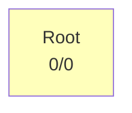

Start with just the root node. No information yet.

---

### Step 2: First Iteration

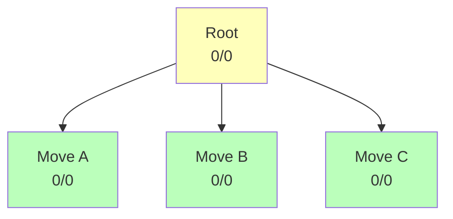

Expand root → generate all children. Pick one for simulation.

---

### Step 3: Simulate & Backpropagate

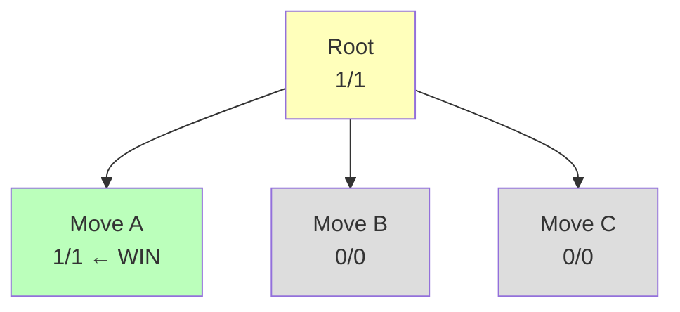

Rollout from Move A → WIN. Update: A gets 1/1, Root gets 1/1.

---

### Step 4: Second Iteration

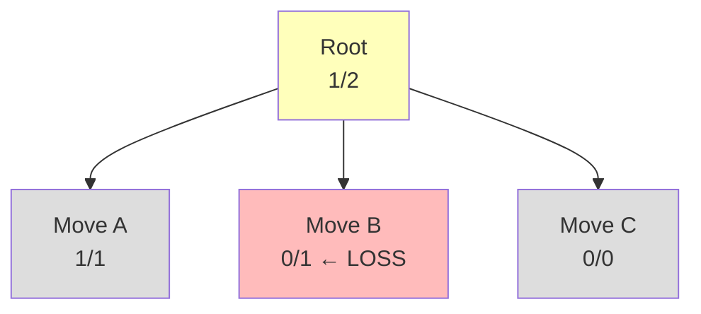

UCB sends us to Move B (unvisited = ∞). Rollout → LOSS.

---

### Step 5: Third Iteration

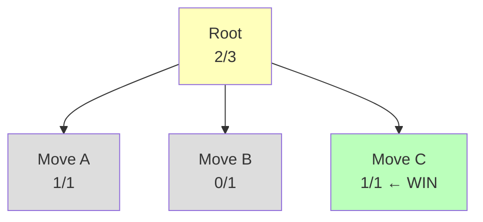

UCB sends us to Move C (unvisited). Rollout → WIN.

---

### Step 6: After Many Iterations

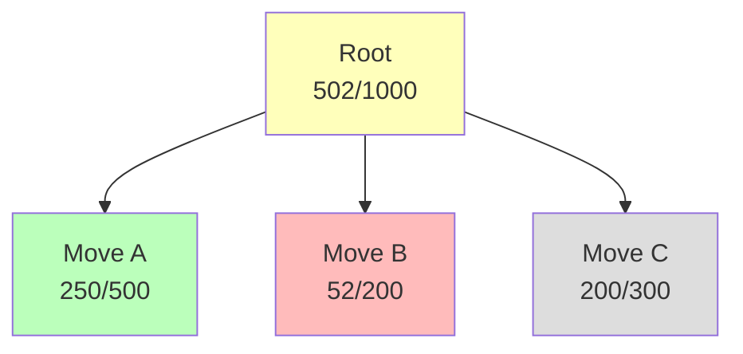

After 1000 iterations:

- Move A: 500 visits, 50% win rate → **most visited**
- Move B: 200 visits, 26% win rate → worst
- Move C: 300 visits, 67% win rate → highest win rate

Choose Move A (most visits) or Move C (highest win rate).

---

## UCB1 Deep Dive

---

### The Exploration Constant $C$

$$UCB1 = \frac{w_i}{n_i} + C \sqrt{\frac{\ln N}{n_i}}$$

| $C$ Value      | Behavior                          |
| -------------- | --------------------------------- |
| $C = 0$        | Pure exploitation (greedy)        |
| $C = \sqrt{2}$ | Theoretical optimum (Auer et al.) |
| $C > \sqrt{2}$ | More exploration                  |

In practice, tune $C$ for your specific game.

---

### UCB1 Calculation Example

Parent has $N = 100$ visits. Two children:

**Child A:** $w=45, n=50$

$$UCB_A = \frac{45}{50} + \sqrt{2}\sqrt{\frac{\ln 100}{50}} = 0.90 + 0.43 = 1.33$$

**Child B:** $w=8, n=10$

$$UCB_B = \frac{8}{10} + \sqrt{2}\sqrt{\frac{\ln 100}{10}} = 0.80 + 0.96 = 1.76$$

Child B wins despite lower win rate → exploration bonus!

---

### Multi-Armed Bandit Connection

MCTS Selection ≈ **Multi-Armed Bandit** problem:

- Each child node is a "slot machine arm"
- UCB1 is the optimal strategy for this problem
- Proven to achieve **logarithmic regret**

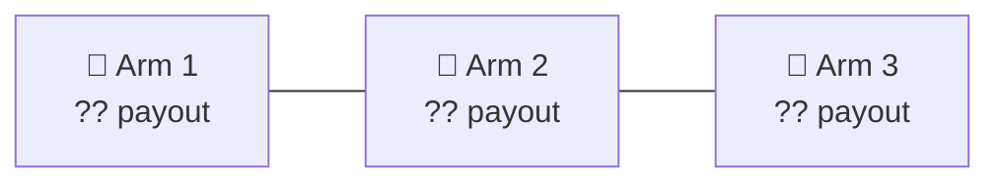

Which arm do you pull next? UCB1 tells you!

---

## MCTS Properties

---

### Advantages of MCTS

| Property            | Description                                         |
| ------------------- | --------------------------------------------------- |
| **Anytime**         | Can return a move at any point (more time = better) |
| **No eval needed**  | Doesn't require a heuristic evaluation function     |
| **Asymmetric tree** | Focuses search on promising branches                |
| **Domain agnostic** | Works for any game with defined rules               |

---

### MCTS vs Minimax

| Feature          | Minimax + α-β       | MCTS                     |
| ---------------- | ------------------- | ------------------------ |
| Search type      | Exhaustive (depth)  | Sampling (statistics)    |
| Eval function    | **Required**        | Not required             |
| Branching factor | Sensitive           | Handles large b well     |
| Time control     | Iterative deepening | Anytime (natural)        |
| Optimal play     | Yes (full depth)    | Converges asymptotically |

---

### The Asymmetric Tree

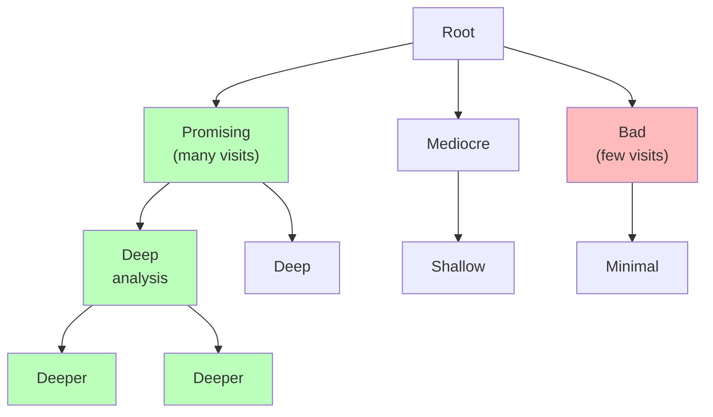

MCTS naturally searches deeper in promising directions.

---

## AlphaGo & Neural MCTS

---

### The AlphaGo Revolution (2016)

DeepMind's AlphaGo beat Lee Sedol 4-1 in Go:

- Combined MCTS with **deep neural networks**
- **Policy network**: predicts good moves (replaces random rollouts)
- **Value network**: evaluates positions (replaces simulation)

---

### Neural MCTS Architecture

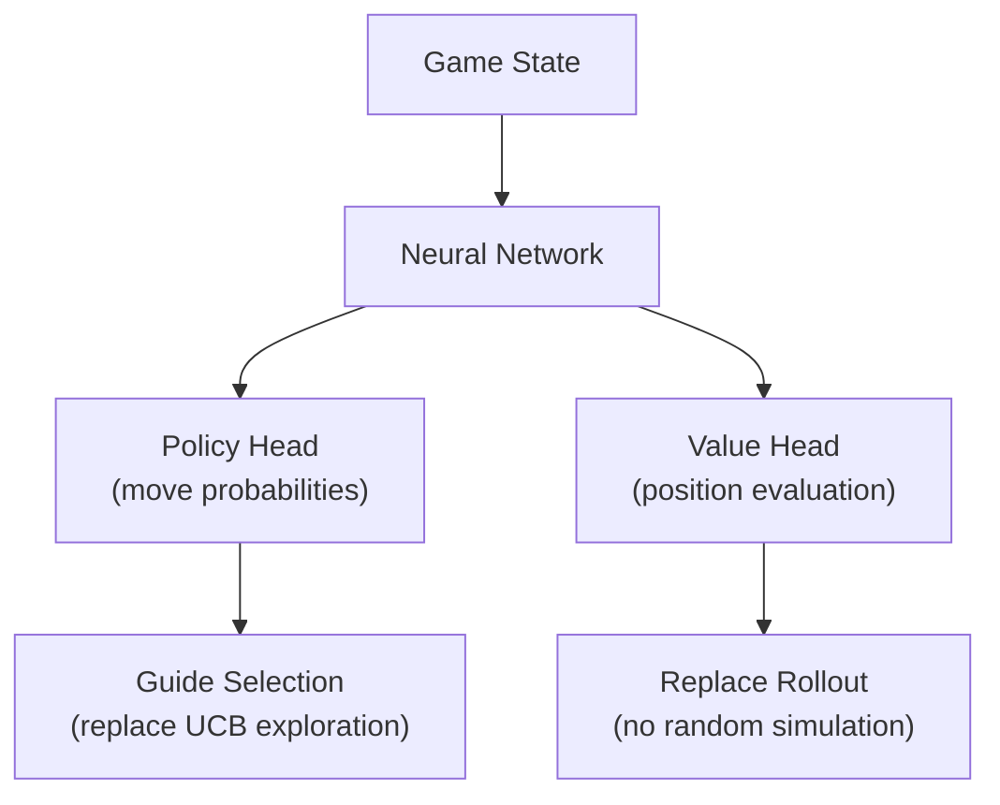

---

### PUCT (Predictor + UCT)

AlphaGo's selection formula:

$$UCB = \frac{w_i}{n_i} + C \cdot p_i \cdot \frac{\sqrt{N}}{1 + n_i}$$

Where $p_i$ = **prior probability** from neural network policy.

- Informed exploration: focus on moves the network considers good
- Still explores alternatives, but less randomly

---

### AlphaGo → AlphaZero

| Version          | Year | Key Innovation                       |
| ---------------- | ---- | ------------------------------------ |
| **AlphaGo Fan**  | 2015 | MCTS + CNN + human game data         |
| **AlphaGo Lee**  | 2016 | Deeper networks, beat world champion |
| **AlphaGo Zero** | 2017 | Self-play only, no human data        |
| **AlphaZero**    | 2017 | Generalized to Chess, Shogi, and Go  |

AlphaZero mastered Chess in **4 hours** of self-play training.

---

## Practical Considerations

---

### Memory Management

MCTS trees can grow **very large**:

```cpp
// Tree reuse between moves
void reuseTree(MCTSNode* root, Move opponentMove) {
    for (auto* child : root->children) {
        if (child->state.lastMove() == opponentMove) {
            // Promote this subtree as new root
            child->parent = nullptr;
            deleteOtherChildren(root, child);
            return child;
        }
    }
    // Opponent played unexpected move
    return new MCTSNode(newState);
}
```

---

### Parallelization

Three main approaches:

| Method            | Description                         |
| ----------------- | ----------------------------------- |
| **Leaf parallel** | Multiple rollouts from same leaf    |
| **Root parallel** | Independent trees, merge statistics |
| **Tree parallel** | Shared tree with virtual loss       |

Virtual loss trick: temporarily count a visit as a loss to discourage other threads from visiting the same node.

---

### When to Use MCTS

✅ **Good for:**

- Games with large branching factors (Go, Hex)
- Games without good evaluation functions
- Single-player puzzles (planning)
- Real-time strategy games

❌ **Less suitable for:**

- Games where minimax works well (Chess, Checkers)
- Games requiring deep tactical calculation
- Deterministic games with small state spaces

---

## Data Structure

---

### MCTSNode Class

```cpp
class MCTSNode {
public:
    MCTSNode* parent;
    std::vector<MCTSNode*> children;
    double wins;
    int visits;
    GameState state;

    MCTSNode(GameState s)
        : parent(nullptr), wins(0.0), visits(0), state(s) {}

    double ucb(double C = std::sqrt(2.0)) {
        if (visits == 0)
            return std::numeric_limits<double>::max();
        return (wins / visits)
            + C * std::sqrt(std::log(parent->visits) / visits);
    }

    bool isLeaf() { return children.empty(); }
    bool isTerminal() { return state.isTerminal(); }
};
```

---

## Summary

---

### Key Takeaways

1. **MCTS** builds a partial tree guided by random simulations
2. **Four phases:** Selection → Expansion → Simulation → Backpropagation
3. **UCB1** balances exploration and exploitation
4. **Anytime algorithm** — more iterations = better moves
5. **Neural MCTS** (AlphaZero) replaces rollouts with neural networks

---

### Complexity

| Aspect         | Value                                      |
| -------------- | ------------------------------------------ |
| Time per iter. | $O(d)$ where $d$ = simulation depth        |
| Space          | $O(n)$ nodes in tree (grows incrementally) |
| Convergence    | Approaches minimax value as $n → ∞$        |

---

### What's Next?

- Implementing MCTS for a real game
- Combining MCTS with domain heuristics
- Neural network integration
- Multi-agent MCTS

---

## Questions?

### Resources

- [MCTS Visualizer](https://vgarciasc.github.io/mcts-viz/)
- Browne et al., _A Survey of MCTS Methods_ (2012)
- Silver et al., _Mastering the game of Go_ (Nature, 2016)
