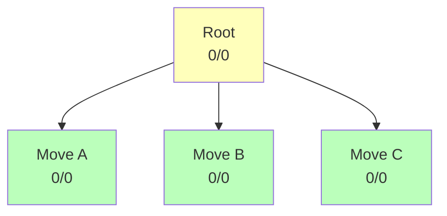
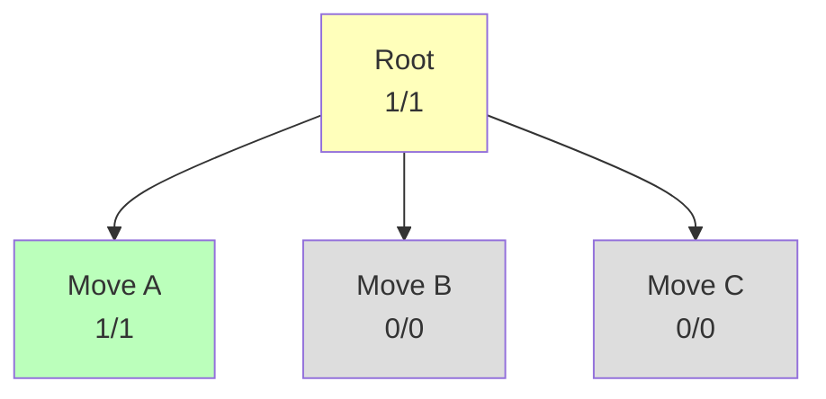
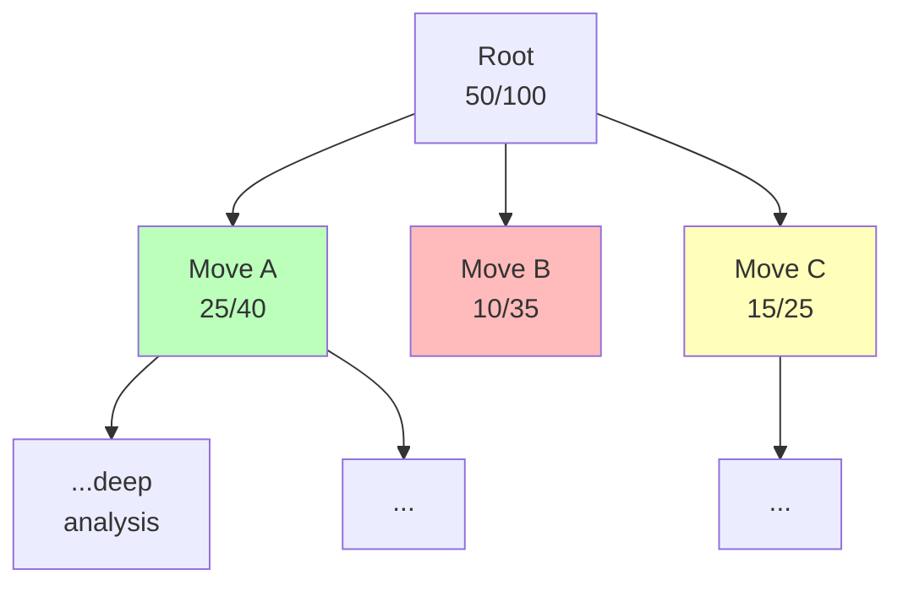

# Monte Carlo Tree Search

<details>
<summary>Lecture Notes</summary>

- Why MCTS?
- The Four Phases
- UCB1 and Exploration vs Exploitation
- Implementation Details
- AlphaGo and Neural MCTS

</details>

**Video explanations:** [MCTS Explained](https://www.youtube.com/watch?v=UXW2yZndl7U) | [AlphaGo Documentary](https://www.youtube.com/watch?v=WXuK6gekU1Y) | [AI and Games: MCTS](https://www.youtube.com/watch?v=lhFXKNyA0QA) | [Coding Adventure: Chess](https://www.youtube.com/watch?v=U4ogK0MIzqk)

Monte Carlo Tree Search (MCTS) is a search algorithm that uses random simulations to estimate the value of different actions in a game. Unlike minimax, which exhaustively explores the game tree to a fixed depth, MCTS builds a partial tree incrementally by sampling random games (rollouts) and using statistics to guide which parts of the tree to explore further.

MCTS is particularly powerful for games with large branching factors where minimax is infeasible—most famously Go, where the branching factor of ~250 makes exhaustive search impossible.

## Why Not Just Use Minimax?

Minimax with alpha-beta pruning works beautifully for games like Chess, where:

1. The branching factor (~35) is manageable
2. Good evaluation functions exist (material count, piece-square tables)
3. Search depths of 10-20 plies produce strong play

But for many games, these conditions don't hold:

- **Go (19×19):** Branching factor ~250, no reliable evaluation function was known before neural networks
- **General Game Playing:** No domain-specific evaluation available
- **Real-time games:** Need to make decisions quickly without deep search
- **Games with randomness:** Dice rolls, card draws, hidden information

MCTS addresses all of these by replacing exhaustive search with **statistical sampling**.

## The Core Idea

Instead of evaluating every possible move sequence:

1. **Sample** random games from the current position
2. **Track** which starting moves lead to more wins
3. **Focus** on promising moves (search deeper where it matters)
4. **Choose** the move with the best statistics

Think of it like choosing a restaurant: rather than reading every menu in town (minimax), you try a few places randomly, then keep going back to the ones that were good (MCTS).

## The Four Phases

MCTS repeats four phases in a loop until a computational budget (time or iterations) is exhausted:

### Phase 1: Selection

Starting from the root node, traverse the tree by selecting children using a **tree policy** until reaching a leaf node (a node with unexpanded children or a terminal state).

The tree policy must balance:

- **Exploitation:** Choose moves that have performed well so far
- **Exploration:** Try moves that haven't been tested enough

The standard solution is **UCB1** (Upper Confidence Bound for Trees):

$$UCB1(i) = \frac{w_i}{n_i} + C \sqrt{\frac{\ln N}{n_i}}$$

Where:

- $w_i$ = number of wins (or accumulated score) for child $i$
- $n_i$ = number of visits to child $i$
- $N$ = number of visits to the parent node
- $C$ = exploration constant (typically $\sqrt{2}$)

The first term is the **exploitation** component—it favors nodes with high win rates. The second term is the **exploration** component—it grows when a node has been visited infrequently relative to its siblings, encouraging the algorithm to try less-explored moves.

```cpp
MCTSNode* select(MCTSNode* node) {
    while (!node->isLeaf()) {
        // Select child with highest UCB1 value
        node = *std::max_element(
            node->children.begin(),
            node->children.end(),
            [](MCTSNode* a, MCTSNode* b) {
                return a->ucb() < b->ucb();
            }
        );
    }
    return node;
}
```

**Key insight:** Unvisited nodes have $n_i = 0$, giving UCB1 = ∞. This ensures every child is visited at least once before any child is visited twice.

### Phase 2: Expansion

When the selection reaches a leaf node that is **not terminal** (i.e., the game hasn't ended), we expand it by generating one or more child nodes representing the legal moves from that position.

```cpp
void expand(MCTSNode* node) {
    std::vector<GameState> nextStates = node->state.getPossibleStates();
    for (const GameState& state : nextStates) {
        MCTSNode* child = new MCTSNode(state);
        child->parent = node;
        node->children.push_back(child);
    }
}
```

A common optimization is to expand only **one child at a time** rather than all children. This saves memory and focuses computation on the most promising lines.

### Phase 3: Simulation (Rollout)

From the newly expanded node, play a complete game using a **default policy** (typically random moves) until reaching a terminal state. The result of this game (win, loss, or draw) becomes the signal we use to update the tree.

```cpp
double simulate(MCTSNode* node) {
    GameState state = node->state;

    while (!state.isTerminal()) {
        auto moves = state.getPossibleMoves();
        // Default policy: uniform random
        state = state.applyMove(moves[rand() % moves.size()]);
    }

    // Return result from the perspective of the node's player
    // 1.0 = win, 0.0 = loss, 0.5 = draw
    return state.getResult(node->state.currentPlayer());
}
```

**Why does random play work?** By the Law of Large Numbers, the average outcome of many random games converges to the true expected value of a position. Positions where you have more winning moves will naturally produce more wins in random play.

The quality of simulations can be improved with better rollout policies:

| Policy Type        | Description                                  | Speed  | Quality |
| ------------------ | -------------------------------------------- | ------ | ------- |
| **Uniform random** | Pick any legal move with equal probability   | Fast   | Low     |
| **Light playout**  | Simple rules (e.g., capture when possible)   | Fast   | Medium  |
| **Heavy playout**  | Domain-specific patterns and heuristics      | Slow   | High    |
| **Neural network** | Learned policy network predicts strong moves | Varies | Highest |

### Phase 4: Backpropagation

After the simulation, propagate the result back up the tree from the simulated node to the root, updating the visit count and win count at each node along the path.

```cpp
void backpropagate(MCTSNode* node, double result) {
    while (node != nullptr) {
        node->visits++;
        node->wins += result;
        // Flip perspective: parent is opponent
        result = 1.0 - result;
        node = node->parent;
    }
}
```

**Critical detail:** The result must be **flipped** at each level because alternating players have opposite goals. If the rollout was a win for the player who just moved, it's a loss for the player at the parent node.

---

## Visualizing the MCTS Process

### Iteration 1: Starting from Nothing



Expand root to reveal all legal moves. All children have UCB1 = ∞, so pick the first.

### After Rollout from Move A: WIN



### After 100 Iterations



- **Move A:** 40 visits, 62.5% win rate → most explored (exploitation)
- **Move B:** 35 visits, 28.6% win rate → explored but losing
- **Move C:** 25 visits, 60.0% win rate → still being explored

The tree grows **asymmetrically**, focusing resources on the most promising lines.

---

## The Complete MCTS Algorithm

Putting all four phases together:

```cpp
Move mctsSearch(GameState rootState, int iterations) {
    MCTSNode* root = new MCTSNode(rootState);

    for (int i = 0; i < iterations; i++) {
        // Phase 1: Selection
        MCTSNode* leaf = select(root);

        // Phase 2: Expansion
        if (!leaf->state.isTerminal()) {
            expand(leaf);
            leaf = leaf->children[0]; // simulate from first new child
        }

        // Phase 3: Simulation
        double result = simulate(leaf);

        // Phase 4: Backpropagation
        backpropagate(leaf, result);
    }

    // Choose the move with the most visits (most robust)
    return bestChild(root)->state.lastMove();
}
```

### Selecting the Final Move

After the search completes, we need to choose which move to actually play. There are several strategies:

```cpp
MCTSNode* bestChild(MCTSNode* root) {
    return *std::max_element(
        root->children.begin(),
        root->children.end(),
        [](MCTSNode* a, MCTSNode* b) {
            return a->visits < b->visits;
        }
    );
}
```

The **most visited** child is preferred over the highest win rate because:

- Visit count is more robust to outliers
- A node with 1 win out of 1 visit (100%) is less reliable than 80 wins out of 100 visits (80%)
- In the limit, the most visited node converges to the best node

---

## UCB1 Deep Dive

### The Multi-Armed Bandit Problem

MCTS selection is an instance of the **multi-armed bandit** problem: you have $k$ slot machines with unknown payout rates. Each turn, you pick one machine to play. How do you maximize your total winnings?

- **Pure exploitation:** Always play the machine with the best observed payout → miss better machines
- **Pure exploration:** Try every machine equally → waste time on bad machines
- **UCB1:** Optimal balance with provable logarithmic regret

### Tuning the Exploration Constant

The constant $C$ controls the exploration-exploitation tradeoff:

$$UCB1 = \underbrace{\frac{w_i}{n_i}}_{\text{exploit}} + \underbrace{C \sqrt{\frac{\ln N}{n_i}}}_{\text{explore}}$$

- $C = 0$: Pure greedy (always pick best win rate)
- $C = \sqrt{2} \approx 1.41$: Theoretically optimal for rewards in [0,1]
- $C = 2.0$: More exploration, useful for games with high variance

In practice, $C$ is often tuned empirically. For Go, values around 1.4–2.5 are common. For simpler games, smaller values work.

### UCB1 Worked Example

Parent: $N = 200$ visits

| Child   | Wins ($w$) | Visits ($n$) | Win Rate | Exploration Term | UCB1  |
| ------- | ---------- | ------------ | -------- | ---------------- | ----- |
| Child A | 90         | 100          | 0.900    | 0.326            | 1.226 |
| Child B | 28         | 40           | 0.700    | 0.516            | 1.216 |
| Child C | 5          | 10           | 0.500    | 0.730            | 1.230 |
| Child D | 0          | 0            | —        | ∞                | ∞     |

**Child D** (unvisited) is selected first. After that, **Child C** gets a boost from the exploration term despite its lower win rate.

---

## AlphaGo and Neural MCTS

### The AlphaGo Breakthrough

In March 2016, DeepMind's AlphaGo defeated Lee Sedol (one of the world's best Go players) 4-1. This was considered a landmark in AI because Go's branching factor of ~250 had made it resistant to traditional search algorithms for decades.

AlphaGo combined MCTS with two deep neural networks:

1. **Policy network** $p(a|s)$: Predicts the probability of each move being good (trained on millions of human games, then refined by self-play)
2. **Value network** $v(s)$: Estimates the win probability from a given position (replaces random rollouts)

### PUCT: Neural-Guided Selection

Instead of UCB1, AlphaGo uses **PUCT** (Predictor + Upper Confidence Trees):

$$PUCT(i) = \frac{w_i}{n_i} + C \cdot p_i \cdot \frac{\sqrt{N}}{1 + n_i}$$

Where $p_i$ is the prior probability from the policy network. This means the search is **guided by the neural network's intuition** rather than exploring blindly.

### From AlphaGo to AlphaZero

| System           | Year | Training Data           | Games Mastered   |
| ---------------- | ---- | ----------------------- | ---------------- |
| AlphaGo Fan      | 2015 | 30M human games         | Go only          |
| AlphaGo Lee      | 2016 | Human games + self-play | Go only          |
| **AlphaGo Zero** | 2017 | **Self-play only**      | Go only          |
| **AlphaZero**    | 2017 | **Self-play only**      | Go, Chess, Shogi |

AlphaZero's key insight: with a strong enough neural network, you don't need random rollouts at all. The value network directly estimates the position's value, and the policy network guides the search. AlphaZero mastered Chess in just 4 hours of training, surpassing Stockfish.

---

## Practical Implementation Notes

### Memory Management

MCTS trees can grow very large. Key strategies:

1. **Tree reuse:** After a move is played, promote the corresponding subtree and discard the rest
2. **Node limits:** Cap the maximum number of nodes and reuse memory
3. **Smart pointers:** Use `unique_ptr` or custom allocators to avoid leaks

```cpp
// Tree reuse between moves
MCTSNode* reuseTree(MCTSNode* root, Move opponentMove) {
    for (auto* child : root->children) {
        if (child->state.lastMove() == opponentMove) {
            child->parent = nullptr;
            // Delete siblings, keep this subtree
            for (auto* sibling : root->children)
                if (sibling != child) delete sibling;
            delete root;
            return child;
        }
    }
    return new MCTSNode(newStateAfter(opponentMove));
}
```

### Parallelization

MCTS can be parallelized in several ways:

- **Leaf parallelization:** Run multiple rollouts from the same leaf in parallel
- **Root parallelization:** Build independent trees on separate threads, merge statistics at the end
- **Tree parallelization (virtual loss):** Share the tree across threads; when a thread starts processing a node, apply a "virtual loss" to discourage other threads from visiting the same node

```cpp
// Virtual loss: temporarily penalize a node
void applyVirtualLoss(MCTSNode* node) {
    while (node != nullptr) {
        node->visits++;       // Count visit
        // Don't add a win → effectively a loss
        node = node->parent;
    }
}
```

### Time Management

For competitive play, MCTS needs smart time allocation:

```cpp
Move mctsSearchTimed(GameState state, double timeLimit) {
    MCTSNode* root = new MCTSNode(state);
    auto start = std::chrono::steady_clock::now();

    while (true) {
        auto elapsed = std::chrono::steady_clock::now() - start;
        if (elapsed > std::chrono::duration<double>(timeLimit))
            break;

        MCTSNode* leaf = select(root);
        if (!leaf->state.isTerminal()) {
            expand(leaf);
            leaf = leaf->children[0];
        }
        double result = simulate(leaf);
        backpropagate(leaf, result);
    }

    return bestChild(root)->state.lastMove();
}
```

---

## MCTS Properties and Convergence

### Theoretical Guarantees

1. **Convergence:** As iterations → ∞, MCTS converges to the minimax value
2. **Consistency:** The probability of selecting the optimal move approaches 1
3. **Anytime:** Can return a move at any point; more time = better quality

### When MCTS Excels vs When It Doesn't

| Scenario                         | MCTS Performance    |
| -------------------------------- | ------------------- |
| Large branching factor (Go)      | ✅ Excellent        |
| No evaluation function available | ✅ Excellent        |
| Stochastic games (dice, cards)   | ✅ Good             |
| Single-agent planning            | ✅ Good             |
| Small branching + good eval      | ⚠️ Minimax better   |
| Deep tactical combinations       | ⚠️ May miss them    |
| Real-time constraints            | ✅ Anytime property |

---

## MCTS vs Minimax Summary

| Feature             | Minimax + Alpha-Beta     | MCTS                        |
| ------------------- | ------------------------ | --------------------------- |
| Tree coverage       | Exhaustive to depth $d$  | Partial, asymmetric         |
| Evaluation function | Required                 | Not required                |
| Branching factor    | $O(b^d)$ or $O(b^{d/2})$ | Handles large $b$ naturally |
| Optimal play        | Yes (at full depth)      | Converges asymptotically    |
| Time control        | Iterative deepening      | Naturally anytime           |
| Randomness/info     | Difficult to handle      | Natural fit                 |
| Implementation      | Simpler                  | More infrastructure needed  |

Both approaches have their place. Modern engines like Leela Chess Zero use MCTS with neural networks, while Stockfish uses alpha-beta with neural evaluation - and they perform comparably!
