# Chess Engine Core

## From Search Algorithms to a Real Chess Engine

---

## Agenda

1. Your Assignment Interface
2. FEN & UCI Notation
3. Board Representation
4. Move Generation
5. Evaluation Function Design
6. MCTS for Chess
7. Iterative Deepening
8. Aspiration Windows
9. Quiescence Search
10. Time Management

---

## Your Assignment Interface

---

### One Function, One Job

```cpp
namespace ChessSimulator {
    std::string Move(std::string fen, int timeLimitMs = 10000);
}
```

- Receive FEN string + time budget → analyze position → return UCI move string
- Example: `"e2e4"`, `"g1f3"`, `"e7e8q"`

---

### How It Works

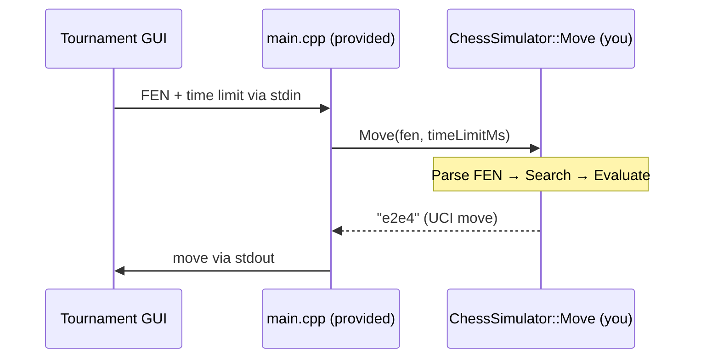

---

### The Provided main.cpp

```cpp
#include "chess-simulator.h"
#include "chess.hpp"
#include <string>

int main() {
    std::string line;
    getline(std::cin, line);
    // parse: "<fen> | <timeLimitMs>"
    auto sep = line.find('|');
    std::string fen = line.substr(0, sep);
    int timeLimitMs = std::stoi(line.substr(sep + 1));
    auto move = ChessSimulator::Move(fen, timeLimitMs);
    std::cout << move << std::endl;
}
```

You only implement `ChessSimulator::Move()`.

---

## FEN & UCI Notation

---

### Forsyth-Edwards Notation (FEN)

The string your `Move()` function receives:

```
rnbqkbnr/pppppppp/8/8/4P3/8/PPPP1PPP/RNBQKBNR b KQkq e3 0 1
```

| Field           | Example | Meaning                      |
| --------------- | ------- | ---------------------------- |
| Piece placement | `rn...` | Ranks 8 to 1, `/` separated  |
| Side to move    | `b`     | Black to move                |
| Castling rights | `KQkq`  | All castling still available |
| En passant      | `e3`    | Target square (or `-`)       |
| Halfmove clock  | `0`     | For 50-move rule             |
| Fullmove number | `1`     | Increments after black moves |

---

### UCI Move Notation

| Move Type          | Example              | Format    |
| ------------------ | -------------------- | --------- |
| Normal move        | Knight f3 to e5      | `"f3e5"`  |
| Pawn push          | Pawn e2 to e4        | `"e2e4"`  |
| Castling kingside  | White O-O            | `"e1g1"`  |
| Castling queenside | Black O-O-O          | `"e8c8"`  |
| Pawn promotion     | e7 promotes to queen | `"e7e8q"` |
| En passant         | e5 captures d6 e.p.  | `"e5d6"`  |

4 characters (source + destination), +1 for promotion (`q`, `r`, `b`, `n`).

---

## Board Representation

---

### Three Approaches

| Feature         | Mailbox            | 0x88               | Bitboards         |
| --------------- | ------------------ | ------------------ | ----------------- |
| Simplicity      | ✅ Easiest         | ⚠️ Moderate        | ❌ Complex        |
| Speed           | ❌ Slow            | ⚠️ Moderate        | ✅ Fastest        |
| Edge detection  | Bounds check       | `& 0x88`           | Implicit in masks |
| Sliding attacks | Loop per direction | Loop per direction | Magic bitboards   |
| Used by         | Teaching engines   | Mid-level engines  | Stockfish, Leela  |

---

### Mailbox (Array-Based)

```cpp
enum Piece { EMPTY, W_PAWN, W_KNIGHT, W_BISHOP,
             W_ROOK, W_QUEEN, W_KING,
             B_PAWN, B_KNIGHT, B_BISHOP,
             B_ROOK, B_QUEEN, B_KING };

Piece board[8][8];

// Access: board[rank][file]
// e4 = board[3][4]
```

**Pros:** Intuitive, easy to debug.

**Cons:** Looping through pieces for every query.

---

### 0x88 Board

16×8 = 128-square array. Valid squares satisfy `(index & 0x88) == 0`.

```
Index in binary:  rrrr ffff

0x88 mask:        1000 1000

Valid (0x34=e4):  0011 0100 & 1000 1000 = 0  ✅
Off-board (0x39): 0011 1001 & 1000 1000 ≠ 0  ❌
```

**One instruction replaces all bounds-checking!**

---

### 0x88: Knight Moves

```cpp
int knightOffsets[] = {-33,-31,-18,-14, 14, 18, 31, 33};

void generateKnightMoves(int square) {
    for (int offset : knightOffsets) {
        int target = square + offset;
        if ((target & 0x88) == 0     // on board?
            && !isFriendly(board[target])) {
            addMove(square, target);
        }
    }
}
```

No edge special-casing needed.

---

### Bitboards

A **64-bit integer** where each bit = one square.

- 12 piece bitboards (one per piece type per color)
- Questions become **bitwise operations** (1 CPU cycle)

```
  a  b  c  d  e  f  g  h
8: 0  0  0  0  0  0  0  0
7: 0  0  0  0  0  0  0  0
  ...
2: 1  1  1  1  1  1  1  1  ← whitePawns
1: 0  0  0  0  0  0  0  0
```

`whitePawns = 0x000000000000FF00`

---

### Bitwise Operations = Chess Queries

| Chess Question          | Bitwise Operation           | Cycles |
| ----------------------- | --------------------------- | ------ |
| Is square e4 occupied?  | `occupied & (1ULL << 28)`   | 1      |
| Knight attacks from sq? | `KNIGHT_TABLE[sq]`          | 1      |
| How many white pawns?   | `popcount(whitePawns)`      | 1      |
| All white pawn pushes   | `(whitePawns << 8) & empty` | 2      |
| Remove piece from e4    | `board &= ~(1ULL << 28)`    | 1      |

All 8 pawns move in 2 instructions!

---

### Magic Bitboards: $O(1)$ Sliding Attacks

Precompute every attack pattern for every square + blocker config.

```cpp
uint64_t rookAttacks(int sq, uint64_t occupied) {
    uint64_t blockers = occupied & rookMagics[sq].mask;
    uint64_t index = (blockers * rookMagics[sq].magic)
                      >> rookMagics[sq].shift;
    return rookMagics[sq].table[index];
}
```

Single **multiply + shift + table lookup** → replaced ray-casting loops.

---

## Move Generation

---

### Types of Moves

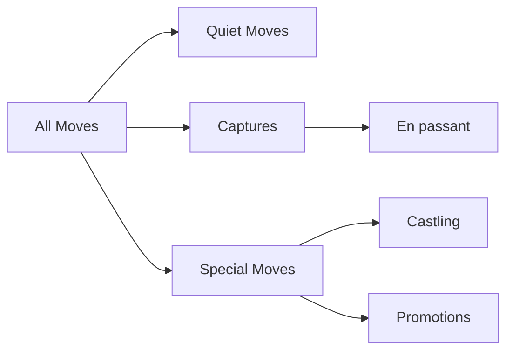

---

### Pseudo-Legal vs Legal Moves

Most engines generate moves in two stages:

1. **Pseudo-legal:** Follow piece rules (may leave king in check)
2. **Filter:** Remove moves that leave the king exposed

```cpp
for (const Move& move : pseudoLegal) {
    board.makeMove(move);
    if (!board.isInCheck(sideJustMoved))
        legal.push_back(move);
    board.undoMove(move);
}
```

The library handles this for you via `chess::movegen::legalmoves()`.

---

## Evaluation Function Design

---

### The Heart of Your Engine

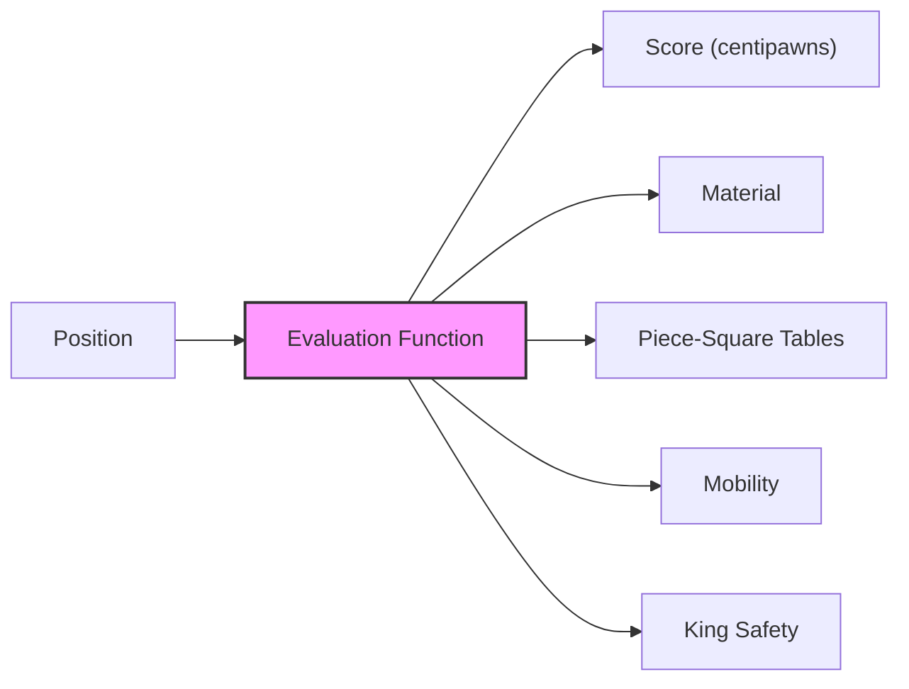

Positive = white is winning. Negative = black is winning.

---

### Evaluation Quality → Engine Strength

| Evaluation Level           | Typical Elo | Terms Included         |
| -------------------------- | ----------- | ---------------------- |
| Random evaluation          | ~400        | None                   |
| Material only              | ~1200-1400  | Piece values           |
| Material + PST             | ~1600-1800  | + Piece positions      |
| + Mobility + King Safety   | ~2000-2200  | + Activity, safety     |
| + Pawn Structure + Endgame | ~2200-2400  | + Structural features  |
| NNUE (neural network)      | ~3500+      | Learned from self-play |

---

### Material Balance

| Piece  | Value (centipawns) |
| ------ | ------------------ |
| Pawn   | 100                |
| Knight | 320                |
| Bishop | 330                |
| Rook   | 500                |
| Queen  | 900                |
| King   | 99999 (infinite)   |

```cpp
int score = 0;
for (int piece = PAWN; piece <= KING; piece++) {
    score += VALUE[piece] * board.pieceCount(WHITE, piece);
    score -= VALUE[piece] * board.pieceCount(BLACK, piece);
}
```

---

### Piece-Square Tables (PST)

Bonus/penalty for each piece on each square.

```cpp
// Knight PST, "A knight on the rim is dim"
const int KNIGHT_PST[64] = {
    -50,-40,-30,-30,-30,-30,-40,-50,
    -40,-20,  0,  0,  0,  0,-20,-40,
    -30,  0, 10, 15, 15, 10,  0,-30,
    -30,  5, 15, 20, 20, 15,  5,-30,  // center = best
    -30,  0, 15, 20, 20, 15,  0,-30,
    -30,  5, 10, 15, 15, 10,  5,-30,
    -40,-20,  0,  5,  5,  0,-20,-40,
    -50,-40,-30,-30,-30,-30,-40,-50
};
```

Center = +20, rim = -50. Encodes positional knowledge.

---

### Tapered Evaluation

Kings want opposite things in different game phases:

- **Middlegame (mg):** Hide behind pawns, penalize central king
- **Endgame (eg):** Centralize, reward active king

Maintain **two separate PSTs** for each piece and compute **two scores**:

- $\text{mg}$ = total score using middlegame PSTs
- $\text{eg}$ = total score using endgame PSTs

---

### Tapered Eval Formula

$$\text{eval} = \frac{\text{phase} \times \text{mg} + (256 - \text{phase}) \times \text{eg}}{256}$$

- `phase` = 256 when all pieces on board (opening), decreases as pieces are captured, reaches 0 in pure king+pawn endgame

```cpp
// Compute phase from remaining material
int phase = totalKnights * 1 + totalBishops * 1
          + totalRooks * 2   + totalQueens * 4;
// max phase = 24 (all minor+major pieces)
// scale to 0–256:
phase = (phase * 256 + 12) / 24;

int eval = (phase * mgScore + (256 - phase) * egScore) / 256;
```

Full pieces → `phase ≈ 256` → eval ≈ mg score.
Few pieces → `phase ≈ 0` → eval ≈ eg score.

---

### King Safety

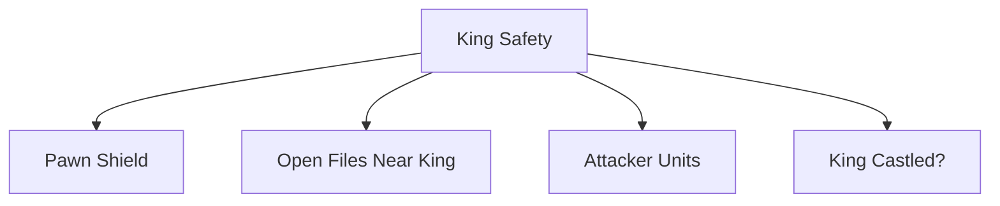

- **Pawn shield:** Pawns in front of king = protection
- **Attack units:** Count enemy pieces aimed at king zone
- **Non-linear penalty:** 1 attacker = manageable, 3+ = often fatal

---

### Attack Units: Non-Linear Danger

```cpp
const int ATTACK_WEIGHT[] =
    {0, 0, 50, 75, 88, 94, 97, 99};
```

| Attackers | Danger Level    |
| --------- | --------------- |
| 0–1       | Safe            |
| 2         | Moderate (50%)  |
| 3         | Dangerous (75%) |
| 4+        | Critical (88%+) |

Quadratic scaling captures the reality of chess attacks.

---

## MCTS for Chess

---

### Why Consider MCTS?

| Challenge             | Alpha-Beta              | MCTS                        |
| --------------------- | ----------------------- | --------------------------- |
| Time management       | Must check clock        | Naturally anytime           |
| Writing eval function | Required (hard!)        | Rollouts provide eval free  |
| Uneven positions      | Same depth everywhere   | Focuses on uncertain moves  |
| Horizon effect        | Needs quiescence search | Rollouts see beyond horizon |

---

### Prioritized UCB1

Add **prior scores** from chess heuristics to guide early exploration:

$$\text{UCB1}_{\text{prior}}(i) = \frac{w_i}{n_i} + C \sqrt{\frac{\ln N}{n_i}} + \frac{P_i}{n_i + 1}$$

- $P_i$ = prior score (captures, checks, promotions get high priors)
- Fades as $n_i$ grows → statistics take over
- Similar to AlphaZero's PUCT, but with hand-crafted heuristics

---

### Hybrid: MCTS + Evaluation

Replace random rollouts with your eval function:

```cpp
double simulateWithEval(MCTSNode* node) {
    return sigmoid(evaluate(node->board));
}

// cp  = centipawns (100 cp = 1 pawn advantage)
// 400 = scaling constant (empirical fit to win probability)
double sigmoid(int cp) {
    return 1.0 / (1.0 + std::exp(-cp / 400.0));
}
// 0 cp → 0.5 (equal), +400 cp → 0.73, -400 cp → 0.27
```

MCTS needs scores in `[0, 1]` (win probability), but eval returns centipawns, sigmoid bridges the two.

---

### MCTS vs Alpha-Beta for Your Assignment

| Factor              | Alpha-Beta + ID          | MCTS + Eval            |
| ------------------- | ------------------------ | ---------------------- |
| Time management     | Must check clock         | Naturally anytime      |
| Eval function       | Hard requirement         | Optional (helps a lot) |
| Tactical accuracy   | Strong (exhaustive)      | Weaker (can miss)      |
| Tournament strength | Higher ceiling typically | Competitive w/ priors  |

**Either approach is valid for your assignment.**

---

## Iterative Deepening

---

### The Idea

Search depth 1, then 2, then 3, … until time runs out. Use the last **completed** depth's result.

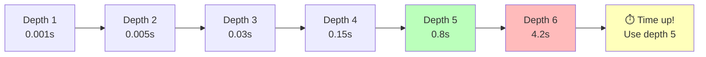

---

### Isn't It Wasteful?

Searching depth 1, then 2, then 3… repeats all previous work. But the cost is **negligible** because each depth has exponentially more nodes than all previous depths combined.

| Depth | Nodes ($35^d$) | Cumulative | Wasted % |
| ----- | -------------- | ---------- | -------- |
| 1     | 35             | 35         | -        |
| 2     | 1,225          | 1,260      | 2.8%     |
| 3     | 42,875         | 44,135     | 2.9%     |
| 4     | 1,500,625      | 1,544,760  | 2.9%     |
| 5     | **52,521,875** | 54,066,635 | 2.9%     |

Depth 5 alone is **97%** of all work. Re-searching depths 1–4 costs only ~3%.

---

### Why? Geometric Series

$$\sum_{i=1}^{d} b^i = \frac{b^{d+1} - b}{b - 1} \approx \frac{b}{b-1} \cdot b^d$$

For chess ($b \approx 35$):

$$\frac{35}{34} \approx 1.029$$

Total work across **all** depths = only $1.03 \times$ the last depth alone. The "wasted" iterations are a **rounding error**.

---

### The Real Power: Move Ordering

The best move from depth $d-1$ is searched **first** at depth $d$.

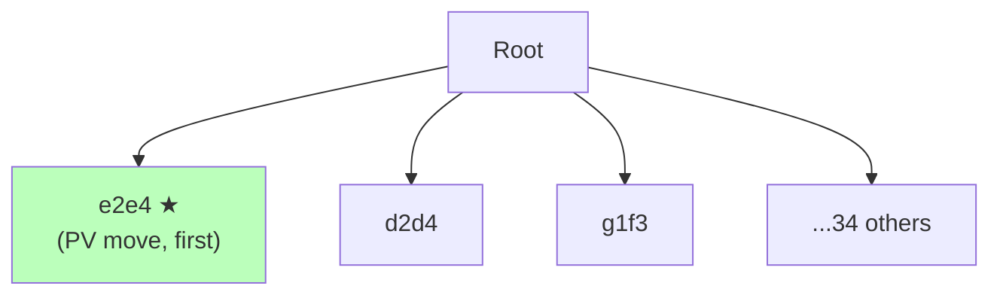

With perfect ordering, alpha-beta prunes from $O(b^d)$ to $O(b^{d/2})$.

Iterative deepening provides near-perfect ordering **for free**.

---

## Aspiration Windows

---

### Narrow the Search Window

Standard alpha-beta: window $(-\infty, +\infty)$, no early pruning.

With iterative deepening, you know the **previous depth's score**.

If depth $d-1$ scored **+35 cp**, search depth $d$ with window **(−15, +85)** instead.

Tighter bounds → more cutoffs → faster search.

---

### Handling Failures

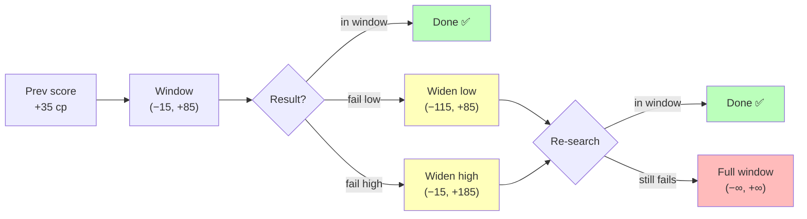

~85–90% of searches succeed in the initial window.

---

### Integration with Iterative Deepening

```cpp
int prevScore = 0;
for (int depth = 1; depth <= MAX_DEPTH; depth++) {
    int score;
    if (depth <= 2)
        score = alphaBeta(board, depth, -INF, +INF, best);
    else
        score = aspirationSearch(board, depth,
                                prevScore, best);
    if (timeUp) break;
    prevScore = score;
    bestMove = best;
}
```

Start aspiration from depth 3 (depth 1–2 have no useful previous score).

---

## Quiescence Search

---

### The Horizon Effect

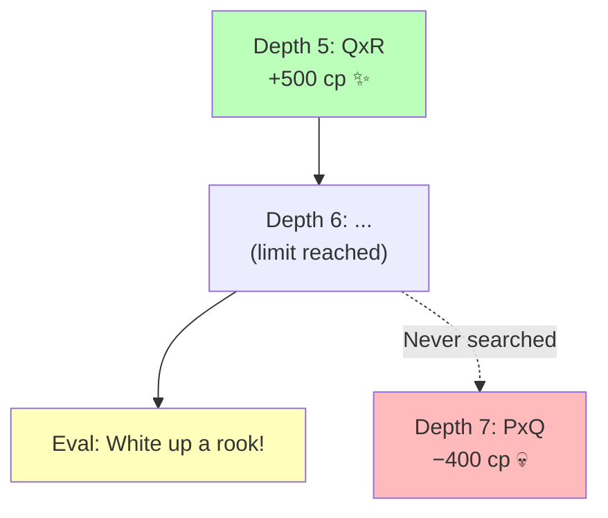

Engine sees half a capture exchange → thinks it's winning → blunders.

---

### The Solution: Search Captures at Leaves

At depth 0, instead of returning `evaluate()`, continue searching **only captures** until the position is quiet:

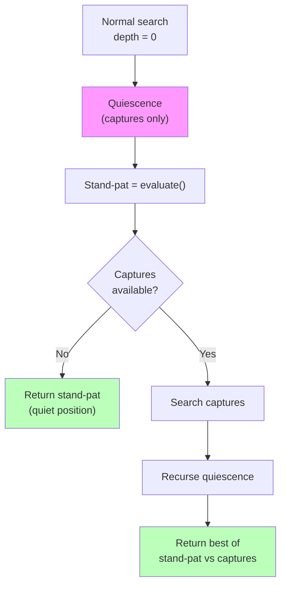

---

### Stand-Pat Score

The side to move can always **choose not to capture**.

```cpp
int quiescence(Board& board, int alpha, int beta) {
    int standPat = evaluate(board);
    if (standPat >= beta) return beta;
    if (standPat > alpha) alpha = standPat;

    // Search only captures, ordered by MVV-LVA
    for (const auto& capture : captures) {
        board.makeMove(capture);
        int score = -quiescence(board, -beta, -alpha);
        board.unmakeMove(capture);
        if (score >= beta) return beta;
        if (score > alpha) alpha = score;
    }
    return alpha;
}
```

---

### MVV-LVA: Capture Ordering

**Most Valuable Victim – Least Valuable Attacker**

| Capture | MVV-LVA Score       | Priority |
| ------- | ------------------- | -------- |
| PxQ     | 900×10 − 100 = 8900 | First    |
| NxR     | 500×10 − 320 = 4680 | Second   |
| QxP     | 100×10 − 900 = 100  | Last     |

Try winning captures first → prune losing ones via beta cutoff.

---

### Impact on Engine Strength

| Feature                | Without    | With Quiescence  |
| ---------------------- | ---------- | ---------------- |
| Tactical blunders      | Frequent   | Rare             |
| Evaluation reliability | Unreliable | Reliable         |
| Elo impact             | -          | **+200 to +400** |

**Not optional** for a competitive engine.

---

## Time Management

---

### The #1 Way to Lose

> More chess engines lose tournaments by **timing out** than by playing bad moves.

A simple engine that always returns in time beats a sophisticated one that occasionally gets killed.

---

### Time Budget Strategy

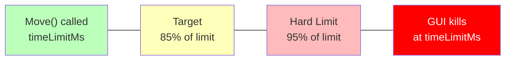

- **Always** have a fallback move before starting search
- Check deadline between depths in iterative deepening
- Check time every 2048 nodes during search
- Leave 10–15% margin for OS scheduling jitter

---

### Safety First

```cpp
std::string ChessSimulator::Move(std::string fen, int timeLimitMs) {
    chess::Board board;
    board.setFen(fen);
    auto deadline = std::chrono::steady_clock::now()
                  + std::chrono::milliseconds(timeLimitMs * 85 / 100);

    // ALWAYS have a fallback
    chess::Movelist moves;
    chess::movegen::legalmoves(moves, board);
    chess::Move bestMove = moves[0];

    // Iterative deepening with time check
    for (int depth = 1; depth <= 64; depth++) {
        chess::Move current;
        alphaBeta(board, depth, -INF, +INF, current);
        if (std::chrono::steady_clock::now() >= deadline) break;
        bestMove = current;
    }
    return bestMove.uci();
}
```

---

## Putting It All Together

---

### Engine Architecture

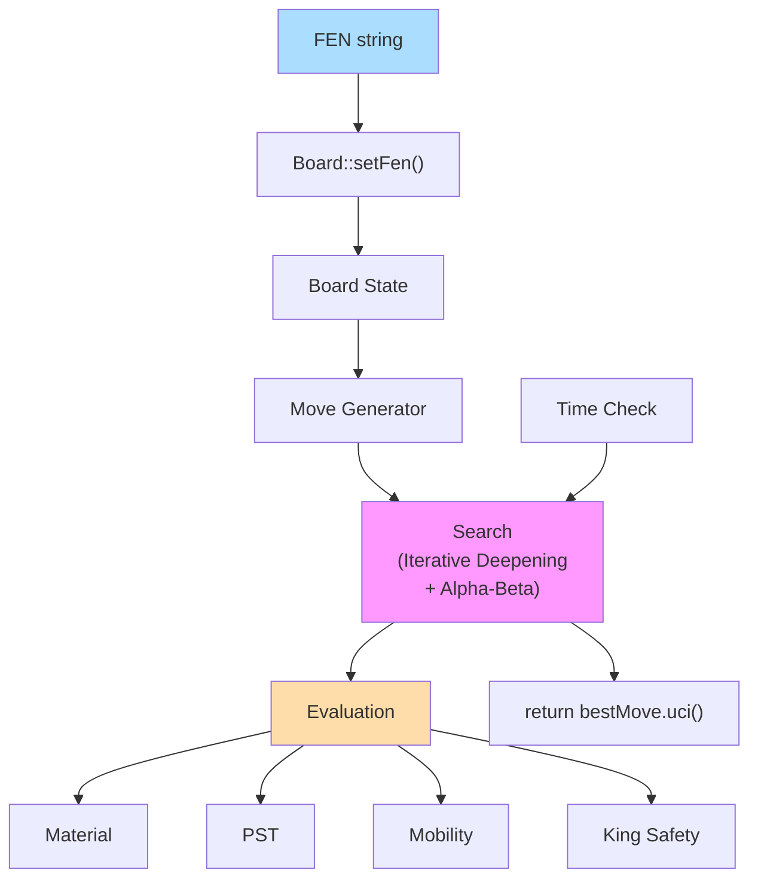

---

### Minimum Viable Engine

1. ✅ **Parse FEN**, `chess::Board::setFen(fen)`
2. ✅ **Generate moves**, `chess::movegen::legalmoves()`
3. ✅ **Search**, alpha-beta + iterative deepening
4. ✅ **Evaluate**, material + piece-square tables (minimum)
5. ✅ **Time management**, return before deadline kills you

---

## Historical Context

---

### From Shannon to Stockfish

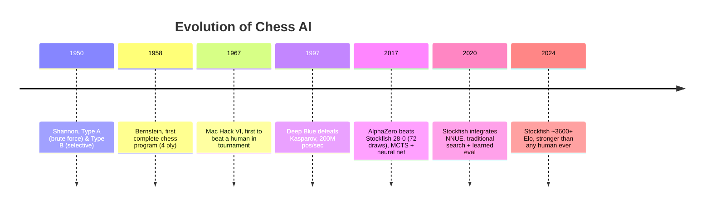

---

### Two Philosophies, One Game

| Approach                    | Engine      | Strategy                        |
| --------------------------- | ----------- | ------------------------------- |
| **Type A** (brute force)    | Stockfish   | Billions of positions/sec       |
| **Neural MCTS** (selective) | Leela (Lc0) | Thousands/sec, deep neural eval |

Both achieve superhuman play. You'll build a Type A engine, the same philosophy behind the world's strongest chess program.

---

## Summary

---

### Key Components

| Component                                    | Key Insight                                                   |
| -------------------------------------------- | ------------------------------------------------------------- |
| **`ChessSimulator::Move(fen, timeLimitMs)`** | Your only entry point, FEN + time budget in, UCI move out     |
| **Board Representation**                     | Bitboards are fastest; library handles it for you             |
| **Evaluation Function**                      | Material + PST minimum; mobility + king safety add ~400 Elo   |
| **Iterative Deepening**                      | Only 3% overhead, provides move ordering + anytime results    |
| **Aspiration Windows**                       | Narrow window around prev score → faster pruning              |
| **Quiescence Search**                        | Captures at leaves → eliminates horizon effect (+200-400 Elo) |
| **Time Management**                          | Conservative deadline, never time out                         |

---

## Questions?

### Resources

- [chess-library](https://github.com/Disservin/chess-library) by Disservin ⭐
- [Chess Programming Wiki](https://www.chessprogramming.org/)
- [Coding Adventure: Chess](https://www.youtube.com/watch?v=U4ogK0MIzqk) by Sebastian Lague
- Browne et al., _A Survey of MCTS Methods_ (2012)
