# Chess Engine Core

<details>
<summary>Lecture Notes</summary>

- Your Assignment Interface (`ChessSimulator::Move`)
- The UCI Protocol (Background Knowledge)
- Board Representation Strategies
- Move Generation
- Evaluation Function Design
- MCTS for Chess: An Alternative Search Strategy
- Iterative Deepening
- Aspiration Windows
- Quiescence Search
- Time Management for Tournament Play

</details>

**Video explanations:** [Coding Adventure: Chess](https://www.youtube.com/watch?v=U4ogK0MIzqk) | [Coding Adventure: Better Chess Bot](https://www.youtube.com/watch?v=_vqlIPDR2TU) | [How Chess Engines Work](https://www.youtube.com/watch?v=w4FFX_otR-4) | [The AI of Chess](https://www.youtube.com/watch?v=UKaRLXquKao)

This week we shift from general search algorithms to building a real chess engine. You already know minimax and MCTS, now you'll apply them to chess, one of the most deeply studied adversarial games in AI history. The challenge isn't the search algorithm itself; it's everything around it: how to represent the board efficiently, how to evaluate a position without playing it out, and how to manage your time in a tournament.

---

### UCI Move Notation

Your `Move()` function must return a string in **UCI long algebraic notation**:

| Move Type          | Example                   | Format    |
| ------------------ | ------------------------- | --------- |
| Normal move        | Knight f3 to e5           | `"f3e5"`  |
| Pawn push          | Pawn e2 to e4             | `"e2e4"`  |
| Capture            | Queen d1 takes d7         | `"d1d7"`  |
| Castling kingside  | White O-O                 | `"e1g1"`  |
| Castling queenside | Black O-O-O               | `"e8c8"`  |
| Pawn promotion     | Pawn e7 promotes to queen | `"e7e8q"` |
| En passant         | Pawn e5 captures d6 e.p.  | `"e5d6"`  |

Always four characters (source square + destination square), plus a fifth character for promotion piece (`q`, `r`, `b`, `n`).

---

## The UCI Protocol

The **Universal Chess Interface (UCI)** is the industry-standard text-based protocol that lets chess engines communicate with GUIs and tournament managers. Professional engines like Stockfish use UCI. Our course interface is deliberately simpler, just a single function call, but knowing UCI matters for:

- **Understanding** how professional chess engines work
- **Career relevance** if you ever work on game AI professionally

In a full UCI engine, the GUI sends commands like `position` (set up the board), `go` (start searching with time controls), `stop`, and `quit`. The engine responds with `bestmove`. Our interface skips all of that complexity: the GUI just pipes a FEN string into stdin and reads a UCI move string from stdout. One call, one response, done.

### Forsyth-Edwards Notation (FEN)

FEN is the string your `Move()` function receives. Understanding it is essential, it's how the board state is communicated to your engine.

::: tip "FEN String Anatomy"
`rnbqkbnr/pppppppp/8/8/4P3/8/PPPP1PPP/RNBQKBNR b KQkq e3 0 1`

- Ranks 8→1 separated by `/`, lowercase = black, uppercase = white, digits = empty squares
- `b` = black to move
- `KQkq` = all castling rights available
- `e3` = en passant target square
- `0` = halfmove clock (for 50-move rule)
- `1` = fullmove number
  :::

Our `chess.hpp` library parses FEN for you:

```cpp
#include "chess.hpp"

std::string ChessSimulator::Move(std::string fen, int timeLimitMs) {
    chess::Board board;
    board.setFen(fen);

    // Compute deadline from the provided time budget
    auto deadline = std::chrono::steady_clock::now()
                  + std::chrono::milliseconds(timeLimitMs * 85 / 100);

    // Now you can query the board:
    // board.sideToMove()   , who plays next
    // board.isCheck()      , is the current side in check?
    // chess::Movelist moves;
    // chess::movegen::legalmoves(moves, board);
    //                      , generate all legal moves

    // ... your search and evaluation logic here ...

    return bestMove.uci(); // return UCI string like "e2e4"
}
```

---

## Board Representation

Board representation is the data structure that encodes the current chess position. The choice of representation affects move generation speed, evaluation speed, and memory usage. You'll use a provided library, but understanding the trade-offs helps you write efficient evaluation code and debug issues.

### Mailbox (Array-Based)

The simplest approach: a 1D or 2D array where each cell stores a piece or "empty."

```cpp
// 8x8 array: piece[rank][file]
enum Piece { EMPTY, W_PAWN, W_KNIGHT, W_BISHOP, W_ROOK, W_QUEEN, W_KING,
                     B_PAWN, B_KNIGHT, B_BISHOP, B_ROOK, B_QUEEN, B_KING };

Piece board[8][8];

// Access: board[rank][file]
// e4 = board[3][4]  (rank 4, file e, 0-indexed)
```

**Pros:** Intuitive, easy to implement, easy to debug.
**Cons:** Checking attacks and generating moves requires looping through pieces and directions. Every move target needs bounds checking:

```cpp
int targetRank = rank + 2;
int targetFile = file + 1;
if (targetRank >= 0 && targetRank < 8
 && targetFile >= 0 && targetFile < 8) { ... }
```

That's **4 comparisons** for every single move target. A knight has 8 possible jumps, so that's 32 comparisons per knight per position. Multiply by millions of positions searched and this overhead adds up fast.

### 0x88 Board

The **0x88 trick** eliminates all of that. Instead of an 8×8 = 64-square array, you allocate a 16×8 = 128-square array. The left half (files a–h) is the real board; the right half is unused padding. Any valid square's index satisfies `(index & 0x88) == 0`, replacing those 4 comparisons with **one bitwise AND**.

#### Why `0x88`?

Each index is `(rank × 16) + file`. Valid squares have rank 0–7 and file 0–7, so in hex they range from `0x00` to `0x77`. The mask `0x88 = 1000 1000` in binary tests both nibbles at once:

```
index & 0x88:
  rrrr ffff      ← index (rank in high nibble, file in low)
& 1000 1000      ← 0x88 mask

If rank > 7: high nibble sets bit 3 → result ≠ 0  ❌
If file > 7: low nibble sets bit 3  → result ≠ 0  ❌
Both 0-7:    no bits set             → result = 0  ✅
```

Concrete examples:

```
Valid square:     0011 0100  (0x34 = e4)  →  0011 0100 & 1000 1000 = 0  ✅
Off-board:        0011 1001  (0x39)       →  0011 1001 & 1000 1000 = 8  ❌
```

#### Full Board Layout

```
     a    b    c    d    e    f    g    h    │  (padding, off-board)
   ┌────┬────┬────┬────┬────┬────┬────┬────┐│┌────┬────┬────┬────┬────┬────┬────┬────┐
8  │ 70 │ 71 │ 72 │ 73 │ 74 │ 75 │ 76 │ 77 │││ 78 │ 79 │ 7A │ 7B │ 7C │ 7D │ 7E │ 7F │
   ├────┼────┼────┼────┼────┼────┼────┼────┤│├────┼────┼────┼────┼────┼────┼────┼────┤
7  │ 60 │ 61 │ 62 │ 63 │ 64 │ 65 │ 66 │ 67 │││ 68 │ 69 │ 6A │ 6B │ 6C │ 6D │ 6E │ 6F │
   ├────┼────┼────┼────┼────┼────┼────┼────┤│├────┼────┼────┼────┼────┼────┼────┼────┤
6  │ 50 │ 51 │ 52 │ 53 │ 54 │ 55 │ 56 │ 57 │││ 58 │ 59 │ 5A │ 5B │ 5C │ 5D │ 5E │ 5F │
   ├────┼────┼────┼────┼────┼────┼────┼────┤│├────┼────┼────┼────┼────┼────┼────┼────┤
5  │ 40 │ 41 │ 42 │ 43 │ 44 │ 45 │ 46 │ 47 │││ 48 │ 49 │ 4A │ 4B │ 4C │ 4D │ 4E │ 4F │
   ├────┼────┼────┼────┼────┼────┼────┼────┤│├────┼────┼────┼────┼────┼────┼────┼────┤
4  │ 30 │ 31 │ 32 │ 33 │ 34 │ 35 │ 36 │ 37 │││ 38 │ 39 │ 3A │ 3B │ 3C │ 3D │ 3E │ 3F │
   ├────┼────┼────┼────┼────┼────┼────┼────┤│├────┼────┼────┼────┼────┼────┼────┼────┤
3  │ 20 │ 21 │ 22 │ 23 │ 24 │ 25 │ 26 │ 27 │││ 28 │ 29 │ 2A │ 2B │ 2C │ 2D │ 2E │ 2F │
   ├────┼────┼────┼────┼────┼────┼────┼────┤│├────┼────┼────┼────┼────┼────┼────┼────┤
2  │ 10 │ 11 │ 12 │ 13 │ 14 │ 15 │ 16 │ 17 │││ 18 │ 19 │ 1A │ 1B │ 1C │ 1D │ 1E │ 1F │
   ├────┼────┼────┼────┼────┼────┼────┼────┤│├────┼────┼────┼────┼────┼────┼────┼────┤
1  │ 00 │ 01 │ 02 │ 03 │ 04 │ 05 │ 06 │ 07 │││ 08 │ 09 │ 0A │ 0B │ 0C │ 0D │ 0E │ 0F │
   └────┴────┴────┴────┴────┴────┴────┴────┘│└────┴────┴────┴────┴────┴────┴────┴────┘
        real board (& 0x88 == 0)             │       off-board padding
```

#### Code: Bounds Check and Move Generation

```cpp
Piece board[128]; // 0x88 board

bool isOnBoard(int square) {
    return (square & 0x88) == 0; // single AND instruction
}

int rank(int sq) { return sq >> 4; }   // high nibble
int file(int sq) { return sq & 0x0F; } // low nibble
int toIndex(int r, int f) { return (r << 4) | f; }

// Knight move generation from any square
int knightOffsets[] = {-33, -31, -18, -14, 14, 18, 31, 33};
//                     ↑ These are hex: -0x21, -0x1F, -0x12, -0x0E, etc.
//                     Each offset is (±rank_delta * 16) + (±file_delta)

void generateKnightMoves(int square) {
    for (int offset : knightOffsets) {
        int target = square + offset;
        if (isOnBoard(target) && !isFriendly(board[target])) {
            addMove(square, target);
        }
    }
}
```

Notice how the knight at e4 (`0x34`) adding offset +33 (`0x21`) reaches f6 (`0x55`), a valid square. But adding +18 (`0x12`) from h4 (`0x37`) gives `0x49`, which has `0x49 & 0x88 = 0x08 ≠ 0` → off-board. **No special-casing for edges.**

#### Sliding Piece Rays

The 0x88 trick really shines for sliding pieces (bishops, rooks, queens). Just loop in a direction until the index fails the `& 0x88` test:

```cpp
// Direction offsets for sliding pieces (in 0x88 coordinates)
int bishopDirs[] = {-17, -15, 15, 17};  // diagonals: ±1 rank ±1 file
int rookDirs[]   = {-16, -1, 1, 16};    // straights: ±1 rank or ±1 file

void generateSlidingMoves(int square, int* dirs, int numDirs) {
    for (int d = 0; d < numDirs; d++) {
        int target = square + dirs[d];
        while (isOnBoard(target)) {       // automatic edge detection!
            if (isFriendly(board[target])) break;   // blocked by own piece
            addMove(square, target);
            if (isEnemy(board[target])) break;       // capture, then stop
            target += dirs[d];            // continue sliding
        }
    }
}
```

With a plain 8×8 array, you'd need to check `rank >= 0 && rank < 8 && file >= 0 && file < 8` on every step. With 0x88, a single `& 0x88` handles all four edges simultaneously.

#### Square Relationship Trick

Another powerful feature: the **difference between two 0x88 indices** uniquely identifies their geometric relationship. This lets you instantly determine if two squares share a rank, file, or diagonal, and even what piece type could attack along that line:

```cpp
int diff = targetSq - sourceSq + 0x77; // offset to avoid negative indices
// ATTACK_TABLE[diff] tells you which piece types can move from source to target:
//   Bit 0 = pawn, Bit 1 = knight, Bit 2 = bishop/queen diagonal,
//   Bit 3 = rook/queen straight, Bit 4 = king

bool canKnightReach(int from, int to) {
    return ATTACK_TABLE[to - from + 0x77] & KNIGHT_BIT;
}
```

This is $O(1)$, no ray-casting needed to answer "can piece X reach square Y from square Z?"

::: tip "Why 0x88 Matters"
The 0x88 representation was the dominant technique in chess engines from the 1970s through the early 2000s, before bitboards took over. It's a beautiful example of using data structure design to eliminate conditional logic. Even if you won't implement it yourself (the provided library uses bitboards), understanding 0x88 teaches you how clever indexing can replace expensive branching, a principle that applies far beyond chess.
:::

### Bitboards

The most performant representation used by serious engines. A **bitboard** is a single 64-bit integer where each bit corresponds to one square on the chess board. Bit 0 = a1, bit 1 = b1, ..., bit 63 = h8. You maintain one bitboard per piece type per color (12 total), plus aggregate bitboards for "all white pieces," "all black pieces," and "all occupied squares."

The fundamental insight: questions about chess positions become **bitwise operations** that execute in a single CPU cycle.

#### Bit-to-Square Mapping

```
Bit index layout (LSB = a1):

  a  b  c  d  e  f  g  h
8: 56 57 58 59 60 61 62 63
7: 48 49 50 51 52 53 54 55
6: 40 41 42 43 44 45 46 47
5: 32 33 34 35 36 37 38 39
4: 24 25 26 27 28 29 30 31
3: 16 17 18 19 20 21 22 23
2:  8  9 10 11 12 13 14 15
1:  0  1  2  3  4  5  6  7
```

A single square is represented as `1ULL << squareIndex`. For example, e4 is bit 28: `1ULL << 28 = 0x0000000010000000`.

#### The 12 Piece Bitboards

```cpp
// One bitboard per piece type per color
uint64_t whitePawns;    uint64_t blackPawns;
uint64_t whiteKnights;  uint64_t blackKnights;
uint64_t whiteBishops;  uint64_t blackBishops;
uint64_t whiteRooks;    uint64_t blackRooks;
uint64_t whiteQueens;   uint64_t blackQueens;
uint64_t whiteKing;     uint64_t blackKing;

// Aggregate bitboards (derived, kept in sync for speed)
uint64_t whitePieces = whitePawns | whiteKnights | whiteBishops
                     | whiteRooks | whiteQueens  | whiteKing;
uint64_t blackPieces = blackPawns | blackKnights | blackBishops
                     | blackRooks | blackQueens  | blackKing;
uint64_t occupied    = whitePieces | blackPieces;
uint64_t empty       = ~occupied;
```

In the starting position, `whitePawns = 0x000000000000FF00`, bits 8–15 set (a2 through h2):

```
8: 0 0 0 0 0 0 0 0
7: 0 0 0 0 0 0 0 0
6: 0 0 0 0 0 0 0 0
5: 0 0 0 0 0 0 0 0
4: 0 0 0 0 0 0 0 0
3: 0 0 0 0 0 0 0 0
2: 1 1 1 1 1 1 1 1  ← white pawns on rank 2
1: 0 0 0 0 0 0 0 0
```

#### Bitwise Operations = Chess Questions

Every chess question maps to a bitwise operation:

| Chess Question                          | Bitwise Operation                  | Cycles |
| --------------------------------------- | ---------------------------------- | ------ |
| Where are all white pieces?             | `wP \| wN \| wB \| wR \| wQ \| wK` | 5      |
| Is square e4 occupied?                  | `occupied & (1ULL << 28)`          | 1      |
| What squares can my knight attack?      | `KNIGHT_TABLE[sq]`                 | 1      |
| Which of my pieces are attacked by it?  | `knightAttacks & myPieces`         | 1      |
| How many pawns does white have?         | `popcount(whitePawns)`             | 1      |
| Where is the first (least significant)? | `bitscan(whitePawns)`              | 1      |
| Remove a piece from e4                  | `whitePawns &= ~(1ULL << 28)`      | 1      |
| White pawn single pushes                | `(whitePawns << 8) & empty`        | 2      |

The last one deserves attention: shifting all white pawns up one rank (`<< 8`) and ANDing with empty squares gives **every legal single pawn push**, for all 8 pawns simultaneously, in two instructions.

#### Non-Sliding Piece Attacks: Lookup Tables

Knights and kings have fixed attack patterns that don't depend on other pieces. Precompute a 64-entry lookup table at startup:

```cpp
uint64_t KNIGHT_ATTACKS[64]; // precomputed at startup
uint64_t KING_ATTACKS[64];

void initKnightAttacks() {
    for (int sq = 0; sq < 64; sq++) {
        uint64_t bb = 1ULL << sq;
        KNIGHT_ATTACKS[sq] =
            ((bb << 17) & ~FILE_A) |  // up 2, right 1
            ((bb << 15) & ~FILE_H) |  // up 2, left 1
            ((bb << 10) & ~(FILE_A | FILE_B)) |  // up 1, right 2
            ((bb <<  6) & ~(FILE_G | FILE_H)) |  // up 1, left 2
            ((bb >> 17) & ~FILE_H) |  // down 2, left 1
            ((bb >> 15) & ~FILE_A) |  // down 2, right 1
            ((bb >> 10) & ~(FILE_G | FILE_H)) |  // down 1, left 2
            ((bb >>  6) & ~(FILE_A | FILE_B));    // down 1, right 2
    }
}

// File masks to prevent wrapping around board edges
const uint64_t FILE_A = 0x0101010101010101ULL;
const uint64_t FILE_H = 0x8080808080808080ULL;
```

The `& ~FILE_A` masks prevent a knight on the a-file from wrapping to the h-file when shifted. After initialization, generating knight attacks from any square is a single table lookup: `KNIGHT_ATTACKS[sq]`.

#### Pawn Move Generation

Pawns are the most complex piece type, but bitboards make them elegant. Every pawn move type is one or two bit operations applied **to all pawns at once**:

```cpp
// White pawn moves (all pawns simultaneously!)
uint64_t singlePush  = (whitePawns << 8) & empty;
uint64_t doublePush  = ((singlePush & RANK_3) << 8) & empty;
uint64_t attackLeft   = (whitePawns << 7) & ~FILE_H & blackPieces;
uint64_t attackRight  = (whitePawns << 9) & ~FILE_A & blackPieces;

// Promotions: any pawn reaching rank 8
uint64_t promoPush   = singlePush & RANK_8;
uint64_t promoLeft   = attackLeft  & RANK_8;
uint64_t promoRight  = attackRight & RANK_8;

const uint64_t RANK_3 = 0x0000000000FF0000ULL;
const uint64_t RANK_8 = 0xFF00000000000000ULL;
```

This generates all white pawn moves, pushes, double pushes, captures, and promotions, in about 10 instructions total. A mailbox implementation would need a loop over every pawn.

#### Sliding Pieces: The Hard Problem

Knights and pawns have fixed attack patterns. Sliding pieces (bishops, rooks, queens) are harder because their attacks **depend on what's in the way**, a rook on a1 can reach a8 only if nothing blocks the a-file.

##### Classical Approach: Ray Loops

The simplest solution loops along each direction, stopping when hitting an occupied square:

```cpp
uint64_t rookAttacks_classical(int sq, uint64_t occupied) {
    uint64_t attacks = 0;
    int directions[] = {8, -8, 1, -1}; // north, south, east, west

    for (int dir : directions) {
        int target = sq + dir;
        while (target >= 0 && target < 64 && !wrapsAround(sq, target, dir)) {
            attacks |= (1ULL << target);
            if (occupied & (1ULL << target)) break; // blocked
            target += dir;
        }
    }
    return attacks;
}
```

This works but has branching and looping, exactly what bitboards are supposed to eliminate.

##### Magic Bitboards: $O(1)$ Sliding Attacks

**Magic bitboards** are the state-of-the-art technique used by Stockfish and virtually all competitive engines. The idea: precompute every possible attack pattern for every square and every relevant blocker configuration, then look them up in $O(1)$.

For a rook on e4, only the pieces along rank 4 and the e-file affect which squares the rook can reach. These "relevant blockers" are a subset of the 64 squares, typically 10–12 bits. That gives $2^{10}$ to $2^{12}$ possible blocker configurations per square.

The trick is finding a **magic number** $m$ such that:

$$\text{index} = \frac{(\text{blockers} \times m) \gg (64 - n)}{1}$$

maps each blocker configuration to a unique index in a precomputed attack table:

```cpp
struct MagicEntry {
    uint64_t mask;    // relevant blocker squares
    uint64_t magic;   // magic multiplier (found by brute-force search)
    int shift;        // 64 - number of relevant bits
    uint64_t* table;  // pointer into the attack table
};

MagicEntry rookMagics[64];   // one per square
MagicEntry bishopMagics[64];

uint64_t rookAttacks(int sq, uint64_t occupied) {
    uint64_t blockers = occupied & rookMagics[sq].mask;
    uint64_t index = (blockers * rookMagics[sq].magic) >> rookMagics[sq].shift;
    return rookMagics[sq].table[index];
}

// Queen = rook + bishop
uint64_t queenAttacks(int sq, uint64_t occupied) {
    return rookAttacks(sq, occupied) | bishopAttacks(sq, occupied);
}
```

The "magic number" is found offline by trial and error, testing random 64-bit numbers until one maps all blocker configurations to unique indices without collisions. Once found, sliding piece attacks are a **single multiply, shift, and table lookup**.

::: info "Why Are They Called 'Magic'?"
The magic numbers have no mathematical formula, they're found by brute-force search over billions of candidates. They work because the multiply-and-shift operation acts as a perfect hash function for the specific set of blocker patterns on each square. It feels like magic, hence the name.
:::

#### Essential Bit Manipulation Intrinsics

Modern CPUs provide hardware instructions for common bit operations. These compile to single instructions on x86-64:

```cpp
#include <bit>  // C++20
// Or use compiler intrinsics:
// __builtin_popcountll() , GCC/Clang
// _mm_popcnt_u64()       , MSVC with <intrin.h>

// Count set bits: "How many white pawns are on the board?"
int pawnCount = std::popcount(whitePawns);  // 1 cycle

// Find lowest set bit: "Where is the first pawn?"
int firstPawnSq = std::countr_zero(whitePawns);  // 1 cycle

// Clear lowest set bit: "Remove that pawn from the set"
whitePawns &= whitePawns - 1;  // 1 cycle

// Iterate over all set bits (common pattern):
uint64_t bb = whitePawns;
while (bb) {
    int sq = std::countr_zero(bb);  // get next pawn square
    // ... do something with this pawn at 'sq' ...
    bb &= bb - 1;  // clear this bit and continue
}
```

The bit-iteration pattern (`while (bb) { sq = ctz(bb); bb &= bb-1; }`) is the most important idiom in bitboard programming, you'll see it everywhere in engine source code.

#### Why Bitboards Win

| Operation                  | Mailbox               | Bitboard                  |
| -------------------------- | --------------------- | ------------------------- |
| All pawn pushes            | Loop over 8 pawns     | `(pawns << 8) & empty`    |
| Count pieces               | Loop over 64 squares  | `popcount(bb)`            |
| Is square attacked?        | Loop over all enemies | `attackBB & (1ULL << sq)` |
| All knight attacks from sq | Check 8 offsets       | `KNIGHT_TABLE[sq]`        |
| Rook attacks (magic)       | Ray-cast 4 directions | Multiply + shift + lookup |
| Union of all attack maps   | Build incrementally   | Bitwise `OR`              |

The performance gap is dramatic: a bitboard engine evaluates **2–10× more positions per second** than an equivalent mailbox engine, which translates directly into deeper search and stronger play.

::: warning "Bitboard Complexity"
Bitboards are fast but conceptually demanding. Debugging a bitboard position means staring at 64-bit hex numbers like `0x00FF000000000000`. Writing a helper function to print bitboards as 8×8 grids is essential for your sanity:

```cpp
void printBitboard(uint64_t bb) {
    for (int rank = 7; rank >= 0; rank--) {
        for (int file = 0; file < 8; file++) {
            int sq = rank * 8 + file;
            std::cout << ((bb >> sq) & 1 ? "1 " : ". ");
        }
        std::cout << "\n";
    }
}
```

:::

### Representation Comparison

| Feature               | Mailbox            | 0x88               | Bitboards         |
| --------------------- | ------------------ | ------------------ | ----------------- |
| Simplicity            | ✅ Easiest         | ⚠️ Moderate        | ❌ Complex        |
| Speed                 | ❌ Slow            | ⚠️ Moderate        | ✅ Fastest        |
| Memory                | 64 bytes           | 128 bytes          | ~8-12 × 8 bytes   |
| Board-edge detection  | Bounds check       | `& 0x88`           | Implicit in masks |
| Sliding piece attacks | Loop per direction | Loop per direction | Magic bitboards   |
| Common in             | Teaching engines   | Mid-level engines  | Stockfish, Leela  |

::: note "For Your Assignment"
The provided library uses an efficient internal representation. Focus your effort on the **evaluation function** and **search algorithm**, not on reimplementing board internals. However, you'll need to query the board for piece positions, attack information, and move lists, understand the library's API.
:::

---

## Move Generation

Move generation enumerates all legal moves from a given position. It's the most performance-critical component of a chess engine because it runs **millions of times per second** during search.

### Types of Moves

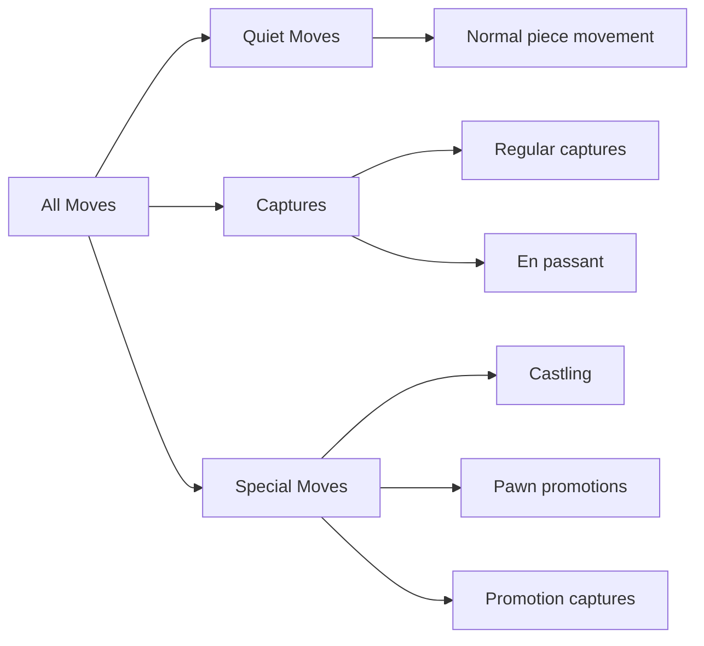

Each move type has unique generation rules:

| Move Type                    | Complexity | Notes                                                                          |
| ---------------------------- | ---------- | ------------------------------------------------------------------------------ |
| **Knight**                   | Simple     | 8 possible destinations, filter off-board and friendly pieces                  |
| **King**                     | Simple     | 8 possible destinations + castling rights check                                |
| **Pawn**                     | Moderate   | Direction depends on color, double push from start rank, en passant, promotion |
| **Sliding pieces** (B, R, Q) | Complex    | Ray-cast in each direction until hitting a piece or board edge                 |
| **Castling**                 | Complex    | Rights, empty squares, no passing through check                                |

### Pseudo-Legal vs Legal Moves

Most engines generate **pseudo-legal** moves first (moves that follow piece movement rules but may leave the king in check) and then filter out illegal ones:

```cpp
std::vector<Move> generateLegalMoves(const Board& board) {
    std::vector<Move> pseudoLegal = generatePseudoLegalMoves(board);
    std::vector<Move> legal;

    for (const Move& move : pseudoLegal) {
        board.makeMove(move);
        if (!board.isInCheck(board.sideToMove() ^ 1)) {
            // The side that just moved is NOT leaving its king in check
            legal.push_back(move);
        }
        board.undoMove(move);
    }
    return legal;
}
```

::: info "Why This Matters for You"
Move generation is provided by the library. But understanding it helps you with:

1. **Move ordering**, you'll want to try captures before quiet moves in your search
2. **Debugging**, when your engine makes an illegal move, you need to diagnose whether it's a generation bug or an evaluation/search bug
3. **Quiescence search**, you may generate only captures at leaf nodes to avoid the horizon effect
   :::

---

## Evaluation Function Design

The evaluation function is the heart of your chess engine. It takes a board position and returns a **single number** estimating which side is winning and by how much. A positive score favors white; a negative score favors black.

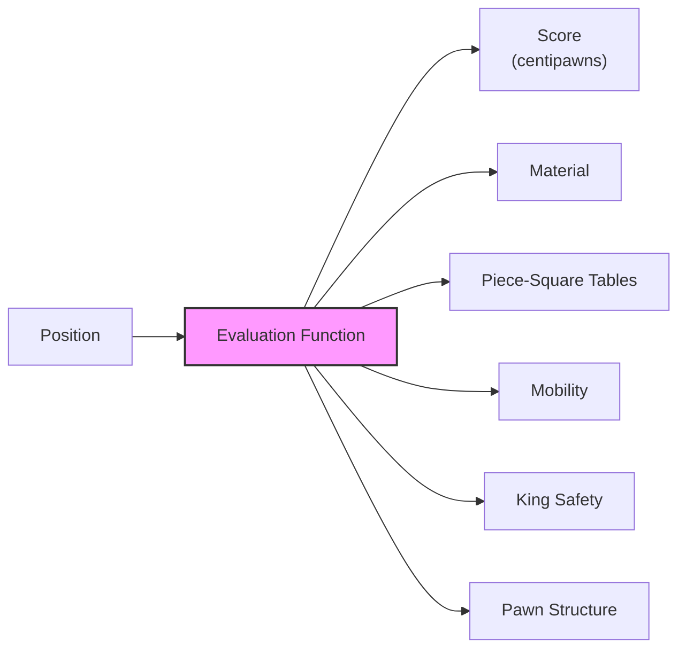

::: warning "The Evaluation Function Determines Your Engine's Strength"
Two engines with identical search algorithms but different evaluation functions will play at vastly different levels. Material-only evaluation produces an engine around 1200-1400 Elo. Adding piece-square tables lifts it to ~1600-1800. Each additional evaluation term (mobility, king safety, pawn structure) adds more strength. The best hand-crafted evaluations contained hundreds of terms tuned over years.
:::

### Material Balance

The foundation of every evaluation function. Count pieces and assign standard values:

| Piece  | Symbol | Value (centipawns) | Justification                                  |
| ------ | ------ | ------------------ | ---------------------------------------------- |
| Pawn   | ♟      | 100                | The basic unit of measurement                  |
| Knight | ♞      | 320                | Slightly less than a bishop in open positions  |
| Bishop | ♝      | 330                | Long-range diagonal control, bishop pair bonus |
| Rook   | ♜      | 500                | Controls files and ranks, powerful in endgames |
| Queen  | ♛      | 900                | Combines rook + bishop mobility                |
| King   | ♚      | -                  | Infinite (game ends if lost)                   |

::: note "King's Value"

You may assign the king an arbitrary high value (e.g., 99999) to ensure that losing the king is always worse than any material gain and allow stable deepeing in search. This may seem odd since the king is never "captured" in a real game, but it simplifies the evaluation logic.

:::

```cpp
int evaluateMaterial(const Board& board) {
    const int PIECE_VALUES[] = {100, 320, 330, 500, 900, 99999}; // P, N, B, R, Q, K

    int score = 0;
    for (int piece = PAWN; piece <= KING; piece++) {
        score += PIECE_VALUES[piece] * board.pieceCount(WHITE, piece);
        score -= PIECE_VALUES[piece] * board.pieceCount(BLACK, piece);
    }
    return score;
}
```

Material balance alone answers: _"Who has more stuff?"_, but it says nothing about where the pieces are or how active they are.

### Piece-Square Tables (PST)

Piece-square tables add **positional knowledge** by assigning a bonus or penalty for each piece on each square. They encode patterns like:

- **Knights** are strong in the center, weak on the edges
- **Pawns** should advance but not create weaknesses
- **Kings** should hide behind pawns in the middlegame but centralize in the endgame

Here's a simplified knight PST (from white's perspective, square a1 = bottom-left):

```cpp
// Knight piece-square table (middlegame)
// Viewed from white's perspective, rank 1 at bottom
const int KNIGHT_PST[64] = {
    -50,-40,-30,-30,-30,-30,-40,-50,  // rank 1 (back rank)
    -40,-20,  0,  0,  0,  0,-20,-40,
    -30,  0, 10, 15, 15, 10,  0,-30,
    -30,  5, 15, 20, 20, 15,  5,-30,
    -30,  0, 15, 20, 20, 15,  0,-30,
    -30,  5, 10, 15, 15, 10,  5,-30,
    -40,-20,  0,  5,  5,  0,-20,-40,
    -50,-40,-30,-30,-30,-30,-40,-50   // rank 8
};
```

Reading this table: a knight on d4/d5/e4/e5 (the center four squares) gets a +20 bonus, while a knight stuck on a1/h1/a8/h8 (the rim) gets a -50 penalty. This encodes the chess maxim _"A knight on the rim is dim."_

```cpp
int evaluatePST(const Board& board) {
    int score = 0;

    for (int sq = 0; sq < 64; sq++) {
        Piece piece = board.pieceAt(sq);
        if (piece == EMPTY) continue;

        if (isWhite(piece)) {
            score += PST[pieceType(piece)][sq];
        } else {
            // Mirror the table vertically for black
            score -= PST[pieceType(piece)][mirror(sq)];
        }
    }
    return score;
}

// Mirror square vertically: a1↔a8, b2↔b7, etc.
int mirror(int sq) {
    return sq ^ 56; // flip rank bits
}
```

::: tip "Tapered Evaluation"
Kings want opposite things in different game phases: hide in the middlegame, centralize in the endgame. Use separate PSTs for middlegame and endgame, then interpolate based on remaining material:

$$\text{eval} = \frac{\text{phase} \times \text{mg} + (256 - \text{phase}) \times \text{eg}}{256}$$

where `phase` starts at 256 (all pieces on board) and decreases as pieces are captured.
:::

### Mobility

Mobility measures how many squares a piece can reach. More mobile pieces are generally better placed, they control more of the board and can respond to threats more flexibly.

```cpp
int evaluateMobility(const Board& board) {
    int score = 0;

    // Count legal moves for each side's knights, bishops, rooks, queens
    for (int piece = KNIGHT; piece <= QUEEN; piece++) {
        score += countMoves(board, WHITE, piece) * MOBILITY_WEIGHT[piece];
        score -= countMoves(board, BLACK, piece) * MOBILITY_WEIGHT[piece];
    }
    return score;
}
```

| Piece  | Mobility Weight | Reasoning                                            |
| ------ | --------------- | ---------------------------------------------------- |
| Knight | 4 cp/square     | Short-range, each accessible square matters          |
| Bishop | 3 cp/square     | Long-range, often has many squares available         |
| Rook   | 2 cp/square     | Valuable but usually has plenty of mobility          |
| Queen  | 1 cp/square     | Almost always has high mobility, less discriminating |

::: note "Mobility Subtlety"
Don't count all pseudo-legal moves, exclude squares defended by enemy pawns (since moving there usually loses material). This is called **safe mobility** and gives a more accurate picture of a piece's real activity.
:::

### King Safety

King safety is arguably the most important non-material evaluation term. Games are often decided by attacks on the king, a material advantage means nothing if you get checkmated.

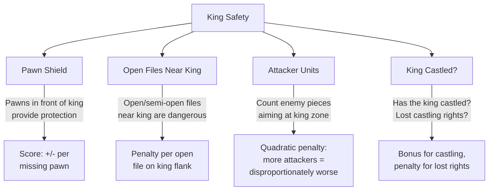

#### Pawn Shield

The pawns directly in front of the king form a protective shield. Missing or advanced pawns weaken it:

```cpp
int evaluatePawnShield(const Board& board, Color side) {
    int kingSq = board.kingSquare(side);
    int kingFile = fileOf(kingSq);
    int score = 0;

    // Check the three files around the king
    for (int f = std::max(0, kingFile - 1); f <= std::min(7, kingFile + 1); f++) {
        int shieldRank = (side == WHITE) ? rankOf(kingSq) + 1 : rankOf(kingSq) - 1;
        int sq = squareOf(shieldRank, f);

        if (board.pieceAt(sq) == makePiece(side, PAWN)) {
            score += 10; // pawn is on ideal shield square
        } else {
            score -= 15; // missing shield pawn
        }
    }
    return score;
}
```

#### Attack Units

A powerful heuristic: count how many enemy pieces participate in the king attack, and apply a **non-linear** penalty. One attacker is manageable; two are dangerous; three or more are often fatal.

```cpp
// Quadratic attack penalty table (indexed by number of attackers)
const int ATTACK_WEIGHT[] = {0, 0, 50, 75, 88, 94, 97, 99, 99};

int evaluateKingAttack(const Board& board, Color side) {
    int kingZone = getKingZone(board.kingSquare(side));
    int attackerCount = 0;
    int attackUnits = 0;

    // For each enemy piece type, check if it attacks the king zone
    if (isAttacking(board, ~side, KNIGHT, kingZone)) { attackerCount++; attackUnits += 2; }
    if (isAttacking(board, ~side, BISHOP, kingZone)) { attackerCount++; attackUnits += 2; }
    if (isAttacking(board, ~side, ROOK,   kingZone)) { attackerCount++; attackUnits += 3; }
    if (isAttacking(board, ~side, QUEEN,  kingZone)) { attackerCount++; attackUnits += 5; }

    return -ATTACK_WEIGHT[attackerCount] * attackUnits;
}
```

### Putting the Evaluation Together

```cpp
int evaluate(const Board& board) {
    // Check for terminal states first
    if (board.isCheckmate()) return board.sideToMove() == WHITE ? -MATE : +MATE;
    if (board.isDraw()) return 0;

    int score = 0;
    score += evaluateMaterial(board);    // Who has more pieces?
    score += evaluatePST(board);         // Are the pieces well placed?
    score += evaluateMobility(board);    // How active are the pieces?
    score += evaluateKingSafety(board);  // How safe are the kings?
    score += evaluatePawnStructure(board); // Doubled, isolated, passed pawns?

    // Return score from the perspective of the side to move
    return board.sideToMove() == WHITE ? score : -score;
}
```

::: danger "The Horizon Effect"
A pure material evaluation can be fooled when a capture sequence is in progress. If your search reaches depth limit after `QxR` but before `PxQ`, the engine thinks it's won a rook, but really it's about to lose a queen. This is the **horizon effect**, and it's solved by **quiescence search**: extending the search at leaf nodes until the position becomes "quiet" (no pending captures). See the Quiescence Search section below.
:::

### Evaluation Quality vs Engine Strength

| Evaluation Level           | Typical Elo | Terms Included         |
| -------------------------- | ----------- | ---------------------- |
| Random evaluation          | ~400        | None (random score)    |
| Material only              | ~1200-1400  | Piece values           |
| Material + PST             | ~1600-1800  | + Piece positions      |
| + Mobility + King Safety   | ~2000-2200  | + Activity, safety     |
| + Pawn Structure + Endgame | ~2200-2400  | + Structural features  |
| NNUE (neural network)      | ~3500+      | Learned from self-play |

---

## MCTS for Chess: An Alternative Search Strategy

Last week you learned Monte Carlo Tree Search (MCTS), a fundamentally different approach from minimax. Where alpha-beta exhaustively searches the tree to a fixed depth and relies on an evaluation function, MCTS builds an **asymmetric** tree guided by random simulations and statistics. Both are valid choices for your chess engine.

### Why Consider MCTS for Chess?

Alpha-beta with iterative deepening is the traditional choice for chess, and for good reason, the branching factor (~35) is manageable, and strong evaluation functions exist. But MCTS has properties that directly address some of alpha-beta's pain points:

| Challenge                           | Alpha-Beta Approach               | MCTS Approach                         |
| ----------------------------------- | --------------------------------- | ------------------------------------- |
| Time constraint (the #1 killer)     | Iterative deepening + clock check | Naturally anytime, stop any time      |
| Writing a good eval function        | Must hand-craft (hard!)           | Rollouts provide evaluation for free  |
| Uneven positions (one obvious move) | Searches all moves to same depth  | Focuses effort on uncertain moves     |
| Horizon effect                      | Needs quiescence search           | Rollouts see beyond any fixed horizon |

::: tip "MCTS and Time Management"
MCTS is inherently an **anytime algorithm** at the finest granularity, each iteration (select → expand → simulate → backpropagate) is a complete unit of work. You can stop after 100 iterations or 100,000 and always have a valid best move. With alpha-beta, if a depth-$d$ search doesn't complete, you discard it entirely and fall back to depth $d-1$. MCTS wastes nothing.
:::

### Adapting MCTS to Chess

The vanilla MCTS from Week 05 used uniform random rollouts and UCB1 selection. For chess, you'll want to add **domain knowledge** to both the selection and simulation phases:

#### Prioritized UCB1 for Better Exploration

Standard UCB1 explores all children equally until statistics differentiate them. In chess, some moves are obviously better candidates, captures, checks, central moves. Adding a **prior** bias to UCB1 helps the exploration stay consistent and converge faster:

$$\text{UCB1}_{\text{prior}}(i) = \frac{w_i}{n_i} + C \sqrt{\frac{\ln N}{n_i}} + \frac{P_i}{n_i + 1}$$

Where $P_i$ is a **prior score** for move $i$ based on chess heuristics. This additional term is largest when $n_i$ is small (the move hasn't been explored much), guiding early exploration toward sensible moves. As $n_i$ grows, the prior fades and statistics take over.

```cpp
double ucbWithPrior(MCTSNode* child, int parentVisits, double C) {
    if (child->visits == 0) return INFINITY;

    double exploitation = child->wins / child->visits;
    double exploration  = C * std::sqrt(std::log(parentVisits) / child->visits);
    double prior        = child->priorScore / (child->visits + 1);

    return exploitation + exploration + prior;
}

// Assign prior scores based on chess knowledge
double movePrior(const chess::Board& board, const chess::Move& move) {
    double score = 0.0;

    // Captures are usually worth exploring first
    if (board.isCapture(move)) {
        score += 5.0;
        // MVV-LVA: capturing high-value pieces with low-value pieces
        score += victimValue(move) - attackerValue(move) * 0.1;
    }

    // Checks force the opponent to respond, high priority
    board.makeMove(move);
    if (board.inCheck()) score += 3.0;
    board.unmakeMove(move);

    // Central moves (knights/bishops to center)
    if (isCenterSquare(move.to())) score += 1.0;

    // Promotions are almost always critical
    if (move.typeOf() == chess::Move::PROMOTION) score += 8.0;

    return score;
}
```

This is conceptually similar to the **PUCT** formula (from AlphaGo/AlphaZero), but using hand-crafted chess heuristics instead of a neural network for the prior $P_i$.

#### Smarter Rollouts

Pure random rollouts are weak in chess, random moves blunder pieces constantly, producing noisy signals. Improve rollout quality with lightweight heuristics:

```cpp
chess::Move selectRolloutMove(const chess::Board& board, const chess::Movelist& moves) {
    // 70% of the time: pick a capture if available (preferring MVV-LVA order)
    if (rand() % 100 < 70) {
        chess::Move bestCapture = chess::Move::NO_MOVE;
        int bestValue = -1;
        for (const auto& m : moves) {
            if (board.isCapture(m)) {
                int val = victimValue(m);
                if (val > bestValue) { bestValue = val; bestCapture = m; }
            }
        }
        if (bestCapture != chess::Move::NO_MOVE) return bestCapture;
    }

    // Otherwise: uniform random from all legal moves
    return moves[rand() % moves.size()];
}
```

You can also **limit rollout depth** (e.g., 20–40 ply) and use a simple material evaluation at the cutoff instead of playing to checkmate. This reduces noise and speeds up each iteration.

#### Hybrid Approach: MCTS + Evaluation

Instead of relying solely on rollout results, you can use your evaluation function to **replace rollouts entirely**, similar to how AlphaZero uses a value network:

```cpp
double simulateWithEval(MCTSNode* node) {
    // Instead of playing random moves to the end,
    // just evaluate the position directly
    return sigmoid(evaluate(node->board));  // normalize to [0, 1]
}

double sigmoid(int centipawns) {
    return 1.0 / (1.0 + std::exp(-centipawns / 400.0));
}
```

This hybrid is often the best approach for a student engine: you get MCTS's anytime property and asymmetric tree growth, combined with the positional knowledge encoded in your evaluation function.

### MCTS vs Alpha-Beta: Which Should You Use?

For your assignment, **either approach is valid**. Here's the practical trade-off:

| Factor                 | Alpha-Beta + Iterative Deepening | MCTS + Eval Rollouts         |
| ---------------------- | -------------------------------- | ---------------------------- |
| Implementation effort  | Moderate                         | Moderate                     |
| Time management        | Must check clock carefully       | Naturally anytime            |
| Eval function required | Yes (hard requirement)           | Optional (helps a lot)       |
| Search depth reached   | Deep on narrow lines             | Shallow but wide             |
| Tactical accuracy      | Strong (exhaustive to depth)     | Weaker (can miss tactics)    |
| Tournament strength    | Higher ceiling typically         | Competitive with good priors |

::: note "The Best of Both Worlds"
Modern chess engines have experimented with hybrid approaches. Leela Chess Zero (Lc0) uses MCTS with a neural network and competes with Stockfish's alpha-beta search at the highest level. For your assignment, you could even implement both and run whichever fits the time budget, alpha-beta for fast positions, MCTS when you want safer time management.
:::

---

## Iterative Deepening

You already know alpha-beta pruning from Week 04. Now we wrap it in **iterative deepening**: search to depth 1, then depth 2, then depth 3, and so on until time runs out. The last completed search provides the best move.

### Why Not Just Search as Deep as Possible?

Suppose you search straight to depth 10. Two problems:

1. **You don't know how long it will take.** If it takes 30 seconds and you only had 5 seconds on the clock, you've lost on time.
2. **You get nothing until it finishes.** If you're interrupted at 90% completion, you have no result at all.

Iterative deepening solves both problems:

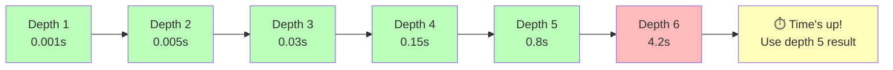

### The Anytime Property

Iterative deepening makes your search an **anytime algorithm**: it always has a best move ready, and quality improves with more time. You can stop at any point and have a valid answer.

### Isn't It Wasteful?

It seems like re-searching depths 1, 2, 3, ... wastes time. But consider the branching factor $b$. The total work to search depth $d$ is:

$$\text{Depth } d: b^d \text{ nodes}$$

The total work across all depths is:

$$\sum_{i=1}^{d} b^i = b + b^2 + b^3 + \cdots + b^d \approx \frac{b}{b-1} \cdot b^d$$

For chess ($b \approx 35$):

$$\frac{35}{34} \cdot 35^d \approx 1.03 \cdot 35^d$$

The overhead is only about **3%**! The deepest iteration dominates the total cost. The previous iterations together cost less than one additional ply.

::: tip "Iterative Deepening Is Not Just for Time Control"
The real power of iterative deepening is **move ordering**. The best move from depth $d-1$ is searched first at depth $d$. With perfect move ordering, alpha-beta prunes the tree from $O(b^d)$ to $O(b^{d/2})$, effectively doubling search depth. Iterative deepening provides near-perfect move ordering for free.
:::

### Implementation

```cpp
#include "chess.hpp"
#include <chrono>

const int MAX_DEPTH = 64;
const int INF = 999999;
const int MATE = 100000;

std::string ChessSimulator::Move(std::string fen, int timeLimitMs) {
    chess::Board board;
    board.setFen(fen);

    // Use 85% of the provided budget, leaving margin for OS jitter
    int budgetMs = timeLimitMs * 85 / 100;
    auto startTime = std::chrono::steady_clock::now();
    chess::Move bestMove = chess::Move::NO_MOVE;

    for (int depth = 1; depth <= MAX_DEPTH; depth++) {
        chess::Move currentBest;
        int score = alphaBeta(board, depth, -INF, +INF, startTime, currentBest);

        // Check if we ran out of time during the search
        if (isTimeUp(startTime, budgetMs)) {
            break; // use the result from the previous completed depth
        }

        // This depth completed successfully, update the result
        bestMove = currentBest;

        // If we found a forced checkmate, no need to search deeper
        if (std::abs(score) >= MATE - MAX_DEPTH) break;
    }

    return bestMove.uci(); // return UCI string like "e2e4"
}

bool isTimeUp(std::chrono::steady_clock::time_point start, int limitMs) {
    auto elapsed = std::chrono::duration_cast<std::chrono::milliseconds>(
        std::chrono::steady_clock::now() - start
    ).count();
    return elapsed >= limitMs;
}
```

### The Principal Variation (PV)

The **principal variation** is the sequence of best moves found so far, the line the engine expects both sides to play. For example, at depth 8 your engine might determine that the best line is 1.e4 e5 2.Nf3 Nc6 3.Bb5 a6 4.Ba4 Nf6 (the Ruy Lopez), with an evaluation of +0.35 pawns for white.

The PV from depth $d-1$ provides the initial move ordering for depth $d$, which is why iterative deepening dramatically improves alpha-beta efficiency.

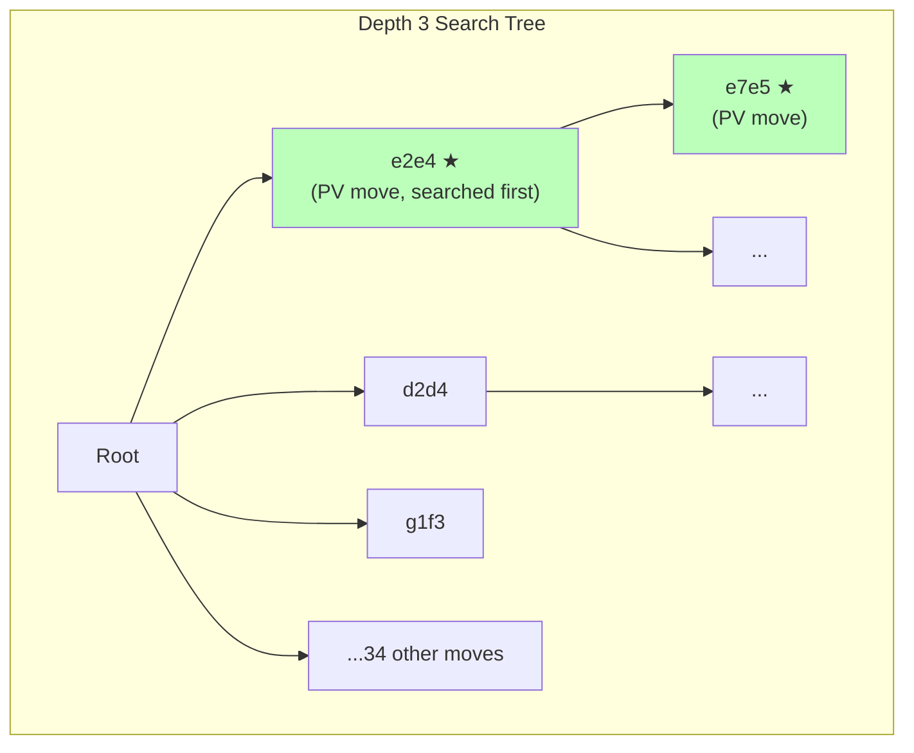

Searching the PV move first creates early cutoffs that prune large portions of the tree.

---

## Aspiration Windows

Standard alpha-beta starts each depth with a **wide-open window** $(-\infty, +\infty)$. This means the algorithm can't prune until it discovers bounds during the search itself. But with iterative deepening, you have a valuable piece of information: the **score from the previous depth**. Aspiration windows exploit this by starting with a narrow window centered on the previous score.

### The Idea

If depth $d-1$ returned a score of +35 centipawns, it's very likely that depth $d$ will return something close, say between +10 and +60. By searching with the window $(+10, +60)$ instead of $(-\infty, +\infty)$, alpha-beta prunes far more aggressively because the tight bounds cause earlier cutoffs.

```cpp
int aspirationSearch(chess::Board& board, int depth, int prevScore,
                     chess::Move& bestMove) {
    int delta = 50; // initial window half-width in centipawns
    int alpha = prevScore - delta;
    int beta  = prevScore + delta;

    while (true) {
        int score = alphaBeta(board, depth, alpha, beta, bestMove);

        if (timeUp) return 0; // interrupted, discard

        if (score <= alpha) {
            // Fail low, the position is worse than expected
            // Widen the lower bound and re-search
            alpha = std::max(alpha - delta, -INF);
            delta *= 2; // exponential widening
        } else if (score >= beta) {
            // Fail high, the position is better than expected
            // Widen the upper bound and re-search
            beta = std::min(beta + delta, +INF);
            delta *= 2;
        } else {
            // Score is within the window, we're done
            return score;
        }
    }
}
```

### Why It Works

Alpha-beta with a window $(\alpha, \beta)$ only needs to determine whether the true score is:

- **Below $\alpha$** (fail low, this move is worse than our best alternative)
- **Above $\beta$** (fail high, opponent won't allow this line)
- **Between $\alpha$ and $\beta$** (exact score)

A tighter window means more positions fall outside it, triggering cutoffs earlier. The trade-off: if the true score falls **outside** the window (a "fail"), you must re-search with a wider window, wasting some time.

### Handling Failures

The key design decisions are the **initial window size** and the **widening strategy**:

| Parameter                   | Conservative | Aggressive | Rationale                                    |
| --------------------------- | ------------ | ---------- | -------------------------------------------- |
| Initial window (delta)      | 75 cp        | 25 cp      | Wider = fewer fails; narrower = more pruning |
| Widening factor             | ×2           | ×4         | Fast widening recovers quickly from failures |
| Max re-searches before full | 3            | 2          | Fall back to $(-\infty, +\infty)$ if stuck   |

In practice, aspiration windows fail on roughly 10–15% of searches (mostly after tactical swings), but the pruning gain on the other 85–90% more than compensates.

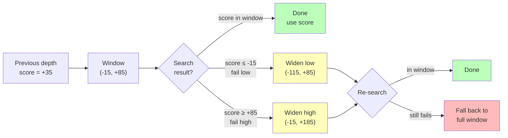

::: tip "Integrating with Iterative Deepening"
Aspiration windows only make sense **starting from depth 2** (depth 1 has no previous score to center on). A clean integration:

```cpp
int prevScore = 0;
for (int depth = 1; depth <= MAX_DEPTH; depth++) {
    chess::Move currentBest;
    int score;

    if (depth <= 2) {
        score = alphaBeta(board, depth, -INF, +INF, currentBest);
    } else {
        score = aspirationSearch(board, depth, prevScore, currentBest);
    }

    if (timeUp) break;
    prevScore = score;
    bestMove = currentBest;
    if (std::abs(score) >= MATE - MAX_DEPTH) break;
}
```

:::

---

## Quiescence Search

Quiescence search solves the **horizon effect**, the most damaging flaw in fixed-depth search. Without it, your engine will regularly blunder pieces because it stops evaluating in the middle of a tactical sequence.

### The Problem

Consider this scenario at your search depth limit:

```
Depth 6: White plays QxR (captures rook worth 500 cp)
Depth limit reached → evaluate position
Evaluation: "White is up a rook! Score = +500"

But at depth 7 (which we never searched):
Depth 7: Black plays PxQ (recaptures queen worth 900 cp)
Reality: White lost the exchange, score should be -400
```

The engine sees the first half of a capture exchange but not the recapture. It thinks it's winning when it's actually losing. This happens constantly in chess, almost every position has some ongoing tactical sequence.

### The Solution

At leaf nodes (where normal search reaches depth 0), instead of returning the static evaluation immediately, continue searching **only capture moves** until the position becomes "quiet", no more captures are available:

```cpp
int quiescence(chess::Board& board, int alpha, int beta) {
    // Stand-pat: the static evaluation is a lower bound
    // (we can always choose not to capture)
    int standPat = evaluate(board);

    if (standPat >= beta) return beta;  // position is already too good
    if (standPat > alpha) alpha = standPat;  // raise lower bound

    // Generate only captures (not all moves)
    chess::Movelist captures;
    chess::movegen::legalmoves<chess::movegen::MoveGenType::CAPTURE>(captures, board);

    // Order captures by MVV-LVA for better pruning
    orderCaptures(captures, board);

    for (const auto& move : captures) {
        board.makeMove(move);
        int score = -quiescence(board, -beta, -alpha);
        board.unmakeMove(move);

        if (score >= beta) return beta;   // beta cutoff
        if (score > alpha) alpha = score; // found a better capture
    }

    return alpha;
}
```

### Stand-Pat Score

The **stand-pat** score is the key insight: at any point during a capture chain, the side to move can choose **not to capture**, they can simply stand pat and accept the current evaluation. This provides a lower bound on the position's value.

Without stand-pat, quiescence search would assume you _must_ capture, which is wrong, sometimes the best move is to stop trading pieces.

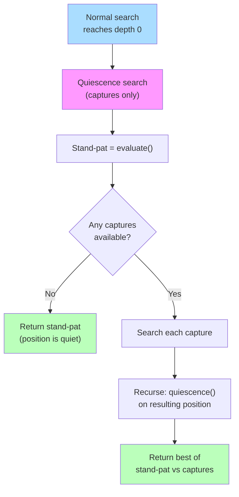

### MVV-LVA: Ordering Captures

**Most Valuable Victim – Least Valuable Attacker (MVV-LVA)** orders captures to maximize pruning. Try capturing the most valuable enemy piece with the least valuable friendly piece first:

```cpp
// MVV-LVA score: prioritize PxQ over QxP
int mvvLva(const chess::Board& board, const chess::Move& move) {
    // Victim value (what we're capturing), want this HIGH
    int victim = pieceValue(board.at(move.to()));
    // Attacker value (what we're capturing with), want this LOW
    int attacker = pieceValue(board.at(move.from()));
    return victim * 10 - attacker;
    // PxQ = 900*10 - 100 = 8900 (searched first)
    // QxP = 100*10 - 900 =  100 (searched last)
}

void orderCaptures(chess::Movelist& captures, const chess::Board& board) {
    std::sort(captures.begin(), captures.end(),
        [&](const chess::Move& a, const chess::Move& b) {
            return mvvLva(board, a) > mvvLva(board, b);
        });
}
```

With MVV-LVA ordering, alpha-beta within quiescence prunes losing captures early, if `PxQ` already gives a great score, `QxP` (a losing trade) is cut off by beta.

### Integrating Quiescence into Alpha-Beta

The only change to your main search: replace the depth-0 evaluation call with a quiescence call:

```cpp
int alphaBeta(chess::Board& board, int depth, int alpha, int beta) {
    if (depth == 0) {
        return quiescence(board, alpha, beta); // ← was: return evaluate(board);
    }

    chess::Movelist moves;
    chess::movegen::legalmoves(moves, board);

    if (moves.size() == 0) {
        if (board.inCheck()) return -MATE + ply; // checkmate
        return 0; // stalemate
    }

    for (const auto& move : moves) {
        board.makeMove(move);
        int score = -alphaBeta(board, depth - 1, -beta, -alpha);
        board.unmakeMove(move);

        if (score >= beta) return beta;
        if (score > alpha) alpha = score;
    }
    return alpha;
}
```

### Impact on Engine Strength

Quiescence search is **not optional** for a competitive chess engine. The difference is dramatic:

| Feature                  | Without Quiescence      | With Quiescence          |
| ------------------------ | ----------------------- | ------------------------ |
| Tactical blunders        | Frequent (hangs pieces) | Rare                     |
| Evaluation accuracy      | Unreliable at leaf      | Reliable (quiet pos.)    |
| Effective search depth   | Nominal depth only      | Deeper in tactical lines |
| Approximate Elo impact   | -                       | +200 to +400 Elo         |
| Nodes searched per depth | Fewer                   | More (capture chains)    |

::: warning "Quiescence Search Can Explode"
In highly tactical positions (many captures available), quiescence search can explore thousands of nodes at each leaf. To keep it under control:

1. **Delta pruning:** Skip captures where the captured piece + a safety margin can't raise alpha (e.g., capturing a pawn when you're down a queen won't help)
2. **SEE (Static Exchange Evaluation):** Estimate the outcome of a capture sequence without searching, prune losing exchanges
3. **Depth limit:** Cap quiescence at 6–10 ply beyond the normal search depth
   :::

---

## Time Management

In our tournament, the GUI enforces a **per-move time limit**. If your `Move()` function doesn't return in time, your process is terminated and you forfeit. Time management is about using as much of that budget as possible for deeper search, without going over.

::: danger "The #1 Way to Lose"
More chess engines lose tournaments by timing out than by playing bad moves. A simple engine that always returns in time will beat a sophisticated one that occasionally gets killed. **Conservative time management is non-negotiable.**
:::

### The Strategy: Iterative Deepening + Deadline

Since your `Move()` function has a fixed time budget per call, the strategy is simple:

1. Record the start time when `Move()` is called
2. Set a deadline (e.g., 900ms if the limit is 1000ms, leave margin)
3. Run iterative deepening, checking the deadline between depths
4. When time is nearly up, return the best move from the last completed depth

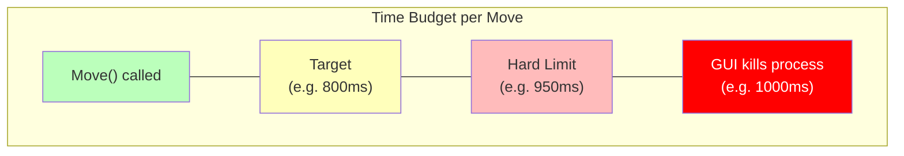

### Checking Time During Search

Don't check the clock after every node, that's too slow. `std::chrono` calls have overhead. Check periodically, usually every 1024–4096 nodes:

```cpp
static int nodeCount = 0;
static bool timeUp = false;
static std::chrono::steady_clock::time_point searchStart;
static int timeLimitMs;

void checkTime() {
    auto elapsed = std::chrono::duration_cast<std::chrono::milliseconds>(
        std::chrono::steady_clock::now() - searchStart
    ).count();
    if (elapsed >= timeLimitMs) {
        timeUp = true;
    }
}

int alphaBeta(chess::Board& board, int depth, int alpha, int beta) {
    nodeCount++;

    // Check time every 2048 nodes
    if ((nodeCount & 2047) == 0) {
        checkTime();
        if (timeUp) return 0; // score will be discarded
    }

    if (depth == 0) return evaluate(board);

    // ... normal alpha-beta logic
}
```

### Complete Move Function with Time Management

```cpp
std::string ChessSimulator::Move(std::string fen, int timeLimitMs) {
    chess::Board board;
    board.setFen(fen);

    // Reset globals
    searchStart = std::chrono::steady_clock::now();
    searchBudgetMs = timeLimitMs * 85 / 100; // use 85% of budget, leave margin
    nodeCount = 0;
    timeUp = false;

    chess::Move bestMove = chess::Move::NO_MOVE;

    // Fallback: pick any legal move (never forfeit by returning nothing)
    chess::Movelist moves;
    chess::movegen::legalmoves(moves, board);
    if (moves.size() > 0) bestMove = moves[0];

    // Iterative deepening
    for (int depth = 1; depth <= 64; depth++) {
        chess::Move currentBest;
        int score = alphaBeta(board, depth, -INF, +INF);

        if (timeUp) break; // discard incomplete depth

        bestMove = currentBest; // update from completed depth

        if (std::abs(score) >= MATE_SCORE) break; // forced mate found
    }

    return bestMove.uci();
}
```

::: tip "Safety First"
Always have a fallback move ready **before** starting the search. If even depth 1 times out (unlikely but possible in extreme cases), you still return a legal move instead of crashing or returning garbage.
:::

### Why Margin Matters

If the GUI gives you 1000ms per move, don't use all 1000ms:

| Budget          | Risk                                         | Recommendation |
| --------------- | -------------------------------------------- | -------------- |
| 100% of limit   | 🔴 Process killed mid-search                 | Never do this  |
| 95% of limit    | 🟡 Risky on slow machines                    | Too aggressive |
| 85–90% of limit | 🟢 Safe with margin for OS scheduling jitter | Good default   |
| 70% of limit    | 🟢 Very safe but leaves depth on the table   | Conservative   |

Operating system scheduling is unpredictable, your process might get paused for a few milliseconds at any time. Always leave margin.

---

## Putting It All Together

Here's how all the components connect inside your `ChessSimulator::Move()` function:

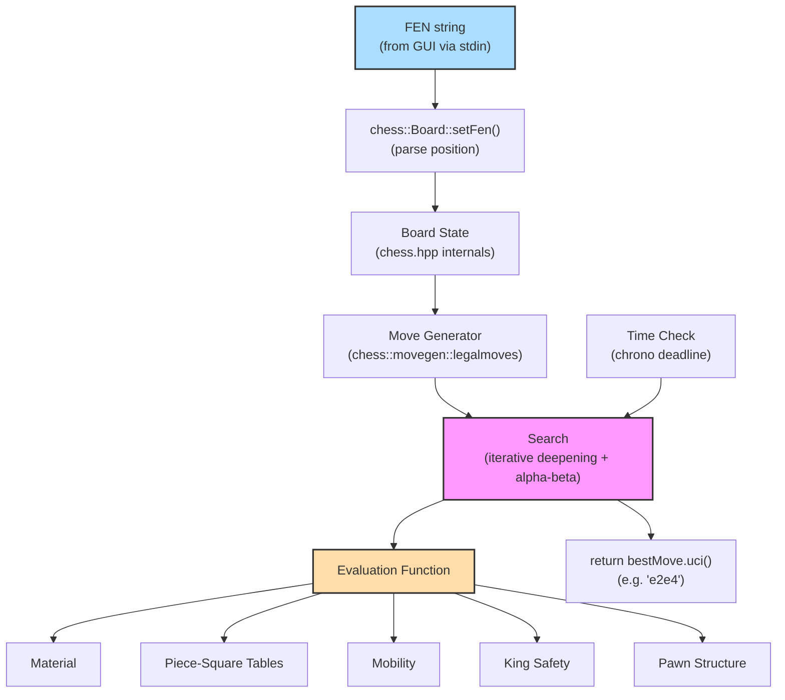

### Minimum Viable Chess Engine

For this week's assignment, you implement `ChessSimulator::Move()`. At minimum you need:

1. ✅ **Parse the FEN**, use `chess::Board::setFen(fen)` to reconstruct the position
2. ✅ **Generate legal moves**, use `chess::movegen::legalmoves()`
3. ✅ **Search**, minimax or alpha-beta with iterative deepening
4. ✅ **Evaluation**, at least material + piece-square tables
5. ✅ **Time management**, return before the GUI's deadline kills your process

::: info "Building Blocks for Week 07"
Next week you'll optimize your engine for the chess tournament. You'll add:

- **Move ordering** (captures first, killer moves, history heuristic)
- **Transposition tables** (avoid re-evaluating the same position)
- **Null-move pruning** (skip searching if position is so good you can pass)
- **Late move reductions** (reduce depth for moves unlikely to be good)

You already have the foundation: evaluation, iterative deepening, aspiration windows, quiescence search, and time management. A correct engine with these features will beat a fancier one that crashes or times out.
:::

---

::: info "What's Provided"
You will receive the [`chess-library`](https://github.com/Disservin/chess-library) by Disservin, a modern, header-only C++ chess library for board representation and legal move generation, plus a `chess-simulator.h` header that defines the interface you must implement. You do **not** need to implement board representation or move generation from scratch, but you must understand them to write a good evaluation function and debug your engine effectively. Feel free to implement it if you want, but it's not required.

⭐ If you find [chess-library](https://github.com/Disservin/chess-library) useful, give it a star on GitHub, it's a great open-source project that makes our assignments possible.
:::

---

## Your Assignment Interface

Your chess engine has a deliberately simple interface. The tournament GUI handles all the complexity of game management, clocks, and display. You implement **one function**:

```cpp
#pragma once
#include <string>

namespace ChessSimulator {
/**
 * @brief Move a piece on the board
 *
 * @param fen The board as FEN
 * @param timeLimitMs Time budget in milliseconds (default 10000)
 * @return std::string The move as UCI
 */
std::string Move(std::string fen, int timeLimitMs = 10000);
} // namespace ChessSimulator
```

The GUI calls `ChessSimulator::Move()` with a FEN string and a time budget in milliseconds. Your function analyzes the position and returns a move in UCI notation (e.g., `"e2e4"`, `"g1f3"`, `"e7e8q"` for promotion). The `timeLimitMs` parameter tells you exactly how long you have — budget accordingly.

The provided `main.cpp` wires everything together:

```cpp
#include "chess-simulator.h"
#include "chess.hpp"
#include <string>

int main() {
    std::string line;
    getline(std::cin, line);
    // parse: "<fen> | <timeLimitMs>"
    auto sep = line.find('|');
    std::string fen = line.substr(0, sep);
    int timeLimitMs = std::stoi(line.substr(sep + 1));
    auto move = ChessSimulator::Move(fen, timeLimitMs);
    std::cout << move << std::endl;
}
```

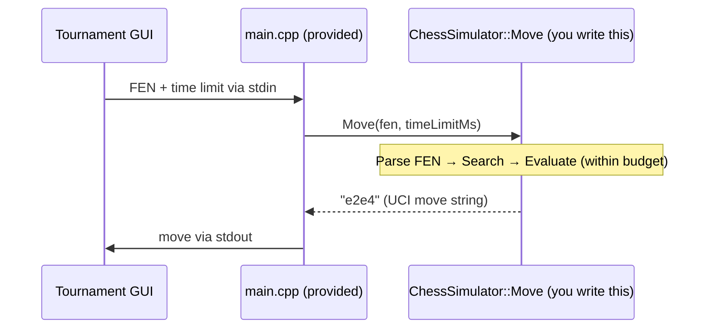

::: warning "Time Constraint"
The tournament GUI enforces a **time limit per move** via the `timeLimitMs` parameter. If your `Move()` function takes longer than `timeLimitMs`, the GUI will terminate your process and you forfeit the game. Use this budget wisely — typically allocate ~85% for search and keep 15% as safety margin. Use iterative deepening and check elapsed time during search.
:::

---

## Historical Context: From Shannon to Stockfish

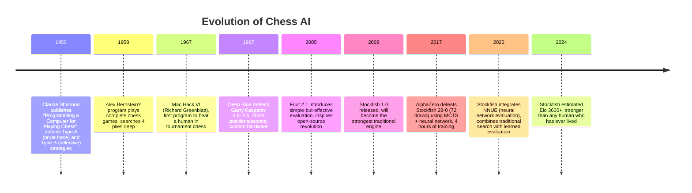

::: note "Two Philosophies, One Game"
The history of chess AI illustrates two fundamentally different approaches:

**Stockfish** (Type A descendant): Search billions of positions per second with a fast evaluation function. Alpha-beta pruning, move ordering, transposition tables, and decades of engineering refinement.

**Leela Chess Zero** (AlphaZero descendant): Search thousands of positions per second, but evaluate each one with a deep neural network. MCTS guides the search toward promising moves.

Both achieve superhuman play. Stockfish searches **wider**, Leela searches **smarter**. In your assignment, you'll build a Type A engine, the same philosophy that powers the world's strongest chess program.
:::

---

## Summary

| Component                                    | Role                  | Key Insight                                                                          |
| -------------------------------------------- | --------------------- | ------------------------------------------------------------------------------------ |
| **`ChessSimulator::Move(fen, timeLimitMs)`** | Your entry point      | Receives FEN + time budget, returns UCI move string, the only function you implement |
| **FEN / UCI notation**                       | Communication format  | FEN encodes full board state; UCI notation encodes moves as `"e2e4"`                 |
| **Board Representation**                     | Data structure        | Handled by `chess.hpp`; understand internals for debugging and evaluation            |
| **Move Generation**                          | Enumerate legal moves | Handled by `chess.hpp`; understand for move ordering and quiescence search           |
| **Evaluation Function**                      | Position assessment   | Material + PST as minimum; mobility and king safety add significant strength         |
| **Iterative Deepening**                      | Search framework      | Only 3% overhead, provides anytime results and move ordering                         |
| **Aspiration Windows**                       | Search optimization   | Narrow the alpha-beta window around previous depth's score for faster pruning        |
| **Quiescence Search**                        | Tactical accuracy     | Extend search at leaf nodes with captures only, eliminates horizon effect            |
| **Time Management**                          | Clock discipline      | Check elapsed time during search; return before the GUI's deadline kills you         |
