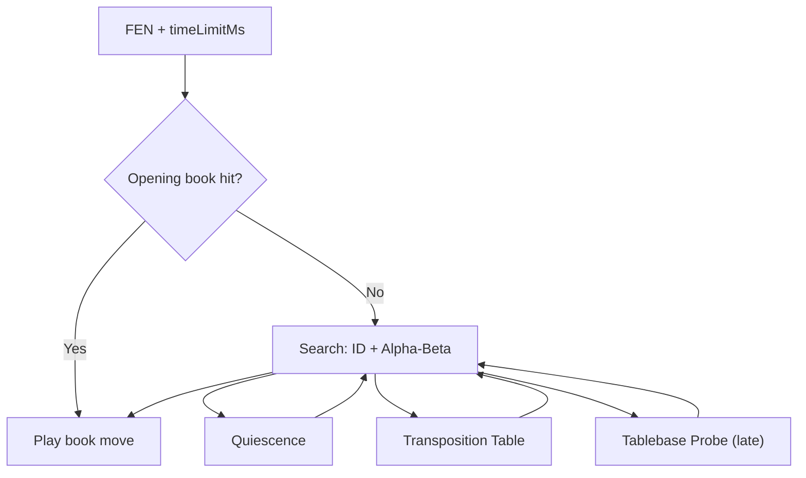
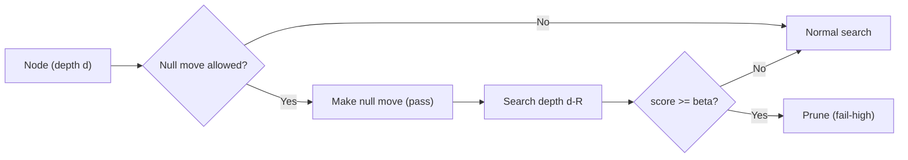
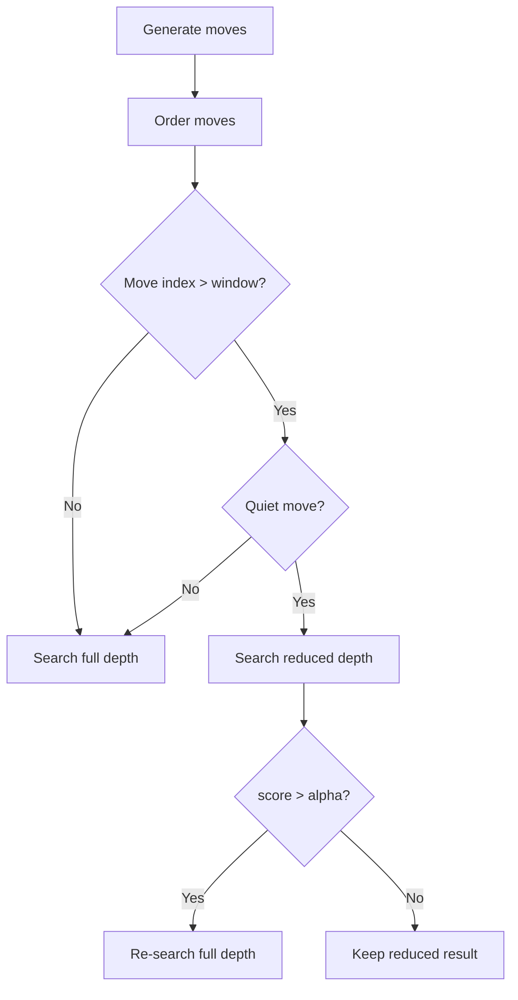
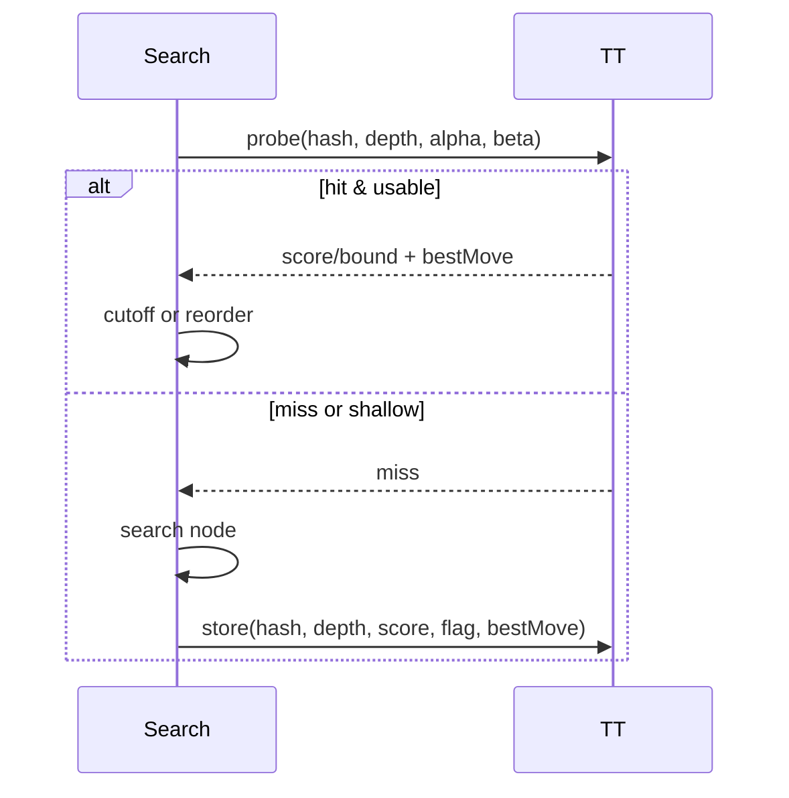
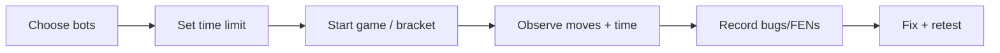

# Week 07 Lecture - Advanced Chess Techniques

## Instructor Notes (Before Class)

- **Have open:** repo rules page, competition site, and a sample bot fork.
- **Demo plan:** run one short match at 5s and one at 1s to show time pressure.
- **Goal:** connect Week 06 search core → Week 07 optimization → competition rules.

## Class Goals

By the end of today, students should be able to:

- Explain how **null-move pruning**, **late move reductions (LMR)**, and **killer/history heuristics** reduce search cost.
- Describe how **Zobrist hashing** enables **transposition tables** and why this changes search from a tree to a graph.
- Identify where **opening books** and **endgame tablebases** fit in the engine pipeline.
- Apply competition rules correctly (time limits, folder constraints, no external libraries).
- Run a practice match in the web competition tool and interpret outcomes.

## Agenda (90 minutes, adjust as needed)

1. **Recap + framing (5 min)**
2. **Search optimizations (30 min)**
3. **Zobrist + transposition tables (15 min)**
4. **Opening book + endgame tablebases (10 min)**
5. **Practice tournament (20 min)**
6. **Debugging clinic (10 min)**

## Recap: What We Already Have (Week 06)

- Iterative deepening
- Aspiration windows
- Quiescence search
- Time management discipline

**Today’s add-ons** are all about _efficiency_ and _practical strength_.



## Search Optimization Stack (Conceptual Map)

1. **Move ordering** (best first) → more alpha-beta cutoffs
2. **Selective pruning/reduction** → fewer nodes
3. **Caching** (TT) → don’t re-search same position
4. **Knowledge shortcuts** (opening book, tablebases)

---

## Move Ordering: The Foundation

Good ordering is the single biggest speedup for alpha-beta.

**Priority order (common):**

1. TT best move
2. PV move from last iteration
3. Winning captures (MVV-LVA)
4. Killer moves
5. High history moves
6. Quiet moves

```cpp
struct MoveScore {
	chess::Move move;
	int score;
};

int scoreMove(const chess::Board& board, const chess::Move& m,
			  const chess::Move& ttMove,
			  const chess::Move& pvMove,
			  const chess::Move killers[2],
			  const int history[64][64]) {
	if (m == ttMove) return 10'000'000;
	if (m == pvMove) return 9'000'000;
	if (board.isCapture(m)) {
		int victim = pieceValue(board.at(m.to()));
		int attacker = pieceValue(board.at(m.from()));
		return 8'000'000 + victim * 10 - attacker; // MVV-LVA
	}
	if (m == killers[0]) return 7'000'000;
	if (m == killers[1]) return 6'000'000;
	return history[m.from().index()][m.to().index()];
}
```

---

## Null-Move Pruning (NMP)

**Idea:** If you can pass and still get a beta cutoff, the position is so good you don’t need to search deeper.

- Try a “null move” (skip turn)
- Search at reduced depth ($R$)
- If score ≥ beta → prune

**Caution:** zugzwang (especially in endgames). Disable or restrict NMP in low-material positions.



```cpp
int alphaBeta(Board& b, int depth, int alpha, int beta) {
	if (depth <= 0) return quiescence(b, alpha, beta);

	if (allowNullMove(b, depth)) {
		b.makeNullMove();
		int score = -alphaBeta(b, depth - 1 - R, -beta, -beta + 1);
		b.unmakeNullMove();
		if (score >= beta) return beta; // fail-high
	}

	// normal search continues
	...
}
```

**Rules of thumb:**

- $R = 2$ at shallow depth, $R = 3$ deeper
- Turn off in pawn endgames or when material is low

---

## Late Move Reductions (LMR)

**Idea:** Moves searched late are statistically less likely to be best.

- Search first moves at full depth
- Reduce depth for later moves
- If a reduced move beats alpha → re-search at full depth



```cpp
for (int i = 0; i < moves.size(); i++) {
	const auto& m = moves[i];
	bool quiet = !board.isCapture(m) && !board.givesCheck(m);
	int reduction = 0;

	if (i >= 4 && quiet && depth >= 3) {
		reduction = 1; // basic LMR
	}

	board.makeMove(m);
	int score = -alphaBeta(board, depth - 1 - reduction, -beta, -alpha);
	board.unmakeMove(m);

	if (reduction > 0 && score > alpha) {
		// re-search full depth
		board.makeMove(m);
		score = -alphaBeta(board, depth - 1, -beta, -alpha);
		board.unmakeMove(m);
	}

	if (score >= beta) return beta;
	if (score > alpha) alpha = score;
}
```

**Safe recipe:**

- Only reduce quiet moves (non-captures, non-checks)
- Start reducing after a small “full-depth window” (e.g., first 3–5 moves)

---

## Killer Heuristic + History Heuristic

**Killer moves:** quiet moves that caused a beta cutoff at the same depth before.

- Store 1–2 killers per depth
- Try them early next time at the same depth

**History heuristic:** global score for moves that cause cutoffs.

- Update history by depth² when a move causes a cutoff
- Sort quiet moves by history score

```cpp
void updateKillerHistory(const chess::Move& m, int depth, int ply,
						 chess::Move killers[][2], int history[64][64]) {
	if (killers[ply][0] != m) {
		killers[ply][1] = killers[ply][0];
		killers[ply][0] = m;
	}
	history[m.from().index()][m.to().index()] += depth * depth;
}
```

**Why it works:** better ordering → more alpha-beta pruning.

---

## Zobrist Hashing + Transposition Tables

**Zobrist hashing:** XOR random 64-bit values for each piece-square + side-to-move + castling + en passant.

- Incremental updates: XOR out, XOR in
- $O(1)$ per move update

```cpp
uint64_t zobrist[12][64];
uint64_t zobristSide;
uint64_t zobristCastle[16];
uint64_t zobristEnpassant[8];

uint64_t hashPosition(const Board& b) {
	uint64_t h = 0;
	for (int sq = 0; sq < 64; sq++) {
		auto piece = b.pieceAt(sq);
		if (piece != EMPTY) {
			h ^= zobrist[pieceIndex(piece)][sq];
		}
	}
	if (b.sideToMove() == BLACK) h ^= zobristSide;
	h ^= zobristCastle[b.castlingRights()];
	if (b.enpassantFile() != NO_FILE) h ^= zobristEnpassant[b.enpassantFile()];
	return h;
}

void updateHashMove(uint64_t& h, const Move& m, const Board& b) {
	// XOR out moving piece from source
	h ^= zobrist[pieceIndex(b.pieceAt(m.from()))][m.from().index()];
	// XOR out captured piece if any
	if (b.isCapture(m)) {
		h ^= zobrist[pieceIndex(b.pieceAt(m.to()))][m.to().index()];
	}
	// XOR in moving piece on destination
	h ^= zobrist[pieceIndex(b.pieceAt(m.from()))][m.to().index()];
	// side to move toggles
	h ^= zobristSide;
}
```

**Transposition table (TT):** cache positions by hash.

- Entry stores depth, score, flag (EXACT/ALPHA/BETA), best move
- Reuse previous results to prune and improve move ordering



```cpp
enum Bound { EXACT, ALPHA, BETA };

struct TTEntry {
	uint64_t key;
	int depth;
	int score;
	Bound bound;
	chess::Move bestMove;
};

bool probeTT(uint64_t key, int depth, int alpha, int beta,
			 int& outScore, chess::Move& outMove) {
	const TTEntry& e = table[key % TT_SIZE];
	if (e.key != key) return false;
	outMove = e.bestMove;
	if (e.depth >= depth) {
		if (e.bound == EXACT) { outScore = e.score; return true; }
		if (e.bound == ALPHA && e.score <= alpha) { outScore = e.score; return true; }
		if (e.bound == BETA  && e.score >= beta)  { outScore = e.score; return true; }
	}
	return false;
}
```

**Key insight:** search becomes a **graph**, not a tree.

---

## Opening Books

**Why:** avoid spending time on well-known theory.

- Book depth vs book width trade-off
- Leave book when unfamiliar or when book move is weak

```cpp
std::unordered_map<std::string, std::vector<std::string>> book = {
	{"startpos", {"e2e4", "d2d4", "c2c4", "g1f3"}},
	{"rnbqkbnr/pppppppp/8/8/4P3/8/PPPP1PPP/RNBQKBNR b KQkq - 0 1", {"c7c5", "e7e5"}}
};

std::optional<std::string> bookMove(const std::string& fen) {
	auto it = book.find(fen);
	if (it == book.end()) return std::nullopt;
	return it->second[rand() % it->second.size()];
}
```

**Implementation note:** A small curated list is enough to help.

---

## Endgame Considerations + Syzygy

- Endgame eval shifts: king activity, passed pawns, piece coordination
- Tablebases (Syzygy) give perfect play for ≤7 pieces

```cpp
int taperedEval(int mg, int eg, int phase) {
	return (phase * mg + (256 - phase) * eg) / 256;
}

bool shouldProbeTablebase(const Board& b) {
	return b.pieceCount() <= 7; // total pieces on board
}
```

**Practical use:** probe tablebase at root or in late endgames.

---

## Practice Tournament (Web)

Use: https://gameguild-gg.github.io/chess-competition/competition/

**Flow:**

1. Choose bots for White/Black
2. Set time limit (1s / 5s / 10s / 30s / 60s)
3. Start game or bracket
4. Observe move quality + time usage



**Rule reminder:** You must obey the **time limit passed** to `ChessSimulator::Move()`.

---

## Debugging Clinic Checklist

- Does your engine ever return illegal moves?
- Do you always return **before** time limit?
- Are move ordering and pruning safe (no missing forced mates)?
- Is your TT keyed correctly (side-to-move, castling, en passant included)?
- Can you reproduce a bug with a FEN test case?

```cpp
void logFen(const Board& b, const std::string& tag) {
	std::cerr << "[" << tag << "] " << b.getFen() << "\n";
}
```

---

## Competition Rules (Important)

From https://github.com/gameguild-gg/chess-competition

- Implement only inside the `chess-bot` folder (C++)
- Do **not** create subfolders inside `chess-bot`
- Zip **only** the contents of `chess-bot` for submission
- No external libraries beyond those already provided
- Per-move time **must** stay under the limit passed to your engine
- Tournament budget: up to 16GB RAM and 12 CPU cores
- Teams of up to 2 students
- AI-assisted tools allowed but must be disclosed (20% score penalty)
- Username must not reveal real name (FERPA)

---

## Wrap-Up / Exit Ticket (2–3 minutes)

1. Which optimization gives the biggest speedup in your engine right now?
2. Where could null-move pruning be _unsafe_?
3. What does a TT entry need to store to be safe?

---

## Reminders

- Quiz 6: **2026/02/26** (search optimizations)
- Assignment 6 due: **2026/03/01** (final chess engine submission)
- Use the live competition site to test against peers

---

## Links for Class

- Competition site: https://gameguild-gg.github.io/chess-competition/competition/
- Repo: https://github.com/gameguild-gg/chess-competition
- Week 07 readings: `apps/web/src/data/courses/ai4games2/07-chess/02-readings.md`
