# Wave Function Collapse

## Constraint-Based Procedural Generation for Games

---

## Agenda

1. Procedural Generation & WFC Motivation
2. WFC as Constraint Satisfaction
3. Tiled vs. Overlapping Models
4. The Core Loop: Observe, Collapse, Propagate
5. Contradictions, Backtracking & Tileset Design
6. WFC in Commercial Games & Extensions

---

## What is Procedural Generation?

---

### Procedural Content Generation (PCG)

**Procedural Content Generation** is the algorithmic creation of game content with limited or no human authoring.

- **Levels & maps** — dungeons, terrain, cities
- **Items & loot** — weapons, armor, modifiers
- **Narrative** — quests, dialogue trees
- **Textures & models** — noise-based surfaces, L-systems
- **Music** — generative soundscapes

> The goal: infinite variety from finite rules.

---

### Why Games Need PCG

| Problem          | Manual Authoring        | PCG Solution             |
| ---------------- | ----------------------- | ------------------------ |
| Replay value     | Same content each run   | Unique every playthrough |
| Development cost | Expensive artist time   | Algorithmic generation   |
| Content volume   | Finite, hand-crafted    | Potentially infinite     |
| Personalization  | One-size-fits-all       | Adapt to player skill    |
| Exploration      | Players exhaust content | Always something new     |

Games like **Minecraft**, **Spelunky**, **No Man's Sky**, and **Dwarf Fortress** rely heavily on PCG.

---

### A Spectrum of PCG Techniques

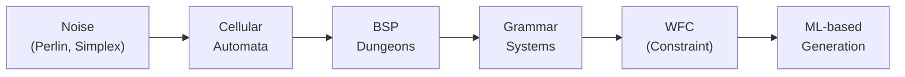

- **Noise**: terrain heightmaps, cloud textures
- **Cellular Automata**: cave systems, organic shapes
- **BSP**: rectangular dungeon layouts
- **Grammars**: L-systems, story generation
- **WFC**: tile-consistent maps, structured textures
- **ML**: neural style transfer, learned layouts

---

## WFC Introduction & Motivation

---

### The WFC Algorithm

**Wave Function Collapse** was introduced by **Maxim Gumin** in 2016.

Inspired by the concept from quantum mechanics where a particle's state is a superposition of possibilities that **collapses** to a definite state upon observation.

In WFC:

- Each cell in the output grid holds a **superposition** of all possible tiles
- Cells **collapse** one by one to a single tile
- Each collapse **propagates** constraints to neighbors
- The result: output that respects learned **local statistics** from an input sample

---

### The Key Insight

> Given a small **example image** or **tileset**, WFC generates arbitrarily large outputs that look **locally similar** to the input.

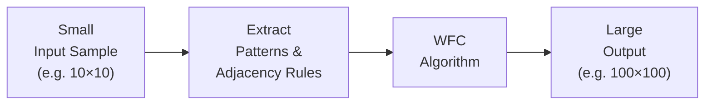

The output respects every **local constraint** found in the input — no tile appears next to a tile it was never adjacent to in the example.

---

### Comparison: PCG Algorithm Families

| Algorithm     | Input           | Output Quality     | Designer Control | Speed     |
| ------------- | --------------- | ------------------ | ---------------- | --------- |
| Noise         | Parameters      | Smooth, natural    | Low              | Very fast |
| CA            | Rules           | Organic caves      | Medium           | Fast      |
| BSP           | Parameters      | Rectangular rooms  | High             | Fast      |
| WFC (Tiled)   | Tileset + rules | Tile-consistent    | High             | Medium    |
| WFC (Overlap) | Sample image    | Pattern-consistent | Medium           | Slower    |
| ML Generation | Training data   | Flexible           | Low              | Variable  |

WFC finds a **sweet spot**: high-quality structured output with designer-specified constraints.

---

### Why WFC Became Popular

1. **Simple core algorithm** — easy to implement, understand, and extend
2. **Works from examples** — designers draw a sample, WFC learns the rules
3. **Guaranteed local consistency** — every 2-cell neighborhood matches the input
4. **Visually impressive results** — especially for tilemaps and textures
5. **Active community** — many ports, extensions, tools available

> Maxim Gumin's original C# implementation went viral in the gamedev community overnight.

---

## WFC as Constraint Satisfaction

---

### The Constraint Satisfaction Problem (CSP)

WFC is fundamentally a **Constraint Satisfaction Problem**:

- **Variables**: each cell $(x, y)$ in the output grid
- **Domain**: the set of tile types that can appear at that cell
- **Constraints**: for each pair of adjacent cells, the tile values must be **compatible** (co-occur in the training data)

$$\text{CSP} = \langle X, D, C \rangle$$

where $X$ is the set of cells, $D$ is the domain for each cell, and $C$ is the set of pairwise constraints.

---

### Analogy: Sudoku

Sudoku is a classic CSP — WFC is very similar:

| Sudoku                            | WFC                                     |
| --------------------------------- | --------------------------------------- |
| 9×9 grid cells                    | Output grid cells                       |
| Digits 1–9                        | Tile types                              |
| Each digit once per row/col/box   | Adjacent tiles must be compatible       |
| Naked singles (forced assignment) | Collapsed cell (only one tile possible) |
| Constraint propagation            | Wave propagation                        |
| Backtracking on contradiction     | Restart (or backtrack) on contradiction |

WFC is essentially **Sudoku generalized to arbitrary grids and rule sets**.

---

### From CSP to WFC

The WFC solution strategy mirrors standard CSP solvers:

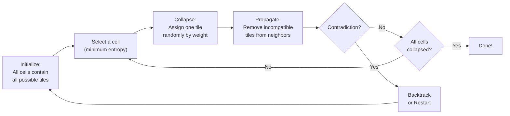

This loop combines **observation**, **collapse**, and **propagation** — the three core phases.

---

## The Tiled Model

---

### The Tiled Model Overview

In the **Tiled Model**, the designer provides:

1. A **set of named tiles** (e.g., Grass, Road, Water, Sand)
2. **Adjacency rules**: which tiles can appear next to which, per direction
3. **Weights**: how often each tile should appear

The algorithm creates output where every tile placement obeys the adjacency rules.

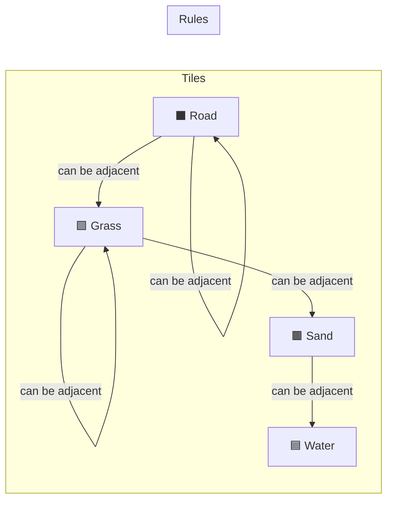

---

### Tile Adjacency Table Example

For a simple 4-tile world (N = North neighbor, S = South, E = East, W = West):

| Tile  | Can be N/S of      | Can be E/W of      |
| ----- | ------------------ | ------------------ |
| Grass | Grass, Sand, Road  | Grass, Sand, Road  |
| Water | Water, Sand        | Water, Sand        |
| Sand  | Grass, Water, Sand | Grass, Water, Sand |
| Road  | Grass, Road        | Grass, Road        |

Key observation: **Water never touches Road directly** — the model ensures this globally.

---

### Tile Weights

Weights bias the generation toward certain tiles appearing more often.

| Tile  | Weight | Normalized Probability |
| ----- | ------ | ---------------------- |
| Grass | 40     | 0.444                  |
| Water | 20     | 0.222                  |
| Sand  | 25     | 0.278                  |
| Road  | 5      | 0.056                  |

These weights are used during the **collapse** step to sample which tile gets assigned.

The Shannon entropy of a cell with these weights is:

$$H = -\sum_{t} p_t \ln p_t$$

where $p_t$ is the normalized probability of tile $t$ among the still-possible tiles.

---

### Defining Adjacency Rules Visually

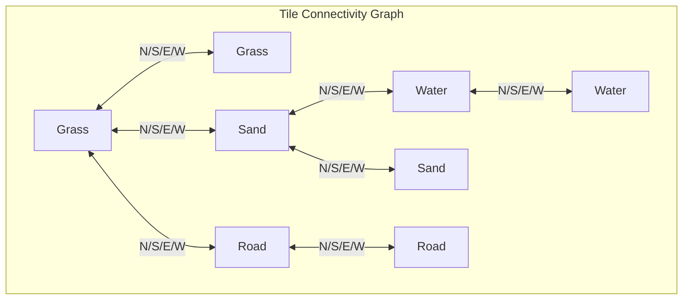

This graph encodes **all valid tile pairs** per direction. WFC enforces this graph at every cell boundary.

---

### Tiled Model: Tile Socket System

A practical way to define adjacencies uses **sockets** (also called edge labels):

- Each tile has 4 edge labels (N, S, E, W)
- Two tiles are compatible in direction $d$ if their touching edges **match**

```
Tile: GRASS        Tile: SAND
  [G]                [G]
[G][G][G]    ←→   [G][S][W]
  [G]                [W]
```

Edge labels: Grass edge = `G`, Water edge = `W`, Sand edge `S`  
Grass tile: all four edges labeled `G`  
Sand tile: North=`G`, East=`W`, South=`W`, West=`G`

Two tiles are **compatible East/West** when Tile A's East label = Tile B's West label.

---

## The Overlapping Model

---

### The Overlapping Model Overview

In the **Overlapping Model**, no explicit ruleset is needed:

- Provide a **small sample image**
- The algorithm extracts all **N×N patterns** from the image
- Adjacency rules are inferred automatically from pattern overlaps

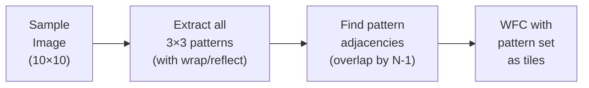

Each "tile" in the overlapping model is a full N×N sub-image, not a single cell.

---

### NxN Pattern Extraction

From a 5×5 sample, extracting all 3×3 patterns (N=3):

```
Sample (5×5):        Pattern at (0,0):    Pattern at (1,0):
A B C D E            A B C                B C D
F G H I J            F G H                G H I
K L M N O            K L M                L M N
P Q R S T
U V W X Y
```

With **wrap-around** enabled, patterns wrap at borders.  
With **reflection/rotation**, patterns can be augmented up to 8× each.  
A 10×10 sample with N=3 can yield on the order of **hundreds of unique patterns**.

---

### Overlapping vs Tiled Model

| Property                 | Tiled Model               | Overlapping Model           |
| ------------------------ | ------------------------- | --------------------------- |
| Input                    | Explicit tileset + rules  | Example image only          |
| Designer effort          | High (draw tiles + rules) | Low (draw one example)      |
| Pattern granularity      | Single tile cell          | N×N pixel region            |
| Local consistency radius | 1 cell                    | N-1 cells                   |
| Typical N                | —                         | 2 or 3                      |
| Output style             | Structured, game-ready    | Image-like, textural        |
| Contradiction rate       | Lower (by design)         | Higher (with complex input) |

The overlapping model is better for **texture generation**.  
The tiled model is better for **game level generation**.

---

### Pattern Adjacency in Overlapping Model

Two patterns $P$ and $Q$ are **compatible in direction East** if:

The right $(N-1)$ columns of $P$ equal the left $(N-1)$ columns of $Q$.

```
P:          Q:
A B C       B C D
F G H   →   G H I    (B,C,F,G,K,L must match)
K L M       L M N
```

This **overlap test** replaces the explicit adjacency rules of the tiled model — the rules are automatically derived.

---

## Observation Phase: Minimum Entropy Heuristic

---

### The Wave

At any point in the algorithm, each cell holds a **set of possible tiles** — its **superposition** or wave:

- Fully uncollapsed cell: contains **all** tile types
- Partially propagated cell: contains a **subset** of tile types
- Collapsed cell: contains exactly **one** tile type

The **wave** is the full state of the output grid — describing, for each cell, which tiles are still possible.

$$\text{Wave}_{x,y} = \lbrace t \mid t \text{ is still possible at position } (x,y) \rbrace$$

---

### Entropy as Uncertainty

**Shannon entropy** measures the uncertainty of a probability distribution:

$$H = -\sum_{t \in \text{Wave}_{x,y}} p_t \ln p_t$$

where $p_t$ is the **normalized weight** of tile $t$ among still-possible tiles at cell $(x, y)$.

- High entropy → many tiles still possible → cell is **undecided**
- Low entropy → few tiles possible → cell is **nearly determined**
- Zero entropy → exactly one tile → cell is **collapsed**

The **minimum entropy heuristic**: pick the uncollapsed cell with the **lowest entropy** to collapse next.

---

### Why Minimum Entropy?

Collapsing the most constrained cell first:

1. **Reduces contradictions** — constrained cells have less flexibility; deferring them risks making impossible situations later
2. **Propagates information quickly** — a heavily constrained collapse cascades many constraints outward
3. **Mirrors human puzzle-solving** — good Sudoku solvers look for cells with fewest candidates first

> Analogy: in Sudoku, you fill in **naked singles** first (cells with only one possibility), then pairs, etc.

---

### Entropy Worked Example

Cell $(2,1)$ has 3 possible tiles: Grass (w=40), Sand (w=25), Water (w=20).

Total weight: $W = 40 + 25 + 20 = 85$

| Tile  | Weight $w_t$ | $p_t = w_t / W$ | $p_t \ln p_t$ |
| ----- | ------------ | --------------- | ------------- |
| Grass | 40           | 0.471           | −0.354        |
| Sand  | 25           | 0.294           | −0.357        |
| Water | 20           | 0.235           | −0.339        |

$$H_{(2,1)} = -(-0.354 - 0.357 - 0.339) = 1.050$$

---

### Optimized Entropy Computation

Recomputing entropy from scratch every iteration is expensive.  
Use the **cached formula** with running sums:

$$H = \ln\!\left(\sum_t w_t\right) - \frac{\sum_t w_t \ln w_t}{\sum_t w_t}$$

Maintain two running sums per cell:

- $S_w = \sum_t w_t$ (sum of weights)
- $S_{wl} = \sum_t w_t \ln w_t$ (weighted log sum)

When a tile $t$ is removed from a cell's domain, decrement both sums:

$$S_w \mathrel{-}= w_t, \quad S_{wl} \mathrel{-}= w_t \ln w_t$$

Then recompute $H$ in $O(1)$ time.

---

### Visualizing the Wave

At any moment, you can **visualize the wave** by averaging or blending the colors of all possible tiles in each cell:

- A fully uncollapsed cell blends all tile colors → appears as a neutral average
- A near-collapsed cell (2–3 options) shows a hint of the dominant tile
- A collapsed cell shows exactly one tile's color

This visualization is useful for **debugging**: cells that never lose options likely have too-permissive rules; cells that collapse immediately might indicate overly tight constraints propagating from a forced region.

| Wave State          | Visual Appearance   | Entropy |
| ------------------- | ------------------- | ------- |
| All tiles possible  | Averaged/blended    | Maximum |
| Half tiles possible | Faint pattern hints | Medium  |
| 2 tiles possible    | Nearly determined   | Low     |
| 1 tile (collapsed)  | Solid tile color    | Zero    |

---

### Noise Tie-breaking

When multiple cells have the **same entropy**, pick one at random (with a small noise factor):

```cpp
// Pop the min-entropy cell from the heap, skipping stale entries.
// Returns {-1,-1} when all cells have been collapsed.
std::pair<int,int> pickLowestEntropyCell(
        std::vector<std::vector<Cell>>& grid,
        EntropyHeap& heap) {
    while (!heap.empty()) {
        auto [e, y, x] = heap.top(); heap.pop();
        Cell& c = grid[y][x];
        if (c.isCollapsed() || c.domainSize() <= 1) continue;
        // Stale entry: re-insert with current entropy.
        if (std::abs(e - c.entropy()) > 1e-5f) {
            heap.push({c.entropy(), y, x});
            continue;
        }
        return {y, x};
    }
    return {-1, -1};  // all collapsed
}
// Note: noiseOffset already baked into Cell::entropy() at init time.
```

The tiny noise prevents deterministic patterns from causing visual artifacts.

---

## Collapse: Weighted Random Tile Selection

---

### Collapsing a Cell

Once a cell $(x, y)$ is selected via minimum entropy, we **collapse** it:

- Sample one tile from the cell's current domain, according to tile weights
- Remove all other tiles from the domain
- The cell is now **fixed**

$$P(t \mid x,y) = \frac{w_t}{\sum_{t' \in \text{Wave}_{x,y}} w_{t'}}$$

This is a categorical distribution biased by designer-specified weights.

---

### Weighted Random Sampling

```cpp
// Weighted-random collapse: pick one surviving tile proportional to its weight.
// All other tiles are queued for removal in the caller.
int collapseCell(Cell& cell, const WeightTable& weights, std::mt19937& rng) {
    // Draw a uniform value in [0, sum-of-remaining-weights).
    std::uniform_real_distribution<float> dist(0.0f, cell.weightSum);
    float r = dist(rng);
    float cumulative = 0.0f;
    for (int t = 0; t < TILE_COUNT; ++t) {
        if (!cell.possible[t]) continue;
        cumulative += weights[t];
        if (cumulative > r) {
            cell.collapsedTile = t;
            return t;
        }
    }
    // Floating-point safety: return last surviving tile.
    for (int t = TILE_COUNT - 1; t >= 0; --t)
        if (cell.possible[t]) { cell.collapsedTile = t; return t; }
    return -1;  // contradiction — caller must handle
}
```

`std::discrete_distribution` or a manual prefix-sum scan implements weighted sampling efficiently in C++.

---

### Effect of Weights on Output

| Tile Weights                | Generated Appearance                           |
| --------------------------- | ---------------------------------------------- |
| All equal                   | Each tile appears ~equally often               |
| Grass very high             | Output is mostly grass with sparse other tiles |
| Road very low               | Roads appear rarely and in short stretches     |
| Matching training frequency | Output matches visual statistics of input      |

> Tuning weights is a key designer lever — they dramatically affect the overall feel of generated maps without changing the structural rules.

---

## Propagation Phase

---

### Why Propagation is Needed

After collapsing cell $(x, y)$ to tile $T$:

- Every **neighbor** of $(x, y)$ must now only contain tiles **compatible with $T$**
- Removing tiles from a neighbor may force **further removals** in that neighbor's neighbors
- This cascade continues until no more removals are needed — **arc consistency** is achieved

Without propagation, the wave reaches an inconsistent state and later collapses produce nonsensical results.

---

### Arc Consistency (AC-3 Analogy)

The propagation phase is equivalent to enforcing **arc consistency** in CSP:

- A cell $A$ is **arc-consistent** with neighbor $B$ in direction $d$ if, for every tile $t \in A$, there exists at least one tile $t' \in B$ compatible with $t$ in direction $d$.

If no compatible tile exists in $B$ for some $t \in A$, then $t$ must be **removed** from $A$'s domain.

The AC-3 algorithm processes a queue of arcs, similar to WFC's propagation queue.

---

### Enabler Counts Data Structure

Naively checking all neighbors every propagation step is slow.  
WFC uses an **enabler count** table:

$$\text{enablers}_{x,y,t,d} = \text{number of tiles in the opposite neighbor along } d \text{ that are compatible with tile } t$$

- When a tile $t'$ is removed from neighbor cell in direction $d$, for every tile $t$ that $t'$ enabled, decrement $\text{enablers}_{x,y,t,d}$.
- If $\text{enablers}_{x,y,t,d}$ reaches **zero** for any direction $d$, tile $t$ has **no support** and must be removed from $(x, y)$.

This allows $O(1)$ per-tile-per-direction update checks.

---

### Propagation Algorithm

```cpp
// Drain the removal queue, enforcing arc consistency via enabler counts.
// Returns false immediately on contradiction (empty domain).
bool propagate(std::vector<std::vector<Cell>>& grid,
               const WeightTable&    weights,
               const AdjacencyTable& adj,
               int H, int W,
               std::queue<Removal>&  q) {
    while (!q.empty()) {
        auto [cy, cx, rem] = q.front(); q.pop();
        for (int d = 0; d < DIR_COUNT; ++d) {
            int ny = cy + DY[d], nx = cx + DX[d];
            if (ny < 0 || ny >= H || nx < 0 || nx >= W) continue;
            Cell& nb  = grid[ny][nx];
            int   opp = static_cast<int>(opposite(static_cast<Dir>(d)));
            // rem was enabling tile t in nb from direction opp.
            for (int t = 0; t < TILE_COUNT; ++t) {
                if (!nb.possible[t] || !adj[d][rem][t]) continue;
                if (--nb.enablers[opp][t] == 0)
                    if (!removeTile(grid, weights, q, ny, nx, t))
                        return false;  // contradiction
            }
        }
    }
    return true;
}
```

---

### Propagation Cascade Diagram

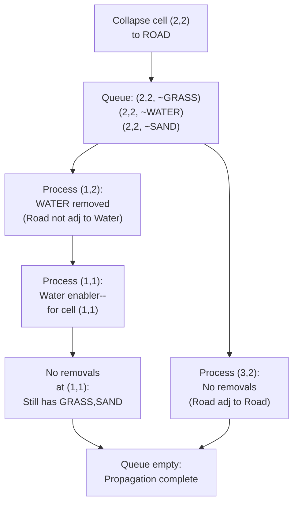

Each cell removal may trigger further downstream removals in a **breadth-first** cascade.

---

### Propagation Complexity

Let:

- $W \times H$ = grid size
- $T$ = number of tile types
- $D$ = number of directions (typically 4)

| Operation               | Cost per tile removal |
| ----------------------- | --------------------- |
| Decrement enabler count | $O(T)$                |
| Check if enabler = 0    | $O(1)$                |
| Add to queue            | $O(1)$                |
| Total per removal       | $O(T)$                |

Worst-case total propagation: $O(W \cdot H \cdot T^2 \cdot D)$  
In practice, propagation terminates quickly — typically within a few cell layers.

---

## The Complete Algorithm

---

### WFC Full Pseudocode

```cpp
// One full WFC run; throws Contradiction on failure.
std::vector<std::vector<Cell>> runWFC(
        int W, int H,
        const WeightTable&    weights,
        const AdjacencyTable& adj,
        std::mt19937& rng) {

    auto grid = initGrid(W, H, weights, adj, rng);
    auto heap = buildHeap(grid, H, W);
    std::queue<Removal> q;

    while (true) {
        // 1. Observe: pick most-constrained cell.
        auto [y, x] = pickLowestEntropyCell(grid, heap);
        if (y == -1) return grid;       // all collapsed — success!

        // 2. Collapse: weighted-random tile selection.
        int chosen = collapseCell(grid[y][x], weights, rng);
        if (chosen == -1) throw Contradiction{};

        // 3. Remove all other tiles and propagate.
        for (int t = 0; t < TILE_COUNT; ++t)
            if (t != chosen && grid[y][x].possible[t])
                if (!removeTile(grid, weights, q, y, x, t)) throw Contradiction{};
        if (!propagate(grid, weights, adj, H, W, q)) throw Contradiction{};

        // Re-insert updated neighbours into the heap.
        for (int d = 0; d < DIR_COUNT; ++d) {
            int ny = y+DY[d], nx = x+DX[d];
            if (ny>=0 && ny<H && nx>=0 && nx<W)
                heap.push({grid[ny][nx].entropy(), ny, nx});
        }
    }
}
```

---

### Algorithm Flowchart

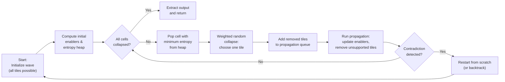

---

### Loop Invariant

At the start of each iteration, the wave satisfies:

> **Every cell is arc-consistent with all its neighbors**

Propagation re-establishes this invariant after each collapse.

This invariant means that the remaining tiles in each cell are **reachable** — there exists at least one complete assignment consistent with them.

---

### Termination and Correctness

- **Termination**: each iteration either collapses one more cell or detects a contradiction. The grid is finite, so the algorithm terminates.
- **Local correctness**: by construction, every adjacent pair in the output is in the adjacency list — the output is locally consistent.
- **Global correctness**: not guaranteed. WFC can produce contradictions even on valid tilesets. The algorithm is **complete** in the sense that it always terminates; it is **not complete** in the CSP sense (no guaranteed solution exists).

---

## WFC Step-by-Step Visual Example

---

### Initial State: 3×3 Grid

Consider a 3×3 grid with 3 tiles: G (Grass), W (Water), S (Sand).

Rules: G adj G, S; S adj G, W, S; W adj S, W. Weights: G=3, S=2, W=1.

|           | Col 0   | Col 1   | Col 2   |
| --------- | ------- | ------- | ------- |
| **Row 0** | {G,W,S} | {G,W,S} | {G,W,S} |
| **Row 1** | {G,W,S} | {G,W,S} | {G,W,S} |
| **Row 2** | {G,W,S} | {G,W,S} | {G,W,S} |

All cells have identical entropy: $H = -\frac{3}{6}\ln\frac{3}{6} - \frac{2}{6}\ln\frac{2}{6} - \frac{1}{6}\ln\frac{1}{6} \approx 1.011$

---

### Iteration 1: First Collapse

Pick any cell at random (tie): say **(1,1)** center. Weighted sample → **G** (Grass).

Propagation: remove W and S from (1,1).

|           | Col 0   | Col 1   | Col 2   |
| --------- | ------- | ------- | ------- |
| **Row 0** | {G,W,S} | {G,S}   | {G,W,S} |
| **Row 1** | {G,S}   | **{G}** | {G,S}   |
| **Row 2** | {G,W,S} | {G,S}   | {G,W,S} |

Cells directly adjacent to center lose Water (G not adj W), so (0,1),(2,1),(1,0),(1,2) → domain becomes {G,S}.

---

### Iteration 2: Second Collapse

Update entropy heap. Cells (0,1),(2,1),(1,0),(1,2) now have 2 tiles: entropy $\approx 0.673$.  
Corner cells still have 3 tiles: entropy $\approx 1.011$.

Pick **minimum entropy** cell: say **(0,1)**. Weighted sample → **S** (Sand).

Propagation: S is adj to G,W,S — so (0,0) and (0,2) can now lose nothing extra. (0,1)'s West is OOB.

|           | Col 0   | Col 1   | Col 2   |
| --------- | ------- | ------- | ------- |
| **Row 0** | {G,W,S} | {G,S}   | {G,W,S} |
| **Row 1** | **{S}** | **{G}** | {G,S}   |
| **Row 2** | {G,W,S} | {G,S}   | {G,W,S} |

After propagation: (0,1) is now {S}. (0,0) and (0,2) still unchanged at this point.

---

### Iteration 3: Cascade Propagation

**(0,1)** collapsed to **S**. **Propagation** runs:

- North neighbor (0,0): S adj G,W,S → no removal
- South neighbor (0,2): S adj G,W,S → no removal
- East neighbor (1,1): already {G}; G adj S ✓ → no removal

Now pick next minimum entropy cell: **(1,0)** or **(1,2)** or **(2,1)** (all at 2 tiles, $H \approx 0.673$).

Say **(2,1)** → weighted sample → **G**.

|           | Col 0   | Col 1   | Col 2   |
| --------- | ------- | ------- | ------- |
| **Row 0** | {G,W,S} | {G,S}   | {G,W,S} |
| **Row 1** | **{S}** | **{G}** | **{G}** |
| **Row 2** | {G,W,S} | {G,S}   | {G,W,S} |

Propagation from (2,1)=G: east neighbor (2,2) was {G,W,S} → Water removed (G not adj W) → {G,S}.

---

### Iteration 4: More Collapses

Current state with updated domains:

|           | Col 0   | Col 1   | Col 2   |
| --------- | ------- | ------- | ------- |
| **Row 0** | {G,W,S} | {G,S}   | {G,W,S} |
| **Row 1** | **{S}** | **{G}** | **{G}** |
| **Row 2** | {G,W,S} | {G,S}   | {G,S}   |

Minimum entropy candidates: {G,S} cells. Pick **(1,0)** → weighted sample → **G**.

Propagation from (1,0)=G:

- West neighbor (0,0): G adj G,S → remove W → (0,0) = {G,S}
- East neighbor (2,0): G adj G,S → remove W → (2,0) = {G,S}

|           | Col 0   | Col 1   | Col 2   |
| --------- | ------- | ------- | ------- |
| **Row 0** | {G,S}   | **{G}** | {G,S}   |
| **Row 1** | **{S}** | **{G}** | **{G}** |
| **Row 2** | {G,W,S} | {G,S}   | {G,S}   |

---

### Iteration 5 & 6: Filling Corners

Collapse **(0,0)**: candidates {G,S}, weighted → **G**.  
Collapse **(2,0)**: candidates {G,S}, weighted → **S**.

|           | Col 0   | Col 1   | Col 2   |
| --------- | ------- | ------- | ------- |
| **Row 0** | **{G}** | **{G}** | **{S}** |
| **Row 1** | **{S}** | **{G}** | **{G}** |
| **Row 2** | {G,W,S} | {G,S}   | {G,S}   |

Propagation from (2,0)=S:

- South (2,1) already {G} — S adj G ✓ no removal
- West (1,0) already {G} — S adj G ✓ no removal
- East: OOB

---

### Iteration 7 & 8: Final Row

Collapse **(1,2)**: candidates {G,S}, weighted → **G**.

Propagation from (1,2)=G: west (0,2) = {G,W,S} → remove W → {G,S}; east (2,2) already {G,S}.

Collapse **(0,2)** → **S**. Propagation → south **(0,3)** OOB, east **(1,2)** = {G} ✓.  
Collapse **(2,2)** → **G**.

**Final output:**

|           | Col 0 | Col 1 | Col 2 |
| --------- | ----- | ----- | ----- |
| **Row 0** | G     | G     | S     |
| **Row 1** | S     | G     | G     |
| **Row 2** | S     | G     | G     |

Every adjacent pair respects the adjacency rules. The algorithm **succeeded without contradiction**.

---

## Handling Contradictions

---

### What is a Contradiction?

A **contradiction** occurs when a cell's domain becomes **empty**: no tile can legally occupy that cell given the current choices.

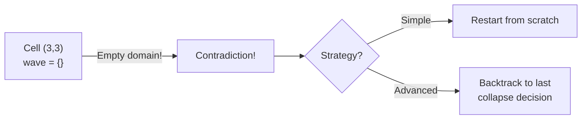

Contradictions are **inevitable** in practice — especially for complex tilesets or small training sets with many constraint interactions.

---

### Why Contradictions Happen

| Cause                   | Description                                    |
| ----------------------- | ---------------------------------------------- |
| Insufficient tileset    | Some valid configurations not representable    |
| Tight constraints       | Rules too restrictive, forced into dead end    |
| Long-range dependencies | Local rules don't capture global structure     |
| Small training sample   | Missing adjacency patterns                     |
| Bad collapse order      | Unlucky random choices early on                |
| Pinched corridors       | Narrow paths that need specific tile sequences |

The longer the propagation chain before contradiction, the harder it is to avoid by local means.

---

### Restart vs Backtracking

| Strategy                       | Pros                                             | Cons                                        |
| ------------------------------ | ------------------------------------------------ | ------------------------------------------- |
| **Full restart**               | Simple, no state overhead                        | Slow for large grids, many retries          |
| **Backtrack to last collapse** | Finds solution faster if contradiction is recent | More complex implementation                 |
| **Backtrack to oldest cause**  | Guided; avoids repeating same mistake            | Requires cause-tracking (expensive)         |
| **Partial restart (region)**   | Restarts only a local region                     | Complex; possible inconsistency at boundary |
| **Constraint relaxation**      | Weaken rules near contradiction site             | May produce artifacts                       |

For most **game applications**, **full restart** is sufficient — the algorithm is fast enough that restarting a few times is acceptable.

---

### Practical Contradiction Rates

Contradiction rate depends heavily on tileset complexity:

| Tileset Type                  | Typical Contradiction Rate |
| ----------------------------- | -------------------------- |
| Simple 4-tile terrain         | < 1%                       |
| Medium dungeon tileset        | 2–10%                      |
| Complex structural tileset    | 10–30%                     |
| Highly constrained 3D tileset | 30–60%                     |

**Design tip**: contradiction rate above 20% usually indicates a tileset design problem. Add more transition tiles or relax some adjacency rules.

---

## Tileset Design

---

### Principles of Good Tileset Design

A WFC tileset is only as good as its **design**. Key principles:

1. **Completeness**: every tile should connect smoothly in both directions with at least one other tile
2. **Closure**: the graph of tile adjacencies should have no dead ends (tiles that can only be reached but not left)
3. **Avoid long-range dependencies**: if structure X requires tile A 3 cells away, contradictions will be common
4. **Add transition tiles**: bridge incompatible regions (e.g., a Grass-to-Water shoreline tile)
5. **Test incrementally**: start with a small tileset, verify it works, then add complexity

---

### Marching Squares / Marching Cubes

A systematic approach to tileset generation for 2D terrain:

**Marching Squares** uses a 2-bit neighborhood to generate all boundary tiles:

| Corner Config (NW,NE,SW,SE) | Tile Shape |
| --------------------------- | ---------- |
| 0000                        | All empty  |
| 1111                        | All filled |
| 1000                        | NW corner  |
| 1100                        | N edge     |
| 1010                        | W edge     |
| ...                         | ...        |

With 2 surface types, this yields **16 unique tiles**. With seamless edges, all adjacencies are valid by construction — no contradiction possible between terrain types.

---

### Wang Tiles

**Wang tiles** (named after Hao Wang, 1961) are a formalization of edge-compatible tiles:

- Each tile has labeled edges (colors/patterns)
- Two tiles are adjacent iff their touching edges have **matching labels**
- A complete Wang tile set covers all edge combinations

```
Wang tile example (edges labeled 0 or 1):
Tile 1: N=0, E=0, S=0, W=0   (all-zero — e.g. empty field)
Tile 2: N=0, E=1, S=0, W=0   (road going East)
Tile 3: N=1, E=0, S=1, W=0   (road going N-S)
Tile 4: N=0, E=0, S=0, W=1   (road going West)
...
```

With $k$ edge labels, a complete set requires up to $k^4$ tiles. Designers use Wang tiles to guarantee a **zero-contradiction** tileset.

---

### Edge Compatibility in Practice

When designing tiles manually:

- Use a **sprite sheet** where each tile is drawn to share edges with adjacent tiles
- Enforce edge labels with a color code (e.g., color the top edge of each tile to indicate its edge type)
- Build an automated **compatibility checker** in your tile editor

```cpp
// Validate that every tile has at least one compatible neighbour in every
// direction. Returns a list of human-readable problem descriptions.
std::vector<std::string> checkCompatibility(const AdjacencyTable& adj) {
    std::vector<std::string> issues;
    const char* dirName[] = {"North","East","South","West"};
    for (int t = 0; t < TILE_COUNT; ++t) {
        for (int d = 0; d < DIR_COUNT; ++d) {
            bool hasNeighbour = false;
            for (int n = 0; n < TILE_COUNT; ++n)
                if (adj[d][t][n]) { hasNeighbour = true; break; }
            if (!hasNeighbour)
                issues.push_back(
                    "Tile " + std::to_string(t) +
                    " has no " + dirName[d] + " neighbour!");
        }
    }
    return issues;
}
```

---

### Tileset Design Tips

| Tip                                            | Reason                                                    |
| ---------------------------------------------- | --------------------------------------------------------- |
| Start with terrain layers (water, sand, grass) | Simple, well-understood constraints                       |
| Add explicit corner pieces                     | Prevents concave tile mismatches                          |
| Use rotation/reflection symmetry               | Reduces tileset size, same coverage                       |
| Design with WFC output in mind                 | Test as you go; reject tiles that cause contradictions    |
| Add "filler" tiles with many valid neighbors   | Reduces contradiction rate significantly                  |
| Document each tile's socket/edge labels        | Future collaborators (and you in 3 months) will thank you |

---

## Implementation Details

---

### Core Data Structures

```cpp
struct WFC {
    int W, H;
    WeightTable    weights;   // weights[t]              = float
    AdjacencyTable adj;       // adj[dir][src][dst]       = bool

    // Wave: possible[y][x].possible[t] = tile t still valid at (x,y)
    std::vector<std::vector<Cell>> grid;

    // Cached running sums per cell (entropy maintained incrementally)
    //   cell.weightSum    = sum of weights[t] for surviving t
    //   cell.weightLogSum = sum of weights[t]*log2(weights[t])
    // Both updated in O(1) whenever a tile is removed.

    std::mt19937 rng;

    WFC(int w, int h, WeightTable wt, AdjacencyTable rules, uint32_t seed)
        : W(w), H(h), weights(wt), adj(rules), rng(seed) {
        grid = initGrid(W, H, weights, adj, rng);
    }

    // Run with restart loop; returns solved grid or throws on total failure.
    std::vector<std::vector<Cell>> run(int maxRestarts = 100) {
        for (int i = 0; i < maxRestarts; ++i) {
            grid = initGrid(W, H, weights, adj, rng);
            try { return runWFC(W, H, weights, adj, rng); }
            catch (const Contradiction&) { /* retry */ }
        }
        throw std::runtime_error("WFC failed after max restarts");
    }
};
```

---

### Entropy Heap

Use a **min-heap** keyed by noisy entropy for efficient cell selection:

```cpp
// Build the initial min-heap of (entropy, row, col) triples.
// Noise is already embedded in Cell::noiseOffset set during initGrid().
EntropyHeap buildHeap(const std::vector<std::vector<Cell>>& grid, int H, int W) {
    EntropyHeap heap;  // std::priority_queue, min-heap via std::greater
    for (int y = 0; y < H; ++y)
        for (int x = 0; x < W; ++x)
            heap.push({grid[y][x].entropy(), y, x});
    return heap;
}

// Pop the minimum-entropy uncollapsed cell (skip stale entries).
std::pair<int,int> popMinEntropy(
        std::vector<std::vector<Cell>>& grid, EntropyHeap& heap) {
    while (!heap.empty()) {
        auto [e, y, x] = heap.top(); heap.pop();
        const Cell& c = grid[y][x];
        if (c.isCollapsed() || c.domainSize() <= 1) continue;
        return {y, x};  // valid uncollapsed cell
    }
    return {-1, -1};  // all collapsed
}
```

The heap may contain **stale entries** (already-collapsed cells). A validity check discards them lazily.

---

### Initialization

Proper initialization sets all enabler counts:

```cpp
// Inside initGrid() — enabler counts are built per cell during initialisation.
// For each cell (y,x), tile t, direction d:
//   enablers[d][t] = number of tiles in that direction's neighbour
//                    that are compatible with t.
// Out-of-bounds neighbours: treated as if all tiles are compatible
//   (no constraint from the boundary), so the count equals TILE_COUNT.
for (int d = 0; d < DIR_COUNT; ++d) {
    int ny = y + DY[d], nx = x + DX[d];
    bool inBounds = ny >= 0 && ny < H && nx >= 0 && nx < W;
    c.enablers[d].assign(TILE_COUNT, 0);
    for (int t = 0; t < TILE_COUNT; ++t) {
        if (!inBounds) {
            c.enablers[d][t] = TILE_COUNT; // unconstrained boundary
        } else {
            for (int n = 0; n < TILE_COUNT; ++n)
                if (adj[d][t][n]) c.enablers[d][t]++;
        }
    }
}
// (This snippet lives inside the y/x loop in initGrid; see lecture notes.)
```

This correctly handles **boundary cells** — tiles at the grid edge have no constraints from out-of-bounds directions.

---

### Optimization: Precomputed Compatibility Sets

Precompute which tiles are **affected** when a given tile is removed:

```cpp
// Precompute: for each (tile, direction), which tiles in the opposite
// neighbour does it enable?  Stored as a flat list for cache efficiency.
// propagators[d][t] = list of tiles t' such that adj[d][t'][t] is true
//   i.e., t2 in the neighbour along d could be enabled by t here.
using PropagatorTable =
    std::array<std::vector<std::vector<int>>, DIR_COUNT>;

PropagatorTable buildPropagators(const AdjacencyTable& adj) {
    PropagatorTable prop;
    for (int d = 0; d < DIR_COUNT; ++d) {
        prop[d].resize(TILE_COUNT);
        int opp = static_cast<int>(opposite(static_cast<Dir>(d)));
        for (int t = 0; t < TILE_COUNT; ++t)
            for (int t2 = 0; t2 < TILE_COUNT; ++t2)
                if (adj[opp][t2][t])   // t2 in opp-direction enables t here
                    prop[d][t].push_back(t2);
    }
    return prop;
    // Inner propagation loop now iterates over prop[d][t] in O(k)
    // instead of all TILE_COUNT tiles in O(T).
}
```

This turns the inner propagation loop from $O(T^2)$ to $O(k)$ where $k$ is the average number of compatible tile pairs.

---

### Full Implementation Reference

Key implementation choices summarized:

| Component              | Recommended Approach            | Alternative                  |
| ---------------------- | ------------------------------- | ---------------------------- |
| Wave storage           | 2D array of bit sets            | 2D array of sets             |
| Cell selection         | Min-heap with lazy deletion     | Linear scan $O(WH)$          |
| Enabler counts         | Per-tile per-direction integers | Recompute on demand          |
| Propagation            | BFS queue (breadth-first)       | DFS stack (depth-first)      |
| Contradiction handling | Restart loop                    | Backtracking with checkpoint |
| Memory layout          | Row-major arrays                | Hash map of cells            |

For game-sized grids ($\leq 256 \times 256$), any of these choices works. For very large grids or real-time use, prefer bit-set waves and min-heap selection.

---

## WFC in Commercial Games

---

### Bad North (Raw Fury, 2018)

**Bad North** is a minimalist real-time tactics game set on procedurally generated archipelago islands.

- Uses WFC to generate island shorelines and terrain layouts
- Tileset designed around gameplay constraints (spawn points, high ground, narrow passages)
- Guarantees **playable** island shapes by combining WFC with post-processing validation
- WFC replaced an older noise-based generator because noise couldn't guarantee tactical variety

> "WFC gave us islands that felt hand-crafted" — Raw Fury developer notes

---

### Townscaper (Oskar Stålberg, 2021)

**Townscaper** is a casual city-building toy where clicking generates charming European-style towns.

- Uses an **irregular grid** variant of WFC (Voronoi-based)
- Tileset of ~hundreds of building pieces with precisely matching edge sockets
- The WFC ensures coherent rooflines, arches, towers, and courtyards
- Real-time generation: every click instantly updates the wave

The key innovation: **Oskar Stålberg extended WFC to non-rectangular grids** by representing the wave on a graph rather than a 2D array.

---

### Caves of Qud (Freehold Games, ongoing)

**Caves of Qud** is a deep roguelike RPG with a hand-crafted world layered with procedural content.

- Uses WFC-inspired constraint propagation for **dungeon decoration and room dressing**
- Furniture, props, and item placement satisfies spatial rules derived from hand-authored examples
- Combines WFC with **narrative constraints** (quest-specific rooms must have required elements)

The game shows WFC used at a **content layer** rather than the geometry layer — tiles are objects, not terrain.

---

### Brogue-style Dungeons with WFC

Many indie roguelikes use WFC for dungeon generation:

| Game         | WFC Role                  | Special Feature                     |
| ------------ | ------------------------- | ----------------------------------- |
| Bad North    | Island terrain            | Gameplay-valid shape guarantee      |
| Townscaper   | Entire building structure | Irregular grid, real-time           |
| Caves of Qud | Room dressing/props       | Combined with narrative constraints |
| Unexplored 2 | Overworld regions         | Hierarchical WFC                    |
| Rogue-like X | Corridor + room layout    | Post-process connectivity fix       |

In all cases, WFC is used as a **structure generator** with additional game-specific logic layered on top.

---

### Lessons from Commercial Use

1. **Never ship raw WFC output** — always validate for gameplay properties (connectivity, reachability)
2. **Designer-WFC collaboration**: WFC is a tool, not a replacement for level design taste
3. **Tileset iteration is the work** — the algorithm itself is simple; the hard part is the tileset
4. **Seed control**: expose the random seed so players can share seeds and developers can reproduce bugs
5. **Performance budget**: WFC generation time must fit within loading screen or streaming budget

---

## Extensions & Variants

---

### Non-Local Constraints

Standard WFC only enforces **local (1-cell neighborhood) constraints**.  
Non-local constraints add global structure:

- **Reachability**: BFS/pathfinding post-check; if not connected, restart
- **Count constraints**: require exactly $k$ instances of tile $T$ in the output
- **Region labeling**: divide output into named zones; constrain what tiles appear in each zone
- **Template injection**: force certain regions to match a hand-authored template, let WFC fill the rest

Implementation: run WFC, then validate global constraints; restart if violated. Or use **SMT-solver integration** to pre-propagate global constraints.

---

### 3D and Hexagonal Grids

WFC generalizes naturally to non-square grids:

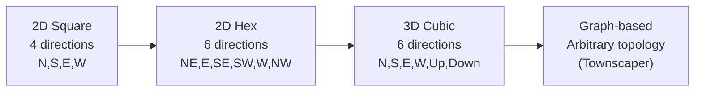

For each grid type:

- Define **directions** and **neighbor function**
- Expand adjacency rules to cover all directions
- Everything else in the algorithm remains unchanged

3D WFC is used in **voxel game** level generation (Minecraft-like worlds, cave systems).

---

### Infinite / Streaming Generation

For large open worlds, generate the map **on demand** as the player moves:

- Maintain a **sliding window** of the active wave
- When the player approaches an uncollapsed region, run WFC there
- Use **border constraints**: the cells at the active region boundary are pre-set by previously generated content

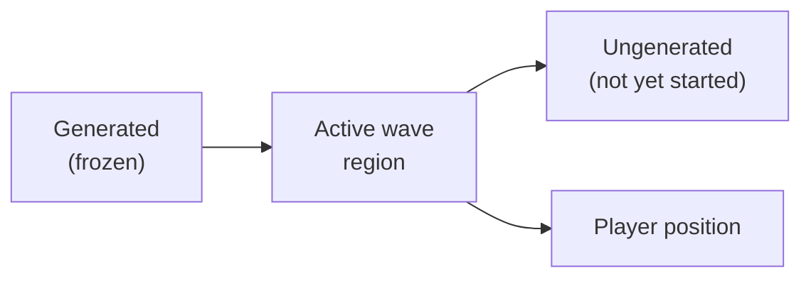

**Challenge**: the frozen boundary cells may not be consistent with a new WFC run → requires careful border propagation initialization.

---

### Multi-Pass WFC

Generate **hierarchically** by running WFC at multiple scales:

1. **Coarse pass**: large tiles representing regions (Forest, Desert, City, Dungeon)
2. **Medium pass**: room-scale tiles conditioned on the region type from pass 1
3. **Fine pass**: decoration tiles conditioned on the room type from pass 2

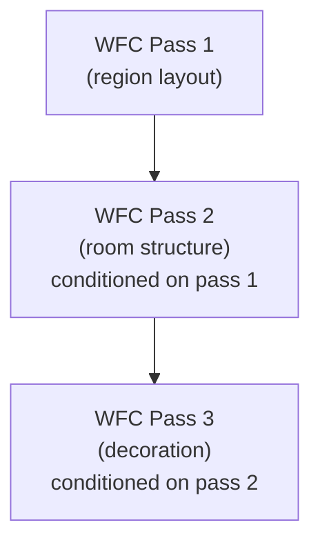

This creates **structured variety at multiple scales** — the hallmark of good procedural level design.

---

### Neural WFC and Learned Constraints

Recent research extends WFC with machine learning:

| Approach                      | Description                                                               |
| ----------------------------- | ------------------------------------------------------------------------- |
| **Neural adjacency learning** | CNN learns adjacency rules from large image datasets                      |
| **GAN + WFC constraints**     | GAN generates texture; WFC enforces tile structure                        |
| **Transformer WFC**           | Sequence model guides collapse order and tile selection                   |
| **Reinforcement learning**    | RL agent learns a collapse policy that minimizes contradiction rate       |
| **Latent WFC**                | WFC operates on embeddings in a latent space, decoded by a neural network |

Current limitation: neural approaches are slower and harder to control than classical WFC. They excel at **novel texture synthesis** where classical WFC lacks training data.

---

## Practical Challenges & Solutions

---

### Common Problems and Fixes

| Problem                 | Root Cause                                          | Fix                                                                   |
| ----------------------- | --------------------------------------------------- | --------------------------------------------------------------------- |
| High contradiction rate | Missing transition tiles; overly strict rules       | Add more intermediate tiles; relax rare adjacency rules               |
| Output looks repetitive | Too few tiles or very biased weights                | Add tile variants; reduce weight disparity                            |
| Generation too slow     | Large grid; expensive entropy computation           | Use enabler counts + entropy caching; parallelize propagation         |
| Output not playable     | WFC ignores game rules (connectivity, spawn points) | Post-process validate; use placement constraints                      |
| Corridors dead-end      | Long-range structure not captured locally           | Add structural tiles (T-junctions, corners); use multi-pass           |
| Large blank regions     | One tile dominates due to high weight               | Lower dominant tile weight; add rule that limits self-adjacency count |

---

### Debugging WFC

Effective debugging strategies:

- **Visualize the wave**: render each cell's domain as a blended color; patterns of high-entropy cells reveal structural problems
- **Log contradiction sites**: track which cell collapsed to what just before the contradiction — this is almost always the cause
- **Reduce tileset**: comment out half the tiles; if contradiction rate drops, a newly added tile is the problem
- **Check rule symmetry**: if A can be East of B, then B must be West of A — asymmetry causes mysterious contradictions
- **Unit-test adjacency rules**: write tests that assert every tile has at least one valid neighbor in every direction

---

### Advanced: Contradiction Rate Prediction

Research has shown that contradiction rate can be estimated analytically for simple tilesets:

Let $r$ be the probability that a random partial assignment of $k$ cells creates a dead end.

Empirically, contradiction rate scales with:

$$P(\text{contradiction}) \approx 1 - \left(1 - p_{\text{dead end}}\right)^{W \cdot H}$$

where $p_{\text{dead end}}$ is the per-cell dead-end probability from the tileset structure.

In practice: **profile your tileset** before integration. Run WFC 1000 times on a small grid and measure contradiction rate. If above 10%, redesign.

---

## Summary & Key Concepts

---

### WFC Algorithm in One Page

**Input**: tileset (tiles + adjacency rules + weights) or sample image

**Output**: grid where every adjacent tile pair is valid

**Three phases per iteration**:

1. **Observe** — find the uncollapsed cell with lowest Shannon entropy
2. **Collapse** — assign one tile by weighted random sampling
3. **Propagate** — cascade constraint removals via enabler count decrements

**Key data structures**:

- Wave: per-cell set of possible tiles
- Enabler counts: per-cell per-tile per-direction support count
- Entropy heap: min-heap of cells sorted by entropy

**Failure**: contradiction (empty domain) → restart or backtrack

---

### Math Summary

| Concept                | Formula                                                               |
| ---------------------- | --------------------------------------------------------------------- |
| Shannon entropy        | $H = -\sum_t p_t \ln p_t$                                             |
| Normalized tile weight | $p_t = w_t / \sum_{t'} w_{t'}$                                        |
| Cached entropy         | $H = \ln S_w - S_{wl} / S_w$                                          |
| Collapse probability   | $P(t) = w_t / \sum_{t' \in \text{wave}} w_{t'}$                       |
| Arc consistency        | $\forall t \in A,\; \exists t' \in B : \text{compatible}(t, t', d)$   |
| Enabler count          | $\text{enablers}_{x,y,t,d} \geq 1 \Rightarrow t \text{ is supported}$ |

These six equations completely describe the WFC algorithm's mathematical core.

---

### Where to Go From Here

**Immediate next steps**:

- Implement the basic tiled WFC in C++ (300–400 lines) — start from the structs in the lecture notes
- Design a small tileset (5–10 tiles) for a terrain or dungeon theme
- Experiment with weights — see how they change output visually

**Advanced topics**:

- Implement backtracking for more reliable generation
- Extend to 3D for voxel worlds
- Integrate with a game engine (Godot, Unity, Unreal all have WFC plugins)
- Study Oskar Stålberg's work on irregular grid WFC and the Townscaper dev logs
- Read the original WFC paper and Gumin's GitHub for the overlapping model details

> WFC is one of the most elegant algorithms in game development — a small idea with enormous creative potential.

---

### Further Reading

| Resource                                                                            | Type           | Focus                                   |
| ----------------------------------------------------------------------------------- | -------------- | --------------------------------------- |
| Maxim Gumin's GitHub (mxgmn/WaveFunctionCollapse)                                   | Code + README  | Original C# implementation, both models |
| Oskar Stålberg's Townscaper dev logs                                                | Blog           | Irregular grid WFC in commercial use    |
| Martin O'Leary's WFC explainer                                                      | Web article    | Visual step-by-step explanation         |
| Paul Merrell — "Model Synthesis" (2007)                                             | Academic paper | WFC precursor algorithm                 |
| Isaac Karth & Adam Smith — "WaveFunctionCollapse is Constraint Solving in the Wild" | Academic paper | Formal CSP analysis of WFC              |
| Robert Heaton's WFC tutorial                                                        | Blog           | Accessible implementation guide         |
| Procedural Content Generation in Games (book)                                       | Textbook       | Broader PCG context                     |

---

## Deeper Dives

---

### The Model Synthesis Precursor

WFC did not appear in a vacuum. **Paul Merrell's Model Synthesis** (2007) predates it and solves a very similar problem:

- Given a 3D **example voxel model**, synthesize a new, larger model with the same local structure
- Uses **constraint propagation** over a 3D grid
- Introduces the concept of "compatibility" between adjacent voxels derived from the example

Differences from WFC:

| Property           | Model Synthesis | WFC                    |
| ------------------ | --------------- | ---------------------- |
| Dimensionality     | Primarily 3D    | 2D and 3D              |
| Collapse order     | Arbitrary       | Minimum entropy first  |
| Restart strategy   | Complex         | Simple restart         |
| Community adoption | Research niche  | Wide game dev adoption |

Gumin simplified and popularized the approach; the core constraint propagation idea is the same.

---

### Entropy Intuition: Information Theory

Shannon entropy originates in **information theory** (Claude Shannon, 1948).

It measures the **average number of bits** needed to encode an outcome from a probability distribution:

$$H(X) = -\sum_{i} p_i \log_2 p_i \quad \text{(in bits)}$$

WFC uses the natural log variant (nats), but the intuition is identical:

- A fair coin: $H = -0.5 \log_2 0.5 - 0.5 \log_2 0.5 = 1$ bit
- A loaded coin (p=0.9, q=0.1): $H \approx 0.469$ bits
- A certain outcome (p=1.0): $H = 0$ bits

A WFC cell with many equally-weighted tiles has **high entropy** (many bits of uncertainty); a cell with one forced tile has **zero entropy** (no uncertainty).

---

### Why Not Pick the Most Constrained Cell Directly?

An alternative heuristic: pick the cell with **fewest remaining tiles** (smallest domain size) rather than minimum entropy.

| Heuristic           | Considers Weights? | Tie Resolution | Quality                |
| ------------------- | ------------------ | -------------- | ---------------------- |
| Min domain size     | No                 | Arbitrary      | Good                   |
| Min Shannon entropy | Yes                | Arbitrary      | Better                 |
| Min entropy + noise | Yes                | Random         | Best (avoid artifacts) |

Min entropy is strictly better than min domain size when tiles have **unequal weights** — two cells with the same domain size can have very different entropies if their available tiles have skewed weights.

---

### Formal WFC Correctness

WFC is a **sound but incomplete** generator:

- **Sound**: if it returns a grid, every adjacent tile pair is in the adjacency set. The output is always locally valid.
- **Incomplete**: it may fail (contradiction) even when a valid assignment exists. Unlike DPLL-SAT or backtracking CSP solvers, it does not exhaustively search.

**Theorem** (informal): If WFC succeeds, its output is locally consistent. If it fails, no conclusion about the existence of a valid assignment can be drawn.

This contrasts with backtracking CSP solvers which are **complete** — they find a solution if one exists (given sufficient time).

> The tradeoff: WFC's incomplete search is **much faster** in practice for the common case where valid solutions are dense.

---

### Bit-Set Wave for Performance

For large tilesets ($T \leq 64$), represent each cell's domain as a single 64-bit integer:

```cpp
// For tilesets with TILE_COUNT <= 64, pack the domain into one uint64_t.
// This gives ~10-20x speedup over std::vector<bool>.
using WaveBits = uint64_t;

// Initialize cell: all tiles possible.
inline WaveBits allPossible(int numTiles) {
    return (numTiles == 64) ? ~0ULL : (1ULL << numTiles) - 1ULL;
}

// Remove tile t.
inline void removeTileBit(WaveBits& w, int t) { w &= ~(1ULL << t); }

// Query tile t.
inline bool isPossible(WaveBits w, int t) { return (w >> t) & 1ULL; }

// Count remaining tiles (hardware popcount on x86-64).
inline int domainSize(WaveBits w) { return __builtin_popcountll(w); }

// Contradiction: no tiles left.
inline bool isContradiction(WaveBits w) { return w == 0ULL; }

// Example usage in propagation:
// if (isContradiction(wave[ny][nx])) throw Contradiction{};
```

This reduces cache pressure and uses hardware instructions for popcount and bitwise AND — often **10–20× faster** than set-based representation.

---

### The Overlapping Model: Pattern Frequencies

In the overlapping model, pattern frequencies from the input sample drive the weights:

$$w_P = \text{count}(P \text{ in sample})$$

If a 3×3 pattern appears 5 times in the sample, its weight is 5. This means:

- Common patterns appear often in the output
- Rare patterns appear rarely
- Absent patterns never appear

The resulting output **preserves the statistical distribution** of patterns from the input — this is the "looks like the sample" guarantee.

$$P(\text{output pattern} = P) \approx \frac{w_P}{\sum_{P'} w_{P'}}$$

This is the probabilistic foundation of why overlapping-model output visually resembles its input.

---

### Generating Infinite Worlds: The Chunking Strategy

For open-world games requiring unlimited map generation:

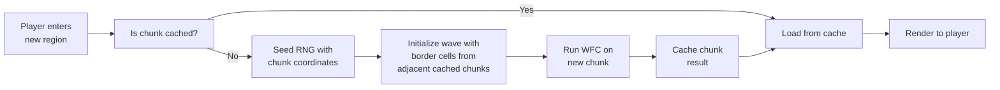

The key: **seed the RNG with the chunk's world coordinates** for deterministic regeneration. Players can always return to the same location and find the same terrain.

---

### Border Cell Initialization for Chunked Generation

When generating a new chunk adjacent to an already-generated chunk:

1. Copy the **edge tiles** of the existing chunk as fixed (already-collapsed) cells in the new chunk's wave
2. Run initial propagation from all border cells before the main WFC loop
3. This ensures the new chunk's generation is **consistent** with its already-generated neighbors

```cpp
// Pre-collapse border cells from adjacent already-generated chunks.
// Call this before the main WFC loop when generating chunk (cx, cy).
void initChunkBorders(
        std::vector<std::vector<Cell>>& wave,
        const ChunkCache& cache,
        int cx, int cy,
        const WeightTable& weights,
        std::queue<Removal>& q) {

    // West border: copy east edge of chunk (cx-1, cy).
    if (cache.contains({cx-1, cy})) {
        const auto& west = cache.at({cx-1, cy});
        for (int row = 0; row < CHUNK_H; ++row) {
            int borderTile = west[row][CHUNK_W-1].collapsedTile;
            // Force this cell to the known tile; remove all others.
            for (int t = 0; t < TILE_COUNT; ++t)
                if (t != borderTile && wave[row][0].possible[t])
                    removeTile(wave, weights, q, row, 0, t);
            wave[row][0].collapsedTile = borderTile;
        }
    }
    // Repeat for North, East, South borders similarly...
}
```

---

### WFC and Constraint Programming Languages

WFC can be expressed formally in constraint programming:

```
Variables: T[x][y] for each cell (x,y), domain = {tiles}
Constraints:
  for each (x,y) and each direction d:
    (T[x][y], T[neighbor(x,y,d)]) in adjacency_set[d]
Objective: find any satisfying assignment
```

This is a standard **constraint satisfaction problem** solvable by:

- WFC (fast, incomplete, elegant)
- AC-3 + backtracking (complete, slower)
- SAT solvers (complete, powerful, overkill for most games)

For **academic purposes**, implementing WFC as a simple CSP solver and comparing it to AC-3 is an excellent exercise in understanding the algorithm's strengths and limitations.

---

### Performance Benchmarks

Typical WFC performance on modern hardware:

| Grid Size | Tiles | Avg. Time | Contradiction Rate |
| --------- | ----- | --------- | ------------------ |
| 32×32     | 10    | < 1 ms    | 2%                 |
| 64×64     | 10    | < 5 ms    | 3%                 |
| 128×128   | 20    | ~20 ms    | 8%                 |
| 256×256   | 20    | ~100 ms   | 9%                 |
| 256×256   | 50    | ~400 ms   | 15%                |
| 512×512   | 20    | ~500 ms   | 10%                |

These numbers assume:

- Bit-set wave representation
- Min-heap cell selection
- Enabler count propagation
- C++ implementation with min-heap and enabler-count propagation

For real-time game use, **precompute or stream** generation off the critical path.

---

### WFC vs. Cellular Automata: A Comparison

| Property           | WFC                                | Cellular Automata                      |
| ------------------ | ---------------------------------- | -------------------------------------- |
| Rule specification | Tile adjacency pairs               | Local update rule (e.g., Game of Life) |
| Determinism        | Stochastic (seeded)                | Deterministic from initial state       |
| Output consistency | Always valid (if no contradiction) | May violate high-level structure       |
| Input              | Tileset or example                 | Initial conditions + rule              |
| Typical use        | Tilemaps, textures                 | Cave carving, erosion simulation       |
| Output quality     | Very high structural consistency   | Natural, organic but unstructured      |

CA is **faster** and simpler; WFC produces **higher quality** structured output. Many games use **both**: CA for organic cave shapes, WFC for tile-valid dungeon dressing.

---

### The Connection to Quantum Mechanics (Metaphor)

The "wave function collapse" name is a deliberate analogy to quantum mechanics:

| Quantum Mechanics                                 | WFC Algorithm                                     |
| ------------------------------------------------- | ------------------------------------------------- |
| Particle exists in superposition of states        | Cell exists in superposition of tiles             |
| Wave function = probability amplitude over states | Wave = set of possible tiles (with weights)       |
| Measurement collapses the wave function           | Observation step collapses a cell to one tile     |
| Entanglement → distant effects                    | Propagation → distant constraint cascade          |
| Uncertainty principle                             | Contradiction: some configurations are impossible |

The analogy is **metaphorical**, not mathematical. WFC has no quantum physics.  
It is a **deterministic constraint propagation** algorithm with randomized collapse.

> The colorful name stuck and contributed enormously to WFC's viral spread in the gamedev community.

---

### Integrating WFC into a Game Engine

Each engine has its own idiomatic language — use the native one rather than bridging to C++.

---

### Engine Integration: Godot (GDScript)

Godot's scripting language is **GDScript** — use it directly for WFC logic:

```gdscript
class_name WFC

const TILE_COUNT := 5
const DIRS := [Vector2i(0,-1), Vector2i(1,0), Vector2i(0,1), Vector2i(-1,0)]

var wave: Array       # wave[y][x] = Array[bool]  (possible tiles)
var weights: Array    # weights[t] = float
var adj: Array        # adj[dir][t][n] = bool

func run(width: int, height: int) -> Array:
    _init_wave(width, height)
    while true:
        var cell = _pick_min_entropy()
        if cell == null:
            return _extract(width, height)   # success
        var chosen = _collapse(cell)
        if not _propagate(cell, chosen):
            return []                         # contradiction → caller restarts

func _collapse(cell: Vector2i) -> int:
    var possible := []
    for t in range(TILE_COUNT):
        if wave[cell.y][cell.x][t]:
            possible.append(t)
    return possible.pick_random()  # weighted via weights array in full impl.

func _extract(w: int, h: int) -> Array:
    var out := []
    for y in range(h):
        var row := []
        for x in range(w):
            for t in range(TILE_COUNT):
                if wave[y][x][t]: row.append(t); break
        out.append(row)
    return out
```

---

### Engine Integration: Unity (C#)

Unity uses **C#** — leverage generics and LINQ for concise WFC code:

```csharp
using System.Collections.Generic;
using System.Linq;
using UnityEngine;

public class WFC : MonoBehaviour {
    [SerializeField] int width = 32, height = 32;
    [SerializeField] float[] weights;
    bool[][,,] adj;   // adj[dir, src, dst]

    HashSet<int>[,] wave;

    public int[,] Run(int seed) {
        var rng = new System.Random(seed);
        for (int attempt = 0; attempt < 100; attempt++) {
            InitWave();
            if (TryGenerate(rng, out var result)) return result;
        }
        Debug.LogError("WFC failed after 100 attempts");
        return null;
    }

    bool TryGenerate(System.Random rng, out int[,] result) {
        result = null;
        while (true) {
            var (cy, cx) = PickMinEntropy();
            if (cy < 0) { result = Extract(); return true; }

            int chosen = WeightedSample(wave[cy, cx], rng);
            wave[cy, cx] = new HashSet<int> { chosen };

            if (!Propagate(cy, cx)) return false;  // contradiction
        }
    }

    // Coroutine variant for step-by-step editor visualization:
    public IEnumerator RunVisual(System.Random rng) {
        InitWave();
        while (true) {
            var (cy, cx) = PickMinEntropy();
            if (cy < 0) yield break;
            int chosen = WeightedSample(wave[cy, cx], rng);
            wave[cy, cx] = new HashSet<int> { chosen };
            Propagate(cy, cx);
            PaintCell(cy, cx, chosen);   // update TileMap mid-generation
            yield return null;           // one frame per collapse step
        }
    }
}
```

---

### Engine Integration: Unreal Engine (C++)

Unreal uses **C++** natively — WFC maps cleanly to UE5 types:

```cpp
// WFCGenerator.h  (UE5 module)
#pragma once
#include "CoreMinimal.h"
#include "WFCGenerator.generated.h"

UCLASS(BlueprintType)
class MYGAME_API UWFCGenerator : public UObject {
    GENERATED_BODY()
public:
    UPROPERTY(EditAnywhere, BlueprintReadWrite)
    TArray<float> TileWeights;

    // adj[Dir * TileCount * TileCount + src * TileCount + dst]
    UPROPERTY(EditAnywhere, BlueprintReadWrite)
    TArray<bool> Adjacency;

    // Returns flattened tile grid (row-major), empty on failure.
    UFUNCTION(BlueprintCallable, Category="PCG")
    TArray<int32> Generate(int32 Width, int32 Height, int32 Seed);

private:
    struct Cell {
        TArray<bool> Possible;
        int32 CollapsedTile = -1;
        float WeightSum = 0.f;
    };

    bool Propagate(TArray<TArray<Cell>>& Grid, TQueue<TTuple<int32,int32,int32>>& Q,
                   int32 H, int32 W);
};
```

---

### The Role of Symmetry in Pattern Augmentation

When using the overlapping model, you can **augment** the pattern set by applying geometric transformations to extracted patterns:

- **Rotation** by 90°, 180°, 270° — multiplies pattern count up to 4×
- **Reflection** (horizontal, vertical, diagonal) — up to 8× total with all rotations
- **Selective augmentation** — apply only rotations, not reflections, for asymmetric content

```cpp
// A 2D pattern of size N×N stored row-major.
struct Pattern {
    int N;
    std::vector<int> data;  // data[row*N + col] = pixel/tile value
    int at(int r, int c) const { return data[r*N+c]; }
};

Pattern rotate90(const Pattern& p) {
    Pattern r{p.N, std::vector<int>(p.N*p.N)};
    for (int y = 0; y < p.N; ++y)
        for (int x = 0; x < p.N; ++x)
            r.data[x*p.N + (p.N-1-y)] = p.at(y, x);
    return r;
}

Pattern reflectH(const Pattern& p) {
    Pattern r{p.N, std::vector<int>(p.N*p.N)};
    for (int y = 0; y < p.N; ++y)
        for (int x = 0; x < p.N; ++x)
            r.data[y*p.N + (p.N-1-x)] = p.at(y, x);
    return r;
}

std::vector<Pattern> augmentPatterns(
        const std::vector<Pattern>& input,
        bool doRotate = true, bool doReflect = true) {
    std::vector<Pattern> out;
    for (auto& p : input) {
        out.push_back(p);
        if (doRotate) {
            out.push_back(rotate90(p));
            out.push_back(rotate90(rotate90(p)));       // 180°
            out.push_back(rotate90(rotate90(rotate90(p)))); // 270°
        }
        if (doReflect) { out.push_back(reflectH(p)); }
    }
    // Deduplicate identical patterns.
    std::sort(out.begin(), out.end(), [](auto& a, auto& b){ return a.data < b.data; });
    out.erase(std::unique(out.begin(), out.end(),
        [](auto& a, auto& b){ return a.data == b.data; }), out.end());
    return out;
}
```

Augmentation greatly improves output quality for **symmetric content** (landscapes, architectural facades) but can introduce unwanted symmetry for directional content (e.g., roads with one-way traffic).

---

### Propagation: BFS vs DFS

The propagation queue can be processed **breadth-first** (BFS) or **depth-first** (DFS):

| Strategy    | Order               | Property                                     |
| ----------- | ------------------- | -------------------------------------------- |
| BFS (queue) | Nearest cells first | Balanced propagation front                   |
| DFS (stack) | Deepest path first  | May resolve cascades faster in some tilesets |

In practice:

- **BFS is preferred** for its uniform propagation front — it tends to detect contradictions earlier
- **DFS** can outperform in tilesets with strong directional constraints (chain reactions propagate in one direction)

Both are $O(W \cdot H \cdot T \cdot D)$ in the worst case. The choice is an **implementation detail** that rarely affects output quality.

---

### WFC for Texture Synthesis

The overlapping model excels at **texture synthesis** — generating large seamless textures from small examples:

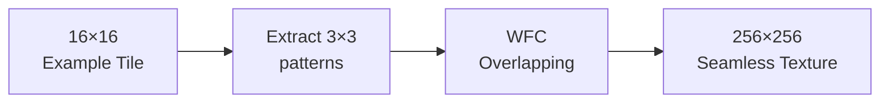

Applications:

- **Terrain textures**: grass, sand, rock blends
- **Wallpaper and fabric patterns**: complex repeating motifs
- **Architectural facades**: brick, window, panel arrangements

The key advantage over traditional tiling: WFC generates **non-repeating** textures that still respect local structure — no visible tile seams or repetition artifacts.

---

### WFC for Puzzle Generation

WFC can generate **playable puzzles** by encoding puzzle rules as tile adjacency:

**Nonogram / Picross** generation:

- Tiles represent filled/empty cells
- Adjacency rules encode run-length constraints per row and column
- WFC generates consistent puzzle grids

**Maze generation**:

- Tiles: corridor, wall, junction, dead-end
- Rules: corridors must connect at both ends; walls can be adjacent to anything
- Post-process: validate connectivity with flood fill

**Pattern-based puzzles**:

- Encode the puzzle's state machine as tile types
- Each tile represents a valid local configuration in the puzzle's state space
- WFC generates globally consistent puzzle instances

---

### Research Frontiers

Active research areas in WFC and related algorithms:

1. **Guaranteed solution existence**: given a tileset, prove whether WFC will always find a solution or characterize the contradiction-free subsets
2. **Quality metrics**: formal measures for output diversity, coverage, and statistical fidelity to the input
3. **Hybrid approaches**: WFC + hierarchical planning + simulation for city-scale world generation
4. **Interactive WFC**: human-in-the-loop systems where the designer guides collapses in real time
5. **WFC for narrative**: applying constraint propagation to story generation, where "tiles" are story events with narrative compatibility constraints

> The field is young — foundational papers are only ~10 years old. There is substantial room for novel contributions.

---

### Assignment Preview

In the upcoming **WFC Assignment**, you will:

1. **Implement the tiled WFC** algorithm in C++ from scratch
2. **Design a 5–8 tile tileset** for a 2D terrain (terrain type of your choice)
3. **Run the algorithm** on a 32×32 grid and visualize the output
4. **Measure contradiction rate** over 100 runs and identify which tile rule pairs most often cause contradictions
5. **Extend**: implement one of (weighted tiles, backtracking, or a second tileset)

**Deliverables**:

- Commented C++ source code (compiles with `g++ -std=c++17`)
- 5 sample output images (different seeds)
- Short report (1–2 pages): tileset design decisions, contradiction analysis, one extension implemented

**Grading criteria**: correctness of propagation, tileset quality, code clarity, analysis depth.

---

### Review Questions

Test your understanding before the exam:

1. What is the difference between the **tiled model** and the **overlapping model** in WFC?
2. Why do we pick the cell with **minimum entropy** rather than a random cell?
3. What is an **enabler count** and why does it make propagation efficient?
4. When does WFC produce a **contradiction**? Name two ways to recover from it.
5. Describe the **three phases** of one iteration of WFC.
6. How does WFC relate to the **Arc Consistency (AC-3)** algorithm?
7. What is the Shannon entropy formula? What does it measure in the context of WFC?
8. Why is the **overlapping model** better for texture synthesis than the tiled model?
9. Name two commercial games that use WFC and describe how it is used in each.
10. What is a **Wang tile** and why is it useful for designing WFC tilesets?

---

### Quick Reference: WFC Pseudocode

```
WFC(width, height, tiles, rules, weights):
  wave ← {all tiles} for each cell
  enablers ← compute_initial_enablers(wave, rules)
  heap ← entropy_heap(wave, weights)

  loop:
    cell ← pop_min_entropy(heap)
    if cell = None: return success(wave)

    chosen ← weighted_sample(wave[cell], weights)
    removed ← wave[cell] \ {chosen}
    wave[cell] ← {chosen}

    queue ← [(cell, t) for t in removed]
    for (c, t) in queue:
      for d in directions:
        n ← neighbor(c, d)
        if n out of bounds: continue
        for t2 in propagators[t][d]:
          enablers[n][t2][opposite(d)] -= 1
          if enablers[n][t2][opposite(d)] = 0:
            wave[n] ← wave[n] \ {t2}
            if wave[n] = ∅: return failure(contradiction)
            queue.append((n, t2))

  return success(wave)
```

This is the complete algorithm. All the rest is initialization, data structure management, and tileset design.

---

### Complexity Summary

The overall complexity of one complete WFC run:

| Phase                   | Time Complexity                                      | Notes                                        |
| ----------------------- | ---------------------------------------------------- | -------------------------------------------- |
| Initialization          | $O(W \cdot H \cdot T \cdot D)$                       | Fill enabler counts for all cells/tiles/dirs |
| Entropy heap build      | $O(W \cdot H \cdot \log(W \cdot H))$                 | Standard heap construction                   |
| Per-iteration observe   | $O(\log(W \cdot H))$                                 | Heap pop                                     |
| Per-iteration collapse  | $O(T)$                                               | Weighted sample from domain                  |
| Per-iteration propagate | $O(W \cdot H \cdot T \cdot D)$ worst case            | In practice far less                         |
| **Total**               | $O(W \cdot H \cdot T \cdot D \cdot \log(W \cdot H))$ | Practical performance is much better         |

For a 128×128 grid with 20 tiles and 4 directions, worst-case propagation is ~13 million operations — well within real-time budgets at modern CPU speeds.

---

### Glossary

Key terms used throughout this lecture:

| Term                  | Definition                                                                                     |
| --------------------- | ---------------------------------------------------------------------------------------------- |
| **Wave**              | The full grid state: for each cell, the set of still-possible tiles                            |
| **Superposition**     | A cell containing more than one possible tile                                                  |
| **Collapse**          | Fixing a cell to exactly one tile by weighted random sampling                                  |
| **Propagation**       | Cascading constraint removals after a collapse                                                 |
| **Enabler count**     | How many tiles in a given direction still support a tile at a cell                             |
| **Arc consistency**   | Property where every tile in a cell is supported by at least one tile in each neighboring cell |
| **Shannon entropy**   | Measure of uncertainty in a probability distribution                                           |
| **Contradiction**     | A cell whose domain becomes empty — no valid tile assignment exists                            |
| **Tiled model**       | WFC variant using an explicit tileset with designer-specified adjacency rules                  |
| **Overlapping model** | WFC variant extracting patterns automatically from an example image                            |
| **Socket**            | Edge label on a tile used to determine adjacency compatibility                                 |
| **Wang tile**         | A tile with labeled edges where adjacency is determined by edge label matching                 |

---

### Connections to Other Algorithms

WFC draws on and relates to several well-known CS algorithms:

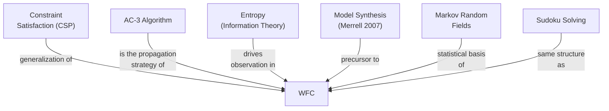

Understanding WFC gives you practical insight into all of these fields — it is a cross-disciplinary algorithm that sits at the intersection of game development, statistical modeling, and constraint solving.

---

### A Note on the Name

The name **"Wave Function Collapse"** is evocative but sometimes misleading for engineers:

- It does **not** use quantum mechanics
- It is **not** a physics simulation
- The "wave" is just a grid of possibility sets
- The "collapse" is just a random sample

Maxim Gumin chose the name for its intuitive power and it became iconic in the gamedev world.

Some authors prefer more neutral names like **"Constraint-based Procedural Generation"** or **"Adjacency-constraint Synthesis"** in academic contexts — but for game developers, WFC is the universally recognized term.

> Whatever you call it, the algorithm is elegant, practical, and worth understanding deeply.
