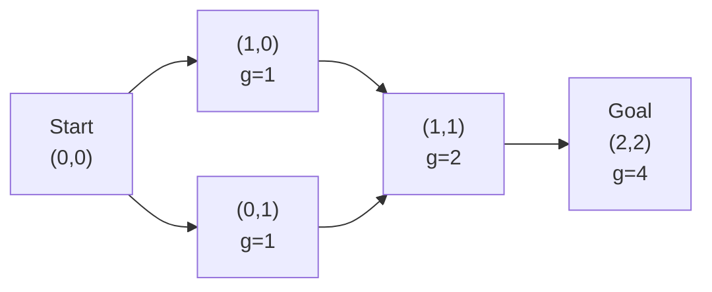
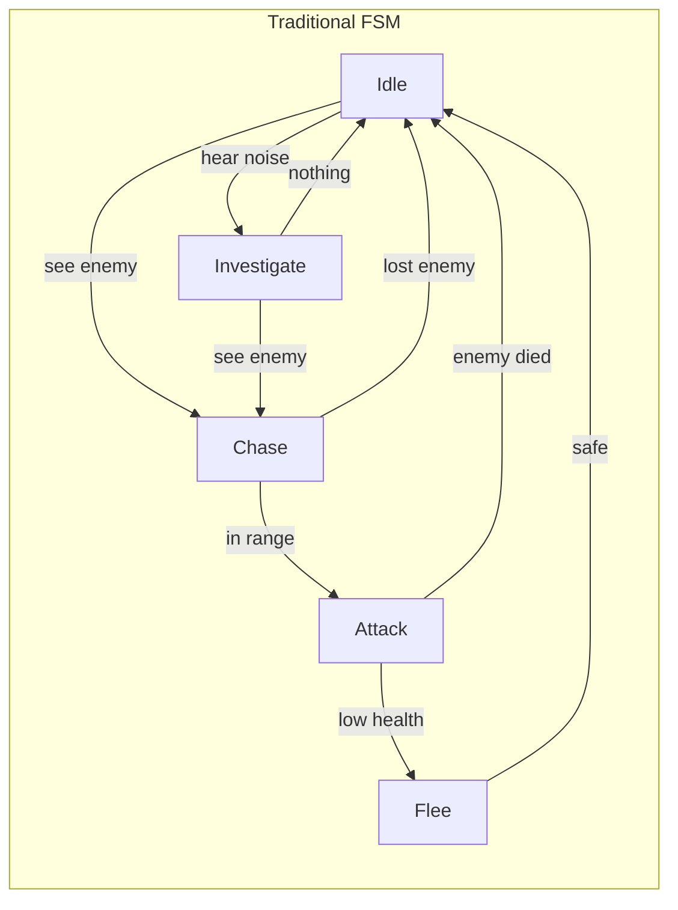
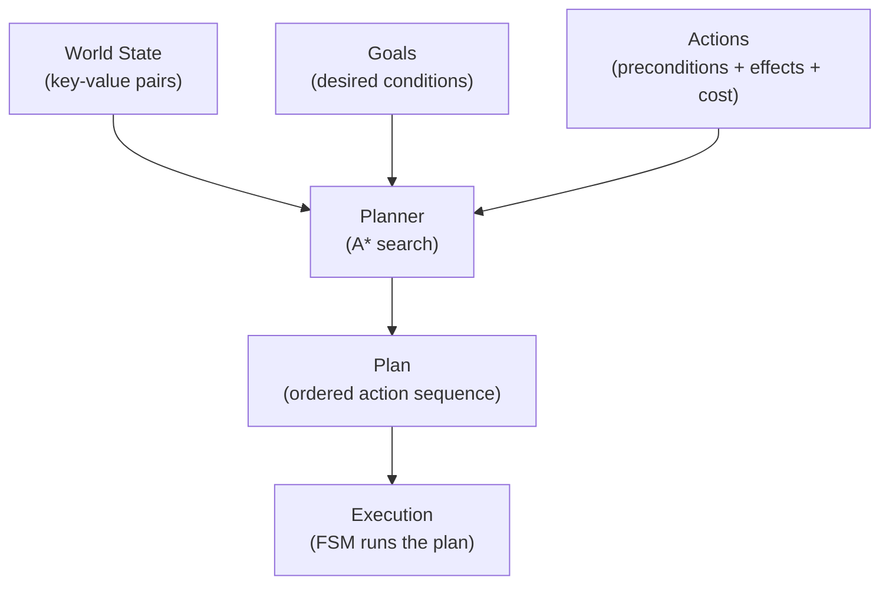
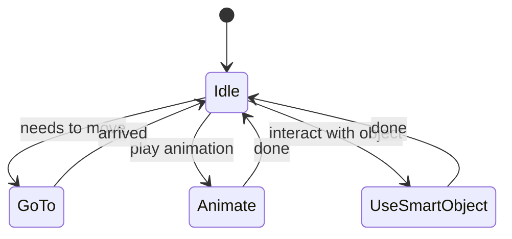
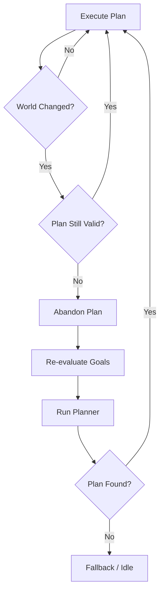
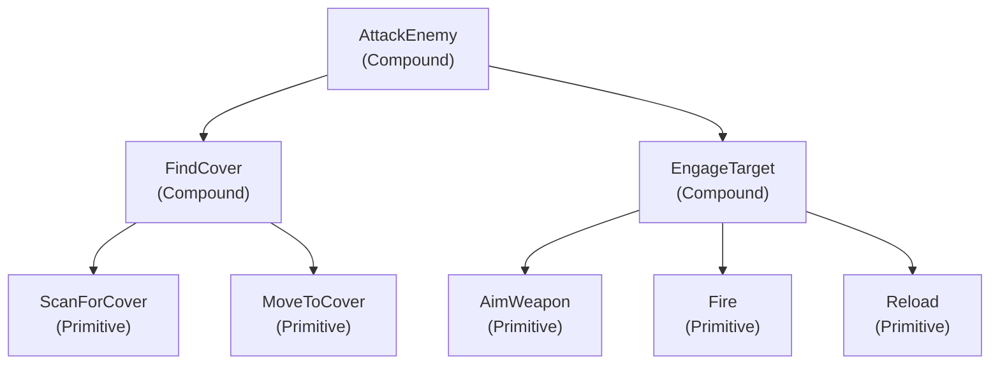
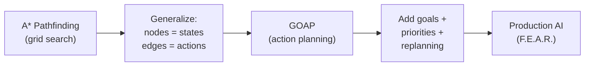

# Goal-Oriented Action Planning

## From A\* Pathfinding to Intelligent NPC Decision-Making

---

## Agenda

1. A\* Recap & the Planning Connection
2. From Classical Planning to GOAP (STRIPS, FSM Scaling)
3. GOAP Components: Goals, Actions, World State
4. F.E.A.R. Case Study: Three States and a Plan
5. Designing a GOAP Solver in C++
6. GOAP vs FSM vs Behavior Trees & HTN Preview

---

## A\* Recap

---

### A\* as Producer-Consumer

A\* is a best-first search using $f(n) = g(n) + h(n)$:

- **g(n)**: Cost from start to $n$
- **h(n)**: Heuristic estimate from $n$ to goal

Two key data structures:

- **Frontier (Open Set)**: Priority queue — the **producer** pushes neighbors, the **consumer** pops the lowest $f$
- **Visited (Closed Set)**: Hash set of evaluated nodes

> The same producer-consumer pattern will power GOAP — but instead of grid cells, we'll search through **world states**.

---

### A\* Applied to Spatial Pathfinding



- **Nodes** = grid positions
- **Edges** = moves between adjacent cells
- **Heuristic** = Manhattan distance

**Key Insight**: What if nodes were _world states_ and edges were _actions_?

---

## From Classical Planning to GOAP

---

### STRIPS: The Theoretical Foundation (1971)

**STRIPS** (Stanford Research Institute Problem Solver) formalizes planning as:

$$\langle P, O, I, G \rangle$$

| Symbol | Meaning                           | Example                            |
| ------ | --------------------------------- | ---------------------------------- |
| $P$    | Propositions (boolean conditions) | `hasAmmo`, `enemyInRange`          |
| $O$    | Operators (actions)               | `Reload`, `Attack`                 |
| $I$    | Initial state                     | `{hasAmmo=false, enemyAlive=true}` |
| $G$    | Goal state                        | `{enemyAlive=false}`               |

Each operator has:

- **Preconditions** — must be true before executing
- **Add List** — propositions that become true
- **Delete List** — propositions that become false

---

### STRIPS Operator Example

| Component         | PickUpAmmo                               |
| ----------------- | ---------------------------------------- |
| **Preconditions** | `nearAmmo = true`, `handsEmpty = true`   |
| **Add List**      | `hasAmmo = true`                         |
| **Delete List**   | `handsEmpty = false`, `nearAmmo = false` |

> Finding an optimal STRIPS plan is **PSPACE-complete**.  
> GOAP makes this tractable by limiting world state to ~20-30 properties.

---

### The FSM Scaling Problem

Before GOAP, game AI used **Finite State Machines** (FSMs).



This is only ~5 states. Real games had **40-80+ states** with hundreds of hand-authored transitions.

---

### The Scalability Wall

**No One Lives Forever 2** (pre-GOAP) used three FSM layers with ~**80 states**.

| Problem           | Impact                                                       |
| ----------------- | ------------------------------------------------------------ |
| Adding 1 behavior | Must edit transitions from _every_ state that could reach it |
| Transition count  | Grows $O(n^2)$ with state count                              |
| Bug surface       | Every new transition is a potential logic error              |
| Reuse across NPCs | Copy-paste entire FSMs, modify individually                  |

> Jeff Orkin (F.E.A.R. AI Lead): "Adding new behaviors was extremely error-prone because the programmer had to consider all possible transitions to and from every existing state."

---

### Jeff Orkin's Insight: Planning as Search

Replace hand-authored transitions with an **automated planner**:

| FSM Approach                    | GOAP Approach                  |
| ------------------------------- | ------------------------------ |
| Define every state + transition | Define actions independently   |
| $O(n^2)$ authoring              | $O(n)$ authoring               |
| Static behavior                 | Dynamic, emergent behavior     |
| Hard to extend                  | Add one action, planner adapts |

Each action declares what it **needs** (preconditions), what it **produces** (effects), and what it **costs**.

The planner uses **A\* through action space** to chain actions automatically.

---

## GOAP Components

---

### The Four Pillars of GOAP



---

### World State

The world state is a set of **key-value pairs** representing everything the planner needs to know:

```cpp
using State = std::unordered_map<std::string, int>;

State worldState = {
    {"hasWeapon", 1},
    {"weaponDrawn", 0},
    {"enemyInRange", 0},
    {"enemyDead", 0},
    {"inCover", 0},
    {"ammoInClip", 1}
};
```

Typically **20-30 properties** — enough for rich behavior, small enough for fast planning.

---

### Actions

Each action has three components:

| Component         | Purpose                    | Example (Attack)                |
| ----------------- | -------------------------- | ------------------------------- |
| **Preconditions** | What must be true          | `weaponDrawn=1, enemyInRange=1` |
| **Effects**       | How the world changes      | `enemyDead=1`                   |
| **Cost**          | How expensive (guides A\*) | `3`                             |

```cpp
class Action {
    virtual State getPreconditions() const = 0;
    virtual State getEffects() const = 0;
    virtual float getCost() const = 0;

    bool isApplicable(const State& state) const {
        return satisfies(state, getPreconditions());
    }
};
```

---

### Goals

A goal defines the **desired world state** and a **priority**:

- `KillEnemy`: `{ enemyDead = 1 }` — priority: HIGH when enemy visible
- `Survive`: `{ inCover = 1 }` — priority: CRITICAL when health low
- `Patrol`: `{ atWaypoint = 1 }` — priority: LOW (default)

The agent always pursues its **highest-priority** active goal.

When conditions change (e.g., health drops), goal priorities shift, triggering **replanning**.

---

### The Planner: A\* Through Action Space

| A\* Pathfinding                | GOAP Planning                 |
| ------------------------------ | ----------------------------- |
| Nodes = grid positions         | Nodes = world states          |
| Edges = moves                  | Edges = actions               |
| Cost = movement cost           | Cost = action cost            |
| Heuristic = Manhattan distance | Heuristic = unsatisfied goals |
| Goal = target position         | Goal = target world state     |

```cpp
float heuristic(const State& current, const State& goal) {
    int unsatisfied = 0;
    for (const auto& [key, value] : goal) {
        auto it = current.find(key);
        if (it == current.end() || it->second != value)
            unsatisfied++;
    }
    return static_cast<float>(unsatisfied);
}
```

> Counting unsatisfied conditions is **admissible** — each needs at least one action.

---

### Forward vs Backward Planning

**Forward (Progressive)**: Start → apply actions → reach Goal

```
Current State → Action₁ → State₁ → Action₂ → ... → Goal
```

**Backward (Regressive)**: Goal → find actions whose effects match → reach Current

```
Goal ← Action_n ← ... ← Action₁ ← Current State
```

F.E.A.R. uses **backward planning** because:

- Goals have **fewer conditions** than the full world state
- Search starts **narrow** and expands
- Forward search may explore many **irrelevant** branches

---

## F.E.A.R. Case Study

---

### F.E.A.R. (2005)

**First Encounter Assault Recon** by Monolith Productions.

- Widely praised as having the **best enemy AI** of its era
- Proved GOAP could work in a **commercial AAA title**
- Enemies appeared to use squad tactics, flanking, and cover

The secret: **not scripted** — all emergent from GOAP.

---

### The Three-State FSM

Orkin reduced **all NPC animation** to just 3 states:



| State              | Description                | Example               |
| ------------------ | -------------------------- | --------------------- |
| **GoTo**           | Navigate to position       | Move to cover         |
| **Animate**        | Play animation in place    | Reload, shoot         |
| **UseSmartObject** | Interact with world object | Flip table, open door |

Compare: **3 states** vs **80+ states** in previous game. GOAP handles decisions; FSM handles execution.

---

### F.E.A.R. Actions Table

F.E.A.R. shipped with **~70 goals** and **~120 actions**.

| Action        | Preconditions                   | Effects          | Cost |
| ------------- | ------------------------------- | ---------------- | ---- |
| `DrawWeapon`  | `hasWeapon=1`                   | `weaponDrawn=1`  | 1    |
| `Attack`      | `weaponDrawn=1, enemyInRange=1` | `enemyDead=1`    | 3    |
| `MoveToRange` | `weaponDrawn=1`                 | `enemyInRange=1` | 2    |
| `Reload`      | `weaponDrawn=1, ammoInClip=0`   | `ammoInClip=1`   | 2    |
| `TakeCover`   | `coverAvailable=1`              | `inCover=1`      | 2    |
| `FlankEnemy`  | `enemyInCover=1, weaponDrawn=1` | `enemyInRange=1` | 5    |

---

### Emergent Behavior Through Cost

`FlankEnemy` and `MoveToRange` both produce `enemyInRange = 1`:

- **MoveToRange**: cost 2 (cheaper → planner prefers this)
- **FlankEnemy**: cost 5 (more expensive → only used when direct approach fails)

If `MoveToRange` preconditions are blocked (path obstructed), the planner **automatically discovers** flanking.

> No one scripted "if path blocked, flank." The planner found it.

This creates **emergent tactical variety** without explicit authoring.

---

### Combat Scenario Walkthrough

**Scenario**: NPC spots the player while on patrol.

| Step | Component          | What Happens                                         |
| ---- | ------------------ | ---------------------------------------------------- |
| 1    | **Sensor**         | Vision sensor → `canSeeEnemy = true`                 |
| 2    | **Goal Selection** | `KillEnemy` activates (highest priority)             |
| 3    | **Planning**       | A\* searches backward from `{ enemyDead=1 }`         |
| 4    | **Plan Found**     | `DrawWeapon → MoveToRange → Attack`                  |
| 5    | **Execution**      | FSM: Animate(draw) → GoTo(position) → Animate(shoot) |

The planner chains 3 actions automatically — the designer only defined each action independently.

---

### The Squad Coordination Illusion

Enemies appear to coordinate: "Flank left!" "Cover me!"

**The truth**: NPCs **never communicate**. Each plans independently.

1. NPC A's planner decides to flank (direct path blocked) → triggers "flanking!" voice line
2. NPC B's planner decides to suppress (has line of sight) → triggers "covering fire!" voice line

The _appearance_ of communication emerges from each NPC **independently reasoning about the same world state**.

> Players perceived sophisticated squad tactics — it was just good individual planning.

---

### Runtime Replanning

When the world changes, plans may become invalid:



Replanning triggers:

- Precondition for next action no longer satisfied
- Higher-priority goal activates (e.g., `Survive` > `KillEnemy`)
- Sensor detects significant change (e.g., grenade nearby)

---

### Planning Performance

In F.E.A.R., the planner runs in **under 1 ms** because:

- World state: **~20-30** boolean/integer properties
- Actions per NPC type: **~15-25**
- Search space is small enough for A\* with unsatisfied-conditions heuristic

If planning exceeds the frame budget, the NPC continues executing its current plan until the next frame.

---

## Designing a GOAP Solver

---

### State Representation

```cpp
#include <string>
#include <unordered_map>

using State = std::unordered_map<std::string, int>;

// Check if current state satisfies required conditions.
bool satisfies(const State& current, const State& conditions) {
    for (const auto& [key, value] : conditions) {
        auto it = current.find(key);
        if (it == current.end() || it->second != value)
            return false;
    }
    return true;
}
```

State is a simple key-value map. `satisfies()` checks if all goal conditions are met.

---

### Action Base Class

```cpp
class Action {
public:
    virtual State getPreconditions() const = 0;
    virtual State getEffects() const = 0;
    virtual float getCost() const = 0;
    virtual std::string getName() const = 0;

    bool isApplicable(const State& state) const {
        return satisfies(state, getPreconditions());
    }

    virtual void applyEffects(State& state) const {
        for (const auto& [key, value] : getEffects())
            state[key] = value;
    }
};
```

Derived classes implement specific actions (Move, Attack, Reload, etc.).

---

### Plan Node & Heuristic

```cpp
struct PlanNode {
    State state;
    float costSoFar;
    float estimatedTotalCost; // costSoFar + heuristic
    std::vector<std::shared_ptr<Action>> actions;

    bool operator>(const PlanNode& other) const {
        return estimatedTotalCost > other.estimatedTotalCost;
    }
};

// Admissible heuristic: count unsatisfied conditions.
float heuristic(const State& current, const State& goal) {
    int unsatisfied = 0;
    for (const auto& [key, value] : goal) {
        auto it = current.find(key);
        if (it == current.end() || it->second != value)
            unsatisfied++;
    }
    return static_cast<float>(unsatisfied);
}
```

---

### The Planning Loop

```cpp
auto planGOAP(const State& start, const State& goal,
              const std::vector<std::shared_ptr<Action>>& actions) {
    std::priority_queue<PlanNode, std::vector<PlanNode>,
                        std::greater<PlanNode>> frontier;
    std::unordered_set<std::string> visited;

    frontier.push({start, 0.0f, heuristic(start, goal), {}});

    while (!frontier.empty()) {
        auto current = frontier.top(); frontier.pop();
        if (satisfies(current.state, goal))
            return current.actions;  // Plan found!

        std::string key = stateToString(current.state);
        if (visited.count(key)) continue;
        visited.insert(key);

        for (auto& action : actions) {
            if (!action->isApplicable(current.state)) continue;
            State newState = current.state;
            action->applyEffects(newState);
            float cost = current.costSoFar + action->getCost();
            PlanNode next{newState, cost,
                          cost + heuristic(newState, goal),
                          current.actions};
            next.actions.push_back(action);
            frontier.push(next);
        }
    }
    return {};  // No plan found
}
```

---

### Pathfinding as a Special Case

If the only action is **Move** and state is `{x, y}`:

```cpp
class MoveAction : public Action {
    int targetX, targetY;
public:
    State getPreconditions() const override { return {}; }
    State getEffects() const override {
        return {{"x", targetX}, {"y", targetY}};
    }
    float getCost() const override { return 1.0f; }
};
```

Then `planGOAP()` is equivalent to **A\* pathfinding** — the same algorithm handles both spatial navigation and complex behavior planning.

---

## GOAP vs Other AI Architectures

---

### Comparison Table

| Aspect                | FSM                  | Behavior Tree          | GOAP                       |
| --------------------- | -------------------- | ---------------------- | -------------------------- |
| **Authoring**         | States + transitions | Tree structure         | Actions independently      |
| **Adding behavior**   | $O(n^2)$             | $O(\log n)$            | $O(1)$                     |
| **Runtime cost**      | Very cheap           | Cheap                  | Moderate (A\* search)      |
| **Emergent behavior** | None                 | Limited                | High                       |
| **Debugging**         | Easy                 | Medium                 | Harder                     |
| **Best for**          | Simple NPCs          | Predictable complex AI | Adaptive tactical AI       |
| **Examples**          | Pac-Man              | Halo 2/3               | F.E.A.R., Shadow of Mordor |

---

### When to Use What

- **FSM**: <10 behaviors with clear transitions (menus, simple enemies)
- **Behavior Tree**: Complex but predictable behaviors (boss patterns, scripted sequences)
- **GOAP**: NPCs that must adapt to changing conditions and discover novel solutions

> Many games **combine** approaches: F.E.A.R. uses a 3-state FSM for _execution_ and GOAP for _decision-making_.

---

## Beyond GOAP: HTN Preview

---

### Hierarchical Task Networks

**HTN** decomposes high-level tasks into subtasks:



| Aspect      | GOAP                       | HTN                           |
| ----------- | -------------------------- | ----------------------------- |
| Structure   | Flat actions               | Hierarchical decomposition    |
| Flexibility | High (runtime discovery)   | Medium (authored hierarchies) |
| Efficiency  | A\* search (moderate)      | Decomposition (fast)          |
| Used in     | F.E.A.R., Shadow of Mordor | Killzone 2, Transformers      |

Both build on STRIPS and A\* — the foundations you've learned today.

---

## Summary

---

### Key Takeaways

| Concept              | Core Idea                                               |
| -------------------- | ------------------------------------------------------- |
| **STRIPS**           | Planning formalism $\langle P, O, I, G \rangle$ (1971)  |
| **GOAP**             | A\* search through **action space**, not physical space |
| **Actions**          | Preconditions + Effects + Cost — authored independently |
| **F.E.A.R.**         | 70 goals, 120 actions, 3-state FSM — landmark AI        |
| **Heuristic**        | Count unsatisfied goal conditions (admissible)          |
| **Replanning**       | Abandon + replan when world state changes               |
| **Backward search**  | Start from goal → more efficient for GOAP               |
| **Emergent tactics** | Squad coordination emerges from independent planning    |

---

### From A\* to GOAP: The Journey



> The same algorithm that finds the shortest path on a grid can plan intelligent NPC behavior — you just change what the nodes and edges represent.
