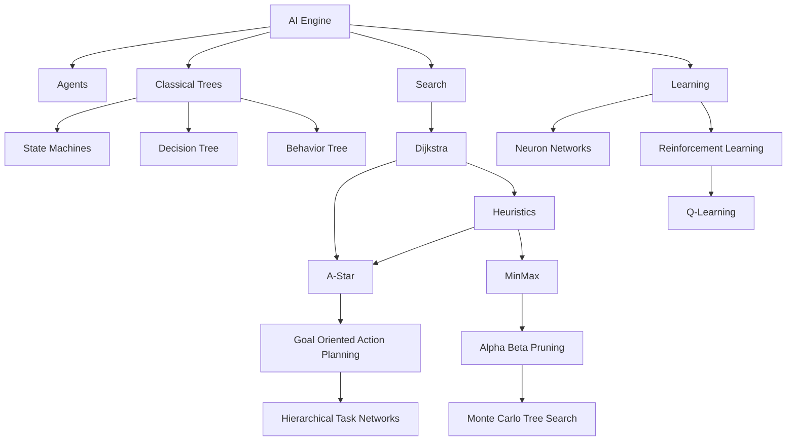
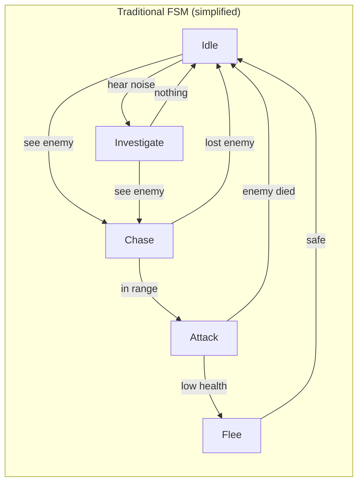
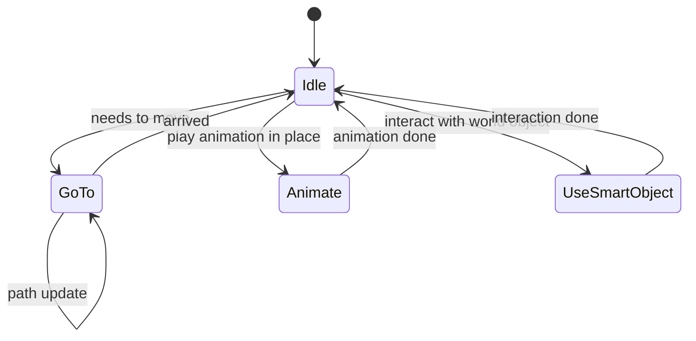
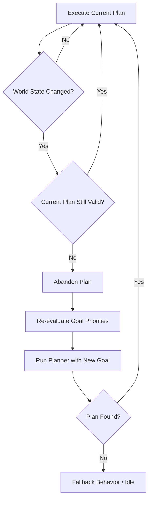
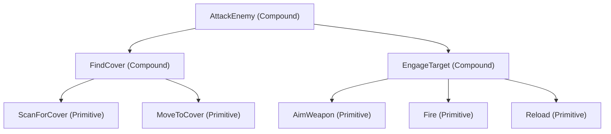

# Game AI Engine

An AI engine can be understood as a system that manages and executes AI algorithms in a game. It acts as the brain of
the game, controlling various aspects of AI behavior, decision-making, and interactions with the game world.

The most common classes of AI engines commonly used in game development are:

- **Tree based**: Behavior Trees, Decision trees and State Machines;
- **Search-Based Systems**: A-star, Goal Oriented Action Planning, Hierarchical Task Networks, MinMax, Alpha-Beta Pruning, Monte Carlo Tree Search
- **Learning Based Systems**: Neural Networks, Reinforcement Learning, Genetic Algorithms, Q-Learning



## 1. A\* Recap and Producer-Consumer Priority Strategy

::: note "Review"
For more details on A\* check the previous lecture.
:::

### 1.1. A\* Recap

A\* is a best-first search algorithm that uses a cost function f(n) = g(n) + h(n) where:

- **g(n)**: The cost from the start node to node n.
- **h(n)**: The heuristic estimate from node n to the goal.

A\* maintains two key sets:

- **Frontier (Open Set)**: A priority queue (producer-consumer style) of nodes to explore next. The node with the smallest f value is “consumed” next.
- **Visited (Closed Set)**: A set (hashtable) of nodes that have been evaluated, to avoid reprocessing.

The producer-consumer priority queue pattern works as follows:

- **Producer**: When expanding a node, you "produce" its neighbors by calculating their tentative `g` costs and pushing them into the priority queue.
- **Consumer**: The algorithm "consumes" (i.e., pops) the node with the lowest `f` value from the priority queue, processing it as the next candidate for path extension.

This pattern allows A\* to efficiently home in on the optimal path.

---

## 2. From Classical Planning to GOAP

### 2.1. STRIPS: The Theoretical Foundation (1971)

GOAP didn't emerge from thin air — it builds on decades of research in automated planning, starting with **STRIPS** (Stanford Research Institute Problem Solver), created by Richard Fikes and Nils Nilsson in 1971.

STRIPS formalizes a planning problem as a quadruple $\langle P, O, I, G \rangle$ where:

- $P$ — A set of **propositions** (boolean conditions about the world)
- $O$ — A set of **operators** (actions), each with preconditions and effects (add/delete lists)
- $I$ — The **initial state** (which propositions are true at the start)
- $G$ — The **goal state** (which propositions must be true for the plan to succeed)

An operator (action) in STRIPS is defined by three sets:

| Component         | Description                                     | Example (PickUpAmmo)                     |
| ----------------- | ----------------------------------------------- | ---------------------------------------- |
| **Preconditions** | What must be true before the action can execute | `nearAmmo = true`, `handsEmpty = true`   |
| **Add List**      | Propositions that become true after executing   | `hasAmmo = true`                         |
| **Delete List**   | Propositions that become false after executing  | `handsEmpty = false`, `nearAmmo = false` |

::: note "STRIPS Complexity"
Finding an optimal plan in STRIPS is **PSPACE-complete** — computationally very hard for large state spaces. This is why GOAP implementations use heuristics and limit the number of world state properties to keep planning tractable in real-time games (typically 30-60 ms budgets per frame).
:::

!!! quiz
{
"title": "STRIPS Formalism",
"question": "In the STRIPS planning formalism, what does the quadruple ⟨P, O, I, G⟩ represent?",
"options": ["Position, Orientation, Inventory, Goals", "Propositions, Operators, Initial state, Goal state", "Players, Objects, Items, Games", "Priority, Options, Input, Generation"],
"answers": ["Propositions, Operators, Initial state, Goal state"]
}
!!!

### 2.2. The FSM Scaling Problem

Before GOAP, game AI was overwhelmingly built with **Finite State Machines (FSMs)**. Each NPC behavior was a state (Patrol, Chase, Attack, Flee, etc.) with explicit transitions between them. This works well for simple characters but suffers from **combinatorial explosion**:



For games like **Halo 2** (2004), the combat AI FSM had around **40+ states** with hundreds of transitions. Every new behavior required editing transitions from _every other state_ that might need to reach it. Adding a single behavior like "use cover while reloading" could require touching dozens of transitions.

::: warning "The Scalability Wall"
Jeff Orkin, AI Lead on F.E.A.R. (2005), described the problem: prior to GOAP, the AI system for the game No One Lives Forever 2 used three layers of FSMs with approximately **80 states** and countless transitions. Adding new behaviors was extremely error-prone because the programmer had to consider all possible transitions to and from every existing state.
:::

### 2.3. Jeff Orkin's Insight: Planning as Search

Jeff Orkin's key innovation (published at GDC 2006 in "Three States and a Plan: The A.I. of F.E.A.R.") was to **replace the complexity of hand-authored state transitions with an automated planner**. Instead of hard-coding "if in state X and condition Y, go to state Z," each action simply declares:

- What it **needs** (preconditions)
- What it **produces** (effects)
- What it **costs**

The planner (using A\* search through action space) automatically discovers valid sequences at runtime. New behaviors can be added by simply defining a new action — the planner figures out where it fits.

This transformed the problem from $O(n^2)$ transition authoring (every state pair) to $O(n)$ action authoring (each action is independent).

---

## 3. Introduction to Goal-Oriented Action Planning (GOAP)

### 3.1. What is GOAP?

Goal-Oriented Action Planning (GOAP) is an AI decision-making strategy where an agent plans a sequence of actions to achieve one or more goals. Rather than merely moving through a grid (like in A\*), GOAP's planning engine considers:

::: warning "GOAP Components"
There are a few key components in GOAP to be aware of, but most of them are similar to A\*. We will deep dive into them later.
:::

- **Actions**: What the agent can do.
  - **Preconditions**: What conditions must be true for an action to be executed.
  - **Effects**: How the world (or agent’s state) changes after an action.
  - **Cost**: How "expensive" an action is to execute.
- **Goals**: What the agent wants to achieve.
  - **Conditions**: What must be true for a goal to be considered achieved.
  - **Priority**: How important the goal is relative to others, useful when you implement multiple goals or orchestration.
- **State**: The current state of the world and the agent.
  - **Key-Value Pairs**: Representing various conditions (e.g., health, ammo, enemy presence).
  - **State Transitions**: How the state changes as actions are executed
- **Planning**:
  - **Search Algorithm**: Similar to A\*, but with a focus on action sequences.
  - **Frontier** and **Visited**: Managing the search space of possible action sequences.
  - **Heuristic**: Estimating the cost from the current state to the goal.

The planner searches through the space of actions (and resulting states) to find a sequence that satisfies the goal conditions.

The planning problem (or solver) is similar to graph search (with nodes representing states and edges representing actions), many of the ideas from A\* (like heuristics and frontier management) can be re-used.

### 3.2. Forward vs Backward (Regressive) Planning

There are two fundamental approaches to searching through the action space:

**Forward (Progressive) Planning** starts from the current world state and applies actions forward until reaching the goal:

```
Current State → Action₁ → State₁ → Action₂ → State₂ → ... → Goal State
```

**Backward (Regressive) Planning** starts from the goal and works backward, asking "what action could produce this goal condition?" until reaching the current state:

```
Goal State ← Action_n ← ... ← Action₂ ← State₁ ← Action₁ ← Current State
```

::: tip "F.E.A.R. Uses Backward Planning"
Jeff Orkin's GOAP implementation in F.E.A.R. uses **regressive (backward) search**. The planner starts with the goal conditions and looks for actions whose _effects_ satisfy those conditions, then checks what _preconditions_ those actions need, and searches for actions to satisfy those — chaining backward until it reaches the current world state.

Backward planning is often more efficient because goals typically have fewer conditions than the full world state, so the search space starts narrow and expands — whereas forward planning starts with the full state and may explore many irrelevant action branches.
:::

!!! quiz
{
"title": "Planning Direction",
"question": "Why does F.E.A.R.'s GOAP implementation use backward (regressive) planning instead of forward planning?",
"options": ["It produces longer plans", "Goals have fewer conditions than the world state, so backward search starts narrower", "Forward planning cannot use A*", "Backward planning doesn't need heuristics"],
"answers": ["Goals have fewer conditions than the world state, so backward search starts narrower"]
}
!!!

### 3.3. Why Transform A\* into GOAP?

By transforming A\* into GOAP, you create a unified planning system where:

- **Pathfinding** is a **Special Case**: If the only action is "move" and the state includes position, then planning a path is equivalent to finding a route on a grid.
- **Generalized Planning**: The same system can plan complex behaviors (like "attack enemy" or "collect resource") by considering multiple actions and their interdependencies.

---

## 4. F.E.A.R. Case Study: Three States and a Plan

The 2005 FPS **F.E.A.R.** (First Encounter Assault Recon) by Monolith Productions is the landmark game that proved GOAP could work in a commercial AAA title. Its AI was widely praised as some of the best enemy AI in gaming history.

### 4.1. The Three-State FSM

Orkin's most elegant insight was that **all NPC behaviors could be reduced to just three animation states**:



| State              | Description                                           | Example                             |
| ------------------ | ----------------------------------------------------- | ----------------------------------- |
| **GoTo**           | Navigate to a position                                | Move to cover, approach enemy       |
| **Animate**        | Play an animation in place                            | Reload, throw grenade, death        |
| **UseSmartObject** | Interact with an object in the world that has context | Flip a table for cover, open a door |

Compare this to the **80+ states** in the previous game (No One Lives Forever 2). The three-state FSM handles _execution_ while GOAP handles _decision-making_ — a clean separation of concerns.

### 4.2. Goals and Actions in Practice

F.E.A.R. shipped with approximately **70 goals** and **120 actions**. Here's a simplified example of how a combat encounter works:

**Scenario**: An NPC spots the player while on patrol.

| Step | Component          | Details                                                          |
| ---- | ------------------ | ---------------------------------------------------------------- |
| 1    | **Sensor**         | Vision sensor detects player → sets `canSeeEnemy = true`         |
| 2    | **Goal Selection** | `KillEnemy` goal activates (highest priority when enemy visible) |
| 3    | **Planning**       | Planner searches backward from goal `{ enemyDead = true }`       |
| 4    | **Plan Found**     | `DrawWeapon → MoveToRange → Attack`                              |
| 5    | **Execution**      | FSM executes: Animate(draw) → GoTo(position) → Animate(shoot)    |

Some representative actions from F.E.A.R.:

| Action        | Preconditions                             | Effects               | Cost |
| ------------- | ----------------------------------------- | --------------------- | ---- |
| `DrawWeapon`  | `hasWeapon = true`                        | `weaponDrawn = true`  | 1    |
| `Attack`      | `weaponDrawn = true, enemyInRange = true` | `enemyDead = true`    | 3    |
| `MoveToRange` | `weaponDrawn = true`                      | `enemyInRange = true` | 2    |
| `Reload`      | `weaponDrawn = true, ammoInClip = false`  | `ammoInClip = true`   | 2    |
| `TakeCover`   | `coverAvailable = true`                   | `inCover = true`      | 2    |
| `FlankEnemy`  | `enemyInCover = true, weaponDrawn = true` | `enemyInRange = true` | 5    |

::: note "Cost Drives Behavior Variety"
Notice that `FlankEnemy` and `MoveToRange` both produce `enemyInRange = true`, but flanking costs 5 while direct approach costs 2. The planner normally chooses the cheaper option — but if `MoveToRange` has its preconditions blocked (e.g., the path is obstructed), the planner automatically discovers the flanking route. This creates emergent tactical variety without explicit scripting.
:::

### 4.3. The Squad Coordination Illusion

One of F.E.A.R.'s most impressive-seeming features is **squad coordination** — enemies appear to communicate, calling out "Flank left!" or "Cover me!" before executing coordinated tactics.

The surprising truth: **NPCs don't actually communicate with each other**. Each NPC plans independently using GOAP. The verbal commands are triggered _after_ the planning decision, not before:

1. NPC A's planner independently decides to flank (because direct approach is blocked)
2. NPC A triggers the "flanking!" voice line as a side effect
3. NPC B's planner independently decides to suppress (because it has line of sight)
4. NPC B triggers the "covering fire!" voice line

The _appearance_ of communication emerges naturally from each NPC independently reasoning about the same world state. Players perceived sophisticated squad tactics, but it was simply good individual planning producing coordinated-looking behavior.

!!! quiz
{
"title": "Squad Coordination",
"question": "How does squad coordination work in F.E.A.R.'s GOAP-based AI?",
"options": ["NPCs send messages to each other before acting", "A central coordinator assigns roles to each NPC", "Each NPC plans independently; verbal commands are triggered after planning decisions", "Squad behavior is entirely scripted"],
"answers": ["Each NPC plans independently; verbal commands are triggered after planning decisions"]
}
!!!

### 4.4. Runtime Replanning

A critical feature of GOAP is **replanning** — when the world changes, the current plan may become invalid, and the agent must generate a new plan on the fly.

In F.E.A.R., replanning is triggered when:

- A **precondition** for the next action in the plan is no longer satisfied (e.g., lost sight of enemy)
- The current **goal** is no longer the highest priority (e.g., took damage → `Survive` becomes higher priority than `KillEnemy`)
- The agent's **sensors** detect a significant state change (e.g., grenade nearby)



::: warning "Planning Budget"
In F.E.A.R., the planner typically runs in **under 1 ms** because the world state has a limited number of properties (~20-30 boolean/integer values) and the action set per NPC type is manageable (~15-25 actions). If planning ever exceeds the frame budget, the agent continues executing its current plan (or idles) until the next frame.
:::

---

## 5. Designing a GOAP Solver in C++

### 5.1. Data Structures

The planning engine will use a search algorithm (similar to A\*) where:

- Nodes: Represent states (including the accumulated effects of previous actions).
- Edges: Represent actions that transition from one state to the next.
- Heuristic: Estimates the cost from a given state to the goal.

### 5.2. C++ Implementation Overview

Below are simplified C++ classes to illustrate how you might begin evolving an A\* algorithm into a GOAP solver.

#### 5.2.1. State Representation

We can represent the state as a mapping of keys (strings) to values (booleans, ints, etc.). For simplicity, here we use a `std::unordered_map`.

```cpp
#include <string>
#include <unordered_map>

using State = std::unordered_map<std::string, int>;

// Utility function to check if a state satisfies a condition.
bool satisfies(const State& current, const State& conditions) {
    for (const auto& [key, value] : conditions) {
        auto it = current.find(key);
        if (it == current.end() || it->second != value)
            return false;
    }
    return true;
}
```

!!! quiz
{
"title": "State Representation",
"question": "In GOAP, how is a state typically represented?",
"options": ["A list of booleans", "A set of conditions without values", "Key-value pairs representing conditions and their values", "A single integer value"],
"answers": ["Key-value pairs representing conditions and their values"]
}
!!!

::: note "Variant"
Optionally, you could also use a `std::variant` from `C++17` to represent different types of values in the state instead of just `int`.

```c++
#include <variant>
#include <iostream>
#include <string>

int main() {
std::variant<int, double, std::string> var;
    // Assign different types to the variant
    var = 42;                        // Holds int
    std::cout << std::get<int>(var) << std::endl;

    var = 3.14;                      // Holds double
    std::cout << std::get<double>(var) << std::endl;

    var = "Hello, world!";           // Holds string
    std::cout << std::get<std::string>(var) << std::endl;

    return 0;
}
```

You can test the type before geting the value like:

```cpp
if (std::holds_alternative<int>(var)) {
    std::cout << "Variant holds an int: " << std::get<int>(var) << std::endl;
}
```

:::

#### 5.2.2. Action Class

An abstract base class for actions with preconditions, effects, and cost:

```cpp
#include <memory>
#include <vector>

class Action {
public:
    virtual ~Action() {}

    // Preconditions that must be satisfied for the action to be applicable.
    virtual State getPreconditions() const = 0;

    // Effects to be applied after the action is executed.
    virtual State getEffects() const = 0;

    // Cost of executing this action.
    virtual float getCost() const = 0;

    // A unique name/identifier for debugging purposes.
    virtual std::string getName() const = 0;

    // Check if the action is applicable in the current state.
    bool isApplicable(const State& state) const {
        return satisfies(state, getPreconditions());
    }
};
```

::: note "Resiliency"
It might be interesting to pass some context data to the action so it would be reasoning better about the effects.
:::

!!! quiz
{
"title": "Action Preconditions",
"question": "Which of the following best describes preconditions for actions in GOAP?",
"options": ["The visual effects of an action", "Requirements that must be true for an action to be executed", "The cost value of an action", "A random state generated by the system"],
"answers": ["Requirements that must be true for an action to be executed"]
}
!!!

#### 5.2.3. Derived Action Classes: Moving and Attacking

Now, let’s implement two simple derived actions.

::: tip "Moving Action"
For the pathfinding example, imagine that the state has keys like `x` and `y` for position. The Move action would have preconditions that the agent is at a certain location and effects that update the position.
:::

```cpp
#include <sstream>

class MoveAction : public Action {
private:
    int targetX;
    int targetY;
    float cost;

public:
    MoveAction(int tx, int ty, float cost = 1.0f)
        : targetX(tx), targetY(ty), cost(cost) {}

    State getPreconditions() const override {
        // For a move, you might have a precondition such as "isAdjacent" (or simply, the state must have a valid position)
        // Here we leave it empty to denote that move is always applicable if not obstructed.
        return State();
    }

    State getEffects() const override {
        // The effect is to set the new position.
        return State{{"x", targetX}, {"y", targetY}};
    }

    float getCost() const override {
        return cost;
    }

    std::string getName() const override {
        std::ostringstream oss;
        oss << "Move to (" << targetX << ", " << targetY << ")";
        return oss.str();
    }
};
```

::: tip "Attacking Action"
The Attack action might have preconditions like the target being within range and effects that change the health of the target.
:::

```cpp
class AttackAction : public Action {
private:
    std::string target;
    float cost;
public:
    AttackAction(const std::string& target, float cost = 2.0f)
        : target(target), cost(cost) {}

    State getPreconditions() const override {
        // Example: Must have an enemy in range.
        return State{{"enemyInRange", 1}};
    }

    State getEffects() const override {
        // Example: Effect might reduce enemy health. Here, "enemyHealth" is decreased.
        return State{{"enemyHealth", -10}}; // This indicates a change; in a full implementation you'd handle deltas.
    }

    float getCost() const override {
        return cost;
    }

    std::string getName() const override {
        return "Attack " + target;
    }
};
```

---

## 6. Evolving A\* into GOAP

### 6.1. From Pathfinding to Action Planning

In A\*, nodes are grid positions, and edges are moves between positions. In GOAP:

- Nodes: Represent world states (which may include position, health, enemy status, etc.).
- Edges: Represent actions (like Move or Attack) that transition one state to another.
- Cost: Each action’s cost contributes to the total cost, similar to how moving from one node to another adds a cost in A\*.
- Frontier and Visited: The same idea applies. We can maintain a priority queue (frontier) of partial plans (each associated with a state and accumulated cost) and a visited set to avoid cycles or redundant work.

!!! quiz
{
"title": "Action Cost",
"question": "Why is action cost important in GOAP?",
"options": ["To make actions more complex", "To avoid conflicts between actions", "To prioritize cheaper sequences of actions when planning", "To enforce random action selections"],
"answers": ["To prioritize cheaper sequences of actions when planning"]
}
!!!

### 6.2. GOAP Solver Outline

Here is a pseudocode/outline in C++ that shows how you might set up the planning loop:

```cpp
#include <queue>
#include <set>
#include <functional>

// A node in the planning search graph.
struct PlanNode {
    State state;
    float costSoFar;
    float estimatedTotalCost; // costSoFar + heuristic(state)
    std::vector<std::shared_ptr<Action>> actions; // sequence of actions that led here

    // For use in the priority queue.
    bool operator>(const PlanNode& other) const {
        return estimatedTotalCost > other.estimatedTotalCost;
    }
};

// Heuristic function to estimate remaining cost from a state to goal.
// For GOAP, we count the number of unsatisfied goal conditions.
// Each unsatisfied condition requires at least one action to resolve,
// so this is an admissible heuristic (never overestimates).
float heuristic(const State& current, const State& goal) {
    int unsatisfied = 0;
    for (const auto& [key, value] : goal) {
        auto it = current.find(key);
        if (it == current.end() || it->second != value)
            unsatisfied++;
    }
    return static_cast<float>(unsatisfied);
}

std::vector<std::shared_ptr<Action>> planGOAP(const State& start, const State& goal,
                                              const std::vector<std::shared_ptr<Action>>& availableActions) {
    std::priority_queue<PlanNode, std::vector<PlanNode>, std::greater<PlanNode>> frontier;
    std::set<State> visited; // You might need a custom comparator for State.

    // Start node.
    PlanNode startNode{start, 0.0f, heuristic(start, goal), {}};
    frontier.push(startNode);

    while (!frontier.empty()) {
        PlanNode current = frontier.top();
        frontier.pop();

        // Check if current state satisfies goal conditions.
        if (satisfies(current.state, goal)) {
            return current.actions;
        }

        // Mark state as visited (note: for complex states, use a proper hash/comparison).
        // visited.insert(current.state); // Pseudocode: ensure State is hashable.

        // Expand each available action.
        for (auto& action : availableActions) {
            if (action->isApplicable(current.state)) {
                // Compute new state by merging current state with the action’s effects.
                State newState = current.state;
                State effects = action->getEffects();
                for (const auto& [key, value] : effects) {
                    // In a full implementation, handle effects as deltas or absolute settings.
                    newState[key] = value;
                }
                float newCost = current.costSoFar + action->getCost();
                float estimated = newCost + heuristic(newState, goal);

                // Create new plan node.
                PlanNode next{newState, newCost, estimated, current.actions};
                next.actions.push_back(action);

                // Check if we’ve already visited this state.
                // if (visited.find(newState) == visited.end())
                {
                    frontier.push(next);
                }
            }
        }
    }
    // No plan found.
    return {};
}
```

::: note

In a full implementation you will need to implement:

- A proper hash and equality function for the State type.
- A mechanism to correctly merge effects (e.g., applying deltas versus overwriting values).
- Handling of more complex action preconditions/effects.
  :::

!!! quiz
{
"title": "Planner's Role",
"question": "What is the primary role of the GOAP planner?",
"options": ["Randomly select actions for agents", "Optimize heuristic functions only", "Find an optimal sequence of actions to achieve a goal", "Control the physics of the game environment"],
"answers": ["Find an optimal sequence of actions to achieve a goal"]
}
!!!

### 6.3. Specializing as a Path Finder

If you set up your MoveAction so that:

- Its preconditions verify that the target is a neighbor of the current position.
- Its effects update the "x" and "y" values in the state.

Then planning a series of MoveActions from the start to the goal becomes equivalent to A\* pathfinding on a grid. You’ve simply “generalized” the process to support additional actions (like AttackAction) by extending the same planning logic.

```cpp
#include <algorithm>
#include <cmath>
#include <iostream>
#include <queue>
#include <set>
#include <sstream>
#include <string>
#include <unordered_map>
#include <unordered_set>
#include <vector>
#include <memory>

// Using State as a collection of key-value pairs.
using State = std::unordered_map<std::string, int>;

//
// Utility function to check if a state satisfies a condition.
//
bool satisfies(const State &current, const State &conditions) {
    for (const auto &[key, value] : conditions) {
        auto it = current.find(key);
        if (it == current.end() || it->second != value)
            return false;
    }
    return true;
}

//
// Returns a canonical string representation of a State.
// This is used for the visited set to ensure we don't revisit states.
// This function sorts the keys so that the ordering is consistent.
//
std::string stateToString(const State &state) {
    std::vector<std::string> entries;
    for (const auto &kv : state) {
        entries.push_back(kv.first + ":" + std::to_string(kv.second));
    }
    std::sort(entries.begin(), entries.end());
    std::string result;
    for (const auto &entry : entries) {
        result += entry + ";";
    }
    return result;
}

//
// Base class for GOAP actions.
// Actions define preconditions, effects, cost, and a name.
// An overridable method applyEffects() is provided to allow more sophisticated
// merging of effects into the current state.
//
class Action {
public:
    virtual ~Action() {}

    // Returns the preconditions that must be satisfied for this action.
    virtual State getPreconditions() const = 0;

    // Returns the effects of the action.
    virtual State getEffects() const = 0;

    // Returns the cost of performing this action.
    virtual float getCost() const = 0;

    // Returns a human-readable name/identifier for debugging.
    virtual std::string getName() const = 0;

    // Check if the action is applicable given the current state.
    bool isApplicable(const State &state) const {
        return satisfies(state, getPreconditions());
    }

    // Apply the effects of the action on a given state.
    // By default, this implementation simply overwrites or adds key-value pairs.
    // For more complex behavior (e.g., applying delta changes), override this method.
    virtual void applyEffects(State &state) const {
        State effects = getEffects();
        for (const auto &[key, value] : effects) {
            state[key] = value;
        }
    }
};

//
// A sample MoveAction that can be used for pathfinding.
// This action changes the agent's position (represented by keys "x" and "y").
//
class MoveAction : public Action {
private:
    int targetX;
    int targetY;
    float cost;

public:
    MoveAction(int tx, int ty, float cost = 1.0f)
        : targetX(tx), targetY(ty), cost(cost) {}

    State getPreconditions() const override {
        // For a move, we might check that the target cell is adjacent
        // to the current position. For simplicity, we assume the move is always possible.
        return State();
    }

    State getEffects() const override {
        // The effect is to set the new position.
        return State{{"x", targetX}, {"y", targetY}};
    }

    float getCost() const override {
        return cost;
    }

    std::string getName() const override {
        std::ostringstream oss;
        oss << "Move to (" << targetX << ", " << targetY << ")";
        return oss.str();
    }
};

//
// A sample AttackAction that can be used in a combat scenario.
//
class AttackAction : public Action {
private:
    std::string target;
    float cost;
public:
    AttackAction(const std::string &target, float cost = 2.0f)
        : target(target), cost(cost) {}

    State getPreconditions() const override {
        // Example: Ensure an enemy is in range.
        return State{{"enemyInRange", 1}};
    }

    State getEffects() const override {
        // Example: Decrease enemy health.
        // In a full implementation, you might handle this as a delta.
        return State{{"enemyHealth", -10}};
    }

    float getCost() const override {
        return cost;
    }

    std::string getName() const override {
        return "Attack " + target;
    }
};

//
// Node structure used by the planning algorithm.
// Each node represents a state reached by executing a sequence of actions,
// along with the cumulative cost and estimated total cost.
//
struct PlanNode {
    State state;
    float costSoFar;
    float estimatedTotalCost; // costSoFar + heuristic(state)
    std::vector<std::shared_ptr<Action>> actions; // Sequence of actions that led here.

    // For use in the priority queue.
    bool operator>(const PlanNode &other) const {
        return estimatedTotalCost > other.estimatedTotalCost;
    }
};

//
// Heuristic function to estimate the remaining cost from the current state to the goal.
// Counts the number of unsatisfied goal conditions.
// This is admissible: each unsatisfied condition needs at least one action.
//
float heuristic(const State &current, const State &goal) {
    int unsatisfied = 0;
    for (const auto &[key, value] : goal) {
        auto it = current.find(key);
        if (it == current.end() || it->second != value)
            unsatisfied++;
    }
    return static_cast<float>(unsatisfied);
}

//
// The planning function that implements a GOAP search algorithm using a producer-consumer pattern.
// The same function can be used as a pathfinder when the only actions are MoveActions.
//
std::vector<std::shared_ptr<Action>> planGOAP(
    const State &start,
    const State &goal,
    const std::vector<std::shared_ptr<Action>> &availableActions) {

    // Priority queue for nodes to be expanded.
    std::priority_queue<PlanNode, std::vector<PlanNode>, std::greater<PlanNode>> frontier;

    // Use an unordered_set of state strings to track visited states.
    std::unordered_set<std::string> visited;

    // Initialize the start node.
    PlanNode startNode{start, 0.0f, heuristic(start, goal), {}};
    frontier.push(startNode);

    while (!frontier.empty()) {
        PlanNode current = frontier.top();
        frontier.pop();

        // If current state satisfies the goal conditions, return the action sequence.
        if (satisfies(current.state, goal)) {
            return current.actions;
        }

        // Generate a unique key for the current state.
        std::string currentKey = stateToString(current.state);
        if (visited.find(currentKey) != visited.end()) {
            continue; // Skip already visited states.
        }
        visited.insert(currentKey);

        // Expand each available action.
        for (const auto &action : availableActions) {
            if (action->isApplicable(current.state)) {
                // Compute new state by applying the action's effects.
                State newState = current.state;
                action->applyEffects(newState);

                float newCost = current.costSoFar + action->getCost();
                float estimated = newCost + heuristic(newState, goal);

                // Create a new plan node.
                PlanNode next{newState, newCost, estimated, current.actions};
                next.actions.push_back(action);

                // Only push if this state hasn't been visited.
                std::string newStateKey = stateToString(newState);
                if (visited.find(newStateKey) == visited.end()) {
                    frontier.push(next);
                }
            }
        }
    }
    // If no plan is found, return an empty sequence.
    return {};
}

//
// Example usage: A combat scenario similar to F.E.A.R.
// The NPC starts without a weapon drawn, out of range, and must kill the enemy.
//
int main() {
    // World state: NPC has a weapon but hasn't drawn it, enemy is alive and not in range.
    State start{
        {"hasWeapon", 1},
        {"weaponDrawn", 0},
        {"enemyInRange", 0},
        {"enemyDead", 0}
    };

    // Goal: the enemy must be dead.
    State goal{{"enemyDead", 1}};

    // Define the available actions (like in the F.E.A.R. action table).
    // The planner will figure out the correct sequence automatically.
    std::vector<std::shared_ptr<Action>> actions;
    actions.push_back(std::make_shared<MoveAction>(1, 0));     // Move (also sets enemyInRange as side effect here)
    actions.push_back(std::make_shared<AttackAction>("Enemy")); // Attack when in range

    // We need a DrawWeapon and MoveToRange action for a proper demo.
    // For simplicity, let's define them inline via lambdas or just show the plan:
    auto plan = planGOAP(start, goal, actions);

    std::cout << "Plan found (" << plan.size() << " actions):" << std::endl;
    for (size_t i = 0; i < plan.size(); i++) {
        std::cout << "  Step " << (i + 1) << ": " << plan[i]->getName() << std::endl;
    }

    if (plan.empty()) {
        std::cout << "No plan found!" << std::endl;
    }

    return 0;
}
```

---

## 7. GOAP vs Other AI Architectures

Understanding when to use GOAP versus simpler approaches is as important as understanding how it works.

| Aspect                | Finite State Machine (FSM)          | Behavior Tree (BT)                | GOAP                                         |
| --------------------- | ----------------------------------- | --------------------------------- | -------------------------------------------- |
| **Authoring**         | Hand-craft every state & transition | Hand-craft tree structure         | Define actions independently; planner chains |
| **Adding behaviors**  | $O(n^2)$ — touch many transitions   | $O(\log n)$ — add subtree         | $O(1)$ — add one action                      |
| **Runtime cost**      | Very cheap (table lookup)           | Cheap (tree traversal)            | Moderate (A\* search per plan)               |
| **Emergent behavior** | None — fully prescribed             | Limited — depends on tree design  | High — planner discovers novel sequences     |
| **Debugging**         | Easy — trace state transitions      | Medium — trace tree traversal     | Harder — inspect planner search space        |
| **Best for**          | Simple NPCs, UI states              | Complex but predictable behaviors | Adaptive NPCs needing tactical variety       |
| **Real examples**     | Pac-Man ghosts, early Doom          | Halo 2/3, Unreal Engine AI        | F.E.A.R., Shadow of Mordor, Tomb Raider      |

::: tip "Rule of Thumb"
Use **FSMs** when you have <10 behaviors with clear transitions. Use **Behavior Trees** when you need structured, predictable complex behaviors. Use **GOAP** when you need NPCs that adapt to changing conditions and discover novel action sequences.

Many games combine approaches: F.E.A.R. uses a simple 3-state FSM for _animation execution_ while GOAP handles _decision-making_. The two complement each other.
:::

!!! quiz
{
"title": "Architecture Comparison",
"question": "Which advantage does GOAP have over traditional FSMs when adding new NPC behaviors?",
"options": ["GOAP is always faster at runtime", "New actions can be added independently without modifying existing transitions", "GOAP uses less memory", "FSMs cannot handle combat scenarios"],
"answers": ["New actions can be added independently without modifying existing transitions"]
}
!!!

---

## 8. Beyond GOAP: Hierarchical Task Networks (HTN)

**Hierarchical Task Networks** extend the planning paradigm by decomposing high-level tasks into subtasks. Where GOAP works at a single level (flat actions), HTN allows defining compound tasks that break down into simpler ones.



HTN was used in **Killzone 2** (2009) and subsequent titles. The key trade-off:

- **GOAP**: More flexible, discovers plans at runtime, but search can be expensive for large action sets
- **HTN**: More structured, decomposition is efficient, but requires hand-authored task hierarchies

Both build on the same foundations (STRIPS, A\*) that you've learned in this lecture. HTN is covered in the optional readings for those interested.

---

## Summary

| Concept             | Key Takeaway                                                                 |
| ------------------- | ---------------------------------------------------------------------------- |
| STRIPS              | Planning formalism $\langle P, O, I, G \rangle$ — the theoretical foundation |
| GOAP                | A\* search through action space instead of physical space                    |
| Actions             | Defined by preconditions, effects, and cost — independently authored         |
| F.E.A.R.            | Proved GOAP works in production: 70 goals, 120 actions, 3-state FSM          |
| Heuristic           | Count unsatisfied goal conditions — admissible and works for any domain      |
| Replanning          | When conditions change, abandon plan and re-plan immediately                 |
| Forward vs Backward | Backward (regressive) planning often more efficient for GOAP                 |
| Emergent behavior   | Squad tactics in F.E.A.R. emerge from independent planning, not scripting    |
