# Multi-Agent Coordination

## From Individual Planning to Squad Tactics

---

## Agenda

1. From Single-Agent to Multi-Agent (The Coordination Problem)
2. Communication Patterns: Observer, Event Queue, Pub/Sub
3. Blackboard Architecture (HEARSAY-II → Game AI)
4. Case Study: Killzone 2/3 Hierarchical AI
5. Token Systems & the Kung-Fu Circle
6. Companion AI: The Last of Us
7. F.E.A.R. Revisited: The Illusion of Communication
8. C++ Implementation & Architecture Comparison

---

## From Single-Agent to Multi-Agent

---

### GOAP Recap

Last week: each agent **independently** plans using A\* through action space.

```
World State:    { weaponLoaded: false, enemyVisible: true }
Goal:           { enemyDead: true }
Planner finds:  TakeCover → Reload → Aim → Shoot
```

This works for **one** NPC. But what happens with **eight** identical NPCs targeting the same player?

---

### The Coordination Problem

Without coordination, every NPC's planner independently discovers the same "optimal" plan.

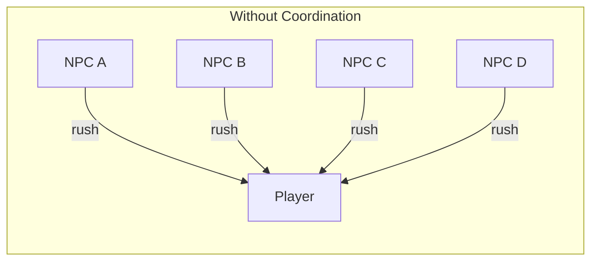

Result: all four charge at once, arriving in a clump. Robotic and tactically absurd.

---

### What We Want Instead

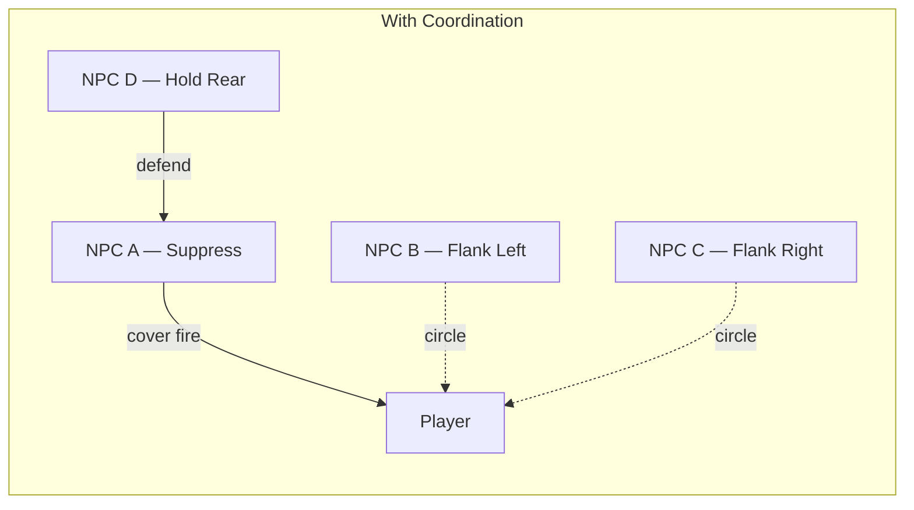

Each NPC plays a **different role** — the squad looks intelligent and tactical.

---

### Formalizing the Problem

Each agent $i$ has a planning function that takes the world state $S$ and produces an action:

$$a_i = \pi_i(S)$$

If all agents have the same planner and the same world state:

$$a_1 = a_2 = \ldots = a_n$$

The coordination problem: introduce mechanisms — **shared state**, **communication**, **external constraints** — so that $\pi_i(S) \neq \pi_j(S)$ even when agents are identical.

---

### What Is a Multi-Agent System?

A **Multi-Agent System (MAS)** is a collection of autonomous agents that:

1. **Operate in a shared environment** — they perceive the same world
2. **Have local views** — no single agent sees everything
3. **Interact** — through communication, shared resources, or environmental effects
4. **Coordinate** — to achieve collective goals

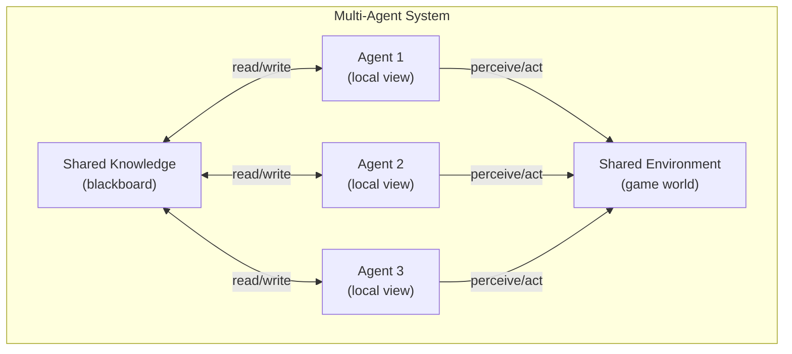

> Game NPCs don't negotiate or model each other's mental states. They share knowledge through **data structures** (blackboards), follow **role assignments** from coordinators, and use **resource constraints** (tokens) to prevent conflicts. Same coordination outcomes, much simpler mechanisms.

---

### Three Approaches to Coordination

| Strategy                | Description                                        | Example             | Trade-off                               |
| ----------------------- | -------------------------------------------------- | ------------------- | --------------------------------------- |
| **Centralized**         | Single commander decides for all                   | RTS army controller | Max control, min emergence              |
| **Decentralized**       | Each agent plans independently + reads shared info | F.E.A.R.            | Max emergence, min control              |
| **Hybrid/Hierarchical** | High-level coordination + low-level autonomy       | Killzone 2/3        | Control over "what," emergence in "how" |

- **Centralized** is predictable but brittle — what happens when agents die?
- **Decentralized** produces emergence but can't guarantee any particular tactic
- **Hybrid** is the sweet spot: designers control objectives and roles; agents discover how to execute

Most shipped games use the **hybrid** approach.

---

## Communication Patterns

---

### The Decoupling Spectrum

Before coordinating, agents need to **share information**. Three patterns form a spectrum:

| Pattern         | Decouples Who? | Decouples When? | Filtering? | Best For                      |
| --------------- | -------------- | --------------- | ---------- | ----------------------------- |
| **Observer**    | ✓              | ✗               | ✗          | Simple 1-to-many notification |
| **Event Queue** | ✓              | ✓               | ✗          | Time-decoupled communication  |
| **Pub/Sub**     | ✓              | ✓ (optional)    | ✓          | Topic-filtered messaging      |

Most game AI systems use a **combination**: Observer for immediate low-latency signals (damage), Event Queue for budgeted processing, Pub/Sub for high-level tactical communication.

---

### Observer Pattern

The subject maintains a list of observers and notifies them **synchronously** when state changes:

```cpp
class Observer {
public:
    virtual ~Observer() {}
    virtual void onNotify(const Entity& entity, Event event) = 0;
};

class Subject {
    std::vector<Observer*> observers;
public:
    void addObserver(Observer* obs)    { observers.push_back(obs); }
    void removeObserver(Observer* obs) {
        observers.erase(std::remove(observers.begin(),
                                     observers.end(), obs),
                        observers.end());
    }
protected:
    void notify(const Entity& entity, Event event) {
        for (auto* obs : observers)
            obs->onNotify(entity, event);
    }
};
```

**Use case**: Physics collision → AI "took damage" notification. NPC dies → nearby NPCs receive "ally down."

---

### Observer: Concrete Example

An achievement system that observes entity events — no coupling to entity internals:

```cpp
enum class Event { ENTITY_DIED, ENTITY_DAMAGED, ENTITY_SPOTTED, ENTITY_FLED };

class AchievementSystem : public Observer {
public:
    void onNotify(const Entity& entity, Event event) override {
        switch (event) {
            case Event::ENTITY_DIED:
                if (entity.isEnemy()) {
                    enemiesKilled++;
                    if (enemiesKilled >= 100) unlock("centurion");
                }
                break;
            case Event::ENTITY_FLED:
                unlock("intimidator");
                break;
            default: break;
        }
    }
private:
    int enemiesKilled = 0;
    void unlock(const std::string& id) { /* ... */ }
};
```

You can add new observers **without modifying the entity code**. That's the power of decoupling.

---

### The Lapsed Listener Problem

If an observer is destroyed without unregistering, the subject holds a **dangling pointer**:

```cpp
// BUG: Classic lapsed listener
Subject* perception = getPerceptionSystem();
{
    SquadObserver* obs = new SquadObserver();
    perception->addObserver(obs);
    // ... obs does useful work ...
    delete obs;  // OOPS: forgot perception->removeObserver(obs)
}
// Next notify() → dereferences dangling pointer → CRASH
```

In games with NPCs spawning/despawning constantly, this is a **real and common bug**. Solutions:

| Solution            | How                                                         | Trade-off                      |
| ------------------- | ----------------------------------------------------------- | ------------------------------ |
| **RAII**            | Observer unregisters in its destructor                      | Requires destructor discipline |
| **Weak references** | Subject holds `std::weak_ptr<Observer>`, skips expired refs | Extra indirection cost         |
| **Event queues**    | Side-step the problem — decouple in time entirely           | Introduces latency             |

---

### Event Queue Pattern

The **Event Queue** decouples communication in **time** — sender enqueues and returns immediately. A processor handles messages later:

```cpp
struct AIEvent {
    enum Type { ENEMY_SPOTTED, ALLY_DOWN, POSITION_COMPROMISED, COVER_AVAILABLE };
    Type type;
    int senderId;
    Vec3 position;
    float timestamp;
};

class EventQueue {
    static const int MAX_EVENTS = 256;
    AIEvent events[MAX_EVENTS];  // fixed-size ring buffer
    int head = 0;
    int tail = 0;
public:
    void enqueue(const AIEvent& event) {
        events[tail] = event;
        tail = (tail + 1) % MAX_EVENTS;
        if (tail == head) head = (head + 1) % MAX_EVENTS; // overwrite oldest
    }
    AIEvent dequeue() {
        AIEvent e = events[head];
        head = (head + 1) % MAX_EVENTS;
        return e;
    }
    bool isEmpty() const { return head == tail; }
};
```

**Ring buffer** — no dynamic allocation, $O(1)$ per operation. From Robert Nystrom's _Game Programming Patterns_.

---

### Budget-Capped Processing

The dispatcher processes events each frame, but **caps how many** to prevent spikes (e.g. grenade → 20 "DAMAGED" events at once):

```cpp
class AIEventDispatcher {
    EventQueue& queue;
public:
    AIEventDispatcher(EventQueue& q) : queue(q) {}

    void processEvents(int maxEvents = 10) {
        int processed = 0;
        while (!queue.isEmpty() && processed < maxEvents) {
            AIEvent event = queue.dequeue();
            dispatch(event);
            processed++;
        }
        // Remaining events wait until next frame
    }
};
```

This spreads heavy event loads across multiple frames — **no frame spikes**.

---

### Event Aggregation

Collapse duplicate events. Three NPCs spot the same enemy within 100ms:

| Raw Events                               | Aggregated Event                                |
| ---------------------------------------- | ----------------------------------------------- |
| NPC_1: ENEMY_SPOTTED (45, 0, 12) t=0.0s  | ↓                                               |
| NPC_3: ENEMY_SPOTTED (44, 0, 13) t=0.05s | ENEMY_CONFIRMED (44.5, 0, 12.5) confidence=HIGH |
| NPC_5: ENEMY_SPOTTED (46, 0, 11) t=0.08s | ↓                                               |

Fewer events downstream, and the aggregated event carries **more useful information** than any individual raw event (average position + confidence level).

---

### Publish-Subscribe

Agents **subscribe** to specific event types. The broker only delivers relevant events:

```cpp
class EventBroker {
    std::unordered_map<std::string, std::vector<Callback>> subscribers;
public:
    void subscribe(const std::string& topic, Callback cb) {
        subscribers[topic].push_back(cb);
    }
    void unsubscribe(const std::string& topic, int agentId) {
        auto& subs = subscribers[topic];
        subs.erase(std::remove_if(subs.begin(), subs.end(),
            [agentId](const auto& cb) { return cb.agentId == agentId; }),
            subs.end());
    }
    void publish(const std::string& topic, const Event& event) {
        for (auto& cb : subscribers[topic])
            cb(event);
    }
};
```

A medic subscribes to `"ally_wounded"` — doesn't receive `"ammo_found"` at all. The broker **filters** automatically.

---

### Pub/Sub Squad Scenario Trace

A scout spots an enemy. Trace how the event flows:

| Step | What Happens                                                                    |
| ---- | ------------------------------------------------------------------------------- |
| 1    | Scout calls `publish("enemy_spotted", {pos=(30,0,20), threat=HIGH})`            |
| 2    | Broker looks up `"enemy_spotted"` subscribers → finds Officer + Assault NPCs    |
| 3    | Officer's callback fires → officer posts new roles to blackboard                |
| 4    | Medic (subscribed to `"ally_wounded"` only) receives **nothing** — filtered out |

The scout doesn't know who receives the event. The medic doesn't get irrelevant noise. **Zero coupling** between agents.

---

## Blackboard Architecture

---

### Historical Origin: HEARSAY-II (1970s)

The blackboard was originally developed for the **HEARSAY-II** speech recognition system at Carnegie Mellon University.

The problem was strikingly similar to game AI: multiple specialized algorithms (phoneme detection, word boundary detection, syntax, semantics) needed to contribute partial results to a shared solution **without knowing about each other**.

The metaphor maps perfectly to game AI:

- Forensic analyst writes: "Fingerprints match suspect A."
- Behavioral profiler reads that, writes: "Suspect A would flee east."
- Field detective reads that, writes: "Cover the eastern exits."
- No specialist knows who the others are — the solution **emerges** from interaction with shared data.

---

### Three Components

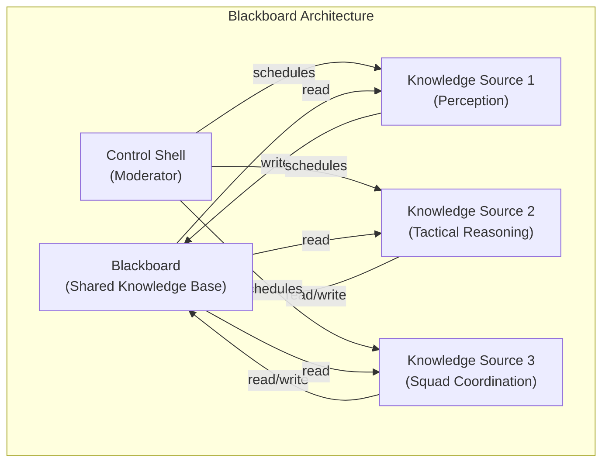

| Component             | Role                                                          | Game AI Example                                  |
| --------------------- | ------------------------------------------------------------- | ------------------------------------------------ |
| **Blackboard**        | Shared data store — the "common knowledge" of the agent group | Enemy positions, cover locations, squad orders   |
| **Knowledge Sources** | Specialist modules that read from and write to the blackboard | Perception system, pathfinder, tactical reasoner |
| **Control Shell**     | Moderator that decides which knowledge source runs next       | Priority scheduler, round-robin, event-triggered |

---

### Blackboard Layers

The blackboard is organized into **layers** by information type, preventing knowledge sources from trampling each other's data:

| Layer             | Contents                                     | Written By              | Read By                        |
| ----------------- | -------------------------------------------- | ----------------------- | ------------------------------ |
| **Perception**    | Enemy positions, sounds heard, objects seen  | Perception KS           | All combat KS                  |
| **Tactical**      | Cover positions, danger zones, sight lines   | Environment analysis KS | Pathfinder, tactical reasoning |
| **Squad**         | Role assignments, formation data, objectives | Tactical coordinator    | Individual agents              |
| **Communication** | Voice line requests, gesture triggers        | Any KS                  | Audio system, animation system |

Layers can be **cleared independently** — e.g., clear the perception layer when the squad moves to a new area.

---

### Blackboard Implementation

```cpp
using BBValue = std::variant<int, float, bool, Vec3, std::string>;

class Blackboard {
    struct Entry {
        BBValue value;
        float timestamp;     // when this knowledge was posted
        int sourceId;        // which agent posted it
    };
    std::unordered_map<std::string, Entry> data;

public:
    void post(const std::string& key, const BBValue& value,
              int sourceId, float time) {
        data[key] = Entry{value, time, sourceId};
    }

    // Query with staleness check — ignore data older than maxAge
    std::optional<BBValue> query(const std::string& key,
                                 float currentTime, float maxAge) const {
        auto it = data.find(key);
        if (it != data.end() &&
            (currentTime - it->second.timestamp) <= maxAge)
            return it->second.value;
        return std::nullopt;  // stale or missing
    }

    void purgeStale(float currentTime, float maxAge) {
        for (auto it = data.begin(); it != data.end(); )
            if ((currentTime - it->second.timestamp) > maxAge)
                it = data.erase(it);
            else ++it;
    }
};
```

**Staleness is critical**: If NPC spotted an enemy 10 seconds ago but hasn't seen them since, that data is **stale** — investigate last known position, don't charge blindly.

---

### Knowledge Source Lifecycle

Each knowledge source is a self-contained module following 5 steps:

```
Trigger:   New entry in Perception layer with type ENEMY_SPOTTED
Read:      All ENEMY_SPOTTED entries from Perception layer
Process:   Count enemies, assess weapons, calculate threat level
Write:     THREAT_LEVEL = HIGH, RECOMMENDED_STANCE = DEFENSIVE
           → written to Tactical layer
```

Example — **Threat Assessment KS**: reads enemy sighting data from the perception layer, analyzes it, writes a threat level to the tactical layer. The squad coordinator KS reads the threat level and adjusts roles accordingly. No knowledge source talks to another — **all communication through the board**.

---

### Control Shell Scheduling Strategies

The control shell decides **which knowledge source runs next**:

| Strategy            | How It Works                                                 | Best For                                      |
| ------------------- | ------------------------------------------------------------ | --------------------------------------------- |
| **Round-Robin**     | Run each KS in fixed order, every tick                       | Simple systems, predictable CPU budget        |
| **Priority-Based**  | Run the highest-priority KS whose trigger conditions are met | Complex systems with many KS                  |
| **Event-Triggered** | Run a KS only when the blackboard data it monitors changes   | Responsive systems, low CPU when idle         |
| **Opportunistic**   | Run the KS estimated to make the most progress               | Most sophisticated, highest coordination cost |

In game AI, **event-triggered** is most common: Perception KS runs when sensor data arrives → Tactical KS runs when perception layer changes → Squad KS runs when tactical layer changes. Each KS runs **only when it has new data**.

---

### Why Not Just Global Variables?

Both hold shared state. The difference:

| Aspect              | Global Variables     | Blackboard                                 |
| ------------------- | -------------------- | ------------------------------------------ |
| **Access control**  | None — anyone writes | Control shell moderates access             |
| **Structure**       | Flat namespace       | Layered by information type                |
| **Timestamps**      | No                   | Yes — enables staleness checks             |
| **Source tracking** | No                   | Yes — know who posted what                 |
| **Race conditions** | Likely               | Prevented by scheduling                    |
| **Validation**      | None                 | Blackboard can validate/transform on write |

> It's the difference between a carefully moderated meeting and everyone shouting into the void.

---

### Blackboard vs Event Queue

Both decouple agents, but they solve different problems:

| Aspect             | Blackboard                            | Event Queue                                |
| ------------------ | ------------------------------------- | ------------------------------------------ |
| **Metaphor**       | Shared whiteboard that persists       | Mailbox that's emptied after reading       |
| **Data lifetime**  | Persists until overwritten or purged  | Consumed on read                           |
| **Access pattern** | Pull (agents query when they need it) | Push (events delivered to handlers)        |
| **Best for**       | Shared state (enemy positions, roles) | Discrete events (enemy spotted, ally died) |

**The rule**: Use a blackboard for **persistent shared state**, an event queue for **discrete notifications**. Most games use **both**.

---

## Case Study: Killzone 2/3

---

### The Three-Layer Hierarchy

Guerrilla Games' Killzone 2/3 managed **24 multiplayer bots** with three layers:

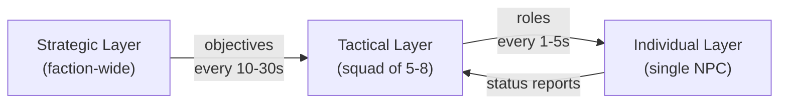

| Layer          | Scope          | Decides                           | Update Rate | Complexity        |
| -------------- | -------------- | --------------------------------- | ----------- | ----------------- |
| **Strategic**  | Entire faction | Which objectives to attack/defend | 10-30 sec   | $O(m)$ objectives |
| **Tactical**   | Squad (5-8)    | Roles: flanker, suppressor, rush  | 1-5 sec     | $O(n)$ agents     |
| **Individual** | Single NPC     | Movement, aiming, cover use       | Per frame   | Per agent         |

Each layer runs at its own **time scale** — the strategic layer never micromanages individual agents.

---

### Strategic Layer: Objective Scoring

The strategic layer scores each objective and assigns squads:

```cpp
void StrategicLayer::assignSquads() {
    for (auto& objective : objectives) {
        float score = 0.0f;
        score += objective.tacticalValue * 0.4f;
        score += objective.vulnerability * 0.3f;
        score += (1.0f - objective.distanceToFrontLine) * 0.2f;
        score += objective.resourceValue * 0.1f;
        objective.priority = score;
    }
    std::sort(objectives.begin(), objectives.end(),
              [](const auto& a, const auto& b) {
                  return a.priority > b.priority;
              });
    // Assign available squads to highest-priority objectives
    for (auto* squad : availableSquads)
        squad->assignObjective(objectives[nextObjectiveIndex++]);
}
```

This runs every **10-30 seconds** — strategic decisions don't need per-frame precision.

---

### Tactical Layer: Role Assignment

The tactical layer assigns roles within each squad:

| Role           | Behavior                         | Token Needed | Priority Assignment                    |
| -------------- | -------------------------------- | ------------ | -------------------------------------- |
| **Suppressor** | Hold position, lay covering fire | ATTACK       | Agent with best line-of-sight to enemy |
| **Flanker**    | Circle to attack from the side   | FLANK        | Agent closest to viable flank route    |
| **Rusher**     | Charge directly at enemy         | ATTACK       | Agent with highest health              |
| **Defender**   | Hold rear / protect objective    | None         | Agent nearest to the defended position |
| **Scout**      | Recon ahead of the squad         | None         | Agent with best perception range       |

Roles aren't random — the tactical layer uses a **fitness function** to match the best agent to each role:

$$\text{fitness}(a, r) = w_{\text{dist}} \cdot \text{proximity}(a, r) + w_{\text{hp}} \cdot \text{health}(a) + w_{\text{los}} \cdot \text{sightline}(a, r)$$

---

### Tactical Decision Flowchart

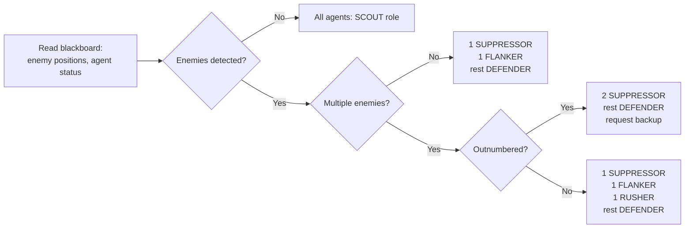

---

### Combat Scenario Walkthrough (6 Time Steps)

| Time  | Strategic                       | Tactical                                        | Individual                          |
| ----- | ------------------------------- | ----------------------------------------------- | ----------------------------------- |
| t=0s  | "Assault Objective Alpha"       | Assign: 2 suppress, 1 flank, 1 rush             | Soldiers move to assigned positions |
| t=2s  | (no change)                     | Flanker reaches flank route                     | Flanker begins flanking maneuver    |
| t=4s  | (no change)                     | Suppressors engaging                            | Rusher advances under cover fire    |
| t=6s  | (no change)                     | **Rusher killed** → reassign defender as rusher | New rusher inherits push            |
| t=10s | (no change)                     | Flanker in position, opens fire                 | Cross-fire established on target    |
| t=15s | "Alpha captured → move to Beta" | Regroup, assign new roles for transit           | All agents pathfind to Beta         |

Notice: when the rusher died at t=6s, the tactical layer **automatically** promoted the defender. No scripting needed.

---

## Token Systems & the Kung-Fu Circle

---

### The Kung-Fu Circle Problem

In martial arts movies, enemies politely attack **one at a time**. In games without coordination, the opposite — **everyone attacks simultaneously**.

| Without Tokens                             | With Tokens                                    |
| ------------------------------------------ | ---------------------------------------------- |
| 8 NPCs all rush the player at once         | 2 attack while 6 wait for their turn           |
| Player overwhelmed instantly = frustrating | Manageable waves of attackers = challenging    |
| Identical behavior = robotic               | Varied behavior (some attack, some reposition) |

Neither extreme is realistic. Token systems find the **middle ground**.

---

### Token Pool Implementation

```cpp
class TokenPool {
public:
    enum TokenType { ATTACK, FLANK, SPECIAL, TOKEN_COUNT };

private:
    struct TokenSlot {
        int maxTokens;       // maximum concurrent holders
        int currentHolders;  // how many agents currently hold this token
        float cooldownTime;  // seconds before returned token is available
        float lastReturnTime;
    };
    TokenSlot slots[TOKEN_COUNT];

public:
    TokenPool() {
        slots[ATTACK]  = {2, 0, 0.5f, -999.0f};
        slots[FLANK]   = {1, 0, 1.0f, -999.0f};
        slots[SPECIAL] = {1, 0, 2.0f, -999.0f};
    }

    bool requestToken(TokenType type) {
        auto& s = slots[type];
        if (s.currentHolders < s.maxTokens) {
            s.currentHolders++;
            return true;   // Granted
        }
        return false;      // Denied — wait your turn
    }

    void returnToken(TokenType type, float currentTime) {
        auto& s = slots[type];
        if (s.currentHolders > 0) {
            s.currentHolders--;
            s.lastReturnTime = currentTime;
        }
    }

    // Difficulty scaling: reconfigure at runtime
    void configure(TokenType type, int maxTokens, float cooldown) {
        slots[type].maxTokens = maxTokens;
        slots[type].cooldownTime = cooldown;
    }
};
```

---

### Token Lifecycle

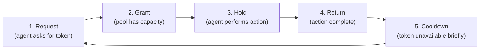

The **cooldown** after return prevents rapid-fire repeated actions — the same agent can't immediately re-request.

Games using tokens: **Batman Arkham** (melee tokens), **Halo** (attack slots), **Assassin's Creed** (attack/alert tokens), **F.E.A.R.** (attack + speak slots).

---

### Time-Slot Scheduling

Instead of "who can attack," schedule **when** agents attack:

```cpp
class TimeSlotScheduler {
    float slotDuration;    // e.g. 0.5 seconds per slot
    float staggerDelay;    // delay between consecutive slots
    int currentSlot = 0;
    int maxActiveSlots;

public:
    TimeSlotScheduler(float duration, float stagger, int maxSlots)
        : slotDuration(duration), staggerDelay(stagger),
          maxActiveSlots(maxSlots) {}

    bool requestSlot(int agentId, float currentTime) {
        if (currentSlot >= maxActiveSlots) return false;
        float scheduledTime = currentTime + (currentSlot * staggerDelay);
        currentSlot++;
        return true;  // Agent attacks at scheduledTime
    }

    void releaseSlot() { if (currentSlot > 0) currentSlot--; }
};
```

The `staggerDelay` creates **temporal spread**: attacks arrive 0.5s apart instead of simultaneously. More cinematic, more readable for the player.

---

### Difficulty Scaling with Tokens

Same AI code, different token configuration:

| Difficulty  | Attack Tokens | Flank Tokens | Attack Cooldown | Player Experience               |
| ----------- | ------------- | ------------ | --------------- | ------------------------------- |
| **Easy**    | 1             | 0            | 2.0s            | One attacker at a time          |
| **Normal**  | 2             | 1            | 1.0s            | Balanced pressure               |
| **Hard**    | 3             | 2            | 0.5s            | Aggressive coordinated assaults |
| **Veteran** | 4             | 2            | 0.3s            | Near-simultaneous attacks       |

No per-difficulty AI code. A difficulty manager just calls:

```cpp
tokens.configure(TokenPool::ATTACK, 1, 2.0f);  // Easy
tokens.configure(TokenPool::ATTACK, 4, 0.3f);  // Veteran
```

The **identical AI code** produces dramatically different difficulty experiences.

---

## Companion AI: The Last of Us

---

### A Different Kind of Multi-Agent

| Dimension         | Enemy Coordination            | Companion AI                               |
| ----------------- | ----------------------------- | ------------------------------------------ |
| **Goal**          | Defeat the player             | Help the player succeed                    |
| **Leader**        | AI squad leader (predictable) | Human player (unpredictable)               |
| **Failure mode**  | Too easy → boring             | Annoying, stupid, or gets in the way       |
| **Communication** | AI↔AI (perfect channel)       | AI→Player (only via behavior and barks)    |
| **Perception**    | Can cheat (share knowledge)   | Must appear to see/hear like a real person |

Other notable companion AIs:

- **Elizabeth** (BioShock Infinite) — never fights, tosses supplies at dramatic moments
- **Atreus** (God of War) — fires arrows, but damage tuned so player stays the star
- **Ashley** (RE4 original) — widely criticized; RE4 Remake gave her better self-preservation

---

### The Companion Paradox

> Too helpful → game is easy. Not helpful enough → dead weight. Too visible → gets in the way. Too invisible → feels absent.

The sweet spot: **a companion who helps just enough, at just the right moment, and stays out of the way the rest of the time.**

---

### The Player Model

The companion builds a **model** of what the player is doing:

| Player State  | Detection                     | Companion Response              |
| ------------- | ----------------------------- | ------------------------------- |
| **Sneaking**  | Low speed, crouched           | Stay quiet, hide nearby         |
| **Fighting**  | Weapon drawn, enemies engaged | Move to combat position         |
| **Exploring** | Walking slowly, no enemies    | Follow at relaxed distance      |
| **Fleeing**   | Running from enemies          | Run alongside, call warnings    |
| **Looting**   | Interacting with containers   | Wait patiently, idle animations |
| **Puzzling**  | Standing still near puzzle    | Offer hint after delay          |

A **hysteresis threshold** prevents flickering — if the player crouches for 0.1s while running, the companion doesn't switch to stealth mode:

```cpp
void CompanionAI::updatePlayerModel(const Player& player, float dt) {
    PlayerState observed = detectPlayerState(player);
    if (observed != currentPlayerState) {
        stateTimer += dt;
        if (stateTimer > HYSTERESIS_THRESHOLD) { // e.g. 0.5 seconds
            currentPlayerState = observed;
            stateTimer = 0.0f;
        }
    } else {
        stateTimer = 0.0f;
    }
}
```

---

### The Tethering System

Concentric distance zones keep the companion near the player:

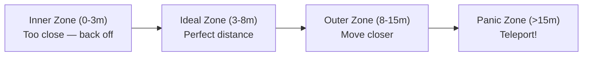

**The teleport** in the panic zone is the dirty secret. When the companion falls too far behind:

1. Find candidate positions near the player
2. **Reject** positions visible to the player's camera
3. **Reject** positions visible to enemies (would break stealth)
4. Teleport to best remaining position

> Naughty Dog reports Ellie teleports **multiple times per minute** during fast traversal. Players almost never notice because the teleport only happens behind the camera. **If the player doesn't see it, it didn't happen.**

---

### Buddy Positioning: The Scoring System

Position scoring with **context-dependent weights** — the weights shift per player state:

$$\text{score}(p) = w_1 \cdot \text{visibility}(p) + w_2 \cdot \text{cover}(p) + w_3 \cdot \text{distance}(p) + w_4 \cdot \text{clearance}(p)$$

```cpp
float CompanionAI::scorePosition(const CandidatePosition& p) const {
    float wVis, wCover, wDist, wClear;
    switch (currentPlayerState) {
        case PlayerState::Sneaking:
            wVis = 0.1f; wCover = 0.5f; wDist = 0.2f; wClear = 0.2f;
            break;
        case PlayerState::Fighting:
            wVis = 0.2f; wCover = 0.4f; wDist = 0.1f; wClear = 0.3f;
            break;
        default: // Exploring
            wVis = 0.3f; wCover = 0.1f; wDist = 0.4f; wClear = 0.2f;
            break;
    }
    return wVis * p.visibilityScore + wCover * p.coverScore
         + wDist * p.distanceScore + wClear * p.clearanceScore;
}
```

During **stealth**: cover dominates. During **combat**: cover + clearance. During **exploration**: distance + visibility.

---

### Stealth Synchronization

The hardest scenario. Solution: **enemies cannot see or hear the companion** during stealth.

This is a deliberate cheat — and the right design choice. Naughty Dog's Max Dyckhoff (GDC): players blamed the _companion_ for breaking stealth, even when it was technically the player's fault.

The companion still **appears** to sneak: crouching, hugging walls, hiding behind cover — all cosmetic behaviors that sell the illusion of a competent stealth partner.

---

### Companion Barks: Emotional Illusion

Contextual voice lines triggered by game events:

| Trigger                          | Bark Example                     | Design Purpose          |
| -------------------------------- | -------------------------------- | ----------------------- |
| Player low health                | "You okay? That looks bad..."    | Show concern            |
| Entering new area                | "Whoa... look at this place."    | Share discovery         |
| Enemy patrol spotted             | "Look — over there. Stay quiet." | Natural warning         |
| Long silence                     | "So... favorite color?"          | Fill dead air, humanize |
| Player killed enemy dramatically | "That was intense."              | React to player action  |

The bark system has a **cooldown** and **priority queue** — combat warnings override idle chatter, and the system never talks over important events.

---

## F.E.A.R. Revisited

---

### Independent Planning, Coordinated Appearance

Now that we understand multi-agent patterns, we can map F.E.A.R. to the systems we've studied:

| F.E.A.R. System    | Multi-Agent Pattern          |
| ------------------ | ---------------------------- |
| Shared world state | **Blackboard**               |
| Cost-based GOAP    | Natural behavior diversity   |
| Attack slots       | **Token system**             |
| Speak slots        | **Token system** (for voice) |
| Voice lines        | **Retroactive narration**    |

NPCs **never communicate**. Each plans independently against the same shared state.

---

### The Voice Line Pipeline: Three Stages

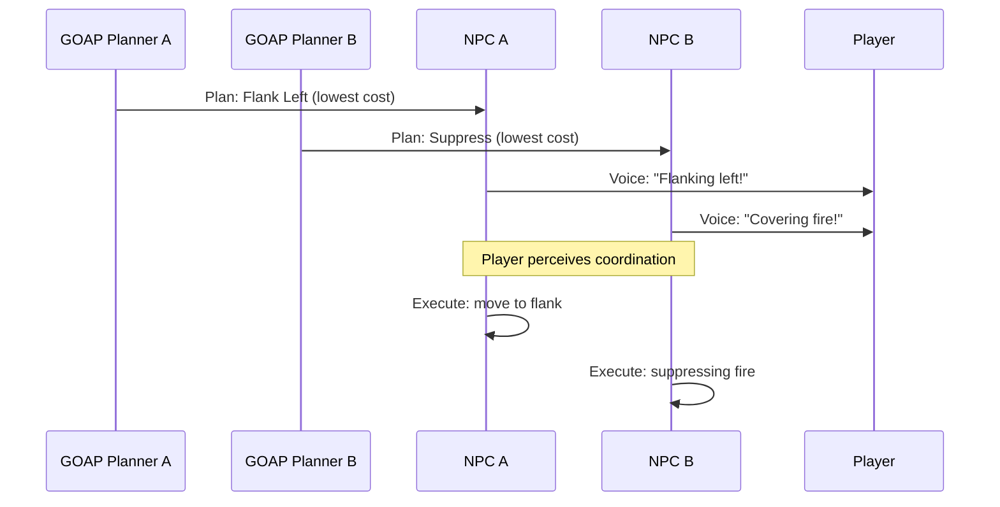

**Stage 1 — Decision**: GOAP planner decides action **independently** for each NPC.
**Stage 2 — Announcement**: NPC checks if a voice line matches. **Speak token** ensures only one talks at a time.
**Stage 3 — Execution**: NPC performs the action.

Player hears announcement _before_ seeing the action → perceives communication and planning. **It's narration, not coordination.**

---

### When F.E.A.R.'s Approach Breaks Down

Works for **3-5 NPCs** in **tight spaces** (corridors, rooms). Fails when:

- **20+ agents** — independent planners converge on identical decisions
- **Guaranteed roles needed** — can't ensure someone flanks; planner might not discover it
- **Long-term tactics** — greedy optimization, not multi-step maneuvers
- **Formation movement** — marching in formation requires explicit coordination

---

### The Hybrid Solution

Modern games combine both approaches:

| Layer             | Approach              | Example                                         |
| ----------------- | --------------------- | ----------------------------------------------- |
| **Squad tactics** | Explicit coordinator  | Coordinator assigns: "You flank, you suppress"  |
| **Individual AI** | Independent planning  | Each NPC plans _how_ to execute its role (GOAP) |
| **Voice lines**   | Retroactive narration | NPCs announce their planned actions             |

**Reliability** of explicit coordination at the tactical level + **naturalness** of independent planning at the individual level.

---

## C++ Implementation

---

### System Architecture

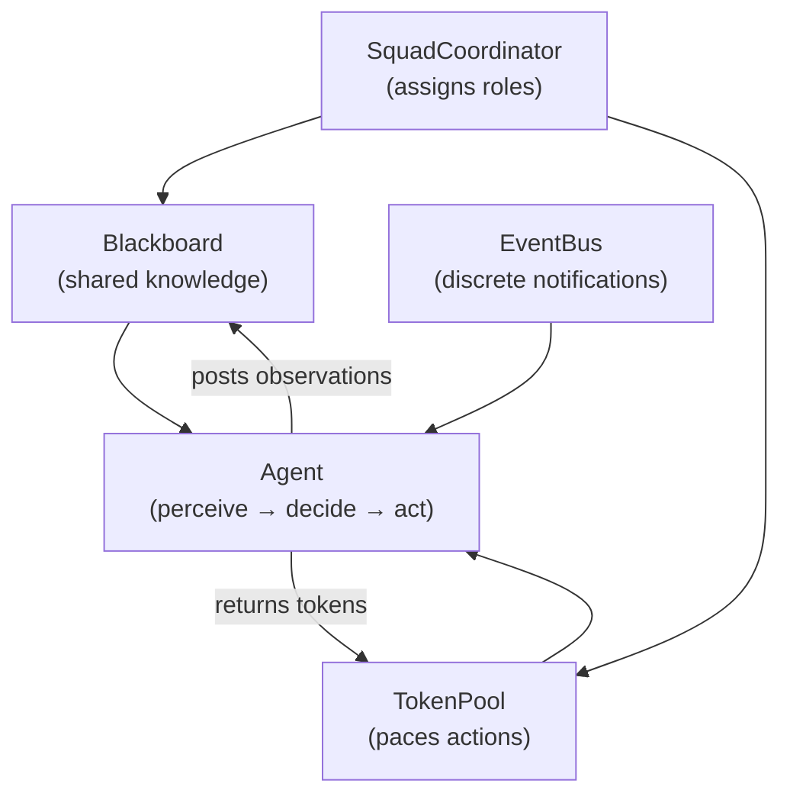

Five components working together: **Blackboard** (persistent shared state), **TokenPool** (action pacing), **EventBus** (discrete events), **Agent** (sense-decide-act), **SquadCoordinator** (role assignment).

---

### Agent Base Class

```cpp
enum class Role { NONE, SUPPRESSOR, FLANKER, RUSHER, SCOUT, DEFENDER };

class Agent {
protected:
    int id;
    Role role = Role::NONE;
    Vec3 position;
    float health;
    Blackboard* blackboard;  // shared between squad members

public:
    Agent(int id, Vec3 pos, float hp, Blackboard* bb)
        : id(id), position(pos), health(hp), blackboard(bb) {}
    virtual ~Agent() {}

    // The sense-decide-act loop:
    virtual void perceive(float time) = 0;  // sense → post to blackboard
    virtual void decide(TokenPool& tokens, float time) = 0;  // read bb + role
    virtual void act(float dt) = 0;         // execute chosen action
    virtual std::string getName() const = 0;

    void setRole(Role r) { role = r; }
    Role getRole() const { return role; }
};
```

Each agent holds a pointer to the **shared** blackboard — when one agent posts, all can query it immediately.

---

### Soldier Decision Logic

```cpp
void Soldier::decide(TokenPool& tokens, float time) {
    auto enemyPos = blackboard->query("enemy_pos", time, 5.0f);
    bool hasEnemy = enemyPos.has_value();

    switch (role) {
        case Role::SUPPRESSOR:
            if (hasEnemy && tokens.requestToken(TokenPool::ATTACK))
                currentAction = "suppressing fire";
            else
                currentAction = "holding position";
            break;
        case Role::FLANKER:
            if (hasEnemy && tokens.requestToken(TokenPool::FLANK))
                currentAction = "flanking left";
            else if (hasEnemy)
                currentAction = "moving to flank position";
            else
                currentAction = "advancing cautiously";
            break;
        case Role::RUSHER:
            if (hasEnemy && tokens.requestToken(TokenPool::ATTACK))
                currentAction = "rushing enemy";
            else
                currentAction = "waiting for opening";
            break;
        case Role::DEFENDER:
            currentAction = "defending position";
            break;
        default:
            currentAction = "idle";
    }
}
```

Notice how the **role** constrains which **token type** the agent requests. This is the connection between hierarchical coordination and token pacing.

---

### Squad Coordinator

```cpp
class SquadCoordinator {
    std::vector<Agent*> members;
    Blackboard* blackboard;
public:
    void assignRoles() {
        bool hasEnemy = blackboard->query("enemy_pos").has_value();
        if (!hasEnemy) {
            for (auto* m : members) m->setRole(Role::SCOUT);
            return;
        }
        // First: suppressor, Last: defender, Middle: alternate flank/rush
        for (size_t i = 0; i < members.size(); i++) {
            if (i == 0)                        members[i]->setRole(Role::SUPPRESSOR);
            else if (i == members.size() - 1)  members[i]->setRole(Role::DEFENDER);
            else if (i % 2 == 1)               members[i]->setRole(Role::FLANKER);
            else                               members[i]->setRole(Role::RUSHER);
        }
    }

    void update(TokenPool& tokens, float time, float dt) {
        for (auto* m : members) m->perceive(time);   // 1. Perceive
        assignRoles();                                 // 2. Assign roles
        for (auto* m : members) m->decide(tokens, time); // 3. Decide
        for (auto* m : members) m->act(dt);            // 4. Act
    }
};
```

The four-phase loop every tick: **perceive → assign → decide → act**.

---

### Demo Output

```
=== Tick 0 (t=0s) ===
  [Soldier_0 | Suppressor] suppressing fire
  [Soldier_1 | Flanker] flanking left
  [Soldier_2 | Rusher] waiting for opening     ← denied token (at capacity)
  [Soldier_3 | Defender] defending position

=== Tick 1 (t=0.5s) ===
  [Soldier_0 | Suppressor] suppressing fire
  [Soldier_1 | Flanker] moving to flank position  ← denied token (cooldown)
  [Soldier_2 | Rusher] rushing enemy               ← granted token this tick
  [Soldier_3 | Defender] defending position
```

Tokens create **natural variety**: the rusher waits in tick 0 (tokens at capacity), attacks in tick 1 (token freed). The flanker's token is on cooldown. **No scripting** — the token system and role assignment produce diverse, coordinated behavior automatically.

---

## Architecture Comparison

---

### Communication Architectures

| Aspect                 | Direct Messaging | Blackboard          | Hierarchical            | Event Bus          |
| ---------------------- | ---------------- | ------------------- | ----------------------- | ------------------ |
| **Coupling**           | High             | Low                 | Medium                  | Low                |
| **Scalability**        | $O(n^2)$         | $O(n)$              | Tree scales well        | $O(n)$ per event   |
| **Emergent behavior**  | None             | High                | Medium                  | Medium             |
| **Guaranteed tactics** | Yes (scripted)   | No (emergent)       | Yes (role assignment)   | No (per-agent)     |
| **Persistence**        | None             | Yes (data retained) | Yes (roles persist)     | None (consumed)    |
| **Best for**           | 2-agent pairs    | Knowledge sharing   | Squads, formations      | Discrete reactions |
| **Real examples**      | Escort missions  | F.E.A.R.            | Killzone 2/3, Halo Wars | Sound propagation  |

These architectures are **not mutually exclusive** — most shipped games combine them:

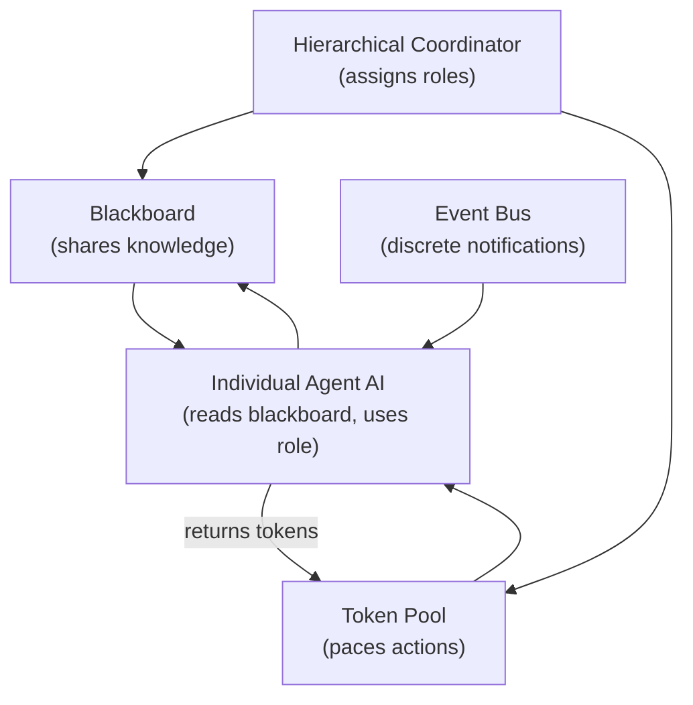

---

### Decision Matrix

| Question                        | Answer → Architecture                                                  |
| ------------------------------- | ---------------------------------------------------------------------- |
| **How many agents?**            | 2-5 → blackboard. 6-20 → hierarchical. 20+ → hierarchical + sub-squads |
| **Need guaranteed tactics?**    | Yes → hierarchical. No → blackboard + independent planning             |
| **How important is emergence?** | Critical → blackboard. Nice-to-have → hierarchical + GOAP              |
| **Frame budget for AI?**        | Tight → blackboard. Generous → hierarchical + per-agent planner        |
| **Debugging priority?**         | High → hierarchical (roles visible). Medium → event bus (traceable)    |

---

## Beyond Squad AI

---

### Emergent Multi-Agent Behaviors

Well-designed systems produce behaviors **no one programmed**:

- **Coordinated retreats** — multiple agents report low health → coordinator switches to fallback
- **Pack hunting** — blackboard signals reduce utility for "already hunted" targets → pack distributes naturally
- **Morale cascades** — one death → caution, two → retreat, three → panic — from individual responses to shared state
- **Adaptive difficulty** — token scarcity naturally creates easier encounters when NPCs are occupied

---

### Multi-Agent Pathfinding

Standard A\* creates traffic jams with multiple agents. Solutions:

| Approach               | How It Works                                             | Cost      | Used In                       |
| ---------------------- | -------------------------------------------------------- | --------- | ----------------------------- |
| **Cooperative A\***    | Agents plan paths avoiding each other's future positions | High      | Small squad navigation        |
| **Velocity Obstacles** | Each agent avoids others in velocity space               | Medium    | Crowd simulation              |
| **Flow Fields**        | Single field from target that all agents follow          | Low/agent | RTS (Supreme Commander, etc.) |

---

### Coming Next: Influence Maps

Influence maps extend coordination with **spatial reasoning**:

$$I(d) = I_0 \cdot e^{-kd}$$

Friendly units add positive influence; enemies add negative. Influence **decays** with distance and **fades** over time.

| Query                     | Influence Map Answer                         |
| ------------------------- | -------------------------------------------- |
| "Where is safe?"          | High friendly influence, low enemy influence |
| "Where is the front?"     | Where friendly ≈ enemy influence             |
| "Where should I flank?"   | Low total influence (gaps in coverage)       |
| "Where should I retreat?" | Nearest cell with strong friendly influence  |

From individual positions → **spatial awareness of the entire battlefield**.

---

## Summary

---

### Key Takeaways

| Concept                   | Core Idea                                                                                  |
| ------------------------- | ------------------------------------------------------------------------------------------ |
| **Coordination Problem**  | Independent agents converge on identical behavior — need diversification                   |
| **Observer Pattern**      | Synchronous 1-to-many notification — simple but causes frame spikes + lapsed listener bugs |
| **Event Queue**           | Asynchronous ring buffer — budget-capped processing, event aggregation                     |
| **Pub/Sub**               | Topic-filtered messaging — agents only receive relevant events                             |
| **Blackboard**            | Shared knowledge base with timestamps and staleness — the core of game AI coordination     |
| **Knowledge Sources**     | Specialist modules that read/write the blackboard, scheduled by control shell              |
| **Hierarchical AI**       | Strategic → Tactical → Individual, each at different abstraction and time scale            |
| **Token System**          | Limited resources controlling concurrent actions — solves the Kung-Fu Circle               |
| **Difficulty Scaling**    | Same AI code + different token config = different difficulty levels                        |
| **Companion AI**          | Player model + tethering + selective perception + barks = believable buddy                 |
| **Retroactive Narration** | Voice lines after decisions create the illusion of communication (F.E.A.R.)                |
| **Emergent Coordination** | Well-designed systems produce behaviors that weren't explicitly programmed                 |

---

### Three Things to Remember

1. **Blackboards + Tokens = Coordination**. A shared blackboard for knowledge and a token pool for action pacing are sufficient to build believable multi-agent behavior in most games.

2. **Illusion over simulation**. F.E.A.R.'s NPCs don't actually communicate. Ellie teleports when you're not looking. The goal isn't _real_ coordination — it's the _perception_ of coordination.

3. **Layers separate concerns**. Strategic decides _what_ to do at the squad level. Tactical decides _who_ does it. Individual decides _how_. Each layer can change independently.

---

### From GOAP to Squads: The Journey

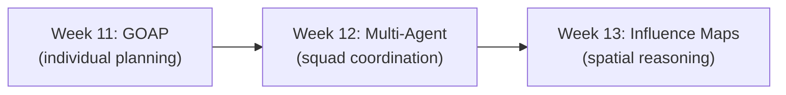

> Last week: one NPC makes smart decisions. This week: a squad of NPCs coordinates smart decisions. Next week: they reason about **space**.
