# Multi-Agent Coordination

Last week we built a GOAP solver that lets a single agent plan a sequence of actions to achieve a goal. That's powerful, but most games don't have just one NPC — they have dozens or hundreds. When multiple agents share an environment, they need to **coordinate**.

This lecture addresses the fundamental question: **how do multiple game AI agents work together without a human scripting every interaction?**

We'll build from the communication patterns that enable coordination, through concrete architectures used in shipped games, to a C++ implementation you can extend.

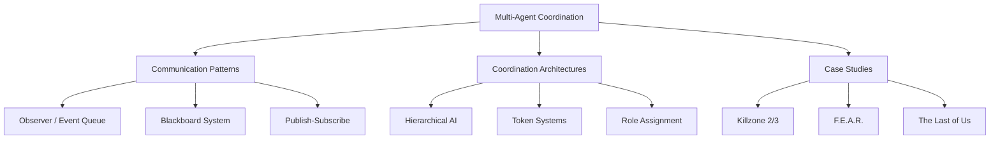

## 1. From Single-Agent to Multi-Agent

### 1.1. GOAP Recap: The Individual Planner

::: note "Review"
For details on GOAP and the A\*-based planner, see the previous lecture.
:::

In Week 11, we built a system where each agent independently:

1. Evaluates its **goals** (ranked by priority)
2. Runs A\* through **action space** to find a plan
3. Executes the plan step by step
4. **Replans** when the world changes

Recall the core abstraction: a GOAP agent starts with a **world state** (a set of boolean or numeric properties), defines a set of **actions** (each with preconditions and effects), and uses A\* search to find a sequence of actions that transforms the initial state into a goal state.

```
World State:    { weaponLoaded: false, enemyVisible: true, inCover: false }
Goal:           { enemyDead: true }

Planner finds:  TakeCover → Reload → Aim → Shoot
```

This works beautifully for individual NPCs. An F.E.A.R. soldier independently decides to flank, take cover, or reload — and the planner discovers the right sequence automatically.

But what happens when you have **eight soldiers** all planning independently? They all see the same enemy, they all have similar actions, and the A\* heuristic leads them all toward the same "optimal" plan.

### 1.2. The Coordination Problem

Consider this scenario: a squad of four NPCs spots the player behind cover.

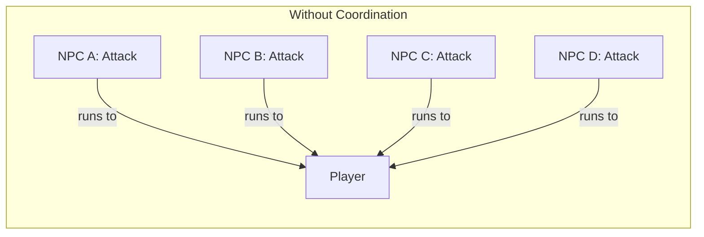

Without coordination, every NPC's planner independently concludes: "the best plan is to rush the player." The result? All four charge at once, arriving in a clump. This looks robotic and is tactically absurd.

With coordination, the squad behaves like this instead:

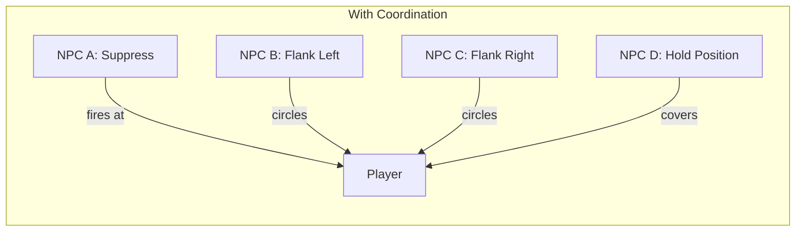

The fundamental challenge is: **how do agents make decisions that account for what other agents are doing, without requiring a single omniscient controller?**

We can formalize this. Each agent $i$ has a planning function $\pi_i$ that takes the world state $S$ and produces an action $a_i$:

$$
a_i = \pi_i(S)
$$

If all agents have the same planner and the same world state, they produce the same action: $a_1 = a_2 = \ldots = a_n$. The coordination problem is to introduce some mechanism — shared state, communication, external constraints — that causes $\pi_i(S) \neq \pi_j(S)$ even when $i$ and $j$ are identical agents in the same situation.

!!! quiz
{
"title": "Coordination Problem",
"question": "What is the main problem when multiple GOAP agents plan independently against the same target?",
"options": ["They produce plans that are too expensive", "They all converge on the same 'optimal' plan, producing identical behavior", "They cannot find any valid plan", "Their plans take too long to compute"],
"answers": ["They all converge on the same 'optimal' plan, producing identical behavior"]
}
!!!

### 1.3. What Is a Multi-Agent System?

In academic AI, a **Multi-Agent System (MAS)** is defined as a collection of autonomous agents that:

1. **Operate in a shared environment** — they perceive the same world and their actions affect each other
2. **Have local views** — no single agent sees everything; each has partial observability
3. **Interact** — through direct communication, shared resources, or environmental effects
4. **Coordinate** — to achieve individual or collective goals that require cooperation

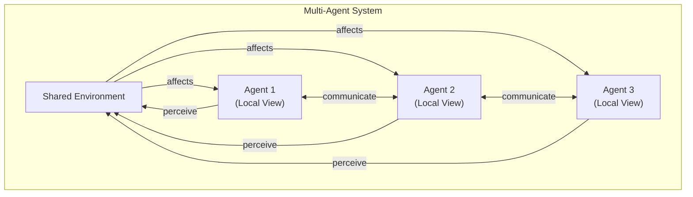

In games, the "shared environment" is the game world, and agents interact through it constantly — one NPC taking cover behind a wall affects what cover is available for others. One NPC firing at the player draws the player's attention, creating an opportunity for another NPC to flank.

The key distinction from single-agent AI is that each agent must consider not just "what should I do?" but "what should I do **given what the others are doing**?" This transforms the decision problem from individual optimization to a form of **distributed problem-solving**.

::: note "Game AI vs Academic MAS"
Academic multi-agent research often deals with agents that negotiate, form coalitions, and reason about each other's beliefs. Game AI simplifies this dramatically — game NPCs don't negotiate with each other or model each other's mental states. Instead, they share knowledge through data structures (blackboards), follow role assignments from coordinators, and use resource constraints (tokens) to prevent conflicts. The same coordination outcomes emerge from much simpler mechanisms.
:::

### 1.4. Approaches to Multi-Agent Coordination

There are three broad strategies for coordinating AI agents in games:

| Strategy                | Description                                                         | Example                                          |
| ----------------------- | ------------------------------------------------------------------- | ------------------------------------------------ |
| **Centralized**         | A single "commander" makes decisions for all agents                 | RTS army controller                              |
| **Decentralized**       | Each agent decides independently but reads shared information       | F.E.A.R. (independent GOAP + shared world state) |
| **Hybrid/Hierarchical** | Layers of control — high-level coordination with low-level autonomy | Killzone 2/3 (strategic → tactical → individual) |

Each approach has trade-offs in how much **emergent behavior** it allows versus how much **control** the designer retains:

- **Centralized**: Maximum control, minimum emergence. The commander scripting exactly who goes where is predictable but brittle — what happens when agents die or the plan becomes invalid?
- **Decentralized**: Maximum emergence, minimum control. Agents discover smart behaviors through individual optimization, but you can't guarantee any particular coordinated tactic will appear.
- **Hybrid**: The sweet spot for most games. High-level decisions (objectives, roles) are centralized, while low-level execution (movement, combat) is decentralized. This gives designers control over the "what" while letting agents discover the "how."

::: tip "No Single Right Answer"
Most shipped games use the **hybrid** approach. Pure centralization doesn't scale (the commander becomes a bottleneck), and pure decentralization produces the "everyone rush" problem. The art is in choosing what to centralize and what to leave to individual agents.
:::

!!! quiz
{
"title": "MAS Approaches",
"question": "Which coordination approach gives designers the most control over squad tactics while still allowing agents to find their own movement and combat solutions?",
"options": ["Centralized — a single commander decides everything", "Decentralized — each agent plans independently", "Hybrid/Hierarchical — high-level coordination with low-level autonomy", "Random — agents randomly choose different actions"],
"answers": ["Hybrid/Hierarchical — high-level coordination with low-level autonomy"]
}
!!!

---

## 2. Communication Patterns for Game AI

Before we can coordinate agents, we need a way for them to **share information**. This section covers three communication patterns used in game AI, from simplest to most powerful.

### 2.1. Observer Pattern (Direct Notification)

The **Observer** pattern (also called event-subscriber or listener) is the simplest form of decoupled communication. An object (the **subject**) maintains a list of dependents (**observers**) and notifies them automatically when its state changes.

```cpp
class Observer {
public:
    virtual ~Observer() {}
    virtual void onNotify(const Entity& entity, Event event) = 0;
};

class Subject {
    std::vector<Observer*> observers;
public:
    void addObserver(Observer* obs)    { observers.push_back(obs); }
    void removeObserver(Observer* obs) {
        observers.erase(
            std::remove(observers.begin(), observers.end(), obs),
            observers.end());
    }
protected:
    void notify(const Entity& entity, Event event) {
        for (auto* obs : observers)
            obs->onNotify(entity, event);
    }
};
```

In game AI, the Observer is used when one system needs to react to another's events:

- Physics detects a collision → AI receives "took damage" notification
- Perception system spots enemy → squad receives "enemy spotted" event
- An NPC dies → nearby NPCs receive "ally down" notification

Here's a concrete example — an achievement system that observes entity events:

```cpp
enum class Event { ENTITY_DIED, ENTITY_DAMAGED, ENTITY_SPOTTED, ENTITY_FLED };

class AchievementSystem : public Observer {
public:
    void onNotify(const Entity& entity, Event event) override {
        switch (event) {
            case Event::ENTITY_DIED:
                if (entity.isEnemy()) enemiesKilled++;
                if (enemiesKilled >= 100)
                    unlock("CENTURION");
                break;
            case Event::ENTITY_FLED:
                if (entity.isPlayer())
                    unlock("TACTICAL_RETREAT");
                break;
            default: break;
        }
    }
private:
    int enemiesKilled = 0;
    void unlock(const std::string& id) { /* ... */ }
};
```

The achievement system doesn't know how entities die or flee. It just observes and reacts. This is the power of decoupling — you can add new observers without modifying the entity code.

::: warning "Observer is Synchronous"
The Observer pattern calls all observers **immediately** and **synchronously**. If an observer does expensive work inside `onNotify()`, it blocks the subject. In game AI with many agents, this can cause frame spikes. For time-decoupled communication, use the Event Queue pattern instead.
:::

#### The Lapsed Listener Problem

A critical pitfall of the Observer pattern is the **lapsed listener** (or phantom listener) problem. If an observer is destroyed without removing itself from the subject's list, the subject holds a **dangling pointer**:

```cpp
// BUG: Classic lapsed listener
Subject* perception = getPerceptionSystem();
{
    SquadObserver* obs = new SquadObserver();
    perception->addObserver(obs);
    // ... obs does some work ...
    delete obs;  // OOPS: forgot to call perception->removeObserver(obs)
}
// Next time perception calls notify(), it dereferences a dangling pointer → CRASH
```

In games with NPCs that spawn and despawn constantly, this is a real and common bug. Solutions include:

- **RAII**: Observers unregister in their destructor
- **Weak references**: The subject holds `std::weak_ptr<Observer>` and skips expired references
- **Event queues**: Side-step the problem entirely by decoupling in time

!!! quiz
{
"title": "Observer Problems",
"question": "What is the 'lapsed listener' problem in the Observer pattern?",
"options": ["Observers receive too many events and slow down", "A destroyed observer remains registered, causing a dangling pointer crash when notified", "The subject forgets to send events", "Observers receive events in the wrong order"],
"answers": ["A destroyed observer remains registered, causing a dangling pointer crash when notified"]
}
!!!

### 2.2. Event Queue Pattern (Asynchronous Messages)

The **Event Queue** decouples communication in **time** — the sender enqueues a message and returns immediately. A processor handles messages later, possibly on a different thread.

```cpp
struct AIEvent {
    enum Type { ENEMY_SPOTTED, ALLY_DOWN, POSITION_COMPROMISED, COVER_AVAILABLE };
    Type type;
    int senderId;
    float x, y, z;        // relevant position
    float timestamp;
};

class EventQueue {
    static const int MAX_EVENTS = 256;
    AIEvent events[MAX_EVENTS];
    int head = 0;
    int tail = 0;
public:
    void enqueue(const AIEvent& event) {
        int next = (tail + 1) % MAX_EVENTS;
        if (next == head) return; // queue full, drop event
        events[tail] = event;
        tail = next;
    }

    bool dequeue(AIEvent& out) {
        if (head == tail) return false; // empty
        out = events[head];
        head = (head + 1) % MAX_EVENTS;
        return true;
    }
};
```

This **ring buffer** implementation (from Robert Nystrom's _Game Programming Patterns_) uses no dynamic allocation and runs in $O(1)$ per enqueue/dequeue.

#### Processing the Queue

The event queue is processed each frame (or each AI tick) by a dispatcher that routes events to handlers:

```cpp
class AIEventDispatcher {
    EventQueue& queue;
    std::vector<Observer*> handlers;

public:
    AIEventDispatcher(EventQueue& q) : queue(q) {}

    void addHandler(Observer* h) { handlers.push_back(h); }

    // Process up to maxEvents per frame to limit CPU usage.
    void processEvents(int maxEvents = 16) {
        AIEvent event;
        int processed = 0;
        while (processed < maxEvents && queue.dequeue(event)) {
            for (auto* h : handlers)
                h->onNotify(event);
            processed++;
        }
    }
};
```

The `maxEvents` parameter is crucial — it lets you cap how many events are processed per frame, spreading the work across multiple frames if the queue is flooded (e.g., a grenade goes off and generates 20 "DAMAGED" events at once).

#### Event Aggregation

A powerful optimization is **event aggregation**: instead of processing every individual event, collapse duplicates. If three NPCs all report `ENEMY_SPOTTED` at similar positions within 100ms, the system can aggregate them into a single "enemy confirmed at position X with confidence HIGH":

| Raw Events                               | Aggregated Event                                |
| ---------------------------------------- | ----------------------------------------------- |
| NPC_1: ENEMY_SPOTTED (45, 0, 12) t=0.0s  | ↓                                               |
| NPC_3: ENEMY_SPOTTED (44, 0, 13) t=0.05s | ENEMY_CONFIRMED (44.5, 0, 12.5) confidence=HIGH |
| NPC_5: ENEMY_SPOTTED (46, 0, 11) t=0.08s | ↓                                               |

This reduces the number of events downstream systems must process, and the aggregated event carries more useful information than any individual raw event.

Key advantages for game AI:

- **No frame spikes**: Messages are processed at the receiver's pace
- **Aggregation**: Multiple "enemy spotted" events can be collapsed into one
- **Thread safety**: The queue can bridge the AI thread and the main game thread
- **Temporal decoupling**: The sender doesn't need to know who (if anyone) is listening

!!! quiz
{
"title": "Event Queue",
"question": "Which is the primary advantage of an event queue over the direct observer pattern for game AI communication?",
"options": ["It uses less memory", "It decouples communication in time, preventing frame spikes", "It guarantees message delivery order", "It requires fewer lines of code"],
"answers": ["It decouples communication in time, preventing frame spikes"]
}
!!!

### 2.3. Publish-Subscribe (Topic-Based Messaging)

**Publish-subscribe** extends the event queue with **topic filtering**. Agents subscribe to specific event types and only receive messages they care about.

```cpp
class PubSub {
    std::unordered_map<AIEvent::Type, std::vector<Observer*>> subscribers;
public:
    void subscribe(AIEvent::Type topic, Observer* obs) {
        subscribers[topic].push_back(obs);
    }

    void unsubscribe(AIEvent::Type topic, Observer* obs) {
        auto it = subscribers.find(topic);
        if (it != subscribers.end()) {
            auto& subs = it->second;
            subs.erase(std::remove(subs.begin(), subs.end(), obs), subs.end());
        }
    }

    void publish(const AIEvent& event) {
        auto it = subscribers.find(event.type);
        if (it != subscribers.end()) {
            for (auto* obs : it->second)
                obs->onNotify(event);
        }
    }

    // How many observers are listening to a specific topic?
    size_t subscriberCount(AIEvent::Type topic) const {
        auto it = subscribers.find(topic);
        return (it != subscribers.end()) ? it->second.size() : 0;
    }
};
```

In game AI, this means:

- A **scout** NPC subscribes to `ENEMY_SPOTTED` and `COVER_AVAILABLE`
- A **medic** NPC subscribes to `ALLY_DOWN` only
- An **officer** NPC subscribes to all tactical events

This keeps each agent's notification overhead proportional to what it actually needs, rather than every agent receiving every event.

#### Pub/Sub in a Squad Scenario

Let's trace how pub/sub works when a squad encounters an enemy:

```
1. NPC_A (Scout) spots an enemy
     → publishes ENEMY_SPOTTED { pos: (45, 0, 12), senderId: A }

2. Subscribers to ENEMY_SPOTTED:
     - NPC_B (Suppressor): received → adjusts aim toward (45, 0, 12)
     - NPC_C (Flanker):    received → calculates flanking route around (45, 0, 12)
     - NPC_D (Medic):      NOT subscribed → doesn't receive, continues healing

3. NPC_B opens fire, suppressing the enemy
     → publishes POSITION_COMPROMISED { pos: NPC_B's position, senderId: B }

4. Subscribers to POSITION_COMPROMISED:
     - NPC_A (Scout): received → marks NPC_B's position as "hot", avoids it
     - NPC_D (Medic): received → notes NPC_B may need healing soon
```

Each agent only processes events relevant to its role. The scout doesn't care about `ALLY_DOWN` events. The medic doesn't care about `ENEMY_SPOTTED`. This scales well — with 20 NPCs, each one only processes a fraction of the total event traffic.

!!! quiz
{
"title": "Pub/Sub Filtering",
"question": "In a publish-subscribe system, a medic NPC subscribes only to ALLY_DOWN events. What happens when an ENEMY_SPOTTED event is published?",
"options": ["The medic receives it but ignores it", "The medic receives it and processes it normally", "The medic does not receive it at all — the pub/sub system filters it out", "The system crashes because the medic can't handle that event type"],
"answers": ["The medic does not receive it at all — the pub/sub system filters it out"]
}
!!!

::: note "Observer vs Event Queue vs Pub/Sub"
These three patterns form a spectrum of decoupling:

| Pattern     | Decouples Who? | Decouples When? | Filtering? |
| ----------- | -------------- | --------------- | ---------- |
| Observer    | ✓              | ✗               | ✗          |
| Event Queue | ✓              | ✓               | ✗          |
| Pub/Sub     | ✓              | ✓ (optional)    | ✓          |

In practice, most game AI systems use a combination. The observer handles immediate, low-latency notifications (damage events), while an event queue or pub/sub handles higher-level tactical communication (squad coordination).
:::

---

## 3. The Blackboard Architecture

### 3.1. The Specialist Metaphor

The **blackboard** is the most important architectural pattern for multi-agent coordination in game AI. It was originally developed in the 1970s for the HEARSAY-II speech recognition system at Carnegie Mellon University. The problem HEARSAY-II solved was strikingly similar to game AI coordination: multiple specialized algorithms (one for phoneme detection, one for word boundary detection, one for syntax, one for semantics) needed to contribute their partial results to a shared solution without knowing about each other.

The blackboard metaphor maps perfectly to game AI:

Imagine a group of specialists (detectives, forensic analysts, behavioral profilers) working together to solve a crime. They don't talk to each other directly — instead, they all gather around a **shared blackboard**:

1. The forensic analyst writes: "Fingerprints found at the scene match suspect A."
2. The behavioral profiler reads that and writes: "Suspect A's profile suggests they would flee east."
3. The field detective reads that and writes: "Patrol units should cover the eastern exits."
4. The forensic analyst sees the eastern exits note and writes: "Security camera at exit 5 shows suspect A at 3:42 PM."

No specialist needs to know who the others are. Each one monitors the blackboard for information relevant to their expertise, contributes what they can, and lets others build on their contributions. The solution **emerges** from the interaction of specialists with the shared data, not from any single specialist directing the process.

### 3.2. Three Components

A blackboard system has exactly three components:

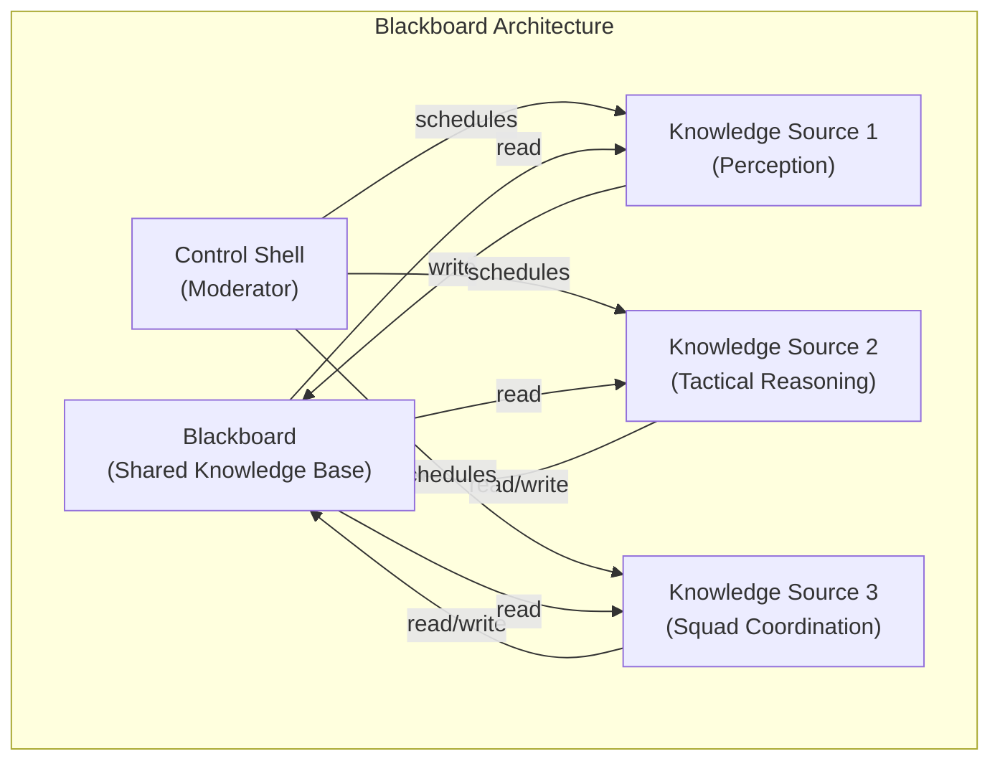

| Component             | Role                                                          | Game AI Example                                  |
| --------------------- | ------------------------------------------------------------- | ------------------------------------------------ |
| **Blackboard**        | Shared data store — the "common knowledge" of the agent group | Enemy positions, cover locations, squad orders   |
| **Knowledge Sources** | Specialist modules that read from and write to the blackboard | Perception system, pathfinder, tactical reasoner |
| **Control Shell**     | Moderator that decides which knowledge source runs next       | Priority scheduler, round-robin, event-triggered |

Let's examine each component in detail.

#### The Blackboard (Data Store)

The blackboard itself is a structured data store, typically organized into **layers** or **regions** by type of information:

| Layer             | Contents                                     | Written By              | Read By                        |
| ----------------- | -------------------------------------------- | ----------------------- | ------------------------------ |
| **Perception**    | Enemy positions, sounds heard, objects seen  | Perception KS           | All combat KS                  |
| **Tactical**      | Cover positions, danger zones, sight lines   | Environment analysis KS | Pathfinder, tactical reasoning |
| **Squad**         | Role assignments, formation data, objectives | Tactical coordinator    | Individual agents              |
| **Communication** | Voice line requests, gesture triggers        | Any KS                  | Audio system, animation system |

This layering prevents knowledge sources from accidentally overwriting each other's data and makes it easy to clear specific layers (e.g., clearing the perception layer when the squad moves to a new area).

#### Knowledge Sources (Specialists)

Each knowledge source is a self-contained module that:

1. **Monitors** the blackboard for changes relevant to its expertise
2. **Activates** when it can contribute (based on trigger conditions)
3. **Reads** input data from the blackboard
4. **Processes** that data using its specialized algorithm
5. **Writes** results back to the blackboard

For example, a **Threat Assessment** knowledge source might:

```
Trigger:   New entry in Perception layer with type ENEMY_SPOTTED
Read:      All ENEMY_SPOTTED entries from Perception layer
Process:   Count enemies, assess weapons, calculate threat level
Write:     THREAT_LEVEL = HIGH, RECOMMENDED_STANCE = DEFENSIVE
           → written to Tactical layer
```

::: tip "Why Not Just Use Global Variables?"
A blackboard and global variables both hold shared state, but the blackboard provides **structure** and **controlled access**. The control shell prevents race conditions, the knowledge sources have well-defined interfaces for reading and writing, and the blackboard can validate or transform data as it's stored. This is the difference between a carefully moderated meeting and everyone shouting into the void.
:::

#### The Control Shell (Moderator)

The control shell determines **which knowledge source runs next**. There are several scheduling strategies:

| Strategy            | How It Works                                                  | Best For                                      |
| ------------------- | ------------------------------------------------------------- | --------------------------------------------- |
| **Round-Robin**     | Run each KS in fixed order, every tick                        | Simple systems, predictable CPU budget        |
| **Priority-Based**  | Run the highest-priority KS whose trigger conditions are met  | Complex systems with many KS                  |
| **Event-Triggered** | Run a KS only when the blackboard data it monitors changes    | Responsive systems, low CPU when idle         |
| **Opportunistic**   | Run the KS estimated to make the most progress on the problem | Most sophisticated, highest coordination cost |

In game AI, **event-triggered** is the most common choice. The perception KS runs when sensor data arrives. The tactical reasoning KS runs when the perception layer changes. The squad coordination KS runs when the tactical layer changes. Each KS runs only when it has new data to process, minimizing wasted CPU.

!!! quiz
{
"title": "Control Shell",
"question": "What is the role of the control shell in a blackboard architecture?",
"options": ["It stores data for knowledge sources to read", "It decides which knowledge source runs next and prevents scheduling conflicts", "It communicates directly between knowledge sources", "It replaces the need for a blackboard data store"],
"answers": ["It decides which knowledge source runs next and prevents scheduling conflicts"]
}
!!!

### 3.3. Blackboard in Game AI: Knowledge Queries and Posting

In game AI, agents interact with the blackboard through two operations:

**Knowledge Posting** — An agent writes information it has discovered:

```
Perception System → POST: "Enemy at position (45, 0, 12), confidence 0.9, timestamp 3.2s"
Pathfinder        → POST: "Cover position available at (30, 0, 8), quality: HIGH"
Scout NPC         → POST: "East flank is unguarded"
```

**Knowledge Query** — An agent asks for information it needs:

```
Attack NPC → QUERY: "Where is the nearest enemy?" → Returns: (45, 0, 12)
Medic NPC  → QUERY: "Which ally has lowest health?" → Returns: NPC_3 (25% HP)
Officer    → QUERY: "How many enemies visible?"     → Returns: 3
```

This is fundamentally different from direct messaging. The attacker doesn't ask the perception system "where is the enemy?" — it asks the **blackboard**. The perception system may have posted that information seconds ago, and the attacker doesn't need to know or care which system provided it.

!!! quiz
{
"title": "Blackboard Architecture",
"question": "In a blackboard system, how do knowledge sources communicate with each other?",
"options": ["They send direct messages to specific other knowledge sources", "They all read from and write to a shared blackboard — they never communicate directly", "They use a central commander that relays all messages", "They maintain individual copies of the world state"],
"answers": ["They all read from and write to a shared blackboard — they never communicate directly"]
}
!!!

### 3.4. Blackboard vs Event Queue

Both blackboards and event queues decouple agents, but they solve fundamentally different problems. Understanding when to use each (and when to use both) is critical for designing robust game AI.

| Aspect                | Blackboard                                      | Event Queue                                |
| --------------------- | ----------------------------------------------- | ------------------------------------------ |
| **Data persistence**  | Data persists until overwritten or expired      | Messages are consumed and discarded        |
| **Access pattern**    | Pull: agents query when they need information   | Push: agents receive when events occur     |
| **Best for**          | Shared state that evolves over time (enemy map) | One-shot notifications ("grenade thrown!") |
| **Temporal coupling** | None — data available whenever queried          | Low — message available when dequeued      |
| **Overhead**          | Memory for persistent store; query cost         | Memory for queue; enqueue/dequeue cost     |

Consider the difference with a concrete example. An NPC needs to know where the nearest enemy is:

- **Blackboard approach**: The perception system continuously posts updated enemy positions to the blackboard. When the NPC's decision-making runs, it queries the blackboard: "give me the nearest enemy position." The data is always available, always up-to-date (within the perception system's refresh rate), and the NPC accesses it on its own schedule.

- **Event Queue approach**: The perception system enqueues an `ENEMY_SPOTTED` event when it first sees an enemy. The NPC dequeues and processes it. But what if the NPC's decision-making runs 5 frames later? The event has been consumed. What if the NPC wants to check the enemy position again? It can't — the event is gone. The NPC would need to store the information locally, which means duplicating what the blackboard already provides.

The rule: if information is **queried repeatedly** (positions, health, tactical status), use a **blackboard**. If information is a **one-time notification** (explosion, death, state change), use an **event queue**.

::: note "Many Games Use Both"
In Killzone 2/3, the blackboard stores persistent tactical knowledge (enemy positions, cover quality, squad assignments), while an event system handles transient notifications (grenade warnings, ally death, audio triggers). The two complement each other — the blackboard is the "world model" and the event queue is the "nervous system."
:::

### 3.5. Blackboard Pitfalls and Best Practices

::: warning "Common Blackboard Mistakes"

1. **Unbounded growth**: If knowledge sources post data without ever cleaning it up, the blackboard grows indefinitely. Use **expiration timestamps** — data older than $T$ seconds is automatically purged.
2. **Stale data trust**: Agents that trust blackboard data without checking staleness will act on outdated information. Always check timestamps.
3. **Write contention**: If two knowledge sources write to the same key simultaneously, one overwrites the other. Use **namespaced keys** (e.g., `perception.agent_3.enemy_pos`) to avoid conflicts.
4. **Debugging opacity**: With many knowledge sources writing to the blackboard, it can be hard to trace why a value changed. Log every write with the source ID and timestamp.
   :::

---

## 4. Killzone Case Study: Hierarchical AI

### 4.1. The Problem of Scale

Killzone 2 (2009) and Killzone 3 (2011) by Guerrilla Games needed AI for **dozens of simultaneous NPCs** engaged in large-scale firefights. Individual planning (like F.E.A.R.'s GOAP) couldn't scale — with 20+ NPCs, the "everyone rush" problem would be severe, and individual replanning budgets would compete for CPU time.

The numbers are stark: in Killzone 3's multiplayer bot system, up to **24 AI-controlled bots** operated simultaneously across maps with multiple capture points, spawn areas, and tactical positions. The brute-force approach — give each bot an independent GOAP planner — would mean 24 independent planners competing for CPU, and all of them likely converging on the same "best" plan.

Their solution: **hierarchical AI** — multiple layers of control, each operating at a different level of abstraction.

### 4.2. Three Layers of Control

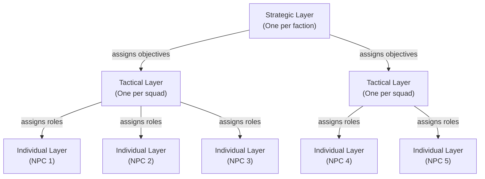

| Layer          | Scope          | Time Horizon | Update Rate  | Decisions                                           |
| -------------- | -------------- | ------------ | ------------ | --------------------------------------------------- |
| **Strategic**  | Entire faction | Minutes      | Every 2-5s   | Which objectives to capture, overall battle plan    |
| **Tactical**   | Squad (3-6)    | Seconds      | Every 0.5-1s | Formation, squad roles, attack/defend/flank orders  |
| **Individual** | Single NPC     | Frame-level  | Every frame  | Movement, aiming, cover selection, animation states |

The key insight is that **higher layers update less frequently**. Strategic decisions don't change frame-by-frame, so the strategic layer runs every few seconds. The individual layer runs every frame because movement and aiming must be smooth. This creates a natural CPU budget hierarchy — the expensive strategic computation runs rarely, while the cheap individual computation runs constantly.

### 4.3. The Strategic Layer

The strategic layer sees the battlefield as a graph of **objectives** (capture points, defensive positions, key terrain). It assigns squads to objectives based on:

- **Priority**: Which objectives are most important?
- **Threat assessment**: How many enemies are at each objective?
- **Resource availability**: How many squads are available, and what are their strengths?

```
Strategic Layer:
  Objective A (Control Point): UNDER ATTACK  → Assign Squad Alpha (defend)
  Objective B (Flank Route):   UNCONTESTED   → Assign Squad Bravo (advance)
  Objective C (Sniper Nest):   ENEMY HELD    → Assign Squad Charlie (assault)
```

Here's a simplified pseudocode for the strategic layer's assignment algorithm:

```cpp
// Strategic layer: assign squads to objectives
void StrategicLayer::assignSquads() {
    // Score each objective by importance.
    for (auto& obj : objectives) {
        obj.score = obj.basePriority;

        // Urgency bonus: objectives under attack are more important.
        if (obj.status == UNDER_ATTACK)
            obj.score += 50.0f;

        // Control bonus: objectives we own that the enemy wants.
        if (obj.ownedByUs && obj.enemyThreat > 0)
            obj.score += 30.0f;

        // Strategic value: objectives that unlock map control.
        obj.score += obj.connectionsCount * 10.0f;
    }

    // Sort objectives by score (highest first).
    std::sort(objectives.begin(), objectives.end(),
              [](const auto& a, const auto& b) { return a.score > b.score; });

    // Greedily assign available squads to top objectives.
    for (auto& obj : objectives) {
        Squad* best = findBestSquadFor(obj);
        if (best && !best->isAssigned()) {
            best->assignObjective(obj);
        }
    }
}

Squad* StrategicLayer::findBestSquadFor(const Objective& obj) {
    float bestFitness = -1.0f;
    Squad* best = nullptr;
    for (auto& squad : squads) {
        if (squad.isAssigned()) continue;
        float fitness = 0.0f;

        // Proximity: closer squads are preferred.
        float dist = distance(squad.centroid(), obj.position);
        fitness += 100.0f / (1.0f + dist);

        // Strength match: don't send a depleted squad to a major assault.
        if (obj.status == ENEMY_HELD)
            fitness += squad.memberCount() * 15.0f;

        if (fitness > bestFitness) {
            bestFitness = fitness;
            best = &squad;
        }
    }
    return best;
}
```

The strategic layer runs infrequently — perhaps once every few seconds — since strategic decisions don't change frame-by-frame. This is important: running an $O(S \times Q)$ assignment (where $S$ is objectives and $Q$ is squads) every few seconds is negligible CPU cost, even with complex scoring functions.

### 4.4. The Tactical Layer

Each squad has a tactical controller that receives the strategic objective ("defend this point") and decomposes it into squad-level tactics. The key innovation in Killzone is **dynamic role assignment**:

| Role           | Behavior                                            | When Assigned                              |
| -------------- | --------------------------------------------------- | ------------------------------------------ |
| **Suppressor** | Lay down covering fire on the player's position     | When the squad has a clear line of sight   |
| **Flanker**    | Circle around to hit the player from the side       | When a flanking route exists               |
| **Rusher**     | Close the distance and engage at short range        | When the player is reloading or distracted |
| **Scout**      | Move ahead to gather information on enemy positions | When the squad lacks visibility            |
| **Defender**   | Hold current position and protect the squad's flank | When the squad is exposed from behind      |

Roles are reassigned dynamically as the situation changes. If the flanker is killed, the tactical layer promotes a defender to take the flanking role. If the player moves, the suppressor might become the new flanker.

The tactical layer's decision process can be visualized as a flowchart:

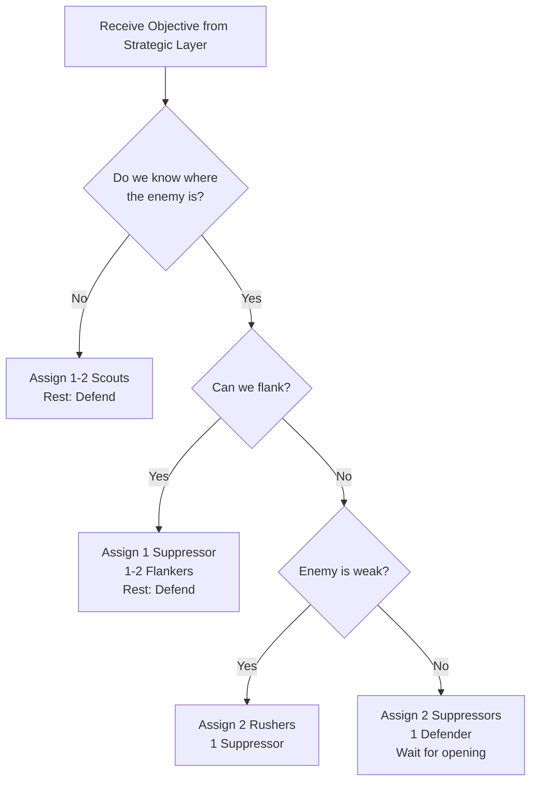

::: warning "Roles Are Not States"
Don't confuse roles with FSM states. A role is a **high-level assignment** that constrains the NPC's individual planning. An NPC with the "flanker" role still uses its own AI (behavior tree, utility system, etc.) to decide exactly how to flank — which cover to use, when to sprint vs. walk, when to engage.
:::

#### A Combat Scenario Walkthrough

Let's trace a complete scenario through all three layers:

```
Time 0.0s — Strategic Layer
  Squad Alpha (4 NPCs) assigned to "Defend Control Point B"

Time 0.0s — Tactical Layer (Squad Alpha)
  No enemy detected yet
  All 4 NPCs assigned Role::SCOUT
  Squad spreads out to cover approaches

Time 1.5s — Individual Layer (NPC_2)
  NPC_2's sensors detect enemy movement to the west
  Posts to blackboard: "enemy_pos_west = (40, 0, 15), confidence = 0.7"

Time 2.0s — Tactical Layer (Squad Alpha)
  Reads blackboard: enemy detected to the west
  Flanking route exists (south corridor)
  Reassigns roles:
    NPC_0 → SUPPRESSOR (has clear sight line west)
    NPC_1 → FLANKER (closest to south corridor)
    NPC_2 → DEFENDER (already in a good position)
    NPC_3 → RUSHER (aggressive behavior, near enemy)

Time 2.0-5.0s — Individual Layer (all NPCs)
  NPC_0: Uses behavior tree to find best cover with sight line, opens fire
  NPC_1: Pathfinds through south corridor, maintains stealth
  NPC_2: Holds current cover, watches north approach
  NPC_3: Waits for attack token, then rushes when NPC_0's suppression draws fire

Time 5.5s — Tactical Layer (Squad Alpha)
  NPC_3 killed during rush
  Only 3 NPCs remain
  Reassigns:
    NPC_0 → SUPPRESSOR (unchanged)
    NPC_1 → FLANKER (unchanged, still in transit)
    NPC_2 → RUSHER (promoted from defender to replace NPC_3)
```

This walkthrough shows how the three layers interact in real-time. The strategic layer set the broad objective. The tactical layer adapted twice — first from scouting to a flanking attack, then recovering when an NPC was killed. The individual layer handled the moment-to-moment execution.

!!! quiz
{
"title": "Hierarchical AI",
"question": "In Killzone's hierarchical AI, what does the tactical layer do?",
"options": ["Handles individual NPC movement and aiming", "Decides which objectives the entire faction attacks", "Assigns roles within a squad and coordinates squad-level tactics", "Manages the game's strategic overview map"],
"answers": ["Assigns roles within a squad and coordinates squad-level tactics"]
}
!!!

### 4.5. The Individual Layer

The individual layer is where the NPC actually acts. It receives a role from the tactical layer and uses its own decision-making system (behavior trees in Killzone) to execute that role.

The individual layer has access to the **squad blackboard** — a shared knowledge base that contains:

- All known enemy positions (posted by each NPC's perception system)
- Available cover positions (posted by the environment query system)
- Current squad formation and role assignments (posted by the tactical layer)
- Token availability (which actions are currently "allowed")

This means each NPC doesn't just know what **it** sees — it knows what the **entire squad** sees. If NPC A spots an enemy, that knowledge is posted to the blackboard and immediately available to NPC B, C, and D — even though they can't see the enemy themselves.

::: note "Shared Knowledge vs. Omniscience"
The blackboard gives agents **shared** knowledge, not **perfect** knowledge. NPCs can only post what their sensors detect, and that information can be stale. If an enemy moves after being spotted, the blackboard still has the old position until another NPC updates it. This creates realistic behavior — squads act on the best information available, not on perfect information.
:::

---

## 5. Token Systems and the Kung-Fu Circle Problem

### 5.1. The Kung-Fu Circle Problem

Watch any action movie where the hero fights a group of enemies. Despite being outnumbered, the enemies conveniently attack **one at a time** while the others circle and wait. This is the "Kung-Fu Circle" — it looks silly in movies, but in games, the **opposite** problem is worse.

Without any coordination, if five NPCs all have "attack player" as their best action, they will **all attack simultaneously**. The player gets hit by five enemies in the same frame and instantly dies. This isn't fun.

The Kung-Fu Circle problem is: **how do you control the rate and simultaneity of agent actions so that gameplay feels fair and readable?**

Games that solved this well include:

- **Batman: Arkham** series — at most 2-3 thugs attack Batman at once; the rest circle and posture, creating the signature free-flow combat rhythm
- **Assassin's Creed** — medieval guards attack one at a time with parry windows, while others feint and reposition
- **F.E.A.R.** — soldiers take turns firing and speaking, creating the impression of coordinated radio chatter
- **Halo** — Elites and Grunts use attack and retreat timing to create "waves" of aggression

In all these games, the AI doesn't actually coordinate in a military sense — it uses a **resource limitation system** that creates the appearance of coordination by controlling who is allowed to act when.

### 5.2. Token Systems

The solution used across the industry is a **token system** (also called a slot system). Tokens are limited resources that agents must acquire before performing certain actions:

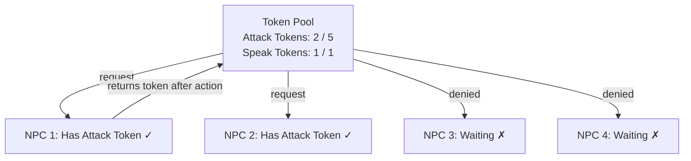

| Token Type  | Purpose                                   | Typical Limit         |
| ----------- | ----------------------------------------- | --------------------- |
| **Attack**  | Permission to attack the player           | 2-3 per frame         |
| **Speak**   | Permission to play a voice line           | 1 at a time           |
| **Flank**   | Permission to attempt a flanking maneuver | 1-2 per squad         |
| **Grenade** | Permission to throw a grenade             | 1 per 5-second window |
| **Melee**   | Permission to attempt a melee attack      | 1 at a time           |

The lifecycle of a token follows a clear pattern:

1. **Request**: Agent checks if a token of the needed type is available
2. **Grant**: If available, the token is consumed (available count decrements)
3. **Hold**: The agent performs its action while holding the token
4. **Return**: After the action completes (or is interrupted), the token returns to the pool
5. **Cooldown** (optional): The returned token may be unavailable for a brief period before it can be granted again

::: tip "Tokens Control Pacing"
Token limits are a **design dial**, not just a technical mechanism. Setting attack tokens to 2 creates intense but survivable encounters. Setting it to 5 creates overwhelming difficulty. Game designers can tune token counts per difficulty level without touching any AI code.
:::

### 5.3. Implementation: Token Pool

```cpp
class TokenPool {
public:
    enum TokenType { ATTACK, SPEAK, FLANK, GRENADE, MELEE, TOKEN_COUNT };

private:
    struct TokenInfo {
        int maxTokens;
        int availableTokens;
        float cooldown;        // seconds before a returned token becomes available again
        float lastReturnTime;
    };

    TokenInfo pools[TOKEN_COUNT];

public:
    TokenPool() {
        // Default configuration
        pools[ATTACK]  = {2, 2, 0.5f, 0.0f};
        pools[SPEAK]   = {1, 1, 2.0f, 0.0f};
        pools[FLANK]   = {1, 1, 3.0f, 0.0f};
        pools[GRENADE] = {1, 1, 5.0f, 0.0f};
        pools[MELEE]   = {1, 1, 1.0f, 0.0f};
    }

    bool requestToken(TokenType type) {
        auto& pool = pools[type];
        if (pool.availableTokens > 0) {
            pool.availableTokens--;
            return true;
        }
        return false;
    }

    void returnToken(TokenType type, float currentTime) {
        auto& pool = pools[type];
        pool.availableTokens = std::min(pool.availableTokens + 1, pool.maxTokens);
        pool.lastReturnTime = currentTime;
    }

    void setMaxTokens(TokenType type, int max) {
        pools[type].maxTokens = max;
        pools[type].availableTokens = std::min(pools[type].availableTokens, max);
    }
};
```

### 5.4. Integrating Tokens with GOAP

Tokens integrate naturally with GOAP by becoming **preconditions**:

| Action         | Preconditions (without tokens)            | Preconditions (with tokens)                                      |
| -------------- | ----------------------------------------- | ---------------------------------------------------------------- |
| `Attack`       | `weaponReady = true, enemyInRange = true` | `weaponReady = true, enemyInRange = true, hasAttackToken = true` |
| `ThrowGrenade` | `hasGrenade = true, enemyVisible = true`  | `hasGrenade = true, enemyVisible = true, hasGrenadeToken = true` |
| `FlankEnemy`   | `flankRouteExists = true`                 | `flankRouteExists = true, hasFlankToken = true`                  |

When an NPC's GOAP planner runs, if the agent doesn't have an attack token, the `Attack` action's preconditions are unsatisfied. The planner automatically falls back to other actions — perhaps `TakeCover` or `Suppress` — that don't require a token. This creates the natural-looking behavior where some enemies attack while others provide cover or reposition.

!!! quiz
{
"title": "Token System",
"question": "How does a token system prevent the 'everyone rush the player' problem?",
"options": ["It removes the attack action from most NPCs", "It limits how many agents can perform a specific action simultaneously by requiring a token", "It slows down NPC movement speed", "It reduces the number of NPCs in the scene"],
"answers": ["It limits how many agents can perform a specific action simultaneously by requiring a token"]
}
!!!

### 5.5. Time-Slot Scheduling

A refinement of the token system is **time-slot scheduling**, where actions are spaced out over time rather than simply limited in simultaneous count:

```
Time 0.0s: NPC A fires (attack slot 1)
Time 0.3s: NPC B fires (attack slot 2)
Time 0.6s: NPC C fires (attack slot 1 — recycled)
Time 0.9s: NPC D fires (attack slot 2 — recycled)
```

This creates a **staggered** pattern of enemy attacks that feels more natural than "two enemies fire simultaneously, then pause." F.E.A.R. used this approach for both combat actions and voice lines — enemies don't all shout at once; they take turns, creating the impression of back-and-forth radio chatter.

Here's how to implement time-slot scheduling:

```cpp
class TimeSlotScheduler {
    struct Slot {
        float nextAvailableTime;  // when this slot becomes free
        int assignedAgentId;      // who currently holds it (-1 if free)
    };

    std::vector<Slot> slots;
    float slotDuration;   // minimum time between uses of the same slot
    float staggerDelay;   // delay between consecutive slot activations

public:
    TimeSlotScheduler(int numSlots, float duration, float stagger)
        : slotDuration(duration), staggerDelay(stagger)
    {
        slots.resize(numSlots);
        for (int i = 0; i < numSlots; i++) {
            slots[i] = { i * stagger, -1 };  // stagger initial availability
        }
    }

    // Try to claim a slot for the given agent. Returns slot index or -1.
    int requestSlot(int agentId, float currentTime) {
        for (size_t i = 0; i < slots.size(); i++) {
            if (currentTime >= slots[i].nextAvailableTime) {
                slots[i].nextAvailableTime = currentTime + slotDuration;
                slots[i].assignedAgentId = agentId;
                return static_cast<int>(i);
            }
        }
        return -1;  // no slot available
    }

    // Release a slot early (agent died, interrupted, etc.)
    void releaseSlot(int slotIndex) {
        if (slotIndex >= 0 && slotIndex < static_cast<int>(slots.size())) {
            slots[slotIndex].assignedAgentId = -1;
            // Keep nextAvailableTime — enforce minimum cooldown even on early release
        }
    }
};
```

The key design decision is the `staggerDelay` parameter — by initializing each slot with an offset, the very first frame of combat doesn't have all NPCs fire simultaneously. Instead, attacks are staggered from the start: NPC A fires at $t=0$, NPC B at $t=0.3$, NPC C at $t=0.6$, etc.

### 5.6. Token Systems and Difficulty Scaling

One of the most elegant aspects of token systems is that they create a **natural difficulty dial** that's completely separate from the AI code:

| Difficulty | Attack Tokens | Flank Tokens | Grenade Tokens | Slot Duration | Behavior                                        |
| ---------- | ------------- | ------------ | -------------- | ------------- | ----------------------------------------------- |
| Easy       | 1             | 0            | 0              | 2.0s          | One enemy attacks at a time, no flanking        |
| Normal     | 2             | 1            | 1              | 1.0s          | Moderate pressure, occasional flanking          |
| Hard       | 3             | 2            | 1              | 0.5s          | Heavy pressure, frequent flanking and grenades  |
| Veteran    | 4             | 2            | 2              | 0.3s          | Relentless, coordinated attacks from all angles |

The AI code is **identical** across all difficulty levels. The same behavior trees, the same planning algorithms, the same blackboard. Only the token pool configuration changes. This means:

- **Less debugging**: The AI doesn't have separate "easy mode" and "hard mode" code paths
- **Easy tuning**: Designers can adjust difficulty in a spreadsheet, not in code
- **Smooth scaling**: Token counts can even adjust dynamically based on player performance (adaptive difficulty)

!!! quiz
{
"title": "Difficulty Scaling",
"question": "How do token systems simplify difficulty scaling in game AI?",
"options": ["By writing separate AI code for each difficulty level", "By reducing the number of NPCs on easier difficulties", "By changing only the token pool configuration while keeping the AI code identical", "By slowing down NPC movement speed on easier difficulties"],
"answers": ["By changing only the token pool configuration while keeping the AI code identical"]
}
!!!

---

## 6. Companion AI: The Buddy Problem

### 6.1. A Different Kind of Multi-Agent

So far we've focused on enemy coordination — multiple hostiles working together against the player. **Companion AI** (also called buddy AI) is a fundamentally different problem: a friendly NPC that must coordinate with the **player**, who is unpredictable.

The asymmetry is what makes this hard:

| Dimension         | Enemy Coordination            | Companion AI                               |
| ----------------- | ----------------------------- | ------------------------------------------ |
| **Goal**          | Defeat the player             | Help the player succeed                    |
| **Leader**        | AI squad leader (predictable) | Human player (unpredictable)               |
| **Failure mode**  | Too easy → boring             | Annoying, stupid, or gets in the way       |
| **Communication** | AI↔AI (perfect channel)       | AI→Player (only via behavior and barks)    |
| **Perception**    | Can cheat (share knowledge)   | Must appear to see/hear like a real person |

The Last of Us (2013) by Naughty Dog is the landmark example. Ellie, an AI companion, must:

- Stay near the player **without getting in the way**
- Help in combat **without stealing kills**
- React to danger **without revealing the player's stealth**
- Show awareness **without feeling like a script**

Other notable examples include **Elizabeth** in BioShock Infinite (2013), **Atreus** in God of War (2018), and **Ashley** in Resident Evil 4 (2005, remade 2023). Each takes a different approach:

- **Elizabeth** never engages in combat directly — she tosses supplies (ammo, health, salts) to the player at dramatically appropriate moments. This sidesteps the "stupid companion" problem entirely.
- **Atreus** fires arrows on command and autonomously, but his damage output is carefully tuned so the player always feels like the primary combatant.
- **Ashley** (original) was widely criticized because she had no combat ability and could die, creating an escort-mission dynamic. The remake gave her better self-preservation AI and removed her health bar.

::: note "The Companion Paradox"
A companion who is too helpful makes the game easy. A companion who is not helpful enough feels like dead weight. A companion who is too visible gets in the way. A companion who is invisible feels absent. The sweet spot is **a companion who helps just enough, at just the right moment, and stays out of the way the rest of the time**.
:::

### 6.2. The Player Model

Companion AI requires a **model of the player** — what they're doing, where they're going, and what they intend. This model is built from observation:

| Player State  | How Detected                      | Companion Response                    |
| ------------- | --------------------------------- | ------------------------------------- |
| **Sneaking**  | Low movement speed, crouched      | Stay quiet, find nearby hiding spot   |
| **Fighting**  | Weapon drawn, enemies in combat   | Move to combat position, provide fire |
| **Exploring** | Walking slowly, no enemies nearby | Follow at relaxed distance            |
| **Fleeing**   | Running away from enemies         | Run alongside, call out warnings      |
| **Looting**   | Interacting with containers       | Wait patiently, idle animations       |
| **Puzzling**  | Standing still near puzzle object | Offer hint after delay                |

This is a form of **knowledge posting to the blackboard** — the player behavior detection system posts the player's inferred state, and the companion AI queries it to decide its role.

The player model typically includes a **hysteresis threshold** to avoid rapid state flickering. If the player crouches for 0.1 seconds while running, the companion should not switch to stealth mode. A common approach:

```cpp
void CompanionAI::updatePlayerModel(const Player& player, float dt) {
    PlayerState observed = detectPlayerState(player);
    if (observed != currentPlayerState) {
        stateTimer += dt;
        if (stateTimer > HYSTERESIS_THRESHOLD) { // e.g., 0.5 seconds
            currentPlayerState = observed;
            stateTimer = 0.0f;
            onPlayerStateChanged(currentPlayerState);
        }
    } else {
        stateTimer = 0.0f;
    }
}
```

### 6.3. The Tethering System

The most important technical system in companion AI is **tethering** — the invisible leash that keeps the companion near the player. Without it, the companion can get stuck behind geometry, fall behind during traversal, or wander off entirely.

Tethering works in **concentric zones** around the player:

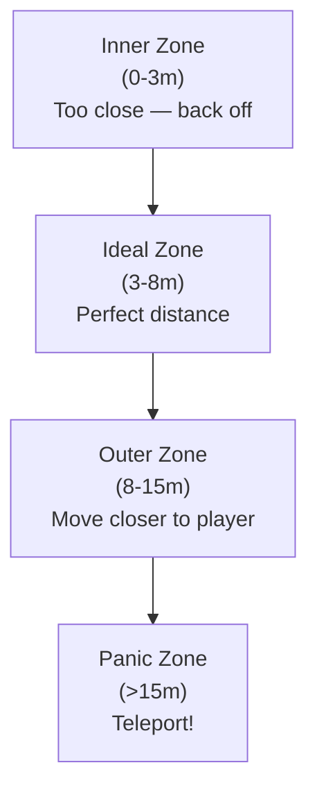

The **teleport** in the panic zone is the dirty secret of companion AI. When the companion falls too far behind (player sprinted ahead, level geometry blocked the path, or a door closed between them), the companion is simply teleported to a valid position near the player — but only when the player **cannot see the teleport destination**. This requires a visibility check:

1. Find candidate positions near the player
2. Reject any position visible to the player's camera
3. Reject any position visible to any enemy (would break stealth)
4. Pick the best remaining position and teleport instantly

::: warning "The Teleport Trick"
In The Last of Us, Naughty Dog reported that Ellie teleports frequently — sometimes multiple times per minute during fast traversal sections. Players almost never notice because the teleport only happens behind the camera or behind cover. **If the player doesn't see it, it didn't happen.**
:::

### 6.4. Buddy Positioning

One of the hardest problems in companion AI is **positioning**. The companion needs to:

1. **Stay visible** to the player (so the player doesn't think they're lost)
2. **Stay out of the way** (not block doorways, sightlines, or movement)
3. **Stay in cover** during combat (not stand in the open like an idiot)
4. **Stay relevant** (close enough to help, not so close they crowd the player)

This is solved with a **scoring system** over candidate positions:

$$
\text{score}(p) = w_1 \cdot \text{visibility}(p) + w_2 \cdot \text{cover}(p) + w_3 \cdot \text{distance}(p) + w_4 \cdot \text{clearance}(p)
$$

Where:

- $\text{visibility}(p)$ — Can the player see this position?
- $\text{cover}(p)$ — Is this position in cover from enemies?
- $\text{distance}(p)$ — Is the distance from the player in the ideal range?
- $\text{clearance}(p)$ — Does this position avoid blocking the player's movement and sightlines?

The companion constantly evaluates nearby positions and moves to the highest-scoring one. This is essentially **utility-based decision-making** (from Week 3) applied to positioning.

Here is a simple C++ implementation of the position scorer:

```cpp
struct CandidatePosition {
    Vec3 pos;
    float visibilityScore;  // 1.0 if player can see it, 0.0 if not
    float coverScore;       // 1.0 if behind full cover, 0.0 if exposed
    float distanceScore;    // 1.0 at ideal range, drops off both sides
    float clearanceScore;   // 1.0 if not blocking anything, 0.0 if blocking
};

float CompanionAI::scorePosition(const CandidatePosition& p) const {
    // Weights change based on player state
    float wVis, wCover, wDist, wClear;
    switch (currentPlayerState) {
        case PlayerState::Sneaking:
            wVis = 0.1f; wCover = 0.5f; wDist = 0.2f; wClear = 0.2f;
            break;
        case PlayerState::Fighting:
            wVis = 0.2f; wCover = 0.4f; wDist = 0.1f; wClear = 0.3f;
            break;
        default: // Exploring
            wVis = 0.3f; wCover = 0.1f; wDist = 0.4f; wClear = 0.2f;
            break;
    }
    return wVis * p.visibilityScore + wCover * p.coverScore
         + wDist * p.distanceScore + wClear * p.clearanceScore;
}
```

Notice how the **weights shift based on player state**: during stealth, cover matters most; during combat, cover and clearance dominate; during exploration, distance and visibility are prioritized.

### 6.5. Stealth Synchronization

The hardest scenario for companion AI is **stealth**. The player is sneaking past enemies, and the companion must:

1. Not be detected by enemies (or the player's stealth is blown)
2. Not block the player's path
3. Not make noise
4. Still keep up with the player

Most games solve this with **selective enemy perception**: enemies simply cannot see or hear the companion during stealth sequences. This is a deliberate cheat — and it's the right design choice. Naughty Dog's Max Dyckhoff explained this in his GDC talk: players blamed the _companion_ for breaking stealth, even when it was technically the player's fault. Making the companion invisible to enemies during stealth removed the frustration entirely.

The companion still needs to _appear_ to be sneaking. It crouches, moves slowly, hugs walls, and hides behind cover — all of which are cosmetic behaviors that sell the illusion of a competent stealth partner.

### 6.6. Companion Barks and Emotional Illusion

Companions create emotional connection through **contextual voice lines** (barks). These are triggered by game events and create the illusion of awareness:

| Trigger                          | Bark Example                        | Design Purpose          |
| -------------------------------- | ----------------------------------- | ----------------------- |
| Player low health                | "You okay? That looks bad..."       | Show concern            |
| Player picks up ammo             | "Nice find!"                        | Acknowledge exploration |
| Entering new area                | "Whoa... look at this place."       | Share discovery         |
| Enemy patrol spotted             | "Look — over there. Stay quiet."    | Warn player naturally   |
| Long silence                     | "So... what's your favorite color?" | Fill dead air, humanize |
| Player killed enemy dramatically | "That was intense."                 | React to player action  |

The bark system has a **cooldown** and **priority queue** to avoid talking over important events or being too chatty. The resulting system — tethering + positioning + selective perception + barks — creates the _illusion_ of a real companion, using mostly simple systems layered together.

!!! quiz
{
"title": "Companion AI",
"question": "Why does companion AI require a model of the player's behavior?",
"options": ["To control the player's movement", "To decide when to end the level", "To adapt its behavior (hiding when sneaking, fighting when in combat) based on what the player is doing", "To display a minimap indicator"],
"answers": ["To adapt its behavior (hiding when sneaking, fighting when in combat) based on what the player is doing"]
}
!!!

!!! quiz
{
"title": "Companion Tethering",
"question": "What does the companion AI do when the player gets too far ahead and the companion is in the 'panic zone'?",
"options": ["The companion gives up and despawns", "The companion sprints at maximum speed toward the player", "The companion teleports to a position the player cannot see", "The companion calls out for the player to wait"],
"answers": ["The companion teleports to a position the player cannot see"]
}
!!!

---

## 7. Designing a Multi-Agent System in C++

Now let's build a multi-agent coordination system from scratch in C++. We'll implement a blackboard, a token pool, a squad coordinator, and agents that use them.

### 7.1. Data Structures

Our system has three core components:

- **Blackboard**: Shared knowledge base (key-value store with typed entries)
- **TokenPool**: Controls the rate of agent actions
- **SquadCoordinator**: Assigns roles and manages the squad

### 7.2. Blackboard Implementation

```cpp
#include <string>
#include <unordered_map>
#include <variant>
#include <vector>
#include <iostream>
#include <optional>
#include <algorithm>
#include <functional>

// A blackboard entry can hold different types of knowledge.
struct Vec3 {
    float x, y, z;
    Vec3 operator-(const Vec3& o) const { return {x-o.x, y-o.y, z-o.z}; }
    float lengthSq() const { return x*x + y*y + z*z; }
    float length() const { return std::sqrt(lengthSq()); }
};

using BBValue = std::variant<int, float, bool, Vec3, std::string>;

class Blackboard {
    struct Entry {
        BBValue value;
        float timestamp;     // when this knowledge was posted
        int sourceId;        // which agent posted it
    };

    std::unordered_map<std::string, Entry> data;

public:
    // Post knowledge to the blackboard.
    void post(const std::string& key, const BBValue& value, int sourceId, float time) {
        data[key] = Entry{value, time, sourceId};
    }

    // Query knowledge from the blackboard.
    std::optional<BBValue> query(const std::string& key) const {
        auto it = data.find(key);
        if (it != data.end())
            return it->second.value;
        return std::nullopt;
    }

    // Query with staleness check — ignore data older than maxAge seconds.
    std::optional<BBValue> query(const std::string& key, float currentTime, float maxAge) const {
        auto it = data.find(key);
        if (it != data.end() && (currentTime - it->second.timestamp) <= maxAge)
            return it->second.value;
        return std::nullopt;
    }

    // Check if a key exists.
    bool has(const std::string& key) const {
        return data.count(key) > 0;
    }

    // Remove a key.
    void erase(const std::string& key) {
        data.erase(key);
    }

    // Remove all entries older than maxAge (garbage collection).
    void purgeStale(float currentTime, float maxAge) {
        for (auto it = data.begin(); it != data.end(); ) {
            if ((currentTime - it->second.timestamp) > maxAge)
                it = data.erase(it);
            else
                ++it;
        }
    }

    // Debug: dump all entries.
    void dump() const {
        for (const auto& [key, entry] : data) {
            std::cout << "    [BB] " << key << " (from agent "
                      << entry.sourceId << " at t=" << entry.timestamp << ")\n";
        }
    }
};
```

::: note "Staleness"
The `query` overload with `maxAge` is critical for game AI. If an NPC spotted an enemy 10 seconds ago but hasn't seen them since, the "enemy position" on the blackboard is **stale**. Agents should treat stale data with suspicion — perhaps investigating the last known position rather than blindly attacking it.
:::

The `purgeStale` method is important for long-running games. Without it, the blackboard would accumulate entries forever, wasting memory and potentially causing agents to read ancient, irrelevant data.

### 7.3. Token Pool Implementation

The token pool controls how many agents can perform specific actions simultaneously. This is the missing piece that ties the token system theory (Section 5) to code:

```cpp
class TokenPool {
public:
    enum TokenType { ATTACK, FLANK, SPECIAL, TOKEN_COUNT };

private:
    struct TokenSlot {
        int maxTokens;          // maximum concurrent holders
        int currentHolders;     // how many agents currently hold this token
        float cooldownTime;     // seconds before a returned token becomes available
        float lastReturnTime;   // when the last token was returned
    };

    TokenSlot slots[TOKEN_COUNT];

public:
    TokenPool() {
        // Default: 2 attack tokens, 1 flank token, 1 special token
        slots[ATTACK]  = {2, 0, 0.5f, -999.0f};
        slots[FLANK]   = {1, 0, 1.0f, -999.0f};
        slots[SPECIAL] = {1, 0, 2.0f, -999.0f};
    }

    // Request a token. Returns true if granted.
    bool requestToken(TokenType type) {
        auto& s = slots[type];
        if (s.currentHolders < s.maxTokens) {
            s.currentHolders++;
            return true;
        }
        return false;
    }

    // Return a token after use.
    void returnToken(TokenType type, float currentTime) {
        auto& s = slots[type];
        if (s.currentHolders > 0) {
            s.currentHolders--;
            s.lastReturnTime = currentTime;
        }
    }

    // Check if a token is available (respecting cooldown).
    bool isAvailable(TokenType type, float currentTime) const {
        const auto& s = slots[type];
        bool hasCapacity = s.currentHolders < s.maxTokens;
        bool cooldownElapsed = (currentTime - s.lastReturnTime) >= s.cooldownTime;
        return hasCapacity && cooldownElapsed;
    }

    // Configure token limits (for difficulty scaling).
    void configure(TokenType type, int maxTokens, float cooldown) {
        slots[type].maxTokens = maxTokens;
        slots[type].cooldownTime = cooldown;
    }
};
```

Notice the `configure` method — this is exactly how the difficulty scaling from Section 5.6 connects. A difficulty manager calls `tokens.configure(TokenPool::ATTACK, 1, 2.0f)` for Easy mode and `tokens.configure(TokenPool::ATTACK, 3, 0.3f)` for Veteran mode.

### 7.3. Agent Base Class

```cpp
enum class Role { NONE, SUPPRESSOR, FLANKER, RUSHER, SCOUT, DEFENDER };

class Agent {
protected:
    int id;
    Role role = Role::NONE;
    Vec3 position;
    float health;
    Blackboard* blackboard;  // shared between squad members

public:
    Agent(int id, Vec3 pos, float hp, Blackboard* bb)
        : id(id), position(pos), health(hp), blackboard(bb) {}

    virtual ~Agent() {}

    int getId() const { return id; }
    Role getRole() const { return role; }
    void setRole(Role r) { role = r; }
    Vec3 getPosition() const { return position; }
    float getHealth() const { return health; }

    // Each agent updates its perception and posts to the blackboard.
    virtual void perceive(float time) = 0;

    // Each agent decides its action based on role and blackboard data.
    virtual void decide(TokenPool& tokens, float time) = 0;

    // Execute the chosen action.
    virtual void act(float dt) = 0;

    virtual std::string getName() const = 0;
};
```

!!! quiz
{
"title": "Blackboard Usage",
"question": "Why does each Agent hold a pointer to a shared Blackboard instead of its own copy?",
"options": ["To save memory only", "So that when one agent posts knowledge (e.g., enemy position), all squad members can immediately query it", "Because agents don't need knowledge", "To prevent agents from reading each other's data"],
"answers": ["So that when one agent posts knowledge (e.g., enemy position), all squad members can immediately query it"]
}
!!!

### 7.4. Concrete Agent: Soldier

```cpp
class Soldier : public Agent {
    std::string currentAction = "idle";

public:
    Soldier(int id, Vec3 pos, float hp, Blackboard* bb)
        : Agent(id, pos, hp, bb) {}

    void perceive(float time) override {
        // Simulate perception: post our position and what we "see."
        blackboard->post("agent_" + std::to_string(id) + "_pos", position, id, time);

        // Simulate seeing an enemy (in a real game, this comes from raycasts/sensors).
        if (id == 0) { // Only agent 0 "sees" the enemy for this demo
            blackboard->post("enemy_pos", Vec3{50.0f, 0.0f, 30.0f}, id, time);
            blackboard->post("enemy_visible", true, id, time);
        }
    }

    void decide(TokenPool& tokens, float time) override {
        // Query the blackboard for enemy information.
        auto enemyPos = blackboard->query("enemy_pos", time, 5.0f);
        auto enemyVisible = blackboard->query("enemy_visible");

        bool hasEnemy = enemyPos.has_value() && enemyVisible.has_value();

        switch (role) {
            case Role::SUPPRESSOR:
                if (hasEnemy && tokens.requestToken(TokenPool::ATTACK)) {
                    currentAction = "suppressing fire";
                } else {
                    currentAction = "holding position";
                }
                break;

            case Role::FLANKER:
                if (hasEnemy && tokens.requestToken(TokenPool::FLANK)) {
                    currentAction = "flanking left";
                } else if (hasEnemy) {
                    currentAction = "moving to flank position";
                } else {
                    currentAction = "advancing cautiously";
                }
                break;

            case Role::RUSHER:
                if (hasEnemy && tokens.requestToken(TokenPool::ATTACK)) {
                    currentAction = "rushing enemy";
                } else {
                    currentAction = "waiting for opening";
                }
                break;

            case Role::DEFENDER:
                currentAction = "defending position";
                break;

            default:
                currentAction = "idle";
                break;
        }
    }

    void act(float dt) override {
        // In a real game, this would execute movement, animation, etc.
        std::cout << "  [" << getName() << " | " << roleToString(role) << "] "
                  << currentAction << std::endl;
    }

    std::string getName() const override {
        return "Soldier_" + std::to_string(id);
    }

    static std::string roleToString(Role r) {
        switch (r) {
            case Role::SUPPRESSOR: return "Suppressor";
            case Role::FLANKER:    return "Flanker";
            case Role::RUSHER:     return "Rusher";
            case Role::SCOUT:      return "Scout";
            case Role::DEFENDER:   return "Defender";
            default:               return "None";
        }
    }
};
```

### 7.5. Squad Coordinator

The squad coordinator is the tactical layer — it assigns roles based on the current situation.

```cpp
class SquadCoordinator {
    std::vector<Agent*> members;
    Blackboard* blackboard;

public:
    SquadCoordinator(Blackboard* bb) : blackboard(bb) {}

    void addMember(Agent* agent) {
        members.push_back(agent);
    }

    // Assign roles based on squad composition and tactical situation.
    void assignRoles() {
        if (members.empty()) return;

        auto enemyPos = blackboard->query("enemy_pos");
        bool hasEnemy = enemyPos.has_value();

        if (!hasEnemy) {
            // No enemy known: everyone scouts.
            for (auto* m : members)
                m->setRole(Role::SCOUT);
            return;
        }

        // Simple role assignment strategy:
        // First agent: suppressor (cover fire)
        // Last agent: defender (protect rear)
        // Middle agents: alternate between flanker and rusher
        for (size_t i = 0; i < members.size(); i++) {
            if (i == 0) {
                members[i]->setRole(Role::SUPPRESSOR);
            } else if (i == members.size() - 1) {
                members[i]->setRole(Role::DEFENDER);
            } else if (i % 2 == 1) {
                members[i]->setRole(Role::FLANKER);
            } else {
                members[i]->setRole(Role::RUSHER);
            }
        }
    }

    // Run one tick of the squad AI loop.
    void update(TokenPool& tokens, float time, float dt) {
        // 1. Each agent perceives.
        for (auto* m : members)
            m->perceive(time);

        // 2. Coordinator assigns roles based on current knowledge.
        assignRoles();

        // 3. Each agent decides (using roles, blackboard, and tokens).
        for (auto* m : members)
            m->decide(tokens, time);

        // 4. Each agent acts.
        for (auto* m : members)
            m->act(dt);
    }
};
```

### 7.6. Putting It All Together

```cpp
int main() {
    // Shared systems.
    Blackboard blackboard;
    TokenPool tokens;

    // Create a squad of 4 soldiers.
    Soldier s0(0, Vec3{10, 0, 10}, 100, &blackboard);
    Soldier s1(1, Vec3{12, 0, 10}, 100, &blackboard);
    Soldier s2(2, Vec3{14, 0, 10}, 100, &blackboard);
    Soldier s3(3, Vec3{16, 0, 10}, 100, &blackboard);

    // Set up the squad coordinator.
    SquadCoordinator squad(&blackboard);
    squad.addMember(&s0);
    squad.addMember(&s1);
    squad.addMember(&s2);
    squad.addMember(&s3);

    // Simulate 5 ticks.
    for (int tick = 0; tick < 5; tick++) {
        float time = tick * 0.5f;
        std::cout << "=== Tick " << tick << " (t=" << time << "s) ===" << std::endl;
        squad.update(tokens, time, 0.5f);

        // Return tokens after each tick (simulate cooldown).
        tokens.returnToken(TokenPool::ATTACK, time);
        tokens.returnToken(TokenPool::FLANK, time);
        std::cout << std::endl;
    }

    return 0;
}
```

Running this produces output like:

```
=== Tick 0 (t=0s) ===
  [Soldier_0 | Suppressor] suppressing fire
  [Soldier_1 | Flanker] flanking left
  [Soldier_2 | Rusher] waiting for opening
  [Soldier_3 | Defender] defending position

=== Tick 1 (t=0.5s) ===
  [Soldier_0 | Suppressor] suppressing fire
  [Soldier_1 | Flanker] moving to flank position
  [Soldier_2 | Rusher] rushing enemy
  [Soldier_3 | Defender] defending position
```

Notice how tokens naturally create variety: in tick 0, the suppressor and flanker get tokens, but the rusher has to wait. In tick 1, the rusher gets a token while the flanker doesn't. No scripting was needed — the token system and role assignment produce diverse, coordinated behavior.

### 7.7. Adding an Event Bus

Our system uses the blackboard for shared state, but we also need **event-driven** communication for discrete occurrences. Here's a lightweight event bus that integrates with our architecture:

```cpp
class EventBus {
public:
    enum EventType {
        ENEMY_SPOTTED, ENEMY_DOWN, AGENT_HIT, AGENT_DOWN,
        NEED_BACKUP, AREA_CLEAR, GRENADE_THROWN
    };

    struct Event {
        EventType type;
        int senderId;
        Vec3 position;
        float timestamp;
    };

private:
    using Callback = std::function<void(const Event&)>;

    struct Subscriber {
        int agentId;
        Callback callback;
    };

    std::unordered_map<EventType, std::vector<Subscriber>> subscribers;
    std::vector<Event> pendingEvents;  // queue for deferred processing

public:
    void subscribe(EventType type, int agentId, Callback cb) {
        subscribers[type].push_back({agentId, cb});
    }

    // Fire an event immediately (synchronous).
    void fireImmediate(const Event& event) {
        auto it = subscribers.find(event.type);
        if (it != subscribers.end()) {
            for (auto& sub : it->second)
                sub.callback(event);
        }
    }

    // Queue an event for deferred processing (asynchronous).
    void queueEvent(const Event& event) {
        pendingEvents.push_back(event);
    }

    // Process all queued events (called once per frame).
    void processQueue() {
        for (const auto& event : pendingEvents)
            fireImmediate(event);
        pendingEvents.clear();
    }
};
```

Now agents can both **read shared state** from the blackboard and **respond to discrete events** through the event bus. For example, when an agent spots an enemy:

```cpp
void Soldier::perceive(float time) {
    blackboard->post("agent_" + std::to_string(id) + "_pos", position, id, time);

    if (canSeeEnemy()) {
        Vec3 enemyPos = getEnemyPosition();
        // Post to blackboard for persistent access
        blackboard->post("enemy_pos", enemyPos, id, time);
        blackboard->post("enemy_visible", true, id, time);

        // Fire event for immediate reactions (duck, look, bark)
        eventBus->queueEvent({
            EventBus::ENEMY_SPOTTED, id, enemyPos, time
        });
    }
}
```

::: tip "Extending the System"
This implementation is intentionally minimal. In a production system, you would add:

- **Perception with raycasting** instead of simulated "seeing"
- **Dynamic role reassignment** when agents die or conditions change
- **Cost-based role assignment** (assign the agent closest to the flank route as the flanker)
- **Integration with GOAP/BT** at the individual layer instead of the simple switch statement
- **Memory** — agents remember where they last saw the enemy and investigate that position
- **Communication delay** — events propagate with a small delay to simulate radio chatter
  :::

---

## 8. The F.E.A.R. Communication Illusion Revisited

### 8.1. Independent Planning, Coordinated Appearance

In Week 11, we mentioned that F.E.A.R.'s NPCs appear to coordinate but actually plan independently. Now that we understand multi-agent patterns, we can see exactly **why** this works:

1. **Shared world state** acts as a blackboard — all NPCs read the same enemy positions, cover locations, and world conditions
2. **Cost-based planning** naturally differentiates behavior — if the direct path is blocked for NPC A, its planner chooses flanking; NPC B, with a clear line of sight, chooses to suppress
3. **Token-like constraints** prevent identical actions — F.E.A.R. uses limited "attack slots" and "speak slots" that function as tokens
4. **Retroactive narration** — voice lines are played **after** the planner decides, creating the illusion of communication

This is a powerful insight: you don't always need **explicit** coordination. Sometimes, independent agents sharing the same knowledge and operating under the same constraints will **appear** coordinated.

### 8.2. The Voice Line System in Detail

F.E.A.R.'s voice line system deserves special attention because it's a masterclass in creating coordination illusion with minimal cost. The system works in three stages:

**Stage 1 — Decision**: The GOAP planner decides what each NPC will do. NPC A decides to flank. NPC B decides to suppress.

**Stage 2 — Announcement**: Before executing, each NPC checks if a voice line is available for its action. NPC A says "I'm flanking left!" NPC B says "Covering fire!" A **speak token** ensures only one NPC talks at a time, and a cooldown prevents constant chatter.

**Stage 3 — Execution**: The NPC performs the action. The player hears the voice line before seeing the action, which creates a causal narrative: "The NPC said it would flank, and then it flanked — they're communicating!"

In reality, the voice line was selected _after_ the decision was already made. The NPCs didn't "communicate" — they narrated their independent decisions. But the player perceives it as a team working together.

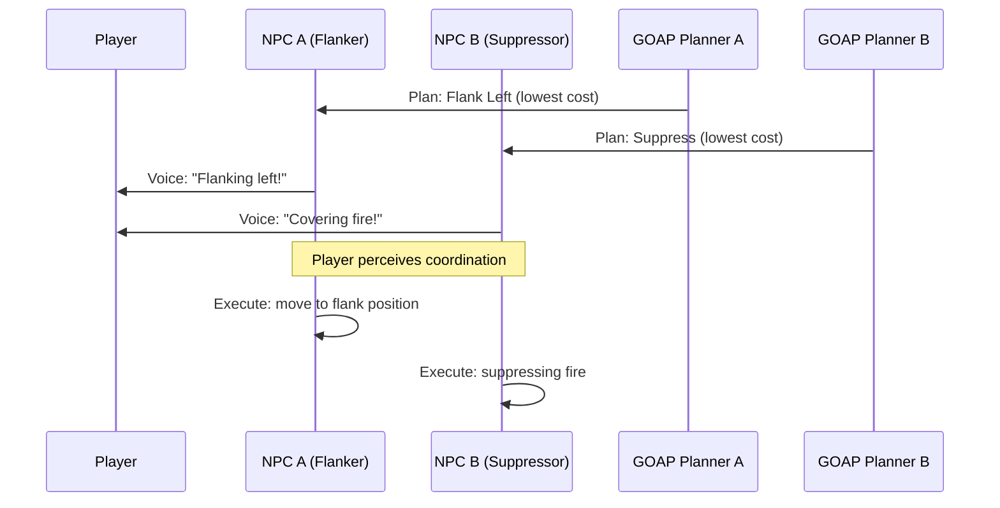

### 8.3. When Explicit Coordination Is Needed

F.E.A.R.'s approach works for **small squads** (3-5 NPCs) in **tight spaces** (corridors, rooms). It breaks down when:

- You have **many agents** (20+) — too many independent planners will make nearly identical decisions
- You need **guaranteed roles** — F.E.A.R. can't guarantee one NPC will flank; it hopes the planner discovers it
- You need **long-term tactics** — independent planning is greedy; it optimizes for the current moment, not a multi-step squad maneuver
- You need **formation movement** — marching in formation requires explicit coordination that emergent behavior can't reliably produce

That's when you need the explicit hierarchical approach (Killzone) or a dedicated squad coordinator.

### 8.4. Hybrid Approaches

Modern games often combine both approaches:

| Layer             | Approach              | Example                                           |
| ----------------- | --------------------- | ------------------------------------------------- |
| **Squad tactics** | Explicit coordination | Coordinator assigns: "You flank, you suppress"    |
| **Individual AI** | Independent planning  | Each NPC plans _how_ to execute its role via GOAP |
| **Voice lines**   | Retroactive narration | NPCs announce their planned actions               |

This gives you the **reliability** of explicit coordination at the tactical level and the **naturalness** of independent planning at the individual level. The coordinator guarantees that someone flanks; the individual GOAP planner figures out the best flanking route.

!!! quiz
{
"title": "F.E.A.R. Coordination",
"question": "Why do F.E.A.R.'s NPCs appear to coordinate, even though each one plans independently?",
"options": ["A central controller scripts their behaviors", "They share the same world state, have cost-based planning diversity, and voice lines are added after decisions", "The designers hand-authored every squad encounter", "They use a hierarchical AI system with strategic and tactical layers"],
"answers": ["They share the same world state, have cost-based planning diversity, and voice lines are added after decisions"]
}
!!!

!!! quiz
{
"title": "Voice Line Timing",
"question": "At what point in F.E.A.R.'s AI pipeline are voice lines like 'Flanking left!' selected?",
"options": ["Before the GOAP planner runs, to set intent", "During planning, as a plan step", "After the planner decides the action, but before execution", "After the action is fully complete"],
"answers": ["After the planner decides the action, but before execution"]
}
!!!

---

## 9. Communication Architecture Comparison

| Aspect                 | Direct Messaging                       | Blackboard                                | Hierarchical                              | Event Bus (Pub/Sub)                     |
| ---------------------- | -------------------------------------- | ----------------------------------------- | ----------------------------------------- | --------------------------------------- |
| **Coupling**           | High — agents know each other          | Low — agents only know the blackboard     | Medium — layers know adjacent layers      | Low — publishers don't know subscribers |
| **Scalability**        | Poor — $O(n^2)$ message pairs          | Good — $O(n)$ reads/writes                | Good — tree structure scales well         | Good — $O(n)$ per event                 |
| **Emergent behavior**  | None — fully prescribed                | High — agents react to evolving knowledge | Medium — constrained by role assignments  | Medium — depends on handler logic       |
| **Guaranteed tactics** | Yes — you script exactly who does what | No — agents may all reach same conclusion | Yes — coordinator assigns specific roles  | No — event handling is per-agent        |
| **Debugging**          | Easy — trace messages                  | Medium — inspect blackboard state         | Easy — inspect role assignments per layer | Medium — trace event flow               |
| **CPU cost**           | Low — direct function calls            | Low-Medium — hash lookups                 | Low — tree traversal                      | Low — callback dispatch                 |
| **Persistence**        | None — fire and forget                 | Yes — blackboard retains knowledge        | Yes — roles persist until reassigned      | None — events are consumed              |
| **Best for**           | Simple 2-agent interactions            | Decoupled knowledge sharing, perception   | Squads, formations, large-scale battles   | Discrete events, reactions, alerts      |
| **Real examples**      | Simple escort missions                 | F.E.A.R. (shared world state)             | Killzone 2/3, Halo Wars                   | Sound propagation, achievement systems  |

The key insight is that these architectures are **not mutually exclusive**. Most shipped games use a combination:

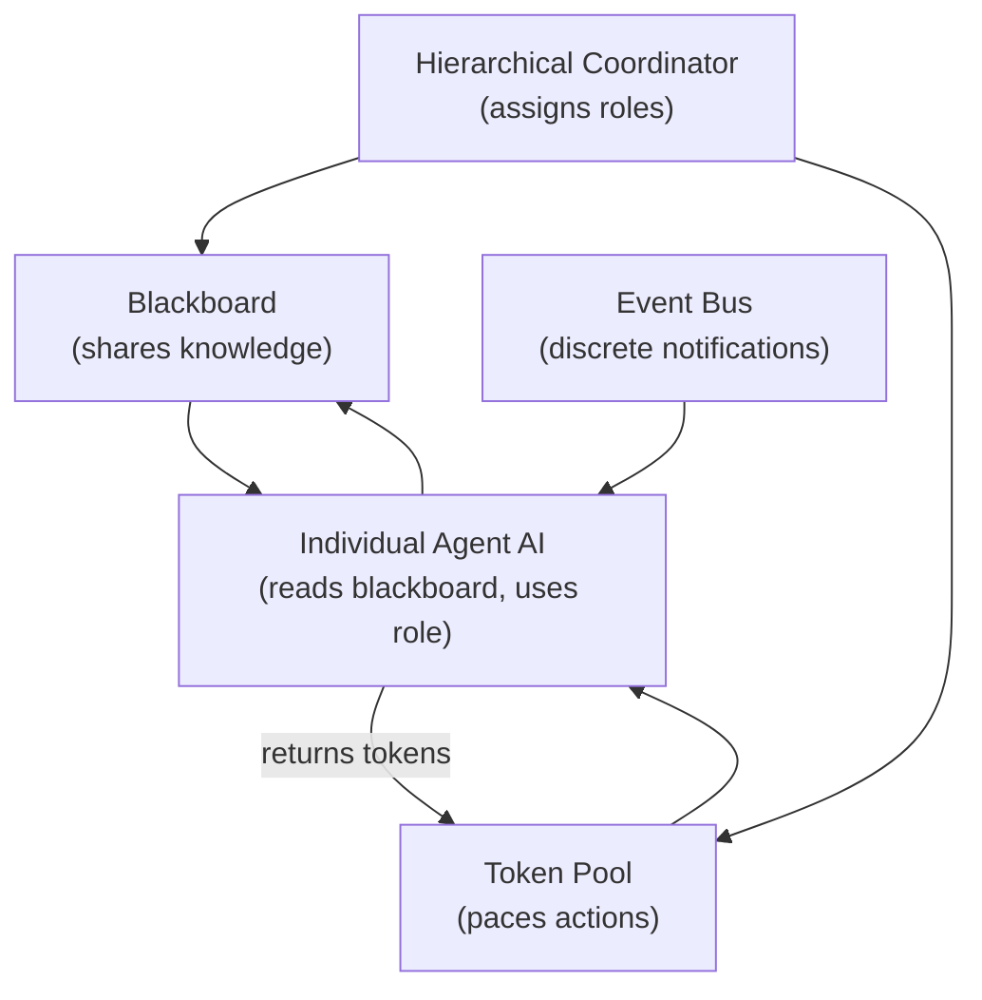

::: tip "Rule of Thumb"
Use a **blackboard** when agents need to share knowledge without explicit commands. Use a **hierarchical system** when you need guaranteed tactical roles and scalable squad management. Use an **event bus** for discrete notifications (enemy spotted, agent died). Use **tokens** regardless of your communication architecture — they solve the pacing problem independently.
:::

### 9.1. Decision Matrix: Choosing Your Architecture

When designing a multi-agent system for your game, ask these questions:

1. **How many agents?** 2-5 → direct messaging or blackboard. 6-20 → hierarchical. 20+ → hierarchical with sub-squads.
2. **Do you need guaranteed tactics?** Yes → hierarchical. No → blackboard + independent planning (F.E.A.R. style).
3. **How important is emergent behavior?** Critical → blackboard. Nice-to-have → hierarchical with GOAP at individual layer.
4. **Frame budget for AI?** Tight → blackboard (cheap lookups). Generous → hierarchical + planner per agent.
5. **Debugging priority?** High → hierarchical (roles visible). Medium → event bus (traceable). Low → blackboard (emergent but hard to trace).

---

## 10. Beyond Squad AI: Multi-Agent Frontiers

### 10.1. Influence Maps (Preview: Week 13)

Influence maps extend multi-agent coordination with **spatial reasoning**. Instead of just knowing "enemy at position X," agents maintain a heat map of the world showing areas of friendly control, enemy threat, and strategic value.

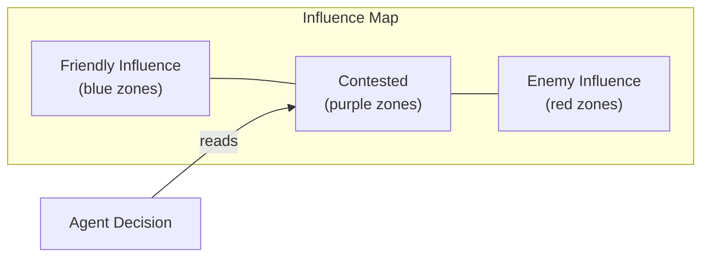

The influence map is typically a **grid overlay** on the game world. Each cell stores a floating-point influence value. Friendly units add positive influence; enemy units add negative influence. Influence **decays** with distance from the source (using a falloff function like $I(d) = I_0 \cdot e^{-kd}$) and **fades** over time if not refreshed (simulating the uncertainty of old intelligence).

Agents use the influence map for spatial reasoning:

| Decision                     | Influence Map Query                                                   |
| ---------------------------- | --------------------------------------------------------------------- |
| "Where is safe?"             | Find cells with high friendly influence, low enemy influence          |
| "Where is the front line?"   | Find cells where friendly and enemy influence are roughly equal       |
| "Where should I flank?"      | Find cells with low total influence (gaps in both armies' coverage)   |
| "Where should I retreat to?" | Find the nearest cell with strong friendly influence behind the agent |

This gives agents spatial awareness beyond individual positions — they can reason about "which areas are safe?" and "where is the front line?" We'll cover this in detail next week.

### 10.2. Emergent Multi-Agent Behaviors

When well-designed multi-agent systems combine blackboards, tokens, and role assignment, **emergent behaviors** arise that weren't explicitly programmed:

- **Coordinated retreats**: When multiple agents on the blackboard report low health, the squad coordinator switches from "assault" to "fallback" — no one programmed "retreat" as a squad behavior.
- **Adaptive difficulty**: Token systems naturally create easier encounters when some NPCs are occupied (e.g., one NPC is suppressing, leaving fewer tokens for others to attack), scaling difficulty with player skill.
- **Dynamic flanking**: A hierarchical system assigns a flanker role; the flanker's individual AI discovers the best route. If that route is blocked, it finds another. The tactical layer doesn't need to know the details.
- **Pack hunting**: Multiple agents with independent utility-based AI converge on the same prey, creating realistic wolf-pack behavior. Each agent evaluates "closest vulnerable target" independently, but the pack naturally distributes across multiple targets when close ones are already being hunted (because the "already being attacked" signal on the blackboard reduces utility).
- **Morale cascades**: When an agent is killed, the event propagates to allies. Each ally's individual AI reduces its aggression based on how many allies are down. The result is a realistic morale collapse: one death triggers cautious behavior, two deaths trigger retreat, three deaths trigger panic — all emergent from individual responses to shared state.

### 10.3. Multi-Agent Pathfinding

When multiple agents navigate simultaneously, standard A\* creates traffic jams. Several solutions exist:

- **Cooperative A\*** — agents plan paths that avoid each other's future positions. Computationally expensive but produces clean results.
- **Velocity Obstacles (VO)** — each agent treats other moving agents as obstacles in velocity space. The agent picks a velocity outside all obstacle regions. This is fast and produces smooth avoidance.
- **Flow Fields** — instead of per-agent pathfinding, compute a single field from the target that all agents follow. Used heavily in RTS games with hundreds of units (e.g., Supreme Commander, Planetary Annihilation).

### 10.4. What We Didn't Cover

Multi-agent AI is a vast field. Topics left for future exploration:

- **Negotiation and Auction systems** — agents bid for resources or tasks
- **Stigmergy** — indirect communication through the environment (like ant pheromone trails)
- **Opponent modeling** — agents that build models of the player's strategy and adapt
- **Multi-agent reinforcement learning** — training coordinate behaviors through reward signals
- **Swarm intelligence** — massive groups with simple rules producing complex collective behavior (boids, ants, bees)

Each of these could fill an entire lecture. The techniques we've covered today — blackboards, hierarchical coordination, tokens, and companion AI — form the practical foundation that most shipped games use.

---

## Summary

This lecture covered the **practical systems** that make multi-agent coordination work in shipped games. Here's the complete map of what we covered and how it connects:

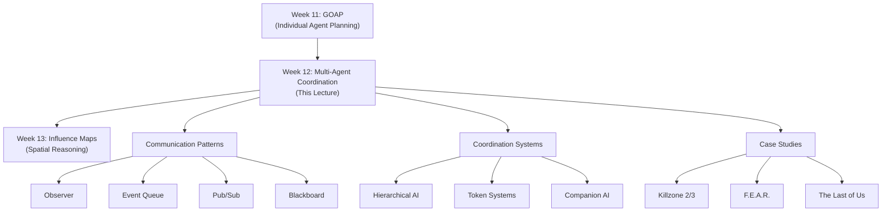

### Key Concepts

| Concept                 | Key Takeaway                                                                                      |
| ----------------------- | ------------------------------------------------------------------------------------------------- |
| Coordination Problem    | Independent agents converge on identical behavior — need mechanisms to diversify                  |
| Observer Pattern        | Direct synchronous notification — simple but can cause frame spikes with many agents              |
| Lapsed Listener         | Dangling observer references after destruction — use weak pointers or RAII guards                 |
| Event Queue             | Asynchronous ring-buffer communication — decouples in time, prevents blocking                     |
| Event Aggregation       | Combine duplicate events per frame to reduce processing cost                                      |
| Publish-Subscribe       | Topic-filtered messaging — agents only receive relevant events                                    |
| Blackboard Architecture | Shared knowledge base with knowledge sources and control shell — the core of game AI coordination |
| Knowledge Staleness     | Blackboard data decays in relevance — query with `maxAge` to ignore outdated information          |
| Knowledge Posting       | Agents write observations to the blackboard for others to read                                    |
| Knowledge Query         | Agents read information from the blackboard when they need it                                     |
| Hierarchical AI         | Strategic → Tactical → Individual layers, each at different abstraction and time scales           |
| Dynamic Role Assignment | Tactical layer assigns roles (suppressor, flanker, rusher) that constrain individual behavior     |
| Token System            | Limited resources that control how many agents perform specific actions simultaneously            |
| Token Cooldown          | Returned tokens have a delay before reuse — prevents rapid-fire repeated actions                  |
| Kung-Fu Circle          | The problem of unrealistic simultaneous actions — solved by tokens and time-slot scheduling       |
| Difficulty Scaling      | Adjusting token counts and cooldowns per difficulty level — same AI code, different constraints   |
| Buddy AI                | Companion agents that model the player's behavior and optimize positioning relative to them       |
| Tethering               | Concentric distance zones with teleportation fallback for companions that fall behind             |
| Stealth Synchronization | Making companions invisible to enemies during stealth — a justified design cheat                  |
| Retroactive Narration   | Voice lines chosen after AI decisions to create the illusion of communication (F.E.A.R.)          |
| Emergent Coordination   | Well-designed systems produce coordinated behaviors that weren't explicitly programmed            |

### The Three Things to Remember

If you forget everything else from this lecture, remember these three principles:

1. **Blackboards + Tokens = Coordination**. A shared blackboard for knowledge and a token pool for action pacing are sufficient to build believable multi-agent behavior in most games.

2. **Illusion over simulation**. F.E.A.R.'s NPCs don't actually communicate. Ellie in The Last of Us teleports when you're not looking. The goal isn't _real_ coordination — it's the _perception_ of coordination.

3. **Layers separate concerns**. Strategic AI decides _what_ to do at the squad level. Tactical AI decides _who_ does it. Individual AI decides _how_ to do it. Each layer can change independently.
