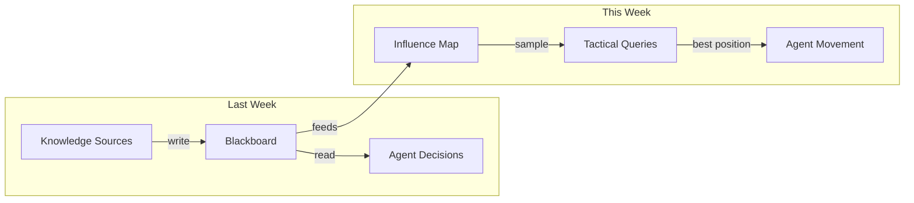
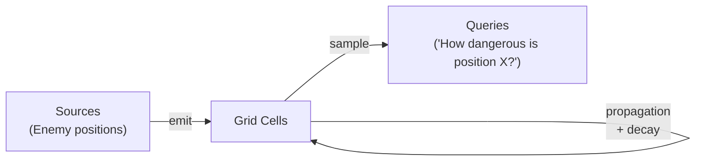
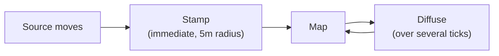
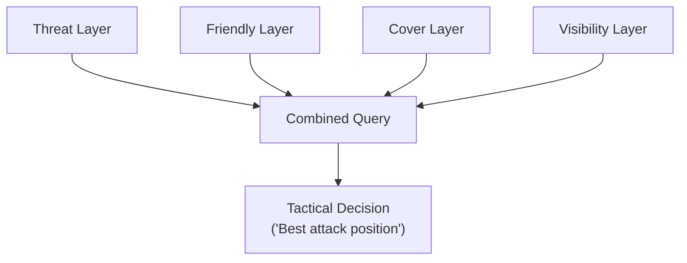
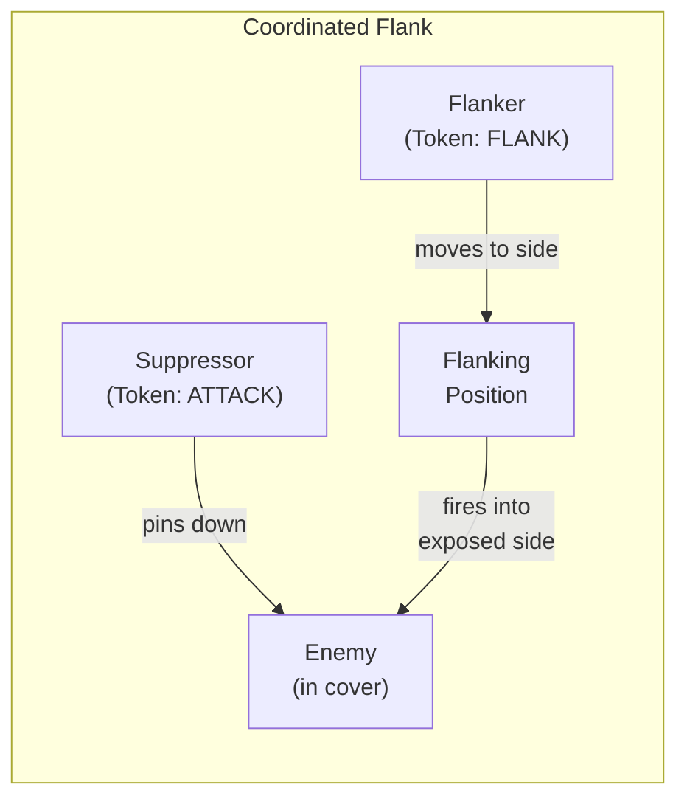
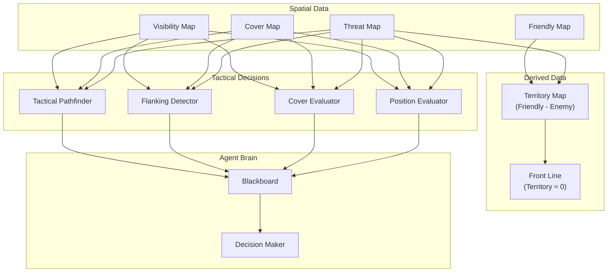
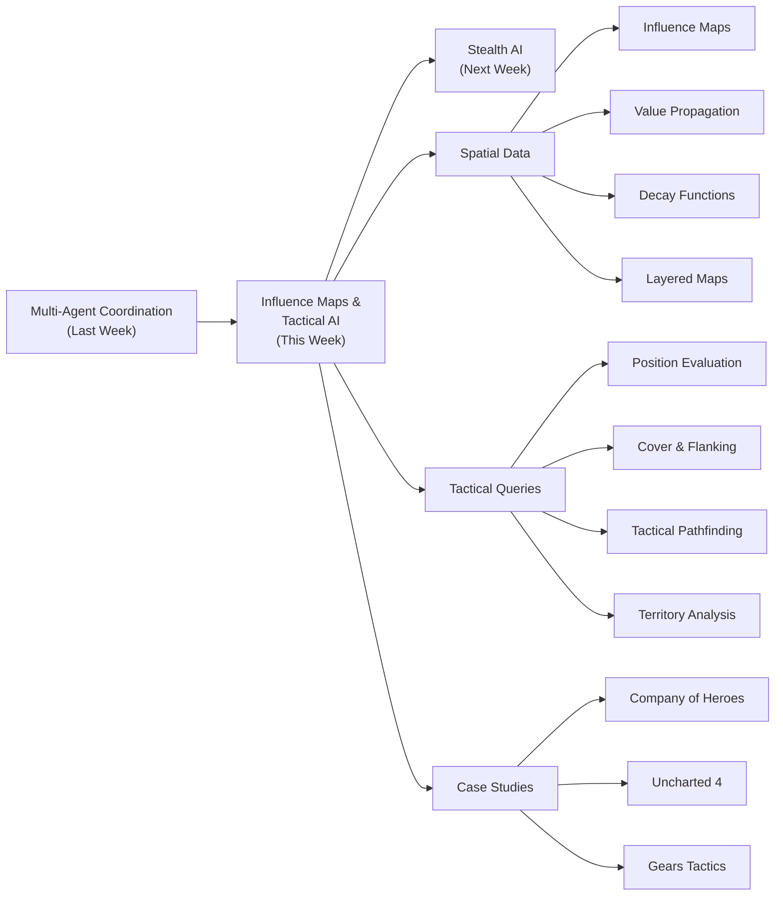

# Influence Maps & Tactical Position Evaluation

## From Discrete Facts to Continuous Spatial Fields

---

## Agenda

1. Why Spatial Reasoning Matters
2. Influence Maps: The Core Data Structure
3. Value Propagation and Decay
4. Layered Maps: Composing Spatial Intelligence
5. Tactical Position Evaluation
6. Cover Point Evaluation
7. Flanking Detection
8. Tactical Pathfinding
9. A Complete Tactical AI System
10. Case Studies, Advanced Topics & What Is Next

---

## From Single-Agent to Spatial AI

---

### Last Week → This Week

Last week we built multi-agent coordination — blackboards, token pools, hierarchical AI.

Those systems answer: **"What should each agent DO?"**

This week we answer a more fundamental question:

**"Where should each agent BE?"**

---

### The Gap in Our AI

Navigation (A\*, navmesh) tells an agent **how** to get somewhere.

But it says nothing about **whether** the destination is _tactically sound_.

```
Standard A*:  Finds shortest path → NPC runs straight at the player
              Result: NPC gets shot immediately. Looks stupid.

Tactical AI:  Evaluates positions → NPC moves cover-to-cover, flanks
              Result: NPC looks like it understands the battlefield.
```

The difference is not navigation — it is **spatial reasoning**.

---

### What an Agent Needs to Know About Space

| Question                   | Spatial Data Required                   |
| -------------------------- | --------------------------------------- |
| "Where is it dangerous?"   | Threat map                              |
| "Where is it safe?"        | Inverse threat + cover positions        |
| "Who controls this area?"  | Territory / ownership map               |
| "Best attack position?"    | Sight lines + cover + flanking angle    |
| "Safest path?"             | Threat-weighted pathfinding costs       |
| "Where should I retreat?"  | Safety gradient + distance to allies    |
| "Most contested resource?" | Friendly vs. enemy influence comparison |

An NPC might ask several of these questions **every second**.

We need a data structure that can answer them efficiently.

---

### From Blackboard to Influence Map



The blackboard stores **discrete facts** ("enemy at position X").

The influence map transforms those facts into a **continuous spatial field** that agents can sample anywhere.

---

### The Key Insight

```
Discrete knowledge:  "Enemy at (4, 2)"
                      ↓ propagation
Continuous field:    threat(x, y) = f(distance_to_enemy)
                      ↓ query
Tactical decision:   "Position (0, 4) has threat 0.05 — it's safe."
```

Influence maps turn **point data** into **spatial awareness**.

Every position in the world now has a threat level, an ownership value, a cover score — all queryable in $O(1)$.

---

## Influence Maps: The Core Data Structure

---

### What Is an Influence Map?

A spatial data structure that overlays the game world with a **grid** where each cell stores a numeric value — threat, ownership, resource value, visibility, etc.

Think of it as the AI's equivalent of a military **heat map**.

```
Influence Map (Threat Layer):

  0.0  0.0  0.0  0.0  0.1  0.0  0.0  0.0
  0.0  0.0  0.1  0.3  0.5  0.3  0.1  0.0
  0.0  0.1  0.3  0.6  0.8  0.6  0.3  0.1
  0.0  0.2  0.5  0.8  1.0  0.8  0.5  0.2    ← Enemy here
  0.0  0.1  0.3  0.6  0.8  0.6  0.3  0.1
  0.0  0.0  0.1  0.3  0.5  0.3  0.1  0.0
  0.0  0.0  0.0  0.0  0.1  0.0  0.0  0.0
```

The enemy at the center has threat 1.0, and it **propagates outward**, diminishing with distance.

---

### Anatomy of an Influence Map

An influence map has four essential components:

| Component          | Description                                        | Example                                |
| ------------------ | -------------------------------------------------- | -------------------------------------- |
| **Grid**           | Spatial tessellation dividing the world into cells | 64×64 grid, each cell = 2m × 2m        |
| **Sources**        | Entities that emit influence                       | Enemy units, friendly bases, resources |
| **Propagation**    | Algorithm that spreads influence from sources      | Flood fill, distance-based decay       |
| **Decay function** | How influence diminishes with distance             | Linear, exponential, inverse-square    |



---

### Grid Representation

The simplest representation: a **2D uniform grid** overlaid on the game world.

```cpp
struct InfluenceMap {
    int width;              // grid columns
    int height;             // grid rows
    float cellSize;         // world units per cell
    float originX, originY; // world-space origin of grid corner
    std::vector<float> cells;

    InfluenceMap(int w, int h, float cs, float ox = 0, float oy = 0)
        : width(w), height(h), cellSize(cs), originX(ox), originY(oy),
          cells(w * h, 0.0f) {}

    int worldToGridX(float wx) const {
        return static_cast<int>((wx - originX) / cellSize);
    }
    int worldToGridY(float wy) const {
        return static_cast<int>((wy - originY) / cellSize);
    }

    float get(int gx, int gy) const {
        if (gx < 0 || gx >= width || gy < 0 || gy >= height) return 0.0f;
        return cells[gy * width + gx];
    }

    float sampleWorld(float wx, float wy) const {
        return get(worldToGridX(wx), worldToGridY(wy));
    }
};
```

$O(1)$ access to any cell by world position — critical when dozens of agents query every frame.

---

### Resolution Trade-offs

| Resolution | Cell Size | Accuracy                      | Memory (128m × 128m) | Update Cost    |
| ---------- | --------- | ----------------------------- | -------------------- | -------------- |
| Low        | 4m        | Coarse — 4m blocks            | 32 × 32 = 1 KB       | Fast           |
| Medium     | 2m        | Good for most tactical AI     | 64 × 64 = 4 KB       | Moderate       |
| High       | 1m        | Fine-grained cover evaluation | 128 × 128 = 16 KB    | Expensive      |
| Very High  | 0.5m      | Sub-meter — usually overkill  | 256 × 256 = 64 KB    | Very expensive |

Most shipped games use **1–2 meter cells**.

> Memory is cheap (a 128×128 float grid is 64 KB). The expensive part is **updating** the map — propagating influence from dozens of sources across thousands of cells. Update frequency and propagation range matter more than resolution.

---

## Value Propagation and Decay

---

### How Influence Spreads

Influence radiates outward from sources and diminishes with distance — like heat diffusing through a material or signal strength decreasing from a radio tower.

The simplest algorithm: **stamp** a circular area around each source.

```cpp
void stampInfluence(InfluenceMap& map, float worldX, float worldY,
                    float strength, float radius) {
    int cx = map.worldToGridX(worldX);
    int cy = map.worldToGridY(worldY);
    int gridRadius = static_cast<int>(radius / map.cellSize) + 1;

    for (int dy = -gridRadius; dy <= gridRadius; ++dy) {
        for (int dx = -gridRadius; dx <= gridRadius; ++dx) {
            float dist = std::sqrt(float(dx*dx + dy*dy)) * map.cellSize;
            if (dist > radius) continue;

            float influence = strength * std::max(0.0f, 1.0f - dist / radius);
            int gx = cx + dx, gy = cy + dy;
            if (gx < 0 || gx >= map.width || gy < 0 || gy >= map.height)
                continue;

            // Max combination: take the stronger influence.
            int idx = gy * map.width + gx;
            map.cells[idx] = std::max(map.cells[idx], influence);
        }
    }
}
```

---

### Max vs. Sum: Choosing the Combination Function

The `std::max` in the stamp function is a design choice. When two sources overlap, how should values combine?

| Layer Type         | Combination | Reasoning                                              |
| ------------------ | ----------- | ------------------------------------------------------ |
| **Threat map**     | `max`       | Threat = the most dangerous nearby enemy, not the sum  |
| **Territory map**  | `sum`       | Multiple friendly units = stronger territorial control |
| **Resource value** | `sum`       | Multiple resource nodes = more valuable area           |

> A position between two enemies should feel as dangerous as the closer enemy, not twice as dangerous. But a position between two allied squads should feel twice as safe. The combination function depends on the semantic meaning of the layer.

---

### Decay Functions

The **decay function** determines how influence diminishes with distance.

This single choice dramatically affects AI behavior.

---

### Linear Decay

$$
I(d) = I_0 \cdot \max\left(0, 1 - \frac{d}{R}\right)
$$

',borderWidth:3,fill:false,pointRadius:0,tension:0}]},options:{plugins:{legend:{display:false}},scales:{x:{title:{display:true,text:'Distance (d/R)'},grid:{display:false}},y:{title:{display:true,text:'Influence'},min:0,max:1,grid:{color:'rgba(0,0,0,0.1)'}}}}}>)

**Properties:**

- Influence drops at a **constant rate**
- **Hard cutoff** at radius $R$ — zero influence beyond it
- Most common choice in games — intuitive for designers

"This enemy threatens everything within 20 meters, and the threat drops linearly."

---

### Exponential Decay

$$
I(d) = I_0 \cdot e^{-\lambda d}
$$

',borderWidth:3,fill:false,pointRadius:0,tension:0.4}]},options:{plugins:{legend:{display:false}},scales:{x:{title:{display:true,text:'Distance (d/R)'},grid:{display:false}},y:{title:{display:true,text:'Influence'},min:0,max:1,grid:{color:'rgba(0,0,0,0.1)'}}}}}>)

**Properties:**

- Drops **rapidly** near the source, **long soft tail** at distance
- No hard cutoff — theoretically extends to infinity
- Good for modeling vision — nearby enemies are very threatening, distant ones contribute unease

> Setting $\lambda = 3/R$ ensures influence drops to ~5% at radius $R$ (since $e^{-3} \approx 0.05$), giving designers a predictable "effective range."

---

### Inverse-Square Decay

$$
I(d) = \frac{I_0}{1 + d^2}
$$

',borderWidth:3,fill:false,pointRadius:0,tension:0.4}]},options:{plugins:{legend:{display:false}},scales:{x:{title:{display:true,text:'Distance (d/R)'},grid:{display:false}},y:{title:{display:true,text:'Influence'},min:0,max:1,grid:{color:'rgba(0,0,0,0.1)'}}}}}>)

**Properties:**

- Mirrors real-world physics (light, sound, gravity)
- Falls off very quickly close to the source, then maintains a low persistent level
- Good for modeling physical phenomena like sound or explosions

---

### Decay Comparison

',borderWidth:3,fill:false,pointRadius:0,tension:0},{label:'Exponential',data:[1.0,0.8869,0.7866,0.6977,0.6188,0.5488,0.4868,0.4317,0.3829,0.3396,0.3012,0.2671,0.2369,0.2101,0.1864,0.1653,0.1466,0.13,0.1153,0.1023,0.0907,0.0805,0.0714,0.0633,0.0561,0.0498],borderColor:'rgb(255,99,132)',borderWidth:3,fill:false,pointRadius:0,tension:0.4},{label:'Inverse-Square',data:[1.0,0.9858,0.9455,0.8853,0.8127,0.7353,0.6586,0.5863,0.5204,0.4616,0.4098,0.3646,0.3254,0.2912,0.2616,0.2358,0.2134,0.1937,0.1765,0.1613,0.1479,0.136,0.1255,0.116,0.1076,0.1],borderColor:'rgb(153,102,255)',borderWidth:3,fill:false,pointRadius:0,tension:0.4}]},options:{plugins:{legend:{display:true}},scales:{x:{title:{display:true,text:'Distance (d/R)'},grid:{display:false}},y:{title:{display:true,text:'Influence'},min:0,max:1,grid:{color:'rgba(0,0,0,0.1)'}}}}}>)

| Property           | Linear                          | Exponential                         | Inverse-Square            |
| ------------------ | ------------------------------- | ----------------------------------- | ------------------------- |
| Falloff rate       | Constant                        | Rapid near, slow far                | Very rapid near, slow far |
| Hard cutoff?       | Yes, at $R$                     | No (soft tail)                      | No (soft tail)            |
| Designer intuition | Easy — "20m range, linear drop" | Moderate — need $\lambda$ parameter | Hard — physics-like       |
| Best for           | Threat zones, territory         | Vision, awareness                   | Sound, explosions         |
| Computation        | Cheapest                        | One `exp()` call                    | One multiply + add        |

---

### Decay Implementation

```cpp
enum class DecayType { LINEAR, EXPONENTIAL, INVERSE_SQUARE };

float computeDecay(float strength, float distance, float radius,
                   DecayType type) {
    switch (type) {
        case DecayType::LINEAR:
            return strength * std::max(0.0f, 1.0f - distance / radius);

        case DecayType::EXPONENTIAL: {
            float lambda = 3.0f / radius;
            return strength * std::exp(-lambda * distance);
        }

        case DecayType::INVERSE_SQUARE:
            return strength / (1.0f + distance * distance);
    }
    return 0.0f;
}
```

The `lambda = 3.0f / radius` for exponential decay is a practical trick: $e^{-3} \approx 0.05$, so influence drops to ~5% at the specified radius.

---

### Propagation Strategies

Two main approaches for spreading influence across the grid.

---

### Strategy 1: Stamp-Based Propagation

Iterate over a circular area around each source and write values directly.

```
Time complexity: O(S × R²) per update
  S = number of sources
  R = grid-cell radius of influence
```

**Pros:**

- Simple, predictable
- No iterative convergence needed

**Cons:**

- Does **not** respect obstacles — influence passes through walls
- Expensive for large radii

---

### Strategy 2: Iterative Diffusion

Each cell spreads a fraction of its value to neighbors each tick — like heat diffusion.

```cpp
void diffuseInfluence(InfluenceMap& map, float spreadFactor,
                      float decayFactor) {
    std::vector<float> buffer(map.cells.size(), 0.0f);

    for (int y = 0; y < map.height; ++y) {
        for (int x = 0; x < map.width; ++x) {
            float current = map.get(x, y);
            if (current < 0.001f) continue;

            float spread = current * spreadFactor;
            float keep = current * (1.0f - spreadFactor) * decayFactor;
            buffer[y * map.width + x] += keep;

            // Spread to 4-connected neighbors.
            const int dx[] = {0, 0, -1, 1};
            const int dy[] = {-1, 1, 0, 0};
            for (int d = 0; d < 4; ++d) {
                int nx = x + dx[d], ny = y + dy[d];
                if (nx < 0 || nx >= map.width ||
                    ny < 0 || ny >= map.height) continue;
                // if (isWall(nx, ny)) continue; // respects walls!
                buffer[ny * map.width + nx] += spread / 4.0f;
            }
        }
    }
    map.cells = buffer;
}
```

---

### Diffusion Respects Obstacles

The key advantage of diffusion: influence flows **around** corners.

```cpp
// Simply skip blocked cells during propagation:
if (isWall(nx, ny)) continue;
```

An enemy around a corner does not threaten you — their influence cannot "see" through the wall.

This is physically realistic and produces **much better** tactical behavior than stamp-based propagation.

---

### Hybrid: Stamp + Diffusion

Many games use both: stamp within a small radius for immediate accuracy, then let diffusion handle long-range propagation.



The stamp gives fast response for nearby threats. Diffusion lets influence flow around obstacles over time.

---

### Update Frequency

Influence maps do **not** need to update every frame.

| Strategy       | Frequency                 | Use Case                                      |
| -------------- | ------------------------- | --------------------------------------------- |
| Every frame    | 60 Hz                     | Only for very small maps or critical data     |
| Fixed interval | 2–5 Hz                    | Most tactical influence maps                  |
| On-demand      | When sources move         | Stamp-based with mostly static sources        |
| Staggered      | Different rates per layer | Threat 5 Hz, territory 1 Hz, resources 0.5 Hz |

The **staggered** approach is particularly elegant: threat changes fast (enemies move), territory changes slowly, resources are nearly static.

---

### Staggered Update Implementation

```cpp
class InfluenceMapManager {
    float threatUpdateInterval   = 0.2f;   // 5 Hz
    float territoryUpdateInterval = 1.0f;  // 1 Hz
    float resourceUpdateInterval  = 2.0f;  // 0.5 Hz

    float lastThreatUpdate    = 0.0f;
    float lastTerritoryUpdate = 0.0f;
    float lastResourceUpdate  = 0.0f;

public:
    void update(float currentTime,
                InfluenceMap& threat,
                InfluenceMap& territory,
                InfluenceMap& resources,
                const std::vector<Entity>& entities) {
        if (currentTime - lastThreatUpdate >= threatUpdateInterval) {
            updateThreatMap(threat, entities);
            lastThreatUpdate = currentTime;
        }
        if (currentTime - lastTerritoryUpdate >= territoryUpdateInterval) {
            updateTerritoryMap(territory, entities);
            lastTerritoryUpdate = currentTime;
        }
        if (currentTime - lastResourceUpdate >= resourceUpdateInterval) {
            updateResourceMap(resources, entities);
            lastResourceUpdate = currentTime;
        }
    }
};
```

Each layer updates at an appropriate rate — saving significant CPU.

---

## Layered Maps: Composing Spatial Intelligence

---

### One Map Is Not Enough

A single influence map answers one question: "how much threat/ownership/value is here?"

But tactical decisions require **combining** multiple spatial factors.

**"Where is the best position to attack the player from?"** requires simultaneously evaluating:

- **Threat**: LOW (do not attack from where you will get shot)
- **Cover**: HIGH (protection from return fire)
- **Sight lines**: HIGH (you need to see the target)
- **Distance**: MEDIUM (not too far, not too close)

No single map encodes all of this.

---

### Common Influence Map Layers

| Layer              | What It Represents            | Sources                       | Decay                    |
| ------------------ | ----------------------------- | ----------------------------- | ------------------------ |
| **Threat**         | Danger level                  | Enemy units, turrets, hazards | Linear / exponential     |
| **Friendly**       | Allied presence               | Friendly units, bases         | Linear                   |
| **Territory**      | Who "owns" each area          | Friendly − Enemy influence    | Derived (sum difference) |
| **Visibility**     | How exposed a position is     | Sight-line raycasts           | Binary or gradient       |
| **Cover Quality**  | How well-protected            | Cover geometry analysis       | Static                   |
| **Resource Value** | Proximity to valuable targets | Resource nodes, objectives    | Linear                   |
| **Exploration**    | How recently visited          | Agent visit timestamps        | Increases over time      |

---

### Combining Layers



Layers are combined using **weighted expressions**:

$$
\text{Score}(x, y) = w_1 \cdot L_1(x, y) + w_2 \cdot L_2(x, y) + \ldots + w_n \cdot L_n(x, y)
$$

---

### Attack Position Scoring

For "best attack position":

$$
\text{AttackScore}(x, y) = -2.0 \cdot \text{Threat} + 1.5 \cdot \text{Cover} + 1.0 \cdot \text{SightLine} - 0.5 \cdot |\text{Distance} - \text{Ideal}|
$$

Note the **negative weight** on Threat — we want positions with LOW threat, so we penalize high-threat areas.

```cpp
struct LayerWeight {
    const InfluenceMap* map;
    float weight;  // positive = prefer high, negative = prefer low
};

float evaluatePosition(float worldX, float worldY,
                       const std::vector<LayerWeight>& layers) {
    float score = 0.0f;
    for (const auto& lw : layers)
        score += lw.weight * lw.map->sampleWorld(worldX, worldY);
    return score;
}
```

---

### Behavior Profiles: Just Change the Weights

The same spatial data supports entirely different AI behaviors — just adjust the weights:

| Behavior            | Threat   | Cover | SightLine | Distance |
| ------------------- | -------- | ----- | --------- | -------- |
| Aggressive attacker | -0.5     | 0.5   | 2.0       | -1.0     |
| Cautious sniper     | -3.0     | 2.0   | 1.5       | 0.0      |
| Flanker             | -2.0     | 1.0   | 0.5       | -0.5     |
| Defender            | -2.0     | 3.0   | 1.0       | 0.0      |
| Scout               | **+0.5** | 0.0   | 0.0       | -1.0     |

The **scout** has a _positive_ Threat weight — it actively seeks out dangerous areas because its job is to find enemies!

> Designers can create entirely new AI behaviors just by adjusting a table of weights, without touching the underlying code. This is the power of the layered architecture.

---

### Hard Filters, Then Soft Scoring

Sometimes weighted sums are not expressive enough. A position with incredible sight lines but **zero cover** is not a good sniper position.

The standard pattern: **two phases**.

1. **Hard filters** (REQUIRE): eliminate positions that fail minimum requirements
2. **Soft scoring** (PREFER): rank the survivors by weighted criteria

---

### Filter + Score Implementation

```cpp
std::optional<PositionCandidate> findBestPosition(
    const std::vector<PositionCandidate>& candidates,
    const InfluenceMap& threatMap,  float maxThreat,
    const InfluenceMap& coverMap,   float minCover,
    const std::vector<LayerWeight>& scoringLayers)
{
    PositionCandidate best;
    best.score = -std::numeric_limits<float>::infinity();
    bool found = false;

    for (const auto& c : candidates) {
        // Phase 1: Hard filters — reject if requirements not met.
        float t = threatMap.sampleWorld(c.worldX, c.worldY);
        if (t > maxThreat) continue;  // too dangerous

        float cv = coverMap.sampleWorld(c.worldX, c.worldY);
        if (cv < minCover) continue;  // not enough cover

        // Phase 2: Soft scoring — rank survivors.
        float score = evaluatePosition(c.worldX, c.worldY, scoringLayers);
        if (score > best.score) {
            best = c;
            best.score = score;
            found = true;
        }
    }
    return found ? std::optional(best) : std::nullopt;
}
```

This prevents the optimizer from choosing positions that look good on paper but fail basic safety requirements.

---

### The Territory Map

A particularly important derived layer — computed by subtracting enemy influence from friendly influence:

$$
\text{Territory}(x, y) = \text{Friendly}(x, y) - \text{Enemy}(x, y)
$$

| Territory Value | Interpretation                             |
| --------------- | ------------------------------------------ |
| > 0.5           | Firmly controlled by friendlies            |
| 0.0 to 0.5      | Friendly-leaning, contested                |
| −0.5 to 0.0     | Enemy-leaning, contested                   |
| < −0.5          | Firmly controlled by enemy                 |
| ≈ 0.0           | **Front line** — boundary between factions |

The **front line** naturally emerges where friendly and enemy influence are approximately equal.

---

### Territory Implementation

```cpp
void computeTerritory(InfluenceMap& territory,
                      const InfluenceMap& friendly,
                      const InfluenceMap& enemy) {
    for (int y = 0; y < territory.height; ++y)
        for (int x = 0; x < territory.width; ++x)
            territory.cells[y * territory.width + x] =
                friendly.get(x, y) - enemy.get(x, y);
}

std::vector<std::pair<int,int>> findFrontLine(
    const InfluenceMap& territory, float threshold = 0.1f) {
    std::vector<std::pair<int,int>> frontLine;
    for (int y = 0; y < territory.height; ++y)
        for (int x = 0; x < territory.width; ++x)
            if (std::abs(territory.get(x, y)) < threshold)
                frontLine.push_back({x, y});
    return frontLine;
}
```

> Company of Heroes uses territory-based influence maps as a core gameplay mechanic. Sectors are controlled by whichever faction has more "presence" nearby. Controlling sectors provides resources, and the boundary shifts as armies advance and retreat. The AI identifies contested sectors to attack, border sectors to defend, and unclaimed sectors to expand into.

---

## Tactical Position Evaluation

---

### From Maps to Decisions

Influence maps tell us _about_ the space. But an agent still needs to decide **which specific position to move to**.

The general algorithm:

```
1. Generate candidate positions
2. Filter out invalid candidates (unreachable, occupied)
3. Score each candidate using influence map queries + geometry
4. Select the best-scoring candidate
5. Navigate to it
```

---

### Generating Candidates: Grid Sampling

Sample the influence map grid at regular intervals around the agent:

```cpp
std::vector<PositionCandidate> generateGridCandidates(
    const InfluenceMap& map, float worldX, float worldY,
    float searchRadius, float stepSize) {
    std::vector<PositionCandidate> candidates;
    for (float dy = -searchRadius; dy <= searchRadius; dy += stepSize) {
        for (float dx = -searchRadius; dx <= searchRadius; dx += stepSize) {
            float dist = std::sqrt(dx*dx + dy*dy);
            if (dist > searchRadius) continue;
            candidates.push_back({worldX + dx, worldY + dy, 0.0f});
        }
    }
    return candidates;
}
```

**Pros:** Simple, uniform coverage.

**Cons:** Many candidates may be in walls or unreachable spots. Need filtering.

---

### Generating Candidates: NavMesh Vertices

Use the vertices of the navigation mesh — guaranteed to be reachable:

',pointRadius:8},{label:'Obstacle',data:[{x:2,y:1},{x:2,y:2},{x:2,y:3}],backgroundColor:'rgb(220,53,69)',pointRadius:14,pointStyle:'rect'}]},options:{plugins:{legend:{display:true}},scales:{x:{title:{display:true,text:'X'},min:-0.5,max:4.5,grid:{color:'rgba(0,0,0,0.1)'}},y:{title:{display:true,text:'Y'},min:-0.5,max:4.5,grid:{color:'rgba(0,0,0,0.1)'}}}}}>)

Vertices lie on navigable ground. Density naturally matches level geometry (dense near obstacles, sparse in open areas).

**Pros:** All candidates are navigable. Density matches level geometry.

**Cons:** Uneven distribution. Missing candidates in open areas.

---

### Generating Candidates: Pre-Placed Cover Points

Level designers or automated tools mark positions that provide cover:

```cpp
struct CoverPoint {
    float x, y, z;           // world position
    float facingAngle;        // direction cover protects from (radians)
    float protectionArc;      // angular width of protection
    float quality;            // 0.0 (minimal cover) to 1.0 (full cover)
    bool occupied;            // is an agent already using this?
};
```

**Pros:** Highest quality — designers control where agents take cover. Can encode direction and quality.

**Cons:** Manual labor (or pre-processing pass). Missing cover points = AI gaps.

---

### The Tactical Query Language

Instead of coding specific position-finding logic, express **queries** that describe what you want:

```
QUERY: "best_attack_position"
  WITHIN: 20m of current position
  REQUIRE: cover >= 0.5            (hard filter)
  REQUIRE: threat < 0.4            (hard filter)
  REQUIRE: sight_line to target    (hard filter)
  PREFER: high sight_line_quality  (weight: 1.5)
  PREFER: low distance_to_target   (weight: 1.0)
  PREFER: high flanking_angle      (weight: 2.0)
```

New tactical behaviors are created entirely through **data** — different query configurations — not through code changes.

---

### Tactical Query Implementation

```cpp
enum class CriterionType { REQUIRE_MIN, REQUIRE_MAX, PREFER_HIGH, PREFER_LOW };

struct Criterion {
    CriterionType type;
    const InfluenceMap* map;
    float threshold;  // for REQUIRE_MIN / REQUIRE_MAX
    float weight;     // for PREFER_HIGH / PREFER_LOW
};

struct TacticalQuery {
    float searchRadius;
    float stepSize;
    std::vector<Criterion> criteria;
};
```

---

### Executing a Tactical Query

```cpp
std::optional<PositionCandidate> executeTacticalQuery(
    const TacticalQuery& query, float originX, float originY) {

    auto candidates = generateGridCandidates(
        *query.criteria[0].map, originX, originY,
        query.searchRadius, query.stepSize);

    PositionCandidate best;
    best.score = -std::numeric_limits<float>::infinity();
    bool found = false;

    for (auto& c : candidates) {
        bool passes = true;

        // Phase 1: Hard filters (REQUIRE).
        for (const auto& crit : query.criteria) {
            float val = crit.map->sampleWorld(c.worldX, c.worldY);
            if (crit.type == CriterionType::REQUIRE_MIN && val < crit.threshold)
                { passes = false; break; }
            if (crit.type == CriterionType::REQUIRE_MAX && val > crit.threshold)
                { passes = false; break; }
        }
        if (!passes) continue;

        // Phase 2: Soft scoring (PREFER).
        float score = 0.0f;
        for (const auto& crit : query.criteria) {
            float val = crit.map->sampleWorld(c.worldX, c.worldY);
            if (crit.type == CriterionType::PREFER_HIGH)
                score += crit.weight * val;
            else if (crit.type == CriterionType::PREFER_LOW)
                score -= crit.weight * val;
        }

        if (score > best.score) {
            best = c;
            best.score = score;
            found = true;
        }
    }
    return found ? std::optional(best) : std::nullopt;
}
```

---

### Query Configurations

The same system supports all tactical behaviors:

| Query                  | Requirements              | Preferences                              |
| ---------------------- | ------------------------- | ---------------------------------------- |
| Find cover             | cover ≥ 0.5, threat < 0.4 | Prefer high cover, low threat            |
| Find flanking position | sight_line, threat < 0.6  | Prefer high flank angle, low distance    |
| Find retreat position  | distance_from_enemy > 15  | Prefer high friendly influence           |
| Find sniper nest       | cover ≥ 0.8, height > 5m  | Prefer high sight line range, low threat |
| Find ambush point      | not_visible_to_enemy      | Prefer high proximity to enemy route     |

> The beauty of the query language: designers define new behaviors by filling in a configuration table. No programmer involvement needed.

---

## Cover Point Evaluation

---

### What Makes Good Cover?

Cover is the **most important** tactical factor in modern action games.

An NPC that finds cover looks intelligent; one that stands in the open looks broken.

'},{label:'Agent (protected)',data:[{x:3,y:2}],pointRadius:14,pointStyle:'circle',backgroundColor:'rgb(40,167,69)'},{label:'Protection Arc',data:[{x:1,y:2},{x:1.5,y:1.2},{x:2.2,y:0.7},{x:3,y:0.5},{x:3.8,y:0.7},{x:4.5,y:1.2},{x:5,y:2}],showLine:true,fill:true,borderColor:'rgba(40,167,69,0.4)',backgroundColor:'rgba(40,167,69,0.15)',borderWidth:2,pointRadius:0,tension:0.4}]},options:{plugins:{legend:{display:true,position:'bottom'},annotation:{annotations:{coverWall:{type:'box',xMin:1,xMax:5,yMin:3.7,yMax:4.3,backgroundColor:'rgba(108,117,125,0.6)',borderColor:'rgb(80,80,80)',borderWidth:3,label:{display:true,content:'COVER WALL',color:'white',font:{size:13,weight:'bold'}}},threatArrow:{type:'line',yMin:5.8,yMax:4.5,xMin:3,xMax:3,borderColor:'rgb(220,53,69)',borderWidth:3,label:{display:true,content:'threat direction',position:'start',color:'rgb(220,53,69)',font:{size:11}}},arcLabel:{type:'label',xValue:3,yValue:0.2,content:'← 120° protection arc →',color:'rgb(40,167,69)',font:{size:12,weight:'bold'}}}}},scales:{x:{display:false,min:-0.5,max:6.5},y:{display:false,min:-0.5,max:7}}}}>)

A cover point is defined by its **position**, its **facing direction** (where it provides protection), and its **protection arc** (how wide the protection is).

---

### Cover Quality Factors

| Factor                   | Description                                  | How to Evaluate                                 |
| ------------------------ | -------------------------------------------- | ----------------------------------------------- |
| **Protection direction** | Does the cover face the threat?              | Angle between threat direction and cover facing |
| **Protection level**     | Full cover vs. half cover                    | Geometry height analysis or designer markup     |
| **Exposure count**       | How many threats can see this position       | Raycast to each known enemy                     |
| **Escape routes**        | Can the agent retreat?                       | NavMesh reachability to friendly positions      |
| **Sight lines**          | Can the agent fire back?                     | Raycast from lean/peek positions                |
| **Adjacency**            | Is another agent already using nearby cover? | Distance to occupied cover points               |

---

### Directional Cover Evaluation

The most important check: is the cover protecting from the **current threat**?

```cpp
float evaluateCoverAgainstThreat(const CoverPoint& cover,
                                  float threatX, float threatY) {
    // Direction from cover to threat.
    float dx = threatX - cover.x;
    float dy = threatY - cover.y;
    float threatAngle = std::atan2(dy, dx);

    // Angular difference between cover facing and threat direction.
    float angleDiff = threatAngle - cover.facingAngle;
    // Normalize to [-pi, pi].
    while (angleDiff > M_PI)  angleDiff -= 2.0f * M_PI;
    while (angleDiff < -M_PI) angleDiff += 2.0f * M_PI;

    // Is the threat within the protection arc?
    float halfArc = cover.protectionArc / 2.0f;
    if (std::abs(angleDiff) <= halfArc) {
        // Threat is in front of cover — agent is protected.
        float protection = 1.0f - std::abs(angleDiff) / halfArc;
        return protection * cover.quality;
    }
    return 0.0f; // Threat outside protection arc.
}
```

Returns 0 if the threat is behind or beside the cover (exposed), and up to `cover.quality` if the threat is in front (protected).

---

### Protection Arc Visualization

','30°','60°','90° (Side)','120°','150°','180° (Rear)','210°','240°','270° (Side)','300°','330°'],datasets:[{label:'Protection Quality',data:[1.0,0.75,0.5,0.0,0.0,0.0,0.0,0.0,0.0,0.0,0.5,0.75],backgroundColor:'rgba(75,192,192,0.3)',borderColor:'rgb(75,192,192)',borderWidth:3,pointRadius:4}]},options:{plugins:{legend:{display:false}},scales:{r:{min:0,max:1,ticks:{stepSize:0.25}}}}}>)

The agent is only protected within the **120° front arc** (green zone). Sides and rear have **zero protection**.

This is why **flanking** is so powerful — it turns good cover into no cover.

---

### Multiple Threats: Minimum Protection

In practice, agents face multiple enemies. A cover point protecting against one may leave the agent exposed to another.

Evaluate against **all known threats** — use the **minimum** protection:

```cpp
float evaluateCoverAgainstAllThreats(
    const CoverPoint& cover,
    const std::vector<std::pair<float,float>>& threats) {
    if (threats.empty()) return cover.quality;

    float worstProtection = 1.0f;
    for (const auto& [tx, ty] : threats) {
        float p = evaluateCoverAgainstThreat(cover, tx, ty);
        worstProtection = std::min(worstProtection, p);
    }
    return worstProtection;
}
```

If even **one** enemy can see the agent from around the cover, the position is compromised.

> In playtesting, nothing makes AI look smarter than good cover usage. An NPC that ducks behind a crate when shot at, peeks out to fire back, and retreats when flanked looks _intelligent_ — even if the underlying system is just evaluating a few geometric angles. Cover behavior is high-impact, low-complexity tactical AI.

---

## Flanking Detection

---

### What Is Flanking?

**Flanking** is approaching an enemy from a direction they are not protected against — their side or rear.

',borderWidth:4,pointRadius:0,borderDash:[8,5]},{label:'Flank Route',data:[{x:0,y:3},{x:0,y:1},{x:2,y:0},{x:4,y:0},{x:4,y:2}],showLine:true,fill:false,borderColor:'rgb(40,167,69)',borderWidth:4,pointRadius:0},{label:'Attacker',data:[{x:0,y:3}],pointRadius:14,pointStyle:'triangle',backgroundColor:'rgb(255,165,0)'},{label:'Defender',data:[{x:4,y:3}],pointRadius:14,pointStyle:'circle',backgroundColor:'rgb(0,123,255)'}]},options:{plugins:{legend:{display:true,position:'bottom'},annotation:{annotations:{cover:{type:'box',xMin:2.5,xMax:3.5,yMin:2.5,yMax:3.5,backgroundColor:'rgba(108,117,125,0.5)',borderColor:'rgb(80,80,80)',borderWidth:3,label:{display:true,content:'COVER',color:'white',font:{size:14,weight:'bold'}}},blocked:{type:'label',xValue:1.2,yValue:3.5,content:'BLOCKED ❌',color:'rgb(220,53,69)',font:{size:14,weight:'bold'}},success:{type:'label',xValue:2,yValue:-0.5,content:'FLANKS AROUND ✅',color:'rgb(40,167,69)',font:{size:14,weight:'bold'}},coverDir:{type:'label',xValue:3,yValue:1.8,content:'Cover faces ←',color:'rgb(100,100,100)',font:{size:11,style:'italic'}}}}},scales:{x:{display:false,min:-1,max:5.5},y:{display:false,min:-1.2,max:4.5}}}}>)

The **red dashed** line runs straight into the cover wall — blocked. The **green** line flanks around below to the defender's unprotected side, where the cover provides no protection.

---

### Flanking Angle

',borderWidth:3,fill:false,pointRadius:3,tension:0}]},options:{plugins:{legend:{display:false}},scales:{x:{title:{display:true,text:'Angle from Defender Facing'}},y:{title:{display:true,text:'Flanking Score'},min:0,max:1}}}}>)

- $0°$ — direct head-on (worst — attacking into cover)
- $90°$ — side flank (good — cover does not help)
- $180°$ — perfect rear flank (best — completely exposed)

---

### Flanking Angle Computation

```cpp
float computeFlankAngle(float attackerX, float attackerY,
                         float defenderX, float defenderY,
                         float defenderFacing) {
    // Direction from defender to attacker.
    float dx = attackerX - defenderX;
    float dy = attackerY - defenderY;
    float approachAngle = std::atan2(dy, dx);

    // Difference between approach angle and defender's facing.
    float angleDiff = approachAngle - defenderFacing;
    while (angleDiff > M_PI)  angleDiff -= 2.0f * M_PI;
    while (angleDiff < -M_PI) angleDiff += 2.0f * M_PI;

    return std::abs(angleDiff); // 0 = head-on, pi = rear flank
}

float evaluateFlankingScore(float flankAngle) {
    // 0° = 0.0 score (head-on)
    // 90° = 0.5 score (side flank)
    // 180° = 1.0 score (perfect rear flank)
    return flankAngle / static_cast<float>(M_PI);
}
```

---

### Finding Flanking Positions

A flanking position must satisfy **three** constraints simultaneously:

1. **Large flank angle** (otherwise it is just a direct assault)
2. **Cover from the target** (otherwise the flanker gets killed)
3. **Safe route** (the path there must not cross a high-threat zone)

This is why flanking is the hallmark of good tactical AI — it requires spatial reasoning about angles, cover, and routes all at once.

---

### Flanking Position Finder

```cpp
std::optional<PositionCandidate> findFlankingPosition(
    const std::vector<CoverPoint>& coverPoints,
    float targetX, float targetY, float targetFacing,
    const InfluenceMap& threatMap,
    float maxThreat = 0.5f, float minFlankAngle = 1.0f,
    float maxDistance = 25.0f) {

    PositionCandidate best;
    best.score = -std::numeric_limits<float>::infinity();
    bool found = false;

    for (const auto& cp : coverPoints) {
        if (cp.occupied) continue;

        float dist = std::sqrt(
            (cp.x - targetX) * (cp.x - targetX) +
            (cp.y - targetY) * (cp.y - targetY));
        if (dist > maxDistance) continue;

        // Hard filter: threat must be below threshold.
        float threat = threatMap.sampleWorld(cp.x, cp.y);
        if (threat > maxThreat) continue;

        // Hard filter: flank angle must be significant.
        float flank = computeFlankAngle(
            cp.x, cp.y, targetX, targetY, targetFacing);
        if (flank < minFlankAngle) continue;

        // Soft scoring: combine flank + cover - threat.
        float score = evaluateFlankingScore(flank) * 3.0f
                    + cp.quality * 1.5f
                    - threat * 2.0f;

        if (score > best.score) {
            best = {cp.x, cp.y, score};
            found = true;
        }
    }
    return found ? std::optional(best) : std::nullopt;
}
```

---

### Coordinated Flanking

Flanking becomes even more powerful with **multi-agent coordination** from last week:



- The **token system** ensures only one agent flanks at a time
- The **suppressor** holds the ATTACK token, keeping the enemy pinned
- The **influence map** identifies safe flanking routes
- The **tactical query** finds the best flanking cover point

This is where last week's multi-agent coordination and this week's spatial reasoning combine.

---

## Tactical Pathfinding

---

### Beyond Shortest Path

Standard A\* minimizes **distance**. Tactical pathfinding minimizes **risk**.

```
Standard A*:  cost(edge) = distance(A, B)

Tactical:     cost(edge) = distance(A, B)
                         + threat_weight × threat(midpoint)
                         + exposure_weight × exposure(midpoint)
                         - cover_weight × cover_along_edge
```

Modify the A\* cost function to incorporate influence map queries.

---

### Threat-Weighted Pathfinding

The simplest tactical modification: add the threat value at each node to the edge cost.

```cpp
float tacticalEdgeCost(float x1, float y1, float x2, float y2,
                        const InfluenceMap& threat,
                        float threatWeight = 2.0f) {
    // Base cost: Euclidean distance.
    float dx = x2 - x1, dy = y2 - y1;
    float distance = std::sqrt(dx * dx + dy * dy);

    // Threat cost: sample at edge midpoint.
    float mx = (x1 + x2) / 2.0f, my = (y1 + y2) / 2.0f;
    float t = threat.sampleWorld(mx, my);

    // Total: distance + weighted threat.
    return distance + threatWeight * t * distance;
}
```

The threat penalty is proportional to **both** threat and distance — a long edge through low threat costs more than a short edge through medium threat, but a short edge through high threat still costs a lot.

---

### Path Comparison

',data:[{x:0,y:3},{x:1,y:3},{x:2,y:3},{x:3,y:3},{x:4,y:3},{x:5,y:3},{x:6,y:3}],showLine:true,borderColor:'rgb(255,99,132)',backgroundColor:'rgb(255,99,132)',pointRadius:5,borderWidth:3,fill:false,borderDash:[5,5]},{label:'Tactical Path',data:[{x:0,y:3},{x:1,y:2},{x:2,y:1},{x:3,y:0},{x:4,y:1},{x:5,y:2},{x:6,y:3}],showLine:true,borderColor:'rgb(75,192,192)',backgroundColor:'rgb(75,192,192)',pointRadius:5,borderWidth:3,fill:false}]},options:{plugins:{legend:{display:true},annotation:{annotations:{threat:{type:'box',xMin:1.5,xMax:4.5,yMin:2,yMax:5,backgroundColor:'rgba(255,0,0,0.1)',borderColor:'rgba(255,0,0,0.3)',label:{display:true,content:'THREAT ZONE',color:'rgba(255,0,0,0.5)'}},start:{type:'label',xValue:0,yValue:3.4,content:'S',font:{size:14,weight:'bold'}},goal:{type:'label',xValue:6,yValue:3.4,content:'G',font:{size:14,weight:'bold'}}}}},scales:{x:{title:{display:true,text:'X Position'},min:-0.5,max:6.5},y:{title:{display:true,text:'Y Position'},min:-1,max:5.5}}}}>)

The dashed red path is the shortest (A\*) but passes through the threat zone. The solid teal path is the tactical route that avoids the threat at the cost of distance.

---

### Multi-Criteria Tactical Paths

Combine multiple influence map layers in the cost function:

```cpp
struct TacticalPathConfig {
    float threatWeight   = 2.0f;   // penalize high-threat areas
    float coverBonus     = -0.5f;  // reward paths near cover (negative = less cost)
    float exposureWeight = 1.0f;   // penalize exposed positions
    float distanceWeight = 1.0f;   // base distance cost
};

float multiCriteriaCost(float x1, float y1, float x2, float y2,
                         const InfluenceMap& threat,
                         const InfluenceMap& cover,
                         const InfluenceMap& exposure,
                         const TacticalPathConfig& config) {
    float dx = x2 - x1, dy = y2 - y1;
    float distance = std::sqrt(dx * dx + dy * dy);
    float mx = (x1 + x2) / 2.0f, my = (y1 + y2) / 2.0f;

    float totalCost = config.distanceWeight * distance
                    + config.threatWeight * threat.sampleWorld(mx, my) * distance
                    + config.coverBonus * cover.sampleWorld(mx, my) * distance
                    + config.exposureWeight * exposure.sampleWorld(mx, my) * distance;

    return std::max(0.01f, totalCost);
}
```

> Adding threat penalties to A\* edge costs can affect **admissibility** of the heuristic. If your heuristic estimates cost without accounting for threat, A\* still finds the optimal path (it just explores more nodes). But if you also adjust the heuristic to include threat estimates, overestimating makes A\* inadmissible. In practice, slightly suboptimal paths are fine for game AI — the player will not notice.

---

### NavMesh Annotation

Instead of computing influence queries during pathfinding, **pre-annotate** navmesh polygons with tactical properties:

```cpp
struct TacticalNavPoly {
    int polyId;
    float threat;       // average threat in this polygon
    float coverNearby;  // average cover quality
    float exposure;     // visibility exposure level
    float lastUpdated;  // timestamp of last sync
};

void annotateNavMesh(std::vector<TacticalNavPoly>& polys,
                     const InfluenceMap& threat,
                     const InfluenceMap& cover,
                     float currentTime) {
    for (auto& poly : polys) {
        float cx, cy;
        getPolygonCenter(poly.polyId, cx, cy);
        poly.threat = threat.sampleWorld(cx, cy);
        poly.coverNearby = cover.sampleWorld(cx, cy);
        poly.lastUpdated = currentTime;
    }
}
```

Annotations are computed **once** per influence map update, then used by all pathfinding queries. This is the standard approach in production games.

---

## Putting It All Together: A Complete Tactical AI System

---

### System Architecture



Spatial data → derived data → tactical decisions → agent brain.

---

### Core Data Structures

```cpp
struct Vec2 {
    float x, y;
    Vec2 operator-(const Vec2& o) const { return {x - o.x, y - o.y}; }
    Vec2 operator+(const Vec2& o) const { return {x + o.x, y + o.y}; }
    Vec2 operator*(float s) const { return {x * s, y * s}; }
    float length() const { return std::sqrt(x * x + y * y); }
    float dot(const Vec2& o) const { return x * o.x + y * o.y; }
};

enum class Faction { FRIENDLY, ENEMY, NEUTRAL };

struct Unit {
    int id;
    Vec2 position;
    float facingAngle;
    Faction faction;
    float strength;      // combat strength (influence weight)
    float sightRange;    // how far this unit can see
    bool alive;
};

struct CoverPt {
    Vec2 position;
    float facingAngle;
    float protectionArc;
    float quality;       // 0.0 to 1.0
    bool occupied;
    int occupantId;      // -1 if unoccupied
};
```

---

### The InfluenceGrid Class

```cpp
class InfluenceGrid {
public:
    int width, height;
    float cellSize;
    Vec2 origin;
    std::vector<float> cells;

    InfluenceGrid(int w, int h, float cs, Vec2 orig = {0, 0})
        : width(w), height(h), cellSize(cs), origin(orig),
          cells(w * h, 0.0f) {}

    int toGridX(float wx) const {
        return static_cast<int>((wx - origin.x) / cellSize);
    }
    int toGridY(float wy) const {
        return static_cast<int>((wy - origin.y) / cellSize);
    }
    float toWorldX(int gx) const { return origin.x + (gx + 0.5f) * cellSize; }
    float toWorldY(int gy) const { return origin.y + (gy + 0.5f) * cellSize; }

    bool inBounds(int gx, int gy) const {
        return gx >= 0 && gx < width && gy >= 0 && gy < height;
    }

    float get(int gx, int gy) const {
        if (!inBounds(gx, gy)) return 0.0f;
        return cells[gy * width + gx];
    }

    void set(int gx, int gy, float v) {
        if (inBounds(gx, gy)) cells[gy * width + gx] = v;
    }

    float sample(float wx, float wy) const {
        return get(toGridX(wx), toGridY(wy));
    }

    void clear() { std::fill(cells.begin(), cells.end(), 0.0f); }
};
```

---

### InfluenceGrid: Stamp Method

```cpp
// Inside InfluenceGrid class:
void stamp(float wx, float wy, float strength, float radius,
           bool useMax = true) {
    int cx = toGridX(wx), cy = toGridY(wy);
    int gr = static_cast<int>(radius / cellSize) + 1;

    for (int dy = -gr; dy <= gr; ++dy) {
        for (int dx = -gr; dx <= gr; ++dx) {
            float dist = std::sqrt(float(dx*dx + dy*dy)) * cellSize;
            if (dist > radius) continue;
            float influence = strength * std::max(0.0f, 1.0f - dist / radius);
            int gx = cx + dx, gy = cy + dy;
            if (!inBounds(gx, gy)) continue;
            if (useMax) set(gx, gy, std::max(get(gx, gy), influence));
            else        cells[gy * width + gx] += influence;
        }
    }
}
```

Stamp uses **max** for threat maps (single strongest source) and **sum** for friendly maps (cumulative presence).

---

### TacticalAISystem: Influence Map Updates

```cpp
class TacticalAISystem {
    InfluenceGrid threat, friendly, territory, coverMap;
    std::vector<CoverPt> coverPoints;

public:
    TacticalAISystem(int mapW, int mapH, float cellSz, Vec2 orig)
        : threat(mapW, mapH, cellSz, orig),
          friendly(mapW, mapH, cellSz, orig),
          territory(mapW, mapH, cellSz, orig),
          coverMap(mapW, mapH, cellSz, orig) {}

    void updateInfluenceMaps(const std::vector<Unit>& units) {
        threat.clear();
        friendly.clear();
        territory.clear();

        for (const auto& unit : units) {
            if (!unit.alive) continue;
            if (unit.faction == Faction::ENEMY)
                threat.stamp(unit.position.x, unit.position.y,
                             unit.strength, unit.sightRange, true);
            else if (unit.faction == Faction::FRIENDLY)
                friendly.stamp(unit.position.x, unit.position.y,
                               unit.strength, unit.sightRange, false);
        }

        // Territory = friendly - enemy.
        for (int y = 0; y < territory.height; ++y)
            for (int x = 0; x < territory.width; ++x)
                territory.set(x, y, friendly.get(x, y) - threat.get(x, y));

        updateCoverMap();
    }
};
```

---

### Position Scoring

```cpp
struct ScoredPosition {
    Vec2 position;
    float score;
};

float scoreAttackPosition(Vec2 pos, Vec2 target,
                          float targetFacing) const {
    float t = threat.sample(pos.x, pos.y);
    if (t > 0.7f) return -1000.0f;  // hard filter

    float c = coverMap.sample(pos.x, pos.y);
    float dist = (target - pos).length();

    // Flanking score.
    float dx = pos.x - target.x, dy = pos.y - target.y;
    float approachAngle = std::atan2(dy, dx);
    float angleDiff = approachAngle - targetFacing;
    while (angleDiff > M_PI)  angleDiff -= 2.0f * M_PI;
    while (angleDiff < -M_PI) angleDiff += 2.0f * M_PI;
    float flankScore = std::abs(angleDiff) / static_cast<float>(M_PI);

    return flankScore * 2.0f        // flanking is most important
         + c * 1.5f                 // cover is next
         - t * 3.0f                 // avoid threat
         - std::abs(dist - 15.0f) * 0.05f; // ideal distance ~15m
}
```

Combines everything: flank angle + cover quality − threat − distance from ideal range.

---

### Finding Best Attack and Retreat Positions

```cpp
std::optional<ScoredPosition> findBestAttackPosition(
    Vec2 agentPos, Vec2 target, float targetFacing,
    float maxDist = 30.0f) const {
    ScoredPosition best{{0, 0}, -std::numeric_limits<float>::infinity()};
    bool found = false;
    for (const auto& cp : coverPoints) {
        if (cp.occupied) continue;
        if ((cp.position - agentPos).length() > maxDist) continue;
        float score = scoreAttackPosition(cp.position, target, targetFacing);
        if (score > best.score) { best = {cp.position, score}; found = true; }
    }
    return found ? std::optional(best) : std::nullopt;
}

std::optional<ScoredPosition> findRetreatPosition(
    Vec2 agentPos, float maxDist = 25.0f) const {
    ScoredPosition best{{0, 0}, -std::numeric_limits<float>::infinity()};
    bool found = false;
    for (const auto& cp : coverPoints) {
        if (cp.occupied) continue;
        if ((cp.position - agentPos).length() > maxDist) continue;
        float t = threat.sample(cp.position.x, cp.position.y);
        float f = friendly.sample(cp.position.x, cp.position.y);
        float score = -t * 4.0f + f * 2.0f + cp.quality * 1.5f;
        if (score > best.score) { best = {cp.position, score}; found = true; }
    }
    return found ? std::optional(best) : std::nullopt;
}
```

**Retreat** prioritizes safety (−threat, +friendly, +cover quality).

**Attack** prioritizes flanking angle and cover against the target.

---

### Tactical Pathfinding Cost

```cpp
float tacticalCost(Vec2 from, Vec2 to, float threatWt = 2.0f) const {
    float dist = (to - from).length();
    Vec2 mid = (from + to) * 0.5f;
    float t = threat.sample(mid.x, mid.y);
    float c = coverMap.sample(mid.x, mid.y);
    return dist * (1.0f + threatWt * t - 0.3f * c);
}
```

Simple but effective: longer distances cost more, threat multiplies the cost, and cover reduces it.

---

### Territory Analysis

```cpp
struct TerritoryAnalysis {
    int friendlyCells, enemyCells, contestedCells;
    float controlRatio;
    Vec2 frontLineCenter;
};

TerritoryAnalysis analyzeTerritory() const {
    TerritoryAnalysis result{0, 0, 0, 0.0f, {0, 0}};
    int frontCount = 0;
    float fxSum = 0, fySum = 0;

    for (int y = 0; y < territory.height; ++y)
        for (int x = 0; x < territory.width; ++x) {
            float val = territory.get(x, y);
            if (val > 0.2f) result.friendlyCells++;
            else if (val < -0.2f) result.enemyCells++;
            else if (friendly.get(x, y) > 0.05f ||
                     threat.get(x, y) > 0.05f) {
                result.contestedCells++;
                fxSum += territory.toWorldX(x);
                fySum += territory.toWorldY(y);
                frontCount++;
            }
        }

    int total = result.friendlyCells + result.enemyCells
              + result.contestedCells;
    if (total > 0)
        result.controlRatio = float(result.friendlyCells) / total;
    if (frontCount > 0)
        result.frontLineCenter = {fxSum / frontCount, fySum / frontCount};
    return result;
}
```

Counts friendly, enemy, and contested cells. Reports control ratio and front line center.

---

### Usage Example

```cpp
int main() {
    TacticalAISystem tactical(50, 50, 2.0f, {0, 0}); // 100m × 100m, 2m cells

    // Cover points (placed by designers or auto-generated).
    tactical.addCoverPoint({{20, 30}, 0.0f, 2.0f, 0.8f, false, -1});
    tactical.addCoverPoint({{35, 25}, 1.57f, 1.5f, 1.0f, false, -1});
    tactical.addCoverPoint({{45, 40}, 3.14f, 2.0f, 0.6f, false, -1});

    // Units.
    std::vector<Unit> units = {
        {0, {50, 50}, 3.14f, Faction::ENEMY,    1.0f, 20.0f, true},
        {1, {10, 10}, 0.0f,  Faction::FRIENDLY, 0.8f, 18.0f, true},
        {2, {12, 15}, 0.3f,  Faction::FRIENDLY, 0.8f, 18.0f, true},
    };

    tactical.updateInfluenceMaps(units);

    auto attackPos = tactical.findBestAttackPosition(
        units[1].position, units[0].position, units[0].facingAngle);

    if (attackPos)
        std::cout << "Attack: (" << attackPos->position.x
                  << ", " << attackPos->position.y
                  << ") score=" << attackPos->score << "\n";

    auto retreatPos = tactical.findRetreatPosition(units[2].position);
    if (retreatPos)
        std::cout << "Retreat: (" << retreatPos->position.x
                  << ", " << retreatPos->position.y
                  << ") score=" << retreatPos->score << "\n";

    auto analysis = tactical.analyzeTerritory();
    std::cout << "Control: " << (analysis.controlRatio * 100) << "% friendly\n"
              << "Contested: " << analysis.contestedCells << " cells\n"
              << "Front line: (" << analysis.frontLineCenter.x
              << ", " << analysis.frontLineCenter.y << ")\n";

    return 0;
}
```

---

## Case Studies: Influence Maps in Shipped Games

---

### Company of Heroes: Territory as Gameplay

The Company of Heroes series (Relic Entertainment) makes influence maps a **visible gameplay mechanic**.

- **Territory is visible** on the mini-map — players and AI see who controls what
- **Control points** anchor sectors — capturing a point swings the territory map
- **Resources flow from territory** — losing a sector loses income, not just ground
- **Front lines emerge naturally** — the boundary shifts as armies advance and retreat

---

### Company of Heroes: AI Decisions from Territory

| Situation                   | AI Query                              | Action                                  |
| --------------------------- | ------------------------------------- | --------------------------------------- |
| Enemy pushing front line    | Territory shifting negative           | Reinforce front, deploy defensive units |
| Uncontested resource sector | Territory neutral, resource > 0       | Send cap squad to claim                 |
| Enemy overextended          | Deep negative territory far from base | Flank behind enemy lines                |
| Losing territory fast       | Control ratio dropping                | Pull back, consolidate, rebuild         |

> Company of Heroes is a rare example of influence maps serving BOTH as an AI tool and as a player-facing mechanic. The territorial control map IS the influence map. If influence maps are good enough for human strategic reasoning, they are good enough for AI.

---

### Uncharted 4: Authored vs. Systemic

Naughty Dog's Uncharted 4 exemplifies the tension between **systemic** spatial reasoning and **authored** encounters.

**Systemic** (influence map-driven):

- Cover point scoring based on protection, sight lines, threat
- Dynamic re-evaluation as the player moves
- Flanking angle computation
- Retreat position selection

**Authored** (designer-controlled):

- "Dramatic positions" — marked spots for cinematic effect
- "Narrative triggers" — positions that trigger dialogue
- "Forbidden zones" — areas enemies should never go

---

### Blending Authored and Systemic

The system blends both: the AI evaluates positions systemically, but includes **authored bonuses**:

```
Final score = tactical_score + authored_bonus × dramatic_weight

Where:
  tactical_score = cover + sightlines - threat        (systemic)
  authored_bonus = designer_markup at this position    (0.0 to 1.0)
  dramatic_weight = 0.3                                (tunable)
```

The AI usually finds the tactically best position, but **gently prefers** dramatic ones.

When the tactically best and dramatically best positions align, the result feels both intelligent and cinematic.

---

### Gears Tactics: Helping the Player, Not Just the Enemy

Gears Tactics (Splash Damage / The Coalition) uses influence maps for **player guidance** in a turn-based tactical game.

Key innovations:

- **Threat preview**: Before moving, the player sees which enemy fire arcs overlap their destination — an influence map query rendered as a UI overlay
- **Cover indicators**: Half and full cover shown with color coding — the same cover evaluation the AI uses
- **Flanking indicators**: When a move gives a flanking bonus, the UI highlights it — identical to what enemy AI computes

> This is the rare case where the AI's spatial reasoning is made transparent to the player. The player sees the same tactical evaluation the AI uses. This creates trust — "the AI plays by the same rules I do."

---

## Advanced Topics

---

### Beyond the Grid: Point-Based Influence

Instead of a grid, store influence at **arbitrary points** (e.g., navmesh vertices) and interpolate:

```cpp
struct InfluencePoint {
    Vec2 position;
    float value;
    float radius;
};

float samplePointBased(const std::vector<InfluencePoint>& points,
                        float wx, float wy) {
    float totalInfluence = 0.0f;
    for (const auto& p : points) {
        float dist = (Vec2{wx, wy} - p.position).length();
        if (dist < p.radius) {
            float influence = p.value * (1.0f - dist / p.radius);
            totalInfluence = std::max(totalInfluence, influence);
        }
    }
    return totalInfluence;
}
```

**Pros:** No grid artifacts. Resolution adapts to geometry. Memory-efficient for large worlds.

**Cons:** Queries are $O(n)$ without spatial indexing. Needs a spatial hash or k-d tree.

---

### Hierarchical Influence Maps

Multiple grid resolutions — coarse for strategy, fine for tactics:

```
Level 0 (strategic):  16 × 16 grid,  8m cells → "Which quadrant has most enemies?"
Level 1 (tactical):   64 × 64 grid,  2m cells → "Where exactly is the threat?"
Level 2 (local):     256 × 256 grid, 0.5m cells → "Is this specific cover safe?"
```

Agents query the appropriate level for their current decision.

Strategic decisions → Level 0. Tactical movement → Level 1. Cover selection → Level 2.

Parallels the multi-level approach used in hierarchical pathfinding.

---

### Temporal Influence: Predicting the Future

Standard influence maps represent the **current** state. But tactical decisions benefit from predicting the **future**:

- "If I move here, where will enemies be when I arrive?"
- "This area is safe now, but a patrol is heading this way"

```cpp
void predictThreat(InfluenceGrid& predicted,
                   const std::vector<Unit>& enemies,
                   float deltaTime) {
    predicted.clear();
    for (const auto& enemy : enemies) {
        if (!enemy.alive) continue;
        Vec2 futurePos = {
            enemy.position.x + std::cos(enemy.facingAngle) * 3.0f * deltaTime,
            enemy.position.y + std::sin(enemy.facingAngle) * 3.0f * deltaTime
        };
        predicted.stamp(futurePos.x, futurePos.y,
                        enemy.strength, enemy.sightRange);
    }
}
```

Even crude prediction produces meaningfully better behavior — agents avoid walking into approaching patrols.

---

### Non-Combat Uses of Influence Maps

The same spatial reasoning applies far beyond combat:

| Application         | Layer                | Sources                    | Use                          |
| ------------------- | -------------------- | -------------------------- | ---------------------------- |
| **Stealth**         | Detection risk       | Guards, cameras, lights    | Find least-detectable path   |
| **City building**   | Desirability         | Parks, services, pollution | Determine land value         |
| **Horror**          | Safety perception    | Safe rooms, light, allies  | Control player anxiety       |
| **RTS economy**     | Resource density     | Mines, forests, fields     | Optimal expansion direction  |
| **Open world**      | Exploration interest | Undiscovered POIs          | Guide player toward content  |
| **Zombie survival** | Noise                | Player actions, vehicles   | Attract zombies toward sound |

Same `InfluenceGrid`, same propagation, same queries. Only the meaning changes.

---

## Connecting to Next Week: Stealth AI

---

### Influence Maps in Reverse

Next week: **stealth AI** — agents model what they can _see_ and _hear_, predict player behavior, coordinate searches.

The key connection: stealth uses influence maps in **reverse**.

Instead of "where is it dangerous for _me_?", the guard asks: **"where might the PLAYER be?"**

---

### Uncertainty Propagation

The guard's uncertainty about the player is modeled as an influence map that **spreads over time**:

```
Time 0 (player spotted):        Time 10s (searching):

  0.0  0.0  0.0  0.0  0.0       0.1  0.2  0.2  0.2  0.1
  0.0  0.0  0.0  0.0  0.0       0.2  0.3  0.4  0.3  0.2
  0.0  0.0  1.0  0.0  0.0  →    0.2  0.4  0.5  0.4  0.2
  0.0  0.0  0.0  0.0  0.0       0.2  0.3  0.4  0.3  0.2
  0.0  0.0  0.0  0.0  0.0       0.1  0.2  0.2  0.2  0.1

  "Player is HERE"               "Player could be anywhere around here"
```

Guards search the highest-probability cells first. Influence **decreases** at cells already checked.

The search pattern looks _intelligent_ — guards sweep methodically, concentrate on likely hiding spots, coordinate to avoid redundant coverage.

---

### From Spatial Reasoning to Perception

The tools from this week — influence maps, layered queries, tactical pathfinding — form the foundation for:

- Modeling **guard perception** (vision cones as influence stamps)
- Coordinating **search behavior** (uncertainty propagation)
- Managing **alert propagation** (guards alerting nearby guards via influence spread)

> This week: WHERE should agents be? Next week: they reason about what they can SEE and HEAR.

---

## Summary

---

### The Complete Map



---

### Key Concepts

| Concept               | Key Takeaway                                                                            |
| --------------------- | --------------------------------------------------------------------------------------- |
| Influence Map         | Spatial data structure storing propagated values — the AI's battlefield awareness       |
| Value Propagation     | Influence radiates from sources, decays with distance, creating spatial gradients       |
| Linear Decay          | $I(d) = I_0 \cdot (1 - d/R)$ — constant falloff, hard cutoff at radius                  |
| Exponential Decay     | $I(d) = I_0 \cdot e^{-\lambda d}$ — rapid dropoff near source, long soft tail           |
| Stamp vs. Diffusion   | Stamp is simple and fast; diffusion respects obstacles and flows around corners         |
| Update Frequency      | 2–5 Hz for threat, lower for territory; stagger different layers                        |
| Layered Maps          | Multiple independent layers combined at query time with weights                         |
| Weighted Combination  | $\text{Score} = \sum w_i \cdot L_i(x,y)$ — designers tune behavior by adjusting weights |
| Hard Filters          | REQUIRE criteria eliminate positions; PREFER criteria rank survivors                    |
| Cover Evaluation      | Score positions by protection quality, direction, exposure, escape routes               |
| Flanking Detection    | Compare approach angle to cover direction — 0° = head-on, 180° = rear flank             |
| Tactical Pathfinding  | Add threat penalties to A\* costs — agents prefer safe routes over short routes         |
| Territory Map         | Friendly − Enemy influence — positive = friendly, negative = enemy, ≈ 0 = front line    |
| NavMesh Annotation    | Pre-compute tactical properties on navmesh polygons for fast queries                    |
| Authored vs. Systemic | Blend systemic evaluation with designer bonuses for cinematic + intelligent results     |
| Player Guidance       | Expose influence map queries to the player UI for tactical clarity                      |

---

### Three Things to Remember

**1. Influence maps transform discrete facts into continuous spatial fields.**

An enemy position is a discrete fact. An influence map turns it into a threat gradient that agents can sample anywhere, combine with other factors, and query for tactical decisions.

**2. Layers + weights = designer-tunable AI behaviors.**

The same spatial data supports aggressive, cautious, flanking, and defensive behaviors — just change the weights. No code changes needed.

**3. Hard filters, then soft scoring.**

First eliminate positions that fail minimum safety/cover requirements. Then rank the survivors by weighted criteria. This two-phase approach is the standard pattern in production tactical AI.
