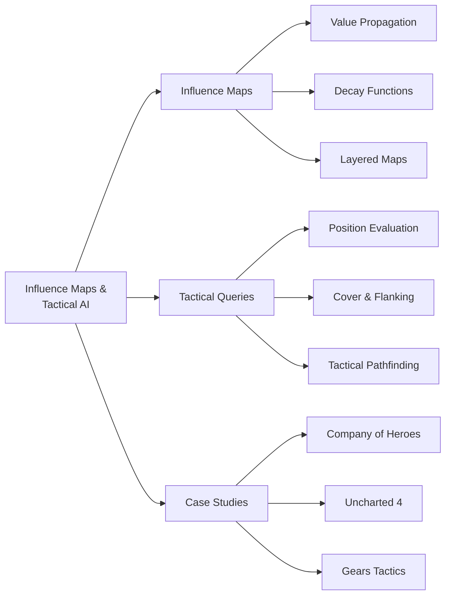
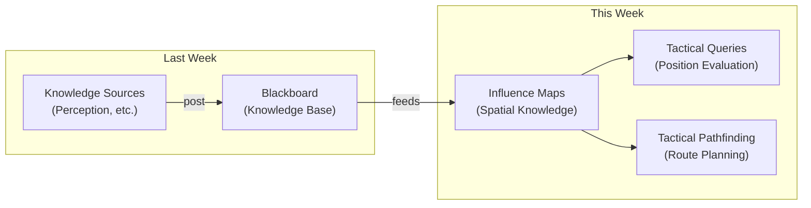
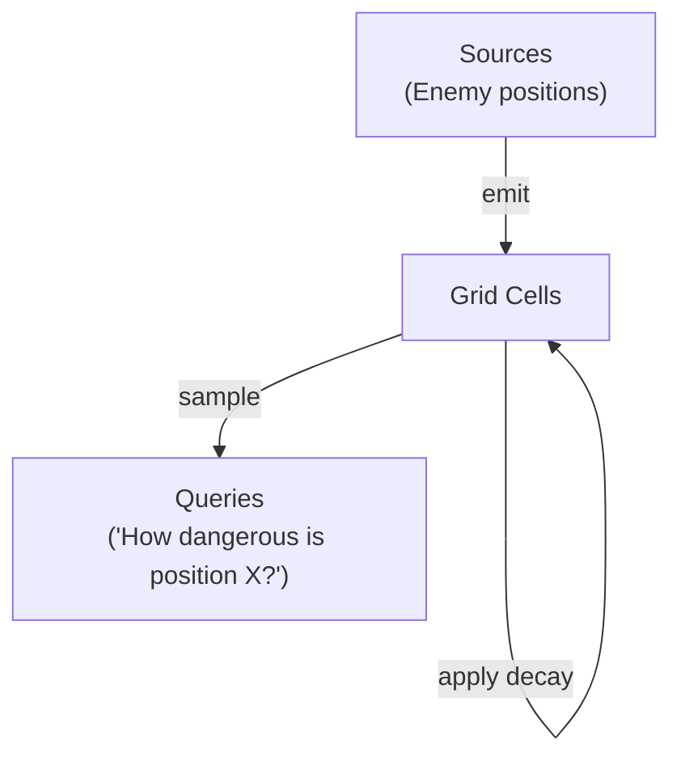
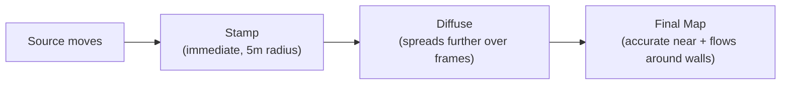
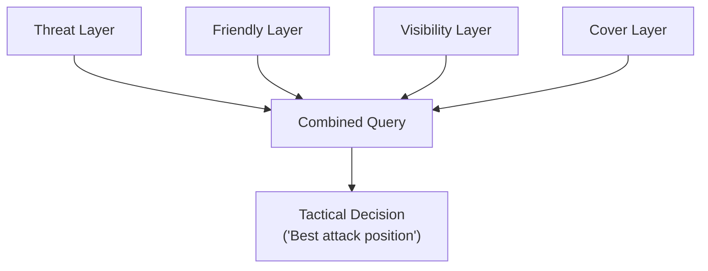
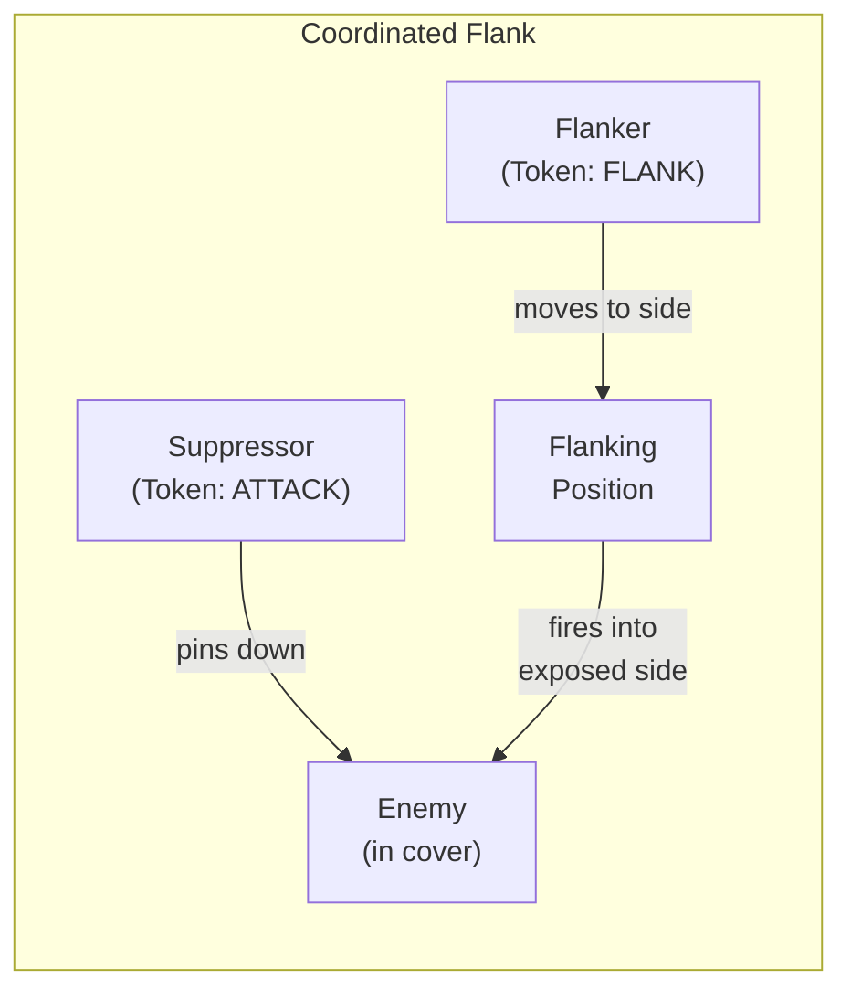
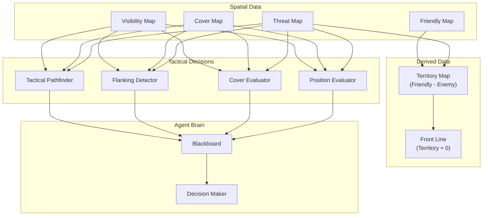
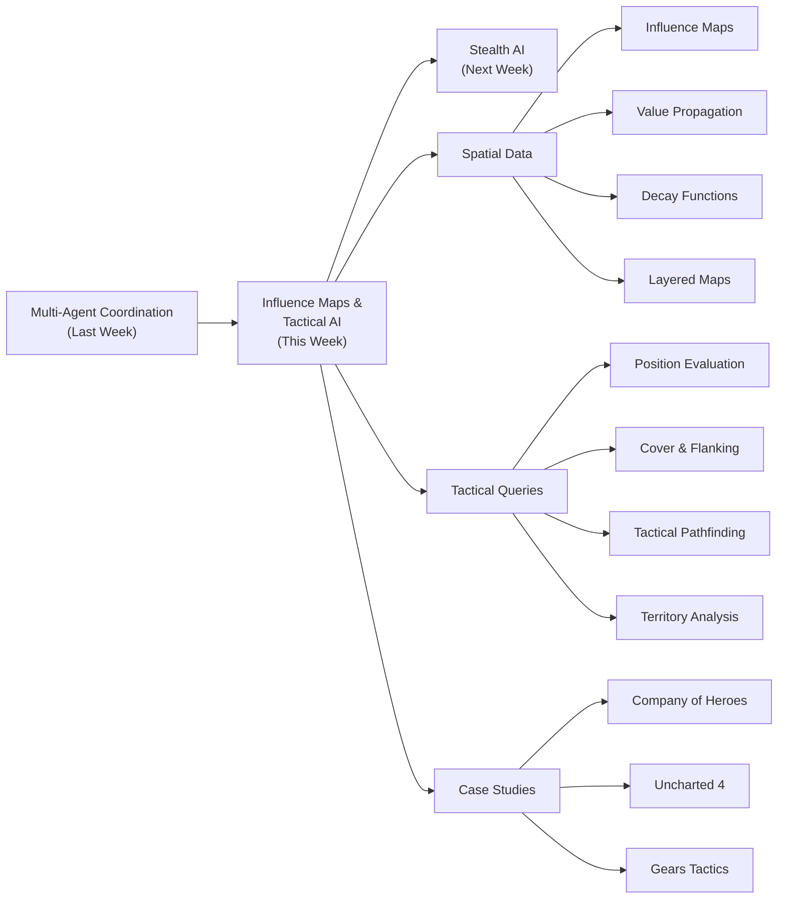

# Influence Maps & Tactical Position Evaluation

Last week we built multi-agent coordination systems — blackboards for sharing knowledge, token pools for pacing actions, and hierarchical AI for squad-level decisions. Those systems answer the question "what should each agent *do*?" This week we answer a more fundamental question: **"where should each agent *be*?"**

Spatial reasoning is the foundation of tactical AI. A soldier who can evaluate positions — "this spot has good cover, line of sight to the objective, and a safe retreat path" — will look far more intelligent than one who simply navigates to the nearest enemy. Influence maps give AI agents a **mental model of the battlefield**, and tactical position evaluation turns that model into actionable decisions.

We will build from the core data structure (influence maps), through the algorithms that query them (tactical position selection, cover evaluation, flanking detection), to a complete C++ implementation you can integrate with the multi-agent systems from last week.



---

## 1. Why Spatial Reasoning Matters

### 1.1. The Navigation Problem Is Not Enough

In previous weeks we used pathfinding (A\*, navmesh) to get agents from point A to point B. But pathfinding only answers **"what is the fastest route?"** — it says nothing about whether the destination or the route is *tactically sound*.

Consider an FPS scenario. An NPC needs to advance toward the player:

```
Standard A*:  Finds shortest path → NPC runs straight at the player through open ground
              Result: NPC gets shot immediately. Looks stupid.

Tactical AI:  Evaluates positions → NPC moves cover-to-cover, avoids sight lines,
              approaches from a flanking angle
              Result: NPC looks like it understands the battlefield.
```

The difference is not in the navigation algorithm — it is in **what the agent knows about the space around it**. Navigation tells you *how* to get somewhere; spatial reasoning tells you *where you should want to go*.

### 1.2. What an Agent Needs to Know About Space

For an NPC to make intelligent spatial decisions, it needs answers to questions like:

| Question | Spatial Data Required |
| --- | --- |
| "Where is it dangerous?" | Threat map — areas under enemy fire or observation |
| "Where is it safe?" | Inverse of threat + cover positions |
| "Who controls this area?" | Territory/ownership map |
| "What is the best attack position?" | Sight lines + cover + flanking angle to target |
| "What is the safest path?" | Threat-weighted pathfinding costs |
| "Where should I retreat to?" | Safety gradient + distance to allies |
| "Which resource is most contested?" | Friendly vs. enemy influence comparison |

A single NPC might ask several of these questions every second. We need a data structure that can answer them efficiently. That data structure is the **influence map**.

### 1.3. From Last Week to This Week

Last week's blackboard architecture provides a natural home for spatial data. Knowledge sources write spatial information to the blackboard ("enemy spotted at position X"), and other systems read it to make decisions.

This week we formalize that spatial knowledge into structured **influence maps** and build systems that **query** those maps for tactical decisions:



The blackboard stores discrete facts ("enemy at position X"). The influence map transforms those facts into a **continuous spatial field** that agents can sample anywhere — "what is the threat level at *this* position? What about 2 meters to the left?"

!!! quiz
{
"title": "Spatial Reasoning",
"question": "What does tactical spatial reasoning provide that standard A* pathfinding does not?",
"options": ["Faster route computation", "Knowledge of whether a destination or route is tactically advantageous", "The ability to move through walls", "Automatic collision avoidance"],
"answers": ["Knowledge of whether a destination or route is tactically advantageous"]
}
!!!

---

## 2. Influence Maps: The Core Data Structure

### 2.1. What Is an Influence Map?

An **influence map** is a spatial data structure that overlays the game world with a grid (or other tessellation) where each cell stores a numeric value representing some property of that location — threat, ownership, resource value, visibility, etc.

Think of it as the AI's equivalent of a military **heat map**. A commander looking at a battlefield map with colored overlays — red for enemy-controlled areas, blue for friendly areas, yellow for contested zones — is reading an influence map.

```
Influence Map (Threat Layer):

  0.0  0.0  0.1  0.3  0.5  0.3  0.1  0.0
  0.0  0.1  0.3  0.6  0.8  0.6  0.3  0.0
  0.0  0.1  0.4  0.8  1.0  0.8  0.4  0.1    ← Enemy at center
  0.0  0.1  0.3  0.6  0.8  0.6  0.3  0.0
  0.0  0.0  0.1  0.3  0.5  0.3  0.1  0.0
```

The enemy at the center has a threat value of 1.0, and that threat **propagates outward**, diminishing with distance. Any AI agent can sample this map at its current position to instantly know "how dangerous is it here?"

The key insight is that influence maps transform **discrete facts** (enemy positions) into a **continuous field** that can be sampled, combined, and queried:

```
Discrete knowledge:  "Enemy at (4, 2)"
                      ↓ propagation
Continuous field:    threat(x, y) = f(distance_to_enemy)
                      ↓ query
Tactical decision:   "Position (0, 4) has threat 0.05 — it's safe."
```

### 2.2. Anatomy of an Influence Map

An influence map has four essential components:

| Component | Description | Example |
| --- | --- | --- |
| **Grid** | The spatial tessellation that divides the world into cells | 64×64 grid, each cell = 2m × 2m |
| **Sources** | Entities that emit influence into the map | Enemy units, friendly bases, resource nodes |
| **Propagation** | The algorithm that spreads influence from sources to surrounding cells | Flood fill, distance-based decay, wavefront expansion |
| **Decay function** | How influence diminishes with distance from its source | Linear, exponential, inverse-square |



### 2.3. Grid Representation

The simplest and most common representation is a **2D uniform grid** overlaid on the game world:

```cpp
struct InfluenceMap {
    int width;              // grid columns
    int height;             // grid rows
    float cellSize;         // world units per cell
    float originX, originY; // world position of cell (0,0)
    std::vector<float> cells; // width * height values

    InfluenceMap(int w, int h, float cs, float ox = 0, float oy = 0)
        : width(w), height(h), cellSize(cs), originX(ox), originY(oy),
          cells(w * h, 0.0f) {}

    // Convert world position to grid coordinates.
    int worldToGridX(float wx) const {
        return static_cast<int>((wx - originX) / cellSize);
    }
    int worldToGridY(float wy) const {
        return static_cast<int>((wy - originY) / cellSize);
    }

    // Convert grid coordinates to world position (center of cell).
    float gridToWorldX(int gx) const {
        return originX + (gx + 0.5f) * cellSize;
    }
    float gridToWorldY(int gy) const {
        return originY + (gy + 0.5f) * cellSize;
    }

    // Safe cell access.
    float get(int gx, int gy) const {
        if (gx < 0 || gx >= width || gy < 0 || gy >= height) return 0.0f;
        return cells[gy * width + gx];
    }

    void set(int gx, int gy, float value) {
        if (gx >= 0 && gx < width && gy >= 0 && gy < height)
            cells[gy * width + gx] = value;
    }

    // Sample influence at a world position.
    float sampleWorld(float wx, float wy) const {
        return get(worldToGridX(wx), worldToGridY(wy));
    }

    // Clear all cells to zero.
    void clear() {
        std::fill(cells.begin(), cells.end(), 0.0f);
    }
};
```

The grid provides $O(1)$ access to any cell by position — critical when dozens of agents are querying the map every frame.

#### Resolution Trade-offs

Grid resolution is a fundamental design decision:

| Resolution | Cell Size | Accuracy | Memory (128m × 128m map) | Update Cost |
| --- | --- | --- | --- | --- |
| Low | 4m | Coarse — agents "see" threat in 4m blocks | 32 × 32 = 1 KB | Fast |
| Medium | 2m | Good for most tactical AI | 64 × 64 = 4 KB | Moderate |
| High | 1m | Fine-grained — good for cover evaluation | 128 × 128 = 16 KB | Expensive |
| Very High | 0.5m | Sub-meter precision — usually overkill | 256 × 256 = 64 KB | Very expensive |

Most shipped games use **1–2 meter cells** for tactical influence maps. Finer resolution adds cost without proportional benefit — the AI does not need sub-meter precision to decide "should I go left or right?"

::: tip "Memory Is Cheap, Updates Are Expensive"
The memory cost of influence maps is negligible (a 128×128 float grid is 64 KB). The expensive part is **updating** the map every frame — propagating influence from dozens of sources across thousands of cells. This is why update frequency and propagation range matter more than grid resolution.
:::

!!! quiz
{
"title": "Grid Resolution",
"question": "A game world is 200m × 200m. With a cell size of 2m, how many cells does the influence map grid contain?",
"options": ["10,000 cells (100 × 100)", "40,000 cells (200 × 200)", "400 cells (20 × 20)", "100,000 cells (200 × 500)"],
"answers": ["10,000 cells (100 × 100)"]
}
!!!

---

## 3. Value Propagation and Decay

### 3.1. How Influence Spreads

The core algorithm of an influence map is **value propagation**: influence radiates outward from sources and diminishes with distance. This is conceptually similar to how heat diffuses through a material, or how signal strength decreases as you move away from a radio tower.

The simplest propagation algorithm stamps a circular area around each source:

```cpp
// Stamp influence from a single source onto the map.
void stampInfluence(InfluenceMap& map, float worldX, float worldY,
                    float strength, float radius) {
    int cx = map.worldToGridX(worldX);
    int cy = map.worldToGridY(worldY);
    int gridRadius = static_cast<int>(radius / map.cellSize);

    for (int dy = -gridRadius; dy <= gridRadius; ++dy) {
        for (int dx = -gridRadius; dx <= gridRadius; ++dx) {
            int gx = cx + dx;
            int gy = cy + dy;
            float dist = std::sqrt(static_cast<float>(dx * dx + dy * dy))
                         * map.cellSize;
            if (dist <= radius) {
                float influence = strength * (1.0f - dist / radius); // linear decay
                float current = map.get(gx, gy);
                map.set(gx, gy, std::max(current, influence)); // take max
            }
        }
    }
}
```

The `std::max` in the last line is an important design choice: when two sources overlap, we take the **maximum** threat rather than summing. This prevents artificial "super-threat" zones at the intersection of two enemies' influence — a position between two enemies should feel as dangerous as the closer enemy, not twice as dangerous.

::: note "Max vs. Sum"
Whether to use `max` or `sum` depends on the semantic meaning of the layer:
- **Threat map**: Use `max` — the threat at a position is determined by the most dangerous nearby enemy, not the sum of all enemies.
- **Territory map**: Use `sum` — multiple friendly units in an area should create stronger territorial control than just one.
- **Resource value map**: Use `sum` — multiple resource nodes near a position make it more valuable.

The choice of combination function changes the behavior of agents querying the map.
:::

### 3.2. Decay Functions

The **decay function** determines how influence diminishes with distance. This single choice dramatically affects AI behavior:

#### Linear Decay

$$
I(d) = I_0 \cdot \max\left(0,\; 1 - \frac{d}{R}\right)
$$

Where $I_0$ is the source strength, $d$ is the distance, and $R$ is the maximum radius.

',borderWidth:3,fill:false,pointRadius:0,tension:0}]},options:{plugins:{legend:{display:false}},scales:{x:{title:{display:true,text:'Distance (d/R)'},grid:{display:false}},y:{title:{display:true,text:'Influence'},min:0,max:1,grid:{color:'rgba(0,0,0,0.1)'}}}}}>)

**Properties**: Influence drops at a constant rate. There is a hard cutoff at radius $R$. Simple and predictable. This is the most common choice in games because it is intuitive for designers to reason about — "this enemy threatens everything within 20 meters, and the threat drops linearly."

#### Exponential Decay

$$
I(d) = I_0 \cdot e^{-\lambda d}
$$

Where $\lambda$ is the decay rate.

',borderWidth:3,fill:false,pointRadius:0,tension:0.4}]},options:{plugins:{legend:{display:false}},scales:{x:{title:{display:true,text:'Distance (d/R)'},grid:{display:false}},y:{title:{display:true,text:'Influence'},min:0,max:1,grid:{color:'rgba(0,0,0,0.1)'}}}}}>)

**Properties**: Influence drops rapidly near the source and has a long, soft tail. There is no hard cutoff — influence theoretically extends to infinity (though it becomes negligible). Good for modeling vision — enemies nearby are very threatening, but even distant enemies contribute some unease.

#### Inverse-Square Decay

$$
I(d) = \frac{I_0}{1 + d^2}
$$

(The $+1$ prevents division by zero at $d = 0$.)

',borderWidth:3,fill:false,pointRadius:0,tension:0.4}]},options:{plugins:{legend:{display:false}},scales:{x:{title:{display:true,text:'Distance (d/R)'},grid:{display:false}},y:{title:{display:true,text:'Influence'},min:0,max:1,grid:{color:'rgba(0,0,0,0.1)'}}}}}>)

**Properties**: Mirrors real-world physics (light, sound, gravity all follow inverse-square laws). Falls off very quickly close to the source, then maintains a low persistent level at distance. Good for modeling physical phenomena like sound or explosions.

Here is a visual comparison of all three decay functions:

',borderWidth:3,fill:false,pointRadius:0,tension:0},{label:'Exponential',data:[1.0,0.8869,0.7866,0.6977,0.6188,0.5488,0.4868,0.4317,0.3829,0.3396,0.3012,0.2671,0.2369,0.2101,0.1864,0.1653,0.1466,0.13,0.1153,0.1023,0.0907,0.0805,0.0714,0.0633,0.0561,0.0498],borderColor:'rgb(255,99,132)',borderWidth:3,fill:false,pointRadius:0,tension:0.4},{label:'Inverse-Square',data:[1.0,0.9858,0.9455,0.8853,0.8127,0.7353,0.6586,0.5863,0.5204,0.4616,0.4098,0.3646,0.3254,0.2912,0.2616,0.2358,0.2134,0.1937,0.1765,0.1613,0.1479,0.136,0.1255,0.116,0.1076,0.1],borderColor:'rgb(153,102,255)',borderWidth:3,fill:false,pointRadius:0,tension:0.4}]},options:{plugins:{legend:{display:true}},scales:{x:{title:{display:true,text:'Distance (d/R)'},grid:{display:false}},y:{title:{display:true,text:'Influence'},min:0,max:1,grid:{color:'rgba(0,0,0,0.1)'}}}}}>)

Here is a comparative implementation:

```cpp
enum class DecayType { LINEAR, EXPONENTIAL, INVERSE_SQUARE };

float computeDecay(float strength, float distance, float radius, DecayType type) {
    switch (type) {
        case DecayType::LINEAR:
            return strength * std::max(0.0f, 1.0f - distance / radius);

        case DecayType::EXPONENTIAL: {
            float lambda = 3.0f / radius;  // decay to ~5% at radius
            return strength * std::exp(-lambda * distance);
        }

        case DecayType::INVERSE_SQUARE:
            return strength / (1.0f + distance * distance);

        default:
            return 0.0f;
    }
}
```

The `lambda = 3.0f / radius` for exponential decay is a practical trick: it ensures the influence drops to approximately 5% at the specified radius (since $e^{-3} \approx 0.05$), giving designers a predictable "effective range."

!!! quiz
{
"title": "Decay Functions",
"question": "Which decay function drops influence at a constant rate and has a hard cutoff at a specific radius?",
"options": ["Exponential decay", "Inverse-square decay", "Linear decay", "Logarithmic decay"],
"answers": ["Linear decay"]
}
!!!

### 3.3. Propagation Strategies

There are two main strategies for propagating influence across the grid:

#### Stamp-Based Propagation

The approach shown above — iterate over a circular area around each source and write values directly. This is simple and works well when sources do not move frequently:

```
Time complexity: O(S × R²) per update
  S = number of sources
  R = grid-cell radius of influence
```

**Pros**: Simple, predictable, no iterative convergence needed.
**Cons**: Does not respect obstacles (influence passes through walls). Expensive for large radii.

#### Iterative (Diffusion) Propagation

Each cell spreads a fraction of its value to neighbors each tick, like heat diffusion. This naturally respects obstacles (walls block diffusion):

```cpp
// Spread influence from each cell to its neighbors.
// Call this once per AI tick for gradual propagation.
void diffuseInfluence(InfluenceMap& map, float spreadFactor, float decayFactor) {
    // Work on a copy to avoid read-write conflicts.
    std::vector<float> buffer(map.cells.size(), 0.0f);

    for (int y = 0; y < map.height; ++y) {
        for (int x = 0; x < map.width; ++x) {
            float center = map.get(x, y);
            if (center <= 0.001f) continue;

            float spread = center * spreadFactor;
            buffer[y * map.width + x] += center * (1.0f - spreadFactor);

            // Spread to 4-connected neighbors.
            int dx[] = {0, 0, -1, 1};
            int dy[] = {-1, 1, 0, 0};
            for (int i = 0; i < 4; ++i) {
                int nx = x + dx[i];
                int ny = y + dy[i];
                if (nx >= 0 && nx < map.width && ny >= 0 && ny < map.height) {
                    buffer[ny * map.width + nx] += spread / 4.0f;
                }
            }
        }
    }

    // Apply global decay and copy back.
    for (size_t i = 0; i < map.cells.size(); ++i) {
        map.cells[i] = buffer[i] * decayFactor;
    }
}
```

**Pros**: Naturally respects obstacles (do not spread to blocked cells). Influence "flows" around corners realistically.
**Cons**: Requires multiple iterations to propagate across the map. The map does not stabilize instantly when sources move.

::: note "Obstacles and Influence"
In the diffusion approach, you can make influence respect walls simply by skipping blocked cells during propagation:
```cpp
if (isWall(nx, ny)) continue; // influence does not pass through walls
```
This means an enemy around a corner does not threaten you — their influence cannot "see" through the wall. This is physically realistic and produces much better tactical behavior than stamp-based propagation.
:::

#### Hybrid: Stamp + Diffusion

Many games use a **hybrid** approach: stamp influence within a small radius (for immediate, close-range accuracy), then let diffusion handle long-range propagation. This gives fast response for nearby threats while letting influence flow around obstacles over time.



### 3.4. Update Frequency and Performance

Influence maps do not need to update every frame. The world does not change that fast, and agents do not need millisecond-accurate spatial data. Common update strategies:

| Strategy | Frequency | Use Case |
| --- | --- | --- |
| Every frame | 60 Hz | Only for very small maps or critical real-time data |
| Fixed interval | 2–5 Hz | Most tactical influence maps — good balance |
| On-demand | When sources move | Stamp-based maps with mostly static sources |
| Staggered | Different layers at different rates | Threat at 5 Hz, territory at 1 Hz, resources at 0.5 Hz |

The **staggered** approach is particularly elegant: threat information needs to be fresh (enemies move fast), but territory control changes slowly, and resource distribution is nearly static. Updating each layer at an appropriate rate saves significant CPU.

```cpp
class InfluenceMapManager {
    float threatUpdateInterval = 0.2f;    // 5 Hz
    float territoryUpdateInterval = 1.0f; // 1 Hz
    float resourceUpdateInterval = 2.0f;  // 0.5 Hz

    float lastThreatUpdate = 0.0f;
    float lastTerritoryUpdate = 0.0f;
    float lastResourceUpdate = 0.0f;

public:
    void update(float currentTime, InfluenceMap& threat,
                InfluenceMap& territory, InfluenceMap& resources,
                const std::vector<Entity>& entities) {
        if (currentTime - lastThreatUpdate >= threatUpdateInterval) {
            updateThreatMap(threat, entities);
            lastThreatUpdate = currentTime;
        }
        if (currentTime - lastTerritoryUpdate >= territoryUpdateInterval) {
            updateTerritoryMap(territory, entities);
            lastTerritoryUpdate = currentTime;
        }
        if (currentTime - lastResourceUpdate >= resourceUpdateInterval) {
            updateResourceMap(resources, entities);
            lastResourceUpdate = currentTime;
        }
    }

private:
    void updateThreatMap(InfluenceMap& map, const std::vector<Entity>& entities);
    void updateTerritoryMap(InfluenceMap& map, const std::vector<Entity>& entities);
    void updateResourceMap(InfluenceMap& map, const std::vector<Entity>& entities);
};
```

!!! quiz
{
"title": "Update Frequency",
"question": "Why do most games update influence maps at 2–5 Hz rather than every frame (60 Hz)?",
"options": ["Influence maps are too small to need frequent updates", "The game world does not change fast enough to need millisecond-accurate spatial data, and lower frequency saves CPU", "Higher update rates cause visual artifacts", "The AI can only process one map update per second"],
"answers": ["The game world does not change fast enough to need millisecond-accurate spatial data, and lower frequency saves CPU"]
}
!!!

---

## 4. Layered Maps: Composing Spatial Intelligence

### 4.1. One Map Is Not Enough

A single influence map answers one question: "how much threat/ownership/value is at this position?" But tactical decisions require **combining** multiple spatial factors.

Consider the question: **"Where is the best position to attack the player from?"**

This requires simultaneously evaluating:
- **Threat**: The position should have LOW enemy threat (do not attack from where you will get shot)
- **Cover**: The position should have HIGH cover quality (protection from return fire)
- **Sight lines**: The position should have HIGH visibility to the target (you need to see what you are shooting at)
- **Distance**: The position should be within MEDIUM range (not too far, not too close)

No single influence map encodes all of this. Instead, we use **layered maps** — multiple independent influence maps that are combined at query time.

### 4.2. Common Influence Map Layers

| Layer | What It Represents | Sources | Decay |
| --- | --- | --- | --- |
| **Threat** | Danger level at each position | Enemy units, turrets, hazards | Linear or exponential |
| **Friendly** | Presence of allied forces | Friendly units, bases | Linear |
| **Territory** | Who "owns" each area | Friendly - Enemy influence | Sum of friendly - enemy |
| **Visibility** | How exposed a position is | Sight-line raycasts | Binary or gradient |
| **Cover Quality** | How well-protected a position is | Cover geometry analysis | N/A (static) |
| **Resource Value** | Proximity to valuable targets | Resource nodes, objectives | Linear |
| **Exploration** | How recently an area was visited | Agent visit timestamps | Increases over time |



### 4.3. Combining Layers

Layers are combined using **weighted expressions** — each layer contributes to the final score with a designer-tunable weight:

$$
\text{Score}(x, y) = w_1 \cdot L_1(x, y) + w_2 \cdot L_2(x, y) + \ldots + w_n \cdot L_n(x, y)
$$

For our "best attack position" example:

$$
\text{AttackScore}(x, y) = -2.0 \cdot \text{Threat}(x, y) + 1.5 \cdot \text{Cover}(x, y) + 1.0 \cdot \text{SightLine}(x, y) - 0.5 \cdot |\text{Distance}(x, y) - \text{Ideal}|
$$

Note the **negative weight** on Threat — we want positions with LOW threat, so we penalize high-threat areas.

```cpp
// Evaluate a position using multiple weighted influence map layers.
struct LayerWeight {
    const InfluenceMap* map;
    float weight;  // positive = prefer high values, negative = prefer low values
};

float evaluatePosition(float worldX, float worldY,
                       const std::vector<LayerWeight>& layers) {
    float score = 0.0f;
    for (const auto& layer : layers) {
        score += layer.weight * layer.map->sampleWorld(worldX, worldY);
    }
    return score;
}
```

This is remarkably simple — and that simplicity is the power of the architecture. Designers can create entirely new AI behaviors just by adjusting weights, without touching the underlying code:

| Behavior | Threat Weight | Cover Weight | SightLine Weight | Distance Weight |
| --- | --- | --- | --- | --- |
| Aggressive attacker | -0.5 | 0.5 | 2.0 | -1.0 |
| Cautious sniper | -3.0 | 2.0 | 1.5 | 0.0 |
| Flanker | -2.0 | 1.0 | 0.5 | -0.5 |
| Defender | -2.0 | 3.0 | 1.0 | 0.0 |
| Scout | 0.5 | 0.0 | 0.0 | -1.0 |

The **scout** has a *positive* Threat weight — it actively seeks out dangerous areas because its job is to find enemies!

!!! quiz
{
"title": "Layered Maps",
"question": "In a layered influence map system, a 'cautious sniper' AI has a Threat weight of -3.0 and a SightLine weight of 1.5. What does this mean?",
"options": ["The sniper strongly avoids danger and moderately prefers positions with good sight lines", "The sniper is attracted to danger and avoids sight lines", "The sniper ignores threat and only cares about distance", "The sniper's behavior cannot be determined from weights alone"],
"answers": ["The sniper strongly avoids danger and moderately prefers positions with good sight lines"]
}
!!!

### 4.4. Beyond Weighted Sums: Thresholds and Filters

Sometimes weighted sums are not expressive enough. A position with incredible sight lines but zero cover is not a good sniper position — no amount of positive sight-line weight can compensate for getting killed immediately.

**Threshold filters** solve this by enforcing minimum requirements before scoring:

```cpp
struct PositionCandidate {
    float worldX, worldY;
    float score;
};

// Find the best position from candidates, enforcing minimum thresholds.
std::optional<PositionCandidate> findBestPosition(
    const std::vector<PositionCandidate>& candidates,
    const InfluenceMap& threat,
    const InfluenceMap& cover,
    float maxThreat,     // hard threshold: reject if threat above this
    float minCover,      // hard threshold: reject if cover below this
    const std::vector<LayerWeight>& scoringLayers)
{
    PositionCandidate best;
    best.score = -std::numeric_limits<float>::infinity();
    bool found = false;

    for (const auto& candidate : candidates) {
        // Hard filters — reject positions that fail minimum requirements.
        float t = threat.sampleWorld(candidate.worldX, candidate.worldY);
        if (t > maxThreat) continue;

        float c = cover.sampleWorld(candidate.worldX, candidate.worldY);
        if (c < minCover) continue;

        // Soft scoring — rank surviving candidates by weighted score.
        float score = evaluatePosition(candidate.worldX, candidate.worldY,
                                       scoringLayers);
        if (score > best.score) {
            best = {candidate.worldX, candidate.worldY, score};
            found = true;
        }
    }

    if (found) return best;
    return std::nullopt;
}
```

This two-phase approach — **hard filters** then **soft scoring** — is the standard pattern in production tactical AI. It prevents the optimizer from choosing positions that look good on paper but fail basic safety requirements.

### 4.5. The Territory Map: Friendly vs. Enemy Influence

A particularly important derived layer is the **territory map**, computed by subtracting enemy influence from friendly influence:

$$
\text{Territory}(x, y) = \text{Friendly}(x, y) - \text{Enemy}(x, y)
$$

| Territory Value | Interpretation |
| --- | --- |
| > 0.5 | Firmly controlled by friendlies |
| 0.0 to 0.5 | Friendly-leaning, but contested |
| -0.5 to 0.0 | Enemy-leaning, but contested |
| < -0.5 | Firmly controlled by enemy |
| ≈ 0.0 | **Front line** — the boundary between factions |

The front line naturally emerges where friendly and enemy influence are approximately equal. This is incredibly useful for RTS games — the AI can identify where battles are happening (the contested zone), where it is safe to build (deep friendly territory), and where it should attack (the edge of enemy territory).

```cpp
// Compute territory map from friendly and enemy influence.
void computeTerritory(InfluenceMap& territory,
                      const InfluenceMap& friendly,
                      const InfluenceMap& enemy) {
    for (int y = 0; y < territory.height; ++y) {
        for (int x = 0; x < territory.width; ++x) {
            float f = friendly.get(x, y);
            float e = enemy.get(x, y);
            territory.set(x, y, f - e);
        }
    }
}

// Find cells that lie on the front line (territory ≈ 0).
std::vector<std::pair<int,int>> findFrontLine(const InfluenceMap& territory,
                                               float threshold = 0.1f) {
    std::vector<std::pair<int,int>> frontLine;
    for (int y = 0; y < territory.height; ++y) {
        for (int x = 0; x < territory.width; ++x) {
            if (std::abs(territory.get(x, y)) < threshold) {
                frontLine.push_back({x, y});
            }
        }
    }
    return frontLine;
}
```

::: note "Company of Heroes"
The Company of Heroes series uses territory-based influence maps as a core gameplay mechanic. The map is divided into sectors, each controlled by whichever faction has more "presence" (units, structures) nearby. Controlling sectors provides resources, and the boundary between factions shifts dynamically as armies advance and retreat. The AI uses this territory information to decide where to attack (contested sectors), where to defend (border sectors), and where to expand (unclaimed sectors).
:::

!!! quiz
{
"title": "Territory Maps",
"question": "In a territory map where Territory(x,y) = Friendly(x,y) - Enemy(x,y), what does a value near 0.0 represent?",
"options": ["Firmly friendly territory", "Firmly enemy territory", "The front line — a contested boundary between factions", "An area with no units from either side"],
"answers": ["The front line — a contested boundary between factions"]
}
!!!

---

## 5. Tactical Position Evaluation

### 5.1. From Maps to Decisions

Influence maps tell us *about* the space. But an agent still needs to decide **which specific position to move to**. This is the role of **tactical position evaluation** — scoring candidate positions against multiple criteria and selecting the best one.

The general algorithm is:

```
1. Generate candidate positions (grid sampling, navmesh vertices, cover points)
2. Filter out invalid candidates (unreachable, out of bounds, occupied)
3. Score each candidate using influence map queries + geometry tests
4. Select the best-scoring candidate
5. Navigate to it
```

### 5.2. Generating Candidate Positions

Where do candidate positions come from? There are several approaches:

#### Grid Sampling

Sample the influence map grid at regular intervals:

```cpp
std::vector<PositionCandidate> generateGridCandidates(
    const InfluenceMap& map, float worldX, float worldY,
    float searchRadius, float stepSize)
{
    std::vector<PositionCandidate> candidates;
    for (float dy = -searchRadius; dy <= searchRadius; dy += stepSize) {
        for (float dx = -searchRadius; dx <= searchRadius; dx += stepSize) {
            float dist = std::sqrt(dx * dx + dy * dy);
            if (dist <= searchRadius) {
                candidates.push_back({worldX + dx, worldY + dy, 0.0f});
            }
        }
    }
    return candidates;
}
```

**Pros**: Simple, uniform coverage.
**Cons**: Many candidates may be in terrain, walls, or unreachable positions. Need to filter.

#### NavMesh Vertices

Use the vertices of the navigation mesh as candidates — these are guaranteed to be reachable:

',pointRadius:8},{label:'Obstacle',data:[{x:2,y:1},{x:2,y:2},{x:2,y:3}],backgroundColor:'rgb(220,53,69)',pointRadius:14,pointStyle:'rect'}]},options:{plugins:{legend:{display:true}},scales:{x:{title:{display:true,text:'X'},min:-0.5,max:4.5,grid:{color:'rgba(0,0,0,0.1)'}},y:{title:{display:true,text:'Y'},min:-0.5,max:4.5,grid:{color:'rgba(0,0,0,0.1)'}}}}}>)

Green dots are candidate positions on navigable ground. Red squares mark the obstacle area. Vertex density naturally matches level geometry (dense near obstacles, sparse in open areas).

**Pros**: All candidates are on navigable ground. Natural density matches level geometry.
**Cons**: Candidate distribution is uneven (dense near obstacles, sparse in open areas).

#### Pre-Placed Cover Points

Level designers or an automated tool marks positions that provide cover:

```cpp
struct CoverPoint {
    float x, y, z;           // world position
    float facingAngle;        // direction the cover protects from (radians)
    float protectionArc;      // angular width of protection (radians)
    float quality;            // 0.0 (half cover) to 1.0 (full cover)
    bool occupied;            // is an agent already using this?
};
```

**Pros**: Highest quality — designers control where agents take cover. Can encode direction and quality.
**Cons**: Manual labor (or pre-processing pass). Missing cover points = AI gaps.

### 5.3. Scoring Positions: The Query Language

Matthew Jack's tactical position selection architecture (Reading 3) introduces a powerful idea: instead of coding specific position-finding logic, express **queries** that describe what you want:

```
QUERY: "best_attack_position"
  WITHIN: 20m of current position
  REQUIRE: cover_quality >= 0.5
  REQUIRE: threat < 0.3
  REQUIRE: has_line_of_sight(target)
  PREFER: high sight_line_quality (weight: 1.5)
  PREFER: low distance_to_target (weight: 1.0)
  PREFER: high flanking_angle (weight: 2.0)
```

This query says: "Find a position within 20 meters that has at least half cover and low threat, where I can see the target. Among valid positions, prefer ones with good sight lines, close range, and a flanking angle."

Here is an implementation of this query language concept:

```cpp
enum class CriterionType { REQUIRE_MIN, REQUIRE_MAX, PREFER_HIGH, PREFER_LOW };

struct Criterion {
    CriterionType type;
    std::function<float(float, float)> evaluate; // (worldX, worldY) → value
    float threshold;  // for REQUIRE_MIN / REQUIRE_MAX
    float weight;     // for PREFER_HIGH / PREFER_LOW
};

struct TacticalQuery {
    float searchRadius;
    float stepSize;
    std::vector<Criterion> criteria;
};

std::optional<PositionCandidate> executeTacticalQuery(
    const TacticalQuery& query, float originX, float originY,
    const InfluenceMap& boundsMap)
{
    // Phase 1: Generate candidates.
    auto candidates = generateGridCandidates(
        boundsMap, originX, originY, query.searchRadius, query.stepSize);

    PositionCandidate best;
    best.score = -std::numeric_limits<float>::infinity();
    bool found = false;

    for (auto& candidate : candidates) {
        bool passesRequirements = true;
        float score = 0.0f;

        for (const auto& criterion : query.criteria) {
            float value = criterion.evaluate(candidate.worldX,
                                             candidate.worldY);

            switch (criterion.type) {
                case CriterionType::REQUIRE_MIN:
                    if (value < criterion.threshold)
                        passesRequirements = false;
                    break;
                case CriterionType::REQUIRE_MAX:
                    if (value > criterion.threshold)
                        passesRequirements = false;
                    break;
                case CriterionType::PREFER_HIGH:
                    score += criterion.weight * value;
                    break;
                case CriterionType::PREFER_LOW:
                    score -= criterion.weight * value;
                    break;
            }

            if (!passesRequirements) break; // early out
        }

        if (passesRequirements && score > best.score) {
            best = {candidate.worldX, candidate.worldY, score};
            found = true;
        }
    }

    if (found) return best;
    return std::nullopt;
}
```

The beauty of this architecture is that new tactical behaviors are created entirely through **data** — different query configurations — not through code changes:

| Query | Requirements | Preferences |
| --- | --- | --- |
| Find cover | cover ≥ 0.5, threat < 0.4 | Prefer high cover, low threat |
| Find flanking position | sight_line, threat < 0.6 | Prefer high flank angle, low distance |
| Find retreat position | distance_from_enemy > 15 | Prefer high friendly influence |
| Find sniper nest | cover ≥ 0.8, height > 5m | Prefer high sight line range, low threat |
| Find ambush point | not_visible_to_enemy | Prefer high proximity to enemy route |

!!! quiz
{
"title": "Tactical Queries",
"question": "In a tactical query system, what is the difference between a REQUIRE criterion and a PREFER criterion?",
"options": ["REQUIRE criteria are more important than PREFER criteria", "REQUIRE criteria eliminate positions that do not meet a hard threshold; PREFER criteria add to or subtract from the score of remaining positions", "REQUIRE criteria are evaluated first, PREFER criteria are evaluated last", "There is no difference — both affect the final score equally"],
"answers": ["REQUIRE criteria eliminate positions that do not meet a hard threshold; PREFER criteria add to or subtract from the score of remaining positions"]
}
!!!

---

## 6. Cover Point Evaluation

### 6.1. What Makes Good Cover?

Cover is the most important tactical factor in modern action games. An NPC that finds cover looks intelligent; one that stands in the open looks broken. But not all cover is equal — the quality of a cover position depends on multiple geometric factors.

A cover point is defined by its **position**, its **facing direction** (the direction from which it provides protection), and its **protection arc** (how wide the protection is):

'},{label:'Agent (protected)',data:[{x:3,y:2}],pointRadius:14,pointStyle:'circle',backgroundColor:'rgb(40,167,69)'},{label:'Protection Arc',data:[{x:1,y:2},{x:1.5,y:1.2},{x:2.2,y:0.7},{x:3,y:0.5},{x:3.8,y:0.7},{x:4.5,y:1.2},{x:5,y:2}],showLine:true,fill:true,borderColor:'rgba(40,167,69,0.4)',backgroundColor:'rgba(40,167,69,0.15)',borderWidth:2,pointRadius:0,tension:0.4}]},options:{plugins:{legend:{display:true,position:'bottom'},annotation:{annotations:{coverWall:{type:'box',xMin:1,xMax:5,yMin:3.7,yMax:4.3,backgroundColor:'rgba(108,117,125,0.6)',borderColor:'rgb(80,80,80)',borderWidth:3,label:{display:true,content:'COVER WALL',color:'white',font:{size:13,weight:'bold'}}},threatArrow:{type:'line',yMin:5.8,yMax:4.5,xMin:3,xMax:3,borderColor:'rgb(220,53,69)',borderWidth:3,label:{display:true,content:'threat direction',position:'start',color:'rgb(220,53,69)',font:{size:11}}},arcLabel:{type:'label',xValue:3,yValue:0.2,content:'← 120° protection arc →',color:'rgb(40,167,69)',font:{size:12,weight:'bold'}}}}},scales:{x:{display:false,min:-0.5,max:6.5},y:{display:false,min:-0.5,max:7}}}}>)

### 6.2. Cover Quality Factors

| Factor | Description | How to Evaluate |
| --- | --- | --- |
| **Protection direction** | Does the cover face the threat? | Angle between threat direction and cover facing |
| **Protection level** | Full cover (chest-high wall) vs. half cover (low crate) | Geometry height analysis or designer markup |
| **Exposure count** | How many threats can see this position | Raycast to each known enemy |
| **Escape routes** | Can the agent retreat from this cover? | NavMesh reachability from cover to friendly positions |
| **Sight lines** | Can the agent fire back from cover? | Raycast from lean/peek positions |
| **Adjacency** | Is another agent already using nearby cover? | Distance to occupied cover points |

### 6.3. Directional Cover Evaluation

The most important check: is the cover actually protecting from the **current threat**?

```cpp
// Evaluate how well a cover point protects against a specific threat.
// Returns 0.0 (no protection) to 1.0 (full protection).
float evaluateCoverAgainstThreat(const CoverPoint& cover,
                                  float threatX, float threatY) {
    // Compute angle from cover to threat.
    float dx = threatX - cover.x;
    float dy = threatY - cover.y;
    float angleToThreat = std::atan2(dy, dx);

    // Compute angular difference between threat direction and cover facing.
    float angleDiff = angleToThreat - cover.facingAngle;

    // Normalize to [-pi, pi].
    while (angleDiff > M_PI)  angleDiff -= 2.0f * M_PI;
    while (angleDiff < -M_PI) angleDiff += 2.0f * M_PI;

    // If the threat is within the cover's protection arc, it provides cover.
    float halfArc = cover.protectionArc / 2.0f;
    if (std::abs(angleDiff) <= halfArc) {
        // Full protection at arc center, diminishing at edges.
        float normalized = std::abs(angleDiff) / halfArc;
        return cover.quality * (1.0f - normalized * 0.5f);
    }

    return 0.0f; // Threat is outside the protection arc.
}
```

This function returns 0 if the threat is behind or beside the cover (where the agent would be exposed), and a value up to `cover.quality` if the threat is in front of the cover (where the agent is protected).

','30°','60°','90° (Side)','120°','150°','180° (Rear)','210°','240°','270° (Side)','300°','330°'],datasets:[{label:'Protection Quality',data:[1.0,0.75,0.5,0.0,0.0,0.0,0.0,0.0,0.0,0.0,0.5,0.75],backgroundColor:'rgba(75,192,192,0.3)',borderColor:'rgb(75,192,192)',borderWidth:3,pointRadius:4}]},options:{plugins:{legend:{display:false}},scales:{r:{min:0,max:1,ticks:{stepSize:0.25}}}}}>)

The green radar shows protection quality at each angle. The agent is fully protected from the front (0°), partially protected at ±60°, and completely exposed from the sides and rear.

### 6.4. Multiple Threats

In practice, agents face multiple enemies. A cover point that protects against one threat may leave the agent exposed to another. We evaluate cover against **all known threats** and use the **minimum** protection:

```cpp
float evaluateCoverAgainstAllThreats(
    const CoverPoint& cover,
    const std::vector<std::pair<float,float>>& threats)
{
    if (threats.empty()) return cover.quality;

    float worstProtection = 1.0f;
    for (const auto& [tx, ty] : threats) {
        float protection = evaluateCoverAgainstThreat(cover, tx, ty);
        worstProtection = std::min(worstProtection, protection);
    }
    return worstProtection;
}
```

If even one enemy can see the agent from behind the cover, the cover is compromised. This is why **flanking** is so powerful — it turns good cover into no cover.

::: tip "Designer Insight"
In playtesting, nothing makes AI look smarter than good cover usage. An NPC that ducks behind a crate when shot at, peeks out to fire back, and retreats to a new position when flanked looks *intelligent* — even if the underlying system is just evaluating a few geometric angles. Cover behavior is high-impact, low-complexity tactical AI.
:::

!!! quiz
{
"title": "Cover Evaluation",
"question": "When evaluating a cover point against multiple threats, why should you use the minimum protection value across all threats?",
"options": ["Because the average protection is too optimistic", "Because if even one enemy can see you from around your cover, the position is compromised", "Because the minimum is faster to compute", "Because enemies always attack from the weakest angle"],
"answers": ["Because if even one enemy can see you from around your cover, the position is compromised"]
}
!!!

---

## 7. Flanking Detection

### 7.1. What Is Flanking?

**Flanking** is approaching an enemy from a direction they are not protected against — their side or rear. In tactical AI, detecting flanking opportunities and executing flanking maneuvers are among the most impactful behaviors for making AI look intelligent.

',borderWidth:4,pointRadius:0,borderDash:[8,5]},{label:'Flank Route',data:[{x:0,y:3},{x:0,y:1},{x:2,y:0},{x:4,y:0},{x:4,y:2}],showLine:true,fill:false,borderColor:'rgb(40,167,69)',borderWidth:4,pointRadius:0},{label:'Attacker',data:[{x:0,y:3}],pointRadius:14,pointStyle:'triangle',backgroundColor:'rgb(255,165,0)'},{label:'Defender',data:[{x:4,y:3}],pointRadius:14,pointStyle:'circle',backgroundColor:'rgb(0,123,255)'}]},options:{plugins:{legend:{display:true,position:'bottom'},annotation:{annotations:{cover:{type:'box',xMin:2.5,xMax:3.5,yMin:2.5,yMax:3.5,backgroundColor:'rgba(108,117,125,0.5)',borderColor:'rgb(80,80,80)',borderWidth:3,label:{display:true,content:'COVER',color:'white',font:{size:14,weight:'bold'}}},blocked:{type:'label',xValue:1.2,yValue:3.5,content:'BLOCKED ❌',color:'rgb(220,53,69)',font:{size:14,weight:'bold'}},success:{type:'label',xValue:2,yValue:-0.5,content:'FLANKS AROUND ✅',color:'rgb(40,167,69)',font:{size:14,weight:'bold'}},coverDir:{type:'label',xValue:3,yValue:1.8,content:'Cover faces ←',color:'rgb(100,100,100)',font:{size:11,style:'italic'}}}}},scales:{x:{display:false,min:-1,max:5.5},y:{display:false,min:-1.2,max:4.5}}}}>)

The **red dashed** line runs straight into the cover wall — blocked. The **green** line flanks around below to the defender's unprotected side, where the cover provides no protection.

### 7.2. Flanking Angle Computation

',borderWidth:3,fill:false,pointRadius:3,tension:0}]},options:{plugins:{legend:{display:false}},scales:{x:{title:{display:true,text:'Angle from Defender Facing'}},y:{title:{display:true,text:'Flanking Score'},min:0,max:1}}}}>)

The flanking angle is the angular difference between the **enemy's facing direction** (or their cover's protection direction) and the **attacker's approach direction**:

```cpp
// Compute the flanking angle between an attacker and a defender.
// Returns 0.0 (direct assault — worst) to pi (perfect rear flank — best).
float computeFlankAngle(float attackerX, float attackerY,
                         float defenderX, float defenderY,
                         float defenderFacingAngle) {
    // Direction from defender to attacker.
    float dx = attackerX - defenderX;
    float dy = attackerY - defenderY;
    float approachAngle = std::atan2(dy, dx);

    // Angular difference from defender's facing.
    float angleDiff = approachAngle - defenderFacingAngle;

    // Normalize to [-pi, pi].
    while (angleDiff > M_PI)  angleDiff -= 2.0f * M_PI;
    while (angleDiff < -M_PI) angleDiff += 2.0f * M_PI;

    return std::abs(angleDiff); // 0 = head-on, pi = perfect rear flank
}

// Evaluate flanking quality as a 0-1 score.
float evaluateFlankingScore(float flankAngle) {
    // 0 degrees   = head-on (0.0 score)
    // 90 degrees  = side flank (0.5 score)
    // 180 degrees = rear flank (1.0 score)
    return flankAngle / static_cast<float>(M_PI);
}
```

### 7.3. Finding Flanking Positions

To find a flanking position, we combine the flanking angle evaluation with cover and threat requirements:

```cpp
// Find the best flanking position against a target.
std::optional<PositionCandidate> findFlankingPosition(
    const std::vector<CoverPoint>& coverPoints,
    float agentX, float agentY,
    float targetX, float targetY,
    float targetFacingAngle,
    const InfluenceMap& threat,
    float maxDistance = 25.0f)
{
    PositionCandidate best;
    best.score = -std::numeric_limits<float>::infinity();
    bool found = false;

    for (const auto& cover : coverPoints) {
        if (cover.occupied) continue;

        // Distance filter.
        float dist = std::sqrt(
            (cover.x - agentX) * (cover.x - agentX) +
            (cover.y - agentY) * (cover.y - agentY));
        if (dist > maxDistance) continue;

        // Threat filter — do not flank through a death zone.
        float t = threat.sampleWorld(cover.x, cover.y);
        if (t > 0.6f) continue;

        // Compute flanking score.
        float flankAngle = computeFlankAngle(
            cover.x, cover.y, targetX, targetY, targetFacingAngle);
        float flankScore = evaluateFlankingScore(flankAngle);

        // Must be at least a side flank (90 degrees+) to be worthwhile.
        if (flankScore < 0.4f) continue;

        // Cover must protect from the target direction.
        float coverScore = evaluateCoverAgainstThreat(cover, targetX, targetY);

        // Combined score: flanking quality + cover quality - distance penalty.
        float score = flankScore * 2.0f + coverScore * 1.5f
                    - (dist / maxDistance) * 0.5f;

        if (score > best.score) {
            best = {cover.x, cover.y, score};
            found = true;
        }
    }

    if (found) return best;
    return std::nullopt;
}
```

The key insight: a flanking position must satisfy **three** constraints simultaneously:
1. It must have a large flank angle (otherwise it is just a direct assault)
2. It must have cover from the target (otherwise the flanker gets killed)
3. The path to it must not cross a high-threat zone (otherwise the flanker dies en route)

This is why flanking is the hallmark of good tactical AI — it requires spatial reasoning about angles, cover, and routes all at once.

### 7.4. Coordinated Flanking

Flanking becomes even more powerful when combined with the **multi-agent coordination** from last week. A suppressor pins the enemy in their cover while a flanker moves to a position that invalidates that cover:



The token system ensures only one agent flanks at a time (FLANK token), while the suppressor holds the ATTACK token to keep the enemy pinned. The influence map ensures the flanker's route avoids the threat zone created by the enemy's forward fire.

This is where last week's multi-agent coordination and this week's spatial reasoning combine: the **blackboard** tracks enemy positions, the **influence map** identifies safe flanking routes, the **tactical query** finds the best flanking cover point, and the **token system** coordinates who suppresses and who flanks.

!!! quiz
{
"title": "Flanking",
"question": "A flanking angle of 0 degrees means the attacker is approaching from directly in front of the defender. A flanking angle of 180 degrees means the attacker is approaching from directly behind. What flanking angle represents a side flank?",
"options": ["45 degrees", "90 degrees", "135 degrees", "180 degrees"],
"answers": ["90 degrees"]
}
!!!

---

## 8. Tactical Pathfinding

### 8.1. Beyond Shortest Path

Standard A\* pathfinding minimizes **distance** (or traversal cost). Tactical pathfinding minimizes **risk** — or more precisely, it minimizes a cost function that combines distance with tactical factors.

```
Standard A*:  cost(edge) = distance(A, B)
Tactical:     cost(edge) = distance(A, B) + threat_weight * threat(midpoint)
                          + exposure_weight * exposure(midpoint)
                          - cover_weight * cover_along_edge
```

This is straightforward to implement: modify the A\* cost function to incorporate influence map queries.

### 8.2. Threat-Weighted Pathfinding

The simplest tactical pathfinding modification: add the threat value at each node to the edge cost.

```cpp
// Modified A* cost function that penalizes high-threat paths.
float tacticalEdgeCost(float x1, float y1, float x2, float y2,
                        const InfluenceMap& threat,
                        float threatWeight = 2.0f) {
    // Base cost: Euclidean distance.
    float dx = x2 - x1;
    float dy = y2 - y1;
    float distance = std::sqrt(dx * dx + dy * dy);

    // Threat cost: sample threat at the midpoint of the edge.
    float mx = (x1 + x2) / 2.0f;
    float my = (y1 + y2) / 2.0f;
    float t = threat.sampleWorld(mx, my);

    // Total cost: distance + weighted threat.
    return distance + threatWeight * t * distance;
}
```

The `threatWeight * t * distance` term is proportional to both threat and distance — a long edge through a low-threat zone costs more than a short edge through a medium-threat zone, but a short edge through a high-threat zone still costs a lot. This produces natural-looking paths that prefer cover corridors:

',data:[{x:0,y:3},{x:1,y:3},{x:2,y:3},{x:3,y:3},{x:4,y:3},{x:5,y:3},{x:6,y:3}],showLine:true,borderColor:'rgb(255,99,132)',backgroundColor:'rgb(255,99,132)',pointRadius:5,borderWidth:3,fill:false,borderDash:[5,5]},{label:'Tactical Path',data:[{x:0,y:3},{x:1,y:2},{x:2,y:1},{x:3,y:0},{x:4,y:1},{x:5,y:2},{x:6,y:3}],showLine:true,borderColor:'rgb(75,192,192)',backgroundColor:'rgb(75,192,192)',pointRadius:5,borderWidth:3,fill:false}]},options:{plugins:{legend:{display:true},annotation:{annotations:{threat:{type:'box',xMin:1.5,xMax:4.5,yMin:2,yMax:5,backgroundColor:'rgba(255,0,0,0.1)',borderColor:'rgba(255,0,0,0.3)',label:{display:true,content:'THREAT ZONE',color:'rgba(255,0,0,0.5)'}},start:{type:'label',xValue:0,yValue:3.4,content:'S',font:{size:14,weight:'bold'}},goal:{type:'label',xValue:6,yValue:3.4,content:'G',font:{size:14,weight:'bold'}}}}},scales:{x:{title:{display:true,text:'X Position'},min:-0.5,max:6.5},y:{title:{display:true,text:'Y Position'},min:-1,max:5.5}}}}>)

The dashed red path is the shortest (A*) but passes through the threat zone. The solid teal path is the tactical route that avoids the threat at the cost of distance.

### 8.3. Multi-Criteria Tactical Paths

For more sophisticated pathfinding, combine multiple influence map layers in the cost function:

```cpp
struct TacticalPathConfig {
    float threatWeight = 2.0f;     // penalize high-threat areas
    float coverBonus = -0.5f;      // reward paths near cover (negative = reduces cost)
    float exposureWeight = 1.0f;   // penalize exposed positions
    float distanceWeight = 1.0f;   // base distance cost
};

float multiCriteriaCost(float x1, float y1, float x2, float y2,
                         const InfluenceMap& threat,
                         const InfluenceMap& cover,
                         const InfluenceMap& exposure,
                         const TacticalPathConfig& config) {
    float dx = x2 - x1;
    float dy = y2 - y1;
    float distance = std::sqrt(dx * dx + dy * dy);

    float mx = (x1 + x2) / 2.0f;
    float my = (y1 + y2) / 2.0f;

    float totalCost = config.distanceWeight * distance
                    + config.threatWeight * threat.sampleWorld(mx, my) * distance
                    + config.coverBonus * cover.sampleWorld(mx, my) * distance
                    + config.exposureWeight * exposure.sampleWorld(mx, my) * distance;

    return std::max(0.01f, totalCost); // ensure positive cost
}
```

::: warning "Admissibility"
Adding threat penalties to A\* edge costs can affect the **admissibility** of the heuristic. If your heuristic estimates cost without accounting for threat, it might underestimate the true cost, and A\* will still find the optimal path. But if you also adjust the heuristic to include threat estimates, be careful — overestimating makes A\* inadmissible and potentially suboptimal. In practice, slightly suboptimal paths are fine for game AI. The agent found a safe-ish route, and the player will not notice if it is not the mathematically perfect safest route.
:::

### 8.4. NavMesh Annotation

Instead of computing influence map queries during pathfinding (which adds overhead), you can **pre-annotate** navmesh edges and polygons with tactical properties:

```cpp
struct TacticalNavPoly {
    int polyId;
    float threat;       // average threat in this polygon
    float coverNearby;  // average cover quality in/near this polygon
    float exposure;     // visibility exposure level
    float lastUpdated;  // timestamp of last influence map sync
};

// Sync navmesh annotations with influence maps periodically.
void annotateNavMesh(std::vector<TacticalNavPoly>& polys,
                     const InfluenceMap& threat,
                     const InfluenceMap& cover,
                     float currentTime) {
    for (auto& poly : polys) {
        // Sample influence at polygon center.
        float cx, cy;
        getPolygonCenter(poly.polyId, cx, cy);
        poly.threat = threat.sampleWorld(cx, cy);
        poly.coverNearby = cover.sampleWorld(cx, cy);
        poly.lastUpdated = currentTime;
    }
}
```

This trades accuracy for speed: annotations are computed once per influence map update cycle, then used by all pathfinding queries until the next update. It is the standard approach in production games where many agents pathfind simultaneously.

!!! quiz
{
"title": "Tactical Pathfinding",
"question": "What does tactical pathfinding produce compared to standard A* pathfinding?",
"options": ["Shorter paths", "Paths that are mathematically optimal in all cases", "Paths that avoid high-threat areas and prefer cover, even if they are longer", "Paths that go through walls to avoid enemies"],
"answers": ["Paths that avoid high-threat areas and prefer cover, even if they are longer"]
}
!!!

---

## 9. Putting It All Together: A Complete Tactical AI System

### 9.1. System Architecture

Let us build a complete tactical AI system that combines everything from this lecture with the multi-agent coordination from last week:



### 9.2. The TacticalAISystem Class

Here is a complete, integrated implementation:

```cpp
#include <vector>
#include <cmath>
#include <algorithm>
#include <functional>
#include <optional>
#include <iostream>
#include <string>
#include <limits>

// ============================================================================
// Core Data Structures
// ============================================================================

struct Vec2 {
    float x, y;
    Vec2 operator-(const Vec2& o) const { return {x - o.x, y - o.y}; }
    Vec2 operator+(const Vec2& o) const { return {x + o.x, y + o.y}; }
    Vec2 operator*(float s) const { return {x * s, y * s}; }
    float length() const { return std::sqrt(x * x + y * y); }
    float dot(const Vec2& o) const { return x * o.x + y * o.y; }
};

enum class Faction { FRIENDLY, ENEMY, NEUTRAL };

struct Unit {
    int id;
    Vec2 position;
    float facingAngle;    // radians
    Faction faction;
    float strength;       // combat strength (influences map weight)
    float sightRange;     // how far this unit can see
    bool alive;
};

struct CoverPt {
    Vec2 position;
    float facingAngle;    // direction cover protects from
    float protectionArc;  // angular width of protection
    float quality;        // 0.0 to 1.0
    bool occupied;
    int occupantId;       // -1 if unoccupied
};

// ============================================================================
// Influence Map (improved version with decay support)
// ============================================================================

class InfluenceGrid {
public:
    int width, height;
    float cellSize;
    Vec2 origin;
    std::vector<float> cells;

    InfluenceGrid() : width(0), height(0), cellSize(1.0f), origin{0,0} {}

    InfluenceGrid(int w, int h, float cs, Vec2 orig = {0, 0})
        : width(w), height(h), cellSize(cs), origin(orig),
          cells(w * h, 0.0f) {}

    int toGridX(float wx) const {
        return static_cast<int>((wx - origin.x) / cellSize);
    }
    int toGridY(float wy) const {
        return static_cast<int>((wy - origin.y) / cellSize);
    }

    float toWorldX(int gx) const { return origin.x + (gx + 0.5f) * cellSize; }
    float toWorldY(int gy) const { return origin.y + (gy + 0.5f) * cellSize; }

    bool inBounds(int gx, int gy) const {
        return gx >= 0 && gx < width && gy >= 0 && gy < height;
    }

    float get(int gx, int gy) const {
        if (!inBounds(gx, gy)) return 0.0f;
        return cells[gy * width + gx];
    }

    void set(int gx, int gy, float v) {
        if (inBounds(gx, gy)) cells[gy * width + gx] = v;
    }

    void add(int gx, int gy, float v) {
        if (inBounds(gx, gy)) cells[gy * width + gx] += v;
    }

    float sample(float wx, float wy) const {
        return get(toGridX(wx), toGridY(wy));
    }

    void clear() { std::fill(cells.begin(), cells.end(), 0.0f); }

    // Stamp circular influence from a source.
    void stamp(float wx, float wy, float strength, float radius,
               bool useMax = true) {
        int cx = toGridX(wx);
        int cy = toGridY(wy);
        int gr = static_cast<int>(radius / cellSize) + 1;

        for (int dy = -gr; dy <= gr; ++dy) {
            for (int dx = -gr; dx <= gr; ++dx) {
                float dist = std::sqrt(float(dx * dx + dy * dy)) * cellSize;
                if (dist > radius) continue;
                float influence = strength * std::max(0.0f, 1.0f - dist / radius);
                int gx = cx + dx, gy = cy + dy;
                if (!inBounds(gx, gy)) continue;
                if (useMax)
                    set(gx, gy, std::max(get(gx, gy), influence));
                else
                    add(gx, gy, influence);
            }
        }
    }
};
```

### 9.3. The System Class

```cpp
// ============================================================================
// Tactical AI System
// ============================================================================

class TacticalAISystem {
    InfluenceGrid threat;
    InfluenceGrid friendly;
    InfluenceGrid territory;
    InfluenceGrid coverMap;

    std::vector<CoverPt> coverPoints;

public:
    TacticalAISystem(int mapW, int mapH, float cellSz, Vec2 orig)
        : threat(mapW, mapH, cellSz, orig),
          friendly(mapW, mapH, cellSz, orig),
          territory(mapW, mapH, cellSz, orig),
          coverMap(mapW, mapH, cellSz, orig) {}

    void addCoverPoint(const CoverPt& cp) { coverPoints.push_back(cp); }

    // ================================================================
    // Influence Map Updates
    // ================================================================

    void updateInfluenceMaps(const std::vector<Unit>& units) {
        threat.clear();
        friendly.clear();
        territory.clear();

        for (const auto& unit : units) {
            if (!unit.alive) continue;
            float radius = unit.sightRange;
            float str = unit.strength;

            if (unit.faction == Faction::ENEMY) {
                threat.stamp(unit.position.x, unit.position.y, str, radius, true);
            } else if (unit.faction == Faction::FRIENDLY) {
                friendly.stamp(unit.position.x, unit.position.y, str, radius, false);
            }
        }

        // Compute territory = friendly - enemy.
        for (int y = 0; y < territory.height; ++y)
            for (int x = 0; x < territory.width; ++x)
                territory.set(x, y, friendly.get(x, y) - threat.get(x, y));

        updateCoverMap();
    }

    // ================================================================
    // Position Evaluation
    // ================================================================

    struct ScoredPosition {
        Vec2 position;
        float score;
    };

    float scoreAttackPosition(Vec2 pos, Vec2 target, float targetFacing) const {
        float t = threat.sample(pos.x, pos.y);
        if (t > 0.7f) return -1000.0f;

        float c = coverMap.sample(pos.x, pos.y);
        float dist = (target - pos).length();

        // Flanking score.
        float dx = pos.x - target.x;
        float dy = pos.y - target.y;
        float approachAngle = std::atan2(dy, dx);
        float angleDiff = approachAngle - targetFacing;
        while (angleDiff > M_PI) angleDiff -= 2.0f * M_PI;
        while (angleDiff < -M_PI) angleDiff += 2.0f * M_PI;
        float flankScore = std::abs(angleDiff) / static_cast<float>(M_PI);

        return flankScore * 2.0f + c * 1.5f - t * 3.0f
             - std::abs(dist - 15.0f) * 0.05f;
    }

    std::optional<ScoredPosition> findBestAttackPosition(
        Vec2 agentPos, Vec2 target, float targetFacing,
        float maxDist = 30.0f) const
    {
        ScoredPosition best{{0, 0}, -std::numeric_limits<float>::infinity()};
        bool found = false;

        for (const auto& cp : coverPoints) {
            if (cp.occupied) continue;
            if ((cp.position - agentPos).length() > maxDist) continue;

            float score = scoreAttackPosition(cp.position, target, targetFacing);
            if (score > best.score) {
                best = {cp.position, score};
                found = true;
            }
        }
        return found ? std::optional(best) : std::nullopt;
    }

    std::optional<ScoredPosition> findRetreatPosition(
        Vec2 agentPos, float maxDist = 25.0f) const
    {
        ScoredPosition best{{0, 0}, -std::numeric_limits<float>::infinity()};
        bool found = false;

        for (const auto& cp : coverPoints) {
            if (cp.occupied) continue;
            if ((cp.position - agentPos).length() > maxDist) continue;

            float t = threat.sample(cp.position.x, cp.position.y);
            float f = friendly.sample(cp.position.x, cp.position.y);
            float score = -t * 4.0f + f * 2.0f + cp.quality * 1.5f;
            if (score > best.score) {
                best = {cp.position, score};
                found = true;
            }
        }
        return found ? std::optional(best) : std::nullopt;
    }

    // ================================================================
    // Tactical Pathfinding Cost
    // ================================================================

    float tacticalCost(Vec2 from, Vec2 to, float threatWt = 2.0f) const {
        float dist = (to - from).length();
        Vec2 mid = (from + to) * 0.5f;
        float t = threat.sample(mid.x, mid.y);
        float c = coverMap.sample(mid.x, mid.y);
        return dist * (1.0f + threatWt * t - 0.3f * c);
    }

    // ================================================================
    // Territory Analysis
    // ================================================================

    struct TerritoryAnalysis {
        int friendlyCells;
        int enemyCells;
        int contestedCells;
        float controlRatio;
        Vec2 frontLineCenter;
    };

    TerritoryAnalysis analyzeTerritory() const {
        TerritoryAnalysis result{0, 0, 0, 0.0f, {0, 0}};
        int frontCount = 0;
        float fxSum = 0, fySum = 0;

        for (int y = 0; y < territory.height; ++y) {
            for (int x = 0; x < territory.width; ++x) {
                float val = territory.get(x, y);
                if (val > 0.2f) {
                    result.friendlyCells++;
                } else if (val < -0.2f) {
                    result.enemyCells++;
                } else if (friendly.get(x, y) > 0.05f ||
                           threat.get(x, y) > 0.05f) {
                    result.contestedCells++;
                    fxSum += territory.toWorldX(x);
                    fySum += territory.toWorldY(y);
                    frontCount++;
                }
            }
        }

        int total = result.friendlyCells + result.enemyCells
                  + result.contestedCells;
        if (total > 0)
            result.controlRatio = float(result.friendlyCells) / total;
        if (frontCount > 0)
            result.frontLineCenter = {fxSum / frontCount, fySum / frontCount};

        return result;
    }

    // Getters for external use.
    const InfluenceGrid& getThreatMap() const { return threat; }
    const InfluenceGrid& getFriendlyMap() const { return friendly; }
    const InfluenceGrid& getTerritoryMap() const { return territory; }

private:
    void updateCoverMap() {
        coverMap.clear();
        for (const auto& cp : coverPoints)
            coverMap.stamp(cp.position.x, cp.position.y, cp.quality, 3.0f, true);
    }
};
```

### 9.4. Usage Example

```cpp
int main() {
    // Create a 100m x 100m map with 2m cells.
    TacticalAISystem tactical(50, 50, 2.0f, {0, 0});

    // Add cover points (designers place these or they are auto-generated).
    tactical.addCoverPoint({{20, 30}, 0.0f, 2.0f, 0.8f, false, -1});
    tactical.addCoverPoint({{35, 25}, 1.57f, 1.5f, 1.0f, false, -1});
    tactical.addCoverPoint({{45, 40}, 3.14f, 2.0f, 0.6f, false, -1});
    tactical.addCoverPoint({{15, 45}, -1.57f, 1.8f, 0.9f, false, -1});
    tactical.addCoverPoint({{60, 35}, 0.78f, 2.0f, 0.7f, false, -1});

    // Game units.
    std::vector<Unit> units = {
        {0, {50, 50}, 3.14f, Faction::ENEMY,    1.0f, 20.0f, true},
        {1, {10, 10}, 0.0f,  Faction::FRIENDLY, 0.8f, 18.0f, true},
        {2, {12, 15}, 0.3f,  Faction::FRIENDLY, 0.8f, 18.0f, true},
        {3, {70, 60}, 2.5f,  Faction::ENEMY,    0.6f, 15.0f, true},
    };

    // Update influence maps.
    tactical.updateInfluenceMaps(units);

    // Agent 1 looks for a good attack position against Enemy 0.
    auto attackPos = tactical.findBestAttackPosition(
        units[1].position, units[0].position, units[0].facingAngle);

    if (attackPos) {
        std::cout << "Best attack position: ("
                  << attackPos->position.x << ", "
                  << attackPos->position.y << ") score="
                  << attackPos->score << "\n";
    } else {
        std::cout << "No suitable attack position found.\n";
    }

    // Agent 2 is under fire — find retreat position.
    auto retreatPos = tactical.findRetreatPosition(units[2].position);
    if (retreatPos) {
        std::cout << "Retreat to: ("
                  << retreatPos->position.x << ", "
                  << retreatPos->position.y << ") score="
                  << retreatPos->score << "\n";
    }

    // Territory analysis.
    auto analysis = tactical.analyzeTerritory();
    std::cout << "Territory control: "
              << (analysis.controlRatio * 100) << "% friendly\n";
    std::cout << "Contested cells: " << analysis.contestedCells << "\n";
    std::cout << "Front line center: ("
              << analysis.frontLineCenter.x << ", "
              << analysis.frontLineCenter.y << ")\n";

    // Tactical pathfinding cost comparison.
    Vec2 safeRoute = {15, 30};
    Vec2 dangerRoute = {40, 50};
    Vec2 agentPos = units[1].position;

    std::cout << "Cost (safe route): "
              << tactical.tacticalCost(agentPos, safeRoute) << "\n";
    std::cout << "Cost (dangerous route): "
              << tactical.tacticalCost(agentPos, dangerRoute) << "\n";

    return 0;
}
```

!!! quiz
{
"title": "System Integration",
"question": "In the TacticalAISystem, why does the territory map subtract the threat map from the friendly map?",
"options": ["To save memory by combining two maps into one", "To identify which faction controls each area — positive values mean friendly control, negative values mean enemy control", "To compute the total number of units in each area", "To create a map that shows only neutral territory"],
"answers": ["To identify which faction controls each area — positive values mean friendly control, negative values mean enemy control"]
}
!!!

---

## 10. Case Studies: Influence Maps in Shipped Games

### 10.1. Company of Heroes: Territory as Gameplay

The Company of Heroes series (Relic Entertainment) makes influence maps a **visible gameplay mechanic**. The game world is divided into sectors, and each sector's ownership is determined by which faction has more influence in the area.

Key design decisions:

- **Territory is visible** on the mini-map — players and AI alike can see who controls what. This is an influence map rendered directly to the player.
- **Control points** anchor sectors — capturing a control point swings the territory map dramatically. The influence propagation is fast and deterministic.
- **Resources flow from territory** — controlling sectors generates resources. This means the AI must reason about spatial control *strategically*: losing a sector does not just lose ground, it loses income.
- **Front lines emerge naturally** — the boundary between red (Axis) and blue (Allied) territory shifts as armies advance and retreat. The AI identifies the front line and concentrates forces there.

The AI in Company of Heroes uses territorial influence to make high-level decisions:

| Situation | AI Query | Action |
| --- | --- | --- |
| Enemy pushing front line | Territory shifting negative | Reinforce front, deploy defensive units |
| Uncontested resource sector nearby | Territory neutral, resource > 0 | Send cap squad to claim |
| Enemy overextended | Territory deep negative far from enemy base | Flank behind enemy lines |
| Losing territory fast | Control ratio dropping | Pull back to defensible position, consolidate |

::: note "Influence Maps as Game Design"
Company of Heroes is a rare example of influence maps serving *both* as an AI tool and as a player-facing mechanic. The territorial control map IS the influence map, and both the human player and the AI commander use it to make strategic decisions. This dual use validates the concept — if influence maps are good enough for human strategic reasoning, they are good enough for AI.
:::

### 10.2. Uncharted 4: Authored vs. Systemic

Naughty Dog's approach to combat AI in Uncharted 4 (as presented in the GDC talk by Benson Russell) exemplifies the tension between **systemic** spatial reasoning and **authored** encounters.

**Systemic components** (influence map-driven):
- Cover point scoring based on protection quality, sight lines, and threat
- Dynamic position re-evaluation as the player moves
- Flanking angle computation to choose attack approaches
- Retreat position selection when health is low

**Authored components** (designer-controlled):
- "Dramatic positions" — designer-marked spots where enemies should appear for cinematic effect
- "Narrative triggers" — positions that trigger dialogue or scripted events
- "Forbidden zones" — areas where enemies should never go (to avoid breaking the illusion)

The system blends both: the AI evaluates positions systemically, but the scoring function includes **authored bonuses**. A position near a designer-marked "dramatic ledge" gets a score boost, making the AI prefer it without explicitly scripting "go to this ledge."

```
Final score = tactical_score + authored_bonus * dramatic_weight

Where:
  tactical_score = cover + sightlines - threat        (systemic)
  authored_bonus = designer_markup at this position    (0.0 to 1.0)
  dramatic_weight = 0.3                                (tunable)
```

This means the AI usually finds the tactically best position, but gently prefers dramatic ones. If the tactically best and dramatically best positions happen to align, the result feels both intelligent and cinematic.

### 10.3. Gears Tactics: Helping the Player, Not Just the Enemy

Gears Tactics (Splash Damage / The Coalition) uses influence maps for a unique purpose: **player guidance**. The game highlights positions that offer tactical advantages, helping the player make informed decisions in a turn-based tactical game.

Key innovations:

- **Threat preview**: Before moving, the player sees which enemy arcs of fire overlap their destination. This is an influence map query rendered as a UI overlay.
- **Cover indicators**: Half cover and full cover are clearly shown, with color coding for protection quality. The same cover evaluation the AI uses is exposed to the player.
- **Flanking indicators**: When a move would give a flanking bonus, the UI highlights this. The flanking angle computation is identical to what enemy AI uses.

This is the rare case where the AI's spatial reasoning is made **transparent** to the player. The player sees the same tactical evaluation the AI uses — the game literally shows the influence map queries. This both helps the player make good decisions and creates trust ("the AI plays by the same rules I do").

!!! quiz
{
"title": "Case Studies",
"question": "In Uncharted 4, how does the AI blend systemic spatial reasoning with designer-authored positions?",
"options": ["The AI only uses authored positions and ignores systemic evaluation", "The systemic score includes an authored bonus — positions near designer-marked spots get a score boost", "The AI alternates randomly between systemic and authored decisions", "The designer scripts every AI movement manually"],
"answers": ["The systemic score includes an authored bonus — positions near designer-marked spots get a score boost"]
}
!!!

---

## 11. Advanced Topics

### 11.1. Beyond the Grid: Alternative Representations

While grid-based influence maps are the standard, alternative representations address their limitations:

#### Point-Based Influence

Instead of a grid, store influence at **arbitrary points** (e.g., navmesh vertices) and interpolate between them:

```cpp
struct InfluencePoint {
    Vec2 position;
    float value;
    float radius;    // influence range
};

float samplePointBased(const std::vector<InfluencePoint>& points,
                        float wx, float wy) {
    float totalInfluence = 0.0f;
    for (const auto& p : points) {
        float dist = (Vec2{wx, wy} - p.position).length();
        if (dist < p.radius) {
            float influence = p.value * (1.0f - dist / p.radius);
            totalInfluence = std::max(totalInfluence, influence);
        }
    }
    return totalInfluence;
}
```

**Pros**: No grid artifacts. Resolution adapts naturally to level geometry (dense near navmesh edges, sparse in open areas). Memory-efficient for large worlds.
**Cons**: Queries are $O(n)$ without spatial indexing. Needs a spatial hash or k-d tree for performance.

#### Hierarchical Influence Maps

Use multiple grid resolutions — a coarse grid for long-range strategic information and a fine grid for local tactical detail:

```
Level 0 (strategic):  16 x 16 grid,  8m cells  → "Which quadrant has the most enemies?"
Level 1 (tactical):   64 x 64 grid,  2m cells  → "Where exactly is the threat?"
Level 2 (local):     256 x 256 grid, 0.5m cells → "Is this specific cover position safe?"
```

Agents query the appropriate level for their current decision: strategic decisions use Level 0, tactical movement uses Level 1, and fine-grained cover selection uses Level 2. This parallels the multi-level approach used in hierarchical pathfinding.

### 11.2. Temporal Influence: Predicting the Future

Standard influence maps represent the **current** state of the world. But tactical decisions benefit from predicting the **future** state:

- "If I move to this position, where will enemies be by the time I arrive?"
- "This area is safe now, but a patrol is heading this way — it will not be safe in 30 seconds."

**Temporal influence maps** project enemy movement to create predicted future threat:

```cpp
// Create a predicted threat map for T seconds in the future.
void predictThreat(InfluenceGrid& predicted, const std::vector<Unit>& enemies,
                   float deltaTime) {
    predicted.clear();
    for (const auto& enemy : enemies) {
        if (!enemy.alive) continue;
        // Project enemy position based on current velocity.
        Vec2 futurePos = {
            enemy.position.x + std::cos(enemy.facingAngle) * 3.0f * deltaTime,
            enemy.position.y + std::sin(enemy.facingAngle) * 3.0f * deltaTime
        };
        predicted.stamp(futurePos.x, futurePos.y,
                        enemy.strength, enemy.sightRange);
    }
}
```

This is approximate — enemies might change direction — but even crude prediction produces meaningfully better tactical behavior. An agent that moves to a position that is safe *now* might walk into an approaching patrol; an agent that accounts for predicted threat avoids this.

### 11.3. Influence Maps for Non-Combat Uses

Influence maps are not limited to combat scenarios. The same spatial reasoning applies to many game systems:

| Application | Layer | Sources | Use |
| --- | --- | --- | --- |
| **Stealth** | Detection risk | Guards, cameras, lights | Find least-detectable path |
| **City building** | Desirability | Parks, services, pollution | Determine land value |
| **Horror** | Safety perception | Safe rooms, light, allies | Control player anxiety |
| **RTS economy** | Resource density | Mines, forests, fields | Optimal expansion direction |
| **Open world** | Exploration interest | Undiscovered points of interest | Guide player toward content |
| **Zombie survival** | Noise | Player actions, vehicle sounds | Attract zombies toward noise sources |

The same `InfluenceGrid` class, the same propagation algorithms, and the same query patterns apply. The only thing that changes is what the values *mean*.

!!! quiz
{
"title": "Advanced Topics",
"question": "What advantage does a point-based influence system (at navmesh vertices) have over a uniform grid?",
"options": ["It is always faster to query", "Resolution naturally adapts to level geometry — dense near complex areas, sparse in open areas", "It uses more memory but is more accurate", "It does not require any spatial data structure"],
"answers": ["Resolution naturally adapts to level geometry — dense near complex areas, sparse in open areas"]
}
!!!

---

## 12. Connecting to Next Week: Stealth AI

Influence maps provide the spatial foundation for many AI systems. Next week, we will apply these concepts to **stealth AI** — where agents need to model what they can *see* and *hear*, predict player behavior, and coordinate search patterns.

The key connection: stealth AI uses influence maps in reverse. Instead of "where is it dangerous for *me*?", the guard asks "where might the *player* be?" The guard's uncertainty about the player's location is modeled as an influence map that starts concentrated (at the last known position) and *spreads over time* as the player could have moved anywhere:

```
Time 0 (player spotted):        Time 10s (searching):

  0.0  0.0  0.0  0.0  0.0       0.1  0.2  0.2  0.2  0.1
  0.0  0.0  0.0  0.0  0.0       0.2  0.3  0.4  0.3  0.2
  0.0  0.0  1.0  0.0  0.0  →    0.2  0.4  0.5  0.4  0.2
  0.0  0.0  0.0  0.0  0.0       0.2  0.3  0.4  0.3  0.2
  0.0  0.0  0.0  0.0  0.0       0.1  0.2  0.2  0.2  0.1

  "Player is HERE"               "Player could be anywhere around here"
```

This is influence propagation used to model **uncertainty** — one of the most elegant applications of the technique. Guards search the highest-probability cells first, and influence decreases at cells they have already checked. The search pattern that emerges looks *intelligent* — guards sweep areas methodically, concentrate on likely hiding spots, and coordinate to avoid redundant coverage.

The spatial reasoning tools from this week — influence maps, layered queries, tactical pathfinding — will form the foundation for modelling guard perception, search behavior, and alert propagation in next week's stealth AI lecture.

---

## Summary

This lecture covered **spatial reasoning** for game AI — the systems that answer "where should an agent be?" rather than just "what should an agent do?" Here is the complete map:



### Key Concepts

| Concept | Key Takeaway |
| --- | --- |
| Influence Map | A spatial data structure storing propagated values — the AI's battlefield awareness |
| Value Propagation | Influence radiates from sources and decays with distance, creating spatial gradients |
| Linear Decay | $I(d) = I_0 \cdot (1 - d/R)$ — constant falloff, hard cutoff at radius |
| Exponential Decay | $I(d) = I_0 \cdot e^{-\lambda d}$ — rapid dropoff near source, long soft tail |
| Stamp vs. Diffusion | Stamp is simple and fast; diffusion respects obstacles and flows around corners |
| Update Frequency | 2–5 Hz for threat maps, lower for territory; stagger different layers |
| Layered Maps | Multiple independent layers (threat, territory, cover) combined at query time |
| Weighted Combination | $\text{Score} = \sum w_i \cdot L_i(x,y)$ — designers tune behavior by adjusting weights |
| Hard Filters | REQUIRE criteria eliminate positions; PREFER criteria rank survivors |
| Cover Evaluation | Score positions by protection quality, direction, exposure count, escape routes |
| Flanking Detection | Compare approach angle to defender's cover direction — 0° = head-on, 180° = rear flank |
| Tactical Pathfinding | Add threat penalties to A\* costs — agents prefer safe routes over short routes |
| Territory Map | Friendly - Enemy influence — positive = friendly, negative = enemy, near zero = front line |
| NavMesh Annotation | Pre-compute tactical properties on navmesh polygons for fast pathfinding queries |
| Authored vs. Systemic | Blend systemic evaluation with designer bonuses for cinematic + intelligent results |
| Player Guidance | Expose influence map queries to the player UI for tactical clarity (Gears Tactics) |

### The Three Things to Remember

If you forget everything else from this lecture, remember these three principles:

1. **Influence maps transform discrete facts into continuous spatial fields.** An enemy position is a discrete fact. An influence map turns it into a threat gradient that agents can sample anywhere, combine with other factors, and query for tactical decisions.

2. **Layers + weights = designer-tunable AI behaviors.** The same spatial data supports aggressive, cautious, flanking, and defensive behaviors — just change the weights. No code changes needed.

3. **Hard filters, then soft scoring.** First eliminate positions that fail minimum safety/cover requirements. Then rank the survivors by weighted criteria. This two-phase approach is the standard pattern in production tactical AI.
