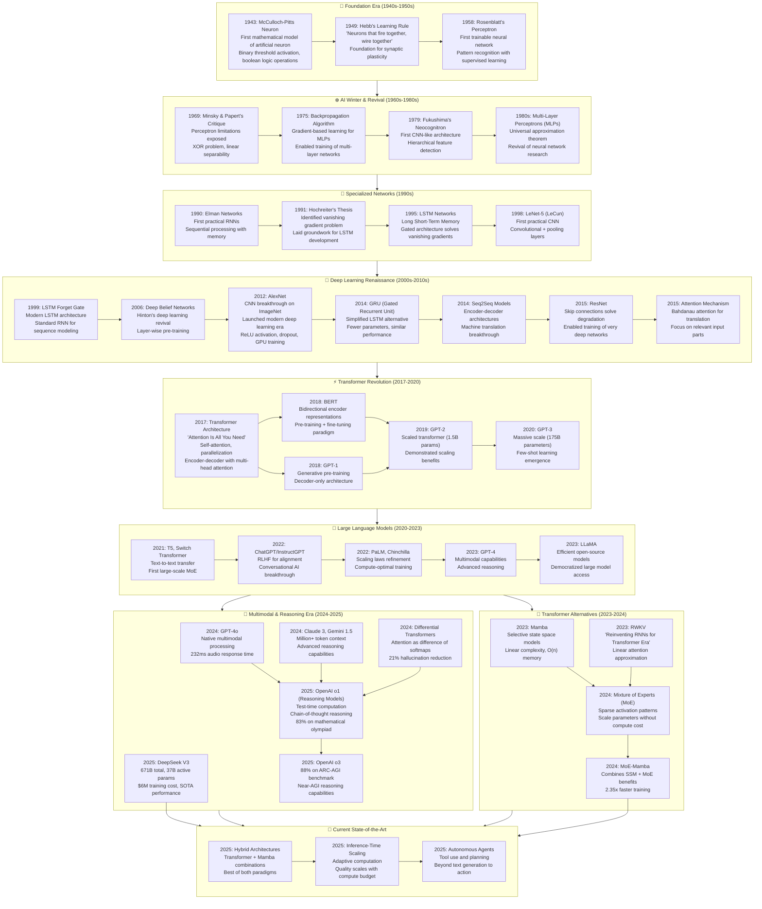

# History of AI up to 2025

```mermaid
graph TD
    subgraph Foundation["🧠 Foundation Era (1940s-1950s)"]
        direction LR
        A["1943: McCulloch-Pitts Neuron<br/>First mathematical model of artificial neuron<br/>Binary threshold activation, boolean logic operations"]
        B["1949: Hebb's Learning Rule<br/>'Neurons that fire together, wire together'<br/>Foundation for synaptic plasticity"]
        C["1958: Rosenblatt's Perceptron<br/>First trainable neural network<br/>Pattern recognition with supervised learning"]
        A --> B --> C
    end

    subgraph Winter["❄️ AI Winter & Revival (1960s-1980s)"]
        direction LR
        D["1969: Minsky & Papert's Critique<br/>Perceptron limitations exposed<br/>XOR problem, linear separability"]
        E["1975: Backpropagation Algorithm<br/>Gradient-based learning for MLPs<br/>Enabled training of multi-layer networks"]
        F["1979: Fukushima's Neocognitron<br/>First CNN-like architecture<br/>Hierarchical feature detection"]
        G["1980s: Multi-Layer Perceptrons (MLPs)<br/>Universal approximation theorem<br/>Revival of neural network research"]
        D --> E --> F --> G
    end

    subgraph Specialized["🔗 Specialized Networks (1990s)"]
        direction LR
        H["1990: Elman Networks<br/>First practical RNNs<br/>Sequential processing with memory"]
        I["1991: Hochreiter's Thesis<br/>Identified vanishing gradient problem<br/>Laid groundwork for LSTM development"]
        J["1995: LSTM Networks<br/>Long Short-Term Memory<br/>Gated architecture solves vanishing gradients"]
        K["1998: LeNet-5 (LeCun)<br/>First practical CNN<br/>Convolutional + pooling layers"]
        H --> I --> J --> K
    end

    subgraph Renaissance["🚀 Deep Learning Renaissance (2000s-2010s)"]
        direction LR
        L["1999: LSTM Forget Gate<br/>Modern LSTM architecture<br/>Standard RNN for sequence modeling"]
        M["2006: Deep Belief Networks<br/>Hinton's deep learning revival<br/>Layer-wise pre-training"]
        N["2012: AlexNet<br/>CNN breakthrough on ImageNet<br/>Launched modern deep learning era<br/>ReLU activation, dropout, GPU training"]
        O["2014: GRU (Gated Recurrent Unit)<br/>Simplified LSTM alternative<br/>Fewer parameters, similar performance"]
        P["2014: Seq2Seq Models<br/>Encoder-decoder architectures<br/>Machine translation breakthrough"]
        Q["2015: ResNet<br/>Skip connections solve degradation<br/>Enabled training of very deep networks"]
        R["2015: Attention Mechanism<br/>Bahdanau attention for translation<br/>Focus on relevant input parts"]
        L --> M --> N --> O --> P --> Q --> R
    end

    subgraph Transformer["⚡ Transformer Revolution (2017-2020)"]
        S["2017: Transformer Architecture<br/>'Attention Is All You Need'<br/>Self-attention, parallelization<br/>Encoder-decoder with multi-head attention"]
        T["2018: BERT<br/>Bidirectional encoder representations<br/>Pre-training + fine-tuning paradigm"]
        U["2018: GPT-1<br/>Generative pre-training<br/>Decoder-only architecture"]
        V["2019: GPT-2<br/>Scaled transformer (1.5B params)<br/>Demonstrated scaling benefits"]
        W["2020: GPT-3<br/>Massive scale (175B parameters)<br/>Few-shot learning emergence"]
        S --> T
        S --> U
        T --> V
        U --> V
        V --> W
    end

    subgraph LLM["🤖 Large Language Models (2020-2023)"]
        direction LR
        X["2021: T5, Switch Transformer<br/>Text-to-text transfer<br/>First large-scale MoE"]
        Y["2022: ChatGPT/InstructGPT<br/>RLHF for alignment<br/>Conversational AI breakthrough"]
        Z["2022: PaLM, Chinchilla<br/>Scaling laws refinement<br/>Compute-optimal training"]
        AA["2023: GPT-4<br/>Multimodal capabilities<br/>Advanced reasoning"]
        BB["2023: LLaMA<br/>Efficient open-source models<br/>Democratized large model access"]
        X --> Y --> Z --> AA --> BB
    end

    subgraph Alternatives["🐍 Transformer Alternatives (2023-2024)"]
        direction LR
        CC["2023: Mamba<br/>Selective state space models<br/>Linear complexity, O(n) memory"]
        DD["2023: RWKV<br/>'Reinventing RNNs for Transformer Era'<br/>Linear attention approximation"]
        EE["2024: Mixture of Experts (MoE)<br/>Sparse activation patterns<br/>Scale parameters without compute cost"]
        FF["2024: MoE-Mamba<br/>Combines SSM + MoE benefits<br/>2.35x faster training"]
        CC --> EE --> FF
        DD --> EE
    end

    subgraph Reasoning["🧠 Multimodal & Reasoning Era (2024-2025)"]
        GG["2024: GPT-4o<br/>Native multimodal processing<br/>232ms audio response time"]
        HH["2024: Claude 3, Gemini 1.5<br/>Million+ token context<br/>Advanced reasoning capabilities"]
        II["2024: Differential Transformers<br/>Attention as difference of softmaps<br/>21% hallucination reduction"]
        JJ["2025: OpenAI o1 (Reasoning Models)<br/>Test-time computation<br/>Chain-of-thought reasoning<br/>83% on mathematical olympiad"]
        KK["2025: DeepSeek V3<br/>671B total, 37B active params<br/>$6M training cost, SOTA performance"]
        LL["2025: OpenAI o3<br/>88% on ARC-AGI benchmark<br/>Near-AGI reasoning capabilities"]
        GG --> JJ
        HH --> JJ
        II --> JJ
        JJ --> LL
    end

    subgraph Current["🚀 Current State-of-the-Art"]
        direction LR
        MM["2025: Hybrid Architectures<br/>Transformer + Mamba combinations<br/>Best of both paradigms"]
        NN["2025: Inference-Time Scaling<br/>Adaptive computation<br/>Quality scales with compute budget"]
        OO["2025: Autonomous Agents<br/>Tool use and planning<br/>Beyond text generation to action"]
        MM --> NN --> OO
    end

    Foundation --> Winter
    Winter --> Specialized
    Specialized --> Renaissance
    Renaissance --> Transformer
    Transformer --> LLM
    LLM --> Alternatives
    LLM --> Reasoning
    Alternatives --> Current
    Reasoning --> Current
    FF --> Current
    KK --> Current
```
