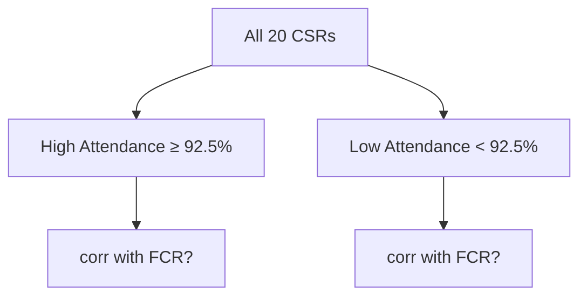
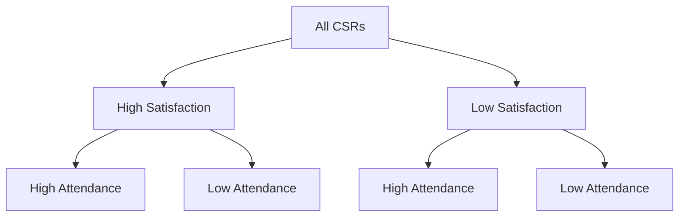

# Customer Support Performance Analysis

### Exploratory Data Analysis in Practice

---

## What We're Doing This Week

A real dataset. A real business problem. Real decisions to make.


- 20 Customer Service Representatives (CSRs)
- 6 Key Performance Indicators (KPIs)
- 1 Weighted Productivity Score
- Many questions to answer

---

## The Business Context

A nationwide customer support center wants to:

- **Identify** top-performing employees
- **Detect** employees needing extra support
- **Understand** what actually drives productivity
- **Challenge** the fixed-weight scoring model

> "The CEO suspects the Productivity Score may be misleading."

---

## The Dataset — KPIs

| Column                  | Description                            |
| ----------------------- | -------------------------------------- |
| `Total_Tickets_Score`   | Issues resolved in a year (normalized) |
| `Avg_Resolution_Time`   | Minutes to resolve a ticket            |
| `Customer_Satisfaction` | Survey feedback score                  |
| `Escalation_Avoidance`  | % of cases NOT escalated               |
| `FCR_Rate`              | % resolved without follow-ups          |
| `Attendance`            | Work attendance %                      |

---

## The Productivity Score Formula

The company uses a **weighted sum**:

$$\text{Productivity} = 0.4T + 0.2R + 0.15S + 0.1E + 0.1F + 0.05A$$

Where:

| Symbol | KPI                    |
| :----: | ---------------------- |
|  $T$   | Total Tickets Score    |
|  $R$   | Resolution Speed Score |
|  $S$   | Customer Satisfaction  |
|  $E$   | Escalation Avoidance   |
|  $F$   | FCR Rate               |
|  $A$   | Attendance             |

---

## Why Question Fixed Weights?

The formula **assumes** tickets resolved matters 8x more than attendance.

**But what if…**

- A fast resolver has terrible customer satisfaction?
- High attendance correlates perfectly with FCR?
- Two KPIs measure nearly the same thing?

That's what **correlation analysis** will tell us.

---

# Step 1: Loading & Inspecting the Data

---

## Load the CSV

```python
import pandas as pd
import numpy as np

data = pd.read_csv('csr_analysis.csv')
data.head()
```

Always start with `.head()` — get a feel for the data before touching anything.

---

## Inspect Shape and Types

```python
def take_a_look(data_to_look):
    print(data_to_look.info())
    print()
    print(data_to_look.describe())

take_a_look(data)
```

- `.info()` → column names, types, null count
- `.describe()` → min, max, mean, std, percentiles

---

## What `.describe()` Tells You

For `Attendance`:

| stat | value |
| :--: | :---: |
| min  |  85%  |
| 25%  |  90%  |
| 50%  | 92.5% |
| 75%  |  95%  |
| max  |  99%  |

> The **median (50%)** becomes our natural threshold for segmentation.

---

# Step 2: Correlation Analysis

---

## Select Numerical Columns

```python
numerical_columns = [
    'Total_Tickets_Score',
    'Avg_Resolution_Time',
    'Customer_Satisfaction',
    'Escalation_Avoidance',
    'FCR_Rate',
    'Attendance'
]

data_numerical = data[numerical_columns]
data_numerical.corr()
```

---

## Reading a Correlation Matrix

|   Value   | Meaning                      |
| :-------: | ---------------------------- |
|   `1.0`   | Perfect positive correlation |
| `0.7–0.9` | Strong positive              |
| `0.4–0.6` | Moderate positive            |
| `0.0–0.3` | Weak / no correlation        |
|   `< 0`   | Negative correlation         |

> **Key insight:** high correlation between two KPIs = redundant weight in the formula.

---

## Correlation Helper Function

```python
def correlation_columns(data, col_1, col_2):
    corr_value = data[col_1].corr(data[col_2])
    return corr_value
```

Reusable. Clean. Works on any subset of the data.

---

# Step 3: Computing the Productivity Score

---

## Add the New Column

```python
data['Performance_Score'] = (
    (data['Total_Tickets_Score']   * 0.4) +
    (data['Avg_Resolution_Time']   * 0.2) +
    (data['Customer_Satisfaction'] * 0.15) +
    (data['Escalation_Avoidance']  * 0.1) +
    (data['FCR_Rate']              * 0.1) +
    (data['Attendance']            * 0.05)
)
```

Now we can rank employees and also question whether this ranking is fair.

---

# Step 4: Segmentation Analysis

---

## Why Segment?

A single correlation on the whole dataset can **hide patterns** within subgroups.



The answer in each segment may be very different.

---

## Creating Segments with Masks

```python
# Threshold: median attendance
mask_high = data_numerical['Attendance'] >= 92.5
mask_low  = np.invert(mask_high)

data_high_attendance = data_numerical[mask_high]
data_low_attendance  = data_numerical[mask_low]
```

Boolean masks let you slice any subset without copying or losing the original.

---

## Analyzing Both Segments

```python
corr_high = correlation_columns(
    data_high_attendance, 'Attendance', 'FCR_Rate'
)
corr_low = correlation_columns(
    data_low_attendance, 'Attendance', 'FCR_Rate'
)

print("High attendance group:", corr_high)
print("Low attendance group: ", corr_low)
```

---

## What Did We Find?

**Attendance → FCR Rate:**

- High attendance group: strong positive correlation
- Low attendance group: weaker / different pattern

> When employees show up consistently, they resolve more cases without follow-ups.

But is this because attendance **causes** better FCR, or because both reflect the same underlying work ethic?

---

## Attendance → Resolution Time

```python
corr_high_res = correlation_columns(
    data_high_attendance, 'Attendance', 'Avg_Resolution_Time'
)
corr_low_res = correlation_columns(
    data_low_attendance, 'Attendance', 'Avg_Resolution_Time'
)
```

**Expected finding:** negative correlation — employees who attend more resolve tickets **faster**.

---

# Step 5: Multi-Level Segmentation

---

## Two Dimensions at Once

We can layer masks to answer more specific questions:



This creates **4 groups** from 2 binary dimensions.

---

## A Reusable Filter Function

```python
def get_subset(data, column, threshold, condition):
    """
    data      : DataFrame to filter
    column    : column to filter on
    threshold : numeric cutoff
    condition : '>=' or '<'
    """
    if condition == '>=':
        mask = data[column] >= threshold
    else:
        mask = data[column] < threshold
    return data[mask]
```

**Design principle:** abstract repeated logic into functions.

---

## Applying the 4-Group Split

```python
# First split: satisfaction
data_high_sat = get_subset(data, 'Customer_Satisfaction', 89.5, '>=')
data_low_sat  = get_subset(data, 'Customer_Satisfaction', 89.5, '<')

# Second split: attendance within each group
data_hs_ha = get_subset(data_high_sat, 'Attendance', 92.5, '>=')
data_hs_la = get_subset(data_high_sat, 'Attendance', 92.5, '<')
data_ls_ha = get_subset(data_low_sat,  'Attendance', 92.5, '>=')
data_ls_la = get_subset(data_low_sat,  'Attendance', 92.5, '<')
```

---

## Looping Over Segments

```python
groups = [data_hs_ha, data_hs_la, data_ls_ha, data_ls_la]
labels = [
    'High satisfaction + High attendance',
    'High satisfaction + Low attendance',
    'Low satisfaction  + High attendance',
    'Low satisfaction  + Low attendance',
]

for group, label in zip(groups, labels):
    corr = correlation_columns(group, 'Attendance', 'Customer_Satisfaction')
    print(f"{label}: {corr:.3f}")
```

---

# Theme-Based Analysis Framework

---

## From Data → Business Questions

Good analysis starts with **themes**, not random correlations.

A theme gives every sub-question a purpose:

```
Theme → Why does this matter to the business?
  ├── Sub-question 1 → specific measurement
  ├── Sub-question 2 → specific measurement
  └── Sub-question 3 → specific measurement
```

---

## Example Theme: Attendance & Productivity

**Theme:** Does attendance drive actual performance, or just the score?

**Sub-questions:**

- Do high-attendance employees resolve more tickets per hour?
- Is there a threshold of attendance below which FCR drops sharply?
- Do employees with perfect attendance also have lower escalation rates?

---

## Example Theme: Resolution Speed vs. Quality

**Theme:** Is faster always better?

**Sub-questions:**

- Do the fastest resolvers have lower customer satisfaction scores?
- Is there a "sweet spot" resolution time that maximizes both speed and satisfaction?
- Do employees with low resolution times also have higher escalation rates?

---

## Your Turn — Brainstorm Two Themes

For each theme you identify:

1. State the **business motivation** — why does the CEO care?
2. Write **at least two sub-questions** that can be answered with the data
3. Identify which **columns** you would correlate or segment

> A good theme tells a story. A bad theme is just a column name.

---

## Common Pitfalls

| Pitfall                     | Why It's a Problem                          |
| --------------------------- | ------------------------------------------- |
| Correlation ≠ causation     | High corr doesn't mean one causes the other |
| Small samples               | Segments may have only 3–5 rows             |
| Cherry-picking thresholds   | Median is safer than arbitrary cutoffs      |
| Over-interpreting weak corr | `0.15` is probably noise                    |

---

## Week Summary


---

## Key Takeaways

- **Fixed-weight scores can mislead** — always interrogate formulas
- **Segmentation reveals hidden patterns** — a global correlation can mask subgroup behavior
- **Reusable functions** make analysis reproducible and readable
- **Business questions first** — then code, never the other way around
- **Correlation is a starting point**, not a conclusion

---

## Next Steps

- Visualize the correlation matrix as a **heatmap**
- Use **scatter plots** to visually validate correlations
- Explore **outlier employees** — who is unusually high or low?
- Build your own **theme + sub-questions** and present findings

> _"The goal is to turn data into information, and information into insight."_ — Carly Fiorina
