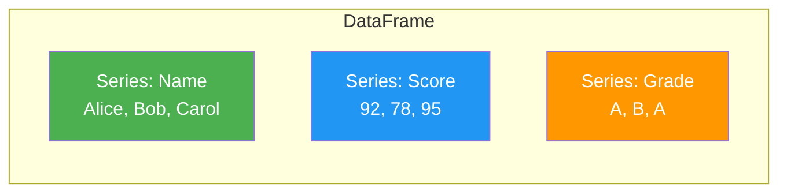
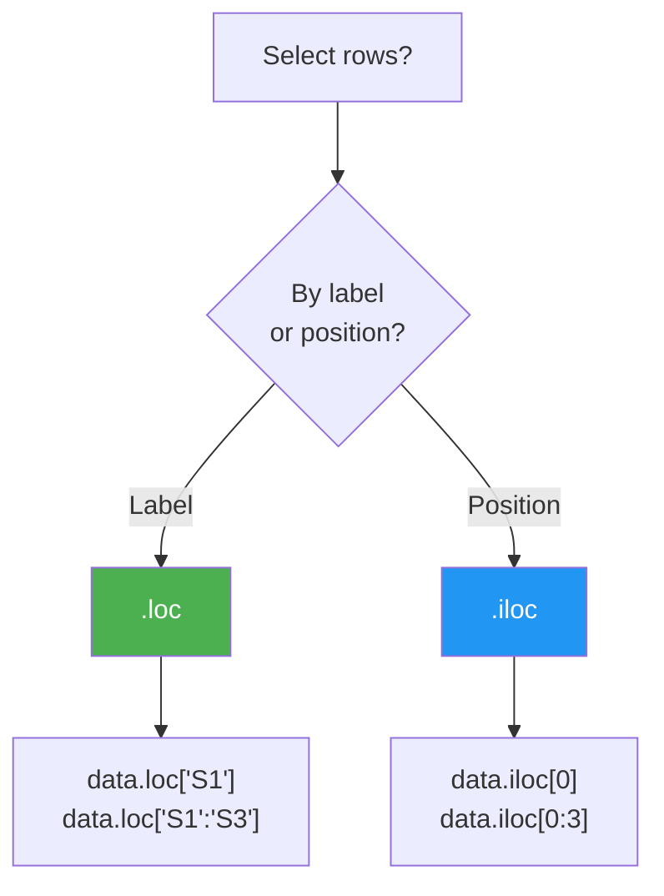
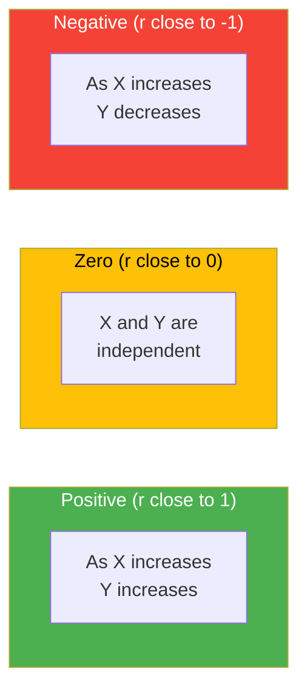
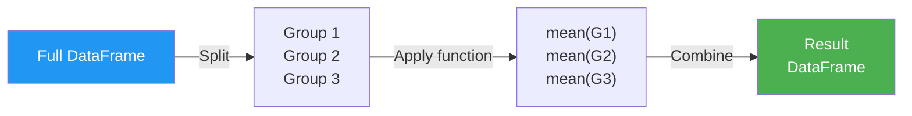

# Pandas DataFrame

### Two-Dimensional Data Structures

---

## What is a DataFrame?

A **2-dimensional** labeled data structure — like a spreadsheet or SQL table

| Index | Name  | Score | Grade |
| :---: | :---: | :---: | :---: |
|   0   | Alice |  92   |   A   |
|   1   |  Bob  |  78   |   B   |
|   2   | Carol |  95   |   A   |

- Rows have an **index** (labels)
- Columns have **names** (headers)
- Each column is a **Series**

---

## DataFrame = Collection of Series



Each column is an independent **Series** that shares the same index.

---

## Today's Roadmap


1. **Create** DataFrames from dictionaries and CSV files
2. **Inspect** shape, columns, types, and statistics
3. **Select** rows and columns with `loc` and `iloc`
4. **Modify** — add, compute, and transform columns
5. **Analyze** — correlations and conditional logic

---

# Creating DataFrames

---

## From a Dictionary of Lists

The most common way to create a DataFrame in code:

```python
import pandas as pd

my_dict = {
    'Student_Name': list("abcdefghi"),
    'First_Score':  [100, 90, 92, 95, 87, 88, 70, 75, 65],
    'Second_Score': [80, 45, 56, 55, 68, 92, 95, 87, 88],
    'Third_Score':  [30, 40, 80, 98, 92, 95, 87, 55, 75]
}

data = pd.DataFrame(my_dict)
data
```

- Keys become **column names**
- Lists become **column values**
- Index is auto-generated: 0, 1, 2, ...

---

## From a CSV File

Load real-world data with a single line:

```python
df = pd.read_csv("employee_performance.csv")
df.head()
```

| Employee_ID | Employee_Name | Total_Tickets_Resolved | Avg_Resolution_Time | ... |
| :---------: | :-----------: | :--------------------: | :-----------------: | --- |
|      1      | Zoro Roronoa  |           95           |         20          | ... |
|      2      | Alice Johnson |           88           |         25          | ... |
|      3      |   Bob Smith   |           70           |         45          | ... |

Other formats: `pd.read_excel()`, `pd.read_json()`, `pd.read_sql()`

---

## Creating with a Custom Index

Replace the default 0-based index with meaningful labels:

```python
idx = ['S1', 'S2', 'S3', 'S4', 'S5', 'S6', 'S7', 'S8', 'S9']

data = pd.DataFrame(my_dict, index=idx)
data
```

|     | Student_Name | First_Score | Second_Score | Third_Score |
| :-: | :----------: | :---------: | :----------: | :---------: |
| S1  |      a       |     100     |      80      |     30      |
| S2  |      b       |     90      |      45      |     40      |
| S3  |      c       |     92      |      56      |     80      |

Now you access rows by label: `data.loc['S1']` instead of `data.loc[0]`.

---

## Setting an Existing Column as Index

```python
data = data.set_index('Student_Name')
data
```

|     | First_Score | Second_Score | Third_Score |
| :-: | :---------: | :----------: | :---------: |
|  a  |     100     |      80      |     30      |
|  b  |     90      |      45      |     40      |
|  c  |     92      |      56      |     80      |

The `Student_Name` column moves to the index. Access by name: `data.loc['a']`

---

# Inspecting DataFrames

---

## Key Attributes

```python
data.shape      # (rows, columns) → (9, 4)
data.columns    # Column names
data.index      # Row labels
data.dtypes     # Data type of each column
data.values     # Underlying NumPy array
data.axes       # [row_index, column_index]
```

| Attribute  | Returns            | Example Output       |
| ---------- | ------------------ | -------------------- |
| `.shape`   | Tuple (rows, cols) | `(20, 8)`            |
| `.columns` | Column name index  | `Index(['Name', …])` |
| `.dtypes`  | Type per column    | `int64, float64, …`  |
| `.size`    | Total cells        | `160`                |

---

## Quick Look Methods

```python
data.head(3)     # First 3 rows
data.tail(3)     # Last 3 rows
data.sample(5)   # 5 random rows
data.info()      # Column types, non-null counts, memory
```

`info()` output:

```
<class 'pandas.core.frame.DataFrame'>
RangeIndex: 20 entries, 0 to 19
Data columns (total 8 columns):
 #  Column                  Non-Null Count  Dtype
 0  Employee_ID             20 non-null     int64
 1  Employee_Name           20 non-null     object
 ...
memory usage: 1.4+ KB
```

---

## Statistical Summary: `describe()`

```python
data.describe()
```

|       | Total_Tickets_Resolved | Avg_Resolution_Time | Customer_Satisfaction |
| :---: | :--------------------: | :-----------------: | :-------------------: |
| count |           20           |         20          |          20           |
| mean  |         79.85          |        34.35        |         89.40         |
|  std  |         10.27          |        11.42        |         5.13          |
|  min  |           60           |         18          |          80           |
|  25%  |         71.50          |        25.50        |         85.50         |
|  50%  |         79.50          |        34.00        |         89.00         |
|  75%  |         89.25          |        43.50        |         93.25         |
|  max  |           95           |         55          |          98           |

Count, mean, std, min, quartiles, max — **all in one call**.

---

# Selecting Data

---

## Selecting Columns

```python
# Single column → returns a Series
data['First_Score']

# Multiple columns → returns a DataFrame
data[['First_Score', 'Second_Score']]
```

Use **single brackets** for one column, **double brackets** for multiple.

```python
# Dot notation (only for simple column names)
data.First_Score
```

Dot notation doesn't work if column name has spaces or conflicts with a method name.

---

## Selecting Rows: `loc` vs `iloc`



| Method  | Indexing        | Example        | Inclusive? |
| ------- | --------------- | -------------- | ---------- |
| `.loc`  | By **label**    | `data.loc[1]`  | Yes, both  |
| `.iloc` | By **position** | `data.iloc[1]` | No, end    |

---

## `loc` — Label-Based Selection

```python
# Single row (returns Series)
data.loc[1]

# Multiple rows (returns DataFrame)
data.loc[[5, 8]]

# Slice (inclusive on both ends!)
data.loc[2:5]

# Every other row
data.loc[::2]
```

With a custom index:

```python
data.loc['S1']          # Row labeled 'S1'
data.loc['S1':'S3']     # Rows S1 through S3 (inclusive)
```

---

## `iloc` — Position-Based Selection

```python
# Single row by position
data.iloc[0]           # First row

# Multiple rows
data.iloc[[0, 3, 7]]   # Rows at positions 0, 3, 7

# Slice (exclusive end — like Python lists)
data.iloc[0:3]          # Rows 0, 1, 2
```

Works the same regardless of index labels. Use `iloc` when you need position-based access on a DataFrame with a custom index.

---

## Selecting Rows AND Columns

```python
# loc: by label
data.loc[[0, 3], ['First_Score']]

# iloc: by position
data.iloc[[0, 3], [1]]

# Slice rows, pick columns
data.loc[0:5, ['First_Score', 'Third_Score']]

# All rows, specific column by position
data.iloc[:, [1]]
```

Syntax: `data.loc[row_selection, column_selection]`

First argument selects **rows**, second selects **columns**.

---

## Boolean Filtering

Select rows that match a condition:

```python
# Employees with satisfaction > 90
df[df['Customer_Satisfaction'] > 90]

# Multiple conditions (use & for AND, | for OR)
df[(df['Customer_Satisfaction'] > 90) & (df['Attendance'] > 95)]
```

Each condition returns a boolean Series. The result is a DataFrame with only the matching rows.

**Parentheses are required** around each condition when combining with `&` or `|`.

---

# Modifying DataFrames

---

## Adding New Columns

```python
# Computed column
data['Average'] = (
    data['First_Score'] +
    data['Second_Score'] +
    data['Third_Score']
) / 3

# Alternative: use .mean() across axis=1
data['Average'] = data[['First_Score', 'Second_Score',
                         'Third_Score']].mean(axis=1)
```

| axis=0 | Compute **down** each column (default) |
| ------ | -------------------------------------- |
| axis=1 | Compute **across** each row            |

---

## Conditional Columns

Create a column based on a condition:

```python
# Boolean column
class_avg = data['Average'].mean()
data['Above_Average'] = data['Average'] >= class_avg
```

Using `np.where` for if/else:

```python
import numpy as np
data['Performance'] = np.where(
    data['Average'] >= class_avg,
    'Above Average',
    'Below Average'
)
```

Using `apply` for complex logic:

```python
data['Grade'] = data['Average'].apply(
    lambda x: 'A' if x >= 90 else 'B' if x >= 80 else 'C'
)
```

---

## Renaming Columns

```python
# Rename specific columns
data = data.rename(columns={
    'First_Score': 'Exam_1',
    'Second_Score': 'Exam_2'
})

# Rename all columns at once
data.columns = ['Name', 'E1', 'E2', 'E3']
```

---

## Dropping Rows and Columns

```python
# Drop a column
data = data.drop(columns=['Third_Score'])

# Drop a row by index
data = data.drop(index=3)

# Drop rows where Average < 50
data = data.drop(data[data['Average'] < 50].index)
```

All drop operations return a **new DataFrame** by default. Use `inplace=True` to modify in place.

---

# Analyzing Data

---

## Correlation Matrix

```python
# Correlation between all numeric columns
data.corr()
```

|              | First_Score | Second_Score | Third_Score |
| :----------: | :---------: | :----------: | :---------: |
| First_Score  |    1.00     |    -0.12     |    0.05     |
| Second_Score |    -0.12    |     1.00     |    0.38     |
| Third_Score  |    0.05     |     0.38     |    1.00     |

- **1.0** = perfect positive correlation
- **-1.0** = perfect negative correlation
- **0** = no correlation

---

## Correlation: Visual Intuition



**Employee data insight:** Do employees who resolve more tickets also have higher satisfaction scores?

```python
df[['Total_Tickets_Resolved', 'Customer_Satisfaction']].corr()
```

---

## Sorting

```python
# Sort by one column
data.sort_values('Average', ascending=False)

# Sort by multiple columns
data.sort_values(['Performance', 'Average'],
                  ascending=[True, False])

# Sort by index
data.sort_index()
```

---

## Aggregation Methods

```python
data['Score'].sum()       # Total
data['Score'].mean()      # Average
data['Score'].median()    # Median
data['Score'].std()       # Standard deviation
data['Score'].min()       # Minimum
data['Score'].max()       # Maximum
data['Score'].count()     # Non-null count
data['Score'].nunique()   # Unique values
data['Score'].value_counts()  # Frequency table
```

All of these work on a **Series** (single column) or with `axis` on a **DataFrame**.

---

## GroupBy: Split-Apply-Combine

```python
# Average satisfaction per team/group
df.groupby('team')['Customer_Satisfaction'].mean()

# Multiple aggregations
df.groupby('team').agg({
    'Total_Tickets_Resolved': 'sum',
    'Customer_Satisfaction': 'mean',
    'Attendance': 'mean'
})
```



---

# Practical Example

### Employee Performance Analysis

---

## Loading the Data

```python
import pandas as pd

df = pd.read_csv("employee_performance.csv")
print(f"Shape: {df.shape}")
print(f"Columns: {list(df.columns)}")
df.head()
```

Columns:

- `Employee_ID`, `Employee_Name`
- `Total_Tickets_Resolved`, `Avg_Resolution_Time`
- `Customer_Satisfaction`, `Escalation_Rate`
- `FCR_Rate` (First Contact Resolution), `Attendance`

---

## Step 1: Inspect

```python
df.describe()
df.info()
df.corr(numeric_only=True)
```

Questions to explore:

- Who resolves the most tickets?
- Is there a correlation between resolution time and satisfaction?
- Which employees have the best attendance AND performance?

---

## Step 2: Analyze

```python
# Top 5 performers by tickets resolved
df.nlargest(5, 'Total_Tickets_Resolved')[
    ['Employee_Name', 'Total_Tickets_Resolved']
]

# Correlation: faster resolution → higher satisfaction?
df[['Avg_Resolution_Time', 'Customer_Satisfaction']].corr()

# Filter: high performers (satisfaction > 90 AND attendance > 95)
stars = df[
    (df['Customer_Satisfaction'] > 90) &
    (df['Attendance'] > 95)
]
stars[['Employee_Name', 'Customer_Satisfaction', 'Attendance']]
```

---

## Step 3: Create Metrics

```python
# Composite performance score (weighted average)
df['Performance_Score'] = (
    df['Total_Tickets_Resolved'] * 0.25 +
    df['Customer_Satisfaction']  * 0.25 +
    df['FCR_Rate']              * 0.25 +
    df['Attendance']            * 0.25
)

# Rank employees
df['Rank'] = df['Performance_Score'].rank(ascending=False)
df.sort_values('Rank')[
    ['Rank', 'Employee_Name', 'Performance_Score']
].head()
```

---

## Step 4: Categorize

```python
import numpy as np

# Performance tiers
df['Tier'] = np.where(
    df['Performance_Score'] >= 92, 'Star',
    np.where(
        df['Performance_Score'] >= 85, 'Solid',
        'Needs Improvement'
    )
)

# Count per tier
df['Tier'].value_counts()
```

| Tier              | Count |
| ----------------- | ----- |
| Solid             | 10    |
| Star              | 6     |
| Needs Improvement | 4     |

---

# Quick Reference

---

## DataFrame Cheat Sheet

| Task               | Code                             |
| ------------------ | -------------------------------- |
| Create             | `pd.DataFrame(dict)`             |
| Load CSV           | `pd.read_csv("file.csv")`        |
| Shape              | `df.shape`                       |
| First rows         | `df.head(n)`                     |
| Stats              | `df.describe()`                  |
| Select column      | `df['col']` or `df[['c1','c2']]` |
| Select row (label) | `df.loc[label]`                  |
| Select row (pos)   | `df.iloc[pos]`                   |
| Filter             | `df[df['col'] > value]`          |
| New column         | `df['new'] = expression`         |
| Sort               | `df.sort_values('col')`          |
| Group              | `df.groupby('col').agg(func)`    |
| Correlation        | `df.corr(numeric_only=True)`     |
| Drop column        | `df.drop(columns=['col'])`       |

---

## `loc` vs `iloc` Summary

| Feature       | `loc`                 | `iloc`            |
| ------------- | --------------------- | ----------------- |
| Indexing      | By **label**          | By **position**   |
| Slice end     | **Inclusive**         | **Exclusive**     |
| Column select | By **name**           | By **number**     |
| Example       | `df.loc[0:3, 'Name']` | `df.iloc[0:3, 0]` |
| Custom index  | `df.loc['S1':'S3']`   | `df.iloc[0:3]`    |

**Rule of thumb:** Use `loc` when you know the labels, `iloc` when you know the positions.

---

## Key Takeaways

1. A DataFrame is a **2D labeled table** — rows have an index, columns have names
2. Each column is a **Series** — all DataFrame operations are built on Series
3. **`loc`** selects by label (inclusive slicing), **`iloc`** selects by position (exclusive end)
4. **Boolean filtering** is the primary way to query data: `df[df['col'] > value]`
5. **New columns** are created by assignment: `df['new'] = expression`
6. **`describe()`** gives instant statistical summary; **`corr()`** reveals relationships
7. **`groupby()`** enables split-apply-combine analysis

---

## Next Steps


**Practice:** Open `WB_DataFrame.ipynb` and complete all the TODO cells using the employee performance dataset.
