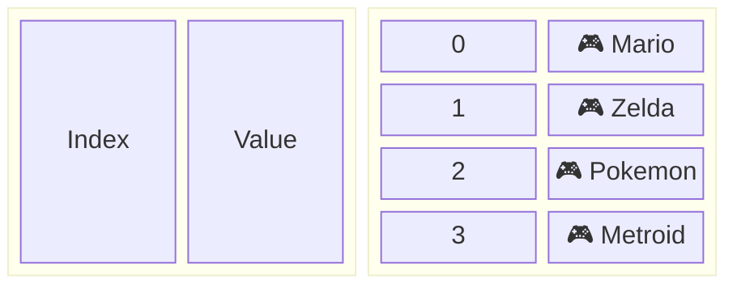
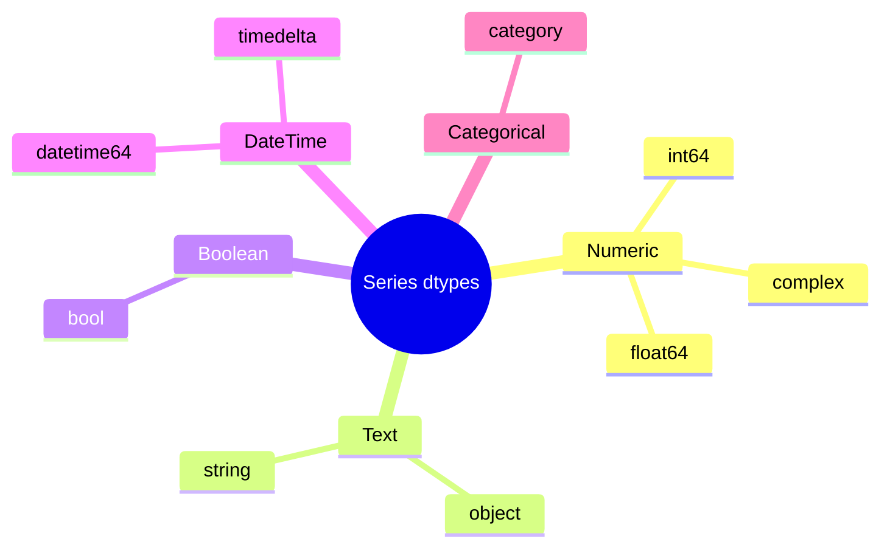
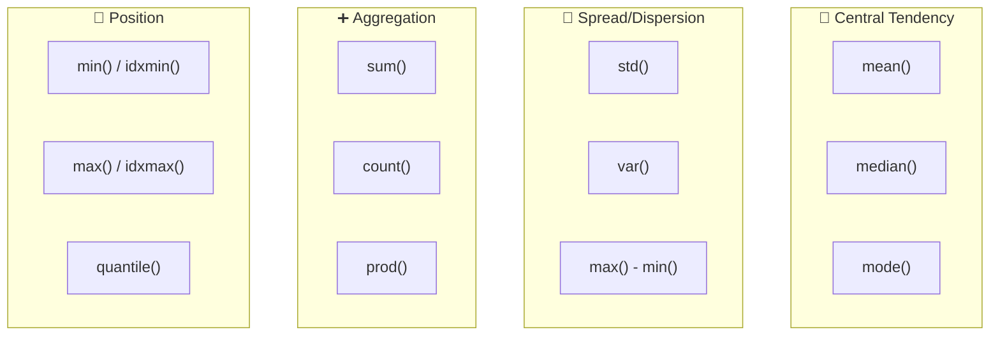
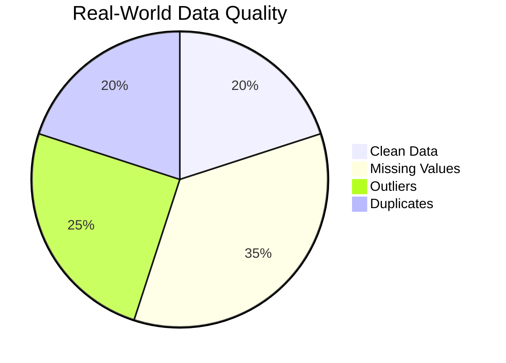
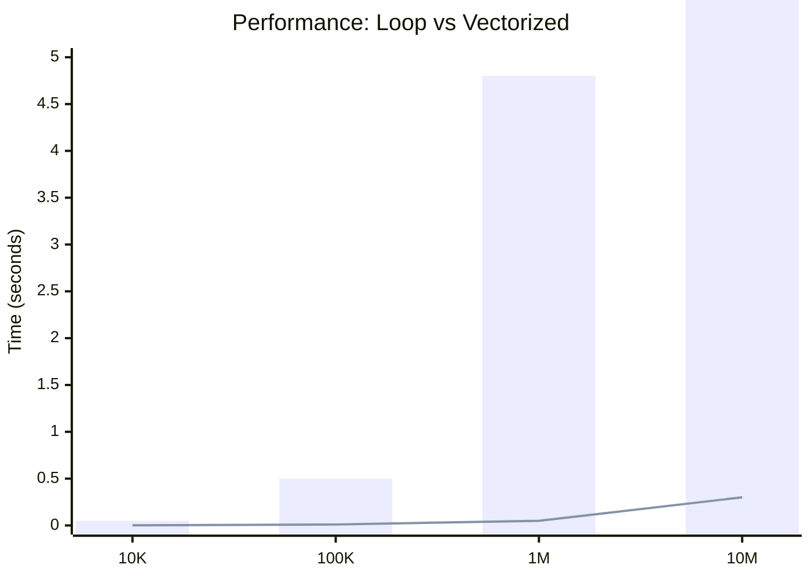

# Introduction to Pandas 🐼

### Python Data Analysis Library

---

## What is Pandas?

- Open source Python library for **data manipulation and analysis**
- Created by **Wes McKinney** in 2008
- Name refers to "**Pan**el **Da**ta" and "Python Data Analysis"

---

## 🌍 Real-World Use Case

**Netflix** uses Pandas to analyze viewing patterns:

```python
# Imagine analyzing 200M+ subscribers
viewing_data = pd.read_csv("netflix_views.csv")
top_shows = viewing_data.groupby("show").sum()
recommendations = top_shows.nlargest(10, "hours_watched")
```

_Spotify, Uber, Airbnb — all use Pandas daily!_

---

## 🗺️ Course Roadmap


**Today: Series** — The foundation of everything!

---

## Why Use Pandas?

- 📊 Easy data loading (CSV, Excel, SQL, JSON)
- 🧹 Powerful data cleaning tools
- 🔍 Intuitive data exploration
- ⚡ Fast operations on large datasets
- 📈 Integration with visualization libraries

---

## ⚔️ Pandas vs. The Competition

| Task             |   Excel   | Python List |  Pandas Series  |
| ---------------- | :-------: | :---------: | :-------------: |
| Sum column       | `=SUM()`  | `sum(list)` |    `s.sum()`    |
| Filter data      | Manual 😰 |  List comp  | `s[s > 10]` ✨  |
| Handle missing   |    😰     |     😰      | `s.fillna()` ✨ |
| 1M+ rows         | 💀 Crash  |   🐌 Slow   |     ⚡ Fast     |
| Memory efficient |    ❌     |     ❌      |       ✅        |

---

## Installation

```python
pip install pandas
```

```python
import pandas as pd
import numpy as np
```

> 💡 **Pro Tip:** Always import pandas as `pd` — it's the universal convention!

---

# Pandas Series 📊

---

## What is a Series?

A **one-dimensional** labeled array

Think of it as a **single column** in a spreadsheet



---

## Creating an Empty Series

```python
import pandas as pd

series_empty = pd.Series()
print(series_empty)
```

Output:

```
Series([], dtype: float64)
```

> ⚠️ **Note:** Empty Series are rare in practice — you'll usually load data!

---

## 🎮 Creating Series from a List

```python
# Video game ratings (out of 10)
ratings = [9.5, 8.7, 9.8, 7.5, 9.0]

game_series = pd.Series(ratings)
print(game_series)
```

Output:

```
0    9.5
1    8.7
2    9.8
3    7.5
4    9.0
dtype: float64
```

---

## Series with Different Data Types

**Strings — Anime Characters:**

```python
crew = pd.Series(["Luffy", "Zoro", "Sanji", "Nami"])
print(crew)
```

**Booleans — Episode Watched?:**

```python
watched = pd.Series([True, True, False, True])
print(watched)
```

> 💡 **Pro Tip:** Pandas auto-detects the best dtype for your data!

---

## 🔢 Supported Data Types



---

## Accessing Elements

```python
pokemon_hp = pd.Series([45, 80, 100, 39, 78])

# Single element
print(pokemon_hp[2])  # Output: 100

# Multiple elements (fancy indexing)
print(pokemon_hp[[0, 2, 4]])
```

Output:

```
0     45
2    100
4     78
dtype: int64
```

---

## 🎯 Slicing Series

```python
s = pd.Series([10, 20, 30, 40, 50, 60])

print(s[1:4])    # Elements 1 to 3
print(s[:3])     # First 3 elements
print(s[-2:])    # Last 2 elements
```

> 💡 **Pro Tip:** Slicing works just like Python lists!

---

# Custom Indexing 🏷️

---

## 🎮 Creating Custom Index

```python
# Pokemon HP with meaningful labels!
pokemon_hp = pd.Series(
    data=[45, 80, 100, 39, 78],
    index=["Pikachu", "Charizard", "Snorlax", "Charmander", "Gengar"]
)
print(pokemon_hp)
```

Output:

```
Pikachu       45
Charizard     80
Snorlax      100
Charmander    39
Gengar        78
dtype: int64
```

---

## Accessing with Custom Index

```python
# Access by label — so intuitive!
print(pokemon_hp["Snorlax"])  # Output: 100

# Access multiple Pokemon
print(pokemon_hp[["Pikachu", "Charizard", "Gengar"]])
```

Output:

```
Pikachu      45
Charizard    80
Gengar       78
dtype: int64
```

---

## 🍜 Creating Series from Dictionary

```python
ramen_prices = {
    "Tonkotsu": 12.99,
    "Shoyu": 11.50,
    "Miso": 13.25,
    "Shio": 10.99
}

menu = pd.Series(ramen_prices)
print(menu)
```

Output:

```
Tonkotsu    12.99
Shoyu       11.50
Miso        13.25
Shio        10.99
dtype: float64
```

---

## Dictionary Keys = Index

```python
# Access by key (index)
print(menu["Miso"])  # Output: 13.25

# View all indices
print(menu.index)
# Index(['Tonkotsu', 'Shoyu', 'Miso', 'Shio'], dtype='object')
```

---

## 🎯 Challenge #1: Create Your Series!

Try creating a Series of your **5 favorite songs** with their **play counts**:

```python
my_playlist = pd.Series(
    data=[_____, _____, _____, _____, _____],
    index=["Song1", "Song2", "Song3", "Song4", "Song5"]
)

# Find your most played song!
print(f"Most played: {my_playlist.idxmax()}")
print(f"Play count: {my_playlist.max()}")
```

⏱️ **Try it yourself!**

---

# Series Attributes 📋

---

## Common Attributes

```python
spotify_streams = pd.Series(
    [2_100_000, 3_500_000, 4_200_000, 2_800_000],
    index=['Bad Guy', 'Shape of You', 'Blinding Lights', 'Dance Monkey']
)
```

| Attribute  | Output             | Description        |
| ---------- | ------------------ | ------------------ |
| `s.values` | `[2100000 ...]`    | NumPy array        |
| `s.index`  | `['Bad Guy', ...]` | Index labels       |
| `s.dtype`  | `int64`            | Data type          |
| `s.size`   | `4`                | Number of elements |
| `s.shape`  | `(4,)`             | Dimensions         |

---

## 🔍 Inspection Methods

```python
# Quick overview
print(spotify_streams.head(2))   # First 2 elements
print(spotify_streams.tail(2))   # Last 2 elements
print(spotify_streams.describe()) # Statistics summary
```

Output of `.describe()`:

```
count    4.000000e+00
mean     3.150000e+06
std      9.469475e+05
min      2.100000e+06
max      4.200000e+06
```

---

# Series Methods 🛠️

---

## 📊 Statistical Methods

```python
scores = pd.Series([85, 92, 78, 95, 88, 76, 91])

print(f"Total: {scores.sum()}")      # 605
print(f"Average: {scores.mean()}")   # 86.43
print(f"Lowest: {scores.min()}")     # 76
print(f"Highest: {scores.max()}")    # 95
print(f"Std Dev: {scores.std():.2f}") # 7.23
print(f"Median: {scores.median()}")  # 88
```

---

## 📈 Stats Method Overview



---

## Sorting Methods

```python
anime_ratings = pd.Series(
    [9.1, 8.5, 9.8, 7.9, 8.8],
    index=["Naruto", "Bleach", "Attack on Titan", "Fairy Tail", "One Piece"]
)

# Sort by values (ascending)
print(anime_ratings.sort_values())

# Sort by values (descending) — Top rated first!
print(anime_ratings.sort_values(ascending=False))

# Sort alphabetically by index
print(anime_ratings.sort_index())
```

---

## 📊 Value Counts

```python
genres = pd.Series(["Action", "RPG", "Action", "RPG", "RPG", "Sports", "Action"])

print(genres.value_counts())
```

Output:

```
RPG       3
Action    3
Sports    1
dtype: int64
```

> 💡 **Pro Tip:** Perfect for analyzing categorical data!

---

# 🧹 Missing Data Handling

---

## The Reality of Real Data



**You WILL encounter missing data!** Pandas uses `NaN` (Not a Number) to represent it.

---

## Detecting Missing Values

```python
import numpy as np

# Survey responses (some people didn't answer)
survey = pd.Series([5, np.nan, 4, np.nan, 3, 5, np.nan, 4])

# Find missing values
print(survey.isna())      # Boolean mask
print(survey.notna())     # Inverse

# Count missing
print(f"Missing: {survey.isna().sum()}")  # 3
print(f"Valid: {survey.notna().sum()}")   # 5
```

---

## Handling Missing Values

```python
survey = pd.Series([5, np.nan, 4, np.nan, 3, 5, np.nan, 4])

# Option 1: Remove missing values
clean = survey.dropna()
print(clean)  # [5, 4, 3, 5, 4]

# Option 2: Fill with a value
filled = survey.fillna(0)
print(filled)  # [5, 0, 4, 0, 3, 5, 0, 4]

# Option 3: Fill with mean
filled_mean = survey.fillna(survey.mean())
print(filled_mean)  # [5, 4.2, 4, 4.2, 3, 5, 4.2, 4]
```

---

## 🎯 Fill Strategies

```python
prices = pd.Series([100, np.nan, np.nan, 150, np.nan, 200])

# Forward fill (use previous value)
print(prices.ffill())  # [100, 100, 100, 150, 150, 200]

# Backward fill (use next value)
print(prices.bfill())  # [100, 150, 150, 150, 200, 200]

# Interpolate (linear)
print(prices.interpolate())  # [100, 116.67, 133.33, 150, 175, 200]
```

---

# 🔤 String Methods

---

## The `.str` Accessor

Pandas provides **vectorized string operations**!

```python
names = pd.Series(["  NARUTO  ", "sasuke", "SAKURA", "kakashi"])

# Clean and standardize
clean_names = names.str.strip().str.title()
print(clean_names)
```

Output:

```
0     Naruto
1     Sasuke
2     Sakura
3    Kakashi
dtype: object
```

---

## Common String Methods

```python
titles = pd.Series(["The Matrix", "Star Wars", "The Godfather", "Inception"])

# Check content
print(titles.str.contains("The"))    # [True, False, True, False]
print(titles.str.startswith("The"))  # [True, False, True, False]
print(titles.str.len())              # [10, 9, 13, 9]

# Transform
print(titles.str.upper())            # ALL CAPS
print(titles.str.replace("The ", "")) # Remove "The "
```

---

## 🔍 String Extraction

```python
emails = pd.Series([
    "naruto@konoha.com",
    "sasuke@uchiha.org",
    "sakura@hospital.net"
])

# Extract domain
domains = emails.str.split("@").str[1]
print(domains)
```

Output:

```
0      konoha.com
1      uchiha.org
2    hospital.net
dtype: object
```

---

# 🔄 Apply & Transform

---

## The `apply()` Method

Apply **any function** to every element!

```python
prices = pd.Series([100, 200, 150, 300])

# Apply 10% discount
discounted = prices.apply(lambda x: x * 0.9)
print(discounted)
```

Output:

```
0     90.0
1    180.0
2    135.0
3    270.0
dtype: float64
```

---

## Custom Functions with Apply

```python
def grade_score(score):
    if score >= 90: return 'A'
    elif score >= 80: return 'B'
    elif score >= 70: return 'C'
    elif score >= 60: return 'D'
    else: return 'F'

scores = pd.Series([95, 82, 67, 78, 91, 55])
grades = scores.apply(grade_score)
print(grades)
```

Output:

```
0    A
1    B
2    D
3    C
4    A
5    F
dtype: object
```

---

## 🗺️ The `map()` Method

Map values using a **dictionary**:

```python
status_codes = pd.Series([200, 404, 500, 200, 301])

status_map = {
    200: "OK",
    404: "Not Found",
    500: "Server Error",
    301: "Redirect"
}

status_names = status_codes.map(status_map)
print(status_names)
```

Output:

```
0             OK
1      Not Found
2    Server Error
3             OK
4       Redirect
dtype: object
```

---

# 📅 DateTime Series

---

## Working with Dates

```python
# Create date range
dates = pd.date_range("2024-01-01", periods=5, freq="D")
sales = pd.Series([150, 200, 175, 225, 190], index=dates)
print(sales)
```

Output:

```
2024-01-01    150
2024-01-02    200
2024-01-03    175
2024-01-04    225
2024-01-05    190
Freq: D, dtype: int64
```

---

## DateTime Accessor

```python
dates = pd.Series(pd.date_range("2024-01-01", periods=100))

# Extract components
print(dates.dt.year)         # Year
print(dates.dt.month)        # Month (1-12)
print(dates.dt.day_name())   # "Monday", "Tuesday", etc.
print(dates.dt.is_weekend)   # Boolean
```

> 💡 **Pro Tip:** Great for time series analysis!

---

# NumPy Integration 🔢

---

## NumPy + Pandas = 💪

```python
import numpy as np

# Create array from 5 to 100, step 5
arr = np.arange(5, 101, 5)

# Convert to Series
s = pd.Series(arr)

print(f"Sum: {s.sum()}")       # 1050
print(f"Mean: {s.mean()}")     # 52.5
print(f"Std: {s.std():.2f}")   # 29.15
```

> 💡 **Pro Tip:** NumPy functions work directly on Series!

---

## Boolean Filtering (Masking)

```python
arr = np.arange(5, 101, 5)
s = pd.Series(arr)

# Elements divisible by both 3 and 5
filtered = s[(s % 3 == 0) & (s % 5 == 0)]
print(filtered)
```

Output:

```
2     15
5     30
8     45
11    60
14    75
17    90
dtype: int64
```

---

## 🎯 Filter Operators

| Operator | Meaning      | Example                  |
| -------- | ------------ | ------------------------ |
| `==`     | Equal        | `s[s == 50]`             |
| `!=`     | Not equal    | `s[s != 0]`              |
| `>` `<`  | Greater/Less | `s[s > 10]`              |
| `&`      | AND          | `s[(s > 5) & (s < 20)]`  |
| `\|`     | OR           | `s[(s < 5) \| (s > 90)]` |
| `~`      | NOT          | `s[~(s == 0)]`           |

> ⚠️ **Warning:** Always use parentheses with `&` and `|`!

---

# 🎮 Practical Example

---

## 🎮 Game Sales Analysis

```python
# Top selling video games (millions of copies)
game_sales = pd.Series({
    "Minecraft": 300,
    "GTA V": 185,
    "Tetris": 170,
    "Wii Sports": 82,
    "PUBG": 75,
    "Mario Kart 8": 62,
    "Pokemon Red/Blue": 45
})

print(game_sales)
```

---

## Finding the Best Seller

```python
# Best seller
best_game = game_sales.idxmax()
best_sales = game_sales.max()

print(f"🏆 Best Seller: {best_game}")
print(f"📦 Copies Sold: {best_sales}M")
```

Output:

```
🏆 Best Seller: Minecraft
📦 Copies Sold: 300M
```

---

## Games Above Average

```python
avg_sales = game_sales.mean()
above_avg = game_sales[game_sales > avg_sales]

print(f"📊 Average Sales: {avg_sales:.1f}M")
print(f"\n🔥 Above Average Games:")
print(above_avg.sort_values(ascending=False))
```

Output:

```
📊 Average Sales: 131.3M

🔥 Above Average Games:
Minecraft    300
GTA V        185
Tetris       170
dtype: int64
```

---

## 🎯 Challenge #2: Spotify Analysis

```python
streams = pd.Series({
    "Blinding Lights": 4_200_000_000,
    "Shape of You": 3_500_000_000,
    "Dance Monkey": 2_800_000_000,
    "Someone You Loved": 2_900_000_000,
    "Sunflower": 2_600_000_000
})
```

**Tasks:**

1. Find the most streamed song
2. Calculate total streams across all songs
3. Which songs have over 3 billion streams?
4. What's the average streams per song?

⏱️ **Try it yourself!**

---

## Concatenating Series

```python
nintendo = pd.Series([300, 82], index=['Minecraft', 'Wii Sports'])
rockstar = pd.Series([185], index=['GTA V'])

# Combine series
all_games = pd.concat([nintendo, rockstar])
print(all_games)
```

```
Minecraft      300
Wii Sports      82
GTA V          185
dtype: int64
```

---

## Where Method

```python
arr = np.arange(1, 10)
s = pd.Series(arr)

# Replace values less than 5 with -1
modified = s.where(s >= 5, -1)
print(modified)

# Without replacement value → NaN
modified = s.where(s >= 5)
print(modified)

# Remove NaN values
modified = s.where(s >= 5).dropna()
print(modified)
```

---

# ⚠️ Common Gotchas

---

## Gotcha #1: Chained Assignment

```python
s = pd.Series([1, 2, 3, 4, 5])

# ❌ DON'T do this — may not work!
s[s > 3][0] = 100

# ✅ DO this instead
s.loc[s > 3] = 100
```

> ⚠️ **Why?** Chained indexing creates a copy, not a view!

---

## Gotcha #2: Index Alignment

```python
s1 = pd.Series([1, 2, 3], index=['a', 'b', 'c'])
s2 = pd.Series([10, 20, 30], index=['b', 'c', 'd'])

result = s1 + s2
print(result)
```

Output:

```
a     NaN   # 'a' only in s1
b    12.0   # 2 + 10
c    23.0   # 3 + 20
d     NaN   # 'd' only in s2
dtype: float64
```

> 💡 **Tip:** Use `s1.add(s2, fill_value=0)` to avoid NaN!

---

## Gotcha #3: Copy vs View

```python
original = pd.Series([1, 2, 3, 4, 5])

# Creates a VIEW (changes affect original)
view = original[1:4]

# Creates a COPY (safe to modify)
copy = original[1:4].copy()
```

> 💡 **Pro Tip:** When in doubt, use `.copy()`!

---

# 🚀 Performance Tips

---

## Vectorization > Loops

```python
# ❌ SLOW — Python loop
result = []
for x in range(1000000):
    result.append(x * 2)

# ✅ FAST — Vectorized operation
s = pd.Series(range(1000000))
result = s * 2  # 100x faster!
```



---

## Memory Optimization

```python
# Check memory usage
s = pd.Series(range(1000000))
print(s.memory_usage(deep=True))  # ~8MB for int64

# Downcast to save memory
s_small = pd.to_numeric(s, downcast='integer')
print(s_small.memory_usage(deep=True))  # ~4MB for int32
```

---

# 📝 Summary

---

## Key Takeaways

✅ **Series** = 1D labeled array

✅ Create from **lists**, **arrays**, or **dictionaries**

✅ **Custom indexing** for meaningful labels

✅ Built-in **statistical methods**

✅ Seamless **NumPy integration**

✅ **Missing data handling** with `fillna()`, `dropna()`

✅ **String operations** with `.str` accessor

✅ **Transform data** with `apply()` and `map()`

---

## 🧠 Quick Reference Card

```python
# Create
s = pd.Series(data, index=labels)

# Access
s[0], s["label"], s[1:5]

# Statistics
s.sum(), s.mean(), s.std()

# Missing Data
s.isna(), s.fillna(0), s.dropna()

# Transform
s.apply(func), s.map(dict)

# Filter
s[s > 10], s[(s > 5) & (s < 20)]
```

---

## What's Next?


**Next lesson:** DataFrames — work with **tables** of data!

---

# 🎯 Final Challenge

---

## Put It All Together!

```python
# Netflix viewing data
shows = pd.Series({
    "Stranger Things": 64.8,
    "Wednesday": 50.1,
    "Squid Game": 111.0,
    "The Crown": 35.2,
    "Bridgerton": 82.0,
    "Money Heist": np.nan,  # Missing data!
    "Dark": 28.5
})
```

**Tasks:**

1. Handle the missing value (fill with average)
2. Find top 3 most-watched shows
3. Which shows have over 50M hours?
4. Calculate total viewing hours

---

## Solution (Don't peek! 👀)

```python
# 1. Fill missing with average
shows_clean = shows.fillna(shows.mean())

# 2. Top 3 shows
top3 = shows_clean.nlargest(3)
print(top3)

# 3. Over 50M hours
popular = shows_clean[shows_clean > 50]
print(popular)

# 4. Total hours
print(f"Total: {shows_clean.sum():.1f}M hours")
```

---

# Questions? 🙋

### 🐼 Happy Data Analysis!

---

## 📚 Resources

- [Pandas Documentation](https://pandas.pydata.org/docs/)
- [NumPy Documentation](https://numpy.org/devdocs/user/)
- [10 Minutes to Pandas](https://pandas.pydata.org/docs/user_guide/10min.html)
- [Pandas Cheat Sheet](https://pandas.pydata.org/Pandas_Cheat_Sheet.pdf)
- [Real Python - Pandas Tutorial](https://realpython.com/pandas-python-explore-dataset/)

---

## 🎮 Practice Datasets

Try these real datasets to practice:

- **Pokemon Stats** — Kaggle
- **Spotify Top 200** — Kaggle
- **Video Game Sales** — Kaggle
- **Movie Ratings** — MovieLens

```python
# Load directly from URL!
url = "https://raw.githubusercontent.com/.../pokemon.csv"
pokemon = pd.read_csv(url)
```
