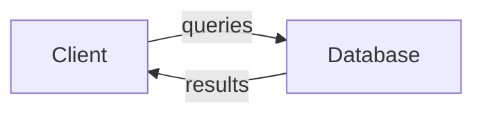
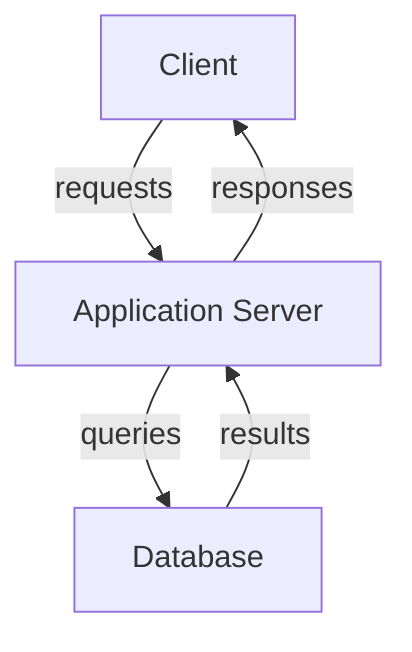
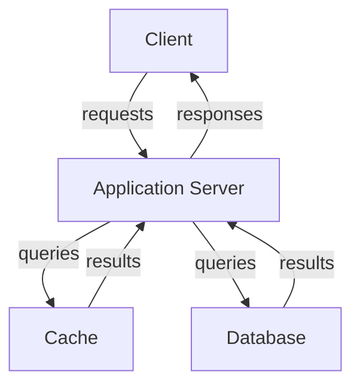
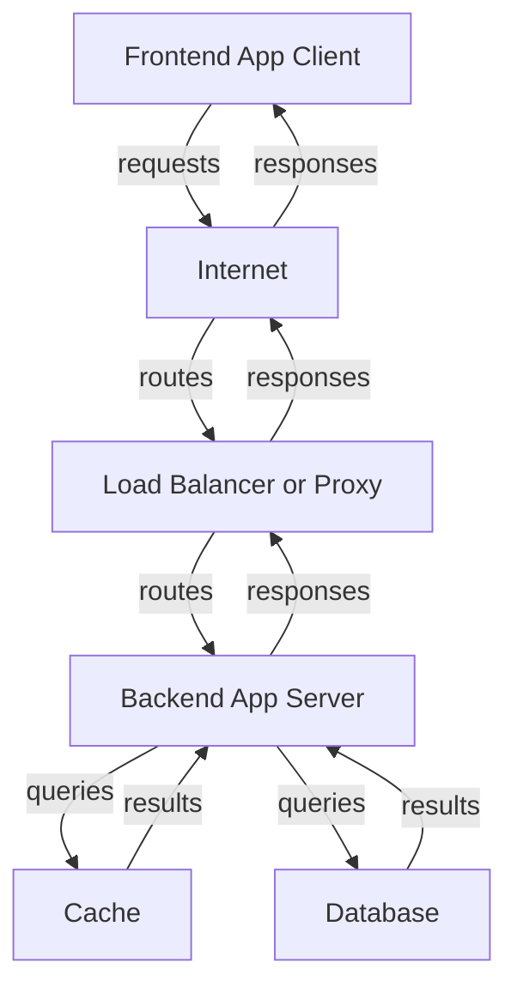
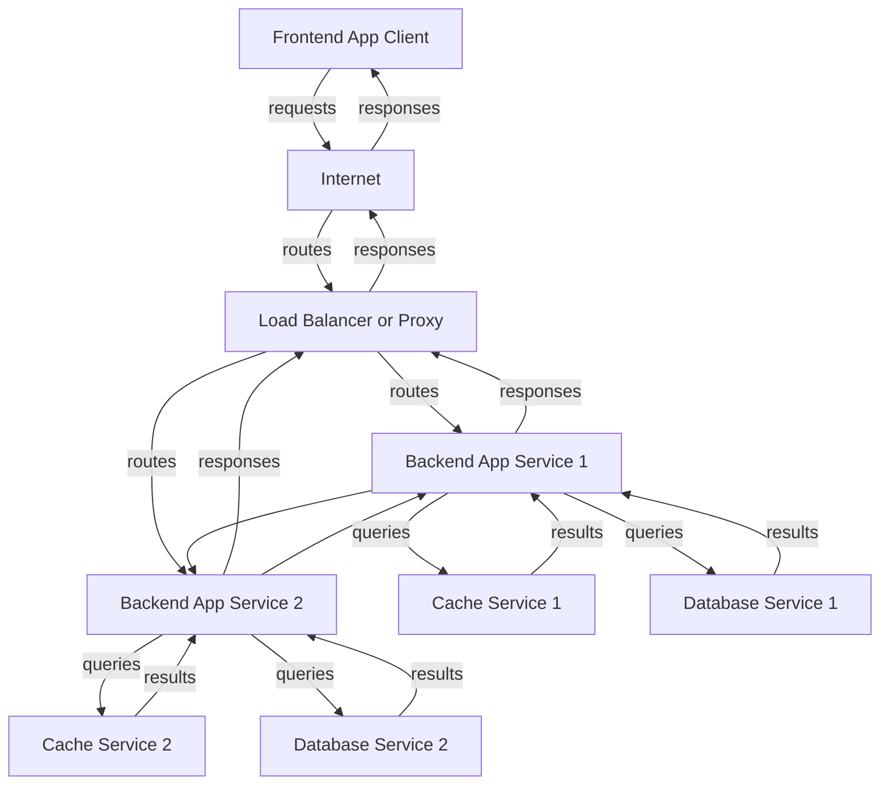

# Introduction to Databases

Databases are piece of software focused in storing, organizing, and retrieving data efficiently. They may vary in structure, functionality, and use cases.

[](https://programmerhumor.io/database-memes/talkingaboutdatabases/)

## Data

It is worth to remember what is data. In our context, data will be reffered to any piece of information that can be stored and manipulated.

## Database Management System (DBMS)

::: note

In commom terms, we just call it Database or DB for short.

:::

DB is a piece of software that manages data by exposing an interface to interact with it. It offers methods to **create**, **read**, **update**, and **delete** data (CRUD operations). It also provides mechanisms for data integrity, security, and concurrency control.

## Query Language

Some databases use a specific language to interact with the data. **SQL** (Structured Query Language) is the most used in relational databases. Other databases may use different query languages or APIs, such as MongoDB's query language for document databases.

<blockquote class="reddit-embed-bq" style="height:500px" data-embed-height="740"><a href="https://www.reddit.com/r/ProgrammerHumor/comments/8a6m04/so_our_databases_professor_has_been_putting_memes/">so our databases professor has been putting memes in his slides teaching with memes: a concept</a><br> by<a href="https://www.reddit.com/user/Pradeep2k17/">u/Pradeep2k17</a> in<a href="https://www.reddit.com/r/ProgrammerHumor/">ProgrammerHumor</a></blockquote><script async="" src="https://embed.reddit.com/widgets.js" charset="UTF-8"></script>

## Query

It is the request made to the database. It can be any CRUD operation or any other more complex operation supported by the database we will cover later in the course.

::: example "sql query example"

```sql
SELECT * FROM users WHERE age > 18;
```

:::

## Transaction

A transaction is a sequence of one or more db operations that are treated as a single unit of work. Transactions ensure data integrity and consistency by following the ACID properties:

- **Atomicity**: Law of "all or nothing"; either all operations in the transaction are completed successfully, or none are applied;
- **Consistency**: State of the database remains valid before and after the transaction;
- **Isolation**: In case of concurrent transactions, the operations of one transaction are isolated from others until it is completed;
- **Durability**: Once a transaction is committed, its changes are permanent, even in the event of a system failure.

::: warning

Some databases in order to gain performance may sacrifice some of the ACID properties. We will cover this topic later in the course.

:::

## Simplified Mental Model

A client may connect diretly to the database with the DB credentials through its exposed API. Usually this type of connection is mostly done by data analysts or data engineers.



Sometimes, a system works only in a LAN, but involves a more robust architecture where an application server acts as an intermediary between the client and the database. This server handles business logic, authentication, and other tasks.



If the query is expensive or happens frequently, some of the results may be valid for awhile and it worth add a caching layer to the architecture to speedup the response, it may look like this:



Or if you may want to have a system that works over the internet, you may have a more complex architecture involving internet communication, load balancers, and multiple application servers.



The architecture of micro services may add another layer of complexity, where multiple services interact with each other and with their own databases.



If you enjoyed this architecture diagrams, probably you may enjoy system design as well. Consider start learning about [Cloud Native Foundation Landscape](https://landscape.cncf.io/).

::: warning

Complexity may solve some issues, but add new ones as well. Consider some factors while you design your systems:

- **Cost** (number of components, cloud services, data transfer)
- **Latency** (number of hops, protocols used, processing time)
- **Maintainability** (number of components, documentation, team expertise, system engineering)
- **Scalability** (horizontal vs vertical scaling, stateless vs stateful components)
- **Reliability** (failover mechanisms, redundancy, backup strategies)
- **Security** (encryption, authentication, authorization, auditing)

:::

<div class="tenor-gif-embed" data-postid="13528303" data-share-method="host" data-aspect-ratio="1.78082" data-width="100%"><a href="https://tenor.com/view/that-escalated-quickly-gif-13528303">That Escalated GIF</a>from <a href="https://tenor.com/search/that-gifs">That GIFs</a></div> <script type="text/javascript" async src="https://tenor.com/embed.js"></script>
