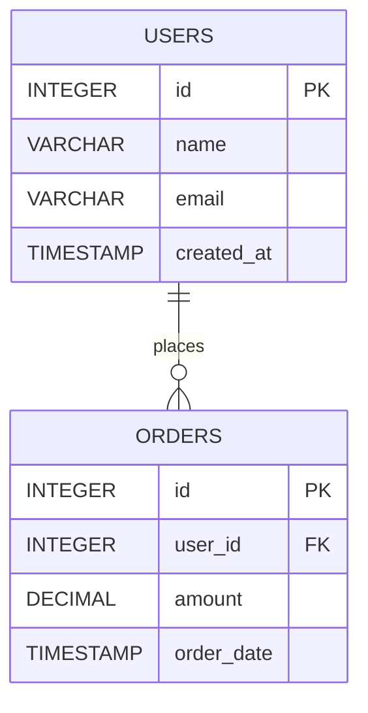
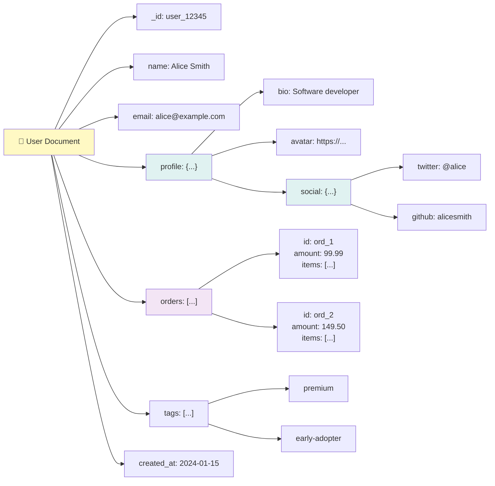
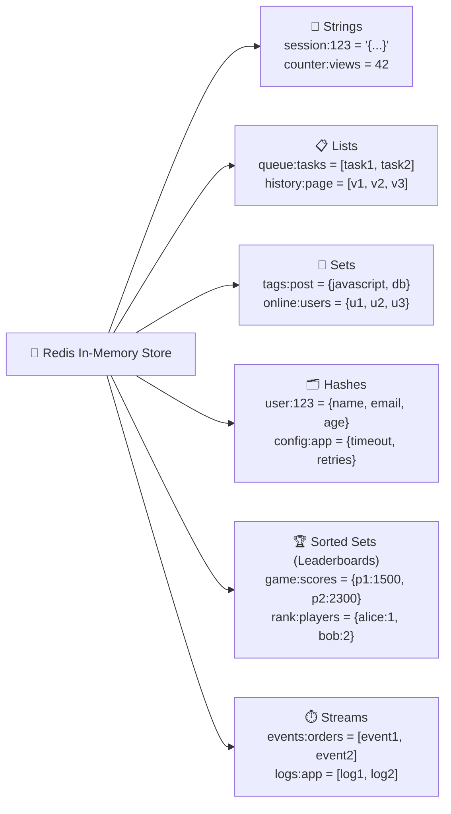
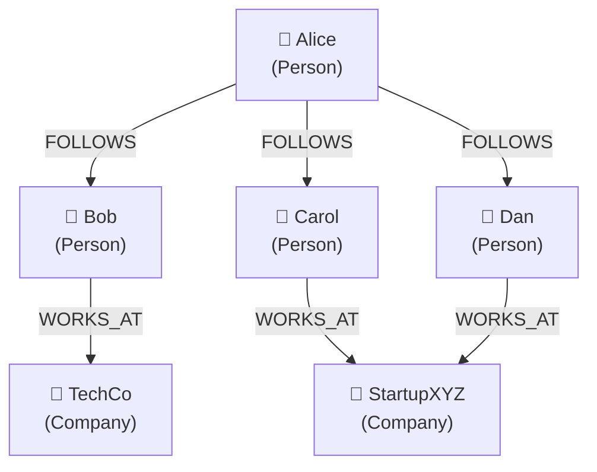
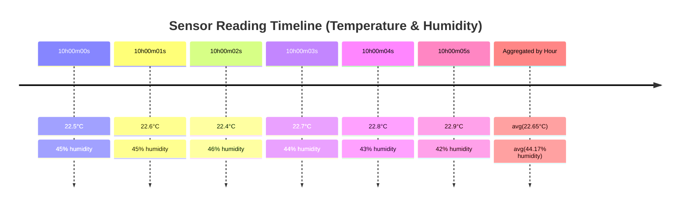

# The Database Zoo

Welcome to the database zoo! Just like a real zoo houses different animals adapted to different environments, the database ecosystem contains many specialized systems, each evolved to handle specific data challenges.


---

## Why So Many Database Types?

In the early days of computing, relational databases ruled supreme. But as data grew in volume, velocity, and variety, specialized databases emerged to handle specific use cases more efficiently. Today, modern applications often use **multiple database types** together—a pattern called **polyglot persistence**.

::: note

No single database is perfect for everything. Each type makes trade-offs between consistency, availability, performance, and flexibility.

:::

---

## 1. Relational Databases (RDBMS)

**The Classic Workhorse**

Relational databases organize data into **tables** (relations) with **rows** (records) and **columns** (attributes). They use **SQL** (Structured Query Language) for querying and support **ACID transactions** for data integrity.

### Key Characteristics

- **Structured schema**: Data must conform to a predefined schema
- **ACID compliance**: Strong consistency guarantees
- **Relationships**: Foreign keys link tables together
- **SQL**: Powerful, declarative query language

### How Data Looks

```
┌─────────────────────────────────────────────────────┐
│                     users                           │
├────────┬───────────────┬─────────────┬──────────────┤
│   id   │     name      │    email    │  created_at  │
├────────┼───────────────┼─────────────┼──────────────┤
│   1    │  Alice Smith  │ alice@...   │  2024-01-15  │
│   2    │  Bob Jones    │ bob@...     │  2024-01-16  │
│   3    │  Carol White  │ carol@...   │  2024-01-17  │
└────────┴───────────────┴─────────────┴──────────────┘

┌─────────────────────────────────────────────────────┐
│                     orders                          │
├────────┬──────────┬─────────────┬───────────────────┤
│   id   │ user_id  │   amount    │    order_date     │
├────────┼──────────┼─────────────┼───────────────────┤
│   1    │    1     │   99.99     │    2024-01-20     │
│   2    │    1     │   149.50    │    2024-01-22     │
│   3    │    2     │   75.00     │    2024-01-23     │
└────────┴──────────┴─────────────┴───────────────────┘
```



### Popular Examples

| Database       | Known For                                                             |
| -------------- | --------------------------------------------------------------------- |
| **PostgreSQL** | Advanced features, extensibility: JSONB, document, vector, graph etc. |
| **MySQL**      | Web applications, ease of use, wide adoption                          |
| **SQLite**     | Embedded, serverless, file-based                                      |
| **SQL Server** | Enterprise, Windows integration                                       |
| **Oracle**     | Enterprise, high availability                                         |

### Best Use Cases

- 💳 Financial transactions and banking systems
- 🛒 E-commerce platforms with complex orders
- 📊 Business applications with reporting needs
- 🏢 Any system requiring strong data integrity

### Example Query

```sql
-- Find all orders with customer names
SELECT u.name, o.amount, o.order_date
FROM users u
JOIN orders o ON u.id = o.user_id
WHERE o.amount > 100
ORDER BY o.order_date DESC;
```

---

## 2. Document Databases

**The Flexible Shape-Shifter**

Document databases store data as **documents** (usually JSON or BSON), allowing for **flexible, nested structures** without a predefined schema. Each document can have a different structure.

### Key Characteristics

- **Schema-less**: Documents can have different fields
- **Nested data**: Natural representation of hierarchical data
- **Document-oriented queries**: Query by any field
- **Horizontal scaling**: Built for distributed systems

### How Data Looks

```json
// User document
{
  "_id": "user_12345",
  "name": "Alice Smith",
  "email": "alice@example.com",
  "profile": {
    "bio": "Software developer",
    "avatar": "https://...",
    "social": {
      "twitter": "@alice",
      "github": "alicesmith"
    }
  },
  "orders": [
    { "id": "ord_1", "amount": 99.99, "items": ["item_a", "item_b"] },
    { "id": "ord_2", "amount": 149.5, "items": ["item_c"] }
  ],
  "tags": ["premium", "early-adopter"],
  "created_at": "2024-01-15T10:30:00Z"
}
```



### Popular Examples

| Database              | Known For                                     |
| --------------------- | --------------------------------------------- |
| **MongoDB**           | Most popular document DB, rich query language |
| **CouchDB**           | Multi-master replication, offline-first       |
| **Amazon DocumentDB** | MongoDB-compatible, AWS managed               |
| **Firestore**         | Real-time sync, mobile/web apps               |

### Best Use Cases

- 📱 Mobile app backends with varying data structures
- 📝 Content management systems (CMS)
- 🛍️ Product catalogs with different attributes
- 👤 User profiles with customizable fields
- 🚀 Rapid prototyping and evolving schemas

### Example Query (MongoDB)

```javascript
// Find premium users with orders over $100
db.users.find(
  {
    tags: 'premium',
    'orders.amount': { $gt: 100 },
  },
  {
    name: 1,
    email: 1,
    'orders.$': 1,
  },
);
```

---

## 3. Key-Value Stores

**The Speed Demon**

Key-value stores are the **simplest and fastest** database type. They store data as pairs of keys and values, like a giant hash map or dictionary.

### Key Characteristics

- **Simple model**: Just keys and values
- **Blazing fast**: O(1) lookups
- **In-memory options**: Sub-millisecond latency
- **TTL support**: Automatic expiration of data

### How Data Looks

```
┌─────────────────────────────────────────────────────┐
│                   Key-Value Store                   │
├─────────────────────────┬───────────────────────────┤
│          Key            │          Value            │
├─────────────────────────┼───────────────────────────┤
│  session:abc123         │  {"user_id": 42, ...}     │
│  user:42:name           │  "Alice Smith"            │
│  cache:product:99       │  {product data...}        │
│  rate_limit:ip:1.2.3.4  │  "47"                     │
│  leaderboard:game1      │  [sorted set of scores]   │
└─────────────────────────┴───────────────────────────┘
```

### Popular Examples

| Database            | Known For                                |
| ------------------- | ---------------------------------------- |
| **Redis**           | In-memory, rich data structures, Pub/Sub |
| **Memcached**       | Simple caching, multi-threaded           |
| **Amazon DynamoDB** | Serverless, auto-scaling, AWS native     |
| **etcd**            | Distributed configuration, Kubernetes    |

### Best Use Cases

- ⚡ Caching frequently accessed data
- 🔐 Session management
- 🚦 Rate limiting
- 🏆 Real-time leaderboards
- 📊 Counters and metrics
- 💬 Pub/Sub messaging

### Examples (Redis)

```bash
# Set a session with 30-minute TTL
SET session:abc123 '{"user_id": 42, "role": "admin"}' EX 1800

# Get the session
GET session:abc123

# Atomic increment of a counter
INCR page_views:home

# Add to a sorted set (leaderboard)
ZADD leaderboard:game1 1500 "player_42"
ZADD leaderboard:game1 2300 "player_17"

# Get top 10 players
ZREVRANGE leaderboard:game1 0 9 WITHSCORES
```

Data Structures in Redis:



---

## 4. Graph Databases

**The Relationship Expert**

Graph databases treat **relationships as first-class citizens**. Data is stored as **nodes** (entities) connected by **edges** (relationships), making it easy to traverse complex connections.

### Key Characteristics

- **Nodes and edges**: Natural representation of connections
- **Relationship traversal**: Efficient path queries
- **Pattern matching**: Find complex relationship patterns
- **No JOINs needed**: Relationships are pre-computed

### How Data Looks



### Popular Examples

| Database           | Known For                           |
| ------------------ | ----------------------------------- |
| **Neo4j**          | Most popular, Cypher query language |
| **Amazon Neptune** | Managed, supports Gremlin & SPARQL  |
| **ArangoDB**       | Multi-model (graph + document)      |
| **TigerGraph**     | Massively parallel, analytics       |

### Best Use Cases

- 👥 Social networks (friends, followers, connections)
- 🎯 Recommendation engines
- 🕵️ Fraud detection
- 🧠 Knowledge graphs
- 🗺️ Network and infrastructure mapping
- 📦 Dependency analysis

### Example Query (Cypher - Neo4j)

```cypher
// Find friends of friends who work at the same company
MATCH (me:Person {name: 'Alice'})-[:FOLLOWS]->(friend)-[:FOLLOWS]->(fof)
WHERE (fof)-[:WORKS_AT]->(:Company)<-[:WORKS_AT]-(me)
  AND fof <> me
RETURN fof.name, count(*) as mutual_friends
ORDER BY mutual_friends DESC
LIMIT 10;
```

---

## 5. Time Series Databases

**The Historian**

Time series databases are optimized for **time-stamped data**—measurements that change over time. They excel at storing, compressing, and querying temporal data.

### Key Characteristics

- **Time-indexed**: Data organized by timestamp
- **High write throughput**: Handle millions of data points
- **Automatic downsampling**: Aggregate old data to save space
- **Retention policies**: Auto-delete old data
- **Time-based queries**: Efficient range queries

### How Data Looks

```
┌────────────────────────────────────────────────────────────┐
│                    sensor_readings                          │
├─────────────────────────┬──────────┬───────────┬───────────┤
│        timestamp        │ sensor_id│   temp    │  humidity │
├─────────────────────────┼──────────┼───────────┼───────────┤
│ 2024-01-15 10:00:00.000 │  sens_01 │   22.5    │    45     │
│ 2024-01-15 10:00:00.000 │  sens_02 │   23.1    │    42     │
│ 2024-01-15 10:00:01.000 │  sens_01 │   22.6    │    45     │
│ 2024-01-15 10:00:01.000 │  sens_02 │   23.0    │    43     │
│ 2024-01-15 10:00:02.000 │  sens_01 │   22.4    │    46     │
│          ...            │   ...    │   ...     │   ...     │
└─────────────────────────┴──────────┴───────────┴───────────┘
```



### Popular Examples

| Database        | Known For                            |
| --------------- | ------------------------------------ |
| **TimescaleDB** | PostgreSQL extension, SQL compatible |
| **InfluxDB**    | Purpose-built, InfluxQL/Flux         |
| **Prometheus**  | Monitoring, pull-based metrics       |
| **QuestDB**     | High performance, SQL                |

### Best Use Cases

- 📈 IoT sensor data
- 🖥️ Application metrics and monitoring
- 💹 Financial market data (tick data)
- 📊 Analytics and dashboards
- 🏭 Industrial equipment monitoring
- 🌡️ Weather and environmental data

### Example Query (TimescaleDB)

```sql
-- Average temperature per hour for the last 24 hours
SELECT
    time_bucket('1 hour', timestamp) AS hour,
    sensor_id,
    AVG(temp) as avg_temp,
    MAX(temp) as max_temp,
    MIN(temp) as min_temp
FROM sensor_readings
WHERE timestamp > NOW() - INTERVAL '24 hours'
GROUP BY hour, sensor_id
ORDER BY hour DESC;

-- Continuous aggregate (materialized view that auto-updates)
CREATE MATERIALIZED VIEW hourly_temps
WITH (timescaledb.continuous) AS
SELECT
    time_bucket('1 hour', timestamp) AS hour,
    sensor_id,
    AVG(temp) as avg_temp
FROM sensor_readings
GROUP BY hour, sensor_id;
```

---

## 6. Search Engines

**The Librarian**

Search engines are databases optimized for **full-text search**. They use **inverted indices** to find documents containing specific words almost instantly, even across billions of documents.

### Key Characteristics

- **Inverted index**: Maps words to documents
- **Full-text search**: Find documents by content
- **Relevance scoring**: Rank results by relevance
- **Analyzers**: Tokenization, stemming, synonyms
- **Fuzzy matching**: Handle typos and variations

### How Data Looks

```
Document Storage:
┌─────────────────────────────────────────────────────────┐
│ doc_1: "The quick brown fox jumps over the lazy dog"    │
│ doc_2: "Quick brown foxes are quick"                    │
│ doc_3: "The dog is lazy but friendly"                   │
└─────────────────────────────────────────────────────────┘

Inverted Index:
┌──────────┬─────────────────┐
│   Term   │   Documents     │
├──────────┼─────────────────┤
│  quick   │  doc_1, doc_2   │
│  brown   │  doc_1, doc_2   │
│  fox     │  doc_1, doc_2   │
│  lazy    │  doc_1, doc_3   │
│  dog     │  doc_1, doc_3   │
│ friendly │  doc_3          │
└──────────┴─────────────────┘
```

### Popular Examples

| Database          | Known For                           |
| ----------------- | ----------------------------------- |
| **Elasticsearch** | Most popular, part of ELK stack     |
| **OpenSearch**    | AWS fork of Elasticsearch           |
| **Solr**          | Apache project, enterprise features |
| **Meilisearch**   | Developer-friendly, typo-tolerant   |
| **Typesense**     | Fast, typo-tolerant, easy to use    |

### Best Use Cases

- 🔍 Site search and product search
- 📝 Log analysis and monitoring
- 📚 Document search (articles, PDFs)
- 🛒 E-commerce with faceted navigation
- 💡 Autocomplete and suggestions
- 📰 Content discovery

### Example Query (Elasticsearch)

```json
// Search for products with fuzzy matching and boosting
{
  "query": {
    "bool": {
      "must": {
        "multi_match": {
          "query": "wireles headphones",
          "fields": ["name^3", "description", "category"],
          "fuzziness": "AUTO"
        }
      },
      "filter": [{ "range": { "price": { "lte": 200 } } }, { "term": { "in_stock": true } }],
      "should": [{ "term": { "featured": { "value": true, "boost": 2 } } }]
    }
  },
  "highlight": {
    "fields": { "description": {} }
  }
}
```

---

## 7. Vector Databases

**The AI Whisperer**

Vector databases store and search **high-dimensional vectors** (embeddings)—numerical representations of data generated by machine learning models. They enable **similarity search** for AI applications.

### Key Characteristics

- **Embedding storage**: Store high-dimensional vectors
- **Similarity search**: Find nearest neighbors
- **Distance metrics**: Cosine, Euclidean, dot product
- **Approximate search**: Trade accuracy for speed (ANN)
- **Hybrid search**: Combine vector + keyword search

### How Data Looks

```
┌─────────────────────────────────────────────────────────────┐
│                    document_embeddings                      │
├────────┬────────────────────────────────────┬───────────────┤
│   id   │           embedding (1536-dim)     │   metadata    │
├────────┼────────────────────────────────────┼───────────────┤
│ doc_1  │ [0.021, -0.034, 0.156, ...]        │ {title: "..."}│
│ doc_2  │ [-0.012, 0.089, -0.023, ...]       │ {title: "..."}│
│ doc_3  │ [0.045, 0.067, 0.134, ...]         │ {title: "..."}│
└────────┴────────────────────────────────────┴───────────────┘

Similarity Search:
Query: "How do I reset my password?"
       ↓ (convert to embedding)
Query Vector: [0.023, -0.031, 0.148, ...]
       ↓ (find nearest neighbors)
Results: doc_1 (0.92 similarity), doc_3 (0.87), doc_2 (0.54)
```

### Popular Examples

| Database     | Known For                          |
| ------------ | ---------------------------------- |
| **pgvector** | PostgreSQL extension, familiar SQL |
| **Pinecone** | Managed, serverless, easy to use   |
| **Weaviate** | Open source, multi-modal           |
| **Milvus**   | Open source, highly scalable       |
| **Qdrant**   | Rust-based, fast, filtering        |
| **Chroma**   | Simple, Python-focused             |

### Best Use Cases

- 🤖 Retrieval-Augmented Generation (RAG)
- 🔍 Semantic search (meaning, not just keywords)
- 🎯 Recommendation systems
- 🖼️ Image similarity search
- 🎵 Audio/music similarity
- 🔎 Duplicate detection
- ❓ Question answering systems

### Example (pgvector)

```sql
-- Enable the extension
CREATE EXTENSION vector;

-- Create table with vector column
CREATE TABLE documents (
    id SERIAL PRIMARY KEY,
    content TEXT,
    embedding vector(1536)  -- OpenAI embedding dimension
);

-- Create index for fast similarity search
CREATE INDEX ON documents
USING ivfflat (embedding vector_cosine_ops)
WITH (lists = 100);

-- Find similar documents
SELECT id, content,
       1 - (embedding <=> '[0.023, -0.031, ...]') as similarity
FROM documents
ORDER BY embedding <=> '[0.023, -0.031, ...]'
LIMIT 5;
```

---

## 8. Wide-Column Stores

**The Distributed Giant**

Wide-column stores organize data into **tables with rows and dynamic columns**. Unlike relational databases, each row can have different columns. They're built for **massive scale** and **high availability**.

### Key Characteristics

- **Column families**: Groups of related columns
- **Sparse columns**: Rows can have different columns
- **Partition keys**: Data distributed across nodes
- **Eventual consistency**: High availability, some lag
- **Linear scalability**: Add nodes to increase capacity

### How Data Looks

```
┌────────────────────────────────────────────────────────────────┐
│                    user_activities                             │
│                    (Column Family)                             │
├─────────────┬──────────────────────────────────────────────────┤
│  Row Key    │              Columns (can vary per row)          │
├─────────────┼──────────────────────────────────────────────────┤
│             │  login:      │  purchase:   │  view:             │
│  user_123   │  2024-01-15  │  2024-01-16  │  2024-01-17        │
│             │  {ip: ...}   │  {item: ...} │  {page: ...}       │
├─────────────┼──────────────┼──────────────┼────────────────────┤
│             │  login:      │  comment:    │                    │
│  user_456   │  2024-01-14  │  2024-01-15  │                    │
│             │  {ip: ...}   │  {text: ...} │                    │
├─────────────┼──────────────┼──────────────┼────────────────────┤
│             │  purchase:   │  purchase:   │  purchase:         │
│  user_789   │  2024-01-10  │  2024-01-12  │  2024-01-15        │
│             │  {item: ...} │  {item: ...} │  {item: ...}       │
└─────────────┴──────────────┴──────────────┴────────────────────┘
```

### Popular Examples

| Database             | Known For                                    |
| -------------------- | -------------------------------------------- |
| **Apache Cassandra** | Highly available, no single point of failure |
| **ScyllaDB**         | Cassandra-compatible, written in C++         |
| **HBase**            | Hadoop ecosystem, strong consistency         |
| **Google Bigtable**  | Managed, powers Google services              |
| **Amazon Keyspaces** | Managed Cassandra-compatible                 |

### Best Use Cases

- 📝 Write-heavy workloads
- ⏰ Time-series data at massive scale
- 🌍 Global distribution with local latency
- 📊 Analytics and big data
- 💬 Messaging and chat history
- 🎮 Gaming leaderboards and player data

### Example Query (CQL - Cassandra)

```sql
-- Create a table for user activities
CREATE TABLE user_activities (
    user_id UUID,
    activity_time TIMESTAMP,
    activity_type TEXT,
    details MAP<TEXT, TEXT>,
    PRIMARY KEY ((user_id), activity_time)
) WITH CLUSTERING ORDER BY (activity_time DESC);

-- Insert activity
INSERT INTO user_activities (user_id, activity_time, activity_type, details)
VALUES (uuid(), toTimestamp(now()), 'purchase', {'item': 'laptop', 'price': '999'});

-- Query recent activities for a user
SELECT * FROM user_activities
WHERE user_id = 550e8400-e29b-41d4-a716-446655440000
LIMIT 100;
```

---

## 9. Event Streaming Platforms

**The Message Broker**

Event streaming platforms are designed for **real-time data pipelines**. They store and process streams of events (messages) that multiple consumers can read independently.

### Key Characteristics

- **Append-only log**: Events are immutable
- **Topics and partitions**: Organized message streams
- **Consumer groups**: Multiple readers, each gets subset
- **Replay capability**: Re-read historical events
- **High throughput**: Millions of events per second

### How Data Looks

```
Topic: order_events
┌─────────────────────────────────────────────────────────────┐
│  Partition 0                                                │
│  ┌─────┬─────┬─────┬─────┬─────┬─────┐                      │
│  │ e0  │ e3  │ e6  │ e9  │ e12 │ ... │                      │
│  └─────┴─────┴─────┴─────┴─────┴─────┘                      │
│                                                             │
│  Partition 1                                                │
│  ┌─────┬─────┬─────┬─────┬─────┬─────┐                      │
│  │ e1  │ e4  │ e7  │ e10 │ e13 │ ... │                      │
│  └─────┴─────┴─────┴─────┴─────┴─────┘                      │
│                                                             │
│  Partition 2                                                │
│  ┌─────┬─────┬─────┬─────┬─────┬─────┐                      │
│  │ e2  │ e5  │ e8  │ e11 │ e14 │ ... │                      │
│  └─────┴─────┴─────┴─────┴─────┴─────┘                      │
└─────────────────────────────────────────────────────────────┘

Event example:
{
  "event_id": "evt_123",
  "event_type": "order_placed",
  "timestamp": "2024-01-15T10:30:00Z",
  "data": {
    "order_id": "ord_456",
    "user_id": "user_789",
    "total": 99.99,
    "items": [...]
  }
}
```

### Popular Examples

| Platform           | Known For                            |
| ------------------ | ------------------------------------ |
| **Apache Kafka**   | Industry standard, highly scalable   |
| **Amazon Kinesis** | AWS managed, serverless option       |
| **Apache Pulsar**  | Multi-tenancy, geo-replication       |
| **Redpanda**       | Kafka-compatible, simpler operations |
| **RabbitMQ**       | Traditional message broker, AMQP     |

### Best Use Cases

- 🔄 Real-time data pipelines
- 📡 Event sourcing architectures
- 🔗 Microservices communication
- 📊 Stream processing and analytics
- 📝 Log aggregation
- 🔄 Change data capture (CDC)

### Example (Kafka with kafkajs)

```typescript
import { Kafka } from 'kafkajs';

const kafka = new Kafka({ brokers: ['localhost:9092'] });

// Producer
const producer = kafka.producer();
await producer.connect();
await producer.send({
  topic: 'order_events',
  messages: [
    {
      key: 'user_789',
      value: JSON.stringify({
        event_type: 'order_placed',
        order_id: 'ord_456',
        total: 99.99,
      }),
    },
  ],
});

// Consumer
const consumer = kafka.consumer({ groupId: 'order-service' });
await consumer.connect();
await consumer.subscribe({ topic: 'order_events' });
await consumer.run({
  eachMessage: async ({ topic, partition, message }) => {
    const event = JSON.parse(message.value.toString());
    console.log(`Processing: ${event.event_type}`);
  },
});
```

---

## Summary: The Zoo at a Glance

| Type                | Primary Use             | Query Style    | Scale Model | Consistency     |
| ------------------- | ----------------------- | -------------- | ----------- | --------------- |
| **Relational**      | Transactions, reporting | SQL            | Vertical    | Strong (ACID)   |
| **Document**        | Flexible content        | JSON queries   | Horizontal  | Tunable         |
| **Key-Value**       | Caching, sessions       | Key lookup     | Horizontal  | Eventual/Strong |
| **Graph**           | Relationships           | Cypher/Gremlin | Vertical    | Strong          |
| **Time Series**     | Metrics, IoT            | SQL-like       | Horizontal  | Strong          |
| **Search Engine**   | Full-text search        | JSON DSL       | Horizontal  | Eventual        |
| **Vector**          | AI/ML, similarity       | SQL + vectors  | Horizontal  | Eventual        |
| **Wide-Column**     | Big data, writes        | CQL            | Horizontal  | Eventual        |
| **Event Streaming** | Real-time events        | Pub/Sub        | Horizontal  | Eventual        |

---

## What's Next?

Now that you understand the different database types, you're ready to learn **when to use which one**. The next section covers the **Database Decision Matrix**—a framework for choosing the right database for your specific requirements.

::: tip

Remember: In modern applications, you'll often use **multiple databases together**. PostgreSQL for your core data, Redis for caching, Elasticsearch for search, and Kafka for events. This is called **polyglot persistence**.

:::
