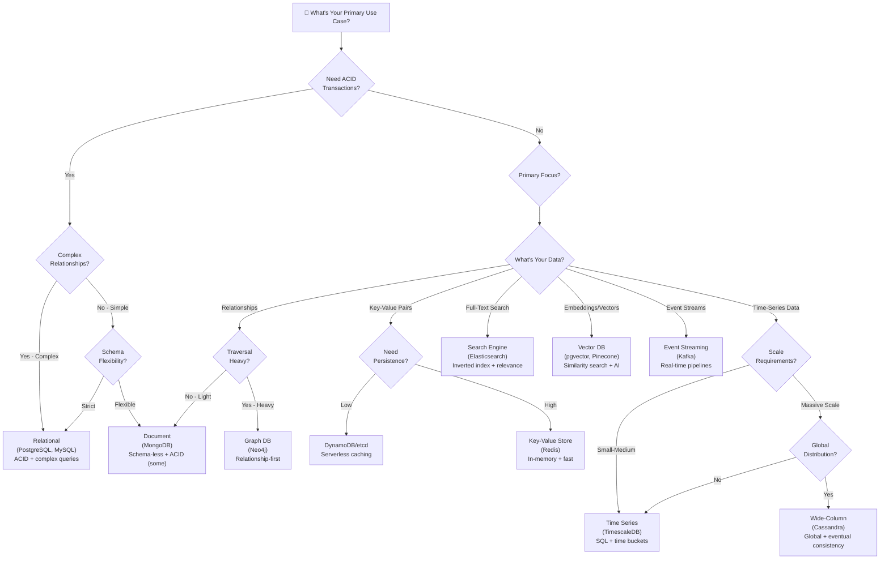

# Database Decision Matrix

Choosing the right database for your project is one of the most important architectural decisions you'll make. This guide provides a framework for evaluating different database types based on your requirements.


---

## Quick Decision Guide

| If You Need...                        | Consider                           |
| ------------------------------------- | ---------------------------------- |
| ACID transactions, complex queries    | **Relational (PostgreSQL, MySQL)** |
| Flexible schema, nested documents     | **Document (MongoDB)**             |
| Ultra-fast caching, sessions          | **Key-Value (Redis)**              |
| Relationships as first-class citizens | **Graph (Neo4j)**                  |
| Time-ordered metrics, IoT data        | **Time Series (TimescaleDB)**      |
| Full-text search, fuzzy matching      | **Search Engine (Elasticsearch)**  |
| AI/ML similarity search               | **Vector (pgvector, Pinecone)**    |
| High-throughput event streaming       | **Event Streaming (Kafka)**        |
| Massive scale, eventual consistency   | **Wide-Column (Cassandra)**        |

---

## Decision Factors

### 1. Data Structure

| Structure                     | Best Fit        |
| ----------------------------- | --------------- |
| Highly structured, relational | Relational DB   |
| Semi-structured, nested       | Document DB     |
| Simple key-value pairs        | Key-Value Store |
| Complex relationships         | Graph DB        |
| Time-ordered sequences        | Time Series DB  |

### 2. Query Patterns

| Query Pattern                  | Best Fit        |
| ------------------------------ | --------------- |
| Complex JOINs, aggregations    | Relational DB   |
| Flexible document queries      | Document DB     |
| Simple lookups by key          | Key-Value Store |
| Path traversals, connections   | Graph DB        |
| Text search, relevance ranking | Search Engine   |
| Similarity/nearest neighbor    | Vector DB       |

### 3. Consistency vs Availability (CAP Theorem)

| Priority                | Best Fit             |
| ----------------------- | -------------------- |
| Strong consistency (CP) | PostgreSQL, MySQL    |
| High availability (AP)  | Cassandra, DynamoDB  |
| Tunable consistency     | MongoDB, CockroachDB |

### 4. Scale Requirements

| Scale Need               | Best Fit                        |
| ------------------------ | ------------------------------- |
| Vertical scaling OK      | PostgreSQL, MySQL               |
| Horizontal read scaling  | Read replicas, Redis            |
| Horizontal write scaling | Cassandra, CockroachDB          |
| Global distribution      | CockroachDB, Spanner, Cosmos DB |

---

## Database Type Deep Dive

### Relational Databases

**Examples:** PostgreSQL, MySQL, SQL Server, SQLite

**Best For:**

- Transactional systems (banking, e-commerce)
- Complex reporting and analytics
- Applications requiring ACID guarantees
- Well-defined, stable schemas

**Avoid When:**

- Schema changes frequently
- Massive horizontal scaling needed
- Simple key-value access patterns

### Document Databases

**Examples:** MongoDB, CouchDB, Amazon DocumentDB

**Best For:**

- Content management systems
- User profiles and preferences
- Product catalogs with varying attributes
- Rapid prototyping with evolving schemas

**Avoid When:**

- Complex transactions across documents
- Heavy relational queries needed
- Strict schema enforcement required

### Key-Value Stores

**Examples:** Redis, Memcached, Amazon DynamoDB

**Best For:**

- Caching layers
- Session management
- Real-time leaderboards
- Rate limiting
- Simple, fast lookups

**Avoid When:**

- Complex queries needed
- Relationships between data
- Full-text search required

### Graph Databases

**Examples:** Neo4j, Amazon Neptune, ArangoDB

**Best For:**

- Social networks
- Recommendation engines
- Fraud detection
- Knowledge graphs
- Network/dependency analysis

**Avoid When:**

- No relationship traversals needed
- Simple CRUD operations
- High-volume writes

### Time Series Databases

**Examples:** TimescaleDB, InfluxDB, Prometheus

**Best For:**

- IoT sensor data
- Application metrics
- Financial tick data
- Log aggregation
- Monitoring systems

**Avoid When:**

- Non-time-ordered data
- Complex relationships
- Frequent updates to historical data

### Search Engines

**Examples:** Elasticsearch, OpenSearch, Solr, Meilisearch

**Best For:**

- Full-text search
- Log analysis
- E-commerce product search
- Autocomplete functionality
- Fuzzy matching

**Avoid When:**

- Primary data storage (use as secondary)
- ACID transactions required
- Simple exact-match lookups

### Vector Databases

**Examples:** pgvector, Pinecone, Weaviate, Milvus, Qdrant

**Best For:**

- AI/ML embeddings
- Semantic search
- Recommendation systems
- Image/audio similarity
- RAG (Retrieval-Augmented Generation)

**Avoid When:**

- Exact match queries
- Traditional structured data
- No ML/AI components

### Wide-Column Stores

**Examples:** Cassandra, HBase, ScyllaDB

**Best For:**

- Write-heavy workloads
- Time-series at massive scale
- Global distribution
- High availability requirements

**Avoid When:**

- Complex queries/JOINs
- Strong consistency required
- Small-scale applications

### Event Streaming

**Examples:** Apache Kafka, Amazon Kinesis, Pulsar

**Best For:**

- Real-time data pipelines
- Event sourcing
- Log aggregation
- Microservices communication
- Change data capture

**Avoid When:**

- Simple request-response patterns
- Small-scale messaging
- Immediate query access needed

---

## Polyglot Persistence

Modern applications often use **multiple databases** together:

```
┌──────────────────────────────────────────────────────────┐
│                    Application Layer                     │
├──────────────────────────────────────────────────────────┤
│                                                          │
│  ┌──────────────┐  ┌──────────────┐  ┌───────────────┐   │
│  │  PostgreSQL  │  │    Redis     │  │ Elasticsearch │   │
│  │  (Primary)   │  │  (Caching)   │  │   (Search)    │   │
│  └──────────────┘  └──────────────┘  └───────────────┘   │
│                                                          │
│  ┌──────────────┐  ┌──────────────┐  ┌───────────────┐   │
│  │    Neo4j     │  │ TimescaleDB  │  │    Kafka      │   │
│  │   (Graphs)   │  │  (Metrics)   │  │  (Events)     │   │
│  └──────────────┘  └──────────────┘  └───────────────┘   │
│                                                          │
└──────────────────────────────────────────────────────────┘
```

### Example: E-Commerce Platform

| Data Type         | Database            | Why                                   |
| ----------------- | ------------------- | ------------------------------------- |
| Orders, Customers | PostgreSQL          | ACID transactions, complex queries    |
| Session Data      | Redis               | Fast access, TTL support              |
| Product Search    | Elasticsearch       | Full-text search, faceting            |
| Recommendations   | Neo4j or Vector DB  | Relationship traversal or embeddings  |
| Analytics Events  | Kafka → TimescaleDB | Event streaming + time-series storage |

---

## Decision Flowchart



---

## Common Anti-Patterns

- **MongoDB for everything** — great for flexible documents, not for multi-step transactions or heavy joins.
- **Redis as the primary store** — blazing fast cache, weak for durability and complex queries.
- **NoSQL by default** — start with Postgres unless you have a clear scaling/consistency need.
- **Adding databases casually** — every DB adds ops cost. Fewer is simpler; managed services help.

---

## Key Takeaways

1. **Start simple** — PostgreSQL handles most use cases well
2. **Add specialized databases** when you have specific needs
3. **Consider operational complexity** — more databases = more maintenance
4. **Understand CAP trade-offs** — you can't have everything
5. **Think polyglot** — different data, different databases
6. **Measure first** — don't optimize prematurely
