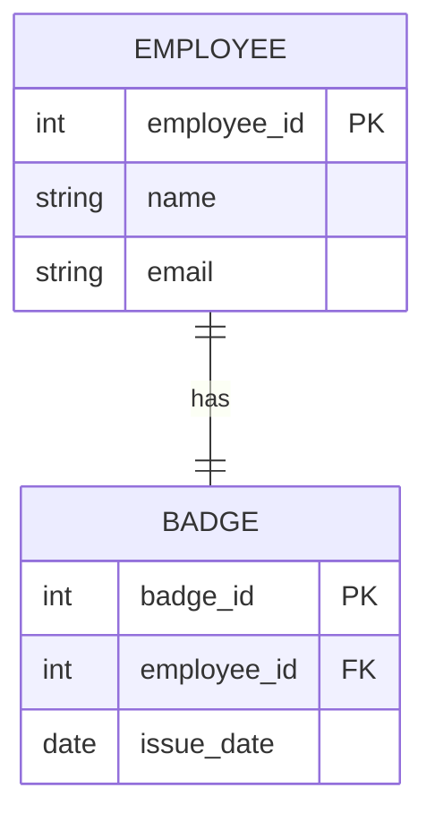
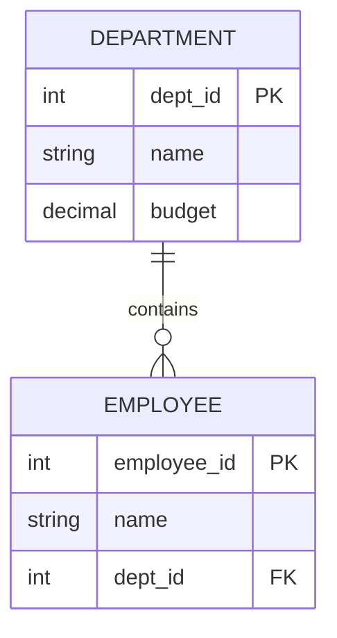
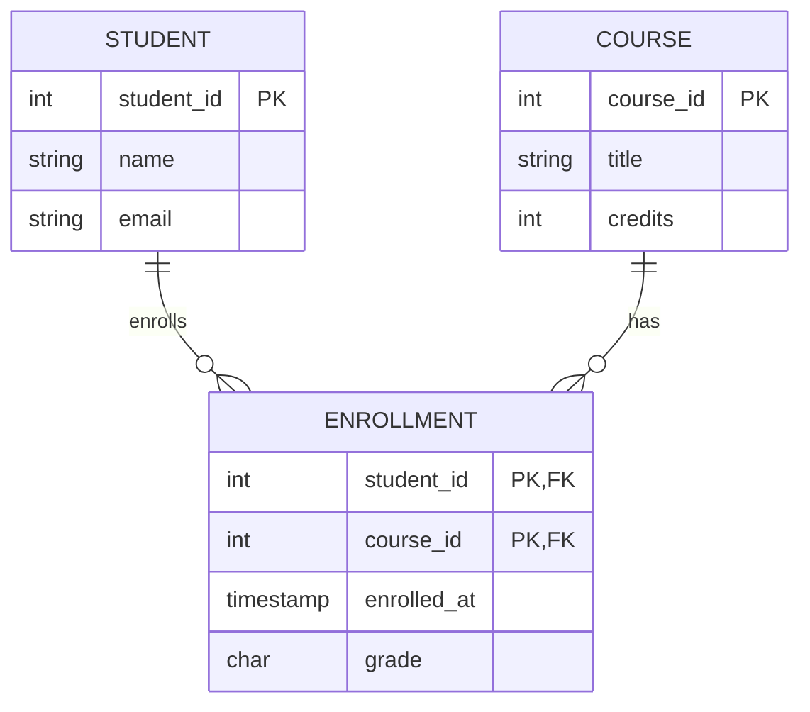
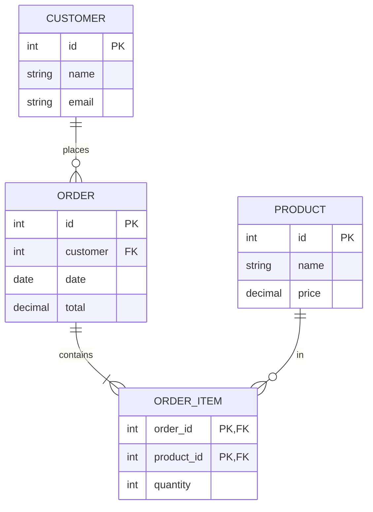
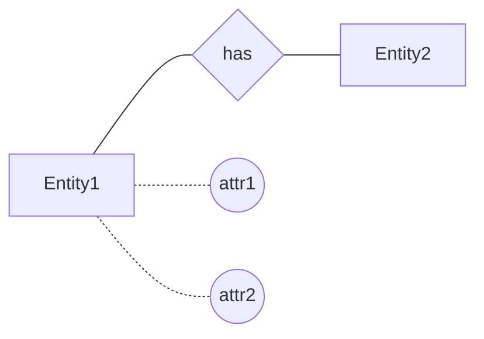
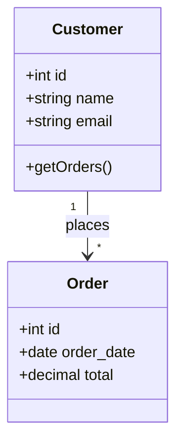
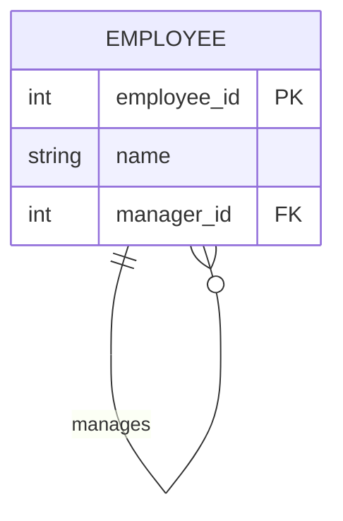
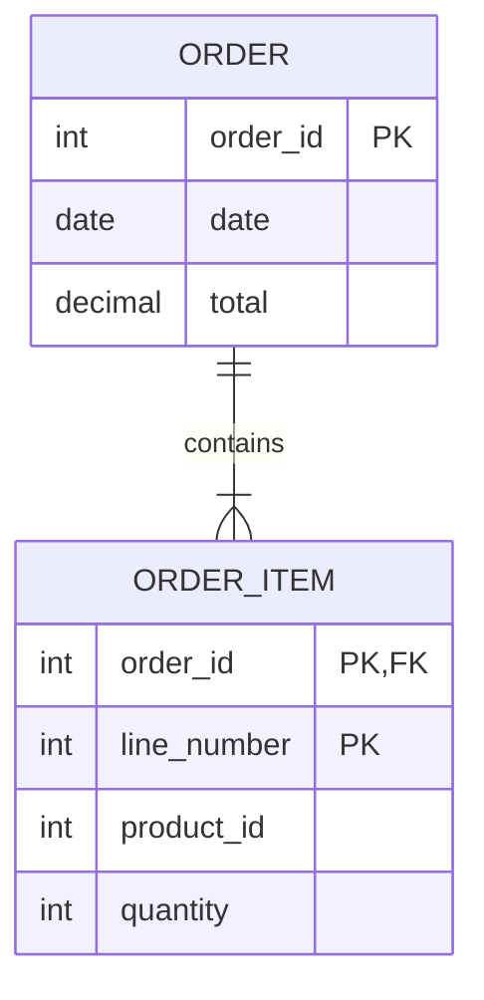
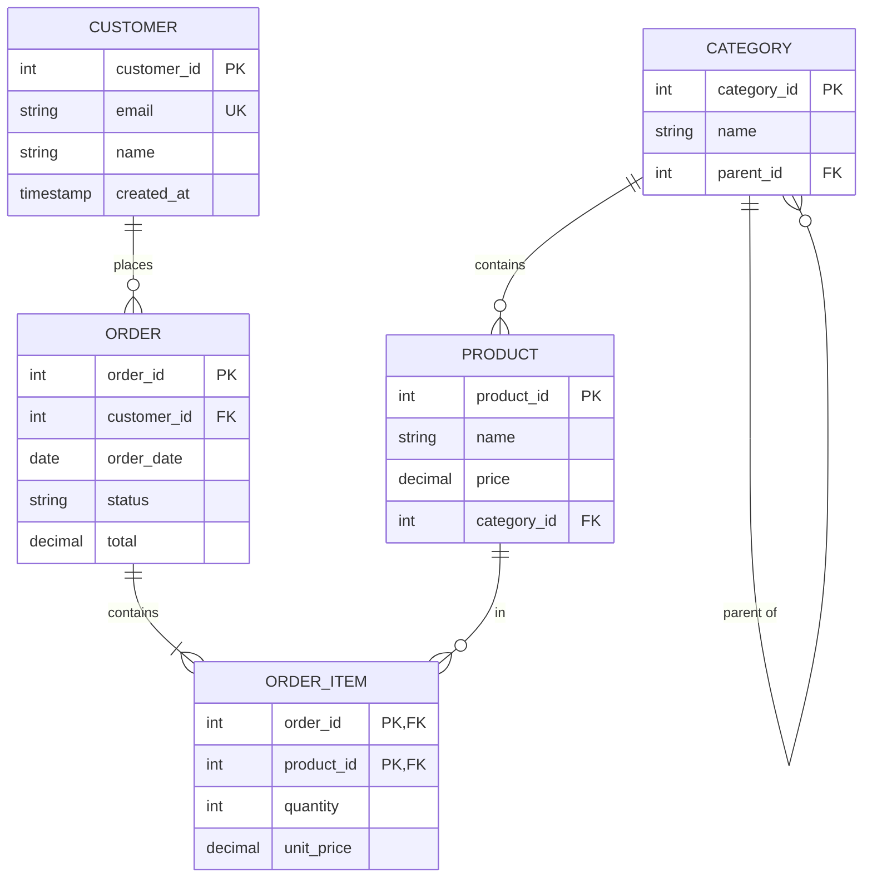

# Entity-Relationship Modeling

Entity-Relationship (ER) modeling is a technique for designing database schemas by identifying entities, their attributes, and the relationships between them. ER diagrams provide a visual blueprint before writing DDL.

---

## Core Concepts

### Entities

An **entity** is a real-world object or concept that can be distinctly identified. In a database, an entity typically becomes a **table**.

**Examples:**

- Customer
- Product
- Order
- Employee
- Course
- Student

### Attributes

**Attributes** are properties that describe an entity. They become **columns** in a table.

**Customer Entity Attributes:**

- customer_id (identifier)
- name
- email
- phone
- created_at

### Relationships

A **relationship** describes how entities are associated with each other. The three main types are:

- One-to-One (1:1)
- One-to-Many (1:N)
- Many-to-Many (M:N)

---

## Cardinality: Relationship Types

### One-to-One (1:1)

Each record in Table A relates to **exactly one** record in Table B, and vice versa.

**Example:** Each employee has one employee badge, and each badge belongs to one employee.



**Implementation Options:**

Option 1: Foreign key in either table

```sql
CREATE TABLE employees (
    employee_id SERIAL PRIMARY KEY,
    name VARCHAR(100) NOT NULL,
    email VARCHAR(255) NOT NULL UNIQUE
);

CREATE TABLE badges (
    badge_id SERIAL PRIMARY KEY,
    employee_id INT UNIQUE REFERENCES employees(employee_id),
    issue_date DATE NOT NULL DEFAULT CURRENT_DATE
);
```

Option 2: Same primary key (shared key)

```sql
CREATE TABLE badges (
    employee_id INT PRIMARY KEY REFERENCES employees(employee_id),
    issue_date DATE NOT NULL DEFAULT CURRENT_DATE
);
```

> **Tip:** The `UNIQUE` constraint on the foreign key enforces the 1:1 relationship.

### One-to-Many (1:N)

Each record in Table A can relate to **many** records in Table B, but each record in B relates to **only one** record in A.

**Example:** One department has many employees, but each employee belongs to one department.



**Implementation:** Put the foreign key in the "many" side.

```sql
CREATE TABLE departments (
    dept_id SERIAL PRIMARY KEY,
    name VARCHAR(100) NOT NULL UNIQUE,
    budget DECIMAL(12, 2) DEFAULT 0
);

CREATE TABLE employees (
    employee_id SERIAL PRIMARY KEY,
    name VARCHAR(100) NOT NULL,
    dept_id INT REFERENCES departments(dept_id)
);
```

**More Examples of 1:N:**

- One customer → many orders
- One author → many books
- One category → many products
- One course → many enrollments

### Many-to-Many (M:N)

Each record in Table A can relate to **many** records in Table B, and vice versa.

**Example:** Students enroll in many courses, and courses have many students.



**Implementation:** Create a **junction table** (also called linking table, bridge table, or associative table).

```sql
CREATE TABLE students (
    student_id SERIAL PRIMARY KEY,
    name VARCHAR(100) NOT NULL,
    email VARCHAR(255) NOT NULL UNIQUE
);

CREATE TABLE courses (
    course_id SERIAL PRIMARY KEY,
    title VARCHAR(200) NOT NULL,
    credits INT NOT NULL CHECK (credits > 0)
);

-- Junction table
CREATE TABLE enrollments (
    student_id INT REFERENCES students(student_id),
    course_id INT REFERENCES courses(course_id),
    enrolled_at TIMESTAMP DEFAULT CURRENT_TIMESTAMP,
    grade CHAR(2),
    PRIMARY KEY (student_id, course_id)
);
```

**More Examples of M:N:**

- Products ↔ Orders (→ order_items)
- Users ↔ Roles (→ user_roles)
- Movies ↔ Actors (→ movie_cast)
- Tags ↔ Articles (→ article_tags)

---

## Junction Tables (Bridge Tables)

Junction tables are essential for M:N relationships. They typically:

1. Have a **composite primary key** from both related tables
2. May have **additional attributes** specific to the relationship
3. Have **foreign keys** to both parent tables

### Junction Table with Extra Attributes

```sql
-- Order items: the M:N between orders and products
CREATE TABLE order_items (
    order_id INT REFERENCES orders(order_id) ON DELETE CASCADE,
    product_id INT REFERENCES products(product_id),
    quantity INT NOT NULL CHECK (quantity > 0),
    unit_price DECIMAL(10, 2) NOT NULL,  -- Price at time of order
    discount_percent DECIMAL(5, 2) DEFAULT 0,
    PRIMARY KEY (order_id, product_id)
);
```

### Junction Table Naming Conventions

| Pattern                    | Example            |
| -------------------------- | ------------------ |
| Plural of both entities    | `students_courses` |
| Describes the relationship | `enrollments`      |
| Entity + Entity            | `student_course`   |
| Verb-based                 | `registrations`    |

**Recommendation:** Use a descriptive name that reflects the relationship meaning.

---

## ER Diagram Notations

### Crow's Foot Notation (Most Common)

The most widely used notation in database design:

```
One (mandatory):     ──┼──
One (optional):      ──○──
Many (mandatory):    ──┼<──
Many (optional):     ──○<──
```

**Example: Customer orders products**



Customer: 1 (mandatory) to Many (optional) Orders
Order: Many to Many Products (via order_items)

### Chen Notation

Uses shapes to represent entities and relationships:



- **Rectangle:** Entity
- **Diamond:** Relationship
- **Oval/Circle:** Attribute
- **Double rectangle:** Weak entity

### UML Class Diagram Notation

Shows entities as classes with attributes:



- `1` = exactly one
- `*` = zero or more (many)
- `1..*` = one or more
- `0..1` = zero or one

### Cardinality Notation Comparison

| Relationship     | Crow's Foot | UML           | Chen  |
| ---------------- | ----------- | ------------- | ----- |
| One (mandatory)  | `──┼──`     | `1`           | `1`   |
| One (optional)   | `──○──`     | `0..1`        | `0,1` |
| Many (mandatory) | `──┼<──`    | `1..*`        | `1,N` |
| Many (optional)  | `──○<──`    | `*` or `0..*` | `0,N` |

---

## Participation Constraints

### Total Participation (Mandatory)

Every entity **must** participate in the relationship.

**Example:** Every order must have a customer.

```sql
CREATE TABLE orders (
    order_id SERIAL PRIMARY KEY,
    customer_id INT NOT NULL REFERENCES customers(customer_id),  -- NOT NULL = mandatory
    order_date DATE NOT NULL
);
```

### Partial Participation (Optional)

An entity **may or may not** participate in the relationship.

**Example:** An employee may or may not have a manager (CEO has no manager).

```sql
CREATE TABLE employees (
    employee_id SERIAL PRIMARY KEY,
    name VARCHAR(100) NOT NULL,
    manager_id INT REFERENCES employees(employee_id)  -- NULL allowed = optional
);
```

---

## Self-Referencing Relationships

An entity that relates to itself.

### 1:N Self-Reference: Employees and Managers



```sql
CREATE TABLE employees (
    employee_id SERIAL PRIMARY KEY,
    name VARCHAR(100) NOT NULL,
    manager_id INT REFERENCES employees(employee_id)
);

-- Find all direct reports for manager #5
SELECT * FROM employees WHERE manager_id = 5;

-- Find an employee's manager
SELECT e.name AS employee, m.name AS manager
FROM employees e
LEFT JOIN employees m ON e.manager_id = m.employee_id;
```

### M:N Self-Reference: Social Network Friends

```sql
CREATE TABLE users (
    user_id SERIAL PRIMARY KEY,
    username VARCHAR(50) NOT NULL UNIQUE
);

-- Junction table for friendships (symmetric)
CREATE TABLE friendships (
    user_id_1 INT REFERENCES users(user_id),
    user_id_2 INT REFERENCES users(user_id),
    created_at TIMESTAMP DEFAULT CURRENT_TIMESTAMP,
    PRIMARY KEY (user_id_1, user_id_2),
    CHECK (user_id_1 < user_id_2)  -- Prevent duplicates like (1,2) and (2,1)
);
```

### Hierarchical Self-Reference: Categories

```sql
CREATE TABLE categories (
    category_id SERIAL PRIMARY KEY,
    name VARCHAR(100) NOT NULL,
    parent_id INT REFERENCES categories(category_id)
);

-- Insert hierarchical data
INSERT INTO categories (category_id, name, parent_id) VALUES
(1, 'Electronics', NULL),
(2, 'Computers', 1),
(3, 'Laptops', 2),
(4, 'Gaming Laptops', 3),
(5, 'Phones', 1);

-- Get all top-level categories
SELECT * FROM categories WHERE parent_id IS NULL;

-- Get children of 'Computers' (id=2)
SELECT * FROM categories WHERE parent_id = 2;
```

---

## Weak Entities

A **weak entity** cannot exist without its parent entity. It has no meaningful primary key of its own.

**Example:** Order line items cannot exist without an order.



> Note: `ORDER_ITEM` is a **weak entity** - it cannot exist without its parent `ORDER`.

```sql
CREATE TABLE order_items (
    order_id INT REFERENCES orders(order_id) ON DELETE CASCADE,
    line_number INT NOT NULL,
    product_id INT REFERENCES products(product_id),
    quantity INT NOT NULL,
    PRIMARY KEY (order_id, line_number)
);
```

The `ON DELETE CASCADE` ensures that when an order is deleted, its items are automatically deleted.

---

## Complete ER Diagram Example: E-Commerce



### SQL Implementation

```sql
-- Categories with self-reference for hierarchy
CREATE TABLE categories (
    category_id SERIAL PRIMARY KEY,
    name VARCHAR(100) NOT NULL,
    parent_id INT REFERENCES categories(category_id)
);

-- Products belong to categories
CREATE TABLE products (
    product_id SERIAL PRIMARY KEY,
    name VARCHAR(200) NOT NULL,
    price DECIMAL(10, 2) NOT NULL CHECK (price >= 0),
    category_id INT REFERENCES categories(category_id)
);

-- Customers
CREATE TABLE customers (
    customer_id SERIAL PRIMARY KEY,
    email VARCHAR(255) NOT NULL UNIQUE,
    name VARCHAR(100) NOT NULL,
    created_at TIMESTAMP DEFAULT CURRENT_TIMESTAMP
);

-- Orders
CREATE TABLE orders (
    order_id SERIAL PRIMARY KEY,
    customer_id INT NOT NULL REFERENCES customers(customer_id),
    order_date DATE NOT NULL DEFAULT CURRENT_DATE,
    status VARCHAR(20) NOT NULL DEFAULT 'pending',
    total DECIMAL(12, 2) NOT NULL DEFAULT 0,
    CONSTRAINT valid_status CHECK (status IN ('pending', 'confirmed', 'shipped', 'delivered', 'cancelled'))
);

-- Order items (junction table with attributes)
CREATE TABLE order_items (
    order_id INT REFERENCES orders(order_id) ON DELETE CASCADE,
    product_id INT REFERENCES products(product_id),
    quantity INT NOT NULL CHECK (quantity > 0),
    unit_price DECIMAL(10, 2) NOT NULL,
    PRIMARY KEY (order_id, product_id)
);

-- Indexes for common queries
CREATE INDEX idx_orders_customer ON orders(customer_id);
CREATE INDEX idx_order_items_product ON order_items(product_id);
CREATE INDEX idx_products_category ON products(category_id);
```

---

## ER Design Process

### Step 1: Identify Entities

List all the "things" you need to store data about:

- Customers, Products, Orders, Categories, Reviews, etc.

### Step 2: Identify Attributes

For each entity, list its properties:

- Customer: id, name, email, phone, address
- Product: id, name, description, price, stock_quantity

### Step 3: Identify Relationships

Determine how entities relate:

- Customer places Order (1:N)
- Order contains Products (M:N → junction table)
- Product belongs to Category (N:1)

### Step 4: Determine Cardinality

For each relationship, ask:

- Can an A exist without a B? (optional vs mandatory)
- Can an A have multiple Bs? (one vs many)

### Step 5: Draw the ER Diagram

Use your preferred notation (Crow's Foot, UML, Chen).

### Step 6: Convert to Tables

- Entities → Tables
- Attributes → Columns
- 1:N relationships → Foreign key in "many" side
- M:N relationships → Junction table

### Step 7: Apply Normalization

Ensure your schema is in at least 3NF (see normalization-theory.md).

---

## Practice

### Exercise 1: Identify Relationships

For each scenario, identify the relationship type (1:1, 1:N, M:N):

1. Authors write books (assume a book can have multiple authors)
2. A country has one capital city
3. Doctors treat patients
4. Each employee has one company laptop
5. Students submit assignments for courses

### Exercise 2: Design a Schema

Create an ER diagram and SQL DDL for a simple blog system with:

- Users who write posts
- Posts that belong to categories
- Users who can comment on posts
- Posts that can have tags

### Exercise 3: Junction Table Design

Design the junction table(s) for:

- A movie database where actors appear in movies with specific roles
- A recipe app where recipes use ingredients with quantities and units

---

## Key Takeaways

1. **1:1 relationships** use a unique foreign key in either table
2. **1:N relationships** put the FK in the "many" side
3. **M:N relationships** require a junction table with composite PK
4. **Junction tables** can have additional attributes beyond the FKs
5. **Self-referencing** relationships handle hierarchies and networks
6. **Weak entities** depend on parent entities and use composite keys
7. **Cardinality** (1 vs many) and **participation** (optional vs mandatory) define constraints
8. **Design before coding** - ER diagrams prevent costly restructuring later
