# Database Normalization & Design

## Week 04

---

## Today's Topics

- Normal Forms (1NF, 2NF, 3NF, BCNF)
- Functional Dependencies
- Entity-Relationship Modeling
- Cardinality & Junction Tables
- Constraints (PK, FK, NOT NULL, UNIQUE, CHECK)
- Indexing Fundamentals
- Denormalization Trade-offs

---

## Why Normalize?

Consider this denormalized table:

| order_id | customer_name | customer_email      | product_name | product_price | quantity |
| -------- | ------------- | ------------------- | ------------ | ------------- | -------- |
| 1        | Alice         | alice@email.com     | Laptop       | 999.99        | 1        |
| 2        | Alice         | alice@email.com     | Mouse        | 29.99         | 2        |
| 3        | Bob           | bob@email.com       | Laptop       | 999.99        | 1        |
| 4        | Alice         | alice_new@email.com | Keyboard     | 79.99         | 1        |

**What's wrong here?**

---

## Data Anomalies

### Update Anomaly

Alice changed email → must update **every row** where she appears

Row 4 has `alice_new@email.com` but rows 1-2 still have old email!

### Insert Anomaly

Can't add a new product without creating an order

### Delete Anomaly

If we delete Bob's only order → we lose Bob as a customer entirely!

---

## Functional Dependencies

### Definition

A **functional dependency** (FD) exists when one attribute uniquely determines another:

$$A \rightarrow B$$

"If you know the value of A, you can determine the value of B"

---

## Functional Dependency Examples

```
student_id → student_name
```

Knowing the ID tells you the name

```
isbn → book_title
```

An ISBN uniquely identifies a book

```
(order_id, product_id) → quantity
```

The combination determines quantity

---

## Types of Dependencies

### Full Functional Dependency

The **entire** key is needed:

```
(order_id, product_id) → quantity
```

### Partial Dependency

Only **part** of a composite key is needed:

```
(order_id, product_id) → order_date
```

Only `order_id` determines `order_date`

### Transitive Dependency

Depends through another non-key attribute:

```
employee_id → department_id → department_name
```

---

## First Normal Form (1NF)

A table is in **1NF** if:

1. Each column contains only **atomic** (indivisible) values
2. Each column contains values of a **single type**
3. Each row is **unique** (has a primary key)
4. There are **no repeating groups** or arrays

---

## 1NF Violation: Multi-valued Column

❌ **Not in 1NF:**

| student_id | name  | phone_numbers      |
| ---------- | ----- | ------------------ |
| 1          | Alice | 555-1234, 555-5678 |
| 2          | Bob   | 555-9999           |

The `phone_numbers` column contains multiple values!

---

## 1NF Violation: Repeating Groups

❌ **Not in 1NF:**

| order_id | product1 | qty1 | product2 | qty2 | product3 | qty3 |
| -------- | -------- | ---- | -------- | ---- | -------- | ---- |
| 1        | Laptop   | 1    | Mouse    | 2    | NULL     | NULL |

Repeating column patterns violate 1NF

---

## 1NF Fixed

✅ **Student phones (separate table):**

| student_id | phone_number |
| ---------- | ------------ |
| 1          | 555-1234     |
| 1          | 555-5678     |
| 2          | 555-9999     |

✅ **Order items (separate table):**

| order_id | product_name | quantity |
| -------- | ------------ | -------- |
| 1        | Laptop       | 1        |
| 1        | Mouse        | 2        |

---

## 1NF SQL Example

```sql
-- Violates 1NF (arrays)
CREATE TABLE students_bad (
    student_id SERIAL PRIMARY KEY,
    name VARCHAR(100),
    phone_numbers TEXT[]  -- Array = multi-valued ❌
);

-- 1NF Compliant ✅
CREATE TABLE students (
    student_id SERIAL PRIMARY KEY,
    name VARCHAR(100) NOT NULL
);

CREATE TABLE student_phones (
    student_id INT REFERENCES students(student_id),
    phone_number VARCHAR(20),
    PRIMARY KEY (student_id, phone_number)
);
```

---

## The Problem: Partial Dependencies

Consider an **order_items** table that tracks which products are in each order:

| order_id | product_id | order_date | product_name | product_price | quantity |
| -------- | ---------- | ---------- | ------------ | ------------- | -------- |
| 1        | 101        | 2024-01-15 | Laptop       | 999.99        | 1        |
| 1        | 102        | 2024-01-15 | Mouse        | 29.99         | 2        |
| 2        | 101        | 2024-01-16 | Laptop       | 999.99        | 3        |

**Composite Primary Key:** `(order_id, product_id)`

This table is in **1NF** ✅ but has **partial dependencies** ❌

---

## Analyzing the Dependencies

| Attribute       | Depends On               | Type       |
| --------------- | ------------------------ | ---------- |
| `quantity`      | `(order_id, product_id)` | ✅ Full    |
| `order_date`    | `order_id` only          | ❌ Partial |
| `product_name`  | `product_id` only        | ❌ Partial |
| `product_price` | `product_id` only        | ❌ Partial |

**Update Anomaly:** If "Laptop" price changes to $899.99, we must update **every row** containing that product!

**Redundancy:** "Laptop" and "999.99" are stored twice unnecessarily.

---

## Second Normal Form (2NF)

A table is in **2NF** if:

1. It is in 1NF
2. Every non-key attribute is **fully functionally dependent** on the **entire** primary key

> 2NF eliminates **partial dependencies**

---

## What is a Composite Primary Key?

A **composite primary key** uses **two or more columns** together to uniquely identify a row.

```sql
PRIMARY KEY (order_id, product_id)
```

- `order_id = 1` alone doesn't identify a unique row (order 1 has multiple products)
- `product_id = 101` alone doesn't identify a unique row (product 101 appears in multiple orders)
- `(order_id = 1, product_id = 101)` uniquely identifies exactly one row

> **2NF only applies to tables with composite keys!**
> Single-column primary keys are automatically in 2NF if they're in 1NF.

---

## Converting to 2NF

**Strategy:** Move partially dependent attributes to their own tables.

- `order_date` depends only on `order_id` → create **orders** table
- `product_name`, `product_price` depend only on `product_id` → create **products** table
- `quantity` depends on full key → stays in **order_items**

---

## 2NF Solution

**orders table:**

| order_id | order_date |
| -------- | ---------- |
| 1        | 2024-01-15 |
| 2        | 2024-01-16 |

**products table:**

| product_id | product_name | product_price |
| ---------- | ------------ | ------------- |
| 101        | Laptop       | 999.99        |
| 102        | Mouse        | 29.99         |

**order_items table:**

| order_id | product_id | quantity |
| -------- | ---------- | -------- |
| 1        | 101        | 1        |
| 1        | 102        | 2        |
| 2        | 101        | 3        |

Now each fact is stored **once**: no redundancy, no update anomalies!

---

## Third Normal Form (3NF)

A table is in **3NF** if:

1. It is in 2NF
2. There are **no transitive dependencies**

---

## What is a Transitive Dependency?

A **transitive dependency** occurs when a non-key attribute depends on another non-key attribute, which in turn depends on the primary key:

$$\text{PK} \rightarrow A \rightarrow B$$

**Example chain:**


The `department_name` doesn't depend directly on `employee_id`. Instead, it depends on `department_id`, which happens to be in the same row.

**Problem:** If a department changes its name, you must update every employee row in that department!

---

## 3NF Violation Example

**Primary Key:** `employee_id`

| employee_id | employee_name | department_id | department_name | department_budget |
| ----------- | ------------- | ------------- | --------------- | ----------------- |
| 1           | Alice         | 10            | Engineering     | 500000            |
| 2           | Bob           | 10            | Engineering     | 500000            |
| 3           | Carol         | 20            | Marketing       | 300000            |

**Dependency Analysis:**

| Dependency                        | Type                              |
| --------------------------------- | --------------------------------- |
| `employee_id → employee_name`     | ✅ Direct (OK)                    |
| `employee_id → department_id`     | ✅ Direct (OK)                    |
| `employee_id → department_name`   | ❌ Transitive (via department_id) |
| `employee_id → department_budget` | ❌ Transitive (via department_id) |

**Redundancy:** "Engineering" and "500000" are stored twice!

---

## 3NF Fixed

**departments table:**

| department_id | department_name | department_budget |
| ------------- | --------------- | ----------------- |
| 10            | Engineering     | 500000            |
| 20            | Marketing       | 300000            |

**employees table:**

| employee_id | employee_name | department_id |
| ----------- | ------------- | ------------- |
| 1           | Alice         | 10            |
| 2           | Bob           | 10            |
| 3           | Carol         | 20            |

---

## Boyce-Codd Normal Form (BCNF)

A table is in **BCNF** if:

1. It is in 3NF
2. For **every** functional dependency `X → Y`, X must be a **superkey**

---

### What's a Functional Dependency?

A functional dependency `X → Y` means: **If you know the values of X, you can uniquely determine the values of Y**

Examples:

- `student_id → name` (one student ID determines exactly one name)
- `isbn → title` (one ISBN determines exactly one book title)
- `(order_id, product_id) → quantity` (one order + product combo determines one quantity)

---

### What's a Superkey?

A **superkey** is a set of columns that **uniquely identifies each row** (like a primary key, but possibly with extra columns)

Examples:

- If PK is `student_id`, then `student_id` is a superkey
- If PK is `student_id`, then `(student_id, name)` is also a superkey (extra column)
- If PK is `(order_id, product_id)`, then `(order_id, product_id)` is a superkey

---

### BCNF Rule

Every column that determines something (`X` in `X → Y`) must be able to uniquely identify rows by itself.

**In plain English:** Only keys can determine non-key attributes. Non-key attributes cannot determine anything.

BCNF is stricter than 3NF and handles edge cases with overlapping candidate keys.

---

## BCNF Violation Example

| student_id | subject | professor |
| ---------- | ------- | --------- |
| 1          | Math    | Dr. Smith |
| 1          | Physics | Dr. Jones |
| 2          | Math    | Dr. Smith |

**Assumptions:**

- Each professor teaches only ONE subject
- A subject can have multiple professors

**Dependency:** `professor → subject`

But `professor` is not a superkey! ❌

---

## BCNF Fixed

**professor_subjects:**

| professor | subject |
| --------- | ------- |
| Dr. Smith | Math    |
| Dr. Jones | Physics |

**student_professors:**

| student_id | professor |
| ---------- | --------- |
| 1          | Dr. Smith |
| 1          | Dr. Jones |
| 2          | Dr. Smith |

---

## Normal Forms Summary

| Form     | Problem Solved          | How to Achieve It                             | When You're Done               |
| -------- | ----------------------- | --------------------------------------------- | ------------------------------ |
| **1NF**  | Multi-valued attributes | Break atomic rule: each cell has ONE value    | No repeating groups, no arrays |
| **2NF**  | Partial dependencies    | Every column depends on ENTIRE composite key  | No data in "wrong" tables      |
| **3NF**  | Transitive dependencies | Non-key columns depend ONLY on primary key    | No chain dependencies          |
| **BCNF** | Overlapping key issues  | Every determinant must be a complete superkey | Most restrictive form          |

---

## Normalization Sweet Spot


Most applications aim for **Third Normal Form (3NF)** as the default.

---

## Entity-Relationship Modeling

### Core Concepts

- **Entity**: A real-world object (becomes a table)
- **Attribute**: Properties of an entity (becomes columns)
- **Relationship**: How entities connect

---

## Cardinality Types

### One-to-One (1:1)

Each record in A relates to exactly one in B

### One-to-Many (1:N)

Each record in A can relate to many in B

### Many-to-Many (M:N)

Records in A relate to many in B, and vice versa

---

## One-to-One (1:1)

**Example:** Employee ↔ Badge

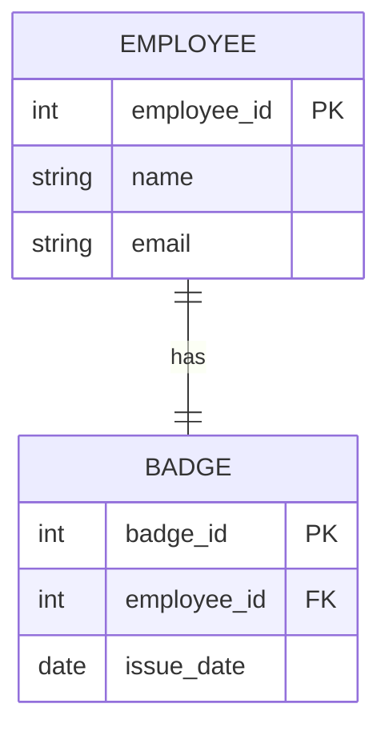

---

## 1:1 Implementation

```sql
CREATE TABLE employees (
    employee_id SERIAL PRIMARY KEY,
    name VARCHAR(100) NOT NULL,
    email VARCHAR(255) NOT NULL UNIQUE
);

CREATE TABLE badges (
    badge_id SERIAL PRIMARY KEY,
    employee_id INT UNIQUE REFERENCES employees(employee_id),
    issue_date DATE NOT NULL DEFAULT CURRENT_DATE
);
```

> The `UNIQUE` constraint on FK enforces 1:1

---

## One-to-Many (1:N)

**Example:** Department → Employees

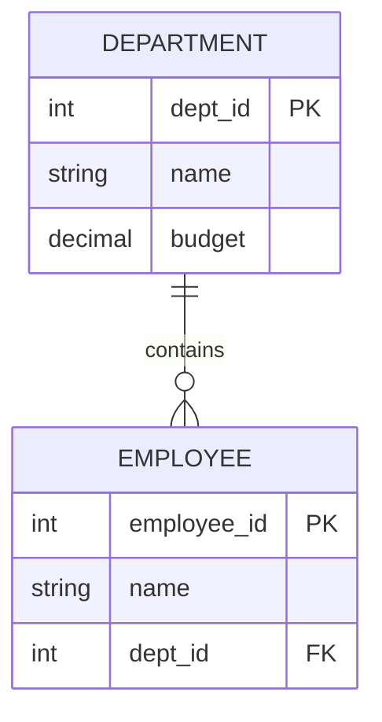

---

## 1:N Implementation

```sql
CREATE TABLE departments (
    dept_id SERIAL PRIMARY KEY,
    name VARCHAR(100) NOT NULL,
    budget DECIMAL(12, 2) DEFAULT 0
);

CREATE TABLE employees (
    employee_id SERIAL PRIMARY KEY,
    name VARCHAR(100) NOT NULL,
    dept_id INT REFERENCES departments(dept_id)
);
```

> FK goes on the **"many"** side

---

## Many-to-Many (M:N)

**Example:** Students ↔ Courses

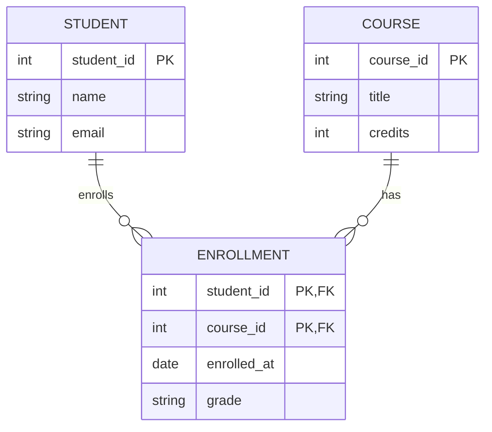

---

## Junction Tables

**Junction table** (bridge/linking table) connects M:N relationships:

```sql
CREATE TABLE students (
    student_id SERIAL PRIMARY KEY,
    name VARCHAR(100) NOT NULL
);

CREATE TABLE courses (
    course_id SERIAL PRIMARY KEY,
    title VARCHAR(200) NOT NULL
);

-- Junction table with extra attributes
CREATE TABLE enrollments (
    student_id INT REFERENCES students(student_id),
    course_id INT REFERENCES courses(course_id),
    enrolled_at DATE DEFAULT CURRENT_DATE,
    grade CHAR(2),
    PRIMARY KEY (student_id, course_id)
);
```

---

## Junction Table Examples

| Relationship      | Junction Table | Extra Attributes         |
| ----------------- | -------------- | ------------------------ |
| Products ↔ Orders | `order_items`  | quantity, unit_price     |
| Users ↔ Roles     | `user_roles`   | assigned_at              |
| Movies ↔ Actors   | `movie_cast`   | role_name, billing_order |
| Tags ↔ Articles   | `article_tags` | -                        |

---

## Self-Referencing Relationships

An entity that relates to itself

**Example:** Employees and Managers

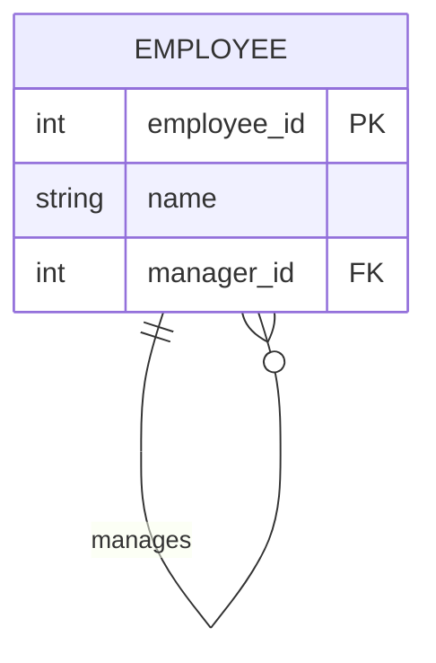

---

## Self-Reference Implementation

```sql
CREATE TABLE employees (
    employee_id SERIAL PRIMARY KEY,
    name VARCHAR(100) NOT NULL,
    manager_id INT REFERENCES employees(employee_id)
);

-- Find all direct reports for manager #5
SELECT * FROM employees WHERE manager_id = 5;

-- Find employee with their manager (using comma-syntax)
-- Note: JOIN syntax will be covered next week!
SELECT e.name AS employee, m.name AS manager
FROM employees e, employees m
WHERE e.manager_id = m.employee_id;
```

---

## Crow's Foot Notation

Most common ER diagram notation:

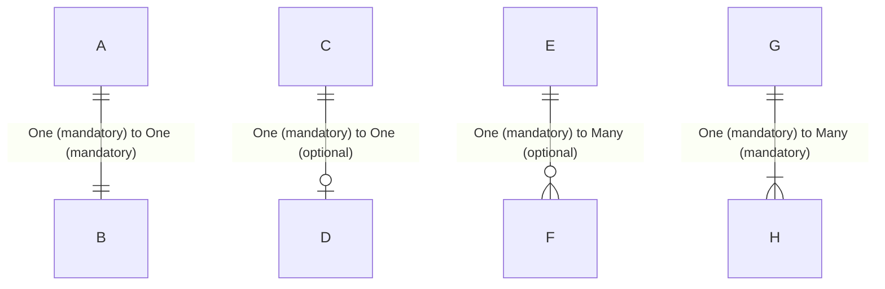

| Symbol         | Meaning                 |
| -------------- | ----------------------- |
| `\|\|`         | Exactly one (mandatory) |
| `\|o` or `o\|` | Zero or one (optional)  |
| `\|{` or `}\|` | One or more (mandatory) |
| `o{` or `}o`   | Zero or more (optional) |

---

## UML Class Diagram Notation

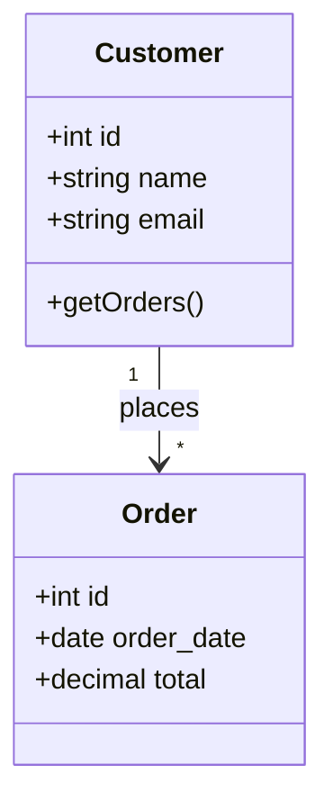

- `1` = exactly one
- `*` = zero or more (many)
- `1..*` = one or more
- `0..1` = zero or one

---

## Cardinality Notation Comparison

| Relationship     | Crow's Foot (Mermaid) | UML    | Chen  |
| ---------------- | --------------------- | ------ | ----- |
| One (mandatory)  | `\|\|--\|\|`          | `1`    | `1`   |
| One (optional)   | `\|o--o\|`            | `0..1` | `0,1` |
| Many (mandatory) | `\|\|--\|{`           | `1..*` | `1,N` |
| Many (optional)  | `\|\|--o{`            | `*`    | `0,N` |

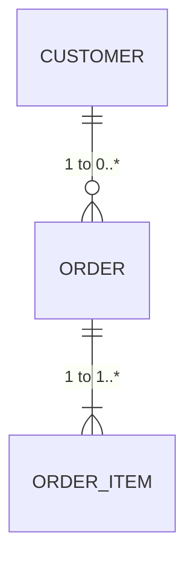

---

## Database Constraints

Constraints enforce data integrity at the database level:

| Constraint      | Purpose                        |
| --------------- | ------------------------------ |
| **PRIMARY KEY** | Unique identifier for each row |
| **FOREIGN KEY** | References another table       |
| **NOT NULL**    | Column must have a value       |
| **UNIQUE**      | No duplicate values            |
| **CHECK**       | Custom validation rules        |
| **DEFAULT**     | Value when none provided       |

---

## PRIMARY KEY

```sql
-- Single column PK
CREATE TABLE customers (
    customer_id SERIAL PRIMARY KEY,
    name VARCHAR(100) NOT NULL
);

-- Composite PK
CREATE TABLE order_items (
    order_id INT,
    product_id INT,
    quantity INT NOT NULL,
    PRIMARY KEY (order_id, product_id)
);
```

---

## FOREIGN KEY

```sql
CREATE TABLE orders (
    order_id SERIAL PRIMARY KEY,
    customer_id INT NOT NULL
        REFERENCES customers(customer_id)
        ON DELETE RESTRICT
        ON UPDATE CASCADE,
    order_date DATE NOT NULL
);
```

**Referential Actions:**

- `RESTRICT` - Block delete/update
- `CASCADE` - Delete/update related rows
- `SET NULL` - Set FK to NULL
- `SET DEFAULT` - Set FK to default value

---

## UNIQUE & CHECK Constraints

```sql
CREATE TABLE users (
    user_id SERIAL PRIMARY KEY,
    email VARCHAR(255) NOT NULL UNIQUE,
    username VARCHAR(50) NOT NULL UNIQUE,
    age INT CHECK (age >= 18),
    status VARCHAR(20) CHECK (status IN ('active', 'inactive', 'pending'))
);
```

---

## NOT NULL & DEFAULT

```sql
CREATE TABLE products (
    product_id SERIAL PRIMARY KEY,
    name VARCHAR(200) NOT NULL,
    price DECIMAL(10, 2) NOT NULL CHECK (price > 0),
    stock INT NOT NULL DEFAULT 0,
    created_at TIMESTAMP DEFAULT CURRENT_TIMESTAMP,
    is_active BOOLEAN DEFAULT TRUE
);
```

---

## Indexing Fundamentals

### Without an Index

```sql
SELECT * FROM customers WHERE email = 'alice@example.com';
```

With 1 million customers → checks **all 1 million rows** (full table scan)

### With an Index

```sql
CREATE INDEX idx_customers_email ON customers(email);
```

Now only ~20 comparisons needed! (log₂ 1,000,000 ≈ 20)

---

## How Indexes Work

**B-Tree** (Balanced Tree) - most common index type

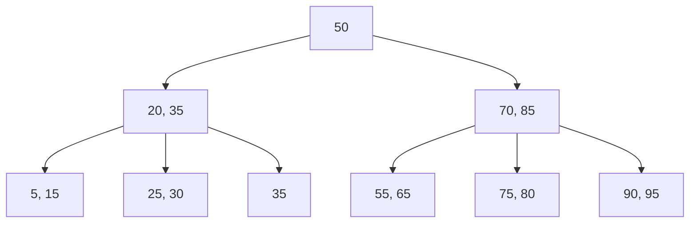

Enables O(log n) lookups instead of O(n) scans

---

## Index Trade-offs

| Operation | Without Index | With Index          |
| --------- | ------------- | ------------------- |
| SELECT    | O(n) - slow   | O(log n) - fast     |
| INSERT    | O(1) - fast   | O(log n) - slower   |
| UPDATE    | O(n) + O(1)   | O(log n) + O(log n) |
| DELETE    | O(n) + O(1)   | O(log n) + O(log n) |

> **Trade-off:** Indexes speed up reads but slow down writes

---

## Creating Indexes

```sql
-- Basic index
CREATE INDEX idx_orders_date ON orders(order_date);

-- Unique index
CREATE UNIQUE INDEX idx_users_email ON users(email);

-- Composite index
CREATE INDEX idx_orders_customer_date
    ON orders(customer_id, order_date);

-- Partial index (only active users)
CREATE INDEX idx_users_active
    ON users(email) WHERE status = 'active';
```

---

## Composite Index Column Order

Index on `(A, B, C)` can be used for:

✅ Queries on `A`
✅ Queries on `A` and `B`
✅ Queries on `A`, `B`, and `C`

❌ Queries on `B` alone
❌ Queries on `C` alone
❌ Queries on `B` and `C`

> Like a phone book: sorted by (Last, First) - can find "Smith" or "Smith, John", but not all "Johns"

---

## PostgreSQL Index Types

| Type       | Best For                             |
| ---------- | ------------------------------------ |
| **B-Tree** | Equality, ranges, ORDER BY (default) |
| **Hash**   | Equality only                        |
| **GiST**   | Geometric data, full-text search     |
| **GIN**    | Arrays, JSONB, full-text             |
| **BRIN**   | Large tables with ordered data       |

---

## What to Index

### Good Candidates ✅

- Primary keys (automatic)
- Foreign keys (manual in PostgreSQL!)
- Columns in WHERE clauses
- Columns in JOIN conditions
- Columns in ORDER BY

### Poor Candidates ❌

- Small tables (< 1000 rows)
- Low selectivity columns (boolean, status)
- Rarely queried columns
- Frequently updated columns

---

## EXPLAIN ANALYZE

```sql
EXPLAIN ANALYZE
SELECT * FROM orders WHERE customer_id = 5;
```

Output:

```
Index Scan using idx_orders_customer on orders
  (cost=0.29..8.30 rows=1 width=40)
  (actual time=0.025..0.027 rows=3 loops=1)
  Index Cond: (customer_id = 5)
Planning Time: 0.082 ms
Execution Time: 0.045 ms
```

---

## Denormalization Trade-offs

### Benefits of Normalization

- ✅ Data integrity (no anomalies)
- ✅ Storage efficiency
- ✅ Easier maintenance
- ✅ Single source of truth

### Costs of Normalization

- ❌ More JOINs required
- ❌ Query complexity
- ❌ Performance overhead
- ❌ Harder to understand

---

## When to Denormalize

### Read-Heavy Workloads

**Normalized (3 tables, using comma-syntax):**

```sql
-- Note: JOIN syntax will be covered next week!
SELECT p.name, c.name AS category, m.name AS manufacturer
FROM products p, categories c, manufacturers m
WHERE p.category_id = c.category_id
  AND p.manufacturer_id = m.manufacturer_id
  AND p.product_id = 101;
```

**Denormalized (single table):**

```sql
SELECT name, category_name, manufacturer_name
FROM products WHERE product_id = 101;
```

---

## Denormalization Techniques

### 1. Redundant Columns

Store frequently-accessed data directly

### 2. Pre-Computed Aggregates

Store calculated totals, counts

### 3. Summary Tables

Separate tables for aggregated data

### 4. Materialized Views

PostgreSQL stores query results physically

---

## Materialized Views

```sql
-- Create materialized view
-- Note: JOIN syntax (including LEFT JOIN) will be covered next week!
CREATE MATERIALIZED VIEW product_sales_summary AS
SELECT
    p.product_id,
    p.name,
    COUNT(oi.order_id) AS times_ordered,
    SUM(oi.quantity) AS total_quantity,
    SUM(oi.quantity * oi.unit_price) AS total_revenue
FROM products p, order_items oi
WHERE p.product_id = oi.product_id
GROUP BY p.product_id, p.name;

-- Create index on materialized view
CREATE INDEX idx_product_sales_revenue
    ON product_sales_summary(total_revenue DESC);

-- Refresh the view
REFRESH MATERIALIZED VIEW product_sales_summary;
```

---

## Regular View vs Materialized View

| Feature     | Regular View                | Materialized View        |
| ----------- | --------------------------- | ------------------------ |
| Storage     | None (query runs each time) | Stores results           |
| Performance | Same as underlying query    | Fast (pre-computed)      |
| Freshness   | Always current              | Stale until refreshed    |
| Indexes     | Cannot create               | Can create               |
| Use Case    | Simple abstraction          | Performance optimization |

---

## Real-World Schema Analysis

### Step 1: List Tables and Relationships

```sql
SELECT table_name
FROM information_schema.tables
WHERE table_schema = 'public';
```

### Step 2: Find Foreign Keys

```sql
-- Note: JOIN syntax will be covered next week!
SELECT tc.table_name, kcu.column_name,
       ccu.table_name AS foreign_table
FROM information_schema.table_constraints tc,
     information_schema.key_column_usage kcu
WHERE tc.constraint_name = kcu.constraint_name
  AND tc.constraint_type = 'FOREIGN KEY';
```

---

## Schema Red Flags

### Multi-valued Columns (1NF violation)

```sql
-- Look for arrays
SELECT column_name, data_type
FROM information_schema.columns
WHERE data_type LIKE '%ARRAY%';
```

### Repeated Column Patterns (1NF violation)

```sql
-- Look for numbered columns
SELECT column_name
FROM information_schema.columns
WHERE column_name ~ '(1|2|3|_1|_2|_3)$';
```

---

## E-Commerce Schema Example

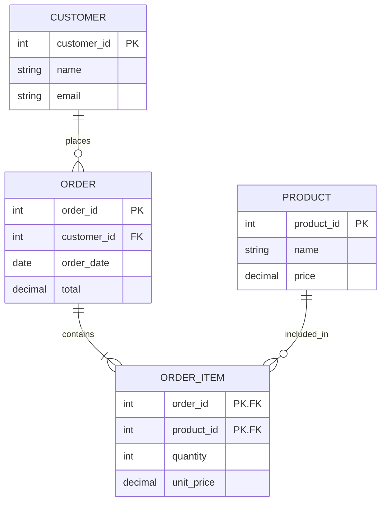

---

## Activity: Normalize This Spreadsheet

**Original "Orders" Spreadsheet:**

| OrderID | CustomerName | CustomerEmail  | CustomerPhone      | Products            | OrderDate  |
| ------- | ------------ | -------------- | ------------------ | ------------------- | ---------- |
| 1       | Alice        | alice@mail.com | 555-1234, 555-5678 | Laptop(1), Mouse(2) | 2026-01-15 |
| 2       | Bob          | bob@mail.com   | 555-9999           | Keyboard(1)         | 2026-01-16 |
| 3       | Alice        | alice@mail.com | 555-1234, 555-5678 | Mouse(3)            | 2026-01-17 |

**What violations do you see?**

---

## Problems Identified

| Problem                             | Normal Form  |
| ----------------------------------- | ------------ |
| `CustomerPhone` has multiple values | 1NF          |
| `Products` has multiple values      | 1NF          |
| Customer data repeated              | 2NF/3NF      |
| No product prices stored            | Design issue |

---

## Step 1: Identify Entities

From the spreadsheet, we can identify:

- **Customers** (CustomerName, Email, Phone)
- **Products** (name, price)
- **Orders** (OrderDate)
- **Order Items** (quantity)
- **Customer Phones** (phone numbers)

---

## Step 2: Normalized Schema

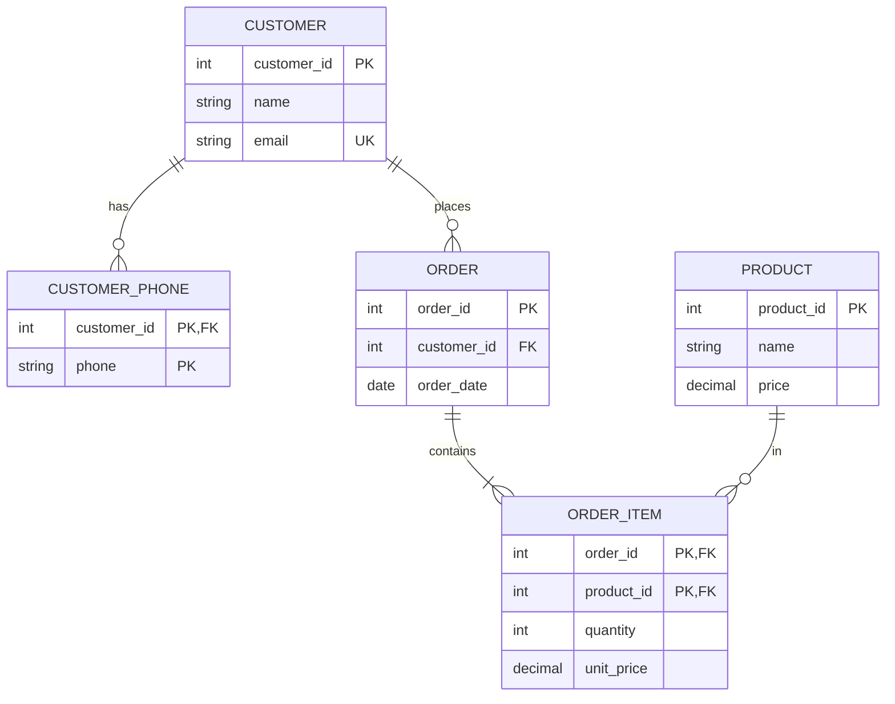

---

## Step 3: Create Tables

```sql
CREATE TABLE customers (
    customer_id SERIAL PRIMARY KEY,
    name VARCHAR(100) NOT NULL,
    email VARCHAR(255) NOT NULL UNIQUE
);

CREATE TABLE customer_phones (
    customer_id INT REFERENCES customers(customer_id),
    phone VARCHAR(20),
    PRIMARY KEY (customer_id, phone)
);

CREATE TABLE products (
    product_id SERIAL PRIMARY KEY,
    name VARCHAR(200) NOT NULL,
    price DECIMAL(10, 2) NOT NULL
);
```

---

## Step 3: Create Tables (continued)

```sql
CREATE TABLE orders (
    order_id SERIAL PRIMARY KEY,
    customer_id INT NOT NULL REFERENCES customers(customer_id),
    order_date DATE NOT NULL DEFAULT CURRENT_DATE
);

CREATE TABLE order_items (
    order_id INT REFERENCES orders(order_id) ON DELETE CASCADE,
    product_id INT REFERENCES products(product_id),
    quantity INT NOT NULL CHECK (quantity > 0),
    unit_price DECIMAL(10, 2) NOT NULL,
    PRIMARY KEY (order_id, product_id)
);

-- Don't forget indexes on FKs!
CREATE INDEX idx_orders_customer ON orders(customer_id);
CREATE INDEX idx_order_items_product ON order_items(product_id);
```

---

## DVD Rental Sample Database

For practicing these concepts, use the **dvdrental** database:

- 15 tables with proper normalization
- Real-world relationships
- Good example of 3NF schema

**Download:** [PostgreSQL Sample Database](https://neon.com/postgresql/postgresql-getting-started/postgresql-sample-database)

---

## DVD Rental Schema

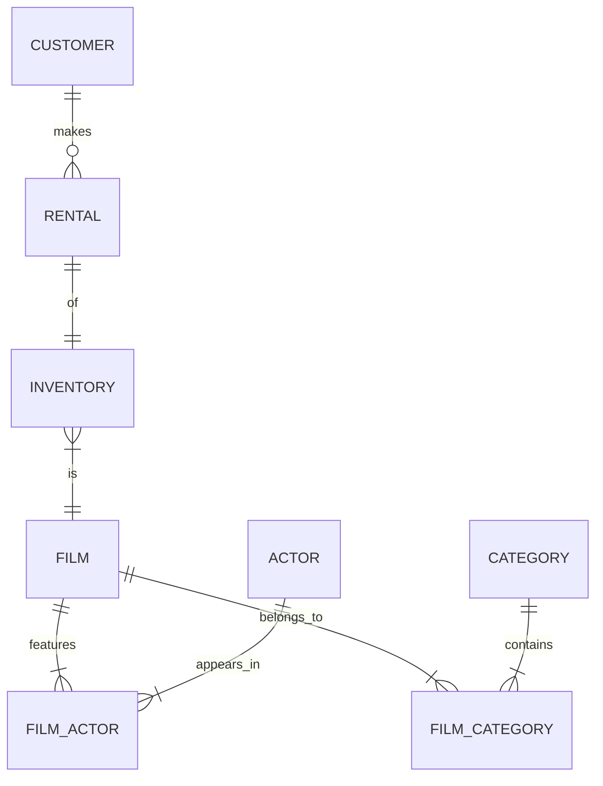

---

## Key Takeaways

1. **Normalize to 3NF** by default
2. **Functional dependencies** guide decomposition
3. **Junction tables** handle M:N relationships
4. **Constraints** enforce integrity at DB level
5. **Index foreign keys** (not automatic in PostgreSQL!)
6. **Denormalize selectively** for read performance
7. **Materialized views** for expensive aggregations

---

## Next Steps

- Practice with the dvdrental database
- Try normalizing your own spreadsheets
- Use EXPLAIN ANALYZE to understand queries
- Experiment with different index types

---

## Questions?
