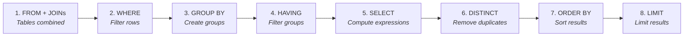
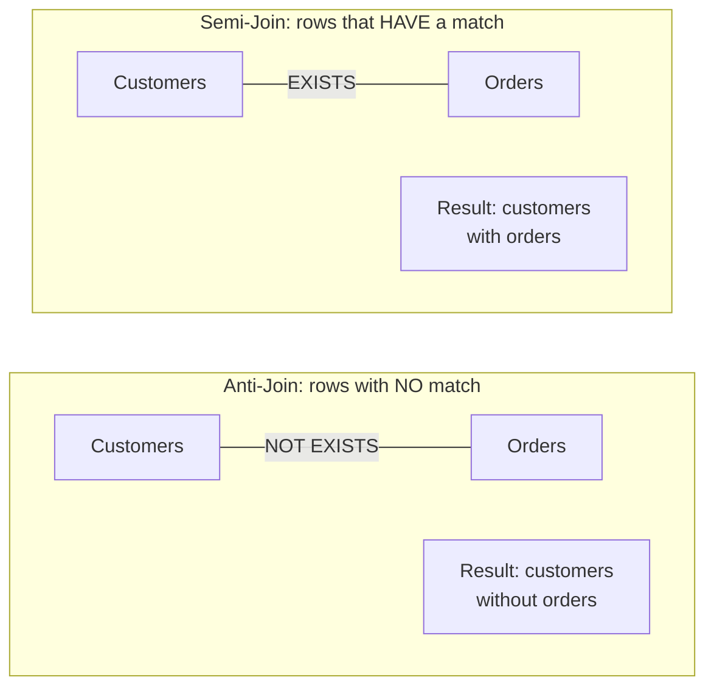

# Week 05: SQL Joins

Join Fundamentals + Outer Joins & Advanced Patterns

---

## Agenda

- Join fundamentals
  - INNER JOIN mechanics
  - Join conditions (ON)
  - Multi-table joins
  - Table aliases
- Outer joins & advanced patterns
  - LEFT / RIGHT / FULL OUTER
  - Self-joins
  - CROSS JOIN
  - Join visualization & mental models

---

## Join Fundamentals: Why Joins?

- Data is normalized across tables
- Joins recombine related rows
- One query instead of manual stitching

---

## Without vs With Joins

**Without joins** (inefficient):

```sql
SELECT * FROM orders WHERE id = 1;
SELECT * FROM customers WHERE id = 42;
-- Then manually match...
```

**With joins** (single query):

```sql
SELECT o.*, c.name AS customer_name
FROM orders o
JOIN customers c ON o.customer_id = c.id
WHERE o.id = 1;
```

---

## INNER JOIN Mechanics

- Returns **only** matching rows from both tables
- `JOIN` == `INNER JOIN`

```sql
SELECT o.id, c.name
FROM orders o
JOIN customers c ON o.customer_id = c.id;
```

```
customers              orders
+----+-------+         +----+-------------+
| id | name  |         | id | customer_id |
+----+-------+         +----+-------------+
| 1  | Alice |         | 1  | 1           |
| 2  | Bob   |         | 2  | 1           |
| 3  | Carol |         | 3  | 2           |
+----+-------+         +----+-------------+

Result (Carol excluded - no orders):
+----------+-------+
| order_id | name  |
+----------+-------+
| 1        | Alice |
| 2        | Alice |
| 3        | Bob   |
+----------+-------+
```

---

## Join Conditions (ON)

**ON** defines how rows relate.

```sql
SELECT *
FROM prices p
JOIN products prod
	ON p.product_id = prod.id
 AND p.region = 'US';
```

- Equality joins (most common)
- Multiple conditions allowed
- Non-equality joins (ranges, comparisons)

---

## Non-Equality Join Conditions

```sql
-- Range-based join
SELECT
    e.name AS employee,
    s.grade AS salary_grade
FROM employees e
JOIN salary_grades s
    ON e.salary BETWEEN s.min_salary
                  AND s.max_salary;
```

Not all joins use `=` — ranges and comparisons work too.

---

## Table Aliases

Aliases keep queries readable.

```sql
SELECT o.id, c.name
FROM orders o
JOIN customers c ON o.customer_id = c.id;
```

**Tip:** Use consistent short aliases (`o`, `c`, `oi`, `p`).

---

## Alias Best Practices

| Table         | Alias |
| ------------- | ----- |
| `customers`   | `c`   |
| `orders`      | `o`   |
| `order_items` | `oi`  |
| `products`    | `p`   |
| `categories`  | `cat` |
| `employees`   | `e`   |

---

## Multi-Table Joins

Chain multiple joins to assemble richer results.

```sql
SELECT o.id, c.name, p.name, oi.quantity
FROM orders o
JOIN customers c ON o.customer_id = c.id
JOIN order_items oi ON o.id = oi.order_id
JOIN products p ON oi.product_id = p.id;
```

---

## Join Order

For INNER JOINs, order typically doesn't affect results, but:

- Start with the **main table**
- Join related tables in **logical order**
- Consider **readability**

```sql
-- Logical flow: orders → items → products → categories
SELECT o.id, p.name AS product, cat.name AS category
FROM orders o
JOIN order_items oi ON o.id = oi.order_id
JOIN products p ON oi.product_id = p.id
JOIN categories cat ON p.category_id = cat.id;
```

---

## USING Clause

When column names match exactly:

```sql
-- Standard ON
SELECT * FROM orders o
JOIN customers c ON o.customer_id = c.customer_id;

-- Cleaner with USING
SELECT * FROM orders o
JOIN customers c USING (customer_id);
```

---

## NATURAL JOIN (Avoid!)

Joins on ALL matching column names automatically:

```sql
SELECT * FROM orders NATURAL JOIN customers;
-- Tries to match: id = id, created_at = created_at...
```

⚠️ **Unpredictable!** Always use explicit ON or USING.

---

## Joining on Multiple Columns

Some relationships require matching on **composite keys**.

```sql
-- Price depends on both product AND region
SELECT p.name, pr.region, pr.price
FROM products p
JOIN product_prices pr
    ON p.id = pr.product_id
   AND p.version = pr.product_version;
```

---

## Filtering Joined Data

For INNER JOIN, `WHERE` and `ON` filters give the **same result**:

```sql
SELECT o.id, c.name, p.name AS product
FROM orders o
JOIN customers c ON o.customer_id = c.id
JOIN order_items oi ON o.id = oi.order_id
JOIN products p ON oi.product_id = p.id
WHERE o.status = 'completed'       -- Filter
  AND c.country = 'USA';           -- Filter
```

**Best Practice:** `ON` for relationships, `WHERE` for filters.

---

## Outer Joins Overview

| Join Type       | Returns                            |
| --------------- | ---------------------------------- |
| LEFT JOIN       | All left rows + matches from right |
| RIGHT JOIN      | All right rows + matches from left |
| FULL OUTER JOIN | All rows from both tables          |

---

## LEFT JOIN

- Keeps **all** rows from the left table
- Fills unmatched right columns with `NULL`

```sql
SELECT c.name, o.id
FROM customers c
LEFT JOIN orders o ON c.id = o.customer_id;
```

---

## LEFT JOIN: COALESCE for NULLs

Handle NULL values from unmatched rows:

```sql
-- Show 'Uncategorized' instead of NULL
SELECT
    p.name AS product,
    COALESCE(cat.name, 'Uncategorized') AS category
FROM products p
LEFT JOIN categories cat ON p.category_id = cat.id;
```

---

## Finding Non-Matching Rows

Customers who have **never** ordered:

```sql
SELECT c.id, c.name
FROM customers c
LEFT JOIN orders o ON c.id = o.customer_id
WHERE o.id IS NULL;
```

Products **never sold**:

```sql
SELECT p.id, p.name
FROM products p
LEFT JOIN order_items oi ON p.id = oi.product_id
WHERE oi.id IS NULL;
```

---

## RIGHT JOIN

- Mirror of LEFT JOIN
- Can always be rewritten as LEFT JOIN by swapping tables

```sql
SELECT c.name, o.id
FROM orders o
RIGHT JOIN customers c ON o.customer_id = c.id;
```

---

## FULL OUTER JOIN

- Returns **all** rows from both sides
- Non-matches produce `NULL`s

```sql
SELECT e.name, d.name
FROM employees e
FULL OUTER JOIN departments d
	ON e.department_id = d.id;
```

---

## FULL OUTER JOIN: Finding Orphans

Find orphaned records on **both** sides:

```sql
SELECT
    e.id AS orphan_employee_id,
    d.id AS empty_department_id
FROM employees e
FULL OUTER JOIN departments d ON e.department_id = d.id
WHERE e.department_id IS NULL
   OR d.id IS NULL;
```

PostgreSQL supports `FULL OUTER JOIN` natively.

---

## Self-Joins

Join a table to itself for hierarchies or comparisons.

```sql
SELECT e.name AS employee, m.name AS manager
FROM employees e
LEFT JOIN employees m ON e.manager_id = m.id;
```

---

## Self-Join: Comparing Rows

Find products with the **same price** (no duplicates):

```sql
SELECT p1.name AS product_1,
       p2.name AS product_2, p1.price
FROM products p1
JOIN products p2
    ON p1.price = p2.price
   AND p1.id < p2.id;
```

`p1.id < p2.id` prevents (A,B)+(B,A) duplicates and self-matches.

---

## Multi-Level Hierarchy

Three levels: Employee → Manager → Director

```sql
SELECT
    e.name AS employee,
    m.name AS manager,
    d.name AS director
FROM employees e
LEFT JOIN employees m ON e.manager_id = m.id
LEFT JOIN employees d ON m.manager_id = d.id;
```

---

## CROSS JOIN

- Produces the Cartesian product (all combinations)
- Useful for generating variants

```sql
SELECT c.name AS color, s.name AS size
FROM colors c
CROSS JOIN sizes s;
```

---

## CROSS JOIN Use Cases

**Generate all product variants:**

```sql
SELECT c.name AS color, s.name AS size,
    p.name || ' - ' || c.name || ' ' || s.name AS variant
FROM products p
CROSS JOIN colors c
CROSS JOIN sizes s;
```

**Calendar generation:**

```sql
SELECT y.year, m.month
FROM (SELECT generate_series(2020, 2026) AS year) y
CROSS JOIN (SELECT generate_series(1, 12) AS month) m;
```

⚠️ **Warning:** 1,000 × 1,000 = 1,000,000 rows!

---

## WHERE vs ON in Outer Joins

**Critical difference!**

```sql
-- ON: Filter BEFORE joining (keeps all customers)
SELECT c.name, o.id
FROM customers c
LEFT JOIN orders o ON c.id = o.customer_id
                   AND o.status = 'completed';

-- WHERE: Filter AFTER (removes non-matches!)
SELECT c.name, o.id
FROM customers c
LEFT JOIN orders o ON c.id = o.customer_id
WHERE o.status = 'completed';
-- ↑ Becomes like INNER JOIN!
```

---

## Combining Multiple Join Types

Mix join types in a single query:

```sql
-- Products MUST have category, reviews are optional
SELECT
    p.name AS product,
    c.name AS category,
    r.rating
FROM products p
INNER JOIN categories c ON p.category_id = c.id
LEFT JOIN reviews r ON p.id = r.product_id;
```

---

## Join Visualization


---

## Join Visualization: Row Matching

| Join Type  | Left Unmatched | Both Matched | Right Unmatched |
| ---------- | -------------- | ------------ | --------------- |
| INNER      | ❌             | ✅           | ❌              |
| LEFT       | ✅             | ✅           | ❌              |
| RIGHT      | ❌             | ✅           | ✅              |
| FULL OUTER | ✅             | ✅           | ✅              |

---

## Joins with Aggregations

```sql
-- Total spent per customer
SELECT
    c.name,
    COUNT(o.id) AS order_count,
    SUM(o.total_amount) AS total_spent
FROM customers c
JOIN orders o ON c.id = o.customer_id
GROUP BY c.id, c.name
ORDER BY total_spent DESC;
```

---

## Multi-Level Aggregation

```sql
-- Revenue by category
SELECT
    cat.name AS category,
    COUNT(DISTINCT o.id) AS order_count,
    SUM(oi.quantity) AS units_sold,
    SUM(oi.quantity * oi.unit_price) AS revenue
FROM categories cat
JOIN products p ON cat.id = p.category_id
JOIN order_items oi ON p.id = oi.product_id
JOIN orders o ON oi.order_id = o.id
GROUP BY cat.id, cat.name
ORDER BY revenue DESC;
```

---

## Common Join Mistakes

1. **Missing join condition** → Cartesian product!
2. **Ambiguous columns** → Use aliases
3. **Wrong columns** → FK to PK, not PK to PK
4. **Forgetting NULLs** → NULL FK won't match

```sql
-- WRONG (5000 rows if 100 × 50)
SELECT * FROM orders, customers;

-- CORRECT
SELECT * FROM orders o
JOIN customers c ON o.customer_id = c.id;
```

---

## Query Execution Order



---

## Anti-Joins and Semi-Joins



---

## Anti-Join

Find rows with **no** match in the other table.

```sql
-- Products that have never been sold
SELECT p.* FROM products p
WHERE NOT EXISTS (
    SELECT 1 FROM order_items oi
    WHERE oi.product_id = p.id
);

-- Equivalent with LEFT JOIN + IS NULL
SELECT p.* FROM products p
LEFT JOIN order_items oi ON p.id = oi.product_id
WHERE oi.id IS NULL;
```

---

## Semi-Join

Find rows that **have** a match, without duplicating.

```sql
-- Customers who have at least one order
SELECT c.* FROM customers c
WHERE EXISTS (
    SELECT 1 FROM orders o
    WHERE o.customer_id = c.id
);

-- ⚠️ JOIN would duplicate rows if customer has multiple orders!
-- EXISTS returns each customer only once
```

---

## Performance Tips

1. **Index join columns**

   ```sql
   CREATE INDEX idx_orders_customer_id
   ON orders(customer_id);
   ```

2. **Use INNER JOIN when possible** (more efficient)

3. **Filter early** before joining large tables

---

## Key Takeaways

- **INNER JOIN:** matches only
- **OUTER JOINs:** include non-matches (NULLs)
- **Self-join:** same table, different roles
- **CROSS JOIN:** all combinations (caution!)
- **WHERE vs ON:** matters for outer joins
- **Anti/Semi-joins:** EXISTS patterns
- Use aliases and explicit ON conditions
- Index your join columns
