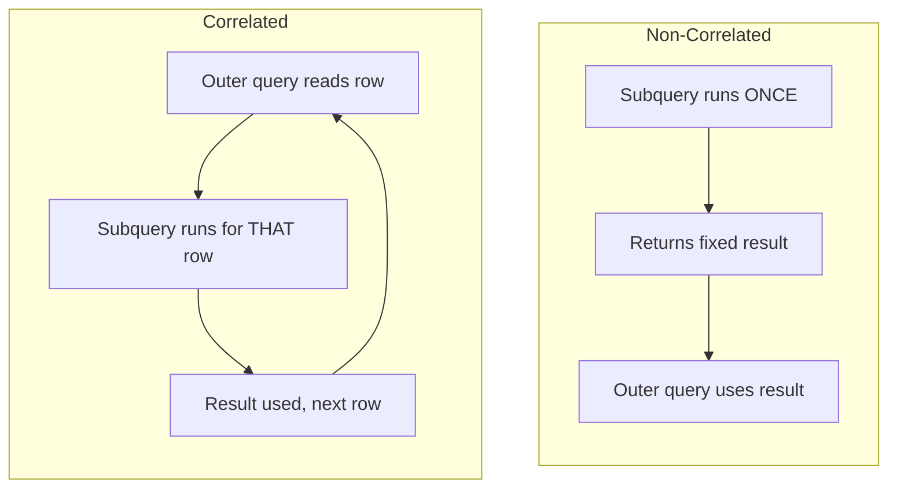
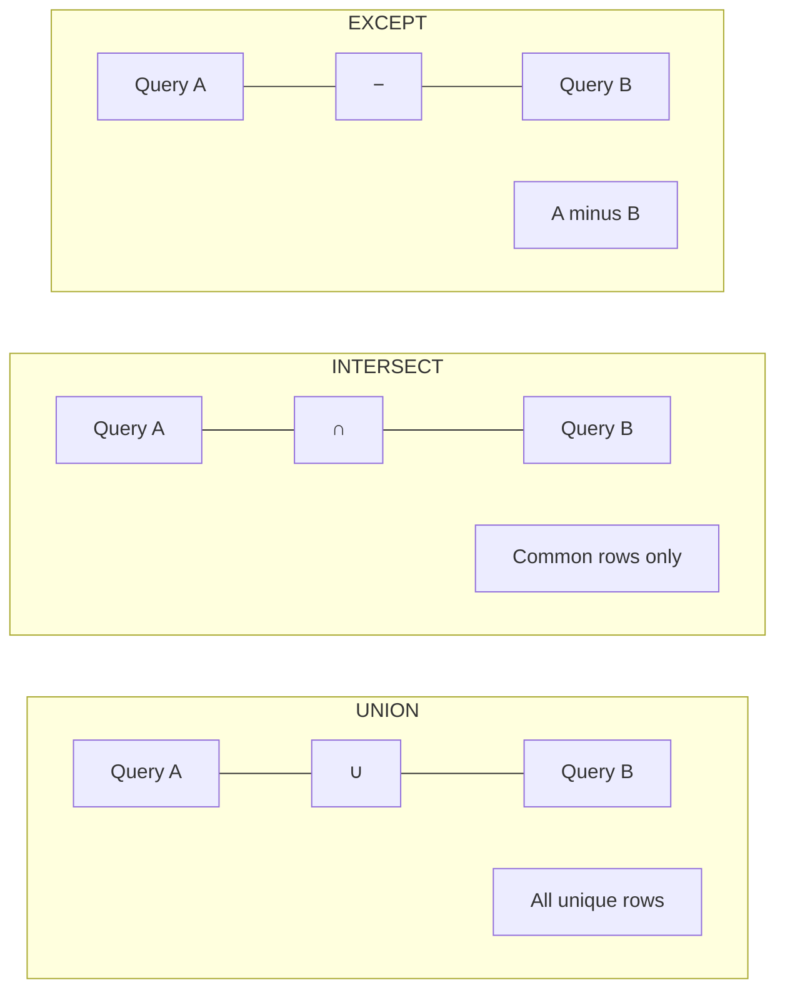
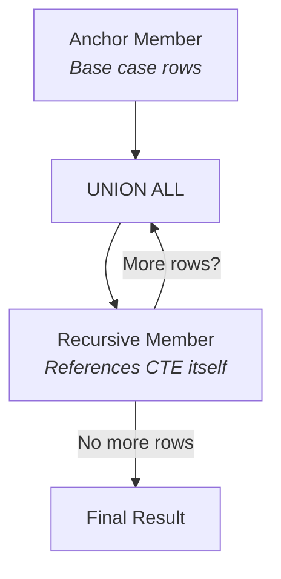
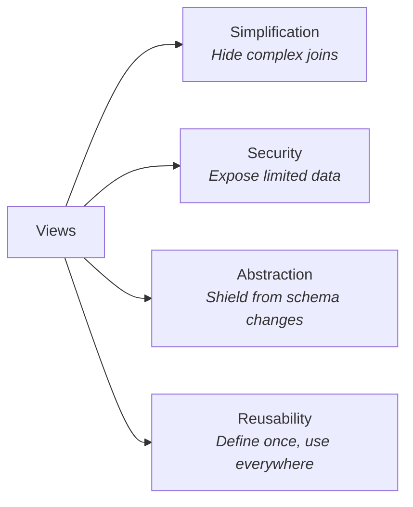
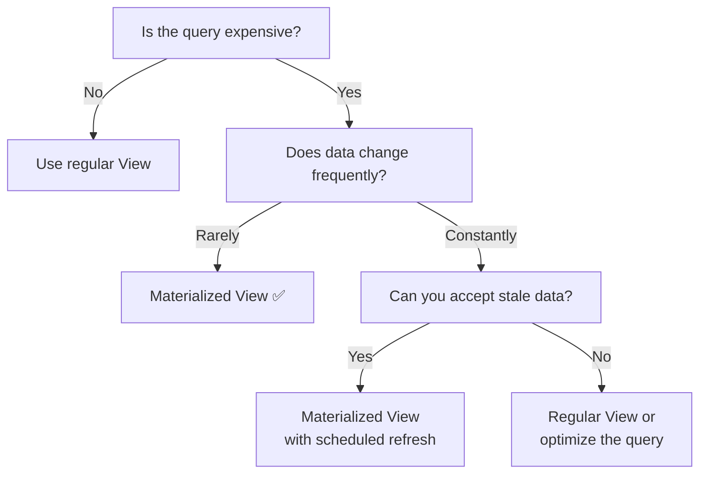
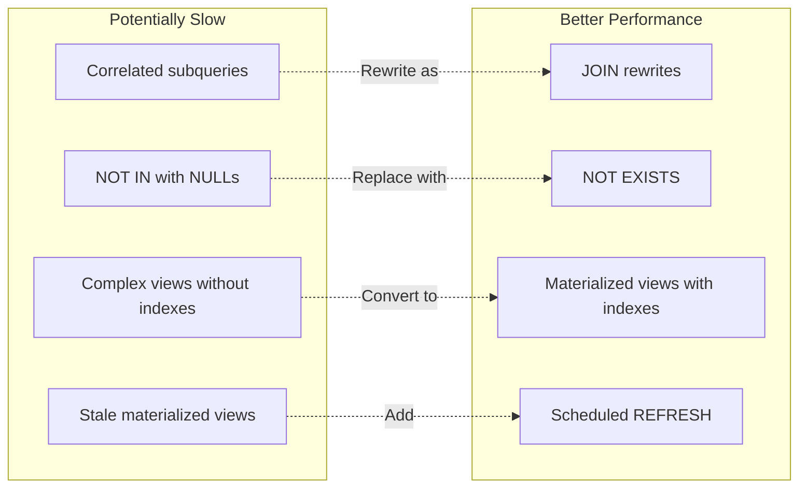

# Week 06: Subqueries, CTEs & Views

Subqueries & Set Operations + Common Table Expressions (CTEs) & Views

---

## Agenda

- Subqueries & set operations
  - Scalar subqueries
  - IN, EXISTS, ANY, ALL
  - Correlated vs non-correlated
  - Derived tables
  - UNION, INTERSECT, EXCEPT
- Common Table Expressions (CTEs) & views
  - CTE basics
  - Recursive CTEs
  - Views & updatable views
  - Materialized views

---

## What is a Subquery?

- A SELECT nested inside another SQL statement
- Also called **inner query** or **nested query**
- Enables complex logic in a single statement

```sql
SELECT * FROM products
WHERE price > (
    -- Subquery (inner query)
    SELECT AVG(price) FROM products
);
```

---

## Subquery Locations

Subqueries can appear in:

| Clause   | Purpose                  |
| -------- | ------------------------ |
| `SELECT` | Compute per-row values   |
| `FROM`   | Create derived tables    |
| `WHERE`  | Filter with dynamic data |
| `HAVING` | Filter groups            |

---

## Scalar Subqueries

A **scalar subquery** returns exactly **one value** (one row, one column).

```sql
-- Products priced above average
SELECT name, price
FROM products
WHERE price > (SELECT AVG(price) FROM products);
```

Can be used anywhere a single value is expected.

---

## Scalar Subqueries in SELECT

Add computed values to each row:

```sql
SELECT
    name,
    price,
    (SELECT AVG(price) FROM products) AS avg_price,
    price - (SELECT AVG(price) FROM products) AS diff_from_avg
FROM products;
```

---

## Scalar Subqueries in SELECT (Correlated)

Reference the outer query for per-row computation:

```sql
-- Count products per category
SELECT
    c.name AS category,
    (SELECT COUNT(*)
     FROM products p
     WHERE p.category_id = c.id) AS product_count
FROM categories c;
```

---

## Scalar Subqueries in WHERE

```sql
-- Most recent order
SELECT * FROM orders
WHERE created_at = (SELECT MAX(created_at) FROM orders);

-- Customer with highest total spending
SELECT * FROM customers
WHERE id = (
    SELECT customer_id
    FROM orders
    GROUP BY customer_id
    ORDER BY SUM(total_amount) DESC
    LIMIT 1
);
```

---

## Scalar Subquery Errors

Scalar subqueries **must** return exactly one value:

```sql
-- ERROR: subquery returns multiple rows
SELECT * FROM products
WHERE price > (SELECT price FROM products WHERE category_id = 1);

-- CORRECT: use aggregate or LIMIT
SELECT * FROM products
WHERE price > (SELECT MAX(price) FROM products WHERE category_id = 1);
```

⚠️ If the subquery returns 0 rows, the result is NULL.

---

## Subqueries with IN

`IN` checks if a value matches **any value** in a set.

```sql
-- Products in 'Electronics' categories
SELECT * FROM products
WHERE category_id IN (
    SELECT id FROM categories
    WHERE name LIKE '%Electronics%'
);

-- Customers who have placed orders
SELECT * FROM customers
WHERE id IN (
    SELECT DISTINCT customer_id FROM orders
);
```

---

## NOT IN

```sql
-- Customers who have never ordered
SELECT * FROM customers
WHERE id NOT IN (
    SELECT DISTINCT customer_id
    FROM orders
    WHERE customer_id IS NOT NULL
);
```

---

## NOT IN: The NULL Trap

⚠️ **Critical pitfall!** `NOT IN` with NULL values returns **no rows**.

```sql
-- If subquery returns (1, 2, NULL):
-- NOT IN (1, 2, NULL) → always UNKNOWN → no rows!

-- Safe pattern: exclude NULLs explicitly
WHERE id NOT IN (SELECT col FROM t WHERE col IS NOT NULL)

-- Or use NOT EXISTS instead (handles NULLs correctly)
```

---

## NOT IN NULL Problem Explained

```
Value 5 NOT IN (1, 2, NULL)

5 <> 1 → TRUE
5 <> 2 → TRUE
5 <> NULL → UNKNOWN

TRUE AND TRUE AND UNKNOWN = UNKNOWN

UNKNOWN is not TRUE → row excluded!
```

**Rule:** Always use `NOT EXISTS` or filter NULLs from `NOT IN`.

---

## Subqueries with EXISTS

`EXISTS` returns TRUE if the subquery returns **any rows** at all.

```sql
-- Customers who have placed at least one order
SELECT * FROM customers c
WHERE EXISTS (
    SELECT 1 FROM orders o
    WHERE o.customer_id = c.id
);
```

- `SELECT 1` is conventional — the content doesn't matter
- Only checks for **existence**, not values

---

## NOT EXISTS

```sql
-- Customers who have never ordered
SELECT * FROM customers c
WHERE NOT EXISTS (
    SELECT 1 FROM orders o
    WHERE o.customer_id = c.id
);

-- Products not in any order
SELECT * FROM products p
WHERE NOT EXISTS (
    SELECT 1 FROM order_items oi
    WHERE oi.product_id = p.id
);
```

✅ Handles NULLs correctly — always safe.

---

## EXISTS vs IN

| Aspect          | IN                        | EXISTS                       |
| --------------- | ------------------------- | ---------------------------- |
| **Returns**     | List of values            | TRUE/FALSE                   |
| **NULL safety** | Problematic with NOT IN   | Always safe                  |
| **Performance** | Better for small results  | Better for large outer table |
| **Readability** | More intuitive for simple | Better for correlated        |

---

## EXISTS vs IN: Equivalent Queries

```sql
-- Using IN
SELECT * FROM customers
WHERE id IN (SELECT customer_id FROM orders);

-- Using EXISTS (often faster for large tables)
SELECT * FROM customers c
WHERE EXISTS (
    SELECT 1 FROM orders o
    WHERE o.customer_id = c.id
);
```

Both return customers who have placed orders.

---

## ANY (SOME)

Returns TRUE if comparison is true for **at least one** value.

```sql
-- Products more expensive than ANY product in category 1
-- (i.e., more expensive than the cheapest in category 1)
SELECT * FROM products
WHERE price > ANY (
    SELECT price FROM products WHERE category_id = 1
);

-- Equivalent to:
SELECT * FROM products
WHERE price > (
    SELECT MIN(price) FROM products WHERE category_id = 1
);
```

---

## ALL

Returns TRUE if comparison is true for **every** value.

```sql
-- Products more expensive than ALL products in category 1
-- (i.e., more expensive than the most expensive in category 1)
SELECT * FROM products
WHERE price > ALL (
    SELECT price FROM products WHERE category_id = 1
);

-- Equivalent to:
SELECT * FROM products
WHERE price > (
    SELECT MAX(price) FROM products WHERE category_id = 1
);
```

---

## ANY/ALL Quick Reference

| Expression          | Equivalent          |
| ------------------- | ------------------- |
| `> ANY (subquery)`  | `> MIN(subquery)`   |
| `< ANY (subquery)`  | `< MAX(subquery)`   |
| `= ANY (subquery)`  | `IN (subquery)`     |
| `> ALL (subquery)`  | `> MAX(subquery)`   |
| `< ALL (subquery)`  | `< MIN(subquery)`   |
| `<> ALL (subquery)` | `NOT IN (subquery)` |

---

## Correlated vs Non-Correlated



---

## Non-Correlated Subquery

Executes **once**, independently of the outer query.

```sql
-- Runs once, returns a single value
SELECT * FROM products
WHERE price > (SELECT AVG(price) FROM products);
--              ^^^^^^^^^^^^^^^^^^^^^^^^^^^^^^^^
--              Independent — no reference to outer query
```

---

## Correlated Subquery

References columns from the outer query. Executes **once per row**.

```sql
-- Products priced above their category's average
SELECT * FROM products p1
WHERE price > (
    SELECT AVG(price)
    FROM products p2
    WHERE p2.category_id = p1.category_id  -- References outer!
);
```

---

## Correlated Subquery Examples

```sql
-- Most expensive product in each category
SELECT * FROM products p1
WHERE price = (
    SELECT MAX(price)
    FROM products p2
    WHERE p2.category_id = p1.category_id
);

-- Orders above that customer's average
SELECT * FROM orders o1
WHERE total_amount > (
    SELECT AVG(total_amount)
    FROM orders o2
    WHERE o2.customer_id = o1.customer_id
);
```

---

## Correlated Subquery: Performance

Correlated subqueries can be **slow** — they run once per outer row.

```sql
-- Slow: correlated subquery
SELECT * FROM products p
WHERE price = (
    SELECT MAX(price) FROM products
    WHERE category_id = p.category_id
);

-- Faster: rewrite with JOIN
SELECT p.*
FROM products p
JOIN (
    SELECT category_id, MAX(price) AS max_price
    FROM products
    GROUP BY category_id
) cat_max ON p.category_id = cat_max.category_id
         AND p.price = cat_max.max_price;
```

---

## Derived Tables (FROM Subqueries)

A subquery in FROM creates a **temporary table** (derived table).

```sql
SELECT * FROM (
    SELECT
        category_id,
        COUNT(*) AS product_count,
        AVG(price) AS avg_price
    FROM products
    GROUP BY category_id
) AS category_stats
WHERE product_count > 10;
```

> **Important:** Derived tables **must** have an alias.

---

## Derived Tables with Joins

```sql
SELECT
    c.name,
    stats.product_count,
    stats.avg_price
FROM categories c
JOIN (
    SELECT
        category_id,
        COUNT(*) AS product_count,
        AVG(price) AS avg_price
    FROM products
    GROUP BY category_id
) AS stats ON c.id = stats.category_id;
```

---

## Set Operations Overview

Combine results from **multiple SELECT** statements.



---

## Set Operations Requirements

All set operations require:

1. **Same number of columns** in each query
2. **Compatible data types** in corresponding positions
3. Column names come from the **first** query

```sql
-- ✅ Correct: same number & compatible types
SELECT name, email FROM customers
UNION
SELECT name, email FROM employees;

-- ❌ Error: different column count
SELECT name, email, phone FROM customers
UNION
SELECT name, email FROM employees;
```

---

## UNION

Combines results and **removes duplicates**.

```sql
-- All people (customers and employees)
SELECT name, email FROM customers
UNION
SELECT name, email FROM employees;
```

Duplicates are detected across **all** columns.

---

## UNION ALL

Combines results and **keeps duplicates** (faster).

```sql
-- All transactions (with possible duplicates)
SELECT amount, 'credit' AS type FROM credits
UNION ALL
SELECT amount, 'debit' AS type FROM debits;

-- Combine logs from multiple tables
SELECT timestamp, message, 'app' AS source FROM app_logs
UNION ALL
SELECT timestamp, message, 'system' AS source FROM system_logs
ORDER BY timestamp DESC;
```

---

## UNION vs UNION ALL

| Use UNION when...            | Use UNION ALL when...          |
| ---------------------------- | ------------------------------ |
| You need unique results      | You want all rows              |
| Combining overlapping data   | Combining non-overlapping data |
| Correctness over performance | Performance is critical        |

**Rule of thumb:** Use `UNION ALL` unless you specifically need deduplication.

---

## INTERSECT

Returns rows that appear in **both** queries.

```sql
-- Customers who are also employees
SELECT email FROM customers
INTERSECT
SELECT email FROM employees;

-- Products ordered in both January AND February
SELECT product_id FROM order_items oi
JOIN orders o ON oi.order_id = o.id
WHERE o.created_at >= '2026-01-01' AND o.created_at < '2026-02-01'
INTERSECT
SELECT product_id FROM order_items oi
JOIN orders o ON oi.order_id = o.id
WHERE o.created_at >= '2026-02-01' AND o.created_at < '2026-03-01';
```

---

## EXCEPT

Returns rows from the first query **not in** the second.

```sql
-- Customers who are NOT employees
SELECT email FROM customers
EXCEPT
SELECT email FROM employees;

-- Products ordered in January but NOT in February
SELECT product_id FROM order_items oi
JOIN orders o ON oi.order_id = o.id
WHERE o.created_at >= '2026-01-01' AND o.created_at < '2026-02-01'
EXCEPT
SELECT product_id FROM order_items oi
JOIN orders o ON oi.order_id = o.id
WHERE o.created_at >= '2026-02-01' AND o.created_at < '2026-03-01';
```

---

## Set Operations with ORDER BY

ORDER BY applies to the **final combined result**:

```sql
SELECT name, email FROM customers
UNION
SELECT name, email FROM employees
ORDER BY name;  -- Sorts the combined result
```

⚠️ ORDER BY goes **after** the last query, not inside individual ones.

---

## Set Operations Comparison

```text
Table A: {1, 2, 3, 4}
Table B: {3, 4, 5, 6}

A UNION B     → {1, 2, 3, 4, 5, 6}
A UNION ALL B → {1, 2, 3, 4, 3, 4, 5, 6}
A INTERSECT B → {3, 4}
A EXCEPT B    → {1, 2}
B EXCEPT A    → {5, 6}
```

---

## Subquery Best Practices

1. **Use CTEs** for complex nested subqueries (readability)
2. **Prefer EXISTS over IN** for large datasets
3. **Avoid NOT IN** with nullable columns
4. **Avoid correlated subqueries** when JOINs suffice

---

## Anti-Pattern: Correlated in SELECT

```sql
-- Slow: correlated subquery runs per row
SELECT *,
    (SELECT COUNT(*) FROM orders
     WHERE customer_id = c.id) AS order_count
FROM customers c;

-- Faster: single aggregation with join
SELECT c.*, COALESCE(o.order_count, 0) AS order_count
FROM customers c
LEFT JOIN (
    SELECT customer_id, COUNT(*) AS order_count
    FROM orders GROUP BY customer_id
) o ON c.id = o.customer_id;
```

---

## Subqueries: Key Takeaways

- **Scalar subqueries** return one value → SELECT or WHERE
- **IN** checks membership; watch for NULL with NOT IN
- **EXISTS** checks existence; handles NULLs correctly
- **ANY/ALL** compare against a set of values
- **Correlated** subqueries reference outer query; run once per row
- **Derived tables** are subqueries in FROM; must have alias
- **Set operations:** UNION (dedup), UNION ALL (keep), INTERSECT, EXCEPT

---

## Part 2: CTEs & Views

Common Table Expressions, Recursive CTEs, Views & Materialized Views

---

## What is a CTE?

A **Common Table Expression** (CTE) is a temporary named result set defined with `WITH`.

- Exists only for the **duration** of the query
- Improves readability and organization
- Can be referenced multiple times in the same query

---

## CTE Basic Syntax

```sql
WITH cte_name AS (
    SELECT ...
)
SELECT * FROM cte_name;
```

---

## CTE Example: Before and After

**Without CTE** (nested, hard to read):

```sql
SELECT * FROM (
    SELECT
        customer_id,
        COUNT(*) AS order_count,
        SUM(total_amount) AS total_spent
    FROM orders
    GROUP BY customer_id
) customer_stats
WHERE order_count > 5;
```

**With CTE** (named, clean):

```sql
WITH customer_stats AS (
    SELECT
        customer_id,
        COUNT(*) AS order_count,
        SUM(total_amount) AS total_spent
    FROM orders
    GROUP BY customer_id
)
SELECT * FROM customer_stats
WHERE order_count > 5;
```

---

## Multiple CTEs (Common Table Expressions)

Chain multiple CTEs separated by **commas**:

```sql
WITH
-- Step 1: Calculate order stats
customer_orders AS (
    SELECT
        customer_id,
        COUNT(*) AS order_count,
        SUM(total_amount) AS total_spent
    FROM orders
    GROUP BY customer_id
),
-- Step 2: Assign tiers
customer_tiers AS (
    SELECT
        customer_id, order_count, total_spent,
        CASE
            WHEN total_spent >= 10000 THEN 'Platinum'
            WHEN total_spent >= 5000 THEN 'Gold'
            WHEN total_spent >= 1000 THEN 'Silver'
            ELSE 'Bronze'
        END AS tier
    FROM customer_orders
)
-- Step 3: Join with customer details
SELECT c.name, c.email, ct.order_count, ct.total_spent, ct.tier
FROM customers c
JOIN customer_tiers ct ON c.id = ct.customer_id
ORDER BY ct.total_spent DESC;
```

---

## CTEs Referencing Other CTEs

Later CTEs can reference earlier ones:

```sql
WITH
daily_sales AS (
    SELECT
        DATE(created_at) AS sale_date,
        SUM(total_amount) AS daily_total
    FROM orders
    GROUP BY DATE(created_at)
),
weekly_avg AS (
    SELECT AVG(daily_total) AS avg_daily_sales
    FROM daily_sales  -- References first CTE
)
SELECT
    ds.sale_date,
    ds.daily_total,
    wa.avg_daily_sales,
    ds.daily_total - wa.avg_daily_sales AS diff_from_avg
FROM daily_sales ds
CROSS JOIN weekly_avg wa
ORDER BY ds.sale_date;
```

---

## CTE vs Subquery

| Aspect          | CTE                        | Subquery            |
| --------------- | -------------------------- | ------------------- |
| **Readability** | Named, top-down flow       | Nested, inside-out  |
| **Reusability** | Reference multiple times   | Must repeat         |
| **Recursion**   | Supported                  | Not supported       |
| **Performance** | Usually same as subquery   | Usually same as CTE |
| **Scope**       | Duration of the query only | Inline only         |

---

## When to Use CTEs

1. **Complex queries** with multiple logical steps
2. **Reusing** the same result set multiple times
3. **Recursive** queries (hierarchies, graphs)
4. **Self-documenting** code with named intermediate results

---

## CTE Reuse: Avoiding Repetition

```sql
-- Subquery repeated twice (redundant)
SELECT * FROM orders
WHERE total_amount > (SELECT AVG(total_amount) FROM orders)
  AND customer_id IN (
      SELECT customer_id FROM orders
      GROUP BY customer_id
      HAVING AVG(total_amount) > (SELECT AVG(total_amount) FROM orders)
  );

-- CTE defined once, used twice
WITH avg_order AS (
    SELECT AVG(total_amount) AS avg_amount FROM orders
)
SELECT o.* FROM orders o, avg_order a
WHERE o.total_amount > a.avg_amount
  AND o.customer_id IN (
      SELECT customer_id FROM orders, avg_order
      GROUP BY customer_id, avg_amount
      HAVING AVG(total_amount) > avg_amount
  );
```

---

## Recursive CTEs

Recursive CTEs reference **themselves** to process hierarchical or graph data.



---

## Recursive CTE Syntax

```sql
WITH RECURSIVE cte_name AS (
    -- Anchor member (base case)
    SELECT ...

    UNION ALL

    -- Recursive member (references cte_name)
    SELECT ... FROM cte_name WHERE ...
)
SELECT * FROM cte_name;
```

**Two parts:**

1. **Anchor:** starting rows (runs once)
2. **Recursive:** generates new rows from previous iteration

---

## Recursive CTE: How It Works

```
Iteration 0 (Anchor): SELECT base rows
    ↓
Iteration 1: JOIN new rows with anchor results
    ↓
Iteration 2: JOIN new rows with iteration 1 results
    ↓
...continues until no new rows produced...
    ↓
Final: UNION ALL of all iterations
```

---

## Employee Hierarchy Example

```sql
WITH RECURSIVE org_chart AS (
    -- Anchor: top-level (no manager)
    SELECT
        id, name, manager_id,
        1 AS level,
        name AS path
    FROM employees
    WHERE manager_id IS NULL

    UNION ALL

    -- Recursive: find reports
    SELECT
        e.id, e.name, e.manager_id,
        oc.level + 1,
        oc.path || ' > ' || e.name
    FROM employees e
    JOIN org_chart oc ON e.manager_id = oc.id
)
SELECT * FROM org_chart ORDER BY path;
```

---

## Employee Hierarchy Result

```
id | name    | manager_id | level | path
---+---------+------------+-------+---------------------------
1  | CEO     | NULL       | 1     | CEO
2  | CTO     | 1          | 2     | CEO > CTO
4  | DevLead | 2          | 3     | CEO > CTO > DevLead
5  | Dev1    | 4          | 4     | CEO > CTO > DevLead > Dev1
3  | CFO     | 1          | 2     | CEO > CFO
```

---

## Category Tree Example

```sql
WITH RECURSIVE category_tree AS (
    -- Root categories
    SELECT id, name, parent_id,
        1 AS depth,
        ARRAY[id] AS path
    FROM categories
    WHERE parent_id IS NULL

    UNION ALL

    -- Child categories
    SELECT c.id, c.name, c.parent_id,
        ct.depth + 1,
        ct.path || c.id
    FROM categories c
    JOIN category_tree ct ON c.parent_id = ct.id
)
SELECT
    id,
    REPEAT('  ', depth - 1) || name AS indented_name,
    depth
FROM category_tree
ORDER BY path;
```

---

## Generating Sequences

```sql
-- Generate numbers 1 to 10
WITH RECURSIVE numbers AS (
    SELECT 1 AS n           -- Anchor
    UNION ALL
    SELECT n + 1 FROM numbers WHERE n < 10  -- Recursive
)
SELECT n FROM numbers;

-- Generate date series
WITH RECURSIVE dates AS (
    SELECT DATE '2026-01-01' AS dt
    UNION ALL
    SELECT dt + INTERVAL '1 day'
    FROM dates WHERE dt < '2026-01-31'
)
SELECT dt FROM dates;
```

---

## Finding All Descendants

```sql
-- All subordinates of employee ID 2
WITH RECURSIVE subordinates AS (
    -- Anchor: direct reports
    SELECT id, name, manager_id
    FROM employees
    WHERE manager_id = 2

    UNION ALL

    -- Recursive: reports of reports
    SELECT e.id, e.name, e.manager_id
    FROM employees e
    JOIN subordinates s ON e.manager_id = s.id
)
SELECT * FROM subordinates;
```

---

## Preventing Infinite Loops

Add a **depth limit** to avoid runaway recursion:

```sql
WITH RECURSIVE tree AS (
    SELECT id, parent_id, 1 AS depth
    FROM nodes WHERE id = 1

    UNION ALL

    SELECT n.id, n.parent_id, t.depth + 1
    FROM nodes n
    JOIN tree t ON n.parent_id = t.id
    WHERE t.depth < 100  -- Safety limit
)
SELECT * FROM tree;
```

---

## Cycle Detection

PostgreSQL can detect cycles with path tracking:

```sql
WITH RECURSIVE tree AS (
    SELECT id, parent_id,
        ARRAY[id] AS path,
        false AS cycle
    FROM nodes WHERE id = 1

    UNION ALL

    SELECT n.id, n.parent_id,
        t.path || n.id,
        n.id = ANY(t.path)  -- Cycle detected!
    FROM nodes n
    JOIN tree t ON n.parent_id = t.id
    WHERE NOT t.cycle
)
SELECT * FROM tree WHERE NOT cycle;
```

---

## Views Overview

A **view** is a stored query that acts like a **virtual table**.

- Does **not** store data — runs the query when accessed
- Defined once, used everywhere
- Simplifies complex queries

```sql
CREATE VIEW view_name AS
SELECT ...;
```

---

## Creating a View

```sql
CREATE VIEW active_products AS
SELECT id, name, price, category_id
FROM products
WHERE is_active = true AND stock_quantity > 0;

-- Use like a regular table
SELECT * FROM active_products WHERE price < 50;
SELECT COUNT(*) FROM active_products;
```

---

## View Benefits



---

## Complex View Example

```sql
CREATE VIEW order_details AS
SELECT
    o.id AS order_id,
    o.created_at AS order_date,
    c.name AS customer_name,
    c.email AS customer_email,
    p.name AS product_name,
    oi.quantity,
    oi.unit_price,
    (oi.quantity * oi.unit_price) AS line_total,
    o.total_amount AS order_total,
    o.status
FROM orders o
JOIN customers c ON o.customer_id = c.id
JOIN order_items oi ON o.id = oi.order_id
JOIN products p ON oi.product_id = p.id;
```

---

## Using the Complex View

Once defined, queries become simple:

```sql
-- Pending orders
SELECT * FROM order_details WHERE status = 'pending';

-- Spending per customer
SELECT customer_name, SUM(line_total) AS total
FROM order_details
GROUP BY customer_name;

-- Top products
SELECT product_name, SUM(quantity) AS units_sold
FROM order_details
GROUP BY product_name
ORDER BY units_sold DESC
LIMIT 10;
```

---

## Replacing and Dropping Views

```sql
-- Overwrite existing view
CREATE OR REPLACE VIEW active_products AS
SELECT id, name, price, category_id, stock_quantity
FROM products
WHERE is_active = true AND stock_quantity > 0;

-- Drop a view
DROP VIEW view_name;
DROP VIEW IF EXISTS view_name;
DROP VIEW view_name CASCADE;  -- Drop dependent objects too
```

---

## View Security: Column-Level

Hide sensitive columns from certain users:

```sql
-- Public view — no salary, SSN, or address
CREATE VIEW public_employees AS
SELECT id, name, department, hire_date
FROM employees;
-- Excludes: salary, ssn, home_address

GRANT SELECT ON public_employees TO app_user;
-- Don't grant access to the employees table directly
```

---

## View Security: Row-Level

Restrict visible rows:

```sql
-- Only active, public products
CREATE VIEW public_products AS
SELECT id, name, description, price
FROM products
WHERE is_active = true AND is_public = true;
```

---

## View Security: Schema-Based Access

```sql
-- Create views in a separate schema
CREATE SCHEMA api;

CREATE VIEW api.customers AS
SELECT id, name, email FROM internal.customers;

-- Grant access to views only
GRANT SELECT ON api.customers TO app_user;
-- Don't grant access to internal.customers
```

---

## Updatable Views

Some views allow INSERT, UPDATE, DELETE — modifying the **underlying table**.

### Requirements:

- Based on a **single** table
- No DISTINCT, GROUP BY, HAVING, UNION
- No aggregate functions
- No subqueries in SELECT
- Includes all NOT NULL columns without defaults

---

## Updatable View Example

```sql
CREATE VIEW california_customers AS
SELECT id, name, email, phone, state
FROM customers
WHERE state = 'CA';

-- These work:
UPDATE california_customers
SET phone = '555-0100' WHERE id = 1;

INSERT INTO california_customers (id, name, email, state)
VALUES (100, 'New Customer', 'new@email.com', 'CA');
```

---

## The Disappearing Row Problem

```sql
CREATE VIEW california_customers AS
SELECT id, name, email, phone, state
FROM customers WHERE state = 'CA';

-- This succeeds, but the row vanishes from the view!
UPDATE california_customers SET state = 'NY' WHERE id = 1;

-- Row is gone from california_customers
-- (still exists in customers table with state = 'NY')
```

---

## WITH CHECK OPTION

Prevents updates that would make rows **disappear** from the view:

```sql
CREATE VIEW california_customers AS
SELECT id, name, email, phone, state
FROM customers
WHERE state = 'CA'
WITH CHECK OPTION;

-- This now FAILS:
UPDATE california_customers SET state = 'NY' WHERE id = 1;
-- ERROR: new row violates check option for view
```

---

## Views Don't Cache!

Regular views execute the full query **every time** they're accessed:

```sql
-- This runs the 4-table join every single time
SELECT * FROM order_details WHERE customer_name = 'Alice';
```

These are equivalent in performance:

```sql
CREATE VIEW big_orders AS
SELECT * FROM orders WHERE total_amount > 1000;

-- Same performance:
SELECT * FROM big_orders WHERE status = 'pending';
SELECT * FROM orders WHERE total_amount > 1000 AND status = 'pending';
```

---

## Materialized Views

A **materialized view** stores the query result **physically**.

| Aspect        | Regular View             | Materialized View       |
| ------------- | ------------------------ | ----------------------- |
| **Storage**   | No data stored           | Stores query result     |
| **Speed**     | Runs query each time     | Fast (precomputed)      |
| **Freshness** | Always current           | May be stale            |
| **Updates**   | N/A                      | Requires REFRESH        |
| **Indexes**   | Cannot create            | Can create indexes      |
| **Use case**  | Simple queries, security | Aggregations, reporting |

---

## Creating Materialized Views

```sql
CREATE MATERIALIZED VIEW sales_summary AS
SELECT
    DATE_TRUNC('month', o.created_at) AS month,
    c.name AS category,
    COUNT(DISTINCT o.id) AS order_count,
    SUM(oi.quantity) AS units_sold,
    SUM(oi.quantity * oi.unit_price) AS revenue
FROM orders o
JOIN order_items oi ON o.id = oi.order_id
JOIN products p ON oi.product_id = p.id
JOIN categories c ON p.category_id = c.id
WHERE o.status = 'completed'
GROUP BY DATE_TRUNC('month', o.created_at), c.name;
```

---

## Querying Materialized Views

```sql
-- Fast: reads from stored data (no joins!)
SELECT * FROM sales_summary
WHERE month = '2026-01-01';

-- Can aggregate further
SELECT month, SUM(revenue) AS total_revenue
FROM sales_summary
GROUP BY month
ORDER BY month;
```

---

## Refreshing Materialized Views

Materialized views become **stale**. Refresh to update:

```sql
-- Full refresh (rebuilds entire view, locks reads)
REFRESH MATERIALIZED VIEW sales_summary;

-- Concurrent refresh (doesn't lock reads)
-- Requires a unique index first!
CREATE UNIQUE INDEX ON sales_summary (month, category);
REFRESH MATERIALIZED VIEW CONCURRENTLY sales_summary;
```

---

## Refresh Strategies

| Strategy          | When to Use                         |
| ----------------- | ----------------------------------- |
| **Manual**        | Ad-hoc reporting, after batch loads |
| **Scheduled**     | Regular intervals (cron job)        |
| **Trigger-based** | After source table changes          |
| **On-demand**     | Before critical queries             |

```sql
-- Scheduled refresh with pg_cron
SELECT cron.schedule(
    'refresh-sales',
    '0 * * * *',  -- Every hour
    'REFRESH MATERIALIZED VIEW CONCURRENTLY sales_summary'
);
```

---

## Cron Expression Format

5 fields separated by spaces:

```
┌─── minute (0–59)
│ ┌─── hour (0–23)
│ │ ┌─── day of month (1–31)
│ │ │ ┌─── month (1–12)
│ │ │ │ ┌─── day of week (0–7, Sun=0 or 7)
│ │ │ │ │
* * * * *
```

| Symbol | Meaning              | Example                           |
| ------ | -------------------- | --------------------------------- |
| `*`    | Every possible value | `* * * * *` → every minute        |
| `0`    | Specific value       | `0 * * * *` → top of every hour   |
| `*/N`  | Every N intervals    | `*/15 * * * *` → every 15 min     |
| `N,M`  | Multiple values      | `0,30 * * * *` → minute 0 and 30  |
| `N-M`  | Range                | `0 9-17 * * *` → hourly 9 AM–5 PM |

```
0 * * * *       Every hour (at minute 0)
*/5 * * * *     Every 5 minutes
0 0 * * *       Daily at midnight
0 0 * * 0       Weekly on Sunday at midnight
0 0 1 * *       Monthly on the 1st at midnight
30 2 * * 1-5    Weekdays at 2:30 AM
```

---

## Trigger-Based Refresh

Auto-refresh a materialized view when source tables change.

```sql
-- Step 1: Create a refresh function
CREATE OR REPLACE FUNCTION refresh_sales_summary()
RETURNS TRIGGER AS $$
BEGIN
    REFRESH MATERIALIZED VIEW CONCURRENTLY sales_summary;
    RETURN NULL;
END;
$$ LANGUAGE plpgsql;

-- Step 2: Attach triggers to source tables
CREATE TRIGGER trg_refresh_sales_on_orders
AFTER INSERT OR UPDATE OR DELETE ON orders
FOR EACH STATEMENT          -- Not FOR EACH ROW!
EXECUTE FUNCTION refresh_sales_summary();

CREATE TRIGGER trg_refresh_sales_on_items
AFTER INSERT OR UPDATE OR DELETE ON order_items
FOR EACH STATEMENT
EXECUTE FUNCTION refresh_sales_summary();
```

---

## Trigger Refresh — Key Choices

| Choice               | Why                                             |
| -------------------- | ----------------------------------------------- |
| `AFTER` not `BEFORE` | Data must be committed before the view reads it |
| `FOR EACH STATEMENT` | Avoids refreshing once per row in bulk inserts  |
| `RETURNS NULL`       | Return value is ignored for AFTER triggers      |
| `CONCURRENTLY`       | Doesn't lock reads while rebuilding             |

⚠️ **Caution:** On high-write tables, every statement triggers a full rebuild. Use a **debounced** pattern instead:

```sql
-- Flag the view as stale (cheap)
CREATE TABLE mv_refresh_queue (
    view_name TEXT PRIMARY KEY,
    needs_refresh BOOLEAN DEFAULT TRUE
);

-- Trigger only sets a flag, doesn't rebuild
CREATE OR REPLACE FUNCTION flag_stale()
RETURNS TRIGGER AS $$
BEGIN
    INSERT INTO mv_refresh_queue VALUES ('sales_summary', TRUE)
    ON CONFLICT (view_name) DO UPDATE SET needs_refresh = TRUE;
    RETURN NULL;
END;
$$ LANGUAGE plpgsql;

-- A cron job rebuilds only when the flag is set
-- (runs every minute, but skips if nothing changed)
```

---

## Indexing Materialized Views

Unlike regular views, materialized views can have **indexes**:

```sql
-- Create indexes for faster queries
CREATE INDEX idx_sales_month
    ON sales_summary (month);
CREATE INDEX idx_sales_category
    ON sales_summary (category);

-- Query uses index
SELECT * FROM sales_summary
WHERE month = '2026-01-01'
  AND category = 'Electronics';
```

---

## When to Use Materialized Views



---

## Materialized View: Complete Workflow

```sql
-- 1. Create the materialized view
CREATE MATERIALIZED VIEW product_stats AS
SELECT
    p.id, p.name,
    COUNT(oi.id) AS times_ordered,
    SUM(oi.quantity) AS total_units,
    AVG(oi.unit_price) AS avg_selling_price
FROM products p
LEFT JOIN order_items oi ON p.id = oi.product_id
GROUP BY p.id, p.name;

-- 2. Add indexes
CREATE UNIQUE INDEX idx_product_stats_id ON product_stats (id);
CREATE INDEX idx_product_stats_ordered ON product_stats (times_ordered DESC);

-- 3. Query (fast!)
SELECT * FROM product_stats WHERE times_ordered > 100;

-- 4. Refresh when needed
REFRESH MATERIALIZED VIEW CONCURRENTLY product_stats;
```

---

## Performance Considerations Summary



---

## Common Mistakes

1. **NOT IN with NULLs** → Use NOT EXISTS instead
2. **Scalar subquery returning multiple rows** → Add aggregate or LIMIT
3. **Forgetting derived table alias** → Always name your subqueries in FROM
4. **Using UNION when UNION ALL suffices** → Unnecessary deduplication cost
5. **Expecting views to cache** → Views re-run the query every time
6. **Forgetting to REFRESH** materialized views → Stale data
7. **Missing UNIQUE INDEX** for CONCURRENTLY → Refresh fails

---

## Quick Reference: Subqueries

```sql
-- Scalar subquery
SELECT * FROM t WHERE col > (SELECT AVG(col) FROM t);

-- IN subquery
SELECT * FROM t WHERE id IN (SELECT id FROM other);

-- EXISTS
SELECT * FROM t1
WHERE EXISTS (SELECT 1 FROM t2 WHERE t2.fk = t1.id);

-- NOT EXISTS (NULL-safe)
SELECT * FROM t1
WHERE NOT EXISTS (SELECT 1 FROM t2 WHERE t2.fk = t1.id);

-- Correlated subquery
SELECT * FROM t1
WHERE col = (SELECT MAX(col) FROM t1 t2
             WHERE t2.grp = t1.grp);
```

---

## Quick Reference: Set Operations

```sql
-- Remove duplicates
SELECT a FROM t1 UNION SELECT a FROM t2;

-- Keep duplicates (faster)
SELECT a FROM t1 UNION ALL SELECT a FROM t2;

-- In both
SELECT a FROM t1 INTERSECT SELECT a FROM t2;

-- In first, not second
SELECT a FROM t1 EXCEPT SELECT a FROM t2;
```

---

## Quick Reference: CTEs

```sql
-- Simple CTE
WITH cte AS (SELECT ...)
SELECT * FROM cte;

-- Multiple CTEs
WITH cte1 AS (...), cte2 AS (...)
SELECT * FROM cte1 JOIN cte2 ...;

-- Recursive CTE
WITH RECURSIVE cte AS (
    SELECT ... -- anchor (base case)
    UNION ALL
    SELECT ... FROM cte WHERE ... -- recursive
)
SELECT * FROM cte;
```

---

## Quick Reference: Views

```sql
-- Create view
CREATE VIEW v AS SELECT ...;
CREATE OR REPLACE VIEW v AS SELECT ...;

-- Updatable view with check
CREATE VIEW v AS SELECT ... WHERE cond
WITH CHECK OPTION;

-- Drop view
DROP VIEW IF EXISTS v;

-- Materialized view
CREATE MATERIALIZED VIEW mv AS SELECT ...;
REFRESH MATERIALIZED VIEW mv;
REFRESH MATERIALIZED VIEW CONCURRENTLY mv;
DROP MATERIALIZED VIEW mv;
```

---

## Query Execution Order (Review)


---

## Key Takeaways

- **Scalar subqueries:** one value, used in SELECT/WHERE
- **IN / EXISTS:** membership tests; EXISTS is NULL-safe
- **ANY / ALL:** compare against a set of values
- **Correlated subqueries:** run per row — can be slow
- **Set operations:** UNION, INTERSECT, EXCEPT for combining queries
- **CTEs:** named, readable, reusable query blocks
- **Recursive CTEs:** hierarchies & graph traversal
- **Views:** virtual tables for abstraction & security
- **Materialized views:** precomputed results for performance
- **REFRESH:** keep materialized views up to date
