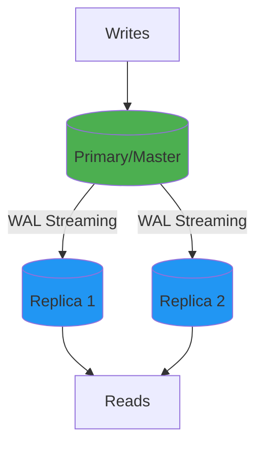
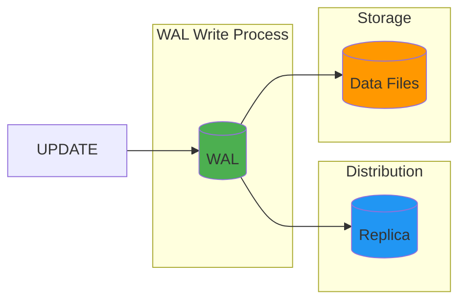
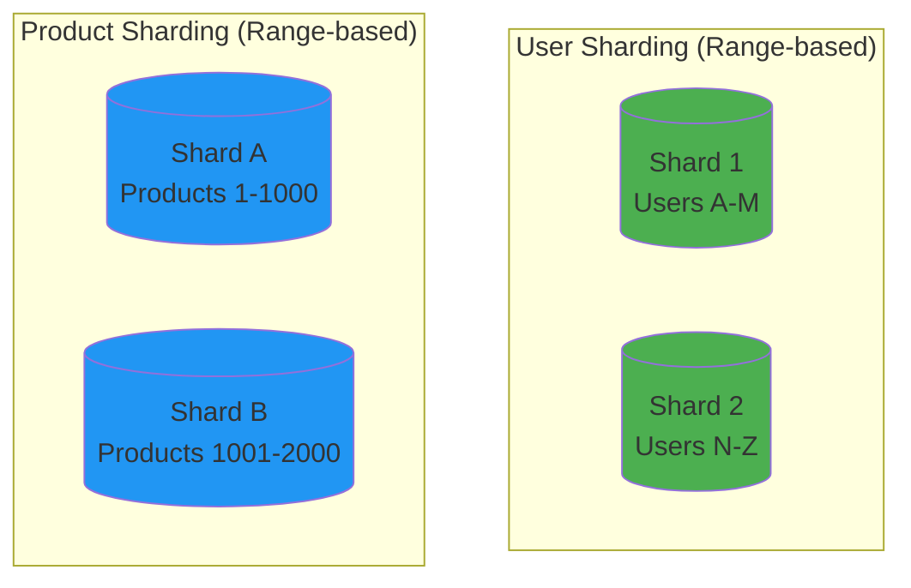
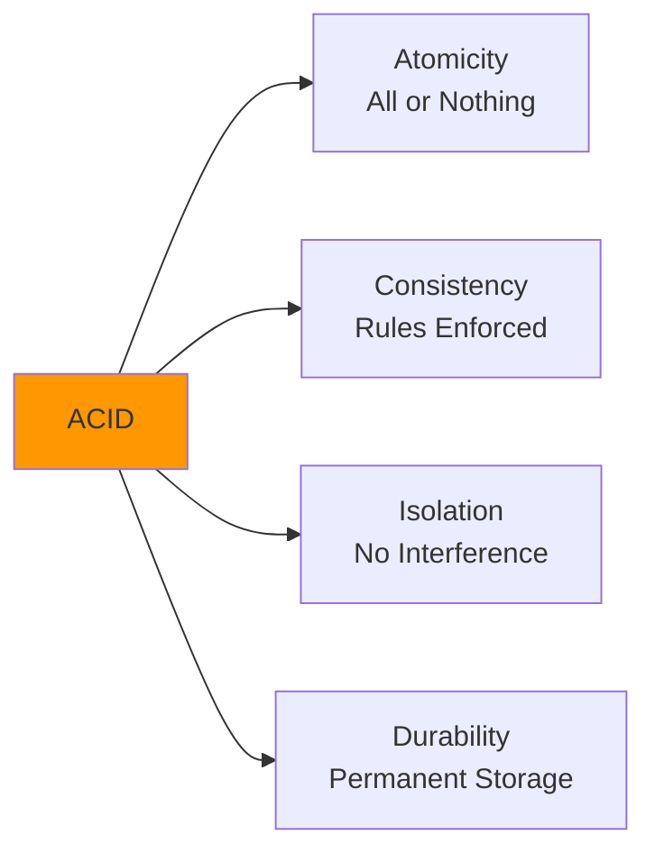
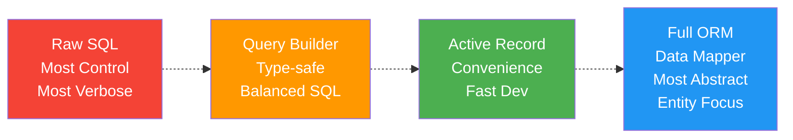

# Week 07: Schema Patterns, TCL, DCL & ORM

Schema Design, Data Integrity, Transactions & Access Control

---

## Agenda

- Schema patterns & data integrity
  - Soft-delete patterns
  - Versioning & history tracking
  - Referential actions (CASCADE, RESTRICT, SET NULL)
  - Scalability basics
- Functions, procedures & triggers
  - CREATE FUNCTION, parameters, return types
  - Stored procedures & control flow
  - Triggers: BEFORE/AFTER, use cases
- Transactions & access control
  - TCL: BEGIN, COMMIT, ROLLBACK, SAVEPOINT
  - ACID properties & isolation levels
  - DCL: GRANT, REVOKE, roles
- ORMs & query builders
  - Drizzle ORM: schema, queries, migrations
  - SQL injection prevention

---

## Part 1: Schema Patterns

Data Integrity, Soft Deletes, Versioning & Referential Actions

---

## The Problem with Hard Deletes

When you delete a row with `DELETE FROM`, it's gone forever.

```sql
DELETE FROM users WHERE user_id = 42;
-- User is permanently removed!
```

**Problems:**

- ❌ Audit trail lost
- ❌ Foreign key issues (orphaned records)
- ❌ No recovery from accidental deletion
- ❌ Historical reports become inaccurate

---

## Soft Delete Pattern

Mark rows as deleted instead of removing them.

```sql
CREATE TABLE users (
    user_id SERIAL PRIMARY KEY,
    email VARCHAR(255) NOT NULL UNIQUE,
    name VARCHAR(100) NOT NULL,
    created_at TIMESTAMP DEFAULT CURRENT_TIMESTAMP,
    deleted_at TIMESTAMP DEFAULT NULL
);

-- "Delete" a user (soft delete)
UPDATE users
SET deleted_at = CURRENT_TIMESTAMP
WHERE user_id = 42;

-- Query only active users
SELECT * FROM users WHERE deleted_at IS NULL;

-- Restore a deleted user
UPDATE users SET deleted_at = NULL WHERE user_id = 42;
```

---

## Soft Delete: Boolean Flag Alternative

```sql
ALTER TABLE users ADD COLUMN is_deleted BOOLEAN DEFAULT FALSE;

-- Delete
UPDATE users SET is_deleted = TRUE WHERE user_id = 42;

-- Query active
SELECT * FROM users WHERE is_deleted = FALSE;
-- or
SELECT * FROM users WHERE NOT is_deleted;
```

**Timestamp vs Boolean:**

- ✅ Timestamp: Know **when** it was deleted
- ✅ Boolean: Simpler, uses less space

---

## Soft Delete: Status Column Pattern

```sql
ALTER TABLE users ADD COLUMN status VARCHAR(20) DEFAULT 'active';

-- Possible statuses: 'active', 'suspended', 'deleted', 'archived'
UPDATE users SET status = 'deleted' WHERE user_id = 42;

-- Query by status
SELECT * FROM users WHERE status = 'active';
SELECT * FROM users WHERE status IN ('active', 'suspended');
```

**Benefit:** More granular states than binary deleted/active.

---

## Soft Delete: Unique Constraint Problem

```sql
-- Problem: Can't reuse email after soft delete
CREATE TABLE users (
    user_id SERIAL PRIMARY KEY,
    email VARCHAR(255) NOT NULL UNIQUE,  -- Problem!
    deleted_at TIMESTAMP DEFAULT NULL
);

-- Alice deletes her account
UPDATE users SET deleted_at = NOW() WHERE email = 'alice@example.com';

-- Alice tries to re-register with same email
INSERT INTO users (email, name) VALUES ('alice@example.com', 'Alice');
-- ERROR: duplicate key value violates unique constraint
```

---

## Solution: Partial Unique Index

Only enforce uniqueness on active records.

```sql
-- Remove the UNIQUE constraint
ALTER TABLE users DROP CONSTRAINT users_email_key;

-- Create partial unique index
CREATE UNIQUE INDEX idx_users_email_unique_active
ON users(email) WHERE deleted_at IS NULL;

-- Now this works:
UPDATE users SET deleted_at = NOW() WHERE email = 'alice@example.com';
INSERT INTO users (email, name) VALUES ('alice@example.com', 'Alice');
-- Success! ✓
```

---

## Creating a View for Active Records

```sql
-- View that only shows active users
CREATE VIEW active_users AS
SELECT user_id, email, name, created_at
FROM users
WHERE deleted_at IS NULL;

-- Query the view instead of the table
SELECT * FROM active_users;
SELECT * FROM active_users WHERE name LIKE 'A%';
```

**Benefit:** Simplifies queries, centralizes soft-delete logic.

---

## Optimizing Soft Delete Queries

```sql
-- Index only active records
CREATE INDEX idx_users_active
ON users(email) WHERE deleted_at IS NULL;

-- Index for queries on deleted records (if needed)
CREATE INDEX idx_users_deleted_at
ON users(deleted_at) WHERE deleted_at IS NOT NULL;
```

**Performance tip:** Partial indexes are smaller and faster than full indexes.

---

## Row Versioning (Optimistic Locking)

Prevent concurrent updates from overwriting each other.

```sql
CREATE TABLE products (
    product_id SERIAL PRIMARY KEY,
    name VARCHAR(200) NOT NULL,
    price DECIMAL(10, 2) NOT NULL,
    version INT NOT NULL DEFAULT 1,
    updated_at TIMESTAMP DEFAULT CURRENT_TIMESTAMP
);

-- Update with version check
UPDATE products
SET name = 'New Name',
    price = 29.99,
    version = version + 1,
    updated_at = CURRENT_TIMESTAMP
WHERE product_id = 101 AND version = 3;

-- If 0 rows affected → someone else updated first (conflict!)
```

---

## Optimistic Locking: Application Pattern

```typescript
// Read current state
const product = await db.query('SELECT * FROM products WHERE product_id = $1', [id]);

// User makes changes...

// Update with version check
const result = await db.query(
  `
    UPDATE products 
    SET name = $1, price = $2, version = version + 1
    WHERE product_id = $3 AND version = $4
`,
  [newName, newPrice, id, product.version],
);

if (result.rowCount === 0) {
  throw new Error('Conflict: Product was modified by another user');
}
```

---

## History Table Pattern

Keep complete history of all changes.

```sql
-- Current state table
CREATE TABLE products (
    product_id SERIAL PRIMARY KEY,
    name VARCHAR(200) NOT NULL,
    price DECIMAL(10, 2) NOT NULL,
    updated_at TIMESTAMP DEFAULT CURRENT_TIMESTAMP
);

-- History table
CREATE TABLE products_history (
    history_id SERIAL PRIMARY KEY,
    product_id INT NOT NULL,
    name VARCHAR(200) NOT NULL,
    price DECIMAL(10, 2) NOT NULL,
    changed_at TIMESTAMP DEFAULT CURRENT_TIMESTAMP,
    changed_by VARCHAR(100),
    operation VARCHAR(10) NOT NULL  -- 'INSERT', 'UPDATE', 'DELETE'
);
```

---

## History Table: Trigger Implementation

```sql
CREATE OR REPLACE FUNCTION log_product_changes()
RETURNS TRIGGER AS $$
BEGIN
    IF TG_OP = 'DELETE' THEN
        INSERT INTO products_history (product_id, name, price, changed_by, operation)
        VALUES (OLD.product_id, OLD.name, OLD.price, current_user, 'DELETE');
        RETURN OLD;
    ELSIF TG_OP = 'UPDATE' THEN
        INSERT INTO products_history (product_id, name, price, changed_by, operation)
        VALUES (OLD.product_id, OLD.name, OLD.price, current_user, 'UPDATE');
        RETURN NEW;
    ELSIF TG_OP = 'INSERT' THEN
        INSERT INTO products_history (product_id, name, price, changed_by, operation)
        VALUES (NEW.product_id, NEW.name, NEW.price, current_user, 'INSERT');
        RETURN NEW;
    END IF;
END;
$$ LANGUAGE plpgsql;

CREATE TRIGGER trg_products_history
AFTER INSERT OR UPDATE OR DELETE ON products
FOR EACH ROW EXECUTE FUNCTION log_product_changes();
```

---

## Temporal Tables (Valid Time)

Track when data was valid in the real world (not just when it was recorded).

```sql
CREATE TABLE employee_salaries (
    employee_id INT NOT NULL,
    salary DECIMAL(10, 2) NOT NULL,
    valid_from DATE NOT NULL,
    valid_to DATE,  -- NULL means currently valid
    PRIMARY KEY (employee_id, valid_from)
);

-- Insert salary history
INSERT INTO employee_salaries VALUES
(1, 50000, '2024-01-01', '2024-12-31'),
(1, 55000, '2025-01-01', '2025-12-31'),
(1, 60000, '2026-01-01', NULL);
```

---

## Querying Temporal Data

```sql
-- Get current salary
SELECT salary FROM employee_salaries
WHERE employee_id = 1 AND valid_to IS NULL;

-- Get salary at a specific date
SELECT salary FROM employee_salaries
WHERE employee_id = 1
  AND valid_from <= '2025-06-15'
  AND (valid_to IS NULL OR valid_to >= '2025-06-15');

-- Get salary history
SELECT valid_from, valid_to, salary
FROM employee_salaries
WHERE employee_id = 1
ORDER BY valid_from;
```

---

## Checksum Pattern

Use checksums to detect data corruption or tampering.

```sql
CREATE TABLE financial_transactions (
    transaction_id SERIAL PRIMARY KEY,
    account_id INT NOT NULL,
    amount DECIMAL(12, 2) NOT NULL,
    transaction_date TIMESTAMP DEFAULT CURRENT_TIMESTAMP,
    description TEXT,
    checksum VARCHAR(64) NOT NULL
);

-- Requires pgcrypto extension
CREATE EXTENSION IF NOT EXISTS pgcrypto;
```

---

## Inserting with Checksum

```sql
-- Insert with checksum
INSERT INTO financial_transactions (account_id, amount, description, checksum)
VALUES (
    1001,
    500.00,
    'Payment received',
    encode(digest(
        1001::TEXT || 500.00::TEXT || 'Payment received',
        'sha256'
    ), 'hex')
);

-- Verify integrity
SELECT *,
    CASE WHEN checksum = encode(digest(
        account_id::TEXT || amount::TEXT || description,
        'sha256'
    ), 'hex')
    THEN 'VALID' ELSE 'CORRUPTED' END AS integrity_status
FROM financial_transactions;
```

---

## Referential Actions

What happens to child records when a parent is updated or deleted?

```sql
CREATE TABLE departments (
    dept_id SERIAL PRIMARY KEY,
    name VARCHAR(100) NOT NULL
);

CREATE TABLE employees (
    emp_id SERIAL PRIMARY KEY,
    name VARCHAR(100) NOT NULL,
    dept_id INT REFERENCES departments(dept_id)
    -- What happens when we delete a department?
);
```

---

## ON DELETE NO ACTION (Default)

Prevents deletion if child records exist.

```sql
CREATE TABLE employees (
    emp_id SERIAL PRIMARY KEY,
    name VARCHAR(100),
    dept_id INT REFERENCES departments(dept_id) ON DELETE NO ACTION
);

-- Sample data
INSERT INTO departments VALUES (1, 'Engineering'), (2, 'Marketing');
INSERT INTO employees VALUES (1, 'Alice', 1), (2, 'Bob', 1);

-- Attempting to delete a referenced department:
DELETE FROM departments WHERE dept_id = 1;
-- ERROR: update or delete on table "departments" violates
-- foreign key constraint
```

---

## ON DELETE RESTRICT

Similar to NO ACTION, but check is immediate.

```sql
CREATE TABLE employees (
    emp_id SERIAL PRIMARY KEY,
    name VARCHAR(100),
    dept_id INT REFERENCES departments(dept_id) ON DELETE RESTRICT
);
```

**NO ACTION vs RESTRICT:** In PostgreSQL, practically the same unless using deferred constraints.

---

## ON DELETE CASCADE

Automatically deletes child records when parent is deleted.

```sql
CREATE TABLE employees (
    emp_id SERIAL PRIMARY KEY,
    name VARCHAR(100),
    dept_id INT REFERENCES departments(dept_id) ON DELETE CASCADE
);

-- Delete department
DELETE FROM departments WHERE dept_id = 1;
-- Employees Alice and Bob are automatically deleted ✓
```

**⚠️ Warning:** Cascading deletes can be destructive. Use carefully!

---

## CASCADE Use Cases

```sql
-- Order → Order Items (delete order, delete its items)
CREATE TABLE order_items (
    item_id SERIAL PRIMARY KEY,
    order_id INT REFERENCES orders(order_id) ON DELETE CASCADE,
    product_id INT,
    quantity INT
);

-- Post → Comments (delete post, delete its comments)
CREATE TABLE comments (
    comment_id SERIAL PRIMARY KEY,
    post_id INT REFERENCES posts(post_id) ON DELETE CASCADE,
    content TEXT
);

-- User → User Settings (delete user, delete their settings)
CREATE TABLE user_settings (
    user_id INT PRIMARY KEY REFERENCES users(user_id) ON DELETE CASCADE,
    theme VARCHAR(20),
    notifications BOOLEAN
);
```

---

## ON DELETE SET NULL

Sets foreign key to NULL when parent is deleted.

```sql
CREATE TABLE employees (
    emp_id SERIAL PRIMARY KEY,
    name VARCHAR(100),
    dept_id INT REFERENCES departments(dept_id) ON DELETE SET NULL
);

-- Delete department
DELETE FROM departments WHERE dept_id = 1;
-- Alice and Bob now have dept_id = NULL ✓
```

**Requirement:** The FK column must allow NULL values.

**Use case:** Product → Category (delete category, products become uncategorized).

---

## ON DELETE SET DEFAULT

Sets foreign key to its DEFAULT value when parent is deleted.

```sql
CREATE TABLE employees (
    emp_id SERIAL PRIMARY KEY,
    name VARCHAR(100),
    dept_id INT DEFAULT 0 REFERENCES departments(dept_id) ON DELETE SET DEFAULT
);

-- Requires a default department to exist
INSERT INTO departments VALUES (0, 'Unassigned');

-- Delete department
DELETE FROM departments WHERE dept_id = 1;
-- Alice and Bob now have dept_id = 0 (Unassigned) ✓
```

---

## ON UPDATE Actions

Same actions available for updates to the parent's primary key.

```sql
CREATE TABLE employees (
    emp_id SERIAL PRIMARY KEY,
    name VARCHAR(100),
    dept_id INT REFERENCES departments(dept_id)
        ON DELETE CASCADE    -- Delete items when order deleted
        ON UPDATE CASCADE    -- Update FK if order_id changes
);

-- Update department ID
UPDATE departments SET dept_id = 100 WHERE dept_id = 1;
-- All employee dept_ids automatically updated to 100 ✓
```

---

## Referential Actions Comparison

| Action      | ON DELETE Behavior  | ON UPDATE Behavior  | Use When               |
| ----------- | ------------------- | ------------------- | ---------------------- |
| NO ACTION   | Prevent             | Prevent             | Default, safest        |
| RESTRICT    | Prevent (immediate) | Prevent (immediate) | Similar to NO ACTION   |
| CASCADE     | Delete children     | Update children     | Parent-child lifecycle |
| SET NULL    | Set FK to NULL      | Set FK to NULL      | Optional relationships |
| SET DEFAULT | Set FK to default   | Set FK to default   | Fallback category      |

---

## Combining Referential Actions

```sql
CREATE TABLE order_items (
    item_id SERIAL PRIMARY KEY,
    order_id INT REFERENCES orders(order_id)
        ON DELETE CASCADE,    -- Delete items with order
    product_id INT REFERENCES products(product_id)
        ON DELETE RESTRICT    -- Can't delete product if in orders
);
```

**Design principle:** Think about the business logic and data lifecycle.

---

## Scalability Basics

Handling increased load as applications grow.

---

## Why Scale?

| Challenge               | Symptoms                      |
| ----------------------- | ----------------------------- |
| Read-heavy load         | Slow queries, high CPU        |
| Write-heavy load        | Lock contention, slow inserts |
| Large data volume       | Slow queries, disk full       |
| High availability       | Downtime not acceptable       |
| Geographic distribution | High latency for remote users |

---

## Vertical Scaling (Scale Up)

Add more resources to a single server.

```
┌───────────────────┐
│   More CPU cores  │
│   More RAM        │  Single Server
│   Faster SSDs     │
│   Better network  │
└───────────────────┘
```

**Pros:**

- ✅ Simple to implement
- ✅ No application changes
- ✅ No distributed complexity

**Cons:**

- ❌ Hardware limits
- ❌ Single point of failure
- ❌ Expensive at high end

---

## Horizontal Scaling (Scale Out)

Add more servers and distribute load.

```
┌──────────┐  ┌──────────┐  ┌──────────┐
│ Server 1 │  │ Server 2 │  │ Server 3 │
└──────────┘  └──────────┘  └──────────┘
    Multiple Servers
```

**Pros:**

- ✅ Nearly unlimited scaling
- ✅ Better fault tolerance
- ✅ Can use commodity hardware

**Cons:**

- ❌ Application complexity
- ❌ Distributed system challenges
- ❌ Consistency trade-offs

---

## Replication: Primary-Replica

Copy data from one database server to others.



- **Primary** handles all writes
- **Replicas** receive copies of changes
- **Replicas** can handle read queries

---

## What is WAL (Write-Ahead Log)?

**WAL** is PostgreSQL's transaction log that ensures durability and enables replication.

**How it works:**

1. Changes are written to WAL **first** (sequential, fast)
2. COMMIT acknowledged once WAL is on disk
3. Actual data files updated later (asynchronously)



Guarantees durability (ACID) + enables crash recovery + powers replication

---

## Replication Benefits

**Read Scaling:**

```sql
-- Application routes:
-- Writes → Primary
INSERT INTO orders (customer_id, total) VALUES (1, 99.99);

-- Reads → Replicas (load balanced)
SELECT * FROM orders WHERE customer_id = 1;
SELECT * FROM products WHERE category = 'electronics';
```

**High Availability:**

- If primary fails, promote a replica to primary
- Minimal downtime

**Backup & Analytics:**

- Run heavy queries on replicas
- Don't impact primary server performance

---

## Replication Configuration Example

**On Primary:**

```sql
-- postgresql.conf
wal_level = replica
max_wal_senders = 3

-- Create replication user
CREATE ROLE replicator WITH REPLICATION LOGIN PASSWORD 'rep_pass';
```

**On Replica:**

```conf
# recovery.conf (or postgresql.auto.conf)
primary_conninfo = 'host=primary_ip port=5432 user=replicator password=rep_pass'
primary_slot_name = 'replica_1'
```

---

## Database Sharding (Brief Overview)

Split data across multiple databases.



**Sharding strategies:**

- Range-based (A-M, N-Z)
- Hash-based (hash(user_id) % num_shards)
- Geographic (US, EU, Asia)

**⚠️ Complex:** Cross-shard queries, joins, transactions are difficult.

---

## Schema Patterns: Key Takeaways

- **Soft delete** with `deleted_at` preserves audit trail
- Use **partial unique indexes** for soft-delete constraints
- **Row versioning** prevents concurrent update conflicts
- **History tables** capture all changes for audit
- **CASCADE** deletes children automatically (use carefully!)
- **SET NULL** for optional relationships
- **Replication** scales reads and improves availability
- **Sharding** for massive horizontal scale (but adds complexity)

---

## Part 2: Functions, Procedures & Triggers

Stored Logic in PostgreSQL

---

## Why Stored Logic?

**Benefits:**

- ✅ Reduce network round-trips
- ✅ Centralize business logic
- ✅ Consistent execution across apps
- ✅ Leverage database features

**Trade-offs:**

- ❌ Harder to test
- ❌ Harder to version control
- ❌ Less portable across databases
- ❌ Harder to debug

---

## Creating a Simple Function

```sql
-- Function that calculates order total
CREATE FUNCTION calculate_order_total(p_order_id INT)
RETURNS DECIMAL(12, 2)
LANGUAGE SQL
AS $$
    SELECT COALESCE(SUM(quantity * unit_price), 0)
    FROM order_items
    WHERE order_id = p_order_id;
$$;

-- Using the function
SELECT calculate_order_total(1);

SELECT
    order_id,
    calculate_order_total(order_id) AS total
FROM orders;
```

---

## Function Syntax

```sql
CREATE [OR REPLACE] FUNCTION function_name(parameter_list)
RETURNS return_type
LANGUAGE language_name
AS $$
    -- function body
$$;
```

**Languages:**

- `SQL` - Pure SQL statements
- `plpgsql` - Procedural (variables, control flow)
- `python`, `javascript` - With extensions

---

## Function Parameters

```sql
-- Multiple parameters with defaults
CREATE FUNCTION format_price(
    amount DECIMAL,
    currency VARCHAR DEFAULT 'USD',
    decimals INT DEFAULT 2
)
RETURNS VARCHAR
LANGUAGE SQL
AS $$
    SELECT currency || ' ' || ROUND(amount, decimals)::TEXT;
$$;

-- Calling with different arguments
SELECT format_price(99.99);                    -- 'USD 99.99'
SELECT format_price(99.99, 'EUR');             -- 'EUR 99.99'
SELECT format_price(99.99, 'JPY', 0);          -- 'JPY 100'
```

---

## Return Types: Scalar

```sql
-- Return a single value
CREATE FUNCTION get_user_email(p_user_id INT)
RETURNS VARCHAR
LANGUAGE SQL
AS $$
    SELECT email FROM users WHERE user_id = p_user_id;
$$;

-- Usage
SELECT get_user_email(1);  -- Returns: 'alice@example.com'
```

---

## Return Types: Table

```sql
-- Return a set of rows
CREATE FUNCTION get_active_users()
RETURNS TABLE(user_id INT, email VARCHAR, name VARCHAR)
LANGUAGE SQL
AS $$
    SELECT user_id, email, name
    FROM users
    WHERE deleted_at IS NULL;
$$;

-- Using table-returning function
SELECT * FROM get_active_users();
SELECT * FROM get_active_users() WHERE name LIKE 'A%';
```

---

## PL/pgSQL Functions

PostgreSQL's procedural language with variables and control flow.

```sql
CREATE OR REPLACE FUNCTION get_customer_status(p_customer_id INT)
RETURNS VARCHAR
LANGUAGE plpgsql
AS $$
DECLARE
    v_order_count INT;
    v_total_spent DECIMAL;
BEGIN
    -- Get customer statistics
    SELECT COUNT(*), COALESCE(SUM(total), 0)
    INTO v_order_count, v_total_spent
    FROM orders
    WHERE customer_id = p_customer_id;

    -- Determine status
    IF v_total_spent >= 10000 THEN
        RETURN 'platinum';
    ELSIF v_total_spent >= 5000 THEN
        RETURN 'gold';
    ELSIF v_total_spent >= 1000 THEN
        RETURN 'silver';
    ELSIF v_order_count > 0 THEN
        RETURN 'bronze';
    ELSE
        RETURN 'new';
    END IF;
END;
$$;
```

---

## PL/pgSQL: Variables and Loops

```sql
CREATE OR REPLACE FUNCTION process_order(p_order_id INT)
RETURNS BOOLEAN
LANGUAGE plpgsql
AS $$
DECLARE
    v_item RECORD;
    v_total DECIMAL := 0;
    v_item_count INT := 0;
BEGIN
    -- Loop through order items
    FOR v_item IN
        SELECT product_id, quantity, unit_price
        FROM order_items
        WHERE order_id = p_order_id
    LOOP
        v_total := v_total + (v_item.quantity * v_item.unit_price);
        v_item_count := v_item_count + 1;

        -- Update product stock
        UPDATE products
        SET stock_quantity = stock_quantity - v_item.quantity
        WHERE product_id = v_item.product_id;
    END LOOP;

    IF v_item_count = 0 THEN
        RAISE EXCEPTION 'Order % has no items', p_order_id;
    END IF;

    -- Update order total
    UPDATE orders
    SET total = v_total, status = 'processed'
    WHERE order_id = p_order_id;

    RETURN TRUE;
END;
$$;
```

---

## PL/pgSQL: Exception Handling

```sql
CREATE OR REPLACE FUNCTION safe_divide(a DECIMAL, b DECIMAL)
RETURNS DECIMAL
LANGUAGE plpgsql
AS $$
BEGIN
    RETURN a / b;
EXCEPTION
    WHEN division_by_zero THEN
        RETURN NULL;
    WHEN OTHERS THEN
        RAISE NOTICE 'Error: %', SQLERRM;
        RETURN NULL;
END;
$$;

-- Usage
SELECT safe_divide(10, 2);   -- Returns: 5
SELECT safe_divide(10, 0);   -- Returns: NULL (no error)
```

---

## Raising Exceptions

```sql
CREATE OR REPLACE FUNCTION withdraw(p_account_id INT, p_amount DECIMAL)
RETURNS DECIMAL
LANGUAGE plpgsql
AS $$
DECLARE
    v_balance DECIMAL;
BEGIN
    SELECT balance INTO v_balance
    FROM accounts WHERE account_id = p_account_id;

    IF v_balance IS NULL THEN
        RAISE EXCEPTION 'Account % not found', p_account_id;
    END IF;

    IF p_amount <= 0 THEN
        RAISE EXCEPTION 'Amount must be positive';
    END IF;

    IF p_amount > v_balance THEN
        RAISE EXCEPTION 'Insufficient funds: balance=%, requested=%',
            v_balance, p_amount;
    END IF;

    UPDATE accounts SET balance = balance - p_amount
    WHERE account_id = p_account_id
    RETURNING balance INTO v_balance;

    RETURN v_balance;
END;
$$;
```

---

## Stored Procedures

Procedures differ from functions:

| Feature           | Function      | Procedure             |
| ----------------- | ------------- | --------------------- |
| **Return value**  | Required      | None (use OUT params) |
| **Transactions**  | Cannot manage | Can COMMIT/ROLLBACK   |
| **Called with**   | SELECT        | CALL                  |
| **Use in SELECT** | ✓ Yes         | ✗ No                  |

---

## Creating a Procedure

```sql
CREATE OR REPLACE PROCEDURE transfer_funds(
    p_from_account INT,
    p_to_account INT,
    p_amount DECIMAL
)
LANGUAGE plpgsql
AS $$
DECLARE
    v_from_balance DECIMAL;
BEGIN
    -- Check source balance
    SELECT balance INTO v_from_balance
    FROM accounts WHERE account_id = p_from_account;

    IF v_from_balance < p_amount THEN
        RAISE EXCEPTION 'Insufficient funds';
    END IF;

    -- Debit source
    UPDATE accounts SET balance = balance - p_amount
    WHERE account_id = p_from_account;

    -- Credit destination
    UPDATE accounts SET balance = balance + p_amount
    WHERE account_id = p_to_account;

    COMMIT;  -- Can commit within procedure
END;
$$;

-- Calling a procedure
CALL transfer_funds(1, 2, 500.00);
```

---

## Procedures with OUT Parameters

```sql
CREATE OR REPLACE PROCEDURE get_account_info(
    p_account_id INT,
    OUT p_balance DECIMAL,
    OUT p_status VARCHAR
)
LANGUAGE plpgsql
AS $$
BEGIN
    SELECT balance, status
    INTO p_balance, p_status
    FROM accounts
    WHERE account_id = p_account_id;
END;
$$;

-- Calling and getting output
CALL get_account_info(1, NULL, NULL);
-- Returns: p_balance, p_status
```

---

## Triggers

Automatically execute functions in response to table events.

```sql
CREATE TRIGGER trigger_name
{BEFORE | AFTER} {INSERT | UPDATE | DELETE}
ON table_name
[FOR EACH ROW]
EXECUTE FUNCTION trigger_function();
```

**Types:**

- **BEFORE** - Run before the operation (can modify data)
- **AFTER** - Run after the operation (can't modify data)
- **FOR EACH ROW** - Run once per affected row
- **FOR EACH STATEMENT** - Run once per statement

---

## Trigger Example: Update Timestamp

```sql
-- Trigger function
CREATE OR REPLACE FUNCTION update_timestamp()
RETURNS TRIGGER AS $$
BEGIN
    NEW.updated_at = CURRENT_TIMESTAMP;
    RETURN NEW;
END;
$$ LANGUAGE plpgsql;

-- Attach trigger
CREATE TRIGGER trg_products_updated
BEFORE UPDATE ON products
FOR EACH ROW
EXECUTE FUNCTION update_timestamp();

-- Now any update automatically sets updated_at
UPDATE products SET price = 29.99 WHERE product_id = 1;
-- updated_at is automatically set ✓
```

---

## Trigger Example: Audit Log

```sql
CREATE TABLE audit_log (
    log_id SERIAL PRIMARY KEY,
    table_name VARCHAR(50),
    operation VARCHAR(10),
    old_data JSONB,
    new_data JSONB,
    changed_by VARCHAR(100),
    changed_at TIMESTAMP DEFAULT CURRENT_TIMESTAMP
);

CREATE OR REPLACE FUNCTION log_changes()
RETURNS TRIGGER AS $$
BEGIN
    INSERT INTO audit_log (table_name, operation, old_data, new_data, changed_by)
    VALUES (
        TG_TABLE_NAME,
        TG_OP,
        CASE WHEN TG_OP = 'DELETE' THEN row_to_json(OLD) ELSE NULL END,
        CASE WHEN TG_OP IN ('INSERT', 'UPDATE') THEN row_to_json(NEW) ELSE NULL END,
        current_user
    );

    IF TG_OP = 'DELETE' THEN
        RETURN OLD;
    ELSE
        RETURN NEW;
    END IF;
END;
$$ LANGUAGE plpgsql;
```

---

## Trigger Example: Validate Data

```sql
CREATE OR REPLACE FUNCTION validate_order()
RETURNS TRIGGER AS $$
BEGIN
    -- Check total is positive
    IF NEW.total < 0 THEN
        RAISE EXCEPTION 'Order total cannot be negative';
    END IF;

    -- Check customer exists
    IF NOT EXISTS (SELECT 1 FROM customers WHERE customer_id = NEW.customer_id) THEN
        RAISE EXCEPTION 'Customer % does not exist', NEW.customer_id;
    END IF;

    RETURN NEW;
END;
$$ LANGUAGE plpgsql;

CREATE TRIGGER trg_validate_order
BEFORE INSERT OR UPDATE ON orders
FOR EACH ROW
EXECUTE FUNCTION validate_order();
```

---

## Trigger Special Variables

| Variable        | Description                             |
| --------------- | --------------------------------------- |
| `NEW`           | New row for INSERT/UPDATE               |
| `OLD`           | Old row for UPDATE/DELETE               |
| `TG_OP`         | Operation: 'INSERT', 'UPDATE', 'DELETE' |
| `TG_TABLE_NAME` | Name of the table                       |
| `TG_WHEN`       | 'BEFORE' or 'AFTER'                     |
| `current_user`  | Current database user                   |

---

## Dropping Functions, Procedures, Triggers

```sql
-- Drop function (specify parameter types)
DROP FUNCTION calculate_order_total(INT);
DROP FUNCTION IF EXISTS format_price(DECIMAL, VARCHAR, INT);

-- Drop procedure
DROP PROCEDURE transfer_funds(INT, INT, DECIMAL);

-- Drop trigger (from table)
DROP TRIGGER trg_products_updated ON products;
DROP TRIGGER IF EXISTS trg_validate_order ON orders;
```

---

## Functions, Procedures & Triggers: Best Practices

1. **Use functions** for reusable calculations and queries
2. **Use procedures** for transaction management and batch operations
3. **Use triggers** sparingly - they can make debugging hard
4. **Name conventions:** `calc_`, `get_`, `update_` for functions; `trg_` for triggers
5. **Always include** error handling in PL/pgSQL
6. **Document** complex logic with comments
7. **Test thoroughly** - triggers can have unintended consequences

---

## Part 3: Transactions & Access Control

TCL, ACID Properties, Isolation Levels & DCL

---

## What is a Transaction?

A **transaction** is a sequence of operations performed as a single logical unit.

**Rule:** Either ALL operations succeed, or NONE of them do.

```sql
-- Transfer $500 from Account A to Account B
UPDATE accounts SET balance = balance - 500 WHERE account_id = 'A';
UPDATE accounts SET balance = balance + 500 WHERE account_id = 'B';
```

**Problem without transaction:** System crashes between statements → money disappears!

---

## Transaction Control Language (TCL)

Commands to manage transactions:

| Command       | Purpose                |
| ------------- | ---------------------- |
| `BEGIN`       | Start a transaction    |
| `COMMIT`      | Save all changes       |
| `ROLLBACK`    | Undo all changes       |
| `SAVEPOINT`   | Create a checkpoint    |
| `ROLLBACK TO` | Rollback to checkpoint |

---

## BEGIN Transaction

Start a new transaction:

```sql
BEGIN;
-- or
BEGIN TRANSACTION;
-- or
START TRANSACTION;

-- All subsequent statements are part of this transaction
```

---

## COMMIT

Save all changes permanently:

```sql
BEGIN;

UPDATE accounts SET balance = balance - 500 WHERE account_id = 'A';
UPDATE accounts SET balance = balance + 500 WHERE account_id = 'B';

COMMIT;  -- Both updates are now permanent ✓
```

**After COMMIT:** Changes are persistent, even if server crashes.

---

## ROLLBACK

Undo all changes in the transaction:

```sql
BEGIN;

UPDATE accounts SET balance = balance - 500 WHERE account_id = 'A';

-- Oops, wrong amount!
ROLLBACK;  -- The update is undone ✓

-- Account A balance is unchanged
```

---

## Bank Transfer Example

```sql
BEGIN;

-- Debit source account
UPDATE accounts SET balance = balance - 500 WHERE account_id = 'A';

-- Check if source had enough funds
DO $$
DECLARE v_balance DECIMAL;
BEGIN
    SELECT balance INTO v_balance FROM accounts WHERE account_id = 'A';
    IF v_balance < 0 THEN
        RAISE EXCEPTION 'Insufficient funds';
    END IF;
END $$;

-- Credit destination account
UPDATE accounts SET balance = balance + 500 WHERE account_id = 'B';

COMMIT;
```

If **any** error occurs, PostgreSQL automatically rolls back.

---

## SAVEPOINT

Create checkpoints within a transaction for partial rollback:

```sql
BEGIN;

INSERT INTO orders (customer_id, total) VALUES (1, 100);
SAVEPOINT order_created;

INSERT INTO order_items (order_id, product_id, quantity) VALUES (1, 101, 2);
SAVEPOINT items_added;

-- Something goes wrong with payment
ROLLBACK TO SAVEPOINT order_created;

-- Order exists, but items removed
-- Add different items
INSERT INTO order_items (order_id, product_id, quantity) VALUES (1, 102, 1);

COMMIT;
```

---

## Savepoint Commands

```sql
SAVEPOINT savepoint_name;              -- Create savepoint
ROLLBACK TO SAVEPOINT savepoint_name;  -- Rollback to savepoint
RELEASE SAVEPOINT savepoint_name;      -- Remove savepoint (optional)
```

**Use case:** Complex multi-step operations where you might need to undo part of the work.

---

## ACID Properties

Transactions guarantee four critical properties:



---

## Atomicity

**"All or Nothing"**

Either all operations complete, or none do.

```sql
BEGIN;
UPDATE accounts SET balance = balance - 100 WHERE id = 1;  -- Succeeds
UPDATE accounts SET balance = balance + 100 WHERE id = 999;  -- Fails
COMMIT;
-- Result: BOTH updates are rolled back ✓
```

No partial state - the database is never left inconsistent.

---

## Consistency

**"Database Rules Always Enforced"**

All constraints, triggers, and rules are satisfied.

```sql
BEGIN;

-- This violates a CHECK constraint
UPDATE products SET price = -50 WHERE id = 1;

COMMIT;
-- Transaction fails; database remains consistent ✓
```

**Enforces:**

- CHECK constraints
- FOREIGN KEY constraints
- UNIQUE constraints
- Triggers and custom logic

---

## Isolation

**"Transactions Don't Interfere"**

Concurrent transactions see a consistent view, as if running sequentially.

```sql
-- Transaction 1                    -- Transaction 2
BEGIN;                              BEGIN;
SELECT balance FROM accounts;
-- Returns: 1000
                                    UPDATE accounts SET balance = 500;
                                    COMMIT;
SELECT balance FROM accounts;
-- What does this return?
-- (Depends on isolation level)
COMMIT;
```

---

## Durability

**"Committed = Permanent"**

Once committed, changes survive crashes, power failures, etc.

```sql
BEGIN;
INSERT INTO critical_data VALUES (...);
COMMIT;  -- Data is now safely on disk ✓

-- Even if server crashes NOW, data is safe
```

PostgreSQL writes to **Write-Ahead Log (WAL)** before acknowledging commit.

---

## Isolation Levels

Control how much transactions see of each other's uncommitted changes.

| Level            | Dirty Read | Non-Repeatable Read | Phantom Read | Performance |
| ---------------- | ---------- | ------------------- | ------------ | ----------- |
| Read Uncommitted | Yes\*      | Yes                 | Yes          | Fastest     |
| Read Committed   | No         | Yes                 | Yes          | Fast        |
| Repeatable Read  | No         | No                  | No\*\*       | Medium      |
| Serializable     | No         | No                  | No           | Slowest     |

\*PostgreSQL treats READ UNCOMMITTED as READ COMMITTED  
\*\*PostgreSQL's REPEATABLE READ prevents phantoms

---

## Read Uncommitted

Transactions can see uncommitted changes ("dirty reads").

```sql
SET TRANSACTION ISOLATION LEVEL READ UNCOMMITTED;
```

**⚠️ Note:** PostgreSQL doesn't truly support this; it's treated as READ COMMITTED.

**Problems:** Dirty reads, non-repeatable reads, phantom reads.

---

## Read Committed (PostgreSQL Default)

Only see committed changes. Each query sees a fresh snapshot.

```sql
SET TRANSACTION ISOLATION LEVEL READ COMMITTED;
-- or just BEGIN (this is the default)
```

**Example:**

```sql
-- Transaction 1                    -- Transaction 2
BEGIN;                              BEGIN;
SELECT price FROM products
WHERE id = 1;  -- Returns: 100
                                    UPDATE products SET price = 150
                                    WHERE id = 1;
                                    COMMIT;
SELECT price FROM products
WHERE id = 1;  -- Returns: 150
-- (Non-repeatable read)
COMMIT;
```

**Problems:** Non-repeatable reads, phantom reads.

---

## Repeatable Read

See a consistent snapshot from transaction start. Same query = same result.

```sql
SET TRANSACTION ISOLATION LEVEL REPEATABLE READ;
```

**Example:**

```sql
-- Transaction 1                    -- Transaction 2
BEGIN;                              BEGIN;
SET TRANSACTION ISOLATION LEVEL
REPEATABLE READ;
SELECT price FROM products
WHERE id = 1;  -- Returns: 100
                                    UPDATE products SET price = 150
                                    WHERE id = 1;
                                    COMMIT;
SELECT price FROM products
WHERE id = 1;  -- Still: 100 ✓
-- (Consistent snapshot)
COMMIT;
```

**PostgreSQL bonus:** Also prevents phantom reads.

---

## Serializable

Strongest isolation. Transactions behave as if executed one at a time.

```sql
SET TRANSACTION ISOLATION LEVEL SERIALIZABLE;
```

**Example:**

```sql
-- Transaction 1                    -- Transaction 2
BEGIN;                              BEGIN;
SET TRANSACTION ISOLATION LEVEL     SET TRANSACTION ISOLATION LEVEL
SERIALIZABLE;                       SERIALIZABLE;

SELECT SUM(balance) FROM accounts;  SELECT SUM(balance) FROM accounts;
-- Returns: 10000                   -- Returns: 10000

UPDATE accounts SET balance = 0     UPDATE accounts SET balance = 0
WHERE id = 1;                       WHERE id = 2;

COMMIT;                             COMMIT;
-- One will fail with serialization error ✓
```

---

## Choosing an Isolation Level

| Use Case                  | Recommended Level |
| ------------------------- | ----------------- |
| Web application (default) | READ COMMITTED    |
| Financial transactions    | SERIALIZABLE      |
| Reporting/analytics       | REPEATABLE READ   |
| High concurrency reads    | READ COMMITTED    |
| Data integrity critical   | SERIALIZABLE      |

**Trade-off:** Higher isolation = lower concurrency = slower performance.

---

## Access Control & DCL

Data Control Language: Managing permissions in PostgreSQL.

---

## Core Concepts

### Roles

In PostgreSQL, **users and roles are the same thing**.

- `CREATE USER` = `CREATE ROLE ... LOGIN`
- A role can log in (user) or just hold privileges (group role)

### Privileges

What actions a role can perform:

- SELECT, INSERT, UPDATE, DELETE on tables
- EXECUTE on functions
- USAGE on schemas
- CREATE on databases

---

## Creating Roles

```sql
-- Create a login role (user)
CREATE ROLE app_user LOGIN PASSWORD 'secure_password';

-- Or equivalently:
CREATE USER app_user WITH PASSWORD 'secure_password';

-- Create a group role (no login)
CREATE ROLE readonly;

-- Create a superuser
CREATE ROLE admin SUPERUSER LOGIN PASSWORD 'admin_pass';
```

---

## Role Attributes

```sql
CREATE ROLE developer WITH
    LOGIN                       -- Can log in
    PASSWORD 'dev_pass'         -- Login password
    CREATEDB                    -- Can create databases
    CREATEROLE                  -- Can create other roles
    VALID UNTIL '2027-12-31';   -- Password expiration
```

| Attribute          | Description                     |
| ------------------ | ------------------------------- |
| LOGIN / NOLOGIN    | Can/cannot log in               |
| SUPERUSER          | Has all privileges              |
| CREATEDB           | Can create databases            |
| CREATEROLE         | Can create other roles          |
| INHERIT            | Inherits privileges from groups |
| CONNECTION LIMIT n | Max concurrent connections      |

---

## Modifying Roles

```sql
-- Change password
ALTER ROLE app_user WITH PASSWORD 'new_password';

-- Add attribute
ALTER ROLE developer WITH CREATEDB;

-- Remove attribute
ALTER ROLE developer WITH NOCREATEDB;

-- Rename role
ALTER ROLE old_name RENAME TO new_name;
```

---

## GRANT: Table Privileges

```sql
-- Grant SELECT on a table
GRANT SELECT ON products TO app_user;

-- Grant multiple privileges
GRANT SELECT, INSERT, UPDATE ON orders TO app_user;

-- Grant all privileges
GRANT ALL PRIVILEGES ON customers TO admin_role;

-- Grant on all tables in schema
GRANT SELECT ON ALL TABLES IN SCHEMA public TO readonly_role;
```

---

## GRANT: Column-Level Privileges

```sql
-- Grant access to specific columns only
GRANT SELECT (id, name, email) ON users TO support_role;
GRANT UPDATE (email, phone) ON users TO support_role;

-- support_role can't see salary or SSN columns
```

**Use case:** Hide sensitive data from certain roles.

---

## GRANT: Schema Privileges

```sql
-- Allow role to access objects in schema
GRANT USAGE ON SCHEMA sales TO app_user;

-- Allow role to create objects in schema
GRANT CREATE ON SCHEMA sales TO developer;

-- Combined
GRANT USAGE, CREATE ON SCHEMA sales TO developer;
```

**⚠️ Important:** Must grant USAGE before accessing tables in schema.

---

## GRANT: Other Object Types

```sql
-- Database privileges
GRANT CONNECT ON DATABASE myapp TO app_user;

-- Sequence privileges (for SERIAL columns)
GRANT USAGE ON ALL SEQUENCES IN SCHEMA public TO app_user;

-- Function privileges
GRANT EXECUTE ON FUNCTION calculate_total(int) TO app_user;
```

---

## GRANT: WITH GRANT OPTION

Allow role to grant privileges to others:

```sql
GRANT SELECT ON products TO team_lead WITH GRANT OPTION;

-- team_lead can now do:
GRANT SELECT ON products TO developer;
```

**Use case:** Delegating permission management.

---

## REVOKE: Remove Privileges

```sql
-- Revoke SELECT privilege
REVOKE SELECT ON products FROM app_user;

-- Revoke multiple privileges
REVOKE INSERT, UPDATE, DELETE ON products FROM app_user;

-- Revoke all privileges
REVOKE ALL PRIVILEGES ON customers FROM old_employee;

-- Revoke on all tables
REVOKE SELECT ON ALL TABLES IN SCHEMA public FROM readonly_role;
```

---

## REVOKE with CASCADE

```sql
-- If user granted privileges to others, CASCADE removes those too
REVOKE SELECT ON products FROM team_lead CASCADE;

-- Without CASCADE, fails if team_lead granted to others
REVOKE SELECT ON products FROM team_lead;
-- ERROR: cannot revoke (if team_lead granted to others)
```

---

## Role Membership (Groups)

```sql
-- Create group roles
CREATE ROLE readonly;
CREATE ROLE readwrite;

GRANT SELECT ON ALL TABLES IN SCHEMA public TO readonly;
GRANT SELECT, INSERT, UPDATE, DELETE ON ALL TABLES IN SCHEMA public TO readwrite;

-- Add users to groups
GRANT readonly TO app_user_1;
GRANT readwrite TO app_user_2;

-- User inherits group privileges automatically ✓
```

---

## Checking Privileges

```sql
-- View table privileges
\dp products
-- or
SELECT * FROM information_schema.table_privileges WHERE table_name = 'products';

-- View current user's privileges
\du

-- Check if user has privilege
SELECT has_table_privilege('app_user', 'products', 'SELECT');
-- Returns: true or false
```

---

## Default Privileges

Set default privileges for future objects:

```sql
-- New tables created by developer will automatically grant SELECT to app_user
ALTER DEFAULT PRIVILEGES FOR ROLE developer
IN SCHEMA public
GRANT SELECT ON TABLES TO app_user;

-- New sequences
ALTER DEFAULT PRIVILEGES FOR ROLE developer
GRANT USAGE ON SEQUENCES TO app_user;
```

---

## Dropping Roles

```sql
-- Remove a role (must not own objects)
DROP ROLE app_user;

-- Transfer ownership first, then drop
REASSIGN OWNED BY old_user TO new_user;
DROP OWNED BY old_user;
DROP ROLE old_user;
```

---

## Access Control Best Practices

1. **Principle of least privilege** - Grant only what's needed
2. **Use group roles** - Easier to manage than individual privileges
3. **Separate roles** - Different roles for read-only, read-write, admin
4. **Application role** - Don't connect as superuser from apps
5. **Revoke public** - `REVOKE ALL ON SCHEMA public FROM PUBLIC;`
6. **Regular audits** - Review privileges periodically
7. **Column-level security** - Hide sensitive columns (SSN, salary)

---

## Part 4: ORMs & Query Builders

Drizzle ORM & SQL Injection Prevention

---

## The Abstraction Spectrum



---

## Raw SQL

Direct SQL strings sent to the database.

**Advantages:**

- ✅ Full control over queries
- ✅ No abstraction overhead
- ✅ Can use all database features

**Disadvantages:**

- ❌ Verbose for common operations
- ❌ Easy to introduce SQL injection
- ❌ No type checking

---

## Raw SQL Example (Node.js)

```typescript
import { Pool } from 'pg';

const pool = new Pool();

// Simple query
const result = await pool.query('SELECT * FROM users WHERE id = $1', [userId]);
const user = result.rows[0];

// Insert
await pool.query('INSERT INTO orders (customer_id, total) VALUES ($1, $2) RETURNING id', [customerId, total]);
```

**⚠️ Always use parameterized queries** ($1, $2) to prevent SQL injection!

---

## Query Builders

Generate SQL programmatically with type safety.

**Advantages:**

- ✅ Type-safe query construction
- ✅ Composable queries
- ✅ Protection from SQL injection
- ✅ Cross-database compatibility

**Disadvantages:**

- ❌ Learning curve
- ❌ Some complex queries are difficult
- ❌ Additional dependency

---

## Drizzle ORM

TypeScript ORM with SQL-like syntax and excellent type safety.

### Installation

```bash
npm install drizzle-orm pg
npm install -D drizzle-kit @types/pg
```

---

## Drizzle: Schema Definition

```typescript
// src/db/schema.ts
import { pgTable, serial, varchar, integer, timestamp, decimal } from 'drizzle-orm/pg-core';

export const users = pgTable('users', {
  id: serial('id').primaryKey(),
  email: varchar('email', { length: 255 }).notNull().unique(),
  name: varchar('name', { length: 100 }),
  createdAt: timestamp('created_at').defaultNow(),
});

export const orders = pgTable('orders', {
  id: serial('id').primaryKey(),
  customerId: integer('customer_id')
    .notNull()
    .references(() => users.id),
  total: decimal('total', { precision: 10, scale: 2 }).notNull(),
  status: varchar('status', { length: 20 }).default('pending'),
  createdAt: timestamp('created_at').defaultNow(),
});
```

---

## Drizzle: Database Connection

```typescript
// src/db/index.ts
import { drizzle } from 'drizzle-orm/node-postgres';
import { Pool } from 'pg';
import * as schema from './schema';

const pool = new Pool({
  connectionString: process.env.DATABASE_URL,
});

export const db = drizzle(pool, { schema });
```

---

## Drizzle: SELECT Queries

```typescript
import { db } from './db';
import { users, orders } from './db/schema';
import { eq, and, gt, like, desc } from 'drizzle-orm';

// Select all
const allUsers = await db.select().from(users);

// Select specific columns
const userEmails = await db
  .select({
    id: users.id,
    email: users.email,
  })
  .from(users);

// Where clause
const user = await db.select().from(users).where(eq(users.id, 1));

// Multiple conditions
const recentBigOrders = await db
  .select()
  .from(orders)
  .where(and(gt(orders.total, 100), gt(orders.createdAt, new Date('2024-01-01'))));
```

---

## Drizzle: INSERT, UPDATE, DELETE

```typescript
// INSERT - single
const newUser = await db
  .insert(users)
  .values({
    email: 'new@example.com',
    name: 'New User',
  })
  .returning();

// INSERT - multiple
await db.insert(orders).values([
  { customerId: 1, total: '99.99' },
  { customerId: 2, total: '149.99' },
]);

// UPDATE
await db.update(orders).set({ status: 'shipped' }).where(eq(orders.id, 1));

// DELETE
await db.delete(orders).where(eq(orders.status, 'cancelled'));
```

---

## Drizzle: Joins

```typescript
// Inner join
const ordersWithCustomers = await db
  .select({
    orderId: orders.id,
    orderTotal: orders.total,
    customerEmail: users.email,
    customerName: users.name,
  })
  .from(orders)
  .innerJoin(users, eq(orders.customerId, users.id));

// Left join
const usersWithOrders = await db.select().from(users).leftJoin(orders, eq(users.id, orders.customerId));
```

---

## Drizzle: Aggregations

```typescript
import { count, sum, avg } from 'drizzle-orm';

// Count
const userCount = await db
  .select({
    count: count(),
  })
  .from(users);

// Sum with grouping
const orderTotals = await db
  .select({
    customerId: orders.customerId,
    totalSpent: sum(orders.total),
  })
  .from(orders)
  .groupBy(orders.customerId);

// Average
const avgOrderValue = await db
  .select({
    average: avg(orders.total),
  })
  .from(orders);
```

---

## Drizzle: Transactions

```typescript
await db.transaction(async (tx) => {
  // All queries run in a transaction
  const [order] = await tx.insert(orders).values({ customerId: 1, total: '99.99' }).returning();

  await tx.insert(orderItems).values({
    orderId: order.id,
    productId: 101,
    quantity: 1,
    price: '99.99',
  });

  // If any query fails, all are rolled back ✓
});
```

---

## Drizzle: Raw SQL (Escape Hatch)

```typescript
import { sql } from 'drizzle-orm';

// Raw SQL with template literals (still parameterized!)
const result = await db.execute(sql`SELECT * FROM users WHERE email = ${email}`);

// Using raw SQL in select
const usersWithOrderCount = await db
  .select({
    id: users.id,
    email: users.email,
    orderCount: sql<number>`(SELECT COUNT(*) FROM orders WHERE customer_id = ${users.id})`,
  })
  .from(users);
```

**Note:** Even raw SQL in Drizzle is automatically parameterized!

---

## Drizzle: Migrations

```bash
# Generate migration from schema changes
npx drizzle-kit generate

# Apply migrations
npx drizzle-kit migrate

# Push schema directly (development only)
npx drizzle-kit push
```

**Migration files** are generated in `drizzle/` directory.

---

## Query Builders vs Full ORMs

| Feature             | Query Builder<br>(Drizzle) | Full ORM<br>(Prisma) |
| ------------------- | -------------------------- | -------------------- |
| Learning curve      | Lower                      | Higher               |
| SQL knowledge       | Yes                        | Less                 |
| Type safety         | Excellent                  | Excellent            |
| Performance control | High                       | Medium               |
| Complex queries     | Easier                     | Harder               |
| Relationships       | Manual joins               | Automatic            |
| Schema definition   | Code-first                 | Schema file          |

---

## Popular ORMs by Ecosystem

- **.NET:** Entity Framework Core — LINQ queries, migrations, change tracking
- **Java:** Hibernate (JPA) — industry standard ORM for enterprise apps
- **Python:** SQLAlchemy ORM, Django ORM — flexible vs batteries-included
- **Ruby:** ActiveRecord (Rails) — convention over configuration
- **PHP:** Laravel Eloquent — expressive, Active Record style
- **Go:** GORM — common choice with a fluent builder API
- **Node/TS:** Prisma, TypeORM, Sequelize — schema-first <--> decorator-based

---

## SQL Injection

**SQL injection** occurs when user input is incorporated into SQL without sanitization.

### The Attack

```javascript
// ⚠️ VULNERABLE CODE - DO NOT USE
const email = req.body.email;
// User input: "'; DROP TABLE users; --"

// This query becomes:
// SELECT * FROM users WHERE email = ''; DROP TABLE users; --'
const result = await pool.query(`SELECT * FROM users WHERE email = '${email}'`);
```

---

## Why SQL Injection is Dangerous

Attack examples:

```sql
-- Data theft
' OR '1'='1
-- Returns all rows

-- Data modification
'; UPDATE users SET role='admin' WHERE email='attacker@example.com'; --

-- Data deletion
'; DROP TABLE users; --

-- In some databases: execute system commands
'; EXEC xp_cmdshell('del *.*'); --
```

**Result:** Compromise of confidentiality, integrity, and availability.


---

## Prevention: Parameterized Queries

**ALWAYS use parameterized queries** (prepared statements):

```javascript
// ✅ SAFE: Using parameterized queries
const result = await pool.query(
  'SELECT * FROM users WHERE email = $1',
  [email], // Parameter passed separately
);
```

The database treats parameters as **data**, never as SQL code.

**Works with all input, including:**

- `'; DROP TABLE users; --` → treated as literal email address
- `' OR '1'='1` → no match found

---

## Query Builders Auto-Protect

Query builders automatically parameterize:

```typescript
// Drizzle - automatically safe ✓
const user = await db.select().from(users).where(eq(users.email, email));

// Even raw SQL with template literals is safe ✓
const result = await db.execute(sql`SELECT * FROM users WHERE email = ${email}`);
```

**Drizzle automatically parameterizes all values.**

---

## Common Injection Points

| Location      | ❌ Vulnerable            | ✅ Safe                       |
| ------------- | ------------------------ | ----------------------------- |
| WHERE clause  | `WHERE id = ${id}`       | `WHERE id = $1`, [id]         |
| INSERT values | `VALUES ('${name}')`     | `VALUES ($1)`, [name]         |
| ORDER BY      | `ORDER BY ${column}`     | Whitelist validation\*        |
| LIMIT         | `LIMIT ${count}`         | `LIMIT $1`, [parseInt(count)] |
| Table names   | `SELECT * FROM ${table}` | Whitelist validation\*        |

\*Column and table names **cannot** be parameterized - use strict whitelisting.

---

## Special Case: Dynamic Identifiers

Column and table names cannot be parameterized:

```typescript
// ❌ DANGEROUS - Don't do this
const column = req.query.sort; // User input: "id; DROP TABLE users; --"
const query = `SELECT * FROM products ORDER BY ${column}`;

// ✅ SAFE - Whitelist validation
const allowedColumns = ['id', 'name', 'price', 'created_at'];
const column = req.query.sort;

if (!allowedColumns.includes(column)) {
  throw new Error('Invalid sort column');
}

const query = `SELECT * FROM products ORDER BY ${column}`;
```

---

## SQL Injection Prevention Checklist

1. ✅ **Always use parameterized queries** for user input
2. ✅ **Use query builders** (Drizzle, Knex) that auto-parameterize
3. ✅ **Whitelist validation** for column/table names
4. ✅ **Validate and sanitize** input types (parseInt for numbers)
5. ✅ **Principle of least privilege** - app user shouldn't be superuser
6. ✅ **Prepared statements** in raw SQL
7. ✅ **Code review** for string concatenation in SQL
8. ❌ **Never concatenate** user input into SQL strings

---

## Week 07: Key Takeaways

**Schema Patterns:**

- Soft delete with `deleted_at` preserves audit trail
- Row versioning prevents concurrent update conflicts
- CASCADE, SET NULL, RESTRICT control referential actions
- Replication scales reads and improves availability

**Functions, Procedures & Triggers:**

- Functions return values, procedures manage transactions
- Triggers automate responses to data changes
- Use PL/pgSQL for complex logic with variables and control flow

---

## Week 07: Key Takeaways (cont'd)

**Transactions & TCL:**

- BEGIN, COMMIT, ROLLBACK manage atomic operations
- ACID properties guarantee data reliability
- Isolation levels balance consistency vs. performance
- Use REPEATABLE READ or SERIALIZABLE for critical operations

**Access Control & DCL:**

- GRANT/REVOKE control who can do what
- Use roles for easier privilege management
- Principle of least privilege - grant only what's needed
- Column-level security hides sensitive data

---

## Week 07: Key Takeaways (cont'd)

**ORMs & Query Builders:**

- Drizzle provides type-safe, SQL-like queries
- Query builders automatically prevent SQL injection
- Always use parameterized queries in raw SQL
- Whitelist validation for dynamic identifiers

**Security:**

- **Never concatenate user input into SQL**
- Use parameterized queries or query builders
- Grant minimal privileges to application users
- Regular security audits and code reviews

---

## Next Steps

**Assignment 7** (due 2026/03/01):

- ER diagram → DDL schema
- Implement functions and triggers
- Write queries using Drizzle ORM
- Demonstrate transaction handling

**Quiz 7** (2026/02/26):

- ER modeling and normalization
- Functions, procedures, triggers
- Transaction isolation levels
- Query builders and SQL injection prevention

---

## Resources

- [PostgreSQL Functions Documentation](https://www.postgresql.org/docs/current/sql-createfunction.html)
- [PostgreSQL Triggers Documentation](https://www.postgresql.org/docs/current/sql-createtrigger.html)
- [Transaction Isolation Levels](https://www.postgresql.org/docs/current/transaction-iso.html)
- [Drizzle ORM Documentation](https://orm.drizzle.team/)
- [OWASP SQL Injection Prevention](https://cheatsheetseries.owasp.org/cheatsheets/SQL_Injection_Prevention_Cheat_Sheet.html)
