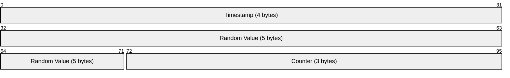
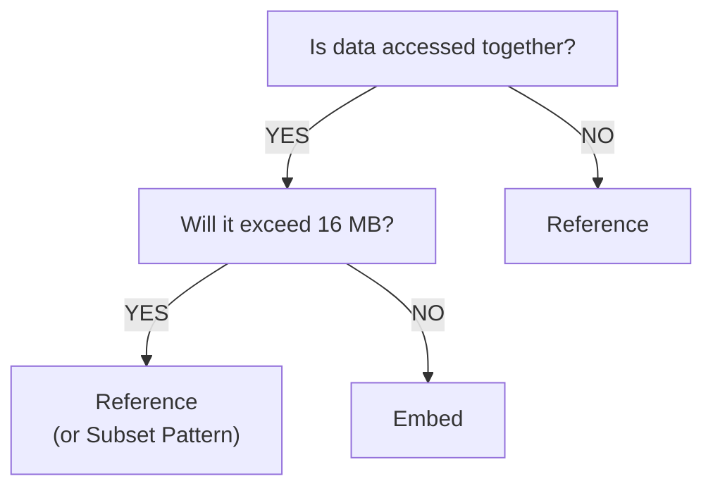
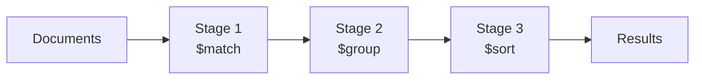
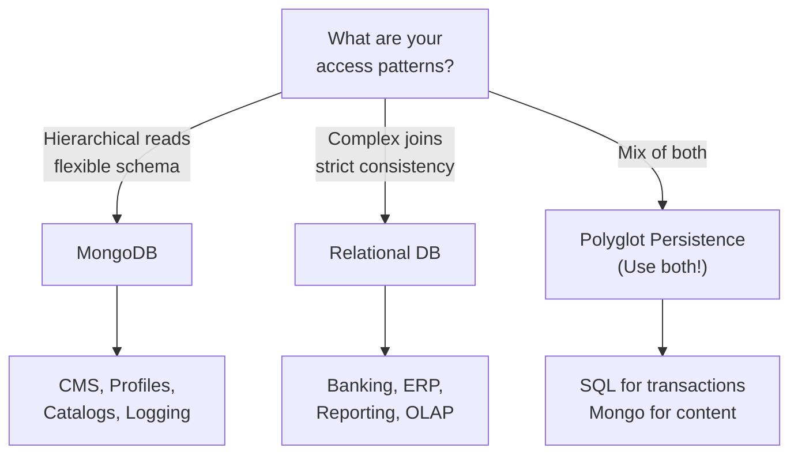

# Week 10: Document Databases — MongoDB

Fundamentals · Schema Design · CRUD · Aggregation Pipeline

---

## Agenda

- Introduction to Document Databases
- Document Model vs Relational Model
- JSON, BSON & ObjectId
- Schema Design Patterns
- CRUD Operations
- Aggregation Pipeline
- Drizzle ORM + MongoDB
- When (Not) to Use MongoDB

---

## Part 1: Introduction

What is MongoDB and Why Document Databases?

---

## What is MongoDB?

- **Document-oriented** NoSQL database
- Stores data as flexible, JSON-like **BSON** documents
- No rigid schema — fields can vary between documents
- Designed for **horizontal scalability**

💡 Think of it as a giant JSON store with powerful querying and indexing.

---

## Why MongoDB?

- **Schema flexibility** — rapid prototyping, evolving requirements
- **Hierarchical data** — user profiles, product catalogs
- **Horizontal scalability** — distributed systems, cloud-native
- **Developer productivity** — JSON-like syntax, minimal ORM overhead

---

## Terminology Mapping

| Relational  | MongoDB     |
| ----------- | ----------- |
| Database    | Database    |
| Table       | Collection  |
| Row         | Document    |
| Column      | Field       |
| Index       | Index       |
| JOIN        | `$lookup`   |
| Primary Key | `_id` field |

---

## Collections and Documents

In MongoDB:

- **Database** contains **Collections**
- **Collection** contains **Documents**

Collections are created **implicitly** when you insert:

```javascript
db.users.insertOne({ name: 'Alice', email: 'alice@example.com' });
// Collection "users" is automatically created
```

---

## Part 2: Document Model vs Relational

Side-by-Side Comparison

---

## Relational Approach

Split related data across **multiple tables**:

```sql
CREATE TABLE users (
    id SERIAL PRIMARY KEY,
    username VARCHAR(50),
    email VARCHAR(100)
);

CREATE TABLE posts (
    id SERIAL PRIMARY KEY,
    user_id INT REFERENCES users(id),
    title VARCHAR(200),
    content TEXT,
    created_at TIMESTAMP
);

CREATE TABLE comments (
    id SERIAL PRIMARY KEY,
    post_id INT REFERENCES posts(id),
    user_id INT REFERENCES users(id),
    text TEXT,
    created_at TIMESTAMP
);
```

---

## Relational Querying

Need **JOIN operations** to reassemble related data:

```sql
SELECT
    p.title,
    p.content,
    c.text   AS comment_text,
    u.username AS commenter
FROM posts p
LEFT JOIN comments c ON p.id = c.post_id
LEFT JOIN users   u ON c.user_id = u.id
WHERE p.id = 123;
```

---

## MongoDB Document Approach

**Embed** related data in a single document:

```json
{
  "_id": ObjectId("507f1f77bcf86cd799439011"),
  "title": "Introduction to MongoDB",
  "content": "MongoDB is a document database...",
  "author": {
    "username": "johndoe",
    "email": "john@example.com"
  },
  "comments": [
    {
      "user": "janedoe",
      "text": "Great article!",
      "created_at": ISODate("2026-03-15T10:30:00Z")
    },
    {
      "user": "bobsmith",
      "text": "Very helpful, thanks!",
      "created_at": ISODate("2026-03-15T11:45:00Z")
    }
  ],
  "tags": ["database", "nosql", "tutorial"],
  "created_at": ISODate("2026-03-14T09:00:00Z")
}
```

---

## Advantages & Trade-offs

**✅ Advantages:**

- **Single query** — no JOINs needed
- **Natural data structure** — mirrors application objects
- **Atomic operations** on the entire document
- **Flexible schema** — add fields without ALTER TABLE

**❌ Trade-offs:**

- **Data duplication** if referencing instead of embedding
- **16 MB document size limit**
- **Update anomalies** if embedded data must stay in sync

---

## Part 3: JSON, BSON & ObjectId

Data Formats and Primary Keys

---

## JSON (JavaScript Object Notation)

Human-readable text format:

```json
{
  "name": "Alice",
  "age": 30,
  "active": true,
  "tags": ["developer", "mongodb"]
}
```

Types: string, number, boolean, null, array, object

---

## BSON (Binary JSON)

MongoDB's binary-encoded serialization format:

- **More data types:** Date, Binary, ObjectId, Decimal128, Int32, Int64
- **Efficient storage:** binary is more compact than text
- **Faster traversal:** length-prefixed fields enable quick scanning

```javascript
{
  _id: ObjectId("507f191e810c19729de860ea"),     // ObjectId
  name: "Alice",                                  // String
  age: NumberInt(30),                             // 32-bit integer
  salary: NumberDecimal("75000.50"),              // Decimal128
  created_at: ISODate("2026-03-15T10:30:00Z"),   // Date
  avatar: BinData(0, "iVBORw0KGgo..."),          // Binary
  active: true                                    // Boolean
}
```

---

## JSON vs BSON Summary

| Feature        | JSON           | BSON            |
| -------------- | -------------- | --------------- |
| Format         | Text           | Binary          |
| Data types     | 6 basic types  | 20+ types       |
| Date support   | No (strings)   | ISODate         |
| Integer types  | Number only    | Int32, Int64    |
| Decimal        | Floating point | Decimal128      |
| Binary data    | Base64 string  | Native BinData  |
| Traversal      | Parse all text | Length-prefixed |
| Human readable | ✅ Yes         | ❌ No           |

---

## The `_id` Field

Every MongoDB document **must have** an `_id` field (primary key).

- Auto-generated as **ObjectId** if not provided
- Unique constraint — rejects duplicates

```javascript
{ "_id": ObjectId("507f1f77bcf86cd799439011") }
```

---

## ObjectId Structure (12 bytes)



- **Bytes 0–3:** Timestamp representing the ObjectId's creation, measured in seconds since the Unix epoch
- **Bytes 4–8:** Random value generated once per client-side process, unique to the machine and process. Re-generated on process restart or primary node change
- **Bytes 9–11:** Incrementing counter per client-side process, initialized to a random value. Resets when a process restarts

Properties:

- **Globally unique** — no coordination needed
- **Time-sortable** — first 4 bytes = creation timestamp
- 12 bytes → 24 hex characters

---

## Custom `_id` Values

You can use custom IDs instead of ObjectId:

```javascript
// String ID
{ "_id": "user-12345", "name": "Alice" }

// Integer ID
{ "_id": 42, "name": "Bob" }

// UUID
{ "_id": "550e8400-e29b-41d4-a716-446655440000",
  "name": "Charlie" }
```

⚠️ MongoDB rejects inserts if `_id` already exists.

---

## Part 4: Schema Design Patterns

Embedding vs Referencing & Common Patterns

---

## The Fundamental Question

### Embed or Reference?

The answer depends on your **access patterns**.

---

## Embedding (Denormalization)

Store related data **inside** the parent document:

```javascript
{
  "_id": ObjectId("..."),
  "title": "MongoDB Schema Design",
  "author": "Alice",
  "comments": [
    { "user": "Bob",     "text": "Great post!", "likes": 5 },
    { "user": "Charlie", "text": "Very helpful", "likes": 3 }
  ],
  "tags": ["database", "nosql"]
}
```

---

## Embedding: Pros & Cons

**✅ Pros:**

- Single query for all data
- Atomic updates
- Better read performance (no JOINs)
- Data locality

**❌ Cons:**

- 16 MB document limit
- Data duplication
- Hard to query embedded data independently
- Update anomalies

---

## When to Embed

- Data is **frequently accessed together**
- **One-to-few** relationships (not thousands)
- Embedded data **doesn't change often**
- You need **atomic operations** on the whole document

---

## Referencing (Normalization)

Store references to documents in **separate collections**:

```javascript
// Users collection
{ "_id": ObjectId("...user..."),
  "username": "alice",
  "email": "alice@example.com" }

// Posts collection
{ "_id": ObjectId("...post..."),
  "title": "MongoDB Schema Design",
  "author_id": ObjectId("...user...") }

// Comments collection
{ "_id": ObjectId("...comment..."),
  "post_id": ObjectId("...post..."),
  "user_id": ObjectId("...user..."),
  "text": "Great post!" }
```

---

## Referencing: Pros & Cons

**✅ Pros:**

- No data duplication
- Smaller documents
- Easier updates (change once)
- Independent queries

**❌ Cons:**

- Multiple queries or `$lookup`
- No atomic ops across collections
- Slower reads

---

## When to Reference

- Data is **large** or **frequently updated**
- **One-to-many** or **many-to-many** relationships
- Need to **query referenced data independently**
- Embedded data would **exceed 16 MB**

---

## Pattern 1: One-to-Few → Embed

User addresses (most users have 1–3):

```javascript
{
  "_id": ObjectId("..."),
  "username": "alice",
  "addresses": [
    { "type": "home",  "street": "123 Main St",
      "city": "Boston",    "country": "USA" },
    { "type": "work",  "street": "456 Office Blvd",
      "city": "Cambridge", "country": "USA" }
  ]
}
```

---

## Pattern 2: One-to-Many → Reference

Posts & comments (posts can have **thousands** of comments):

```javascript
// Posts collection
{ "_id": ObjectId("post123"),
  "title": "My First Post",
  "author_id": ObjectId("user456") }

// Comments collection — each references the post
{ "_id": ObjectId("comment789"),
  "post_id": ObjectId("post123"),
  "user_id": ObjectId("user456"),
  "text": "Great post!" }
```

Query comments for a post:

```javascript
db.comments.find({ post_id: ObjectId('post123') });
```

---

## Pattern 3: One-to-Many → Embed References

User's favorite posts (bounded, not thousands):

```javascript
{
  "_id": ObjectId("user123"),
  "username": "alice",
  "favorite_posts": [
    ObjectId("post1"),
    ObjectId("post2"),
    ObjectId("post3")
  ]
}
```

Fetch posts using `$lookup`:

```javascript
db.users.aggregate([
  { $match: { _id: ObjectId('user123') } },
  {
    $lookup: {
      from: 'posts',
      localField: 'favorite_posts',
      foreignField: '_id',
      as: 'favorites',
    },
  },
]);
```

---

## Pattern 4: Many-to-Many → Two-Way Referencing

Students & Courses:

```javascript
// Students
{ "_id": ObjectId("student123"),
  "name": "Alice",
  "enrolled_courses": [ObjectId("course1"), ObjectId("course2")] }

// Courses
{ "_id": ObjectId("course1"),
  "title": "Databases",
  "enrolled_students": [ObjectId("student123"), ObjectId("student456")] }
```

⚠️ Must update **both** documents when the relationship changes.

---

## Pattern 5: Attribute Pattern (Polymorphic Data)

Product catalog with varying attributes:

```javascript
// Electronics
{ "name": "Laptop", "category": "electronics",
  "attributes": [
    { "k": "brand",     "v": "Dell" },
    { "k": "ram",       "v": "16GB" },
    { "k": "processor", "v": "Intel i7" }
  ] }

// Clothing
{ "name": "T-Shirt", "category": "clothing",
  "attributes": [
    { "k": "size",     "v": "M" },
    { "k": "color",    "v": "Blue" },
    { "k": "material", "v": "Cotton" }
  ] }
```

Index and query:

```javascript
db.products.createIndex({ 'attributes.k': 1, 'attributes.v': 1 });
db.products.find({
  attributes: { $elemMatch: { k: 'brand', v: 'Dell' } },
});
```

---

## Pattern 6: Bucket Pattern (Time-Series)

Group readings into buckets instead of one document per reading:

**❌ Bad:** One document per reading (millions of documents)

```javascript
{ "sensor_id": "temp-01", "temperature": 22.5,
  "timestamp": ISODate("...") }
```

**✅ Good:** Group by hour

```javascript
{ "sensor_id": "temp-01",
  "hour": ISODate("...T10:00:00Z"),
  "readings": [
    { "min": 0,  "temp": 22.5 },
    { "min": 5,  "temp": 22.7 },
    { "min": 10, "temp": 22.6 }
  ],
  "count": 12,
  "avg_temp": 22.6,
  "min_temp": 22.5,
  "max_temp": 22.8 }
```

Benefits: fewer documents, pre-computed aggregates, better write performance.

---

## Pattern 7: Subset Pattern (Large Arrays)

Embed only a **subset** — popular products may have thousands of reviews:

```javascript
// Product document — only top reviews embedded
{ "_id": ObjectId("product123"),
  "name": "iPhone",
  "top_reviews": [
    { "user": "alice", "rating": 5, "text": "...", "helpful": 150 },
    { "user": "bob",   "rating": 4, "text": "...", "helpful": 98 }
  ],
  "review_count": 10243,
  "avg_rating": 4.7 }

// Full reviews in separate collection
{ "_id": ObjectId("review456"),
  "product_id": ObjectId("product123"),
  "user": "alice", "rating": 5,
  "text": "Amazing product!", "helpful": 150 }
```

---

## Schema Design Decision Tree



💡 Most schemas use a **mix** of embedding and referencing.

---

## Schema Design Best Practices

1. Model data for your **queries**, not just entity relationships
2. **Embed** when you need atomicity
3. **Reference** when data grows unbounded
4. **Denormalize** for read performance (reads >> writes)
5. Use **indexes** on embedded fields & array elements
6. Monitor **document size** — stay well below 16 MB
7. Test with **realistic data volumes**

---

## Part 5: CRUD Operations

Create, Read, Update, Delete

---

## CRUD Overview

| Operation  | Methods                                       |
| ---------- | --------------------------------------------- |
| **C**reate | `insertOne()`, `insertMany()`                 |
| **R**ead   | `find()`, `findOne()`, `aggregate()`          |
| **U**pdate | `updateOne()`, `updateMany()`, `replaceOne()` |
| **D**elete | `deleteOne()`, `deleteMany()`                 |

---

## Create: `insertOne()`

```javascript
db.users.insertOne({
  username: "alice",
  email: "alice@example.com",
  age: 28,
  created_at: new Date()
})

// Result:
{
  acknowledged: true,
  insertedId: ObjectId("507f1f77bcf86cd799439011")
}
```

MongoDB auto-generates `_id` if not provided.

---

## Create: `insertMany()`

```javascript
db.users.insertMany([
  { username: "bob",     email: "bob@example.com",     age: 32 },
  { username: "charlie", email: "charlie@example.com", age: 25 },
  { username: "diana",   email: "diana@example.com",   age: 30 }
])

// Result:
{
  acknowledged: true,
  insertedIds: {
    '0': ObjectId("..."),
    '1': ObjectId("..."),
    '2': ObjectId("...")
  }
}

// Option: continue on error
db.users.insertMany(docs, { ordered: false })
```

---

## Read: `findOne()`

```javascript
// Find by _id
db.users.findOne({ _id: ObjectId("507f1f77bcf86cd799439011") })

// Find by field
db.users.findOne({ username: "alice" })

// Returns:
{
  _id: ObjectId("507f1f77bcf86cd799439011"),
  username: "alice",
  email: "alice@example.com",
  age: 28,
  created_at: ISODate("2026-03-15T10:00:00Z")
}
```

Returns `null` if no match found.

---

## Read: `find()`

```javascript
// Find all users
db.users.find();

// Find with filter
db.users.find({ age: { $gte: 30 } });

// Convert cursor to array
db.users.find({ age: { $gte: 30 } }).toArray();
```

`find()` returns a **cursor**, not an array.

---

## Comparison Operators

```javascript
// Equal to
db.users.find({ age: 28 }); // $eq implicit
db.users.find({ age: { $eq: 28 } }); // explicit

// Not equal
db.users.find({ age: { $ne: 28 } });

// Greater / Less than
db.users.find({ age: { $gt: 25 } });
db.users.find({ age: { $gte: 30 } });
db.users.find({ age: { $lt: 30 } });
db.users.find({ age: { $lte: 25 } });

// In / Not in array
db.users.find({ age: { $in: [25, 28, 32] } });
db.users.find({ age: { $nin: [25, 28] } });
```

---

## Logical Operators

```javascript
// $and — match ALL conditions
db.users.find({
  $and: [{ age: { $gte: 25 } }, { age: { $lte: 30 } }],
});
// Shorthand (implicit $and):
db.users.find({ age: { $gte: 25, $lte: 30 } });

// $or — match ANY condition
db.users.find({
  $or: [{ username: 'alice' }, { username: 'bob' }],
});

// $nor — match NEITHER
db.users.find({
  $nor: [{ age: { $lt: 20 } }, { age: { $gt: 40 } }],
});

// $not — negate
db.users.find({ age: { $not: { $gte: 30 } } });
```

---

## Element & String Operators

```javascript
// $exists — field exists?
db.users.find({ email: { $exists: true } });
db.users.find({ phone: { $exists: false } });

// $type — field has specific BSON type
db.users.find({ age: { $type: 'int' } });

// $regex — pattern matching
db.users.find({ username: { $regex: /^a/i } });
db.users.find({ email: { $regex: /@example\.com$/ } });
```

---

## Array Operators

```javascript
// $all — array contains ALL specified values
db.posts.find({ tags: { $all: ['mongodb', 'database'] } });

// $elemMatch — array element matches ALL conditions
db.users.find({
  scores: {
    $elemMatch: { subject: 'math', score: { $gte: 80 } },
  },
});

// $size — array has specific length
db.posts.find({ tags: { $size: 3 } });
```

---

## Projections

Select **specific fields** to return:

```javascript
// Include only username and email
db.users.find({ age: { $gte: 30 } }, { username: 1, email: 1, _id: 0 });
// → [{ username: "bob", email: "bob@example.com" }, ...]

// Exclude specific fields
db.users.find({}, { password: 0, ssn: 0 });
```

**Rules:**

- Cannot mix inclusion & exclusion (except `_id`)
- `_id` is included by default — exclude with `_id: 0`

---

## Sorting, Limiting & Pagination

```javascript
// Sort ascending / descending
db.users.find().sort({ age: 1 }); // 1 = ASC
db.users.find().sort({ age: -1 }); // -1 = DESC

// Sort by multiple fields
db.users.find().sort({ age: -1, username: 1 });

// Limit results
db.users.find().limit(5);

// Skip + Limit = Pagination
db.users.find().skip(10).limit(5); // page 3, 5/page

// Top 3 oldest users
db.users.find().sort({ age: -1 }).limit(3);

// Counting
db.users.countDocuments({ age: { $gte: 30 } });
```

---

## Update: `updateOne()`

```javascript
db.users.updateOne(
  { username: "alice" },         // Filter
  { $set: { age: 29 } }         // Update
)

// Result:
{
  acknowledged: true,
  matchedCount: 1,
  modifiedCount: 1
}
```

---

## Update: `updateMany()`

```javascript
// Increment age for all users >= 30
db.users.updateMany(
  { age: { $gte: 30 } },
  { $inc: { age: 1 } }
)

// Result:
{
  acknowledged: true,
  matchedCount: 2,
  modifiedCount: 2
}
```

---

## Field Update Operators

```javascript
// $set — set value (creates if missing)
db.users.updateOne({ username: 'alice' }, { $set: { email: 'new@example.com', last_login: new Date() } });

// $unset — remove field
db.users.updateOne({ username: 'alice' }, { $unset: { temp_field: '' } });

// $inc — increment numeric field
db.posts.updateOne({ _id: id }, { $inc: { likes: 1 } });
db.posts.updateOne({ _id: id }, { $inc: { likes: -5 } });

// $mul — multiply
db.products.updateOne({ _id: id }, { $mul: { price: 2 } });

// $rename — rename field
db.users.updateMany({}, { $rename: { username: 'user_name' } });
```

---

## Min, Max & CurrentDate

```javascript
// $min — update only if new value is SMALLER
db.users.updateOne({ username: 'alice' }, { $min: { age: 25 } });

// $max — update only if new value is LARGER
db.users.updateOne({ username: 'alice' }, { $max: { high_score: 100 } });

// $currentDate — set to current date
db.users.updateOne(
  { username: 'alice' },
  {
    $currentDate: {
      last_modified: true,
      last_access: { $type: 'timestamp' },
    },
  },
);
```

---

## Array Update Operators

```javascript
// $push — add element
db.posts.updateOne({ _id: id }, { $push: { tags: 'tutorial' } });

// $push + $each + $sort — add multiple, sort
db.posts.updateOne(
  { _id: id },
  {
    $push: { tags: { $each: ['beginner', 'advanced'], $sort: 1 } },
  },
);

// $addToSet — add only if NOT already present
db.posts.updateOne({ _id: id }, { $addToSet: { tags: 'mongodb' } });

// $pop — remove first (-1) or last (1)
db.posts.updateOne({ _id: id }, { $pop: { tags: 1 } });

// $pull — remove matching elements
db.posts.updateOne({ _id: id }, { $pull: { tags: 'outdated' } });

// $pullAll — remove multiple specific values
db.posts.updateOne({ _id: id }, { $pullAll: { tags: ['outdated', 'deprecated'] } });
```

---

## Positional Operators

```javascript
// $ — update FIRST matching array element
db.users.updateOne({ username: 'alice', 'scores.subject': 'math' }, { $inc: { 'scores.$.score': 5 } });

// $[] — update ALL array elements
db.users.updateOne({ username: 'alice' }, { $inc: { 'scores.$[].score': 10 } });

// $[identifier] — update filtered elements
db.users.updateOne({ username: 'alice' }, { $inc: { 'scores.$[elem].score': 5 } }, { arrayFilters: [{ 'elem.score': { $gte: 90 } }] });
```

---

## Upsert

Insert if not found, update if exists:

```javascript
db.users.updateOne({ username: 'newuser' }, { $set: { email: 'new@example.com', age: 22 } }, { upsert: true });

// If "newuser" exists → updated
// If "newuser" missing → inserted as new document
```

---

## Delete Operations

```javascript
// Delete first matching document
db.users.deleteOne({ username: 'alice' });

// Delete ALL matching documents
db.users.deleteMany({ age: { $lt: 18 } });

// Delete all documents (be careful!)
db.users.deleteMany({});
```

⚠️ `deleteMany({})` removes **everything** in the collection!

---

## CRUD Best Practices

- Use `insertMany()` for bulk inserts
- Use query operators (`$gte`, `$in`, `$regex`) for complex filters
- Use **projections** to limit returned fields
- Use `$set`, `$inc`, `$push` for **partial updates** — don't replace entire documents
- Use `$addToSet` to prevent array duplicates

---

## Part 6: Aggregation Pipeline

MongoDB's Powerful Data Analysis Framework

---

## What is the Aggregation Pipeline?

Processes documents through a series of **stages**, each transforming the data:



```javascript
db.collection.aggregate([{ stage1 }, { stage2 }, { stage3 }]);
```

---

## Common Pipeline Stages

| Stage              | Purpose                        |
| ------------------ | ------------------------------ |
| `$match`           | Filter documents (like `find`) |
| `$project`         | Select / transform fields      |
| `$group`           | Aggregate (like SQL GROUP BY)  |
| `$sort`            | Sort documents                 |
| `$limit` / `$skip` | Pagination                     |
| `$unwind`          | Deconstruct arrays             |
| `$lookup`          | Join collections (like JOIN)   |
| `$addFields`       | Add computed fields            |
| `$count`           | Count documents                |
| `$bucket`          | Group into ranges              |

---

## `$match` — Filter Documents

```javascript
// Sample data
db.orders.insertMany([
  { customer: 'Alice', amount: 100, status: 'completed' },
  { customer: 'Bob', amount: 200, status: 'pending' },
  { customer: 'Alice', amount: 150, status: 'completed' },
  { customer: 'Charlie', amount: 50, status: 'cancelled' },
]);

// Get only completed orders
db.orders.aggregate([{ $match: { status: 'completed' } }]);
// → [
//   { customer: "Alice", amount: 100, status: "completed" },
//   { customer: "Alice", amount: 150, status: "completed" }
// ]
```

💡 Place `$match` **early** to reduce documents processed by later stages.

---

## `$project` — Select & Transform

```javascript
// Select specific fields
db.orders.aggregate([{ $match: { status: 'completed' } }, { $project: { customer: 1, amount: 1, _id: 0 } }]);
// → [{ customer: "Alice", amount: 100 },
//    { customer: "Alice", amount: 150 }]

// Computed fields
db.orders.aggregate([
  {
    $project: {
      customer: 1,
      amount: 1,
      tax: { $multiply: ['$amount', 0.1] }, // 10% tax
      total: { $multiply: ['$amount', 1.1] },
    },
  },
]);
// → [{ customer: "Alice", amount: 100, tax: 10, total: 110 }, ...]
```

---

## `$group` — Aggregate Data

```javascript
// Total amount per customer
db.orders.aggregate([
  { $match: { status: 'completed' } },
  {
    $group: {
      _id: '$customer', // Group by customer
      total_spent: { $sum: '$amount' },
      order_count: { $sum: 1 },
    },
  },
]);
// → [{ _id: "Alice", total_spent: 250, order_count: 2 }]
```

---

## `$group` Accumulators

```javascript
db.orders.aggregate([
  {
    $group: {
      _id: '$customer',
      total: { $sum: '$amount' }, // Sum
      avg: { $avg: '$amount' }, // Average
      min: { $min: '$amount' }, // Minimum
      max: { $max: '$amount' }, // Maximum
      count: { $sum: 1 }, // Count
      first: { $first: '$amount' }, // First value
      last: { $last: '$amount' }, // Last value
      all: { $push: '$amount' }, // Collect into array
    },
  },
]);
```

---

## `$sort`, `$limit`, `$skip`

```javascript
// Sort by total (descending)
db.orders.aggregate([
  { $group: { _id: '$customer', total: { $sum: '$amount' } } },
  { $sort: { total: -1 } }, // 1 = ASC, -1 = DESC
]);

// Top 5 customers
db.orders.aggregate([{ $group: { _id: '$customer', total: { $sum: '$amount' } } }, { $sort: { total: -1 } }, { $limit: 5 }]);

// Page 2 (skip 5, take 5)
db.orders.aggregate([{ $group: { _id: '$customer', total: { $sum: '$amount' } } }, { $sort: { total: -1 } }, { $skip: 5 }, { $limit: 5 }]);
```

---

## `$unwind` — Deconstruct Arrays

```javascript
db.posts.insertOne({
  title: 'MongoDB Tutorial',
  tags: ['database', 'nosql', 'mongodb'],
});

db.posts.aggregate([{ $unwind: '$tags' }]);
// → [
//   { title: "MongoDB Tutorial", tags: "database" },
//   { title: "MongoDB Tutorial", tags: "nosql" },
//   { title: "MongoDB Tutorial", tags: "mongodb" }
// ]
```

---

## `$unwind` Use Case: Tag Counts

```javascript
db.posts.aggregate([{ $unwind: '$tags' }, { $group: { _id: '$tags', count: { $sum: 1 } } }, { $sort: { count: -1 } }]);
// → [
//   { _id: "mongodb",  count: 5 },
//   { _id: "database", count: 3 },
//   { _id: "nosql",    count: 2 }
// ]
```

---

## `$lookup` — Join Collections

```javascript
// Customers collection
db.customers.insertMany([
  { _id: 1, name: 'Alice', email: 'alice@example.com' },
  { _id: 2, name: 'Bob', email: 'bob@example.com' },
]);

// Orders collection
db.orders.insertMany([
  { customer_id: 1, amount: 100 },
  { customer_id: 1, amount: 150 },
  { customer_id: 2, amount: 200 },
]);

db.orders.aggregate([
  {
    $lookup: {
      from: 'customers',
      localField: 'customer_id',
      foreignField: '_id',
      as: 'customer_info',
    },
  },
]);
// Each order now has a "customer_info" array
```

---

## `$lookup` + Flatten with `$unwind`

```javascript
db.orders.aggregate([
  {
    $lookup: {
      from: 'customers',
      localField: 'customer_id',
      foreignField: '_id',
      as: 'customer_info',
    },
  },
  { $unwind: '$customer_info' },
  {
    $project: {
      amount: 1,
      customer_name: '$customer_info.name',
      customer_email: '$customer_info.email',
    },
  },
]);
// → [
//   { amount: 100, customer_name: "Alice", customer_email: "alice@..." },
//   { amount: 150, customer_name: "Alice", customer_email: "alice@..." },
//   { amount: 200, customer_name: "Bob",   customer_email: "bob@..." }
// ]
```

---

## `$addFields` & `$count`

```javascript
// $addFields — add computed fields (keeps existing)
db.orders.aggregate([
  {
    $addFields: {
      tax: { $multiply: ['$amount', 0.1] },
      total: { $multiply: ['$amount', 1.1] },
    },
  },
]);

// $count — count documents in pipeline
db.orders.aggregate([{ $match: { status: 'completed' } }, { $count: 'completed_orders' }]);
// → [{ completed_orders: 42 }]
```

---

## `$bucket` — Group into Ranges

```javascript
db.orders.aggregate([
  {
    $bucket: {
      groupBy: '$amount',
      boundaries: [0, 50, 100, 200, 500],
      default: 'Other',
      output: {
        count: { $sum: 1 },
        orders: { $push: '$amount' },
      },
    },
  },
]);
// → [
//   { _id: 0,   count: 5,  orders: [25, 30, 40] },
//   { _id: 50,  count: 10, orders: [55, 60, ...] },
//   { _id: 100, count: 8,  orders: [120, 150, ...] }
// ]
```

---

## Example: Sales Report Pipeline

```javascript
db.sales.aggregate([
  // 1. Calculate revenue per item
  {
    $addFields: {
      revenue: { $multiply: ['$price', '$quantity'] },
    },
  },
  // 2. Group by category
  {
    $group: {
      _id: '$category',
      total_revenue: { $sum: '$revenue' },
      items_sold: { $sum: '$quantity' },
      avg_price: { $avg: '$price' },
    },
  },
  // 3. Sort by revenue
  { $sort: { total_revenue: -1 } },
  // 4. Rename _id → category
  {
    $project: {
      _id: 0,
      category: '$_id',
      total_revenue: 1,
      items_sold: 1,
      avg_price: { $round: ['$avg_price', 2] },
    },
  },
]);
```

---

## Example: User Activity Analysis

```javascript
db.activities.aggregate([
  // Match last 7 days
  {
    $match: {
      timestamp: { $gte: ISODate('2026-03-08T00:00:00Z') },
    },
  },
  // Group by user
  {
    $group: {
      _id: '$user_id',
      total_actions: { $sum: 1 },
      actions: { $push: '$action' },
      first_seen: { $min: '$timestamp' },
      last_seen: { $max: '$timestamp' },
    },
  },
  // Count unique actions
  {
    $addFields: {
      unique_actions: {
        $size: { $setUnion: ['$actions', []] },
      },
    },
  },
  { $sort: { total_actions: -1 } },
]);
```

---

## Example: Nested Lookup

Find users with their posts and comments:

```javascript
db.users.aggregate([
  { $match: { username: 'alice' } },
  {
    $lookup: {
      from: 'posts',
      localField: '_id',
      foreignField: 'author_id',
      as: 'posts',
    },
  },
  {
    $lookup: {
      from: 'comments',
      localField: '_id',
      foreignField: 'user_id',
      as: 'comments',
    },
  },
  {
    $addFields: {
      post_count: { $size: '$posts' },
      comment_count: { $size: '$comments' },
    },
  },
  {
    $project: {
      username: 1,
      email: 1,
      post_count: 1,
      comment_count: 1,
      recent_posts: { $slice: ['$posts.title', 5] },
    },
  },
]);
```

---

## Pipeline Expressions: Arithmetic & String

**Arithmetic:**

```javascript
{
  $add: ['$price', '$tax'];
}
{
  $subtract: ['$total', '$discount'];
}
{
  $multiply: ['$price', '$quantity'];
}
{
  $divide: ['$total', '$count'];
}
{
  $mod: ['$value', 10];
}
```

**String:**

```javascript
{
  $concat: ['$firstName', ' ', '$lastName'];
}
{
  $toUpper: '$username';
}
{
  $toLower: '$email';
}
{
  $substr: ['$text', 0, 50];
}
{
  $split: ['$tags', ','];
}
```

---

## Pipeline Expressions: Date & Conditional

**Date:**

```javascript
{ $year: "$created_at" }
{ $month: "$created_at" }
{ $dayOfMonth: "$created_at" }
{ $hour: "$timestamp" }
{ $dateToString: { format: "%Y-%m-%d", date: "$created_at" } }
```

**Conditional:**

```javascript
// if-then-else
{ $cond: {
    if: { $gte: ["$age", 18] },
    then: "adult",
    else: "minor"
  }
}

// Switch case
{ $switch: {
    branches: [
      { case: { $lt: ["$score", 60] }, then: "F" },
      { case: { $lt: ["$score", 70] }, then: "D" },
      { case: { $lt: ["$score", 80] }, then: "C" },
      { case: { $lt: ["$score", 90] }, then: "B" }
    ],
    default: "A"
  }
}
```

---

## Aggregation Performance Tips

1. Use `$match` **early** to reduce documents
2. Create **indexes** on fields used in `$match` & `$sort`
3. Limit the number of stages (each has overhead)
4. Use `$project` to reduce document size early
5. Avoid `$lookup` when possible — denormalize
6. Use `explain()` to analyze performance:

```javascript
db.orders.aggregate([...]).explain("executionStats")
```

---

## Part 7: Drizzle ORM + MongoDB

Type-Safe MongoDB Queries in TypeScript

---

## What is Drizzle ORM?

- Lightweight **TypeScript ORM**
- Supports PostgreSQL, MySQL, SQLite, and **MongoDB**
- Type-safe queries & schema definitions
- Minimal footprint — thin layer over native driver

```bash
npm install drizzle-orm mongodb
npm install -D drizzle-kit
```

---

## Database Connection

```typescript
import { drizzle } from 'drizzle-orm/mongodb';
import { MongoClient } from 'mongodb';

const MONGO_URI = process.env.MONGO_URI || 'mongodb://localhost:27017/mydb';

const client = new MongoClient(MONGO_URI);
await client.connect();

const mongoDb = client.db('mydb');
export const db = drizzle(mongoDb);
```

With connection pooling:

```typescript
const client = new MongoClient(process.env.MONGO_URI!, {
  maxPoolSize: 10,
  minPoolSize: 2,
  maxIdleTimeMS: 30000,
});
```

---

## Schema Definition

```typescript
import { ObjectId } from 'mongodb';
import { mongoCollection } from 'drizzle-orm/mongodb';

export const users = mongoCollection('users', {
  _id: { type: 'ObjectId', default: () => new ObjectId() },
  username: { type: 'string', required: true },
  email: { type: 'string', required: true },
  age: { type: 'number' },
  created_at: { type: 'date', default: () => new Date() },
});

// Infer TypeScript types
export type User = typeof users.$inferSelect;
export type NewUser = typeof users.$inferInsert;
```

---

## Drizzle: Create

```typescript
// Insert single
const newUser = await db.insert(users).values({
  username: 'alice',
  email: 'alice@example.com',
  age: 28,
});
console.log(newUser.insertedId); // ObjectId

// Insert multiple
const result = await db.insert(users).values([
  { username: 'bob', email: 'bob@example.com', age: 32 },
  { username: 'charlie', email: 'charlie@example.com', age: 25 },
]);
console.log(result.insertedIds);
```

---

## Drizzle: Read

```typescript
import { eq, gte, and, lte, desc } from 'drizzle-orm';

// Find all
const allUsers = await db.select().from(users);

// Find with condition
const adults = await db.select().from(users).where(gte(users.age, 18));

// Multiple conditions
const result = await db
  .select()
  .from(users)
  .where(and(gte(users.age, 25), lte(users.age, 30)));

// Projection
const usernames = await db.select({ username: users.username, email: users.email }).from(users);

// Sort + limit + pagination
const topUsers = await db.select().from(users).orderBy(desc(users.age)).limit(10);

const page2 = await db.select().from(users).orderBy(desc(users.age)).offset(10).limit(10);
```

---

## Drizzle: Update & Delete

```typescript
import { eq, gte, lt } from 'drizzle-orm';

// Update
await db.update(users).set({ age: 29 }).where(eq(users.username, 'alice'));

// Update many
await db.update(users).set({ status: 'verified' }).where(gte(users.age, 30));

// Delete
await db.delete(users).where(eq(users.username, 'alice'));

// Delete many
await db.delete(users).where(lt(users.age, 18));
```

---

## Drizzle Query Operators

```typescript
import { eq, ne, gt, gte, lt, lte, and, or, not, inArray, notInArray, isNull, isNotNull } from 'drizzle-orm';

eq(users.age, 28); // age === 28
ne(users.age, 28); // age !== 28
gt(users.age, 25); // age > 25
gte(users.age, 25); // age >= 25

and(gte(users.age, 25), lte(users.age, 30));
or(eq(users.username, 'alice'), eq(users.username, 'bob'));

inArray(users.age, [25, 28, 32]);
isNull(users.email);
isNotNull(users.email);
```

---

## Part 8: When (Not) to Use MongoDB

Choosing the Right Tool

---

## ✅ Good Use Cases

- **Content Management Systems**
  - Articles, comments, tags stored together; flexible schema

- **User Profiles & Social Networks**
  - Nested preferences, settings, activity logs

- **Product Catalogs**
  - Varying attributes (electronics vs clothing)

- **Real-time Analytics & Logging**
  - Event logs with arbitrary metadata; time-series

- **Mobile / Gaming Applications**
  - Player profiles, inventory, achievements; offline sync

---

## ❌ Poor Use Cases

- **Complex Multi-Document Transactions**
  - Banking, double-entry accounting — need strict ACID

- **Many-to-Many Relationships**
  - Students ↔ classes — better with relational JOINs

- **Highly Normalized / OLAP Data**
  - Reporting across many entities; data warehouse

- **Ad-hoc Queries Joining 5+ Collections**
  - Complex analytical queries — SQL excels here

---

## MongoDB vs Relational: Decision Guide



---

## Docker Setup

Add MongoDB to your `docker-compose.yml`:

```yaml
services:
  mongodb:
    image: mongo:7
    container_name: mongodb
    ports:
      - '27017:27017'
    environment:
      MONGO_INITDB_ROOT_USERNAME: admin
      MONGO_INITDB_ROOT_PASSWORD: password
    volumes:
      - mongodb_data:/data/db

volumes:
  mongodb_data:
```

---

## Starting & Connecting

```bash
# Start MongoDB
docker-compose up -d mongodb

# Connect via MongoDB Shell
docker exec -it mongodb mongosh -u admin -p password

# Inside mongosh:
use mydb
db.users.insertOne({ name: "Alice", email: "alice@example.com" })
db.users.find()
```

---

## Collection Validation

```javascript
db.createCollection('users', {
  validator: {
    $jsonSchema: {
      bsonType: 'object',
      required: ['name', 'email'],
      properties: {
        name: { bsonType: 'string' },
        email: {
          bsonType: 'string',
          pattern: '^.+@.+$',
        },
      },
    },
  },
  validationLevel: 'strict',
});
```

---

## Indexing

```javascript
// Single field index
db.users.createIndex({ email: 1 }); // ascending
db.users.createIndex({ age: -1 }); // descending

// Compound index
db.orders.createIndex({ customer: 1, amount: -1 });

// Unique index
db.users.createIndex({ email: 1 }, { unique: true });

// Index on nested field
db.users.createIndex({ 'address.city': 1 });

// Index on array element
db.posts.createIndex({ 'comments.user': 1 });

// Text index (full-text search)
db.posts.createIndex({ title: 'text', content: 'text' });
```

---

## Indexing Best Practices

- Index fields used in `$match` and sort
- Compound indexes cover prefix queries
- Don't over-index — each index slows **writes**
- Use `explain()` to verify index usage

```javascript
// Check if query uses an index
db.users.find({ email: 'alice@example.com' }).explain('executionStats');

// List indexes
db.users.getIndexes();

// Drop an index
db.users.dropIndex({ email: 1 });
```

---

## Performance: Embedded vs Referenced

**Embedded (Fast):**

```javascript
// Single query — returns post with embedded comments
db.posts.findOne({ _id: ObjectId('...') });
```

**Referenced (Slower):**

```javascript
// Two queries
const post = db.posts.findOne({ _id: ObjectId('...') });
const comments = db.comments.find({ post_id: post._id }).toArray();
```

**Or use `$lookup` (JOIN):**

```javascript
db.posts.aggregate([
  { $match: { _id: ObjectId('...') } },
  {
    $lookup: {
      from: 'comments',
      localField: '_id',
      foreignField: 'post_id',
      as: 'comments',
    },
  },
]);
```

---

## Key Takeaways: Document Model

- **Documents** are JSON-like objects stored in collections
- **Schema-less** — fields can vary between documents
- **Embedded documents** for one-to-few relationships
- **References** (ObjectIds) for one-to-many & many-to-many

---

## Key Takeaways: BSON & ObjectId

- BSON extends JSON with **Date, ObjectId, Binary, Decimal128**
- ObjectId: 12 bytes = **timestamp + random + counter**
- Globally unique, time-sortable, no coordination needed
- **16 MB** document size limit

---

## Key Takeaways: Schema Design

- Model for your **queries**, not just entities
- **Embed** when data is accessed together & bounded
- **Reference** when data grows unbounded or changes often
- Patterns: **Attribute, Bucket, Subset**
- Most schemas use a **mix**

---

## Key Takeaways: CRUD

- `insertOne/Many` — auto-generates `_id`
- `find` — operators: `$gte`, `$in`, `$regex`, `$elemMatch`
- `updateOne/Many` — `$set`, `$inc`, `$push`, `$pull`
- Use **projections** and **partial updates**
- `$addToSet` prevents array duplicates

---

## Key Takeaways: Aggregation

- Sequence of transformation **stages**
- `$match` early → reduce documents
- `$group` with `$sum`, `$avg`, `$min`, `$max`
- `$lookup` for collection joins
- `$unwind` to deconstruct arrays
- **Expressions**: arithmetic, string, date, conditional

---

## Quiz 8 Preview

**Topics:**

- Document model vs relational model
- JSON vs BSON data types
- ObjectId structure
- Schema design (embedding vs referencing)
- When to choose MongoDB
- CRUD operations
- Update operators (`$set`, `$inc`, `$push`, `$addToSet`)
- Aggregation pipeline (`$match`, `$group`, `$lookup`)

**Format:** 12 multiple-choice questions · 45 minutes

---

## Sample Quiz Question 1

You're building a blog platform. Each post can have 0–100 comments.

**Which schema design approach is BEST?**

A. Store posts in one collection, comments in another (reference by post_id)
B. Embed all comments inside each post document
C. Single denormalized collection with duplicated user data
D. Three collections with foreign key references

**Answer: A** — Comments can grow; referencing enables independent queries and avoids 16 MB limit issues.

---

## Sample Quiz Question 2

What does this code do?

```javascript
db.orders.aggregate([
  { $match: { status: 'completed' } },
  {
    $group: {
      _id: '$customer',
      total: { $sum: '$amount' },
    },
  },
  { $sort: { total: -1 } },
  { $limit: 3 },
]);
```

**Answer:** Finds the **top 3 customers** by total spending on completed orders.

---

## Practical Exercises

**Exercise 1 — Schema Design:**

Design a MongoDB schema for a blog platform (users, posts, comments). Decide: embed or reference? How to handle 1000+ comments?

**Exercise 2 — CRUD Practice:**

1. Insert 5 users with different ages
2. Find all users older than 25
3. Update a user's email with `$set`
4. Add a tag with `$push`, remove with `$pull`
5. Delete all users with role "guest"

---

## Practical Exercises (cont'd)

**Exercise 3 — Aggregation:**

1. Calculate **total revenue** per product category
2. Find the **top 5 customers** by total spending
3. Count orders per **status**
4. Calculate **average order amount** per month
5. Join orders with customer info using `$lookup`

---

## Final Project Milestone

**Team Formation + Proposal** — Due: Sunday, March 22

1. Form a team (3–4 students)
2. Brainstorm ideas using **both SQL and NoSQL**
3. Write a 1–2 page proposal (description, database choices, timeline)

**Example ideas:**

- Social media platform (SQL for users, MongoDB for posts/comments)
- E-commerce site (SQL for orders, MongoDB for product reviews)
- Learning management system (SQL for courses, MongoDB for content)
- Real-time analytics dashboard (MongoDB for time-series, SQL for reports)

---

## Resources

- [MongoDB Manual](https://www.mongodb.com/docs/manual/)
- [MongoDB University](https://learn.mongodb.com/) — free courses
- [BSON Specification](https://bsonspec.org/)
- [MongoDB CRUD Reference](https://www.mongodb.com/docs/manual/crud/)
- [Aggregation Pipeline Docs](https://www.mongodb.com/docs/manual/core/aggregation-pipeline/)
- [MongoDB Playground](https://mongoplayground.net/) — online query tester
- [MongoDB Compass](https://www.mongodb.com/products/tools/compass) — GUI client
- [Visualeaf](https://demo.visualeaf.com/#/) — visual aggregation pipeline builder
- [Drizzle ORM Documentation](https://orm.drizzle.team/docs/overview)
- [Practical MongoDB Aggregations](https://www.practical-mongodb-aggregations.com/) — free book
- [MongoDB Docker Hub](https://hub.docker.com/_/mongo)

---

## Questions?

🍃

Next week: Graph Databases & Neo4j
