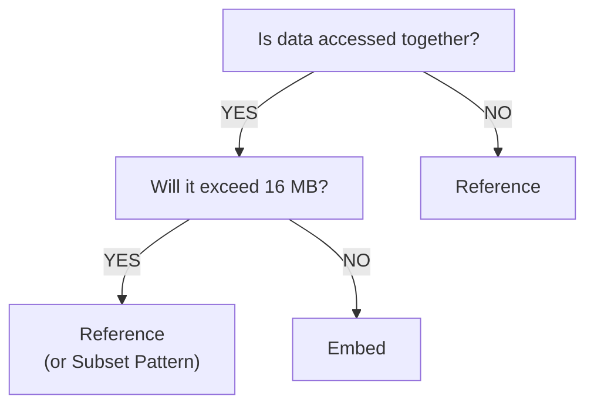

# MongoDB Schema Design Patterns

## Embedding vs Referencing

The fundamental decision in MongoDB schema design is whether to **embed** related data within a document or **reference** it in another collection.

### Embedding (Denormalization)

Store related data **inside** the parent document:

```javascript
// Blog post with embedded comments
{
  "_id": ObjectId("..."),
  "title": "MongoDB Schema Design",
  "author": "Alice",
  "content": "...",
  "comments": [
    {
      "user": "Bob",
      "text": "Great post!",
      "likes": 5,
      "created_at": ISODate("2026-03-15T10:00:00Z")
    },
    {
      "user": "Charlie",
      "text": "Very helpful",
      "likes": 3,
      "created_at": ISODate("2026-03-15T11:30:00Z")
    }
  ],
  "tags": ["database", "nosql"],
  "created_at": ISODate("2026-03-14T09:00:00Z")
}
```

**✅ Advantages:**

- **Single query** to fetch all data
- **Atomic updates** (update post and comments together)
- **Better read performance** (no JOINs)
- **Data locality** (related data stored together)

**❌ Disadvantages:**

- **Document size limit** (16MB max)
- **Data duplication** if same comment appears elsewhere
- **Difficult to query** embedded data independently
- **Update anomalies** if embedded data needs to stay consistent

**Use embedding when:**

- Data is **frequently accessed together**
- Embedded data has **one-to-few** relationships (not thousands)
- Embedded data **doesn't change often**
- You need **atomic operations** on the whole document

### Referencing (Normalization)

Store references to documents in **separate collections**:

```javascript
// Users collection
{
  "_id": ObjectId("507f1f77bcf86cd799439011"),
  "username": "alice",
  "email": "alice@example.com"
}

// Posts collection
{
  "_id": ObjectId("507f1f77bcf86cd799439012"),
  "title": "MongoDB Schema Design",
  "author_id": ObjectId("507f1f77bcf86cd799439011"),  // Reference to user
  "content": "...",
  "created_at": ISODate("2026-03-14T09:00:00Z")
}

// Comments collection
{
  "_id": ObjectId("507f1f77bcf86cd799439013"),
  "post_id": ObjectId("507f1f77bcf86cd799439012"),    // Reference to post
  "user_id": ObjectId("507f1f77bcf86cd799439011"),    // Reference to user
  "text": "Great post!",
  "created_at": ISODate("2026-03-15T10:00:00Z")
}
```

**✅ Advantages:**

- **No duplication** of user data
- **Smaller documents** (no size limit issues)
- **Easier updates** (change username once)
- **Independent queries** (get all comments by a user)

**❌ Disadvantages:**

- **Multiple queries** or `$lookup` (JOIN-like operation)
- **No atomic operations** across collections
- **Slower reads** (need to fetch referenced documents)

**Use referencing when:**

- Data is **large** or **frequently updated**
- Relationships are **one-to-many** or **many-to-many**
- You need to **query referenced data independently**
- Embedded data would **exceed 16MB limit**

## Common Schema Patterns

### 1. One-to-Few: Embed

**Example:** User addresses (most users have 1-3 addresses)

```javascript
{
  "_id": ObjectId("..."),
  "username": "alice",
  "email": "alice@example.com",
  "addresses": [
    {
      "type": "home",
      "street": "123 Main St",
      "city": "Boston",
      "country": "USA"
    },
    {
      "type": "work",
      "street": "456 Office Blvd",
      "city": "Cambridge",
      "country": "USA"
    }
  ]
}
```

### 2. One-to-Many: Reference from Many Side

**Example:** Blog posts and comments (posts can have thousands of comments)

```javascript
// Posts collection
{
  "_id": ObjectId("post123"),
  "title": "My First Post",
  "author_id": ObjectId("user456")
}

// Comments collection (each comment references the post)
{
  "_id": ObjectId("comment789"),
  "post_id": ObjectId("post123"),  // Reference
  "user_id": ObjectId("user456"),
  "text": "Great post!"
}
```

Query comments for a post:

```javascript
db.comments.find({ post_id: ObjectId("post123") })
```

### 3. One-to-Many: Embed Array of References

**Example:** User's favorite posts (user has many favorites, but not thousands)

```javascript
{
  "_id": ObjectId("user123"),
  "username": "alice",
  "favorite_posts": [
    ObjectId("post1"),
    ObjectId("post2"),
    ObjectId("post3")
  ]
}
```

Fetch posts using `$lookup`:

```javascript
db.users.aggregate([
  { $match: { _id: ObjectId("user123") } },
  { $lookup: {
      from: "posts",
      localField: "favorite_posts",
      foreignField: "_id",
      as: "favorites"
    }
  }
])
```

### 4. Many-to-Many: Two-Way Referencing

**Example:** Students and Courses

```javascript
// Students collection
{
  "_id": ObjectId("student123"),
  "name": "Alice",
  "enrolled_courses": [
    ObjectId("course1"),
    ObjectId("course2")
  ]
}

// Courses collection
{
  "_id": ObjectId("course1"),
  "title": "Databases",
  "enrolled_students": [
    ObjectId("student123"),
    ObjectId("student456")
  ]
}
```

**Advantage:** Can query in both directions
**Disadvantage:** Need to update **both** documents when relationship changes

### 5. Attribute Pattern (Polymorphic Data)

**Example:** Product catalog with varying attributes

```javascript
// Electronics product
{
  "_id": ObjectId("prod1"),
  "name": "Laptop",
  "category": "electronics",
  "attributes": [
    { "k": "brand", "v": "Dell" },
    { "k": "ram", "v": "16GB" },
    { "k": "processor", "v": "Intel i7" }
  ]
}

// Clothing product
{
  "_id": ObjectId("prod2"),
  "name": "T-Shirt",
  "category": "clothing",
  "attributes": [
    { "k": "size", "v": "M" },
    { "k": "color", "v": "Blue" },
    { "k": "material", "v": "Cotton" }
  ]
}
```

Create index on attributes:

```javascript
db.products.createIndex({ "attributes.k": 1, "attributes.v": 1 })
```

Query products by attribute:

```javascript
db.products.find({
  "attributes": { $elemMatch: { k: "brand", v: "Dell" } }
})
```

### 6. Bucket Pattern (Time-Series Data)

**Example:** IoT sensor readings

Instead of one document per reading:

```javascript
// ❌ Bad: One document per reading (millions of documents)
{
  "_id": ObjectId("..."),
  "sensor_id": "temp-sensor-01",
  "temperature": 22.5,
  "timestamp": ISODate("2026-03-15T10:00:00Z")
}
```

Use **bucketing** to group readings:

```javascript
// ✅ Good: Group readings by hour
{
  "_id": ObjectId("..."),
  "sensor_id": "temp-sensor-01",
  "hour": ISODate("2026-03-15T10:00:00Z"),
  "readings": [
    { "min": 0, "temp": 22.5 },
    { "min": 5, "temp": 22.7 },
    { "min": 10, "temp": 22.6 },
    // ... up to 60 readings per hour
  ],
  "count": 12,
  "avg_temp": 22.6,
  "min_temp": 22.5,
  "max_temp": 22.8
}
```

**Benefits:**

- **Fewer documents** (reduce index overhead)
- **Pre-computed aggregates** (avg, min, max)
- **Better write performance**

### 7. Subset Pattern (Large Arrays)

**Example:** Product reviews (popular products have thousands)

```javascript
// ❌ Bad: Embed all reviews (could exceed 16MB)
{
  "_id": ObjectId("product123"),
  "name": "iPhone",
  "reviews": [ /* 10,000+ reviews */ ]
}
```

```javascript
// ✅ Good: Embed only recent/top reviews
{
  "_id": ObjectId("product123"),
  "name": "iPhone",
  "top_reviews": [  // Only top 10 most helpful
    { "user": "alice", "rating": 5, "text": "...", "helpful": 150 },
    { "user": "bob", "rating": 4, "text": "...", "helpful": 98 }
  ],
  "review_count": 10243,
  "avg_rating": 4.7
}

// Full reviews in separate collection
// Reviews collection
{
  "_id": ObjectId("review456"),
  "product_id": ObjectId("product123"),
  "user": "alice",
  "rating": 5,
  "text": "Amazing product!",
  "helpful": 150
}
```

## Schema Design Decision Tree



## Performance Considerations

### Indexing Embedded Fields

```javascript
// Index on nested field
db.users.createIndex({ "address.city": 1 })

// Index on array element
db.posts.createIndex({ "comments.user": 1 })
```

### Query Performance

**Embedded (Fast):**

```javascript
// Single query
db.posts.findOne({ _id: ObjectId("...") })
// Returns post with embedded comments
```

**Referenced (Slower):**

```javascript
// Two queries needed
const post = db.posts.findOne({ _id: ObjectId("...") })
const comments = db.comments.find({ post_id: post._id }).toArray()
```

Or use `$lookup` (JOIN):

```javascript
db.posts.aggregate([
  { $match: { _id: ObjectId("...") } },
  { $lookup: {
      from: "comments",
      localField: "_id",
      foreignField: "post_id",
      as: "comments"
    }
  }
])
```

## Best Practices

1. **Model your data for your queries** (not just entity relationships)
2. **Embed when you need atomicity** (update post + comments together)
3. **Reference when data grows unbounded** (products with thousands of reviews)
4. **Denormalize for read performance** (duplicate data if reads >> writes)
5. **Use indexes wisely** (embedded fields, array elements)
6. **Monitor document size** (stay well below 16MB limit)
7. **Test with realistic data volumes** (schema that works for 100 docs may fail at 1M)

## Key Takeaways

- **Embedding** = fewer queries, atomic operations, but potential duplication
- **Referencing** = normalized data, flexible queries, but slower reads
- **Choose based on access patterns**, not just entity relationships
- **Most schemas use a mix** of embedding and referencing
- **Optimize for your most common queries**

---

**Next:** [MongoDB CRUD Operations](./mongodb-crud.md)
