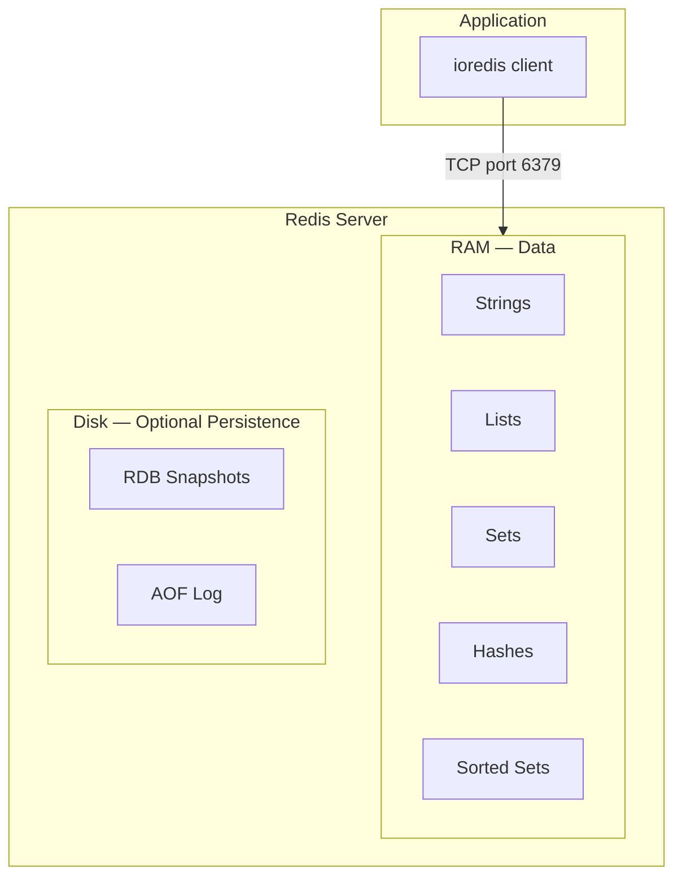
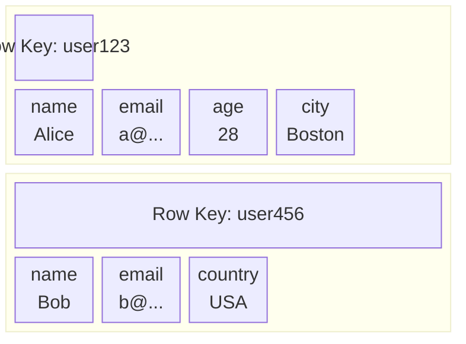
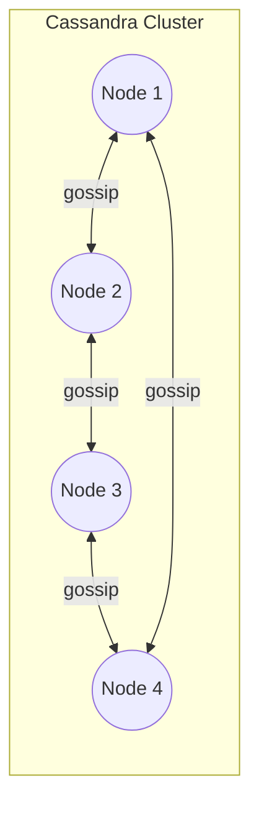
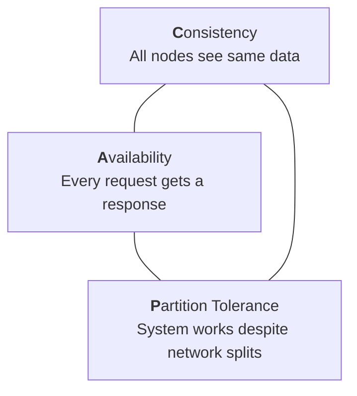
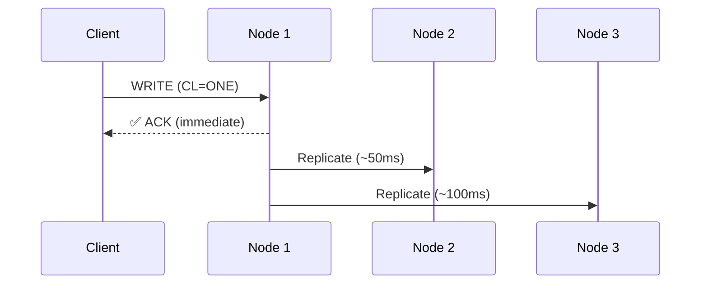
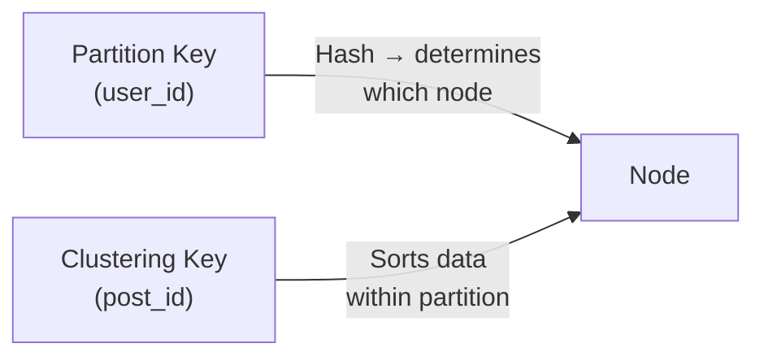
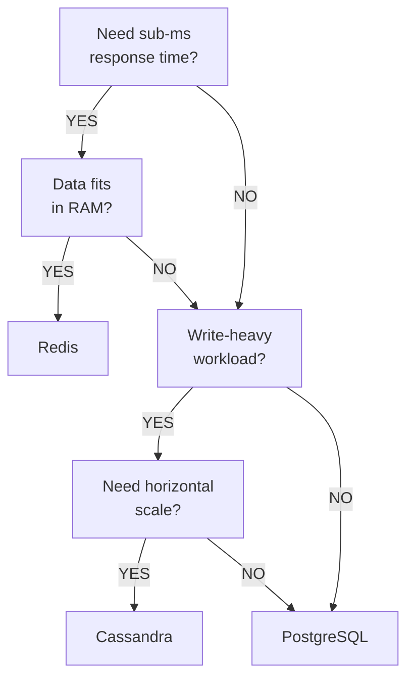
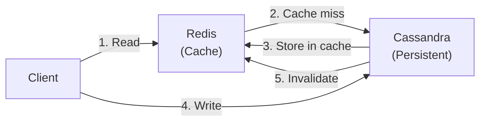

# Week 11: Key-Value & Wide-Column Stores

Redis · Cassandra · CAP Theorem · Data Modeling

---

## Agenda

- Key-Value Stores: Redis
- Redis Data Structures
- Caching, Sessions & Leaderboards
- TTL, Pub/Sub & Transactions
- Wide-Column Stores: Cassandra
- CAP Theorem & Tunable Consistency
- CQL & Data Modeling
- Partition Keys & Clustering Keys
- When (Not) to Use Each

---

## Part 1: Key-Value Stores

The Simplest Database Paradigm

---

## What is a Key-Value Store?

- The **simplest** NoSQL data model
- Every piece of data is a **key → value** pair
- Think of it as a giant **dictionary / hash map**
- No schema, no tables, no columns — just keys and values

```
key              →  value
─────────────────────────────────
"user:1000:name" →  "Alice"
"session:abc123" →  { user_id: 1000, role: "admin" }
"cache:homepage" →  "<html>...</html>"
```

---

## Key-Value vs Other Models

| Feature        | Key-Value   | Relational      | Document       |
| -------------- | ----------- | --------------- | -------------- |
| Data model     | Key → Value | Tables & Rows   | JSON Documents |
| Schema         | None        | Strict          | Flexible       |
| Query language | GET/SET     | SQL             | MongoDB Query  |
| Joins          | ❌ None     | ✅ Yes          | Limited        |
| Best for       | Speed       | Complex queries | Hierarchical   |

---

## Part 2: Redis

Remote Dictionary Server

---

## What is Redis?

- **In-memory** data store — data lives in RAM
- **10–100x faster** than disk-based databases
- **Single-threaded** event loop — no locks needed
- **Atomic operations** — every command is thread-safe
- **Rich data types** — not just strings!

💡 Redis is like a supercharged hash map with expiration and messaging built in.

---

## Redis Architecture



---

## Part 3: Redis Data Structures

Strings · Lists · Sets · Hashes · Sorted Sets

---

## Data Structure 1: Strings

The simplest type — a key mapped to a single value (up to 512 MB).

```bash
# Set and get
SET user:1000:name "Alice"
GET user:1000:name
# → "Alice"

# Set with expiration (10 seconds)
SETEX session:abc123 10 "user_data"

# Set only if key doesn't exist (distributed lock)
SETNX lock:resource 1
# → 1 (success) or 0 (already exists)

# Atomic counter
SET views:post:42 100
INCR views:post:42       # → 101
INCRBY views:post:42 5   # → 106
DECR views:post:42       # → 105
```

---

## Strings: Bulk Operations

```bash
# Set multiple keys at once
MSET user:1:name "Alice" user:1:email "alice@example.com"

# Get multiple keys at once
MGET user:1:name user:1:email
# → ["Alice", "alice@example.com"]
```

**Use Cases:**

- Caching API responses or HTML pages
- Counters (page views, likes, downloads)
- Session tokens
- Feature flags

---

## Data Structure 2: Lists

Ordered collections — implemented as **linked lists**.

```bash
# Push to front and back
LPUSH tasks "Write code"
LPUSH tasks "Review PR"
RPUSH tasks "Deploy"
# tasks = ["Review PR", "Write code", "Deploy"]

# Read range (0-based)
LRANGE tasks 0 -1
# → ["Review PR", "Write code", "Deploy"]

# Pop from front / back
LPOP tasks   # → "Review PR"
RPOP tasks   # → "Deploy"

# Blocking pop (wait up to 5s for an item)
BLPOP tasks 5

# Length
LLEN tasks   # → 1
```

---

## Lists: Use Cases

**Message Queue Pattern:**

```bash
# Producer pushes to left
LPUSH queue:emails "send welcome email"
LPUSH queue:emails "send password reset"

# Consumer pops from right (FIFO)
RPOP queue:emails
# → "send welcome email"
```

**Activity Feed Pattern:**

```bash
# Add new activity (keep only last 100)
LPUSH feed:user:1000 "liked post #42"
LTRIM feed:user:1000 0 99

# Get recent activity
LRANGE feed:user:1000 0 9
```

---

## Data Structure 3: Sets

Unordered collections of **unique** strings.

```bash
# Add members
SADD users:online "alice" "bob" "charlie"

# Duplicate ignored
SADD users:online "alice"   # → 0

# All members
SMEMBERS users:online
# → ["alice", "bob", "charlie"]

# Check membership
SISMEMBER users:online "alice"   # → 1 (true)
SISMEMBER users:online "david"   # → 0 (false)

# Count
SCARD users:online   # → 3

# Remove
SREM users:online "bob"
```

---

## Sets: Set Operations

```bash
SADD group:admins "alice" "bob"
SADD group:moderators "bob" "charlie"

# Intersection (common members)
SINTER group:admins group:moderators
# → ["bob"]

# Union (all members)
SUNION group:admins group:moderators
# → ["alice", "bob", "charlie"]

# Difference (in first, not in second)
SDIFF group:admins group:moderators
# → ["alice"]

# Random member / pop
SRANDMEMBER users:online   # peek
SPOP users:online           # remove random
```

**Use Cases:** unique visitors, tags, permissions, social graphs

---

## Data Structure 4: Hashes

Field-value pairs — like objects or dictionaries.

```bash
# Set fields
HSET user:1000 name "Alice" email "alice@example.com" age "28"

# Get one field
HGET user:1000 name
# → "Alice"

# Get all fields
HGETALL user:1000
# → {name: "Alice", email: "alice@example.com", age: "28"}

# Increment numeric field
HINCRBY user:1000 login_count 1

# Check field exists
HEXISTS user:1000 name   # → 1

# Delete field
HDEL user:1000 age
```

**Use Cases:** user profiles, product details, shopping carts, config

---

## Data Structure 5: Sorted Sets (ZSets)

Sets where each member has a **score** used for ranking.

```bash
# Add members with scores
ZADD leaderboard 1000 "alice"
ZADD leaderboard 850 "bob" 920 "charlie"

# Top 3 (highest scores first)
ZREVRANGE leaderboard 0 2 WITHSCORES
# → ["alice", "1000", "charlie", "920", "bob", "850"]

# Get rank (0-based, highest first)
ZREVRANK leaderboard "alice"   # → 0

# Get score
ZSCORE leaderboard "alice"   # → "1000"

# Increment score
ZINCRBY leaderboard 50 "bob"   # bob: 850 → 900

# Count in range
ZCOUNT leaderboard 900 1000   # → 3
```

---

## Sorted Sets: Use Cases

**Leaderboard:**

```bash
ZADD leaderboard 1500 "player1" 1200 "player2" 1800 "player3"
ZREVRANGE leaderboard 0 9   # Top 10 players
```

**Priority Queue:**

```bash
ZADD tasks 1 "urgent-fix" 3 "feature-request" 2 "bug-report"
ZPOPMIN tasks   # Get lowest priority (most urgent)
```

**Sliding Window Rate Limiter:**

```bash
ZADD ratelimit:user:1 1710000001 "req1"
ZADD ratelimit:user:1 1710000002 "req2"
ZRANGEBYSCORE ratelimit:user:1 1709999940 +inf
# Count requests in last 60 seconds
```

---

## Redis Data Structures Summary

| Structure  | Ordered? | Unique? | Best For                      |
| ---------- | -------- | ------- | ----------------------------- |
| String     | N/A      | N/A     | Caching, counters, sessions   |
| List       | ✅ Yes   | ❌ No   | Queues, feeds, stacks         |
| Set        | ❌ No    | ✅ Yes  | Tags, unique visitors, graphs |
| Hash       | ❌ No    | ✅ Keys | Objects, profiles, carts      |
| Sorted Set | ✅ Yes   | ✅ Yes  | Leaderboards, priority queues |

---

## Part 4: TTL, Pub/Sub & Transactions

Built-in Features

---

## Key Expiration (TTL)

Redis can **auto-delete** keys after a timeout:

```bash
# Set key with 10-second TTL
SET cache:page:home "<html>...</html>"
EXPIRE cache:page:home 10

# Or set + expire in one command
SETEX cache:page:home 10 "<html>...</html>"

# Check remaining time
TTL cache:page:home   # → 8 (seconds left)
# -1 = no expiration, -2 = key doesn't exist

# Remove expiration
PERSIST cache:page:home
```

**Use Cases:**

- 🗂️ Cache invalidation (expire after 5 min)
- 🔑 Session storage (expire after 30 min idle)
- 🔒 One-time tokens / OTPs (expire after 60s)
- 🚦 Rate limiting (reset counters hourly)

---

## Pub/Sub (Publish / Subscribe)

Real-time messaging — publishers send to channels, subscribers receive:

```bash
# Terminal 1: Subscribe
SUBSCRIBE news:tech
# Waiting for messages...

# Terminal 2: Publish
PUBLISH news:tech "New AI model released!"
# → 1 (number of subscribers who received it)

# Terminal 1 receives:
# 1) "message"
# 2) "news:tech"
# 3) "New AI model released!"

# Pattern subscription (wildcard)
PSUBSCRIBE news:*
# Receives from news:tech, news:sports, etc.
```

**Use Cases:** chat, live notifications, cache invalidation, dashboards

---

## Transactions (MULTI / EXEC)

Group commands into an **atomic** operation:

```bash
# Start transaction
MULTI

# Queue commands (NOT executed yet)
SET user:1000:balance 100
DECRBY user:1000:balance 20
INCRBY user:2000:balance 20

# Execute all atomically
EXEC
# → [OK, 80, 20]

# Or discard
MULTI
SET key value
DISCARD
# Nothing executed
```

---

## Optimistic Locking (WATCH)

```bash
# Watch key for changes
WATCH user:1000:balance
GET user:1000:balance   # → "100"

# Start transaction
MULTI
DECRBY user:1000:balance 20
EXEC
# → [80]          if no other client modified the key
# → nil (failed)  if another client changed it first
```

If the watched key was modified between WATCH and EXEC, the transaction **aborts**. Retry the whole operation.

---

## Persistence Options

Redis is in-memory, but can persist data to disk:

| Method | How                        | Durability       | Performance |
| ------ | -------------------------- | ---------------- | ----------- |
| RDB    | Periodic snapshots to disk | May lose minutes | ✅ Fast     |
| AOF    | Log every write operation  | Lose ≤ 1 second  | Slower      |
| Both   | RDB for fast restart + AOF | Best durability  | Balanced    |

```bash
# RDB: save every 60s if ≥1000 keys changed
redis-server --save 60 1000

# AOF: log every second
redis-server --appendonly yes --appendfsync everysec
```

---

## Redis Docker Setup

```yaml
# docker-compose.yml
services:
  redis:
    image: redis:7-alpine
    ports:
      - '6379:6379'
    volumes:
      - redis-data:/data
    command: redis-server --appendonly yes

volumes:
  redis-data:
```

```bash
docker-compose up -d
docker exec -it redis redis-cli
redis-cli ping   # → PONG
```

---

## TypeScript: ioredis Client

```typescript
import Redis from 'ioredis';

const redis = new Redis({ host: 'localhost', port: 6379 });

// String
await redis.set('user:1:name', 'Alice');
const name = await redis.get('user:1:name');

// Hash
await redis.hset('user:1', 'name', 'Alice', 'email', 'a@ex.com');
const user = await redis.hgetall('user:1');

// Sorted Set (leaderboard)
await redis.zadd('leaderboard', 1500, 'player1', 1200, 'player2');
const top = await redis.zrevrange('leaderboard', 0, 9, 'WITHSCORES');

// TTL
await redis.setex('cache:home', 300, '<html>...</html>');
```

---

## When to Use Redis

**✅ Use Redis when:**

- You need **sub-millisecond** response times
- Data fits in **RAM** (or you accept eviction)
- Caching, sessions, rate limiting, leaderboards
- Real-time features (pub/sub, counters)

**❌ Don't use Redis when:**

- Data **exceeds available RAM**
- You need **complex queries** (joins, aggregations)
- You need **strong durability** guarantees
- Data is primarily **relational**

---

## Part 5: Wide-Column Stores

Cassandra & Distributed Data at Scale

---

## What is a Wide-Column Store?

- Data organized in **column families** (like flexible tables)
- Each row can have a **different set of columns**
- Optimized for **writes** and **horizontal scaling**
- No joins — data is **denormalized**



💡 Different rows can have **different columns** — schema-less per row.

---

## Part 6: Cassandra

Distributed Database for Massive Scale

---

## What is Cassandra?

- **Apache Cassandra** — distributed wide-column NoSQL database
- Originally built at **Facebook** for inbox search
- **Masterless** architecture — no single point of failure
- **Linearly scalable** — add nodes to increase throughput
- **Write-optimized** — append-only log structure

Used by: Apple, Netflix, Instagram, Discord, Uber

---

## Cassandra Architecture



- **Peer-to-peer** gossip protocol — no master / slave
- **Consistent hashing** (token ring) determines data placement
- **Replication factor** (e.g., RF = 3) — each row stored on 3 nodes

- **Node**: Single Cassandra instance
- **Ring**: Nodes arranged via consistent hashing
- **Token**: Each node owns a data range based on partition key hash
- **RF**: Replication Factor — number of copies (RF=3 → 3 copies)

---

## Part 7: CAP Theorem

Consistency · Availability · Partition Tolerance

---

## CAP Theorem

A distributed system can guarantee at most **2 of 3**:



In a distributed system, network partitions **will happen** — so you must choose between **C** and **A**.

---

## Where Do Databases Sit?

| Database   | Category | Prioritizes                        |
| ---------- | -------- | ---------------------------------- |
| PostgreSQL | CA       | Consistency + Availability         |
| MongoDB    | CP       | Consistency + Partition Tolerance  |
| Cassandra  | AP       | Availability + Partition Tolerance |
| Redis      | CP/AP    | Depends on configuration           |

⚠️ CA only works when there are no network partitions (single node).

---

## Cassandra's Approach: Tunable Consistency

Cassandra lets you **choose** the trade-off per query:

| Consistency Level | Nodes Required | Consistency | Availability |
| ----------------- | -------------- | ----------- | ------------ |
| ONE               | 1 replica      | Low         | High         |
| QUORUM            | RF/2 + 1       | Medium      | Medium       |
| ALL               | All replicas   | High        | Low          |

**Example with RF = 3:**

- Write `CL = QUORUM` → 2 of 3 nodes must acknowledge
- Read `CL = QUORUM` → 2 of 3 nodes must respond
- **Result:** Strong consistency (Write CL + Read CL > RF)

---

## Eventual Consistency

If you use `CL = ONE` for writes, replicas may be **temporarily out of sync**:



Cassandra uses **repair mechanisms** to sync:

- **Read repair** — fix stale data on reads
- **Anti-entropy repair** — background full-data sync
- **Hinted handoff** — store writes for offline nodes

---

## Part 8: CQL

Cassandra Query Language

---

## CQL vs SQL

CQL **looks** like SQL but has critical differences:

| Feature      | SQL                   | CQL                            |
| ------------ | --------------------- | ------------------------------ |
| Joins        | ✅ INNER, LEFT, RIGHT | ❌ None                        |
| Aggregations | ✅ GROUP BY, HAVING   | Limited                        |
| WHERE clause | Any column            | Must include partition key     |
| ORDER BY     | Any column            | Only clustering keys           |
| Subqueries   | ✅ Yes                | ❌ No                          |
| Transactions | ACID                  | Lightweight (single partition) |

---

## Create Keyspace & Table

```sql
-- Keyspace = Database
CREATE KEYSPACE my_app
WITH replication = {
  'class': 'SimpleStrategy',
  'replication_factor': 3
};

USE my_app;

-- Table with composite primary key
CREATE TABLE posts (
  user_id UUID,           -- Partition key
  post_id TIMEUUID,       -- Clustering key
  title TEXT,
  content TEXT,
  created_at TIMESTAMP,
  PRIMARY KEY (user_id, post_id)
)
WITH CLUSTERING ORDER BY (post_id DESC);
```

---

## Partition Key vs Clustering Key



- **Partition key** → determines **which node** stores the row (via hash)
- **Clustering key** → **sorts** rows **within** a partition
- Always query by **partition key** — otherwise Cassandra scans all nodes

---

## Insert & Query

```sql
-- Insert
INSERT INTO posts (user_id, post_id, title, content, created_at)
VALUES (uuid(), now(), 'Hello World', 'My first post', toTimestamp(now()));

-- Insert with TTL (auto-delete after 1 hour)
INSERT INTO posts (user_id, post_id, title, content, created_at)
VALUES (uuid(), now(), 'Temporary', '...', toTimestamp(now()))
USING TTL 3600;

-- ✅ Query by partition key (fast)
SELECT * FROM posts
WHERE user_id = 123e4567-e89b-12d3-a456-426614174000;

-- ✅ Query with clustering key range
SELECT * FROM posts
WHERE user_id = 123e4567-e89b-12d3-a456-426614174000
  AND post_id > minTimeuuid('2026-01-01 00:00:00');

-- ❌ Query without partition key (full scan!)
SELECT * FROM posts WHERE title = 'Hello';
-- Error unless you add ALLOW FILTERING (not recommended)
```

---

## Update & Delete

```sql
-- Update
UPDATE posts
SET content = 'Updated content'
WHERE user_id = 123e4567-e89b-12d3-a456-426614174000
  AND post_id = now();

-- Counter table
CREATE TABLE post_stats (
  post_id UUID PRIMARY KEY,
  views COUNTER
);
UPDATE post_stats SET views = views + 1
WHERE post_id = 123e4567-e89b-12d3-a456-426614174000;

-- Delete
DELETE FROM posts
WHERE user_id = 123e4567-e89b-12d3-a456-426614174000
  AND post_id = now();
```

⚠️ Deletes create **tombstones** — actual removal happens during compaction.

---

## Collections

```sql
-- List (ordered, allows duplicates)
ALTER TABLE users ADD phone_numbers LIST<TEXT>;
UPDATE users SET phone_numbers = ['555-1234', '555-5678']
WHERE user_id = ...;

-- Set (unordered, unique)
ALTER TABLE users ADD tags SET<TEXT>;
UPDATE users SET tags = tags + {'developer', 'blogger'}
WHERE user_id = ...;

-- Map (key-value pairs)
ALTER TABLE users ADD attributes MAP<TEXT, TEXT>;
UPDATE users SET attributes = {'country': 'USA', 'city': 'Boston'}
WHERE user_id = ...;
```

⚠️ Collections are stored inside the row — don't store thousands of items.

---

## Part 9: Data Modeling in Cassandra

Query-Driven Design

---

## Cassandra Modeling Philosophy

In relational databases: **model your entities first**, then write queries.

In Cassandra: **model your queries first**, then design tables.


---

## Denormalization Example

**SQL approach** (normalized — 1 table, JOIN to get author):

```sql
SELECT posts.*, users.username
FROM posts
JOIN users ON posts.user_id = users.id
WHERE posts.user_id = 123;
```

**Cassandra approach** (denormalized — embed author data):

```sql
CREATE TABLE posts_by_user (
  user_id UUID,
  post_id TIMEUUID,
  title TEXT,
  content TEXT,
  author_name TEXT,      -- Denormalized!
  author_email TEXT,     -- Denormalized!
  PRIMARY KEY (user_id, post_id)
);

-- Single query, no JOIN
SELECT * FROM posts_by_user WHERE user_id = ...;
```

⚠️ If author name changes, you must update **all** their posts.

---

## Time-Series Modeling

Ideal Cassandra use case — IoT sensor data:

```sql
CREATE TABLE sensor_data (
  sensor_id TEXT,
  timestamp TIMESTAMP,
  temperature DOUBLE,
  humidity DOUBLE,
  PRIMARY KEY (sensor_id, timestamp)
)
WITH CLUSTERING ORDER BY (timestamp DESC);

-- Get latest 10 readings for a sensor
SELECT * FROM sensor_data
WHERE sensor_id = 'temp-01'
LIMIT 10;

-- Get readings in a time range
SELECT * FROM sensor_data
WHERE sensor_id = 'temp-01'
  AND timestamp >= '2026-03-01'
  AND timestamp < '2026-03-02';
```

---

## Composite Partition Key

Avoid **hot partitions** by splitting data:

```sql
-- ❌ All data for one sensor on one node
CREATE TABLE sensor_data (
  sensor_id TEXT,
  timestamp TIMESTAMP,
  value DOUBLE,
  PRIMARY KEY (sensor_id, timestamp)
);

-- ✅ Split by date — better distribution
CREATE TABLE sensor_data (
  sensor_id TEXT,
  date TEXT,              -- e.g., '2026-03-23'
  timestamp TIMESTAMP,
  value DOUBLE,
  PRIMARY KEY ((sensor_id, date), timestamp)
);

-- Query: must include both partition key parts
SELECT * FROM sensor_data
WHERE sensor_id = 'temp-01' AND date = '2026-03-23';
```

---

## Indexes: Secondary vs Materialized Views

```sql
-- Secondary Index (limited use)
CREATE INDEX ON users (email);
SELECT * FROM users WHERE email = 'alice@example.com';
-- ⚠️ Queries all nodes — slow for high-cardinality columns

-- Better: create a lookup table
CREATE TABLE users_by_email (
  email TEXT PRIMARY KEY,
  user_id UUID
);
-- Fast: direct partition key lookup
SELECT user_id FROM users_by_email
WHERE email = 'alice@example.com';
```

**Rule of thumb:** prefer denormalized lookup tables over secondary indexes.

---

## Cassandra Docker Setup

```yaml
# docker-compose.yml
services:
  cassandra:
    image: cassandra:4.1
    ports:
      - '9042:9042'
    volumes:
      - cassandra-data:/var/lib/cassandra
    environment:
      CASSANDRA_CLUSTER_NAME: 'MyCluster'

volumes:
  cassandra-data:
```

```bash
docker-compose up -d
docker exec -it cassandra cqlsh
```

---

## TypeScript: cassandra-driver

```typescript
import { Client } from 'cassandra-driver';

const client = new Client({
  contactPoints: ['localhost'],
  localDataCenter: 'datacenter1',
  keyspace: 'my_app',
});

await client.connect();

// Insert
await client.execute('INSERT INTO posts (user_id, post_id, title) VALUES (?, now(), ?)', [userId, 'Hello World'], { prepare: true });

// Query
const result = await client.execute('SELECT * FROM posts WHERE user_id = ?', [userId], { prepare: true });
console.log(result.rows);
```

---

## When to Use Cassandra

**✅ Use Cassandra when:**

- You need **massive write throughput**
- Data is **time-series** (IoT, logs, metrics)
- You need **horizontal scalability** (petabytes)
- **High availability** is critical (no single point of failure)
- Your queries are **known in advance** (query-driven design)

**❌ Don't use Cassandra when:**

- You need **complex joins** or ad-hoc queries
- Data is small (< 100 GB — overhead not worth it)
- You need **ACID transactions** across rows
- Your access patterns are **unpredictable**

---

## Part 10: Comparison & Decision Framework

Choosing the Right Tool

---

## Redis vs Cassandra

| Feature      | Redis                | Cassandra                |
| ------------ | -------------------- | ------------------------ |
| Storage      | In-memory (RAM)      | On-disk (distributed)    |
| Speed        | Sub-millisecond      | Low milliseconds         |
| Data size    | Limited by RAM       | Petabytes                |
| Scaling      | Primarily vertical   | Horizontal (linear)      |
| Consistency  | Strong (single node) | Tunable (AP by default)  |
| Best for     | Caching, real-time   | Time-series, write-heavy |
| Architecture | Single / Cluster     | Masterless ring          |

---

## Decision Matrix



---

## Common Architecture: Redis + Cassandra Together

Many systems use **both** — each for what it does best:



1. Client reads from Redis (cache hit → fast!)
2. Cache miss → read from Cassandra → store in Redis
3. Client writes to Cassandra → invalidate Redis cache

**Example:** Netflix uses Redis for session/cache, Cassandra for viewing history.

---

## Polyglot Persistence

Use **multiple databases**, each for its strengths:

| Layer              | Database      | Why                                |
| ------------------ | ------------- | ---------------------------------- |
| Cache / Sessions   | Redis         | Speed, TTL, pub/sub                |
| User accounts      | PostgreSQL    | ACID, complex queries, joins       |
| Product catalog    | MongoDB       | Flexible schema, nested docs       |
| Sensor / time data | Cassandra     | Write throughput, horizontal scale |
| Search             | Elasticsearch | Full-text search, relevance        |

💡 This is exactly what your **final project** is about — combining 3+ databases!

---

## Key Takeaways

1. **Redis** = in-memory speed with rich data structures (cache, leaderboards, sessions)
2. **Cassandra** = distributed write-heavy storage at massive scale (time-series, IoT, logs)
3. **CAP theorem** — pick 2 of 3: Consistency, Availability, Partition Tolerance
4. **Redis**: use TTL, pub/sub, and sorted sets for real-time features
5. **Cassandra**: always query by partition key — model your queries first
6. **Denormalize** in Cassandra — no joins, accept data duplication
7. Use both together: Redis as cache layer, Cassandra for persistence

---

## Resources

- [Redis Fundamentals](./redis-fundamentals.md)
- [Cassandra Fundamentals](./cassandra-fundamentals.md)
- [Readings & Resources](./readings-11.md)
- [Quiz 09: Key-Value & Wide-Column](./quiz/redis-cassandra-quiz.md)
- [Final Project Checkpoint: Architecture Design](./assignment.md)

---

## Next Week

### Week 12: Graph Databases — Neo4j

- Nodes, relationships, & properties
- When graphs beat relational
- Cypher query language
- Social networks, recommendations, fraud detection
