# Week 12: Graph Databases — Neo4j

Nodes · Relationships · Cypher · Traversals · Recommendations

---

## Agenda

- Graph Database Paradigm
- Graph vs Relational Model
- Neo4j Architecture
- Cypher Basics — Patterns & Syntax
- CRUD Operations — CREATE & MATCH
- CRUD Operations — MERGE, UPDATE & DELETE
- Variable-Length Paths & Shortest Path
- Advanced Cypher Patterns
- Indexes & Constraints
- Docker Setup & Neo4j Browser
- TypeScript Integration
- Use Cases — Social Networks & Recommendations
- Use Cases — Fraud Detection & Routing
- Performance Best Practices & Common Pitfalls
- Decision Framework & Key Takeaways

---

## Part 1: Graph Databases

A New Way to Think About Data

---

## What is a Graph Database?

- Stores data as **nodes** (entities) and **relationships** (connections)
- Relationships are **first-class citizens**, not afterthoughts
- Built for **interconnected data**: social networks, recommendations, fraud detection
- Think of it as a **whiteboard-friendly** data model

💡 If you draw circles and arrows when designing your schema — you want a graph database.

---

## The Graph Model

A graph has four fundamental building blocks:

| Component        | Description                           | Analogy              |
| ---------------- | ------------------------------------- | -------------------- |
| **Node**         | An entity (vertex)                    | A row in SQL         |
| **Relationship** | A connection (edge)                   | A foreign key + JOIN |
| **Property**     | Key-value pair on nodes/relationships | A column value       |
| **Label**        | Category tag on a node                | A table name         |

---

## Graph Example: Social Network

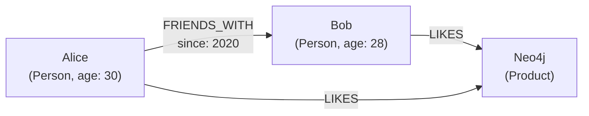

- **Alice** and **Bob** are Nodes with the label `:Person`
- **FRIENDS_WITH** is a Relationship with a property `since: 2020`
- **Neo4j** is a Node with the label `:Product`

---

## Properties on Everything

Both nodes **and** relationships can have properties:

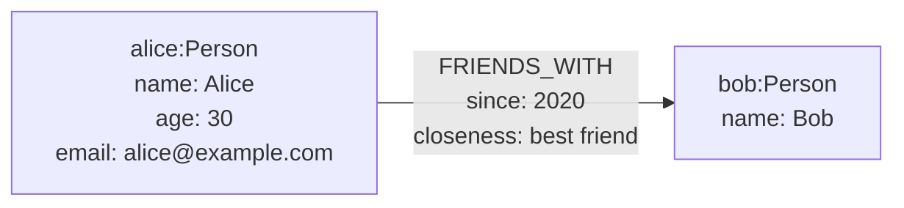

💡 This is called the **Labeled Property Graph** model — Neo4j's native data model.

---

## Labels: Categorize Your Nodes

- A node can have **multiple labels**
- Labels function like "types" or "tags"
- Used for indexing and querying

```cypher
// Alice is both a Person and an Admin
(alice:Person:Admin {name: "Alice"})

// Products can have multiple categories
(laptop:Product:Electronics {name: "ThinkPad"})
```

---

## Part 2: Graph vs Relational

When Do Graphs Win?

---

## Side-by-Side Comparison

| Aspect                | Relational (SQL)                | Graph (Neo4j)                    |
| --------------------- | ------------------------------- | -------------------------------- |
| **Data Model**        | Tables with rows & columns      | Nodes with relationships         |
| **Relationships**     | Foreign keys + JOINs            | First-class citizens             |
| **Query Performance** | Slow for deep joins (6+ levels) | Fast traversal at any depth      |
| **Schema**            | Fixed, must be defined upfront  | Flexible, labeled property graph |
| **Query Language**    | SQL                             | Cypher                           |
| **Best For**          | Structured data, aggregations   | Connected data, traversals       |

---

## The JOIN Problem

Finding friends-of-friends in SQL:

```sql
-- 1 hop: Find direct friends
SELECT f.friend_id
FROM friendships f
WHERE f.user_id = 1;

-- 2 hops: Friends of friends
SELECT f2.friend_id
FROM friendships f1
JOIN friendships f2 ON f1.friend_id = f2.user_id
WHERE f1.user_id = 1;

-- 3 hops: Friends of friends of friends
SELECT f3.friend_id
FROM friendships f1
JOIN friendships f2 ON f1.friend_id = f2.user_id
JOIN friendships f3 ON f2.friend_id = f3.user_id
WHERE f1.user_id = 1;
-- Each additional hop = another JOIN ❌
```

---

## The Same Query in Cypher

```cypher
// 1 hop
MATCH (:Person {name: "Alice"})-[:FRIENDS_WITH]->(friend)
RETURN friend;

// 2 hops
MATCH (:Person {name: "Alice"})-[:FRIENDS_WITH*2]->(fof)
RETURN DISTINCT fof;

// 3 hops
MATCH (:Person {name: "Alice"})-[:FRIENDS_WITH*3]->(fofof)
RETURN DISTINCT fofof;

// N hops (variable-length path!)
MATCH (:Person {name: "Alice"})-[:FRIENDS_WITH*1..5]->(connected)
RETURN DISTINCT connected;
```

✅ Just change the number — no extra JOINs, no performance cliffs.

---

## Performance: JOINs vs Traversals

| Depth  | Relational (JOINs) | Graph (Traversals) |
| ------ | ------------------ | ------------------ |
| 1 hop  | ~1 ms              | ~1 ms              |
| 2 hops | ~5 ms              | ~2 ms              |
| 3 hops | ~50 ms             | ~3 ms              |
| 4 hops | ~500 ms            | ~4 ms              |
| 5 hops | ~5,000 ms          | ~5 ms              |
| 6 hops | Timeout ☠️         | ~6 ms              |

💡 Graph databases maintain **constant-time** relationship traversal thanks to **index-free adjacency**.

---

## When Graphs Beat Relational

- **Social networks**: Friends-of-friends, influence paths
- **Recommendations**: "Users who liked X also liked Y"
- **Fraud detection**: Shared phone numbers, suspicious patterns across hops
- **Knowledge graphs**: Wikipedia, research papers, interconnected concepts
- **Routing/Navigation**: Shortest path between cities/locations

---

## When Relational is Better

- **Transactional systems**: Banking, e-commerce order tracking
- **Large aggregations**: Summing millions of rows (SUM, AVG, COUNT)
- **Simple CRUD**: Basic create/read/update/delete with flat data
- **Reporting & analytics**: OLAP workloads, data warehousing
- **Unconnected data**: No meaningful relationships between entities

---

## Part 3: Neo4j Architecture

How It Works Under the Hood

---

## Neo4j Components

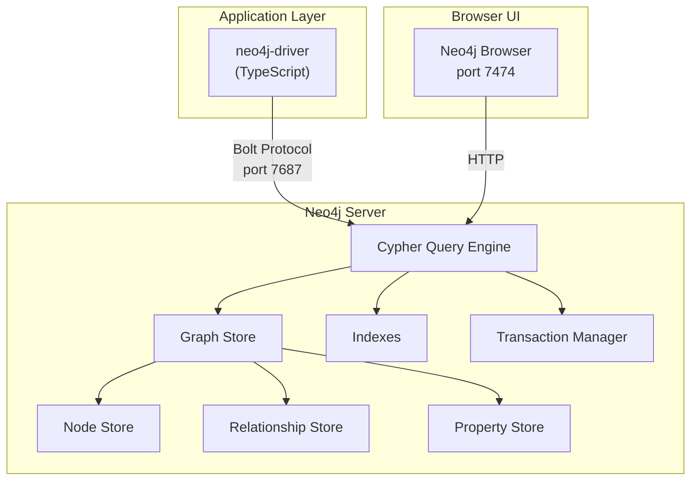

---

## Index-Free Adjacency

The secret to Neo4j's speed:

- Each node stores **direct physical pointers** to its neighbors on disk
- No index lookup needed when traversing relationships
- Traversal time is **O(1)** per hop — independent of total graph size

---

## How It Works: Relational vs Graph

**Relational DB** — "Find Bob's friends":

1. Look up Bob's `user_id` in the `users` table → **index scan O(log N)**
2. Search the `friendships` table for rows where `user_id = Bob` → **index scan O(log N)**
3. For each matching `friend_id`, look up the friend in `users` → **index scan O(log N)** × number of friends
4. Every hop repeats steps 2–3. **Cost grows with table size.**

**Neo4j** — "Find Bob's friends":

1. Go to Bob's node record (fixed-size, direct address)
2. Follow Bob's **relationship pointer** to the first relationship record
3. Walk the **linked list** of Bob's relationships — each one contains the neighbor's node address
4. Jump directly to each neighbor node. **No index. No table scan. O(1) per hop.**

---

## Physical Storage Layout

Neo4j stores nodes and relationships in **fixed-size records**:

| Store File             | Record Size | Key Contents                                     |
| ---------------------- | :---------: | ------------------------------------------------ |
| `neostore.nodestore`   |   15 bytes  | first relationship pointer, first property pointer, label pointer |
| `neostore.relstore`    |   34 bytes  | start node, end node, relationship type, next/prev pointers for both nodes |

Each node record contains the **address of its first relationship**. Each relationship record contains **next/prev pointers** forming a doubly-linked list per node — so you can walk all of a node's relationships without touching any index.

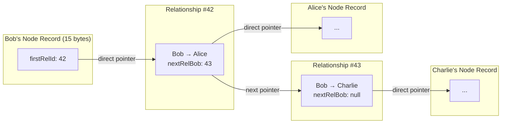

---

## Why This Matters at Scale

| Operation                        | Relational (B-tree index)          | Graph (pointer chase)              |
| -------------------------------- | ---------------------------------- | ---------------------------------- |
| Find one neighbor                | O(log N) — N = total rows in table | O(1) — follow one pointer          |
| Find k neighbors                 | O(k × log N)                       | O(k) — walk k pointers             |
| Traverse d hops                  | O(k^d × log N) — exponential scans | O(k^d) — no index overhead per hop |
| Add 10× more data to the DB     | Every lookup slows down (log grows) | Traversal speed unchanged          |

💡 **Relational**: cost per hop depends on how big the table is. **Graph**: cost per hop depends only on how many neighbors that specific node has — the rest of the database is irrelevant.

---

## ACID Transactions

Neo4j supports **full ACID** compliance:

| Property        | Meaning                         | Neo4j Support               |
| --------------- | ------------------------------- | --------------------------- |
| **Atomicity**   | All or nothing                  | ✅ Full rollback on failure |
| **Consistency** | Data always valid               | ✅ Constraints enforced     |
| **Isolation**   | Concurrent txns don't interfere | ✅ Read-committed           |
| **Durability**  | Committed data survives crashes | ✅ Write-ahead log          |

Unlike some NoSQL databases, Neo4j gives you **transactional guarantees**.

---

## Part 4: Cypher Basics

Pattern Matching with ASCII Art

---

## What is Cypher?

- Neo4j's **declarative** query language (like SQL for graphs)
- Uses **ASCII art** to represent graph patterns
- Reads almost like English

```cypher
// "Find people that Alice is friends with"
MATCH (alice:Person {name: "Alice"})-[:FRIENDS_WITH]->(friend)
RETURN friend.name;
```

---

## Node Patterns

```cypher
// Any node
(n)

// Node with label
(p:Person)

// Node with label and properties
(p:Person {name: "Alice", age: 30})

// Node with multiple labels
(a:Person:Admin)
```

- Parentheses `()` represent nodes
- Colon `:Label` assigns labels
- Curly braces `{}` specify properties

---

## Relationship Patterns

```cypher
// Directed relationship (outgoing)
-[:FRIENDS_WITH]->

// Directed relationship (incoming)
<-[:FRIENDS_WITH]-

// Undirected (either direction)
-[:FRIENDS_WITH]-

// Relationship with variable and properties
-[r:FRIENDS_WITH {since: 2020}]->

// Multiple relationship types
-[:FRIENDS_WITH|FOLLOWS]->
```

- Arrows `->` `<-` indicate direction
- Square brackets `[]` hold relationship details

---

## Path Patterns

Combine nodes and relationships into full patterns:

```cypher
// Direct connection
(a:Person)-[:FRIENDS_WITH]->(b:Person)

// Chain of relationships
(a)-[:KNOWS]->(b)-[:KNOWS]->(c)

// Multiple relationship types in path
(a:User)-[:PURCHASED]->(p:Product)<-[:PURCHASED]-(b:User)
```

💡 Cypher patterns look like the diagrams you draw on a whiteboard!

---

## Key Cypher Clauses

| Clause     | Purpose                    | SQL Equivalent             |
| ---------- | -------------------------- | -------------------------- |
| `MATCH`    | Find patterns              | `SELECT ... FROM ... JOIN` |
| `WHERE`    | Filter results             | `WHERE`                    |
| `RETURN`   | Output results             | `SELECT`                   |
| `CREATE`   | Insert data                | `INSERT INTO`              |
| `MERGE`    | Upsert (create if missing) | `INSERT ... ON CONFLICT`   |
| `SET`      | Update properties          | `UPDATE ... SET`           |
| `DELETE`   | Remove data                | `DELETE FROM`              |
| `ORDER BY` | Sort                       | `ORDER BY`                 |
| `LIMIT`    | Limit results              | `LIMIT`                    |
| `WITH`     | Chain queries              | Subquery / CTE             |

---

## Part 5: CRUD — CREATE & MATCH

Inserting and Querying Data

---

## CREATE Nodes

```cypher
// Create single node
CREATE (alice:Person {name: "Alice", age: 30, email: "alice@example.com"})
RETURN alice;

// Create multiple nodes
CREATE
  (bob:Person {name: "Bob", age: 28}),
  (charlie:Person {name: "Charlie", age: 35});
```

⚠️ **CREATE always creates** — even if a matching node already exists. Use `MERGE` to avoid duplicates.

---

## CREATE Relationships

```cypher
// Create relationship between existing nodes
MATCH (a:Person {name: "Alice"}), (b:Person {name: "Bob"})
CREATE (a)-[r:FRIENDS_WITH {since: 2020}]->(b)
RETURN r;

// Create nodes AND relationships in one statement
CREATE
  (alice:Person {name: "Alice"})
    -[:LIKES]->
  (neo4j:Product {name: "Neo4j"})
RETURN alice, neo4j;
```

---

## Build a Sample Graph

```cypher
// Social network seed data
CREATE
  (alice:Person {name: "Alice", age: 30}),
  (bob:Person {name: "Bob", age: 28}),
  (charlie:Person {name: "Charlie", age: 35}),
  (david:Person {name: "David", age: 25}),
  (eve:Person {name: "Eve", age: 32}),

  (alice)-[:FRIENDS_WITH]->(bob),
  (bob)-[:FRIENDS_WITH]->(charlie),
  (charlie)-[:FRIENDS_WITH]->(david),
  (alice)-[:FRIENDS_WITH]->(charlie),
  (eve)-[:FRIENDS_WITH]->(alice),
  (eve)-[:FRIENDS_WITH]->(bob);
```

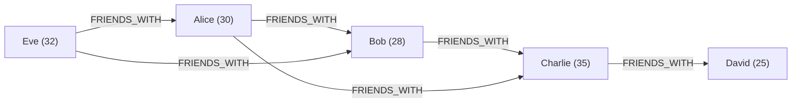

---

## MATCH — Query Patterns

```cypher
// Find all Person nodes
MATCH (p:Person)
RETURN p;

// Find person by property
MATCH (p:Person {name: "Alice"})
RETURN p;

// Filter with WHERE
MATCH (p:Person)
WHERE p.age > 25
RETURN p.name, p.age
ORDER BY p.age DESC;
```

---

## MATCH with Relationships

```cypher
// Find Alice's direct friends
MATCH (alice:Person {name: "Alice"})-[:FRIENDS_WITH]->(friend)
RETURN friend.name;

// Find bidirectional friendships (either direction)
MATCH (a:Person)-[:FRIENDS_WITH]-(b:Person)
WHERE a.name = "Alice"
RETURN b.name;

// Who likes Neo4j?
MATCH (p:Person)-[:LIKES]->(product:Product {name: "Neo4j"})
RETURN p.name;
```

💡 Arrow direction matters: `->` filters outgoing, `<-` incoming, `-` matches both.

---

## MATCH with Multiple Patterns

```cypher
// Find common friends between Alice and Bob
MATCH (alice:Person {name: "Alice"})-[:FRIENDS_WITH]->(common)
MATCH (bob:Person {name: "Bob"})-[:FRIENDS_WITH]->(common)
RETURN common.name;

// Find people who are friends AND like the same product
MATCH (a:Person)-[:FRIENDS_WITH]->(b:Person)
MATCH (a)-[:LIKES]->(p:Product)<-[:LIKES]-(b)
RETURN a.name, b.name, p.name AS sharedProduct;
```

---

## Part 6: CRUD — MERGE, UPDATE & DELETE

Upsert, Modify, and Remove

---

## MERGE — Create If Not Exists

**MERGE** checks if a pattern exists. If yes → match it. If no → create it.

```cypher
// Create Alice only if she doesn't exist
MERGE (p:Person {name: "Alice"})
RETURN p;

// MERGE with ON CREATE / ON MATCH callbacks
MERGE (p:Person {email: "alice@example.com"})
ON CREATE SET p.name = "Alice", p.created = timestamp()
ON MATCH SET p.lastSeen = timestamp()
RETURN p;
```

---

## MERGE Relationships

```cypher
// Prevent duplicate relationships
MATCH (a:Person {name: "Alice"}), (b:Person {name: "Bob"})
MERGE (a)-[r:FRIENDS_WITH]->(b)
ON CREATE SET r.since = 2020
RETURN r;
```

**MERGE vs CREATE:**

```cypher
// ❌ CREATE: runs 3 times → 3 duplicate Alices
CREATE (p:Person {name: "Alice"})

// ✅ MERGE: runs 3 times → still just 1 Alice
MERGE (p:Person {name: "Alice"})
```

---

## UPDATE — SET & REMOVE

**SET** adds or modifies properties:

```cypher
// Update single property
MATCH (p:Person {name: "Alice"})
SET p.age = 31
RETURN p;

// Update multiple properties
MATCH (p:Person {name: "Alice"})
SET p.age = 31, p.city = "New York"
RETURN p;

// Add a label
MATCH (p:Person {name: "Alice"})
SET p:Admin
RETURN labels(p);
```

---

## REMOVE Properties & Labels

```cypher
// Remove a property
MATCH (p:Person {name: "Alice"})
REMOVE p.email
RETURN p;

// Remove a label
MATCH (p:Person {name: "Alice"})
REMOVE p:Admin
RETURN labels(p);
```

⚠️ **SET p = {...}** replaces ALL properties. Use `SET p += {...}` to merge instead.

---

## DELETE — Remove Data

```cypher
// Delete a node (must have no relationships)
MATCH (p:Person {name: "Alice"})
DELETE p;

// ❌ Error! Node has relationships
```

```cypher
// ✅ DETACH DELETE — removes node AND all its relationships
MATCH (p:Person {name: "Alice"})
DETACH DELETE p;

// Delete only a specific relationship
MATCH (a:Person {name: "Alice"})-[r:FRIENDS_WITH]->(b:Person {name: "Bob"})
DELETE r;
```

---

## Nuclear Option ☠️

```cypher
// Delete EVERYTHING in the database
MATCH (n)
DETACH DELETE n;
```

⚠️ Only use in development! There is no undo.

---

## Part 7: Variable-Length Paths

Traversing Multiple Hops

---

## Path Syntax

```cypher
// Exactly 2 hops
-[:FRIENDS_WITH*2]->

// 1 to 3 hops
-[:FRIENDS_WITH*1..3]->

// 0 or more hops (use with caution!)
-[:FRIENDS_WITH*]->

// 0 to 5 hops (includes starting node when 0)
-[:FRIENDS_WITH*0..5]->
```

---

## Friends-of-Friends

```cypher
// Direct friends (1 hop)
MATCH (:Person {name: "Alice"})-[:FRIENDS_WITH]->(friend)
RETURN friend.name;

// Friends-of-friends (exactly 2 hops)
MATCH (:Person {name: "Alice"})-[:FRIENDS_WITH*2]->(fof)
RETURN DISTINCT fof.name;

// Everyone within 3 hops
MATCH (:Person {name: "Alice"})-[:FRIENDS_WITH*1..3]->(connected)
RETURN DISTINCT connected.name;
```

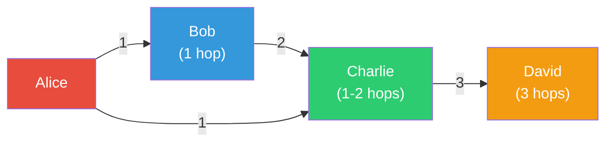

---

## Shortest Path

Find the shortest route between two nodes:

```cypher
// Single shortest path
MATCH path = shortestPath(
  (alice:Person {name: "Alice"})-[:FRIENDS_WITH*]-(david:Person {name: "David"})
)
RETURN path, length(path);

// All shortest paths (there may be multiple)
MATCH path = allShortestPaths(
  (alice:Person {name: "Alice"})-[:FRIENDS_WITH*]-(david:Person {name: "David"})
)
RETURN path;
```

---

## Path Functions

```cypher
// Extract information from paths
MATCH path = shortestPath(
  (a:Person {name: "Alice"})-[:FRIENDS_WITH*]-(d:Person {name: "David"})
)
RETURN
  length(path) AS hops,
  [node IN nodes(path) | node.name] AS people,
  [rel IN relationships(path) | type(rel)] AS relTypes;
```

**Result:**

```
hops  people                          relTypes
2     ["Alice", "Charlie", "David"]   ["FRIENDS_WITH", "FRIENDS_WITH"]
```

---

## ⚠️ Unbounded Paths

```cypher
// ❌ DANGEROUS: could traverse the entire graph
MATCH (a:Person)-[:FRIENDS_WITH*]->(b)
RETURN b;

// ✅ Always set a maximum depth
MATCH (a:Person {name: "Alice"})-[:FRIENDS_WITH*1..5]->(b)
RETURN DISTINCT b
LIMIT 100;
```

💡 **Rule of thumb**: always specify `*1..N` with a reasonable upper bound.

---

## Part 8: Advanced Cypher

Aggregations, WITH, OPTIONAL MATCH, COLLECT, CASE

---

## Aggregations

```cypher
// Count friends
MATCH (p:Person {name: "Alice"})-[:FRIENDS_WITH]->(friend)
RETURN count(friend) AS friendCount;

// Average age of friends
MATCH (p:Person {name: "Alice"})-[:FRIENDS_WITH]->(friend)
RETURN avg(friend.age) AS avgAge;

// Group by and count
MATCH (p:Person)-[:LIKES]->(product:Product)
RETURN product.name, count(p) AS likeCount
ORDER BY likeCount DESC;
```

| Function          | Description           |
| ----------------- | --------------------- |
| `count()`         | Number of items       |
| `sum()`           | Sum of values         |
| `avg()`           | Average               |
| `min()` / `max()` | Minimum / Maximum     |
| `collect()`       | Aggregate into a list |

---

## WITH Clause — Chaining Queries

`WITH` passes results from one part of a query to the next (like a pipe):

```cypher
// Find people with more than 2 friends
MATCH (p:Person)-[:FRIENDS_WITH]->(friend)
WITH p, count(friend) AS friendCount
WHERE friendCount > 2
RETURN p.name, friendCount;
```

```cypher
// Top 5 most connected people, then get their details
MATCH (p:Person)-[:FRIENDS_WITH]->(friend)
WITH p, count(friend) AS connections
ORDER BY connections DESC
LIMIT 5
RETURN p.name, p.age, connections;
```

---

## OPTIONAL MATCH — LEFT JOIN Equivalent

```cypher
// Find ALL people and their friends (even those with no friends)
MATCH (p:Person)
OPTIONAL MATCH (p)-[:FRIENDS_WITH]->(friend)
RETURN p.name, collect(friend.name) AS friends;
```

| Clause           | Behavior                             | SQL Equivalent |
| ---------------- | ------------------------------------ | -------------- |
| `MATCH`          | Must exist (filters out non-matches) | `INNER JOIN`   |
| `OPTIONAL MATCH` | Returns NULL if no match             | `LEFT JOIN`    |

---

## COLLECT and UNWIND

**COLLECT** aggregates rows into a list:

```cypher
// Get each person with a list of their friends
MATCH (p:Person)-[:FRIENDS_WITH]->(friend)
RETURN p.name, collect(friend.name) AS friends;
```

**Result:**

```
p.name    friends
"Alice"   ["Bob", "Charlie"]
"Bob"     ["Charlie"]
```

---

## UNWIND — Explode a List into Rows

```cypher
// Create multiple nodes from a list
UNWIND ["Alice", "Bob", "Charlie"] AS name
CREATE (p:Person {name: name});

// Process list items
WITH [1, 2, 3, 4, 5] AS numbers
UNWIND numbers AS n
RETURN n * 2 AS doubled;
```

---

## CASE Expressions

```cypher
// Categorize users by age
MATCH (p:Person)
RETURN p.name,
  CASE
    WHEN p.age < 18 THEN "Minor"
    WHEN p.age < 30 THEN "Young Adult"
    WHEN p.age < 65 THEN "Adult"
    ELSE "Senior"
  END AS category;
```

```cypher
// Conditional properties
MATCH (p:Person)
RETURN p.name,
  CASE p.city
    WHEN "New York" THEN "East Coast"
    WHEN "San Francisco" THEN "West Coast"
    ELSE "Other"
  END AS region;
```

---

## Part 9: Indexes & Constraints

Optimizing Query Performance

---

## Why Indexes Matter

Without an index, `MATCH (p:Person {name: "Alice"})` scans **all** Person nodes.

With an index, Neo4j jumps directly to Alice — **O(log N)** instead of **O(N)**.

```cypher
// Without index: full label scan
MATCH (p:Person {name: "Alice"})  // Scans every Person node ❌
RETURN p;

// With index: direct lookup
CREATE INDEX person_name FOR (p:Person) ON (p.name);
MATCH (p:Person {name: "Alice"})  // Index lookup ✅
RETURN p;
```

---

## Creating Indexes

```cypher
// Single property index
CREATE INDEX person_name FOR (p:Person) ON (p.name);

// Composite index (multiple properties)
CREATE INDEX person_name_age FOR (p:Person) ON (p.name, p.age);

// Full-text index (for text search)
CREATE FULLTEXT INDEX person_search
FOR (p:Person)
ON EACH [p.name, p.bio];

// List all indexes
SHOW INDEXES;

// Drop an index
DROP INDEX person_name;
```

---

## Constraints

Enforce data integrity at the database level:

```cypher
// Unique constraint (also creates an index automatically!)
CREATE CONSTRAINT person_email_unique
FOR (p:Person) REQUIRE p.email IS UNIQUE;

// Existence constraint (property must exist)
CREATE CONSTRAINT person_name_exists
FOR (p:Person) REQUIRE p.name IS NOT NULL;

// Node key (composite uniqueness)
CREATE CONSTRAINT person_key
FOR (p:Person) REQUIRE (p.name, p.email) IS NODE KEY;
```

---

## Managing Constraints

```cypher
// List all constraints
SHOW CONSTRAINTS;

// Drop a constraint
DROP CONSTRAINT person_email_unique;
```

💡 **Unique constraints automatically create indexes** — you don't need to create both.

---

## Query Profiling

Use `EXPLAIN` and `PROFILE` to understand query performance:

```cypher
// EXPLAIN: shows execution plan without running
EXPLAIN MATCH (p:Person {name: "Alice"})
RETURN p;

// PROFILE: runs query and shows actual metrics
PROFILE MATCH (p:Person {name: "Alice"})
RETURN p;
```

Look for:

- **NodeByLabelScan** → Missing index ❌
- **NodeIndexSeek** → Using index ✅
- **db hits** → Lower is better

---

## Part 10: Docker Setup

Running Neo4j Locally

---

## Docker Compose

```yaml
# docker-compose.yml
version: '3.8'

services:
  neo4j:
    image: neo4j:5-community
    ports:
      - '7474:7474' # Browser UI (HTTP)
      - '7687:7687' # Bolt protocol (driver)
    environment:
      - NEO4J_AUTH=neo4j/password123
      - NEO4J_PLUGINS=["apoc"]
    volumes:
      - neo4j_data:/data
      - neo4j_logs:/logs

volumes:
  neo4j_data:
  neo4j_logs:
```

---

## Starting Neo4j

```bash
# Start container
docker-compose up -d

# Check logs (wait for "Started." message)
docker logs neo4j -f

# Access Neo4j Browser
open http://localhost:7474

# Login: neo4j / password123
```

---

## Neo4j Browser

The built-in web UI at **http://localhost:7474**:

- Write and execute Cypher queries
- Visualize graph results as interactive node-relationship diagrams
- Browse database schema (labels, relationship types, properties)
- View query execution plans with EXPLAIN / PROFILE

---

## Cypher Shell (CLI)

```bash
# Interactive Cypher shell
docker exec -it neo4j cypher-shell -u neo4j -p password123

# Execute a Cypher file (seed data)
docker exec -i neo4j cypher-shell -u neo4j -p password123 < seed.cypher

# Run a single query
docker exec neo4j cypher-shell -u neo4j -p password123 \
  "MATCH (n) RETURN count(n) AS nodeCount;"
```

---

## Neo4j Ports

| Port     | Protocol | Purpose                           |
| -------- | -------- | --------------------------------- |
| **7474** | HTTP     | Neo4j Browser UI                  |
| **7473** | HTTPS    | Secure Browser UI                 |
| **7687** | Bolt     | Driver connections (neo4j-driver) |

💡 Your TypeScript application connects via **Bolt** on port 7687. The browser UI is just for development.

---

## Part 11: TypeScript Integration

Using neo4j-driver

---

## Installation

```bash
npm install neo4j-driver
npm install -D @types/node
```

---

## Basic Connection

```typescript
import neo4j, { Driver, Session } from 'neo4j-driver';

// Create driver (singleton — one per application)
const driver: Driver = neo4j.driver('bolt://localhost:7687', neo4j.auth.basic('neo4j', 'password123'));

// Verify connectivity
async function verifyConnection() {
  const session = driver.session();
  try {
    const result = await session.run('RETURN 1 AS num');
    console.log('Connected:', result.records[0].get('num'));
  } finally {
    await session.close();
  }
}

// Close driver on shutdown
process.on('SIGINT', async () => {
  await driver.close();
  process.exit(0);
});
```

---

## Session Lifecycle

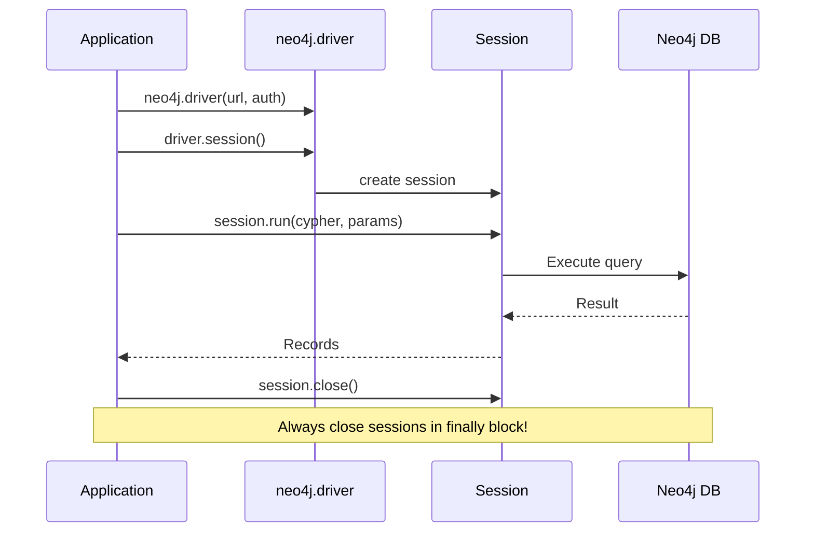

---

## Create Nodes (TypeScript)

```typescript
async function createPerson(name: string, age: number, email: string) {
  const session = driver.session();

  try {
    const result = await session.run(
      `CREATE (p:Person {name: $name, age: $age, email: $email})
       RETURN p`,
      { name, age, email },
    );

    const person = result.records[0].get('p');
    console.log('Created:', person.properties);
    return person;
  } finally {
    await session.close();
  }
}

await createPerson('Alice', 30, 'alice@example.com');
```

---

## Query Nodes (TypeScript)

```typescript
async function findPersonByName(name: string) {
  const session = driver.session();

  try {
    const result = await session.run(`MATCH (p:Person {name: $name}) RETURN p`, { name });

    if (result.records.length === 0) return null;

    return result.records[0].get('p').properties;
  } finally {
    await session.close();
  }
}

const alice = await findPersonByName('Alice');
// { name: 'Alice', age: 30, email: 'alice@example.com' }
```

---

## Create & Query Relationships (TypeScript)

```typescript
async function createFriendship(name1: string, name2: string, since: number) {
  const session = driver.session();

  try {
    const result = await session.run(
      `MATCH (a:Person {name: $name1}), (b:Person {name: $name2})
       CREATE (a)-[r:FRIENDS_WITH {since: $since}]->(b)
       RETURN r`,
      { name1, name2, since },
    );

    return result.records[0].get('r').properties;
  } finally {
    await session.close();
  }
}

async function findFriends(name: string) {
  const session = driver.session();

  try {
    const result = await session.run(
      `MATCH (p:Person {name: $name})-[:FRIENDS_WITH]->(friend)
       RETURN friend.name AS name, friend.age AS age`,
      { name },
    );

    return result.records.map((record) => ({
      name: record.get('name'),
      age: record.get('age').toNumber(),
    }));
  } finally {
    await session.close();
  }
}
```

---

## Transactions

For operations that must be atomic:

```typescript
async function transferFriendship(from: string, to: string, friend: string) {
  const session = driver.session();
  const tx = session.beginTransaction();

  try {
    // Step 1: Delete old relationship
    await tx.run(
      `MATCH (a:Person {name: $from})-[r:FRIENDS_WITH]->(f:Person {name: $friend})
       DELETE r`,
      { from, friend },
    );

    // Step 2: Create new relationship
    await tx.run(
      `MATCH (b:Person {name: $to}), (f:Person {name: $friend})
       CREATE (b)-[:FRIENDS_WITH {since: timestamp()}]->(f)`,
      { to, friend },
    );

    await tx.commit();
    console.log('Transfer complete');
  } catch (error) {
    await tx.rollback();
    console.error('Rolled back:', error);
    throw error;
  } finally {
    await session.close();
  }
}
```

---

## ⚠️ Neo4j Integers

Neo4j uses **64-bit integers** — JavaScript only supports 53-bit safely.

The driver returns `neo4j.Integer` objects, **not** regular numbers:

```typescript
import neo4j from 'neo4j-driver';

// ❌ Wrong: age is a neo4j.Integer, not a number
const age = result.records[0].get('age');
console.log(age + 1); // "[object Object]1" 😱

// ✅ Correct: convert to JavaScript number
const age = result.records[0].get('age').toNumber();
console.log(age + 1); // 31 ✅

// Creating Neo4j integers for parameters
const count = neo4j.int(1000);
```

💡 **Always call `.toNumber()`** on integer values from query results.

---

## ✅ Always Use Parameters

```typescript
// ❌ String concatenation — SQL/Cypher injection risk!
await session.run(`MATCH (p:Person {name: "${name}"}) RETURN p`);

// ✅ Parameterized query — safe!
await session.run('MATCH (p:Person {name: $name}) RETURN p', { name });
```

Parameters are:

- **Safe** against injection attacks
- **Faster** — Neo4j caches parameterized query plans
- **Required** in any production code

---

## Part 12: Use Cases — Social & Recommendations

Real-World Graph Patterns

---

## Friend Recommendations

**Problem**: Suggest friends-of-friends who aren't already friends.

```cypher
MATCH (alice:Person {name: "Alice"})-[:FRIENDS_WITH]->(friend)
      -[:FRIENDS_WITH]->(fof)
WHERE NOT (alice)-[:FRIENDS_WITH]->(fof)
  AND alice <> fof
RETURN fof.name AS recommendation,
       count(*) AS mutualFriends
ORDER BY mutualFriends DESC
LIMIT 10;
```

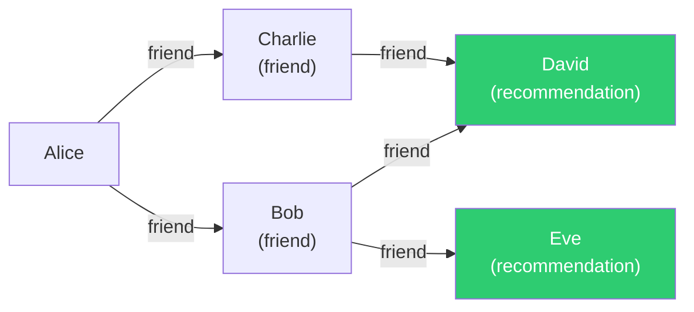

David has **2 mutual friends** → ranked higher than Eve (1 mutual).

---

## Friend Recommendations (TypeScript)

```typescript
async function getFriendRecommendations(name: string, limit: number = 10) {
  const session = driver.session();

  try {
    const result = await session.run(
      `MATCH (user:Person {name: $name})-[:FRIENDS_WITH]->(friend)
             -[:FRIENDS_WITH]->(fof)
       WHERE NOT (user)-[:FRIENDS_WITH]->(fof)
         AND user <> fof
       RETURN fof.name AS recommendation,
              count(*) AS mutualFriends
       ORDER BY mutualFriends DESC
       LIMIT $limit`,
      { name, limit: neo4j.int(limit) },
    );

    return result.records.map((record) => ({
      name: record.get('recommendation'),
      mutualFriends: record.get('mutualFriends').toNumber(),
    }));
  } finally {
    await session.close();
  }
}
```

---

## Product Recommendations (Collaborative Filtering)

**Model:**

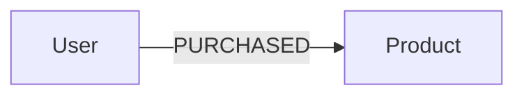

**Query**: "Users who bought X also bought Y"

```cypher
MATCH (alice:User {name: "Alice"})-[:PURCHASED]->(product:Product)
MATCH (other:User)-[:PURCHASED]->(product)
MATCH (other)-[:PURCHASED]->(rec:Product)
WHERE NOT (alice)-[:PURCHASED]->(rec)
  AND alice <> other
RETURN rec.name AS product,
       rec.price AS price,
       count(*) AS score
ORDER BY score DESC
LIMIT 10;
```

---

## Product Recommendations (TypeScript)

```typescript
async function getProductRecommendations(userName: string, limit: number = 10) {
  const session = driver.session();

  try {
    const result = await session.run(
      `MATCH (user:User {name: $userName})-[:PURCHASED]->(product:Product)
       MATCH (other:User)-[:PURCHASED]->(product)
       MATCH (other)-[:PURCHASED]->(rec:Product)
       WHERE NOT (user)-[:PURCHASED]->(rec)
         AND user <> other
       RETURN rec.name AS product, rec.price AS price,
              count(*) AS score
       ORDER BY score DESC
       LIMIT $limit`,
      { userName, limit: neo4j.int(limit) },
    );

    return result.records.map((record) => ({
      product: record.get('product'),
      price: record.get('price').toNumber(),
      score: record.get('score').toNumber(),
    }));
  } finally {
    await session.close();
  }
}
```

---

## Part 13: Use Cases — Fraud Detection & Routing

Pattern Matching at Scale

---

## Fraud Detection: Shared Identifiers

**Problem**: Find users who suspiciously share phone numbers or email addresses.

```cypher
// Create the model
CREATE
  (alice:User {name: "Alice"}),
  (bob:User {name: "Bob"}),
  (charlie:User {name: "Charlie"}),

  (phone1:Phone {number: "555-1234"}),
  (email1:Email {address: "shared@example.com"}),

  (alice)-[:HAS_PHONE]->(phone1),
  (bob)-[:HAS_PHONE]->(phone1),      // Shared phone!
  (bob)-[:HAS_EMAIL]->(email1),
  (charlie)-[:HAS_EMAIL]->(email1);   // Shared email!
```

---

## Fraud Detection Query

```cypher
// Find suspicious clusters
MATCH (u1:User)-[:HAS_PHONE|HAS_EMAIL]->(shared)
      <-[:HAS_PHONE|HAS_EMAIL]-(u2:User)
WHERE u1 <> u2
RETURN u1.name, u2.name,
       collect(DISTINCT labels(shared)) AS sharedType,
       collect(DISTINCT shared) AS sharedIdentifiers;
```

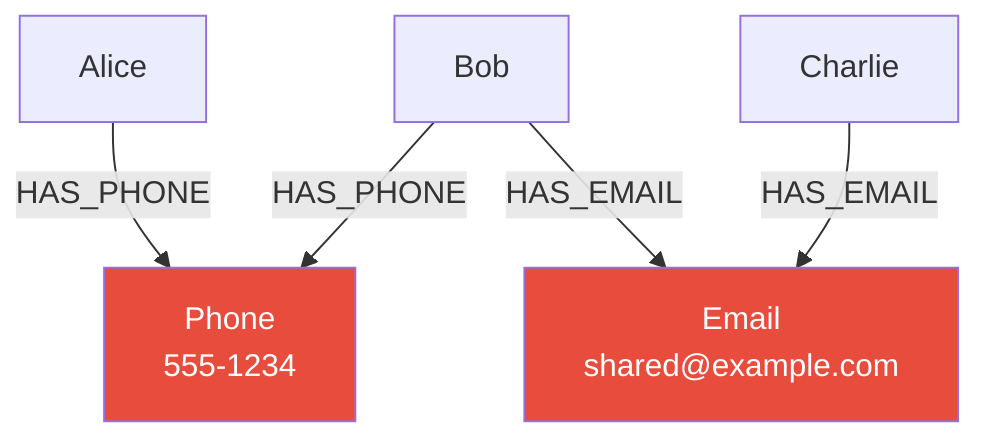

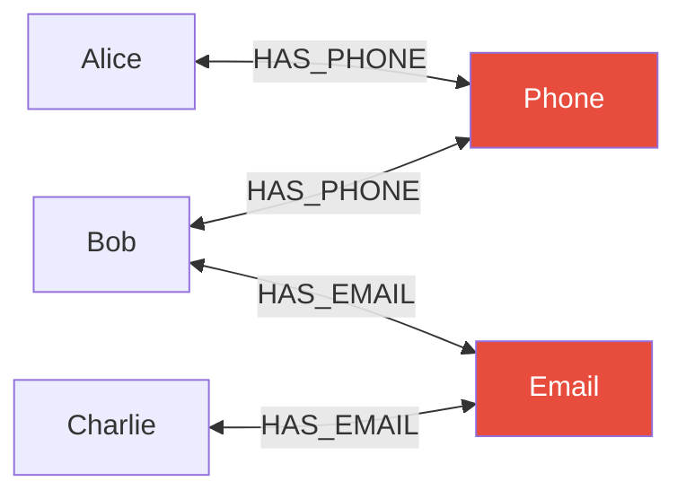

**Fraud ring detected** 🚨

---

## Multi-Hop Fraud Detection

```cypher
// Find all users connected within 3 hops via shared identifiers
MATCH path = (suspect:User {name: "Alice"})
  -[:HAS_PHONE|HAS_EMAIL*1..6]-
  (connected:User)
WHERE suspect <> connected
RETURN DISTINCT connected.name,
       length(path) AS distance;
```

💡 Graph databases excel at discovering **hidden connections** that spans multiple hops — something nearly impossible with SQL JOINs.

---

## Shortest Path Routing

**Problem**: Find the shortest route between cities.

```cypher
// Create road network
CREATE
  (nyc:City {name: "New York"}),
  (boston:City {name: "Boston"}),
  (dc:City {name: "Washington DC"}),
  (atlanta:City {name: "Atlanta"}),

  (nyc)-[:ROAD {distance: 215}]->(boston),
  (nyc)-[:ROAD {distance: 225}]->(dc),
  (dc)-[:ROAD {distance: 640}]->(atlanta),
  (boston)-[:ROAD {distance: 850}]->(atlanta);
```

---

## Shortest Path Query

```cypher
MATCH path = shortestPath(
  (start:City {name: "New York"})-[:ROAD*]-(end:City {name: "Atlanta"})
)
RETURN
  [node IN nodes(path) | node.name] AS route,
  reduce(dist = 0, rel IN relationships(path) | dist + rel.distance)
    AS totalDistance;
```

**Result:**

```
route                                     totalDistance
["New York", "Washington DC", "Atlanta"]  865
```

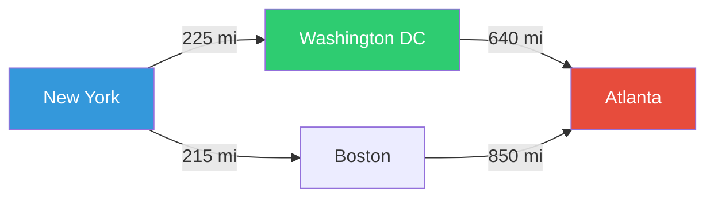

NYC → DC → Atlanta = 865 mi ✅ (shorter than NYC → Boston → Atlanta = 1065 mi)

---

## Part 14: Performance & Pitfalls

Best Practices and Common Mistakes

---

## Best Practice 1: Always Use Labels in MATCH

```cypher
// ❌ Slow: scans ALL nodes in the database
MATCH (n {name: "Alice"})
RETURN n;

// ✅ Fast: only scans Person nodes
MATCH (p:Person {name: "Alice"})
RETURN p;
```

---

## Best Practice 2: Create Indexes

```cypher
// Index frequently queried properties
CREATE INDEX person_name FOR (p:Person) ON (p.name);
CREATE INDEX person_email FOR (p:Person) ON (p.email);
CREATE INDEX product_id FOR (p:Product) ON (p.id);
```

---

## Best Practice 3: Limit Results

```cypher
// ❌ Could return millions of nodes
MATCH (p:Person)-[:FRIENDS_WITH*]->(connected)
RETURN connected;

// ✅ Bounded and limited
MATCH (p:Person {name: "Alice"})-[:FRIENDS_WITH*1..3]->(connected)
RETURN DISTINCT connected
LIMIT 100;
```

---

## Best Practice 4: Use Parameters

```typescript
// ❌ Cypher injection risk + no query plan caching
await session.run(`MATCH (p:Person {name: "${userInput}"}) RETURN p`);

// ✅ Safe, fast, always correct
await session.run('MATCH (p:Person {name: $name}) RETURN p', { name: userInput });
```

---

## Best Practice 5: Close Resources

```typescript
// ✅ Always close sessions in a finally block
const session = driver.session();
try {
  const result = await session.run('MATCH (n) RETURN count(n)');
  return result.records[0].get('count(n)').toNumber();
} finally {
  await session.close();
}

// ✅ Close driver on application shutdown
process.on('SIGINT', async () => {
  await driver.close();
  process.exit(0);
});
```

---

## Pitfall 1: Forgetting DETACH DELETE

```cypher
// ❌ Error: "Cannot delete node because it still has relationships"
MATCH (p:Person {name: "Alice"})
DELETE p;

// ✅ Use DETACH DELETE to remove node and relationships
MATCH (p:Person {name: "Alice"})
DETACH DELETE p;
```

---

## Pitfall 2: Duplicates with CREATE

```cypher
// ❌ Running this 3 times creates 3 duplicate Alices
CREATE (p:Person {name: "Alice"});

// ✅ MERGE only creates if not found
MERGE (p:Person {name: "Alice"});
```

---

## Pitfall 3: Not Converting Neo4j Integers

```typescript
// ❌ Neo4j Integer is an object, not a number
const count = result.records[0].get('count');
if (count > 10) {
  /* This comparison fails silently */
}

// ✅ Always convert with .toNumber()
const count = result.records[0].get('count').toNumber();
if (count > 10) {
  /* Works correctly */
}
```

---

## Pitfall 4: Unbounded Variable-Length Paths

```cypher
// ❌ Explodes on large graphs (exponential traversal)
MATCH (a)-[*]->(b)
RETURN b;

// ✅ Bounded with upper limit
MATCH (a)-[*1..5]->(b)
RETURN DISTINCT b
LIMIT 100;
```

---

## Part 15: Decision Framework & Key Takeaways

When to Use Neo4j

---

## When to Use Neo4j ✅

| Use Case               | Why Neo4j?                                            |
| ---------------------- | ----------------------------------------------------- |
| Social networks        | Friends-of-friends, influence paths, recommendations  |
| Recommendation engines | Collaborative filtering via graph traversal           |
| Fraud detection        | Find hidden connections across shared identifiers     |
| Knowledge graphs       | Complex interconnected entities (Wikipedia, research) |
| Network & IT ops       | Dependency graphs, impact analysis                    |
| Routing / navigation   | Shortest path, weighted traversals                    |
| Access control         | Permission hierarchies, role inheritance              |

---

## When NOT to Use Neo4j ❌

| Use Case                      | Better Alternative        |
| ----------------------------- | ------------------------- |
| Simple CRUD                   | PostgreSQL                |
| Large aggregations (SUM, AVG) | PostgreSQL / columnar DBs |
| Time-series data              | TimescaleDB / Cassandra   |
| Caching / sessions            | Redis                     |
| Full-text search              | Elasticsearch             |
| Unconnected flat data         | Any relational DB         |
| Massive write throughput      | Cassandra                 |

---

## Neo4j in a Polyglot Architecture

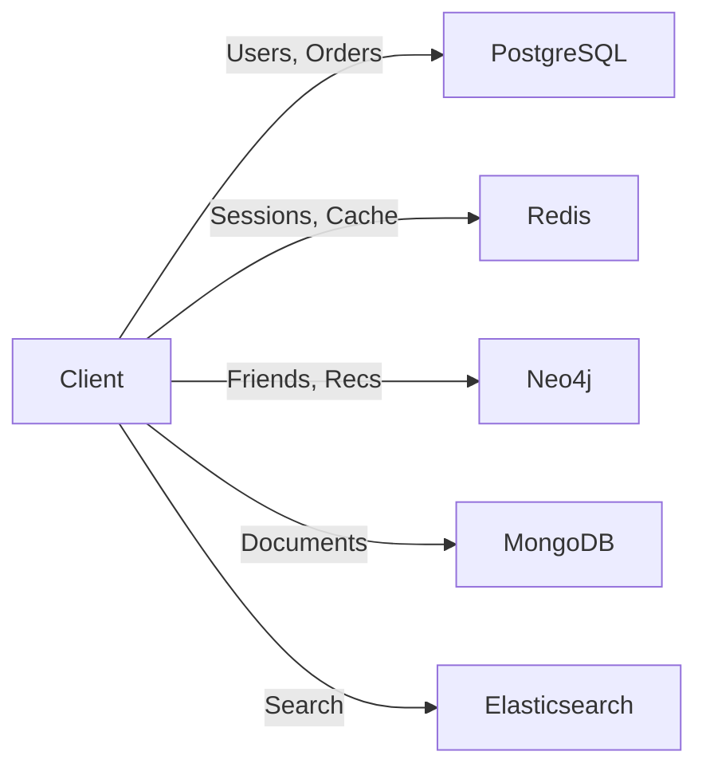

| Layer               | Database      | Why                     |
| ------------------- | ------------- | ----------------------- |
| Users & Orders      | PostgreSQL    | ACID, complex queries   |
| Sessions / Cache    | Redis         | Sub-ms speed, TTL       |
| Social Graph / Recs | **Neo4j**     | Relationship traversals |
| Product Catalog     | MongoDB       | Flexible schema         |
| Full-text Search    | Elasticsearch | Relevance ranking       |

💡 This is exactly what your **final project** demonstrates — combining 3+ databases!

---

## Quick Reference: Cypher Cheat Sheet

| Operation           | Cypher                                              |
| ------------------- | --------------------------------------------------- |
| Create node         | `CREATE (n:Label {prop: val})`                      |
| Find nodes          | `MATCH (n:Label) RETURN n`                          |
| Find by property    | `MATCH (n:Label {name: "X"}) RETURN n`              |
| Create relationship | `MATCH (a), (b) CREATE (a)-[:REL]->(b)`             |
| Upsert              | `MERGE (n:Label {prop: val})`                       |
| Update              | `MATCH (n) SET n.prop = val`                        |
| Delete node         | `MATCH (n) DETACH DELETE n`                         |
| Variable path       | `MATCH (a)-[:REL*1..3]->(b)`                        |
| Shortest path       | `shortestPath((a)-[:REL*]-(b))`                     |
| Count               | `RETURN count(n)`                                   |
| Collect into list   | `RETURN collect(n.name)`                            |
| Index               | `CREATE INDEX idx FOR (n:L) ON (n.p)`               |
| Constraint          | `CREATE CONSTRAINT FOR (n:L) REQUIRE n.p IS UNIQUE` |

---

## Key Takeaways

1. **Graph databases** store data as nodes + relationships — ideal for connected data
2. **Neo4j** uses index-free adjacency for **O(1)** per-hop traversals
3. **Cypher** uses ASCII-art patterns — readable and intuitive
4. **MATCH** finds patterns; **CREATE** inserts; **MERGE** upserts; **DETACH DELETE** removes
5. Variable-length paths (`*1..N`) replace cascading SQL JOINs
6. **Always use labels, indexes, parameters**, and bounded path depths
7. **neo4j-driver** for TypeScript — remember `.toNumber()` for integers
8. Use Neo4j for social graphs, recommendations, fraud detection, shortest paths
9. Use PostgreSQL / Redis / Cassandra for what they do better

---

## Course Wrap-Up

### Databases You've Learned

| Week | Database              | Paradigm                  |
| ---- | --------------------- | ------------------------- |
| 1-6  | **PostgreSQL**        | Relational (SQL)          |
| 7-8  | **MongoDB**           | Document Store            |
| 9-10 | **Advanced SQL**      | Transactions, Performance |
| 11   | **Redis & Cassandra** | Key-Value & Wide-Column   |
| 12   | **Neo4j**             | Graph Database            |

---

## Final Project Reminder

Your project uses **3+ databases** together:

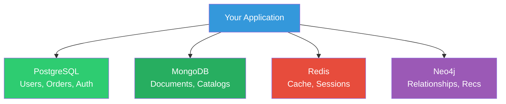

**Checkpoint #1 due next week** — have all databases set up with basic CRUD working!

---

## Thank You!

Questions?

💡 Practice Cypher in Neo4j Browser: **http://localhost:7474**
