# Week 14: Vector Databases & Event Streaming

pgvector · Kafka · Embeddings · Similarity Search · Topics · Partitions

---

## Agenda

- Vector Database Paradigm
- What Are Embeddings?
- pgvector — PostgreSQL Extension
- Similarity Metrics — Cosine, Euclidean, Inner Product
- Creating Tables with Vector Columns
- Querying Similar Vectors
- Indexing — IVFFlat & HNSW
- RAG — Retrieval-Augmented Generation

---

## Agenda (continued)

- Event Streaming Paradigm
- Kafka Architecture — Brokers, Topics, Partitions
- Producers — Publishing Events
- Consumers — Subscribing to Topics
- Consumer Groups — Parallel Processing
- Offsets & Commit Strategies
- Docker Setup — pgvector & Kafka
- TypeScript Integration — Drizzle & kafkajs
- Common Pitfalls & Best Practices
- Decision Framework & Key Takeaways

---

## Part 1: Vector Databases

A New Paradigm for AI Search

---

## What Is a Vector Database?

A vector database stores **embeddings**: numerical arrays that represent the **meaning** of data.

Instead of matching keywords, it matches **concepts**.

```
Traditional DB:   WHERE title LIKE '%database%'
Vector DB:        ORDER BY embedding <=> query_vector LIMIT 10
```

💡 If you want to find things by **meaning** rather than exact text — you want vector search.

---

## Why Not Just Use Full-Text Search?

| Query                  | Full-Text Search                         | Vector Search                                              |
| ---------------------- | ---------------------------------------- | ---------------------------------------------------------- |
| "fast car"             | Matches docs containing "fast" AND "car" | Also finds docs about "speedy vehicle", "quick automobile" |
| "happy dog"            | Exact keyword match only                 | Also finds "joyful puppy", "cheerful canine"               |
| "database performance" | Must contain those words                 | Also finds "query optimization", "index tuning"            |

Full-text search finds **words**. Vector search finds **meaning**.

---

## Use Cases for Vector Search

- **Semantic search** — find similar documents by meaning, not keywords
- **Recommendation engines** — find similar products or users
- **RAG** — Retrieval-Augmented Generation for AI chatbots
- **Image similarity** — find visually similar images
- **Anomaly detection** — find outliers in high-dimensional data

---

## pgvector vs Traditional Databases

| Aspect            | Traditional DB (PostgreSQL)   | pgvector                              |
| ----------------- | ----------------------------- | ------------------------------------- |
| **Data Type**     | Numbers, strings, dates       | Vectors (arrays of floats)            |
| **Search Method** | Exact match, pattern matching | Similarity search                     |
| **Query Type**    | `WHERE name = 'Alice'`        | `ORDER BY embedding <=> query_vector` |
| **Indexing**      | B-tree, GIN, GiST             | IVFFlat, HNSW                         |
| **Use Cases**     | Transactions, structured data | AI/ML, semantic search, RAG           |

pgvector is **not** a separate database — it's a PostgreSQL **extension**.

---

## Part 2: What Are Embeddings?

Converting Data to Numbers

---

## Embeddings — The Core Idea

**Embeddings** convert unstructured data (text, images, audio) into fixed-size numerical vectors.

```
"Hello world" → [0.023, -0.891, 0.456, ..., 0.234]
                  1536 floating-point numbers
```

Similar items get **similar vectors**. Dissimilar items get **distant vectors**.

---

## Text Embedding Example

```
"cat"    → [0.2, 0.8, -0.3, 0.5]
"kitten" → [0.3, 0.7, -0.2, 0.6]   ← close to "cat"
"car"    → [-0.8, 0.1, 0.9, -0.4]  ← far from "cat"
```

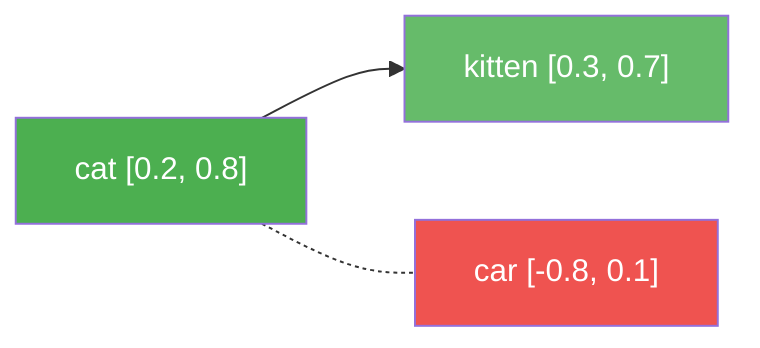

The closer the vectors, the more **semantically similar** the words.

---

## Popular Embedding Models

| Model                    | Dimensions | Provider    | Cost             |
| ------------------------ | ---------- | ----------- | ---------------- |
| `text-embedding-3-small` | 1536       | OpenAI      | ~$0.02/1M tokens |
| `text-embedding-3-large` | 3072       | OpenAI      | ~$0.13/1M tokens |
| `textembedding-gecko`    | 768        | Google      | Pay per use      |
| Sentence Transformers    | 384–768    | Open Source | Free             |

💡 For most applications, `text-embedding-3-small` (1536 dims) is the sweet spot of cost vs quality.

---

## How Embeddings Are Generated

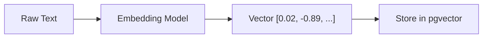

1. Send text to an embedding model (API call)
2. Receive a fixed-size array of floats
3. Store the vector alongside the original data

The model "understands" semantics and encodes meaning into numbers.

---

## Part 3: pgvector — PostgreSQL Extension

Adding Vector Search to Postgres

---

## What Is pgvector?

**pgvector** is an open-source PostgreSQL extension that adds:

- A `vector` data type for storing embeddings
- Similarity operators: `<=>`, `<->`, `<#>`
- Vector indexes: IVFFlat, HNSW
- Full SQL compatibility — joins, filters, transactions

```sql
CREATE EXTENSION vector;
```

That's it. Your existing PostgreSQL becomes a vector database.

---

## Docker Setup

```yaml
# docker-compose.yml
version: '3.8'

services:
  postgres:
    image: pgvector/pgvector:pg16
    ports:
      - '5432:5432'
    environment:
      POSTGRES_USER: postgres
      POSTGRES_PASSWORD: postgres
      POSTGRES_DB: vectordb
    volumes:
      - pgvector_data:/var/lib/postgresql/data

volumes:
  pgvector_data:
```

```bash
docker-compose up -d
psql -h localhost -U postgres -d vectordb
```

---

## Enable the Extension

```sql
-- Enable pgvector
CREATE EXTENSION vector;

-- Verify installation
SELECT * FROM pg_extension WHERE extname = 'vector';
```

| extname | extversion |
| ------- | ---------- |
| vector  | 0.7.0      |

---

## Create a Table with Vectors

```sql
CREATE TABLE documents (
  id SERIAL PRIMARY KEY,
  content TEXT NOT NULL,
  embedding vector(1536),
  created_at TIMESTAMPTZ DEFAULT NOW()
);
```

`vector(1536)` — a column that stores 1536-dimensional vectors.

The dimension **must match** your embedding model's output size.

---

## Common Dimensions

| Embedding Model                 | Dimensions | Use With       |
| ------------------------------- | ---------- | -------------- |
| OpenAI `text-embedding-3-small` | 1536       | `vector(1536)` |
| OpenAI `text-embedding-3-large` | 3072       | `vector(3072)` |
| Google `textembedding-gecko`    | 768        | `vector(768)`  |
| Sentence Transformers (MiniLM)  | 384        | `vector(384)`  |

⚠️ Dimension mismatch = error. If your model outputs 1536 floats, the column must be `vector(1536)`.

---

## Part 4: Similarity Metrics

Measuring Closeness Between Vectors

---

## Three Distance Functions

pgvector supports three ways to measure vector similarity:

| Metric              | Operator | Measures               | Range                         |
| ------------------- | -------- | ---------------------- | ----------------------------- |
| **Cosine Distance** | `<=>`    | Angle between vectors  | 0 (identical) to 2 (opposite) |
| **Euclidean (L2)**  | `<->`    | Straight-line distance | 0 to ∞                        |
| **Inner Product**   | `<#>`    | Dot product (negative) | -∞ to ∞                       |

💡 **Cosine** is the most common for text embeddings.

---

## Cosine Distance `<=>`

Measures the **angle** between two vectors. Ignores magnitude.

```sql
SELECT id, content,
       embedding <=> '[0.1, 0.2, 0.3, ...]' AS distance
FROM documents
ORDER BY distance
LIMIT 5;
```

- **0** = identical direction (most similar)
- **1** = orthogonal (unrelated)
- **2** = opposite direction

Best for: **text embeddings** (already normalized).

---

## Cosine Similarity — Visual

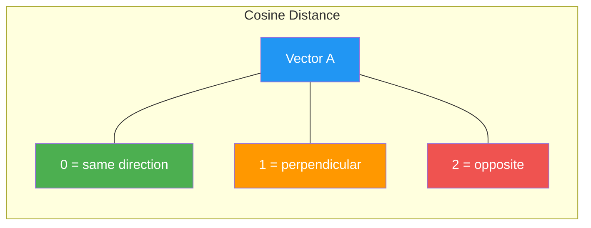

Cosine distance is **direction-based** — it doesn't care how long the vectors are, only where they point.

---

## Euclidean Distance `<->`

Measures the **straight-line** (L2) distance between two vectors.

```sql
SELECT id, content,
       embedding <-> '[0.5, 0.5, 0.5, ...]' AS distance
FROM documents
ORDER BY distance
LIMIT 5;
```

- **0** = identical vectors
- Higher = more different

Best for: **image embeddings**, non-normalized vectors.

---

## Inner Product `<#>`

Measures the **dot product** between vectors (returned as negative for ORDER BY).

```sql
SELECT id, content,
       embedding <#> '[0.3, 0.4, 0.5, ...]' AS neg_inner_product
FROM documents
ORDER BY neg_inner_product
LIMIT 5;
```

Best for: specific ML models that output unnormalized vectors.

⚠️ Rarely used in practice — prefer cosine or euclidean.

---

## Which Metric to Choose?

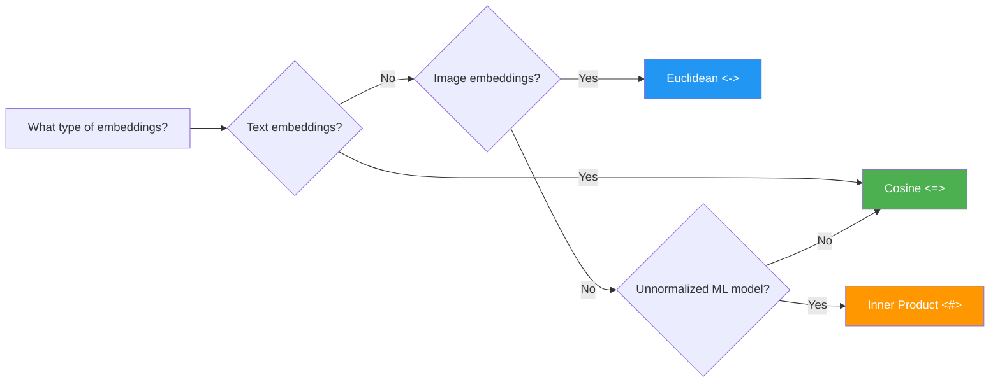

**Rule of thumb:** Start with cosine (`<=>`), switch only if needed.

---

## Part 5: Inserting & Querying Vectors

CRUD Operations for Vector Data

---

## Insert Vectors

```sql
INSERT INTO documents (content, embedding) VALUES
  ('PostgreSQL is a relational database',
   '[0.1, 0.2, 0.3, ..., 0.5]'),
  ('MongoDB is a document database',
   '[0.2, 0.3, 0.1, ..., 0.4]'),
  ('Redis is a key-value store',
   '[0.3, 0.1, 0.2, ..., 0.6]');
```

In practice, embeddings come from an API (OpenAI, Google) or local model — not hand-typed.

---

## Query: Find Similar Documents

```sql
-- Find the 5 most similar documents to a query vector
SELECT
  id,
  content,
  embedding <=> '[0.15, 0.25, 0.2, ..., 0.45]' AS distance
FROM documents
ORDER BY distance
LIMIT 5;
```

| id  | content                             | distance |
| --- | ----------------------------------- | -------- |
| 1   | PostgreSQL is a relational database | 0.12     |
| 2   | MongoDB is a document database      | 0.45     |
| 3   | Redis is a key-value store          | 0.78     |

Lower distance = more similar.

---

## Filtered Similarity Search

Combine similarity search with standard SQL `WHERE` clauses:

```sql
-- Find similar documents created in the last 7 days
SELECT id, content,
       embedding <=> '[0.1, 0.2, 0.3, ...]' AS distance
FROM documents
WHERE created_at > NOW() - INTERVAL '7 days'
ORDER BY distance
LIMIT 10;
```

This is a **major advantage** of pgvector over standalone vector databases — full SQL power.

---

## Similarity Search Pipeline


1. Convert user query to embedding
2. Compare against all stored vectors
3. Return top-K nearest neighbors

---

## Part 6: Vector Indexing — IVFFlat

Fast Approximate Search with Clustering

---

## Why Index Vectors?

Without an index, pgvector scans **every row** (brute-force):

| Rows       | Exact Search Time       |
| ---------- | ----------------------- |
| 1,000      | ~1 ms                   |
| 100,000    | ~100 ms                 |
| 1,000,000  | ~1,000 ms (1 second)    |
| 10,000,000 | ~10,000 ms (10 seconds) |

For large datasets, you need **approximate nearest neighbor** (ANN) indexes.

---

## IVFFlat — How It Works

**Inverted File with Flat Compression**

1. Cluster all vectors into `N` groups (called "lists")
2. At query time, search only the nearest clusters

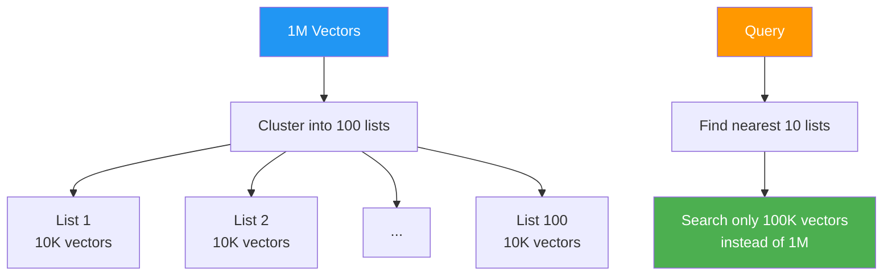

Instead of scanning 1M vectors, scan only ~100K → **10x faster**.

---

## Create IVFFlat Index

```sql
-- Create after inserting data (not before!)
CREATE INDEX ON documents
  USING ivfflat (embedding vector_cosine_ops)
  WITH (lists = 100);
```

**Parameters:**

- `vector_cosine_ops` — match the distance operator you use (`<=>`)
- `lists` — number of clusters (rule of thumb: `sqrt(rows)`)

| Rows     | Recommended lists |
| -------- | ----------------- |
| 10K–100K | 100               |
| 100K–1M  | 1,000             |
| General  | `sqrt(rows)`      |

---

## IVFFlat — Probes

Control accuracy vs speed with `probes`:

```sql
-- Default: probe 1 list (fast, less accurate)
SET ivfflat.probes = 1;

-- More probes: slower but more accurate
SET ivfflat.probes = 10;

-- Query (uses the index automatically)
SELECT * FROM documents
ORDER BY embedding <=> '[0.1, 0.2, ...]'
LIMIT 10;
```

| Probes | Speed     | Recall |
| ------ | --------- | ------ |
| 1      | Very fast | ~80%   |
| 10     | Fast      | ~95%   |
| 100    | Moderate  | ~99%   |

---

## IVFFlat — Important Rules

⚠️ **Insert data BEFORE creating the index**

```sql
-- ❌ Wrong: index first, then insert
CREATE INDEX ON docs USING ivfflat (embedding vector_cosine_ops);
INSERT INTO docs VALUES (...);  -- Poor clustering

-- ✅ Correct: insert first, then index
INSERT INTO docs VALUES (...);  -- Load all data
CREATE INDEX ON docs USING ivfflat (embedding vector_cosine_ops);
```

⚠️ **Match the operator to the index**

```sql
-- Index for cosine
CREATE INDEX ON docs USING ivfflat (embedding vector_cosine_ops);

-- ❌ Won't use index (wrong operator)
SELECT * FROM docs ORDER BY embedding <-> query;

-- ✅ Uses index (matching operator)
SELECT * FROM docs ORDER BY embedding <=> query;
```

---

## Part 7: Vector Indexing — HNSW

The Faster, More Accurate Alternative

---

## HNSW — How It Works

**Hierarchical Navigable Small World**

Builds a multi-layer graph of connected vectors:

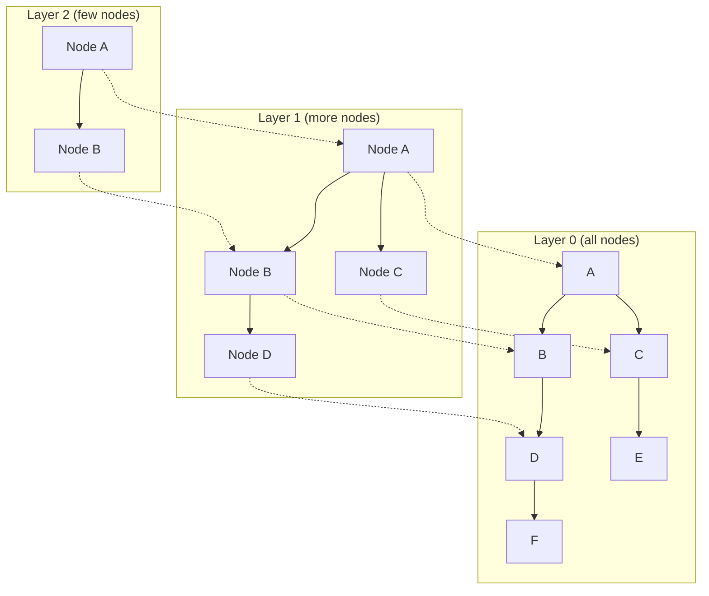

Search starts at the top layer (few nodes) and drills down to the bottom layer (all nodes).

---

## Create HNSW Index

```sql
-- Basic HNSW index
CREATE INDEX ON documents
  USING hnsw (embedding vector_cosine_ops);

-- With tuning parameters
CREATE INDEX ON documents
  USING hnsw (embedding vector_cosine_ops)
  WITH (m = 16, ef_construction = 64);
```

**Parameters:**

| Parameter         | Default | Effect                                                          |
| ----------------- | ------- | --------------------------------------------------------------- |
| `m`               | 16      | Connections per node (higher = better recall, more memory)      |
| `ef_construction` | 64      | Build-time search depth (higher = better quality, slower build) |

---

## HNSW at Query Time

```sql
-- Control query accuracy
SET hnsw.ef_search = 40;  -- Default

-- Higher ef_search = better recall, slower
SET hnsw.ef_search = 100;

SELECT * FROM documents
ORDER BY embedding <=> '[0.1, 0.2, ...]'
LIMIT 10;
```

| ef_search | Speed     | Recall |
| --------- | --------- | ------ |
| 40        | Very fast | ~98%   |
| 100       | Fast      | ~99.5% |
| 200       | Moderate  | ~99.9% |

---

## IVFFlat vs HNSW — Comparison

| Feature          | IVFFlat            | HNSW                  |
| ---------------- | ------------------ | --------------------- |
| **Speed**        | Fast (10–100x)     | Very fast (100–1000x) |
| **Recall**       | 95–99%             | 99%+                  |
| **Build Time**   | Fast               | Slower                |
| **Memory**       | Medium             | High                  |
| **Best For**     | < 1M vectors       | 1M–10M vectors        |
| **Insert Order** | Insert data first! | Any order             |
| **Update Cost**  | Rebuild required   | Incremental           |

💡 **Default choice:** HNSW (better accuracy, no insert-order constraint). Use IVFFlat if memory is limited.

---

## Choosing an Index Strategy

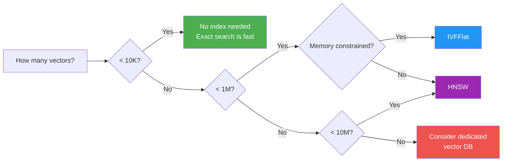

---

## Part 8: RAG — Retrieval-Augmented Generation

Making LLMs Smarter with Your Data

---

## The Problem with LLMs

Large Language Models (GPT-4, Claude, etc.) have a knowledge cutoff:

- They don't know about **your company's data**
- They can't access **private documents**
- They may **hallucinate** facts they don't know

💡 **RAG** solves this by giving the LLM relevant context before it answers.

---

## RAG Architecture


1. **Retrieve** — find relevant documents via vector search
2. **Augment** — add documents to the LLM prompt as context
3. **Generate** — LLM produces an answer grounded in your data

---

## RAG Step by Step

**Step 1: Embed and store your documents**

```sql
-- Store company docs with embeddings
INSERT INTO documents (content, embedding) VALUES
  ('Our return policy allows 30-day returns...', '[...]'),
  ('Shipping takes 3-5 business days...', '[...]'),
  ('Premium members get free shipping...', '[...]');
```

---

## RAG Step by Step (continued)

**Step 2: User asks a question**

```sql
-- Convert question to embedding, find relevant docs
SELECT content
FROM documents
ORDER BY embedding <=> '[user_question_embedding]'
LIMIT 3;
```

**Step 3: Build the augmented prompt**

```
Context:
- Our return policy allows 30-day returns...
- Shipping takes 3-5 business days...

Question: What is the return policy?

Answer based on the context above:
```

**Step 4: LLM generates an answer using the context**

---

## RAG vs Fine-Tuning

| Aspect             | RAG                          | Fine-Tuning                           |
| ------------------ | ---------------------------- | ------------------------------------- |
| **Data freshness** | Always up-to-date            | Requires retraining                   |
| **Cost**           | Cheap (just search + prompt) | Expensive (GPU training)              |
| **Accuracy**       | Good with good retrieval     | Can be better for domain tasks        |
| **Hallucination**  | Reduced (grounded in docs)   | Can still hallucinate                 |
| **Setup**          | Hours                        | Days to weeks                         |
| **Best for**       | Q&A, chatbots, search        | Style/tone changes, specialized tasks |

💡 Start with RAG. Fine-tune only if RAG isn't enough.

---

## Part 9: pgvector with Drizzle ORM

TypeScript Integration

---

## Installation

```bash
npm install drizzle-orm postgres
npm install -D drizzle-kit
npm install openai  # For generating embeddings
```

---

## Drizzle Schema

```typescript
import { pgTable, serial, text, vector, timestamp } from 'drizzle-orm/pg-core';

export const documents = pgTable('documents', {
  id: serial('id').primaryKey(),
  content: text('content').notNull(),
  embedding: vector('embedding', { dimensions: 1536 }),
  createdAt: timestamp('created_at').defaultNow(),
});

export type Document = typeof documents.$inferSelect;
export type NewDocument = typeof documents.$inferInsert;
```

`vector('embedding', { dimensions: 1536 })` — Drizzle natively supports pgvector!

---

## Database Connection

```typescript
import { drizzle } from 'drizzle-orm/postgres-js';
import postgres from 'postgres';

const client = postgres(process.env.DATABASE_URL!);
export const db = drizzle(client);
```

Standard Drizzle setup — no special configuration for pgvector.

---

## Generate Embeddings with OpenAI

```typescript
import OpenAI from 'openai';

const openai = new OpenAI({
  apiKey: process.env.OPENAI_API_KEY,
});

async function generateEmbedding(text: string): Promise<number[]> {
  const response = await openai.embeddings.create({
    model: 'text-embedding-3-small',
    input: text,
  });

  return response.data[0].embedding; // 1536 floats
}
```

One API call per text chunk. Returns an array of 1536 numbers.

---

## Insert Documents with Embeddings

```typescript
async function addDocument(content: string) {
  const embedding = await generateEmbedding(content);

  await db.insert(documents).values({
    content,
    embedding: JSON.stringify(embedding),
  });

  console.log('Document added:', content);
}

// Usage
await addDocument('PostgreSQL is a relational database');
await addDocument('MongoDB is a document database');
await addDocument('Redis is a key-value store');
```

---

## Semantic Search in Drizzle

```typescript
import { sql } from 'drizzle-orm';

async function semanticSearch(query: string, limit: number = 5) {
  const queryEmbedding = await generateEmbedding(query);
  const queryVector = JSON.stringify(queryEmbedding);

  const results = await db.execute(sql`
    SELECT id, content,
           embedding <=> ${queryVector}::vector AS distance
    FROM documents
    ORDER BY distance
    LIMIT ${limit}
  `);

  return results.rows;
}
```

Drizzle's `sql` template lets you write raw SQL with parameterized queries.

---

## Semantic Search — Example

```typescript
const results = await semanticSearch('What is a relational database?');
console.log(results);
```

```json
[
  { "id": 1, "content": "PostgreSQL is a relational database", "distance": 0.12 },
  { "id": 2, "content": "MongoDB is a document database", "distance": 0.45 },
  { "id": 3, "content": "Redis is a key-value store", "distance": 0.78 }
]
```

"Relational database" is closest to the query — even without exact word matching.

---

## RAG Implementation in TypeScript

```typescript
async function ragQuery(userQuestion: string): Promise<string> {
  // 1. Retrieve relevant documents
  const docs = await semanticSearch(userQuestion, 3);

  // 2. Build context
  const context = docs.map((d: any) => d.content).join('\n\n');

  // 3. Augmented prompt
  const prompt = `Answer using this context:

Context:
${context}

Question: ${userQuestion}

Answer:`;

  // 4. Generate with LLM
  const response = await openai.chat.completions.create({
    model: 'gpt-4',
    messages: [{ role: 'user', content: prompt }],
  });

  return response.choices[0].message.content!;
}
```

---

## Batch Insert for Performance

```typescript
// ❌ Slow: one at a time
for (const doc of docs) {
  const emb = await generateEmbedding(doc.content);
  await db.insert(documents).values({
    content: doc.content,
    embedding: JSON.stringify(emb),
  });
}

// ✅ Fast: batch generate + batch insert
const embeddings = await Promise.all(docs.map((d) => generateEmbedding(d.content)));

await db.insert(documents).values(
  docs.map((d, i) => ({
    content: d.content,
    embedding: JSON.stringify(embeddings[i]),
  })),
);
```

---

## Part 10: Event Streaming Paradigm

From Request/Response to Events

---

## What Is Event Streaming?

**Event streaming** captures, stores, and processes streams of events in real-time.

**Example Events:**

- User clicked a button
- Sensor reported temperature: 25°C
- Order placed: $99.99
- Stock price updated: $150.25

Events are **immutable facts** that happened at a point in time.

---

## Request/Response vs Event Streaming

| Aspect            | REST API (Request/Response) | Event Streaming (Kafka)                         |
| ----------------- | --------------------------- | ----------------------------------------------- |
| **Communication** | Synchronous                 | Asynchronous                                    |
| **Coupling**      | Tight (client knows server) | Loose (producers/consumers independent)         |
| **Data Flow**     | Pull (client requests)      | Push (events published)                         |
| **Scalability**   | Limited by server           | Horizontally scalable                           |
| **Durability**    | Not persisted               | Events persisted to disk                        |
| **Use Cases**     | CRUD operations             | Real-time analytics, event-driven architectures |

---

## When to Use Event Streaming

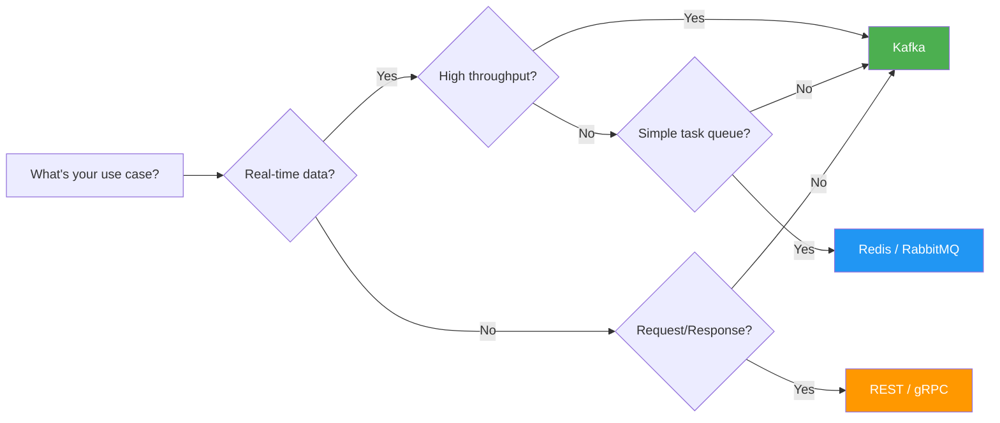

---

## Kafka vs Traditional Databases

| Aspect         | Relational DB (PostgreSQL) | Kafka                                 |
| -------------- | -------------------------- | ------------------------------------- |
| **Purpose**    | Store current state        | Stream events over time               |
| **Query**      | Random access (SELECT)     | Sequential read (consume from offset) |
| **Updates**    | UPDATE, DELETE             | Append-only (immutable)               |
| **Retention**  | Indefinite                 | Configurable (7d, 30d, infinite)      |
| **Throughput** | ~10K writes/sec            | ~1M writes/sec per partition          |
| **Latency**    | ~10 ms                     | ~2 ms                                 |

Kafka is **not** a replacement for databases — it's a **complement**.

---

## Part 11: Kafka Architecture

Topics, Partitions, and Brokers

---

## What Is Kafka?

**Apache Kafka** is a distributed event streaming platform.

- High throughput: millions of events per second
- Fault-tolerant: data replicated across brokers
- Durable: events persisted to disk
- Scalable: add brokers and partitions as needed

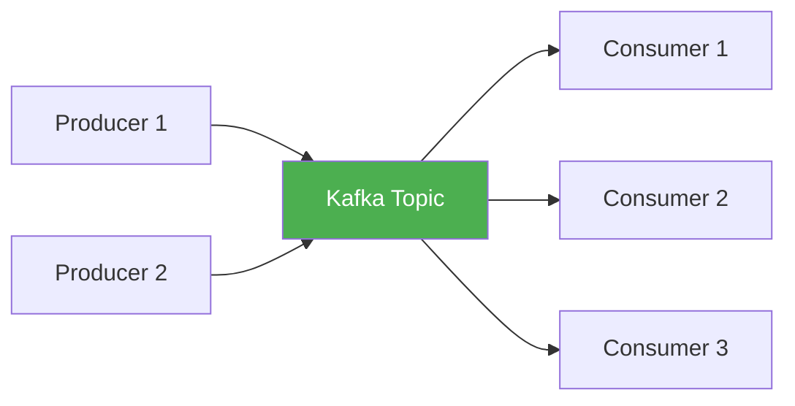

---

## Topics

A **topic** is a named stream of events (like a database table, but append-only).

**Example Topics:**

- `user-signups`
- `order-events`
- `sensor-readings`
- `payment-transactions`

**Characteristics:**

- Append-only log (events are **immutable**)
- Multi-subscriber (many consumers can read the same topic)
- Configurable retention (7 days, 30 days, forever)

---

## Partitions

Topics are divided into **partitions** for parallelism:

```
Topic: order-events (3 partitions)

Partition 0: [E1] [E4] [E7] [E10] ...
Partition 1: [E2] [E5] [E8] [E11] ...
Partition 2: [E3] [E6] [E9] [E12] ...
```

**Key Properties:**

- Each partition is **ordered** and **immutable**
- Events have **monotonically increasing offsets** within a partition
- More partitions = more **parallelism**

---

## Partition Assignment

**How do events get assigned to partitions?**

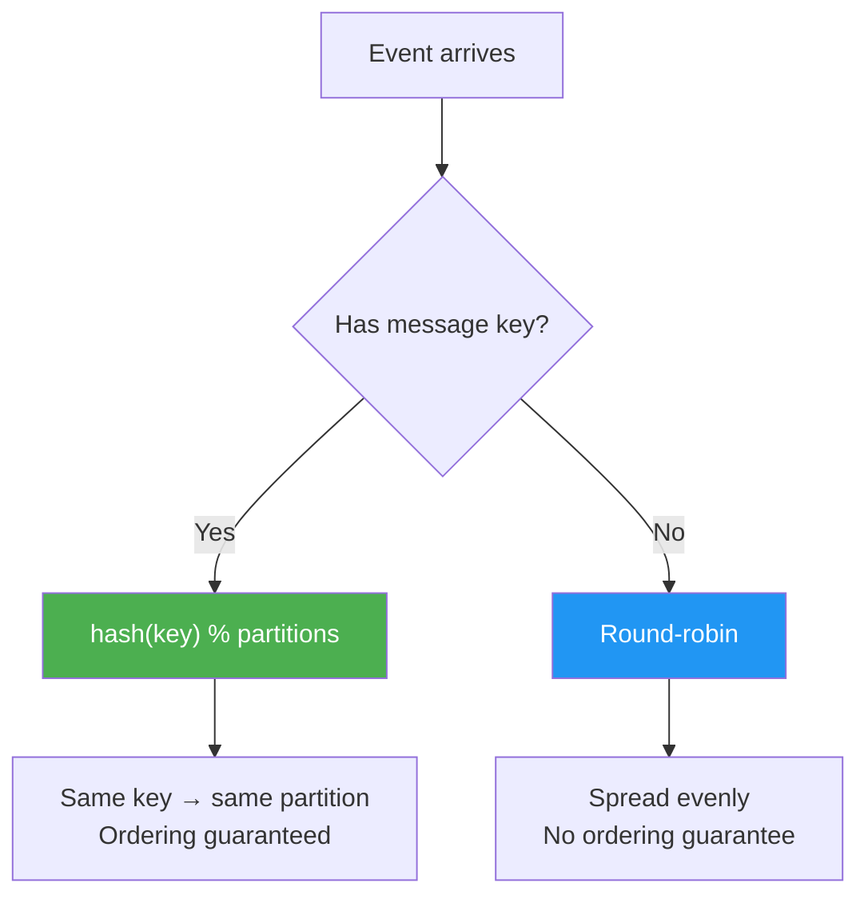

💡 **Always use message keys** when you need ordering (e.g., all events for the same user go to the same partition).

---

## Brokers

A **broker** is a Kafka server that stores and serves events.

```
Kafka Cluster (3 brokers)

Broker 1: Partition 0 (leader), Partition 2 (replica)
Broker 2: Partition 1 (leader), Partition 0 (replica)
Broker 3: Partition 2 (leader), Partition 1 (replica)
```

**Replication:**

- Each partition has **one leader** and **N-1 replicas**
- Producers/consumers talk to the **leader**
- If a leader fails → Kafka elects a new leader from replicas

---

## Kafka Cluster Architecture

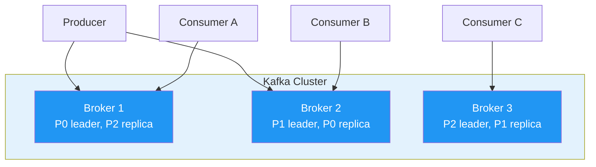

---

## Part 12: Producers

Publishing Events to Kafka

---

## What Is a Producer?

A **producer** publishes events to Kafka topics.

**Responsibilities:**

- Serialize events (JSON, Avro, Protobuf)
- Choose partition (via key hash or round-robin)
- Send events to the appropriate broker
- Handle retries and acknowledgments

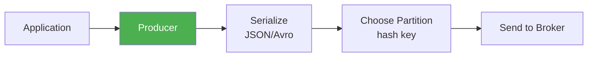

---

## Producer — Code Example

```typescript
import { Kafka } from 'kafkajs';

const kafka = new Kafka({
  clientId: 'my-app',
  brokers: ['localhost:9092'],
});

const producer = kafka.producer();

async function publishEvent(topic: string, key: string, value: any) {
  await producer.connect();

  await producer.send({
    topic,
    messages: [
      {
        key,
        value: JSON.stringify(value),
        timestamp: Date.now().toString(),
      },
    ],
  });
}
```

---

## Producer — Usage Example

```typescript
// Publish an order event
await publishEvent('order-events', 'user-123', {
  orderId: 'order-456',
  amount: 99.99,
  items: ['laptop', 'mouse'],
});

// Key = 'user-123'
// All events for user-123 go to the SAME partition
// → Ordering is guaranteed for this user

await producer.disconnect();
```

---

## Batch Producing

```typescript
async function publishBatch(topic: string, events: { key: string; value: any }[]) {
  await producer.connect();

  await producer.send({
    topic,
    messages: events.map((e) => ({
      key: e.key,
      value: JSON.stringify(e.value),
    })),
  });

  await producer.disconnect();
}

// Usage — 3 events in one batch
await publishBatch('sensor-readings', [
  { key: 'sensor-1', value: { temp: 25, humidity: 60 } },
  { key: 'sensor-2', value: { temp: 22, humidity: 55 } },
  { key: 'sensor-3', value: { temp: 28, humidity: 65 } },
]);
```

Batching reduces network round-trips → **much faster**.

---

## Part 13: Consumers

Subscribing to Topics

---

## What Is a Consumer?

A **consumer** reads events from Kafka topics and processes them.

**Responsibilities:**

- Subscribe to one or more topics
- Fetch events from assigned partitions
- Deserialize events
- Process events (save to DB, send email, etc.)
- Track **offset** (position in partition)

---

## Consumer — Code Example

```typescript
const consumer = kafka.consumer({
  groupId: 'order-processors',
});

async function consumeEvents(topic: string) {
  await consumer.connect();
  await consumer.subscribe({
    topic,
    fromBeginning: true,
  });

  await consumer.run({
    eachMessage: async ({ topic, partition, message }) => {
      const key = message.key?.toString();
      const value = JSON.parse(message.value?.toString() || '{}');

      console.log({ topic, partition, key, value });
      await processOrder(value);
    },
  });
}
```

---

## Consumer Lifecycle

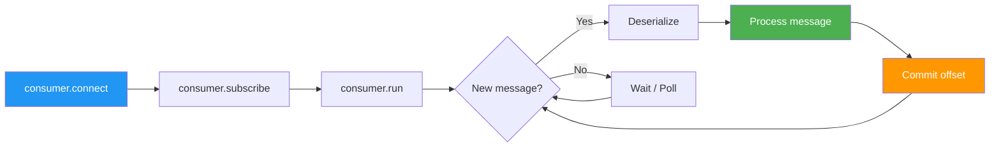

The consumer runs in an **infinite loop**, continuously polling for new events.

---

## Part 14: Consumer Groups

Parallel Processing and Load Balancing

---

## What Is a Consumer Group?

A **consumer group** is a set of consumers that cooperate to consume a topic.

**Rules:**

- Each partition is assigned to **one consumer per group**
- If a consumer fails, Kafka **rebalances** its partitions to other consumers
- Multiple groups can consume the **same topic independently**

---

## Consumer Group — Balanced

```
Topic: order-events (3 partitions)
Group: order-processors (3 consumers)

Consumer 1 → Partition 0
Consumer 2 → Partition 1
Consumer 3 → Partition 2
```

Each consumer processes events from **one partition** — perfect load balancing.

---

## Consumer Group — Imbalanced

```
Topic: order-events (3 partitions)
Group: order-processors (2 consumers)

Consumer 1 → Partition 0, Partition 1
Consumer 2 → Partition 2
```

Fewer consumers than partitions → some consumers handle **multiple partitions**.

---

## Consumer Group — Over-provisioned

```
Topic: order-events (3 partitions)
Group: order-processors (5 consumers)

Consumer 1 → Partition 0
Consumer 2 → Partition 1
Consumer 3 → Partition 2
Consumer 4 → (idle)
Consumer 5 → (idle)
```

⚠️ More consumers than partitions → some sit **idle**. Maximum parallelism = number of partitions.

---

## Multiple Consumer Groups

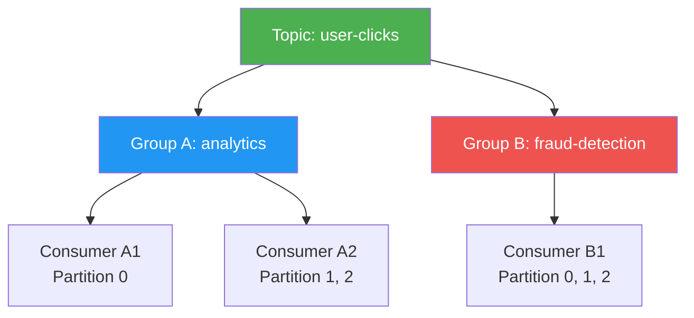

Both groups process **all events independently**. This is how you fan-out events to multiple downstream services.

---

## Consumer Group — Code

```typescript
// Analytics consumer group
const analyticsConsumer = kafka.consumer({
  groupId: 'analytics-group',
});
await analyticsConsumer.subscribe({ topic: 'user-clicks' });
await analyticsConsumer.run({
  eachMessage: async ({ message }) => {
    const click = JSON.parse(message.value?.toString() || '{}');
    console.log('[Analytics]', click);
  },
});

// Fraud detection — DIFFERENT group, SAME topic
const fraudConsumer = kafka.consumer({
  groupId: 'fraud-detection-group',
});
await fraudConsumer.subscribe({ topic: 'user-clicks' });
await fraudConsumer.run({
  eachMessage: async ({ message }) => {
    const click = JSON.parse(message.value?.toString() || '{}');
    console.log('[Fraud]', click);
  },
});
```

---

## Part 15: Offsets & Commit Strategies

Tracking What You've Already Processed

---

## What Is an Offset?

An **offset** is a sequential ID for each event within a partition:

```
Partition 0: [Event0] [Event1] [Event2] [Event3] [Event4]
Offsets:        0        1        2        3        4
                                  ↑
                        Consumer is here (offset 2)
```

- Consumers track their **current offset** per partition
- On restart, resume from the **last committed offset**
- Offsets are stored in Kafka's internal `__consumer_offsets` topic

---

## Auto-Commit (Default)

Kafka automatically commits offsets every 5 seconds.

```typescript
const consumer = kafka.consumer({
  groupId: 'my-group',
  // Auto-commit is enabled by default
});
```

**Risk:** If processing fails between auto-commits, events may be **skipped** (committed but not processed).

---

## Manual Commit

Commit only after successful processing:

```typescript
const consumer = kafka.consumer({
  groupId: 'my-group',
  autoCommit: false, // Disable auto-commit
});

await consumer.run({
  eachMessage: async ({ topic, partition, message }) => {
    // Process the event
    await processEvent(message);

    // Commit only after success
    await consumer.commitOffsets([
      {
        topic,
        partition,
        offset: (parseInt(message.offset) + 1).toString(),
      },
    ]);
  },
});
```

---

## Commit Strategy Comparison

| Strategy               | Guarantee     | Performance | Use When                   |
| ---------------------- | ------------- | ----------- | -------------------------- |
| **Auto-commit**        | At-most-once  | Best        | Events can be lost/skipped |
| **Manual per-message** | At-least-once | Slowest     | Every event matters        |
| **Manual per-batch**   | At-least-once | Good        | Throughput is important    |

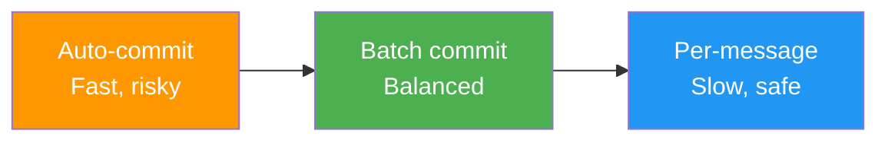

💡 For most production systems, use **manual batch commit**.

---

## Part 16: Docker Setup

Running pgvector and Kafka Locally

---

## pgvector — Docker

```yaml
# docker-compose.yml
services:
  postgres:
    image: pgvector/pgvector:pg16
    ports:
      - '5432:5432'
    environment:
      POSTGRES_USER: postgres
      POSTGRES_PASSWORD: postgres
      POSTGRES_DB: vectordb
    volumes:
      - pgvector_data:/var/lib/postgresql/data

volumes:
  pgvector_data:
```

```bash
docker-compose up -d
psql -h localhost -U postgres -d vectordb
```

```sql
CREATE EXTENSION vector;
```

---

## Kafka — Docker

```yaml
services:
  zookeeper:
    image: confluentinc/cp-zookeeper:7.5.0
    environment:
      ZOOKEEPER_CLIENT_PORT: 2181
      ZOOKEEPER_TICK_TIME: 2000
    ports:
      - '2181:2181'

  kafka:
    image: confluentinc/cp-kafka:7.5.0
    depends_on:
      - zookeeper
    ports:
      - '9092:9092'
    environment:
      KAFKA_BROKER_ID: 1
      KAFKA_ZOOKEEPER_CONNECT: zookeeper:2181
      KAFKA_ADVERTISED_LISTENERS: >-
        PLAINTEXT://localhost:9092
      KAFKA_OFFSETS_TOPIC_REPLICATION_FACTOR: 1
```

```bash
docker-compose up -d
# Wait 30 seconds for Kafka to start
```

---

## Verify Services

```bash
# Verify PostgreSQL + pgvector
psql -h localhost -U postgres -d vectordb \
  -c "CREATE EXTENSION IF NOT EXISTS vector;"
# Output: CREATE EXTENSION

# Verify Kafka
docker-compose logs kafka \
  | grep "started (kafka.server.KafkaServer)"
# Output: ... started (kafka.server.KafkaServer)
```

---

## Part 17: Use Cases

Real-World Applications

---

## Use Case 1: Semantic Search Engine

Find articles by **meaning**, not just keywords.

```typescript
async function searchDocs(query: string) {
  const results = await semanticSearch(query, 10);

  return results.map((doc: any) => ({
    title: doc.content.substring(0, 50) + '...',
    content: doc.content,
    relevance: (1 - doc.distance).toFixed(2),
  }));
}

// Query: "How to store images?"
// Returns: docs about BLOB storage, file uploads, S3
// Even if they don't contain the word "images"!
```

---

## Use Case 2: Recommendation System

Recommend similar products based on description embeddings.

```typescript
async function recommendProducts(productId: number, limit: number = 5) {
  const product = await db.execute(sql`
    SELECT embedding FROM products
    WHERE id = ${productId}
  `);

  const results = await db.execute(sql`
    SELECT id, name, description,
      embedding <=> ${product.rows[0].embedding}::vector
        AS distance
    FROM products
    WHERE id != ${productId}
    ORDER BY distance
    LIMIT ${limit}
  `);

  return results.rows;
}
```

---

## Use Case 3: Real-Time Analytics

Track user behavior with Kafka, display on dashboards.

```typescript
// Producer: track clicks
await producer.send({
  topic: 'user-clicks',
  messages: [
    {
      key: userId,
      value: JSON.stringify({
        userId,
        page: '/products',
        timestamp: new Date(),
      }),
    },
  ],
});

// Consumer: aggregate in real-time
const clickCounts = new Map<string, number>();

await consumer.run({
  eachMessage: async ({ message }) => {
    const click = JSON.parse(message.value?.toString() || '{}');
    const count = clickCounts.get(click.userId) || 0;
    clickCounts.set(click.userId, count + 1);
  },
});
```

---

## Use Case 4: Microservices Communication

Loosely coupled services communicating via events:

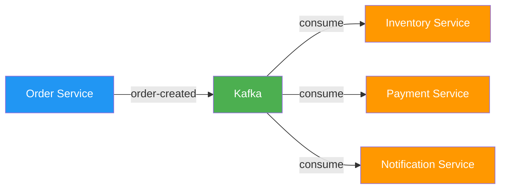

- **Order Service** publishes `order-created`
- **Inventory Service** reserves stock
- **Payment Service** charges customer
- **Notification Service** sends confirmation email

All services are **independent** and **scalable**.

---

## Use Case 5: Change Data Capture (CDC)

Stream database changes to Kafka, sync to other systems:

```typescript
// Publish database change to Kafka
async function publishChange(table: string, operation: string, data: any) {
  await producer.send({
    topic: 'database-changes',
    messages: [
      {
        key: `${table}-${data.id}`,
        value: JSON.stringify({
          table,
          operation,
          data,
          timestamp: new Date(),
        }),
      },
    ],
  });
}

// Consumer: sync to Elasticsearch
await consumer.run({
  eachMessage: async ({ message }) => {
    const change = JSON.parse(message.value?.toString() || '{}');
    if (change.operation === 'DELETE') {
      await es.delete({
        index: change.table,
        id: change.data.id,
      });
    } else {
      await es.index({
        index: change.table,
        id: change.data.id,
        body: change.data,
      });
    }
  },
});
```

---

## Use Case 6: Log Aggregation

Centralize logs from multiple microservices:

```typescript
// Logger (Producer)
async function logEvent(level: string, msg: string, meta: any) {
  await producer.send({
    topic: 'application-logs',
    messages: [
      {
        key: meta.service,
        value: JSON.stringify({
          level,
          message: msg,
          service: meta.service,
          timestamp: new Date(),
        }),
      },
    ],
  });
}

// Log Processor (Consumer)
await consumer.run({
  eachMessage: async ({ message }) => {
    const log = JSON.parse(message.value?.toString() || '{}');
    if (log.level === 'ERROR') {
      await alertTeam(log);
    }
    await es.index({ index: 'logs', body: log });
  },
});
```

---

## Part 18: Common Pitfalls & Best Practices

Mistakes to Avoid

---

## pgvector Pitfall: Dimension Mismatch

```sql
-- ❌ Table expects 1536 dimensions
CREATE TABLE docs (embedding vector(1536));

-- Inserting 3 dimensions → ERROR!
INSERT INTO docs VALUES ('[0.1, 0.2, 0.3]');
```

**Fix:** Ensure all embeddings match the schema dimension.

```sql
-- ✅ Match the model output dimension
-- OpenAI text-embedding-3-small → 1536
CREATE TABLE docs (embedding vector(1536));
```

---

## pgvector Pitfall: Index Before Data

```sql
-- ❌ Wrong: create index on empty table
CREATE INDEX ON docs
  USING ivfflat (embedding vector_cosine_ops);
INSERT INTO docs VALUES (...);
-- IVFFlat clusters are empty → poor search quality

-- ✅ Correct: load data first, then index
INSERT INTO docs VALUES (...);
-- ... insert all your data ...
CREATE INDEX ON docs
  USING ivfflat (embedding vector_cosine_ops);
```

IVFFlat needs to see the data to build meaningful clusters.

---

## pgvector Pitfall: Wrong Operator

```sql
-- Index created for cosine distance
CREATE INDEX ON docs
  USING ivfflat (embedding vector_cosine_ops);

-- ❌ Query uses L2 distance → index NOT used
SELECT * FROM docs
ORDER BY embedding <-> '[0.1, 0.2, ...]'
LIMIT 10;

-- ✅ Query uses cosine → index IS used
SELECT * FROM docs
ORDER BY embedding <=> '[0.1, 0.2, ...]'
LIMIT 10;
```

Always match the **query operator** to the **index operator class**.

---

## pgvector Pitfall: No Index on Large Tables

```sql
-- ❌ 1M rows, no index → ~1 second per query
SELECT * FROM documents
ORDER BY embedding <=> '[...]'
LIMIT 10;

-- ✅ Add HNSW index → ~1 ms per query
CREATE INDEX ON documents
  USING hnsw (embedding vector_cosine_ops);
```

Rule of thumb: add an index when you have > 10K rows.

---

## Kafka Pitfall: No Message Keys

```typescript
// ❌ No key: random partition, breaks ordering
await producer.send({
  topic: 'user-events',
  messages: [
    {
      value: JSON.stringify(event),
    },
  ],
});

// ✅ With key: same user → same partition → ordered
await producer.send({
  topic: 'user-events',
  messages: [
    {
      key: event.userId,
      value: JSON.stringify(event),
    },
  ],
});
```

Without a key, events for the same user can end up in **different partitions** — breaking ordering.

---

## Kafka Pitfall: Auto-Commit Before Processing

```typescript
// ❌ Auto-commit may commit before processing
await consumer.run({
  eachMessage: async ({ message }) => {
    await slowProcess(message);
    // If crash here, offset already committed
    // → Event lost!
  },
});

// ✅ Manual commit after successful processing
const consumer = kafka.consumer({
  groupId: 'my-group',
  autoCommit: false,
});

await consumer.run({
  eachMessage: async ({ topic, partition, message }) => {
    await slowProcess(message);
    await consumer.commitOffsets([
      {
        topic,
        partition,
        offset: (parseInt(message.offset) + 1).toString(),
      },
    ]);
  },
});
```

---

## Kafka Pitfall: Blocking Consumers

```typescript
// ❌ Slow: sequential processing blocks the loop
await consumer.run({
  eachMessage: async ({ message }) => {
    await slowDatabaseSave(message); // 100ms each
    // Next event waits 100ms
  },
});

// ✅ Fast: batch processing (careful with ordering)
await consumer.run({
  eachBatch: async ({ batch }) => {
    await Promise.all(batch.messages.map((m) => processMessage(m)));
  },
});
```

⚠️ Parallel processing within a partition breaks ordering. Use `eachBatch` only when order doesn't matter.

---

## Best Practices Summary

| Area         | Do                          | Don't                            |
| ------------ | --------------------------- | -------------------------------- |
| **pgvector** | Index after loading data    | Index empty tables               |
| **pgvector** | Match operator to index     | Mix `<=>` index with `<->` query |
| **pgvector** | Use HNSW by default         | Skip indexing on large tables    |
| **Kafka**    | Always use message keys     | Send without keys                |
| **Kafka**    | Manual commit in production | Rely on auto-commit              |
| **Kafka**    | Batch produce               | Send one event at a time         |

---

## Part 19: Performance Tips

Making Things Fast

---

## pgvector: Choose the Right Index

```sql
-- < 10K vectors: no index needed (exact search)
-- < 1M vectors and memory-constrained:
CREATE INDEX ON docs
  USING ivfflat (embedding vector_cosine_ops)
  WITH (lists = 316);  -- sqrt(100K)

-- 1M–10M vectors (default choice):
CREATE INDEX ON docs
  USING hnsw (embedding vector_cosine_ops);
```

---

## pgvector: Tune IVFFlat

```sql
-- Too few lists: fast but inaccurate
CREATE INDEX ON docs USING ivfflat (embedding vector_cosine_ops)
WITH (lists = 10);  -- ❌

-- Too many lists: accurate but slow
CREATE INDEX ON docs USING ivfflat (embedding vector_cosine_ops)
WITH (lists = 10000);  -- ❌

-- Sweet spot: sqrt(rows)
-- For 100K rows:
CREATE INDEX ON docs USING ivfflat (embedding vector_cosine_ops)
WITH (lists = 316);  -- ✅ sqrt(100000) ≈ 316
```

---

## pgvector: Control Accuracy with Probes

```sql
-- IVFFlat: search more clusters
SET ivfflat.probes = 10;  -- Default: 1

-- HNSW: search deeper
SET hnsw.ef_search = 100;  -- Default: 40

-- Then run your query
SELECT * FROM docs
ORDER BY embedding <=> '[...]'
LIMIT 10;
```

Higher probes/ef_search = better recall but slower. Tune per your accuracy needs.

---

## Kafka: Batch Producing

```typescript
// ❌ One event per network round-trip
for (const event of events) {
  await producer.send({
    topic: 'events',
    messages: [event],
  });
}

// ✅ All events in one round-trip
await producer.send({
  topic: 'events',
  messages: events,
});
```

Batching can improve throughput by **10–100x**.

---

## Kafka: Compression

```typescript
import { CompressionTypes } from 'kafkajs';

const producer = kafka.producer({
  // Enable gzip compression
  compression: CompressionTypes.GZIP,
});
```

| Codec  | Compression Ratio | CPU Cost | Best For        |
| ------ | ----------------- | -------- | --------------- |
| None   | 1x                | None     | Low latency     |
| GZIP   | High (~70%)       | High     | Small messages  |
| Snappy | Medium (~50%)     | Low      | General use     |
| LZ4    | Medium (~50%)     | Very low | High throughput |
| ZSTD   | High (~70%)       | Medium   | Best overall    |

---

## Kafka: More Partitions = More Parallelism

```typescript
await admin.createTopics({
  topics: [
    {
      topic: 'high-throughput-topic',
      numPartitions: 10,
      replicationFactor: 1,
    },
  ],
});

// Now you can have up to 10 consumers
// processing in parallel
```

⚠️ More partitions increase Kafka's memory and file handles. Start with 3–6 and scale up.

---

## Part 20: Decision Framework

When to Use What

---

## Technology Comparison

| Technology        | Type                | Best For               | Query                 | Scaling    |
| ----------------- | ------------------- | ---------------------- | --------------------- | ---------- |
| **pgvector**      | Vector DB extension | Semantic search, RAG   | SQL + `<=>`           | Vertical   |
| **Kafka**         | Event streaming     | Real-time pipelines    | Producer/Consumer API | Horizontal |
| **PostgreSQL**    | Relational DB       | Transactions, CRUD     | SQL                   | Vertical   |
| **Elasticsearch** | Search engine       | Full-text search       | Query DSL             | Horizontal |
| **Redis**         | Key-value store     | Caching, simple queues | GET/SET               | Horizontal |

---

## When to Use pgvector

✅ **Use pgvector when:**

- Semantic search (find similar by meaning)
- RAG applications (chatbots, Q&A)
- Recommendation systems
- Already using PostgreSQL (just add extension)
- < 10M vectors

❌ **Don't use pgvector when:**

- Need exact keyword search (→ Elasticsearch)
- Billions of vectors (→ Pinecone, Weaviate, Qdrant)
- Need real-time index updates at massive scale

---

## When to Use Kafka

✅ **Use Kafka when:**

- Real-time data pipelines (logs, metrics, clickstreams)
- Event-driven microservices
- Stream processing (aggregations, filtering)
- Change Data Capture (CDC)
- High throughput (> 100K events/sec)

❌ **Don't use Kafka when:**

- Request/response patterns (→ REST/gRPC)
- Simple task queues (→ Redis, RabbitMQ)
- Small-scale applications (Kafka adds complexity)
- Need ordering across ALL events (Kafka orders per partition)

---

## Decision Flowchart

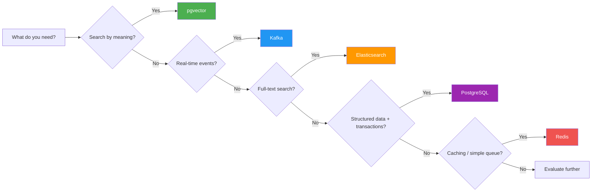

---

## Combining Technologies

In real-world systems, you often use **multiple technologies together**:

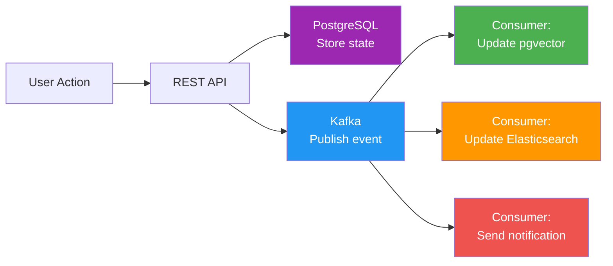

Example: User creates a product → save to PostgreSQL → publish event → Kafka consumers update the vector index, search index, and send notifications.

---

## Quick Reference: pgvector Cheat Sheet — Setup & Queries

| Operation        | SQL / Code                              |
| ---------------- | --------------------------------------- |
| Enable extension | `CREATE EXTENSION vector;`              |
| Create table     | `embedding vector(1536)`                |
| Cosine search    | `ORDER BY embedding <=> query LIMIT 10` |
| L2 search        | `ORDER BY embedding <-> query LIMIT 10` |
| Filtered search  | `WHERE created_at > ... ORDER BY <=>`   |

---

## Quick Reference: pgvector Cheat Sheet — Indexing

| Operation     | SQL / Code                                    |
| ------------- | --------------------------------------------- |
| IVFFlat index | `USING ivfflat (embedding vector_cosine_ops)` |
| HNSW index    | `USING hnsw (embedding vector_cosine_ops)`    |
| Tune IVFFlat  | `SET ivfflat.probes = 10;`                    |
| Tune HNSW     | `SET hnsw.ef_search = 100;`                   |
| Drizzle type  | `vector('col', { dimensions: 1536 })`         |

---

## Quick Reference: Kafka Cheat Sheet — Basics

| Operation       | Code                                        |
| --------------- | ------------------------------------------- |
| Create client   | `new Kafka({ clientId, brokers })`          |
| Create topic    | `admin.createTopics({ topics: [...] })`     |
| Produce event   | `producer.send({ topic, messages })`        |
| Batch produce   | `producer.send({ topic, messages: [...] })` |
| Use message key | `messages: [{ key, value }]`                |

---

## Quick Reference: Kafka Cheat Sheet — Consuming

| Operation       | Code                                                     |
| --------------- | -------------------------------------------------------- |
| Create consumer | `kafka.consumer({ groupId })`                            |
| Subscribe       | `consumer.subscribe({ topic })`                          |
| Process events  | `consumer.run({ eachMessage })`                          |
| Manual commit   | `consumer.commitOffsets([{ topic, partition, offset }])` |
| Compression     | `kafka.producer({ compression: GZIP })`                  |
| Batch process   | `consumer.run({ eachBatch })`                            |

---

## Key Takeaways

1. **pgvector** adds vector similarity search to PostgreSQL — no new database needed
2. **Embeddings** convert text/images to numerical vectors that capture **meaning**
3. **Cosine distance** (`<=>`) is the default metric for text embeddings
4. **IVFFlat** (< 1M vectors) and **HNSW** (1M–10M vectors) provide fast approximate search
5. **RAG** = Retrieve relevant docs via vector search + Generate answers with LLM
6. **Kafka** is a distributed event streaming platform for real-time data pipelines
7. **Topics → Partitions → Offsets** is the fundamental data model
8. **Consumer groups** enable parallel processing and fault tolerance
9. **Message keys** ensure ordering within a partition
10. **Manual commit** is safer than auto-commit for production systems

---

## Next Steps

1. Set up pgvector with Docker and run similarity queries
2. Generate embeddings with OpenAI and build semantic search
3. Create IVFFlat and HNSW indexes, compare performance
4. Build a simple RAG chatbot with Drizzle + pgvector
5. Start Kafka with Docker, create topics and partitions
6. Publish and consume events with kafkajs
7. Implement consumer groups for parallel processing
8. Combine pgvector + Kafka: real-time embedding pipeline

---

## References

- [pgvector GitHub](https://github.com/pgvector/pgvector)
- [OpenAI Embeddings API](https://platform.openai.com/docs/guides/embeddings)
- [Apache Kafka Documentation](https://kafka.apache.org/documentation/)
- [kafkajs](https://kafka.js.org/)
- [Drizzle ORM pgvector](https://orm.drizzle.team/)
- [readings-14.md](./readings-14.md)
