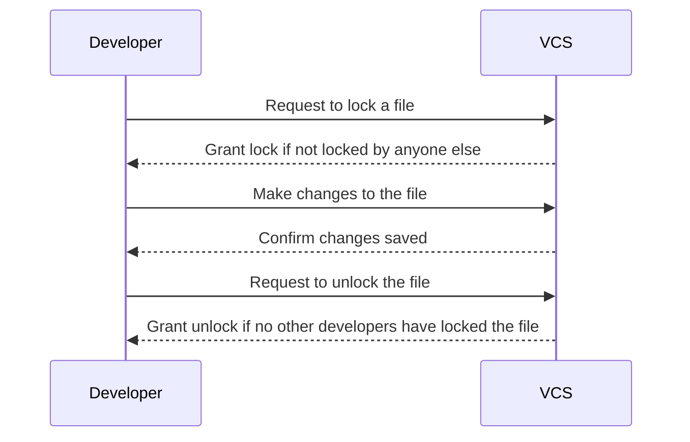
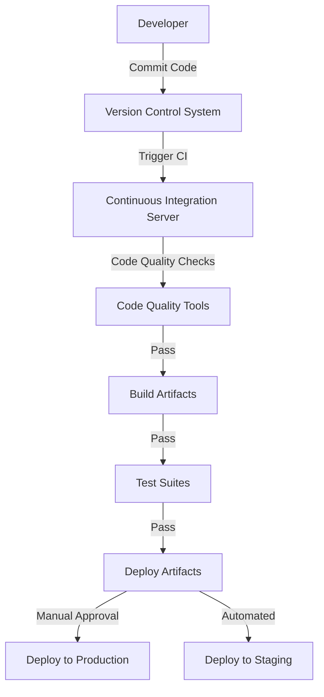

# Game Development Automation Tools

[](https://chatgpt.com/share/68d9b8f4-3194-800a-9bf7-86e7c699eb59)

---

## Why do I need to learn Automation?

- **Speed**: Automating repetitive tasks allows you to work more efficiently, freeing up time to focus on more important tasks.
- **Consistency**: Automated processes ensure that tasks are performed consistently, reducing the risk of human error.
- **Scalability**: Automation can easily scale to handle larger volumes of work, allowing you to grow your operations without increasing your workload.
- **Quality**: Automated tests help ensure that your software meets quality standards, reducing the likelihood of bugs and errors.
- **Collaboration**: Automation tools facilitate collaboration among team members, enabling them to work together more effectively.

## DevOps Philosophy

DevOps is a set of practices that combines software development (Dev) and IT operations (Ops). The goal of DevOps is to shorten the development cycle and deliver high-quality software more frequently.

Every company implements its own version of how it should work for them, but in general they follow a flow similar to this:

<blockquote class="imgur-embed-pub" lang="en" data-id="0lSuLev"><a href="https://imgur.com/0lSuLev">View post on imgur.com</a></blockquote><script async src="//s.imgur.com/min/embed.js" charset="utf-8"></script>

## Version Control Systems (VCS)

Version Control Systems (VCS) are essential tools for managing changes to source code, assets, and documentation over time. They allow developers to track modifications, collaborate effectively, and maintain a complete history of their project's evolution.

### Why Use Version Control?

- **Track Changes**: Keep a complete history of all modifications to your project
- **Collaboration**: Multiple developers can work on the same project simultaneously
- **Backup**: Your code is stored in multiple locations, reducing the risk of data loss
- **Branching**: Create separate lines of development for features, experiments, or bug fixes
- **Rollback**: Easily revert to previous versions when something goes wrong
- **Blame/Annotation**: See who made specific changes and when they were made

### Types of Version Control Systems

#### Centralized VCS
- Single central repository that all developers connect to
- Examples: Subversion (SVN), Team Foundation Server (TFS)
- Pros: Simple to understand, centralized control
- Cons: Single point of failure, requires network connection

#### Distributed VCS
- Every developer has a complete copy of the repository
- Examples: Git, Mercurial, Bazaar
- Pros: No single point of failure, works offline, flexible workflows
- Cons: More complex to understand initially

### Git

<blockquote class="reddit-embed-bq" style="height:500px" data-embed-height="740"><a href="https://www.reddit.com/r/ProgrammerHumor/comments/gtl9qy/git_checkout_memesfolder/">git checkout memes-folder</a><br> by<a href=""></a> in<a href="https://www.reddit.com/r/ProgrammerHumor/">ProgrammerHumor</a></blockquote><script async="" src="https://embed.reddit.com/widgets.js" charset="UTF-8"></script>

Git is a **distributed** version control system (VCS). It take snapshots of a tracked folder by tracking it changes by consolidating them into isolated **commits**, effectivelly creating a history of changes.

The history can **branch** and **merge** back together. This allows for parallel development and easy collaboration among multiple developers. This is useful when you want to develop a feature and while it is not stable, you will not impact and break the repo of others of your team.

For game developers using heavy assets(binary files), it is common to use Git LFS (Large File Storage) to track and store large files, such as textures, models, and audio files. This allows for efficient version control and collaboration among developers.

Git can be tricky to use if you skip the following step below. Chose your poison on how you will learn git.

#### Learn GIT

<a href="https://imgflip.com/i/a7i8cl"></a><div><a href="https://imgflip.com/memegenerator">from Imgflip Meme Generator</a></div>

::: note "Terminal Lovers"

For the ones more hardcore, I would recommend to use command line. 
1. Learn the basics here: [git scm book](https://git-scm.com/book/). This is the best resource for beginners.
2. Learn it interactively here: [learngitbranching.js.org](https://learngitbranching.js.org). This is the best practical way to learn git. It is interactive and you can see the results of your commands in real time.
3. Learn Git Flow branching model. [Atlassian Git Flow](https://www.atlassian.com/git/tutorials/comparing-workflows/gitflow-workflow) is a popular branching model that is used in many games industry.

:::

::: note "GUI Lovers"

For every one else, I would recommend you to use Git through any Git GUI Client tool. Personally I recommend GitKraken or Git Fork(both paid), but Sublime Merge is a nice free and powerful option, you may try another free option SourceTree too.

Tutorials:

- [Git Kraken Tutorials](https://www.gitkraken.com/learn/git/tutorials) although it is focused on the tool, the explanations are amazing and you can easily apply the concepts and process to any other tools. Watch everything up to the Advanced section.
- [Sublime Merge Documentation](https://www.sublimemerge.com/docs/getting_started) is focused on Sublime merge and a bit superficial.

Git Flow:

- [Git Flow on gitkraken](https://www.gitkraken.com/learn/git/git-flow) Learn git flow with GitKraken.

:::

#### Git GUI Tools

<iframe src="https://giphy.com/embed/ZgYBhq1x7L1bW" width="480" height="206" style="" frameBorder="0" class="giphy-embed" allowFullScreen></iframe><p><a href="https://giphy.com/gifs/choose-chose-wisely-ZgYBhq1x7L1bW">via GIPHY</a></p>

- [GitKraken](https://www.gitkraken.com/) is paid but but free for public and personal repos. This is my personal recommendation. The best at solving merge conflics, it even connects to AI to automate the process. Lacks Git LFS locking.
- [Git Fork](https://www.git-tower.com/students/github) Paid but it is free for students through GitHub Student Developer Pack. My choice for Git LFS locking
- [Sublime Merge](https://www.sublimemerge.com/) Arguably the best free Git GUI tool as far as I could find. Best option if you dont want bureoucratic proccess to enroll to a free version of gitkraken or git fork. It have a solid merge conflict solver.
- [GitHub Desktop](https://desktop.github.com/) Native and integrated to GitHub ecosystem, chose this if you are willing to marry with GitHub.
- [SourceTree](https://www.sourcetreeapp.com/) Solid open source git GUI tool.
- [TortoiseGit](https://tortoisegit.org/) Native and integrated to Windows ecosystem. It is really bad at solving merging conflicts. Supports Git LFS locking.

| Tool | LFS Locking | Designer-Friendly | Free Option | Best For | Merge Conflict Resolution |
|------|------------|-------------------|-------------|----------|---------------------------|
| **Fork** | ✅ Full support | Very good | ❌ Paid only | Teams needing locking | Good - Visual 3-way merge tool |
| **Tower** | ❌ Not supported | Excellent | ✅ Free for education | Design-first workflows | Excellent - Conflict Wizard with undo |
| **GitKraken** | ❌ Not supported | Excellent | ✅ Free tier (public repos) | Visual learners | **Amazing - AI-powered suggestions & explanations** |
| **SmartGit** | ✅ Full support | Moderate | ✅ Free for non-commercial | Technical designers | Very good - Advanced merge tools |
| **Sublime Merge** | ❌ Not supported | Good | ✅ Unlimited evaluation | Speed-focused developers | Good - 3-way visual editor, no AI |
| **TortoiseGit** | ✅ Full support | Basic | ✅ Completely free | Windows-only teams | Basic - External merge tool integration |
| **Sourcetree** | ❌ Not supported | Poor | ✅ Completely free | Atlassian users | Poor - Limited built-in tools |
| **GitHub Desktop** | ❌ Not supported | Good | ✅ Completely free | GitHub beginners | Basic - Simple conflict highlighting |

### Subversion (SVN)

::: note 

This section SVN is only here for completeness. You may use SVN for specific and controlled scope. But I don't see any company using it nowadays. Game companies use either git with LFS, perforce, plastic or other in-house solution.

Despite its age, Subversion is still used in many projects, especially in game development with single developers or small teams. It is a **centralized** VCS, which means that all changes are stored in a single server repository. This is useful when you want to have a single source of truth for your project.

#### Key Features of SVN:

- **Atomic Commits**: All changes in a commit either succeed or fail together
- **Directory Versioning**: Tracks changes to directory structure, not just files
- **Binary File Handling**: Better handling of binary assets compared to early Git
- **Path-based Authorization**: Fine-grained access control over different parts of the repository
- **Cheap Branching**: Branches are implemented as copies, making them lightweight

#### When to Use SVN:

- Small teams that prefer centralized workflow
- Projects with large binary assets (though Git LFS has largely addressed this)
- Organizations requiring strict access controls
- Teams that need simple, linear development workflows

### VCS Specialized for Game Workflows

Game development involves unique challenges that traditional VCS systems weren't originally designed to handle:

#### Challenges in Game Development:

- **Large Binary Assets**: Textures, models, audio files, and other assets can be hundreds of MB or GB
- **Non-Mergeable Files**: Binary files like images, 3D models, and compiled assets cannot be merged automatically
- **Asset Dependencies**: Complex relationships between assets (textures → materials → models → scenes)
- **Team Collaboration**: Artists, designers, and programmers need different workflows
- **File Locking**: Some assets need exclusive access to prevent conflicts

#### File Locking Workflow

For binary assets that cannot be merged (like 3D models, textures, or level files), a locking mechanism is essential. The workflow involves:

1. **Check Out**: Developer requests exclusive access to a file
2. **Lock**: File becomes read-only for all other team members
3. **Edit**: Developer makes changes to the locked file
4. **Check In**: Developer commits changes and releases the lock
5. **Unlock**: File becomes available for others to edit



#### Game Development VCS Tools

**Git LFS (Large File Storage) with Locking**
- Extension to Git for handling large binary files
- Provides file locking capabilities for binary assets
- Pros: Familiar Git workflow, good integration with existing Git tools
- Cons: Limited by hosting provider storage/bandwidth, complex setup for non-programmers
- Best for: Teams already using Git who need to add large asset support

**Perforce (P4)**
- Industry-standard centralized VCS used by major game studios
- Excellent binary file handling and locking mechanisms
- Advanced branching and merging capabilities
- Pros: Robust, handles massive repositories, excellent tooling
- Cons: Expensive licensing, complex setup, steep learning curve
- Best for: Large studios with complex asset pipelines

**Plastic SCM**
- Modern distributed VCS designed for game development
- Native Unity integration and visual merge tools
- Supports both centralized and distributed workflows
- Pros: Great visual tools, Unity integration, handles large binaries well
- Cons: Smaller community, licensing costs for larger teams
- Best for: Unity-based projects, teams wanting modern distributed VCS with game-specific features

::: warning "Git LFS Locking issues"

Although GitHub allow you to do that, it have a low limit both in storage and transfer. If you want to stay with git family, you will need to either pay more or host your own server via gitea, gitlab or any other.

Another issue with git lfs locking is that it is not supported by most of git GUI tools.

:::

### Git Ignores

Not all files should be tracked by version control. The `.gitignore` file tells Git which files and directories to ignore, preventing them from being accidentally committed to the repository.

#### What to Ignore:

**Build Artifacts**
- Compiled binaries (`.exe`, `.dll`, `.so`)
- Object files (`.o`, `.obj`)
- Build directories (`build/`, `bin/`, `obj/`)

**IDE and Editor Files**
- IDE configuration files (`.vscode/`, `.idea/`)
- Temporary files created by editors
- User-specific settings

**Operating System Files**
- `.DS_Store` (macOS)
- `Thumbs.db` (Windows)
- `desktop.ini` (Windows)

**Dependencies and Packages**
- `node_modules/` (Node.js)
- Package manager cache files
- Downloaded dependencies

**Sensitive Information**
- API keys and passwords
- Database connection strings
- Personal configuration files

#### Game Engine Specific Examples:

**Unity Projects:**
```gitignore
# Unity generated files
[Ll]ibrary/
[Tt]emp/
[Oo]bj/
[Bb]uild/
[Bb]uilds/
[Ll]ogs/
[Uu]ser[Ss]ettings/

# Never ignore Assets folder
!/[Aa]ssets/**

# Ignore specific Unity files
*.pidb
*.booproj
*.svd
*.userprefs
*.csproj
*.sln
*.suo
*.tmp
*.user
*.userprefs
*.pidb
*.booproj
```

**Unreal Engine Projects:**
```gitignore
# Unreal Engine files
Binaries/
DerivedDataCache/
Intermediate/
Saved/
*.VC.db
*.opensdf
*.opendb
*.sdf
*.sln
*.suo
*.xcodeproj
*.xcworkspace
```

**Godot Projects:**
```gitignore
# Godot files
.import/
export.cfg
export_presets.cfg
.mono/
data_*/
```

#### Best Practices:
- Create `.gitignore` before your first commit
- Use templates from [gitignore.io](https://gitignore.io) or [GitHub's collection](https://github.com/github/gitignore)
- Add project-specific ignores as needed
- Never ignore the `.gitignore` file itself
- Be careful not to ignore important asset files

## Git Hosting Platforms

While Git is a distributed version control system that can work without a central server, most teams use hosting platforms for collaboration, backup, and additional features.

### GitHub

[GitHub](https://github.com/) is the most popular platform for hosting Git repositories, especially for open-source projects.

**Features:**
- Unlimited public and private repositories
- Issue tracking and project management
- Pull requests and code review tools
- GitHub Actions for CI/CD
- GitHub Pages for static website hosting
- Large community and ecosystem
- Integration with many third-party tools

**Pricing:**
- Free for public repositories and small teams
- Paid plans for advanced features and larger teams
- GitHub Student Pack offers free access to many developer tools

**Best for:** Open-source projects, teams already in the GitHub ecosystem, projects needing extensive integrations

### GitLab

[GitLab](https://about.gitlab.com/) offers a complete DevOps platform with built-in CI/CD, issue tracking, and more.

**Features:**
- Built-in CI/CD pipelines
- Issue tracking and project management
- Container registry
- Security scanning and compliance tools
- Self-hosted options available
- Integrated DevOps workflow

**Pricing:**
- Free tier with generous limits
- Self-hosted community edition available
- Paid plans for advanced features

**Best for:** Teams wanting an all-in-one DevOps platform, organizations needing self-hosted solutions

### Bitbucket

[Bitbucket](https://bitbucket.org/) by Atlassian integrates well with other Atlassian tools like Jira and Confluence.

**Features:**
- Git and Mercurial support
- Integration with Atlassian ecosystem
- Built-in CI/CD with Pipelines
- Code review tools
- Issue tracking integration with Jira

**Best for:** Teams already using Atlassian tools, organizations needing Mercurial support

### Self-Hosted Options

**Gitea**
- Lightweight, self-hosted Git service
- Easy to install and maintain
- Similar interface to GitHub
- Free and open-source

**GitLab Community Edition**
- Robust feature set
- Self-hosted version of GitLab
- Full DevOps platform
- Free and open-source

### Choosing a Platform

Consider these factors when selecting a Git hosting platform:

- **Team Size**: Free tiers vary in user limits
- **Storage Needs**: Important for game projects with large assets
- **Integration Requirements**: Existing tools and workflows
- **Security Needs**: Compliance and access control requirements
- **Budget**: Pricing models and feature requirements
- **Self-Hosting**: Whether you need on-premises hosting

## Types of automation

### Automated Testing

- **Unit Testing**: Testing individual units or components of your code in isolation.
- **Integration Testing**: Testing the interaction between different components or modules of your code.
- **End to End testing**: Testing the entire application flow from start to finish.
- **Custom testing**: Writing custom tests tailored to the specific needs of your project. Ex.: you may want to create AI agents to play your game and find places where a player can get stuck in the world.

### Continuous Integration & Continuous Deployment (CI/CD)

- **Continuous Integration (CI)**: Automatically building and testing your code whenever changes are made.
- **Continuous Deployment (CD)**: Automatically deploying your code to production( or staging) after successful tests.



## GitHub Actions and Github Pages

Every major game engine has its own way of building artifacts.

I personally created a GitHub Actions workflow for Unity projects. It builds the project for WebGL. You can find the workflow in the [UnityBoilerplate](https://github.com/gameguild-gg/UnityBoilerplate) repository. This might be outdated, so if you want to receive bonus points in this class, update it, then create a merge request.

Later on, I will create a similar workflow for Godot projects, but if you want a specific boilerplate, talk to me and I will create one for you.