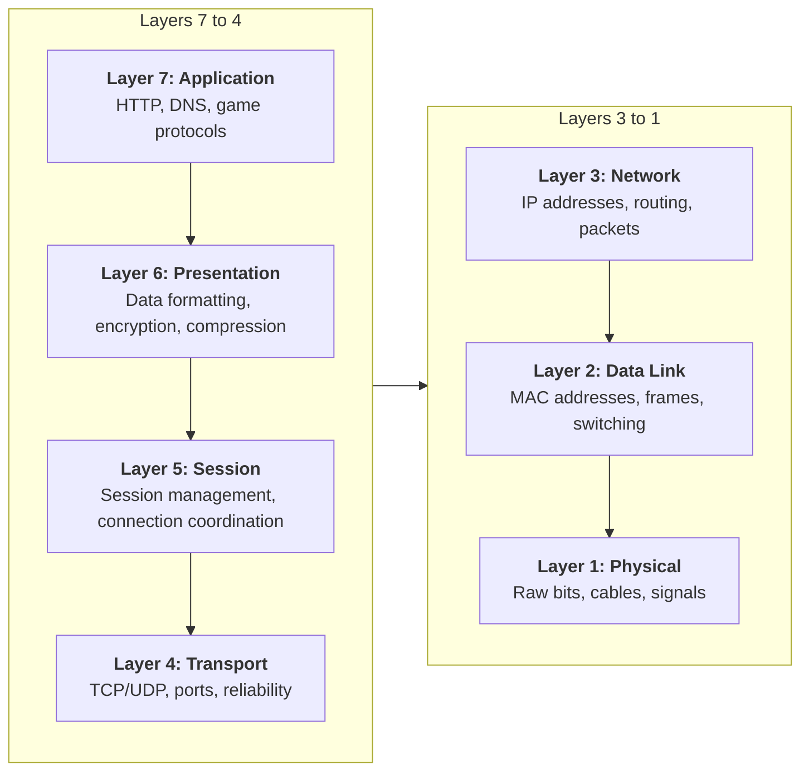
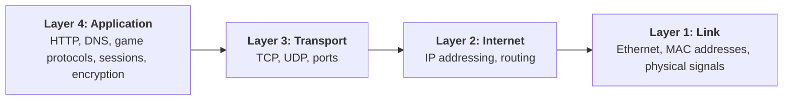
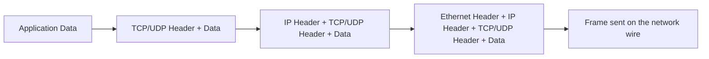
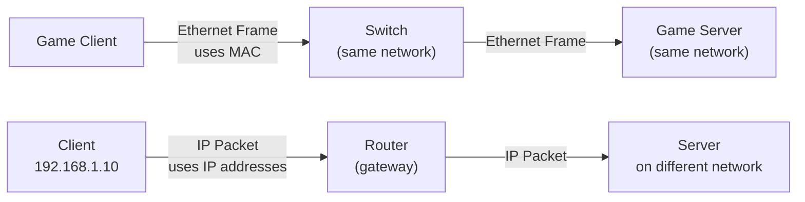

# Week 01

::: warning

This content is still work in progress.

:::

Click to expand instructor notes

Day 01:

- Instructor introduction;
- Syllabus overview. Request them to submit a github issue on the repo if they want to improve/change something on the syllabus;
- Ropos setup walkthrough;

Day 02:

- Networking basics lecture;
- Go through the readings together;
- Start setup for assignment 1.

## Repository

Read the repo through carefully, it contains all the information you need to complete the assignments.

- https://github.com/gameguild-gg/network

## Presentation

- https://gaia.cs.umass.edu/kurose_ross/ppt.php - use web archive if link is down

## Key Concepts

### The OSI Model (7 Layers)

The **Open Systems Interconnection (OSI)** model provides a framework for understanding how networks communicate:

### The TCP/IP Model (Simplified View)

The **TCP/IP model** condenses this into 4 layers, combining Session, Presentation, and Application into one:

::: tip

Comparing them together:

:::

### Encapsulation: How Data Travels Down the Stack

When data is sent, headers are added at each layer as it travels **down** the stack:

### Network Devices

Messages travel through different devices:

- **Hub** - Receives the frame and broadcast it to all physical ports (dumb, repeats everything to everyone).
- **Switch** - Uses MAC addresses to forward frames only to the correct port on the same network. On the event of a broadcast frame, it floods it to all ports.
- **Router** - Uses IP addresses to forward packets between different networks. Does not forward broadcast messages.

::: note

Routers create broadcast domain boundaries. Broadcasts propagate through hubs and switches but cannot cross routers.

:::

### Key Addresses

- **MAC Address** - Used on the same local network (48 bits, written as hex)
- **IP Address** - Used across networks (32 bits for IPv4, 128 bits for IPv6)

On the **same network**, switches use MAC addresses. To reach a **different network**, you need a router and IP addresses.

### Protocols: TCP vs UDP

| Aspect      | TCP                       | UDP                                |
| ----------- | ------------------------- | ---------------------------------- |
| Reliability | Guaranteed delivery       | No guarantee                       |
| Connection  | Connection-oriented       | Connectionless                     |
| Header Size | 20+ bytes                 | 8 bytes (have more useful space)   |
| Use Cases   | Email, web, file transfer | Video streaming, online games, DNS |

### Why Learn the OSI Model?

Even though modern developers mainly work at the Application layer, understanding lower layers helps you:

- Debug network issues (latency, packet loss, connection drops)
- Optimize performance
- Choose the right protocol for the job
- Use tools like Wireshark to inspect packets
