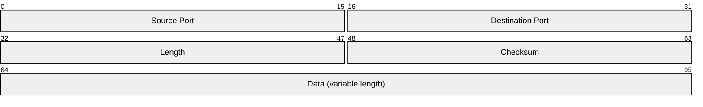
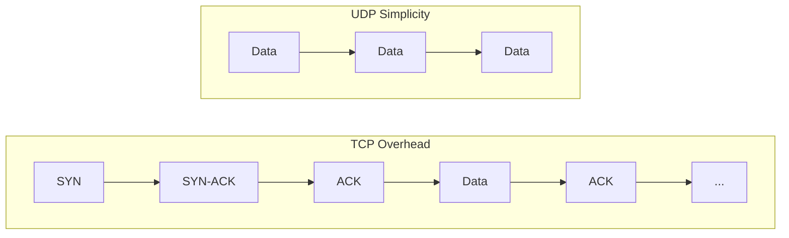
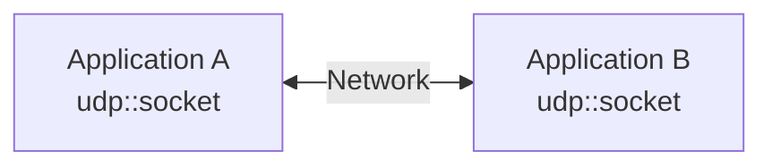
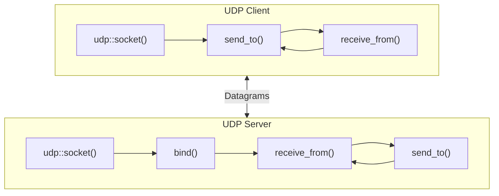
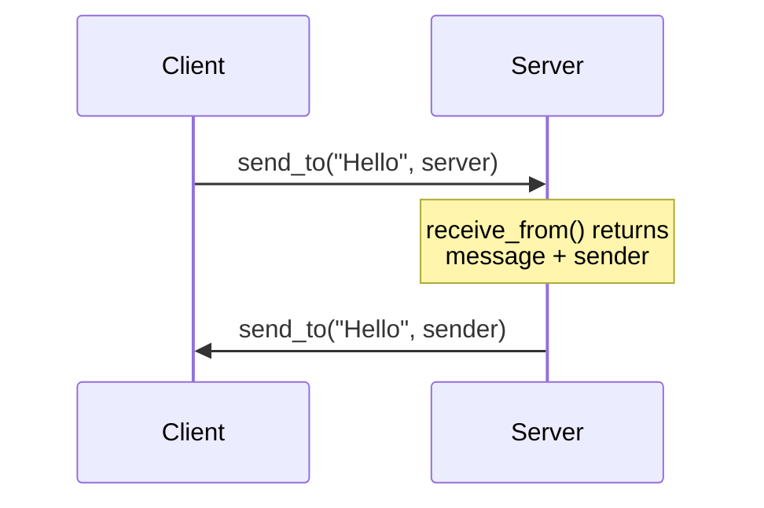
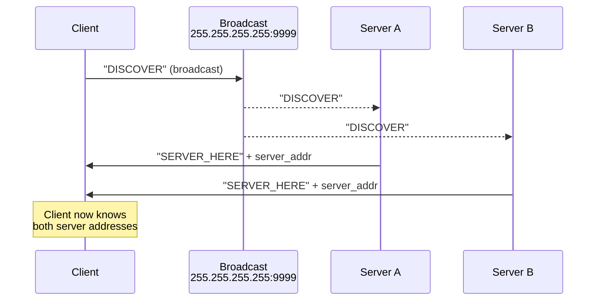
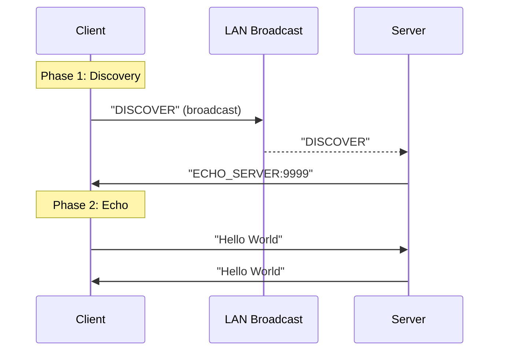

# Week 03: UDP and Datagram Sockets

<details>
<summary>Click to expand instructor notes</summary>

Day 01:

- UDP protocol deep dive: header format, checksum, no connection state
- Compare UDP vs TCP trade-offs (latency vs reliability)
- When to use UDP: games, streaming, DNS, discovery protocols
- Live Wireshark demo capturing UDP packets

Day 02:

- Berkeley sockets API introduction
- Socket wrapper design patterns for cross-platform code
- Live coding: UDP echo server/client
- Broadcast discovery pattern walkthrough
- Assignment 03 setup and boilerplate review

</details>

## UDP: User Datagram Protocol

UDP is the simplest transport-layer protocol. Defined in [RFC 768](https://datatracker.ietf.org/doc/html/rfc768) (only 3 pages!), it provides:

- **Connectionless** communication (no handshake)
- **Unreliable** delivery (no acknowledgments, no retransmission)
- **Unordered** packets (may arrive out of sequence)
- **Low overhead** (8-byte header vs TCP's 20+ bytes)

### UDP Header Format



| Field       | Size    | Description                        |
| ----------- | ------- | ---------------------------------- |
| Source Port | 16 bits | Sender's port (optional, can be 0) |
| Dest Port   | 16 bits | Receiver's port                    |
| Length      | 16 bits | Header + data length (min 8 bytes) |
| Checksum    | 16 bits | Error detection (see below)        |

### UDP Checksum

The UDP checksum verifies data integrity using the [Internet Checksum algorithm (RFC 1071)](https://datatracker.ietf.org/doc/html/rfc1071). It covers a **pseudo-header** (source/destination IP, protocol, length), the UDP header, and the entire payload.

#### Why is UDP Checksum Optional in IPv4 but Mandatory in IPv6?

This is a common question, and the answer lies in the IP layer design:

| Protocol | IP Header Checksum | UDP Checksum Requirement |
| -------- | ------------------ | ------------------------ |
| **IPv4** | ✅ Yes (covers IP header only) | Optional (can be 0) |
| **IPv6** | ❌ No | **Mandatory** |

**IPv4** includes a header checksum field that provides basic error detection at the IP layer. This checksum only covers the IP header (not the payload), but it provides *some* protection. The designers of IPv4 made UDP checksum optional because:
1. The IPv4 header checksum catches many errors
2. Some applications (like early voice/video) prioritized speed over integrity
3. Setting checksum to 0 indicated "no checksum computed"

**IPv6** removed the IP header checksum entirely for efficiency:
- Routers had to recalculate the IPv4 checksum at every hop (because TTL changes)
- This was a performance bottleneck for high-speed routers
- Modern link layers (Ethernet, WiFi) already have their own CRCs
- Removing it simplified router processing

But removing the IP checksum means **no error detection at the network layer**. To compensate, IPv6 **requires** the transport layer (UDP, TCP) to provide integrity checking. An all-zeros UDP checksum in IPv6 is **illegal** and the packet will be dropped.

::: tip "Bottom Line"
In IPv6, if you don't use the UDP checksum, there's **nothing** verifying your packet wasn't corrupted in transit. That's why it's mandatory.
:::

**As a dev, you don't need to calculate it.** The OS handles checksum computation on send and verification on receive. Corrupted packets are silently dropped before your application sees them. Modern NICs even offload this to hardware, which is why Wireshark may show "checksum incorrect" when capturing locally (the NIC computes it after the capture point).

::: warning "Not Cryptographically Secure"
The checksum detects accidental corruption, not malicious tampering. For security, use TLS/DTLS on top of UDP.
:::

### Maximum Transmission Unit (MTU)

The **MTU** is the largest packet size (in bytes) that can be transmitted over a network link without fragmentation.

| Network Type    | Typical MTU               |
| --------------- | ------------------------- |
| Ethernet        | 1500 bytes                |
| Internet (safe) | 1280 bytes (IPv6 minimum) |
| PPPoE (DSL)     | 1492 bytes                |
| Dial-up         | 576 bytes                 |
| Loopback        | 65535 bytes               |

#### Calculating Safe UDP Payload Size

```
Ethernet MTU:           1500 bytes
- IPv4 header:           -20 bytes
- UDP header:             -8 bytes
─────────────────────────────────
Safe UDP payload:       1472 bytes
```

For IPv6 or networks with options/tunneling, use a more conservative limit:

```
Safe minimum MTU:       1280 bytes (IPv6 requirement)
- IPv6 header:           -40 bytes
- UDP header:             -8 bytes
─────────────────────────────────
Conservative payload:   1232 bytes
```

::: warning "What Happens If You Exceed MTU?"

If your UDP datagram exceeds the path MTU:

1. **IPv4**: The packet gets **fragmented** into smaller pieces. If ANY fragment is lost, the entire datagram is lost. Fragmentation also adds overhead and latency.

2. **IPv6**: Fragmentation by routers is **not allowed**. The packet is dropped and an ICMPv6 "Packet Too Big" message is sent back.

For game networking, **keep UDP payloads under 1200 bytes** to be safe across all networks (VPNs, tunnels, mobile).

:::

::: tip "Why 1200 bytes for games?"

Glenn Fiedler recommends ~1200 bytes as the safe maximum:

- Works across virtually all network paths
- Avoids fragmentation entirely
- QUIC protocol (used by Google, HTTP/3) also uses 1200 bytes as its minimum MTU assumption

:::

### Why Use UDP?



| Use Case            | Why UDP?                                                                       |
| ------------------- | ------------------------------------------------------------------------------ |
| **Real-time games** | Stale data is useless; better to drop old packets than wait for retransmission |
| **Voice/Video**     | Latency matters more than perfect delivery; humans tolerate minor glitches     |
| **DNS queries**     | Simple request/response; TCP overhead not worth it for small lookups           |
| **LAN discovery**   | Broadcast/multicast only works with UDP                                        |

::: note "Glenn Fiedler's Rule"

> "If you're making a real-time game, you should use UDP, not TCP." [Glenn Fiedler, _Networking for Game Programmers_](https://gafferongames.com/post/udp_vs_tcp/)

TCP's reliability mechanisms (retransmission, ordering, congestion control) add latency that destroys real-time responsiveness. With UDP, you implement only the reliability you actually need.

:::

---

## Berkeley Sockets API

The **Berkeley sockets API** (BSD sockets) is the standard interface for network programming on Unix-like systems. Created in 1983, it's the foundation for nearly all network code today.

### What is a Socket?

A **socket** is an endpoint for communication, an object that handles network I/O:



Sockets are identified by:

- **Protocol** (TCP or UDP)
- **Local IP + Port**
- **Remote IP + Port** (for connected sockets)

### Socket Types

| Type     | Constant      | Protocol | Description                            |
| -------- | ------------- | -------- | -------------------------------------- |
| Stream   | `SOCK_STREAM` | TCP      | Reliable, ordered, connection-oriented |
| Datagram | `SOCK_DGRAM`  | UDP      | Unreliable, unordered, connectionless  |

### Core Socket Functions (UDP)



#### BSD Sockets vs Boost.Asio

| BSD Sockets                | Boost.Asio                                      |
| -------------------------- | ----------------------------------------------- |
| `socket()`                 | `udp::socket sock(io_context)`                  |
| `bind()`                   | `sock.bind(endpoint)`                           |
| `sendto()`                 | `sock.send_to(buffer, endpoint)`                |
| `recvfrom()`               | `sock.receive_from(buffer, endpoint)`           |
| `setsockopt(SO_BROADCAST)` | `sock.set_option(socket_base::broadcast(true))` |

#### 1. Create and Bind a Socket

```cpp
#include <boost/asio.hpp>
using boost::asio::ip::udp;

// IO context event loop / scheduler / dispatcher
boost::asio::io_context io_context;

// Create UDP socket and bind to port 9999
udp::socket socket(
  io_context,
  udp::endpoint(
    udp::v4(), // IPv4 address family
    9999 // port number
  )
);
```

::: tip "Boost.Asio Handles Byte Order"

Unlike raw BSD sockets where you must use `htons()` for ports, Boost.Asio handles byte order conversion automatically. The endpoint constructor takes a regular integer port.

:::

#### Alternative: Two-Step Socket Creation

Sometimes you need to configure the socket between creating and binding it (e.g., enabling broadcast). Use the two-step approach:

```cpp
// Step 1: Create socket without binding
udp::socket socket(io_context);

// Step 2: Open for IPv4
socket.open(udp::v4());

// Step 3: Configure socket options here
socket.set_option(boost::asio::socket_base::broadcast(true));

// Step 4: Bind to a port
socket.bind(udp::endpoint(udp::v4(), 9999));  // Server: fixed port
// OR
socket.bind(udp::endpoint(udp::v4(), 0));     // Client: ephemeral port
```

#### Ephemeral Ports: Let the OS Choose

Clients typically don't need a specific port, they just need _any_ available port to send and receive. You can request an **ephemeral port** by binding to port `0`:

```cpp
// Client: let the OS assign an available port
udp::socket socket(io_context, udp::endpoint(udp::v4(), 0));

// Check which port we got
std::cout << "Bound to port: " << socket.local_endpoint().port() << "\n";
// Output: "Bound to port: 52847" (or similar high port)
```

**Why use ephemeral ports?**

- **No port conflicts**: The OS guarantees an available port from its ephemeral range (typically 49152-65535)
- **Security**: Harder to predict which port a client uses
- **Simplicity**: No need to manage port allocation yourself
- **Multiple instances**: Run multiple clients without worrying about port collisions

::: note "When to Use Fixed vs Ephemeral Ports"

| Use Case              | Port Strategy                                                   |
| --------------------- | --------------------------------------------------------------- |
| **Server**            | Fixed port (e.g., 9999) so clients know where to connect        |
| **Client**            | Ephemeral port (0) since server learns it from `receive_from()` |
| **P2P/NAT traversal** | May need fixed ports for hole punching                          |

:::

#### 2. `send_to()`, Send a datagram

```cpp
std::string message = "Hello, UDP!";
udp::endpoint destination(boost::asio::ip::make_address("192.168.1.100"), 9999);

socket.send_to(boost::asio::buffer(message), destination);
//                                            ^
//                                            Destination endpoint for this packet
```

#### 3. `receive_from()`, Receive a datagram

```cpp
char buffer[1200];
udp::endpoint sender_endpoint;  // Will be filled with sender's address

size_t bytes_received = socket.receive_from(
    boost::asio::buffer(buffer), // wraps raw buffer
    sender_endpoint); // Filled with sender's address + port

std::cout << "Received " << bytes_received << " bytes from "
          << sender_endpoint.address() << ":" << sender_endpoint.port() << "\n";
```

::: note "Key Insight"

`receive_from()` tells you **who sent the packet** via the endpoint parameter. This is how a UDP server knows where to send the response, there's no connection to track!

:::

---

## UDP Echo Server Pattern

The simplest UDP server: receive a message, send it back to the sender.



### Pseudocode

```
// Server
socket = udp::socket(io_context, endpoint(udp::v4(), 9999))

loop:
    (message, sender) = socket.receive_from(buffer)
    socket.send_to(message, sender)  // Echo back

// Client
socket = udp::socket(io_context, udp::v4())
socket.send_to("Hello", server_endpoint)
(response, _) = socket.receive_from(buffer)
print(response)  // "Hello"
```

---

## Broadcast: LAN Discovery

**Broadcast** sends a packet to all hosts on the local network. Perfect for discovering servers without knowing their IP addresses.

### Broadcast Addresses

| Address           | Scope                                                       |
| ----------------- | ----------------------------------------------------------- |
| `255.255.255.255` | Limited broadcast (same subnet only, doesn't cross routers) |
| `192.168.1.255`   | Directed broadcast (subnet broadcast for 192.168.1.0/24)    |

### Enabling Broadcast

By default, sockets can't send to broadcast addresses. You must enable it:

```cpp
udp::socket socket(io_context, udp::v4());
socket.set_option(boost::asio::socket_base::broadcast(true));

// Now you can send to broadcast addresses
udp::endpoint broadcast_endpoint(
    boost::asio::ip::address_v4::broadcast(), 9999);
socket.send_to(boost::asio::buffer("DISCOVER"), broadcast_endpoint);
```

### Disabling Broadcast After Discovery

Once you've found a server, disable broadcast to prevent accidental broadcast sends:

```cpp
// After receiving response from server
socket.set_option(boost::asio::socket_base::broadcast(false));
// Now communicate directly with the discovered server
```

### Discovery Pattern



### Pseudocode

```
// Server (listening for discovery)
socket = udp::socket(io_context, endpoint(udp::v4(), 9999))

loop:
    (message, sender) = socket.receive_from(buffer)
    if message == "DISCOVER":
        socket.send_to("SERVER_HERE", sender)

// Client (discovering servers)
socket = udp::socket(io_context, udp::v4())
socket.set_option(broadcast(true))

broadcast_endpoint = endpoint(address_v4::broadcast(), 9999)
socket.send_to("DISCOVER", broadcast_endpoint)

// Collect responses (with timeout)
while not timeout:
    (response, server_endpoint) = socket.receive_from(buffer)
    if response == "SERVER_HERE":
        servers.add(server_endpoint)
```

::: warning "Broadcast Limitations"

- Only works on **local network** (doesn't cross routers)
- Some networks/firewalls block broadcast
- IPv6 uses **multicast** instead (broadcast deprecated)
- Not suitable for internet-scale discovery

:::

---

## Complete Examples

### Boost.Asio UDP Echo Server (Synchronous)

```cpp
#include <boost/asio.hpp>
#include <iostream>

using boost::asio::ip::udp;

int main() {
    boost::asio::io_context io_context;

    // Create and bind socket
    udp::socket socket(io_context, udp::endpoint(udp::v4(), 9999));

    std::cout << "Echo server listening on port 9999\n";

    char buffer[1200];
    while (true) {
        udp::endpoint sender_endpoint;

        // Receive datagram
        size_t len = socket.receive_from(
            boost::asio::buffer(buffer), sender_endpoint);

        // Echo it back
        socket.send_to(boost::asio::buffer(buffer, len), sender_endpoint);
    }
}
```

### Boost.Asio UDP Client

```cpp
#include <boost/asio.hpp>
#include <iostream>

using boost::asio::ip::udp;

int main() {
    boost::asio::io_context io_context;
    udp::socket socket(io_context, udp::v4());

    // Resolve server address
    udp::resolver resolver(io_context);
    udp::endpoint server = *resolver.resolve("localhost", "9999").begin();

    // Send message
    std::string message = "Hello, UDP!";
    socket.send_to(boost::asio::buffer(message), server);

    // Receive response
    char buffer[1200];
    udp::endpoint sender;
    size_t len = socket.receive_from(boost::asio::buffer(buffer), sender);

    std::cout << "Received: " << std::string(buffer, len) << "\n";
}
```

### Broadcast Discovery Client

```cpp
#include <boost/asio.hpp>
#include <iostream>
#include <vector>
#include <chrono>

using boost::asio::ip::udp;

int main() {
    boost::asio::io_context io_context;

    // Create socket and enable broadcast
    udp::socket socket(io_context, udp::v4());
    socket.set_option(boost::asio::socket_base::broadcast(true));

    // Send discovery broadcast
    udp::endpoint broadcast_endpoint(
        boost::asio::ip::address_v4::broadcast(), 9999);
    socket.send_to(boost::asio::buffer("DISCOVER"), broadcast_endpoint);

    std::cout << "Sent discovery broadcast, waiting for responses...\n";

    // Set socket to non-blocking for timeout handling
    socket.non_blocking(true);

    // Collect responses for 2 seconds
    std::vector<udp::endpoint> servers;
    char buffer[1200];
    auto start = std::chrono::steady_clock::now();

    while (std::chrono::steady_clock::now() - start < std::chrono::seconds(2)) {
        udp::endpoint sender;
        boost::system::error_code ec;

        size_t len = socket.receive_from(
            boost::asio::buffer(buffer), sender, 0, ec);

        if (!ec && len > 0) {
            std::string response(buffer, len);
            if (response.find("ECHO_SERVER") != std::string::npos) {
                std::cout << "Found server at " << sender << "\n";
                servers.push_back(sender);
            }
        }
    }

    std::cout << "Discovery complete. Found " << servers.size() << " server(s).\n";
}
```

---

## Common Pitfalls

### 1. Buffer Too Small

UDP datagrams are atomic. If your buffer is smaller than the incoming datagram, **data is truncated**.

```cpp
// Risky - might truncate large datagrams
char buffer[64];

// Safer - accommodate MTU
char buffer[1500]; // ethernet MTU

// Or use a constant
constexpr size_t MAX_UDP_PAYLOAD = 1200;  // Safe for all networks
char buffer[MAX_UDP_PAYLOAD];
```

### 2. Not Handling `receive_from()` Blocking

`receive_from()` blocks forever by default. For discovery with timeout, use non-blocking mode:

```cpp
// Option 1: Non-blocking socket with polling
socket.non_blocking(true);

boost::system::error_code ec;
size_t len = socket.receive_from(boost::asio::buffer(buffer), sender, 0, ec);

if (ec == boost::asio::error::would_block) {
    // No data available yet - not an error
}

// Option 2: Use async operations with deadline timer (preferred for complex apps)
// See Boost.Asio async tutorials https://www.boost.org/doc/libs/latest/doc/html/boost_asio/tutorial.html
```

### 3. Broadcast Without Enabling the Option

```cpp
// This will throw an exception!
udp::endpoint broadcast(boost::asio::ip::address_v4::broadcast(), 9999);
socket.send_to(boost::asio::buffer("test"), broadcast);  // Error!

// Must enable broadcast first
socket.set_option(boost::asio::socket_base::broadcast(true));
socket.send_to(boost::asio::buffer("test"), broadcast);  // Works!
```

### 4. Forgetting to Handle Errors

```cpp
// Bad - ignores errors (throws on failure)
socket.send_to(boost::asio::buffer(message), endpoint);

// Good - handle errors explicitly
boost::system::error_code ec;
socket.send_to(boost::asio::buffer(message), endpoint, 0, ec);
if (ec) {
    std::cerr << "Send failed: " << ec.message() << "\n";
}
```

---

## Assignment Preview: UDP Echo with Discovery

This week you'll implement:

1. **UDP Echo Server**, listens on a port, echoes back any received message
2. **UDP Echo Client**, sends a message, receives the echo
3. **Broadcast Discovery**, client broadcasts to find servers on the LAN
4. **Extra**: Implement a chat room that will send a received message to all "connected" clients;


