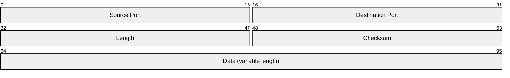
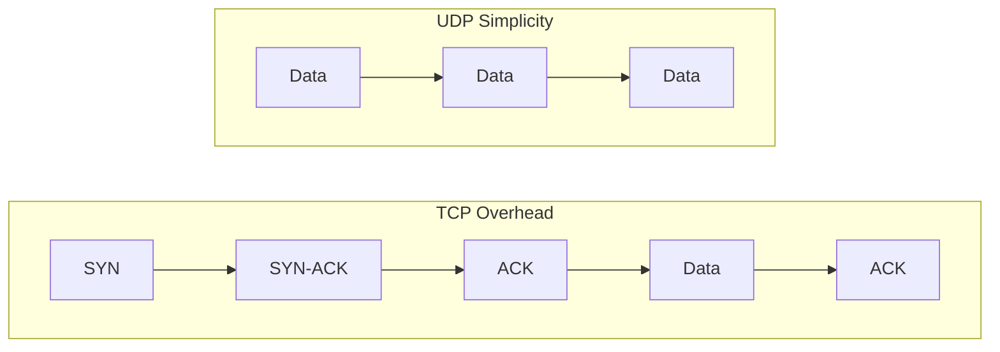
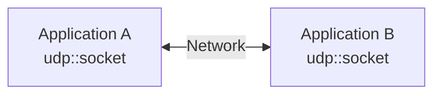
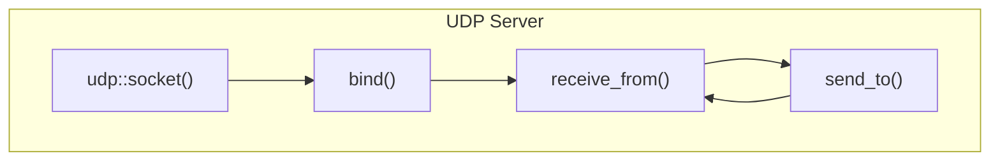
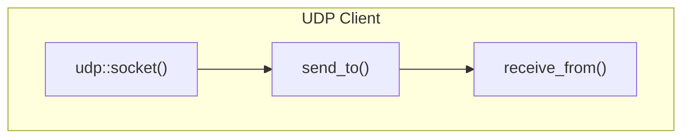
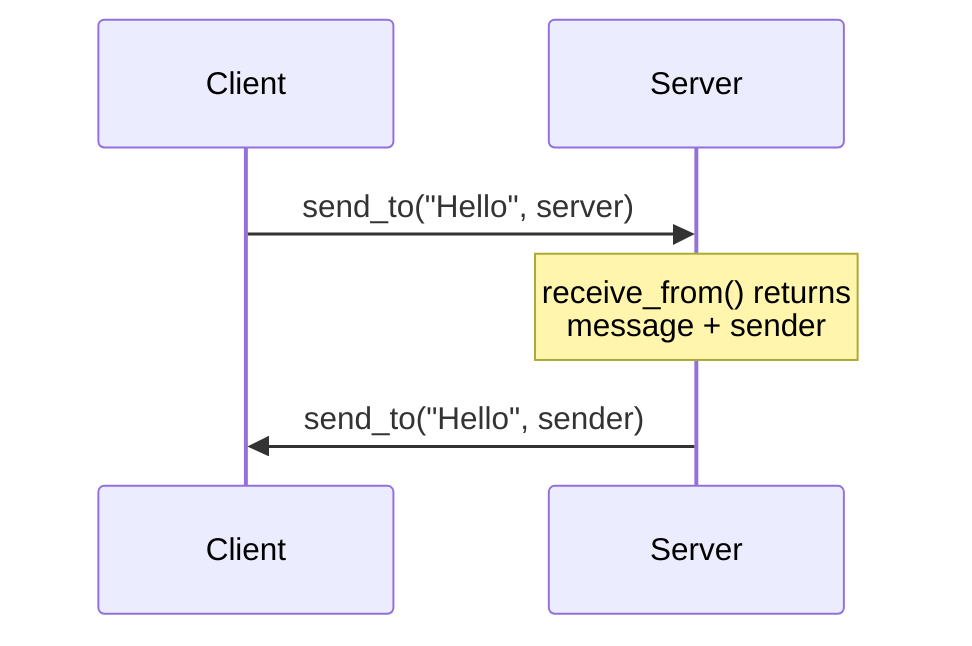
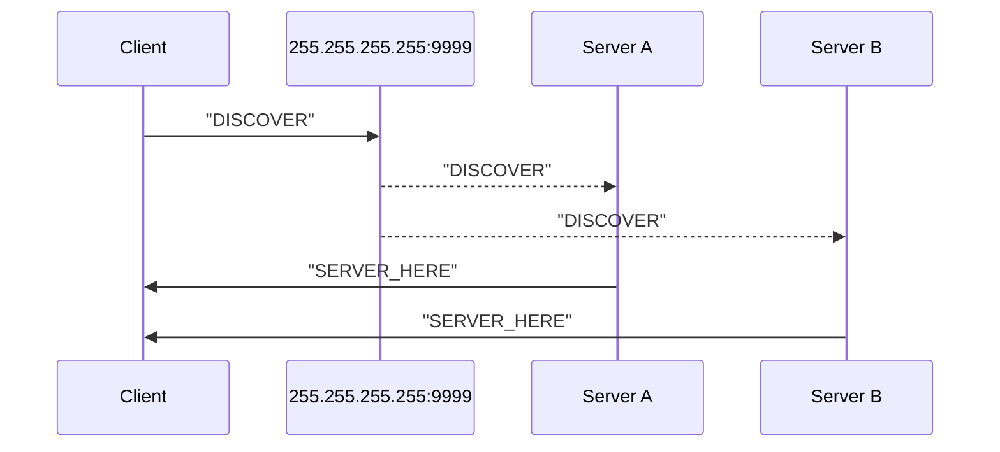

# Week 03: UDP and Datagram Sockets

---

## Today's Agenda

1. UDP Protocol Deep Dive
2. Berkeley Sockets API
3. UDP Echo Server Pattern
4. Broadcast & LAN Discovery
5. Assignment Preview

---

## UDP: User Datagram Protocol

<!-- .slide: data-auto-animate -->

Defined in **RFC 768** (only 3 pages!)

---

## UDP Characteristics

<!-- .slide: data-auto-animate -->

- **Connectionless** - no handshake
- **Unreliable** - no ACKs, no retransmission
- **Unordered** - packets may arrive out of sequence
- **Low overhead** - 8-byte header

---

## UDP Header Format

<!-- .slide: data-auto-animate -->



---

## UDP Header Fields

<!-- .slide: data-auto-animate -->

| Field       | Size    | Description                        |
| ----------- | ------- | ---------------------------------- |
| Source Port | 16 bits | Sender's port (optional, can be 0) |
| Dest Port   | 16 bits | Receiver's port                    |
| Length      | 16 bits | Header + data length (min 8 bytes) |
| Checksum    | 16 bits | Error detection                    |

---

## UDP Checksum

<!-- .slide: data-auto-animate -->

- Verifies data integrity (RFC 1071)
- Covers pseudo-header + UDP header + payload
- **IPv4**: Optional
- **IPv6**: Mandatory

---

## Why Optional in IPv4, Mandatory in IPv6?

<!-- .slide: data-auto-animate -->

| Protocol | IP Header Checksum | UDP Checksum |
| -------- | ------------------ | ------------ |
| **IPv4** | ✅ Yes | Optional |
| **IPv6** | ❌ No  | **Mandatory** |

---

## IPv4: Has IP Header Checksum

<!-- .slide: data-auto-animate -->

- IPv4 header includes a 16-bit checksum
- Provides *some* error detection at IP layer
- UDP checksum was made optional for speed
- Setting checksum = 0 means "not computed"

---

## IPv6: No IP Header Checksum

<!-- .slide: data-auto-animate -->

Why remove it?

- Routers recalculated checksum at **every hop** (TTL changes)
- Performance bottleneck for high-speed routing
- Link layers (Ethernet, WiFi) already have CRCs

**Result:** Transport layer **must** provide integrity checking

---

## The Bottom Line

<!-- .slide: data-auto-animate -->

> In IPv6, if UDP doesn't checksum, **nothing** verifies integrity!

That's why IPv6 makes UDP checksum **mandatory**.

All-zeros checksum in IPv6 = packet dropped.

---

## Checksum: Developer Perspective

<!-- .slide: data-auto-animate -->

**You don't calculate it!**

- OS handles computation on send
- OS verifies on receive
- Corrupted packets silently dropped
- Modern NICs offload to hardware

---

## Maximum Transmission Unit (MTU)

<!-- .slide: data-auto-animate -->

Largest packet size without fragmentation

| Network Type    | Typical MTU |
| --------------- | ----------- |
| Ethernet        | 1500 bytes  |
| Internet (safe) | 1280 bytes  |
| PPPoE (DSL)     | 1492 bytes  |
| Loopback        | 65535 bytes |

---

## Calculating Safe UDP Payload

<!-- .slide: data-auto-animate -->

```text
Ethernet MTU:           1500 bytes
- IPv4 header:           -20 bytes
- UDP header:             -8 bytes
─────────────────────────────────
Safe UDP payload:       1472 bytes
```

---

## Conservative Payload (IPv6)

<!-- .slide: data-auto-animate -->

```text
Safe minimum MTU:       1280 bytes
- IPv6 header:           -40 bytes
- UDP header:             -8 bytes
─────────────────────────────────
Conservative payload:   1232 bytes
```

---

## What If You Exceed MTU?

<!-- .slide: data-auto-animate -->

**IPv4**: Packet gets **fragmented**

- If ANY fragment lost → entire datagram lost
- Adds overhead and latency

**IPv6**: Fragmentation **not allowed**

- Packet dropped
- ICMPv6 "Packet Too Big" sent back

---

## The Magic Number: 1200 bytes

<!-- .slide: data-auto-animate -->

Glenn Fiedler's recommendation:

- Works across virtually all network paths
- Avoids fragmentation entirely
- QUIC protocol uses same assumption

**For games: keep UDP payloads under 1200 bytes**

---

## TCP vs UDP

<!-- .slide: data-auto-animate -->



---

## When to Use UDP?

<!-- .slide: data-auto-animate -->

| Use Case        | Why UDP?                                |
| --------------- | --------------------------------------- |
| Real-time games | Stale data useless; drop old packets    |
| Voice/Video     | Latency > perfect delivery              |
| DNS queries     | Simple request/response                 |
| LAN discovery   | Broadcast/multicast only works with UDP |

---

## Glenn Fiedler's Rule

<!-- .slide: data-auto-animate -->

> "If you're making a real-time game, you should use UDP, not TCP."

TCP's reliability adds latency that destroys real-time responsiveness.

With UDP, implement only the reliability you need.

---

# Berkeley Sockets API

---

## What is a Socket?

<!-- .slide: data-auto-animate -->

An **endpoint** for communication



---

## Socket Identification

<!-- .slide: data-auto-animate -->

Sockets are identified by:

- **Protocol** (TCP or UDP)
- **Local IP + Port**
- **Remote IP + Port** (for connected sockets)

---

## Socket Types

<!-- .slide: data-auto-animate -->

| Type     | Constant      | Protocol | Description           |
| -------- | ------------- | -------- | --------------------- |
| Stream   | `SOCK_STREAM` | TCP      | Reliable, ordered     |
| Datagram | `SOCK_DGRAM`  | UDP      | Unreliable, unordered |

---

## UDP Socket Flow

<!-- .slide: data-auto-animate -->





---

## BSD Sockets vs Boost.Asio

<!-- .slide: data-auto-animate -->

| BSD Sockets  | Boost.Asio                            |
| ------------ | ------------------------------------- |
| `socket()`   | `udp::socket sock(io_context)`        |
| `bind()`     | `sock.bind(endpoint)`                 |
| `sendto()`   | `sock.send_to(buffer, endpoint)`      |
| `recvfrom()` | `sock.receive_from(buffer, endpoint)` |

---

## Create and Bind a Socket (Server)

<!-- .slide: data-auto-animate -->

```cpp
#include <boost/asio.hpp>
using boost::asio::ip::udp;

boost::asio::io_context io_context;

// Server: bind to a FIXED port (clients need to know it)
udp::socket socket(
  io_context,
  udp::endpoint(udp::v4(), 9999)
);
```

---

## Ephemeral Ports: Let the OS Choose

<!-- .slide: data-auto-animate -->

Clients don't need a specific port. Bind to port **0**:

```cpp
// Client: let the OS assign an available port
udp::socket socket(io_context, udp::endpoint(udp::v4(), 0));

// Check which port we got
std::cout << "Bound to port: "
          << socket.local_endpoint().port() << "\n";
// Output: "Bound to port: 52847"
```

---

## Why Use Ephemeral Ports?

<!-- .slide: data-auto-animate -->

- **No port conflicts** - OS guarantees available port
- **Security** - Harder to predict client ports
- **Simplicity** - No manual port management
- **Multiple instances** - No collisions

---

## Fixed vs Ephemeral Ports

<!-- .slide: data-auto-animate -->

| Use Case   | Port Strategy                                     |
| ---------- | ------------------------------------------------- |
| **Server** | Fixed port (e.g., 9999) - clients must know it    |
| **Client** | Ephemeral (0) - server learns from `receive_from` |
| **P2P**    | May need fixed ports for NAT hole punching        |

---

## send_to(): Send a Datagram

<!-- .slide: data-auto-animate -->

```cpp
std::string message = "Hello, UDP!";
udp::endpoint destination(
    boost::asio::ip::make_address("192.168.1.100"),
    9999
);

socket.send_to(boost::asio::buffer(message), destination);
```

---

## receive_from(): Receive a Datagram

<!-- .slide: data-auto-animate -->

```cpp
char buffer[1200];
udp::endpoint sender_endpoint;

size_t bytes = socket.receive_from(
    boost::asio::buffer(buffer),
    sender_endpoint  // Filled with sender's address!
);
```

---

## Key Insight

<!-- .slide: data-auto-animate -->

`receive_from()` tells you **who sent the packet**

This is how UDP servers know where to respond!

**No connection to track.**

---

# UDP Echo Server Pattern

---

## Echo Server: The Simplest UDP Server

<!-- .slide: data-auto-animate -->

Receive a message → Send it back



---

## Echo Server Pseudocode

<!-- .slide: data-auto-animate -->

```text
// Server
socket = udp::socket(io_context, endpoint(udp::v4(), 9999))

loop:
    (message, sender) = socket.receive_from(buffer)
    socket.send_to(message, sender)
```

---

## Echo Client Pseudocode

<!-- .slide: data-auto-animate -->

```text
// Client
socket = udp::socket(io_context, udp::v4())
socket.send_to("Hello", server_endpoint)
(response, _) = socket.receive_from(buffer)
print(response)  // "Hello"
```

---

## Complete Echo Server

<!-- .slide: data-auto-animate -->

```cpp
int main() {
    boost::asio::io_context io_context;
    udp::socket socket(io_context, udp::endpoint(udp::v4(), 9999));

    char buffer[1200];
    while (true) {
        udp::endpoint sender;
        size_t len = socket.receive_from(
            boost::asio::buffer(buffer), sender);
        socket.send_to(
            boost::asio::buffer(buffer, len), sender);
    }
}
```

---

# Broadcast: LAN Discovery

---

## What is Broadcast?

<!-- .slide: data-auto-animate -->

Send a packet to **all hosts** on the local network

Perfect for discovering servers without knowing their IP

---

## Broadcast Addresses

<!-- .slide: data-auto-animate -->

| Address           | Scope                           |
| ----------------- | ------------------------------- |
| `255.255.255.255` | Limited broadcast (same subnet) |
| `192.168.1.255`   | Directed broadcast (subnet)     |

**Does NOT cross routers!**

---

## Enabling Broadcast

<!-- .slide: data-auto-animate -->

By default, sockets **can't** send to broadcast addresses

```cpp
udp::socket socket(io_context, udp::v4());

// Must enable broadcast option first!
socket.set_option(
    boost::asio::socket_base::broadcast(true)
);
```

---

## Two-Step Socket Setup

<!-- .slide: data-auto-animate -->

When you need to set options before binding:

```cpp
udp::socket socket(io_context);
socket.open(udp::v4());
socket.set_option(broadcast(true));
socket.bind(udp::endpoint(udp::v4(), 0));
```

---

## Disable Broadcast After Discovery

<!-- .slide: data-auto-animate -->

After finding a server:

```cpp
socket.set_option(broadcast(false));
socket.send_to(buffer, server_endpoint);
```

---

## Discovery Pattern

<!-- .slide: data-auto-animate -->



---

## Discovery: Server Side

<!-- .slide: data-auto-animate -->

```text
socket = udp::socket(io_context, endpoint(udp::v4(), 9999))

loop:
    (message, sender) = socket.receive_from(buffer)
    if message == "DISCOVER":
        socket.send_to("SERVER_HERE", sender)
```

---

## Discovery: Client Side

<!-- .slide: data-auto-animate -->

```text
socket = udp::socket(io_context, udp::v4())
socket.set_option(broadcast(true))

broadcast_endpoint = endpoint(address_v4::broadcast(), 9999)
socket.send_to("DISCOVER", broadcast_endpoint)

while not timeout:
    (response, server) = socket.receive_from(buffer)
    servers.add(server)
```

---

## Broadcast Limitations

<!-- .slide: data-auto-animate -->

- Only works on **local network**
- Some networks/firewalls block it
- IPv6 uses **multicast** instead
- Not suitable for internet-scale discovery

---

# Common Pitfalls

---

## Pitfall 1: Buffer Too Small

<!-- .slide: data-auto-animate -->

UDP datagrams are **atomic**

Small buffer = **data truncated**

```cpp
// Risky
char buffer[64];

// Safe
constexpr size_t MAX_UDP_PAYLOAD = 1200;
char buffer[MAX_UDP_PAYLOAD];
```

---

## Pitfall 2: Blocking Forever

<!-- .slide: data-auto-animate -->

`receive_from()` blocks forever by default

```cpp
// Enable non-blocking for timeouts
socket.non_blocking(true);

boost::system::error_code ec;
size_t len = socket.receive_from(
    boost::asio::buffer(buffer), sender, 0, ec);

if (ec == boost::asio::error::would_block) {
    // No data yet - not an error
}
```

---

## Pitfall 3: Broadcast Without Option

<!-- .slide: data-auto-animate -->

```cpp
// This throws an exception!
socket.send_to(buffer, broadcast_endpoint);

// Must enable first
socket.set_option(
    boost::asio::socket_base::broadcast(true)
);
socket.send_to(buffer, broadcast_endpoint);  // Works!
```

---

## Pitfall 4: Ignoring Errors

<!-- .slide: data-auto-animate -->

```cpp
// Bad - throws on failure
socket.send_to(boost::asio::buffer(message), endpoint);

// Good - handle errors
boost::system::error_code ec;
socket.send_to(boost::asio::buffer(message), endpoint, 0, ec);
if (ec) {
    std::cerr << "Send failed: " << ec.message() << "\n";
}
```
