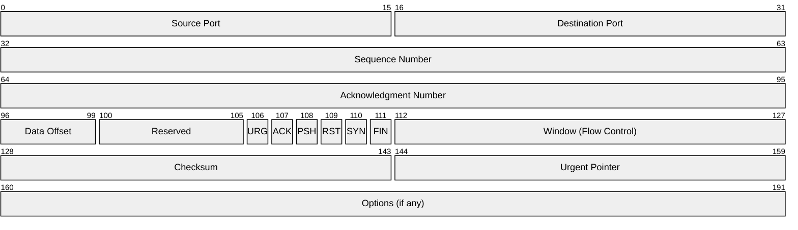
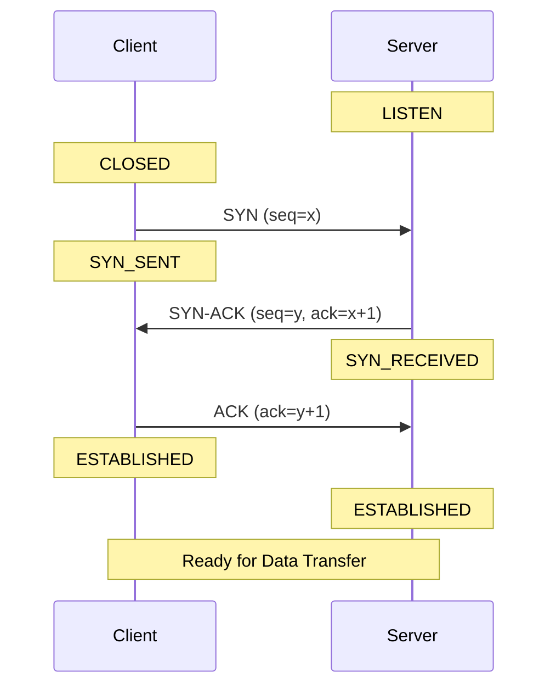
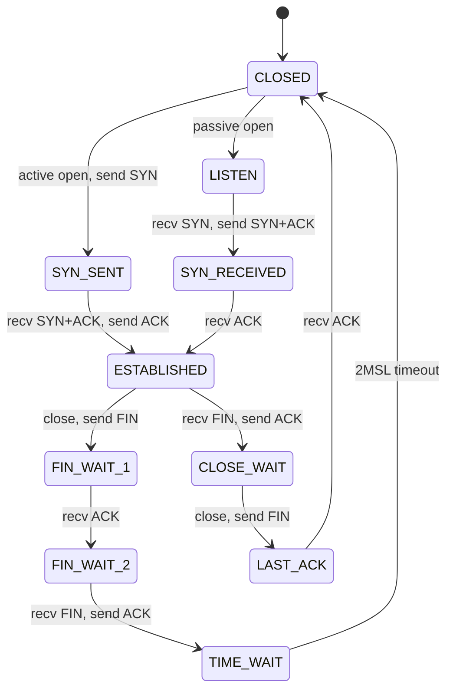
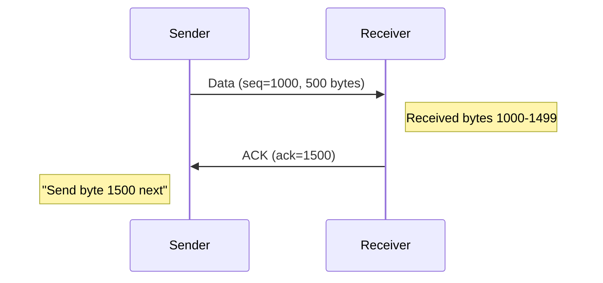
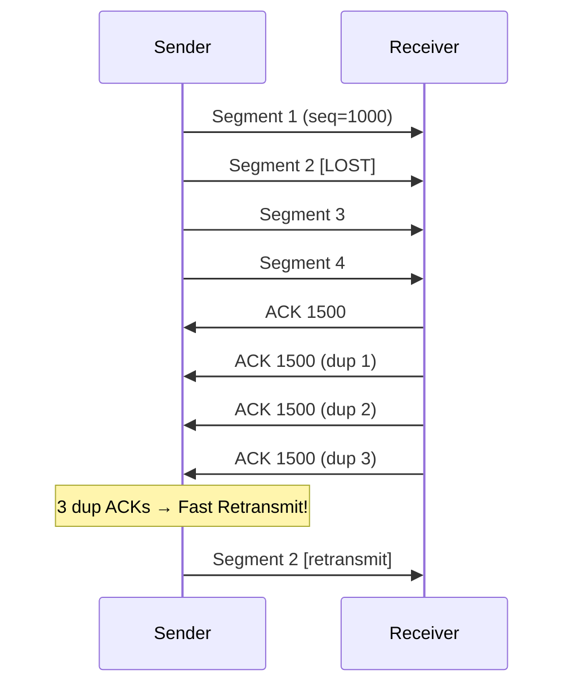
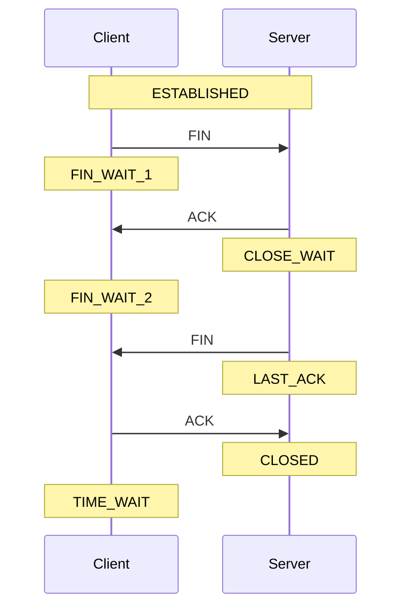

# Week 04: TCP and Stream Sockets

---

## Today's Agenda

1. TCP Protocol Deep Dive
2. Connection Establishment & Termination
3. Reliability Mechanisms
4. Flow & Congestion Control
5. Boost.Asio Implementation

---

## TCP: Transmission Control Protocol

Defined in **RFC 793** (comprehensive!)

The reliable transport layer protocol powering the internet

---

## TCP Characteristics

- **Connection-oriented** - three-way handshake required
- **Reliable** - guaranteed delivery
- **Ordered** - bytes arrive in sequence
- **Error detection** - checksums
- **Flow control** - sliding window
- **Congestion control** - network awareness

---

## When to Use TCP

| Application      | Why TCP?                         |
| ---------------- | -------------------------------- |
| Chat             | Messages must arrive reliably    |
| File Transfer    | Every byte must be correct       |
| HTTP/HTTPS       | Complete, ordered content needed |
| Email (SMTP)     | Messages cannot be lost          |
| Database Queries | Results must be reliable         |

---

## The 4-Tuple Connection Identifier

```
(Source IP, Source Port, Destination IP, Destination Port)
```

Uniquely identifies each connection

- Server handles thousands of clients on one port
- Client can have multiple connections to same server
- NAT devices track connections via 4-tuple

---

## TCP Header Format



---

## Key Header Fields

| Field           | Size    | Purpose                                    |
| --------------- | ------- | ------------------------------------------ |
| Sequence Number | 32 bits | Byte position in stream                    |
| Acknowledgment  | 32 bits | Next byte expected (cumulative ACK)        |
| Window          | 16 bits | Receiver's available buffer (flow control) |
| Flags (6 bits)  | 6 bits  | SYN, ACK, FIN, RST, PSH, URG               |

---

## TCP Flags Explained

- **SYN** - Synchronize sequence numbers (connection start)
- **ACK** - Acknowledge received data
- **FIN** - Finish (close connection)
- **RST** - Reset (abort connection)
- **PSH** - Push data immediately
- **URG** - Urgent data follows

---

## The Three-Way Handshake



---

## Why Three Steps?

- **Two-way sync** - Both sides exchange initial sequence numbers
- **Prevents duplicates** - Sequence numbers prevent stale connections
- **Resource allocation** - Server only allocates resources after final ACK

---

## Connection Refused

Client attempts to connect to port with no listening server:

```
1. OS responds with RST (reset) packet
2. Boost.Asio throws boost::system::system_error
3. Error code: connection_refused
```

---

## TCP Connection States



---

## Important States

| State       | Meaning                                      |
| ----------- | -------------------------------------------- |
| LISTEN      | Server waiting for incoming connections      |
| SYN_SENT    | Client waiting for server's SYN-ACK          |
| ESTABLISHED | Connection open, data flowing                |
| CLOSE_WAIT  | Received FIN, waiting for app to close       |
| TIME_WAIT   | Final ACK sent, waiting for delayed segments |

---

## The TIME_WAIT State

After closing: wait **2×MSL** (Maximum Segment Lifetime)

Typically 60 seconds

**Purpose:**

- Ensures old packets don't corrupt new connections on same 4-tuple
- Allows retransmission of final ACK if lost

**Practical Impact:**

- Cannot rebind to same port immediately
- Use `reuse_address` option during development

---

## Sequence & Acknowledgment Numbers



**Key Insight:** ACK number = next byte **expected**, not last byte received

This is called a **cumulative acknowledgment**

---

## TCP: Byte Stream vs Messages

TCP does **NOT** preserve message boundaries

```
One send():  "Hello" (5 bytes)
             "World" (5 bytes)

One receive() might get:
  "Hel" + "loWor" + "ld"
  or
  "HelloWorld"
  or any other split
```

---

## Message Framing Required

Applications must implement framing:

| Method        | Example                      |
| ------------- | ---------------------------- |
| Delimiter     | `"Hello\n"`, `"World\n"`     |
| Length prefix | `[5]Hello[5]World`           |
| Fixed size    | Pad all messages to 64 bytes |

---

## Reliable Delivery: Timeouts

1. Sender sets timer when sending data
2. If ACK doesn't arrive before timeout (RTO), retransmit
3. RTO calculated from measured round-trip times (RTT)

---

## Reliable Delivery: Fast Retransmit



---

## Fast Retransmit

**Trigger:** Receive **3 duplicate ACKs** for same sequence number

**Effect:** Retransmit immediately without waiting for timeout

**Why it works:** Subsequent packets arrived = packet loss detected

---

## Flow Control: Sliding Window

Receiver advertises available buffer space in every ACK

Sender limits unacknowledged data to this amount

```
Effective Window = min(cwnd, receiver_advertised_window)
```

---

## Flow Control: Window Zero

When receiver buffer fills completely:

1. Receiver advertises **window = 0**
2. Sender stops transmitting
3. Sender sends **window probe** packets periodically
4. When receiver has space, it advertises window > 0
5. Sender resumes transmission

---

## Congestion Control: Slow Start

Despite the name, grows **exponentially**:

1. Start with cwnd = 1 MSS
2. For each ACK, increase cwnd by 1 MSS
3. Doubles cwnd every RTT

```
RTT 0: cwnd = 1
RTT 1: cwnd = 2
RTT 2: cwnd = 4
RTT 3: cwnd = 8
RTT 4: cwnd = 16
```

---

## Congestion Control: Congestion Avoidance

After cwnd reaches ssthresh, switch to **AIMD**

**Additive Increase, Multiplicative Decrease**

- **Additive:** Increase cwnd by ~1 MSS per RTT (linear)
- **Multiplicative:** On loss, cut cwnd in half

Creates "sawtooth" pattern for fairness

---

## Response to Packet Loss

| Event            | Action                                             |
| ---------------- | -------------------------------------------------- |
| Timeout          | ssthresh = cwnd/2, cwnd = 1, restart slow start    |
| 3 Duplicate ACKs | ssthresh = cwnd/2, cwnd = ssthresh (fast recovery) |

---

## Loss Example

If cwnd = 12 and timeout occurs:

```
New ssthresh = 12 ÷ 2 = 6
New cwnd = 1
→ Restart slow start until cwnd reaches 6
```

---

## TCP Connection Termination



---

## Why Four Steps?

Unlike the handshake, termination is **asymmetric**:

- Each side independently closes its sending direction
- Connection can be **half-closed** (one direction closed, other open)
- One side can signal "done sending" while still receiving

---

## Graceful vs Abortive Close

| Type     | Mechanism    | Effect                                   |
| -------- | ------------ | ---------------------------------------- |
| Graceful | FIN exchange | All buffered data delivered before close |
| Abortive | RST packet   | Immediate close, data may be lost        |

---

## TCP vs UDP

| Aspect        | TCP        | UDP         |
| ------------- | ---------- | ----------- |
| Connection    | Required   | None        |
| Reliability   | Guaranteed | Best-effort |
| Ordering      | Yes        | No          |
| Flow Control  | Yes        | No          |
| Congestion CC | Yes        | No          |
| Byte Stream   | Yes        | Messages    |
| Latency       | Higher     | Lower       |

---

## Head-of-Line Blocking

TCP's critical limitation for real-time apps:

```
Packet 1: arrives
Packet 2: LOST
Packet 3: arrives, held in buffer (waiting for 2)
Packet 4: arrives, held in buffer (waiting for 2)

When Packet 2 finally retransmits and arrives:
Packets 3, 4 delivered → but now STALE!
```

**Games prefer UDP** for position updates

---

## When to Choose Each

**Use TCP For:**

- Chat messages
- File transfers
- HTTP/Web browsing
- Email
- Database queries

**Use UDP For:**

- Real-time game state
- Voice/video streaming
- DNS queries
- Live broadcasts
- Position updates

---

## Boost.Asio: Client Connection

```cpp
#include <boost/asio.hpp>
using boost::asio::ip::tcp;

int main() {
    boost::asio::io_context io_context;
    tcp::socket socket(io_context);

    tcp::resolver resolver(io_context);
    auto endpoints = resolver.resolve("example.com", "80");

    boost::asio::connect(socket, endpoints);

    // ... send/receive data ...

    socket.shutdown(tcp::socket::shutdown_both);
    socket.close();
}
```

---

## Boost.Asio: Server Setup

```cpp
#include <boost/asio.hpp>
using boost::asio::ip::tcp;

int main() {
    boost::asio::io_context io_context;

    tcp::acceptor acceptor(io_context,
        tcp::endpoint(tcp::v4(), 12345));

    acceptor.set_option(tcp::acceptor::reuse_address(true));
    acceptor.listen(128);

    while (true) {
        tcp::socket socket(io_context);
        acceptor.accept(socket);
        // Handle client...
        socket.shutdown(tcp::socket::shutdown_both);
        socket.close();
    }
}
```

---

## Socket Options

```cpp
// Allow binding to port in TIME_WAIT state
acceptor.set_option(tcp::acceptor::reuse_address(true));

// Enable TCP keepalive probes
socket.set_option(boost::asio::socket_base::keep_alive(true));

// Linger on close (30 seconds)
socket.set_option(boost::asio::socket_base::linger(true, 30));
```

---

## Handling Partial Reads

```cpp
// WRONG: Assumes all data arrives at once
char buffer[1024];
size_t len = socket.read_some(boost::asio::buffer(buffer));

// CORRECT: Read until newline delimiter
std::string message;
boost::asio::streambuf buffer;
boost::asio::read_until(socket, buffer, '\n');

std::istream is(&buffer);
std::getline(is, message);
```

---

## Graceful Shutdown Pattern

```cpp
void close_connection(tcp::socket& socket) {
    boost::system::error_code ec;

    // 1. Shutdown both directions (sends FIN)
    socket.shutdown(tcp::socket::shutdown_both, ec);

    // 2. Close the socket
    socket.close(ec);
}
```

**Never** call `close()` without `shutdown()` first!

---

## Listen Backlog

```cpp
acceptor.listen(128);  // Up to 128 pending connections
```

Controls how many connections can queue waiting to be accepted

If application doesn't call `accept()` fast enough:

- Backlog fills up
- New connections receive RST or dropped
- Existing connections unaffected

---

## Common TCP Issues

**"Address Already in Use"**

- Solution: Use `reuse_address(true)`

**Connection Refused**

- Server not running, firewall rule, wrong port

**Data Loss on Close**

- Always use graceful shutdown

**Hangs on Read**

- Implement proper message framing

---

## Debugging TCP Connections

View connection states on Linux/macOS:

```bash
# Show all TCP connections
ss -tan

# Show with process info
ss -tanp

# Filter by state
ss -tan state established
ss -tan state time-wait
```

---

## Key Takeaways

1. **Three-way handshake** establishes connection
2. **Sequence/ACK numbers** track every byte
3. **Sliding window** prevents receiver overflow
4. **Slow start + AIMD** manages congestion
5. **Four-way termination** closes gracefully

---

## For Next Time

**Readings:** RFC 793, Beej's Guide (Ch. 5-7), Peterson & Davie Ch. 5-6

**Assignment:** Build multi-client TCP chat server with Boost.Asio

**Remember:** TCP is byte stream—implement message framing!

---

## Questions?
