# Lecture 04: TCP and Stream Sockets

## Overview

This lecture covers the Transmission Control Protocol (TCP), the reliable transport layer protocol that powers most internet applications. We'll explore how TCP establishes connections, ensures reliable delivery, manages flow and congestion, and how to implement TCP clients and servers using Boost.Asio.

---

## 1. Introduction to TCP

TCP (Transmission Control Protocol) is a **connection-oriented**, **reliable**, **byte-stream** protocol defined in RFC 793. Unlike UDP, TCP provides:

- **Reliable delivery** - Data is guaranteed to arrive, or the sender is notified of failure
- **Ordered delivery** - Bytes arrive in the same order they were sent
- **Error detection** - Checksums detect corrupted data
- **Flow control** - Prevents overwhelming slow receivers
- **Congestion control** - Prevents overwhelming the network

### When to Use TCP

| Use TCP For          | Why                                         |
| -------------------- | ------------------------------------------- |
| Chat applications    | Messages must arrive reliably and in order  |
| File transfers       | Every byte must be delivered correctly      |
| HTTP/HTTPS           | Web pages require complete, ordered content |
| Email (SMTP)         | Messages cannot be lost or corrupted        |
| Database connections | Queries and results must be reliable        |

---

## 2. TCP Header Format

The TCP header contains all the control information needed for reliable communication:

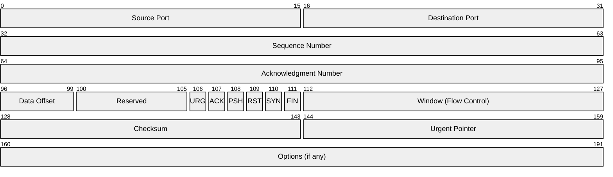

### Key Header Fields

| Field                 | Size         | Purpose                                          |
| --------------------- | ------------ | ------------------------------------------------ |
| Source/Dest Port      | 16 bits each | Identify sending and receiving applications      |
| Sequence Number       | 32 bits      | Byte position of first data byte in this segment |
| Acknowledgment Number | 32 bits      | Next byte the receiver expects (cumulative ACK)  |
| Window                | 16 bits      | Receiver's available buffer space (flow control) |
| Flags                 | 6 bits       | SYN, ACK, FIN, RST, PSH, URG                     |

### The 4-Tuple Connection Identifier

A TCP connection is uniquely identified by four values:

```
(Source IP, Source Port, Destination IP, Destination Port)
```

This allows:

- A server to handle thousands of clients on the same port
- A client to have multiple connections to the same server
- NAT devices to track and translate connections

---

## 3. TCP Three-Way Handshake

TCP uses a three-way handshake to establish a connection and synchronize sequence numbers between client and server.

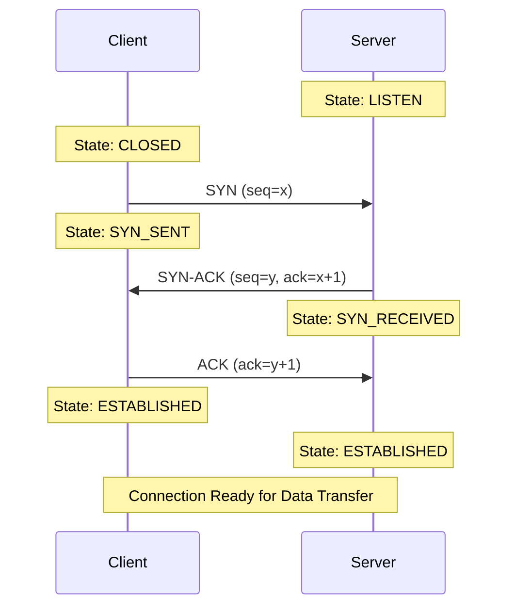

### Handshake Steps

1. **SYN (Synchronize)**: Client sends a segment with SYN flag set and an initial sequence number (ISN)
2. **SYN-ACK**: Server acknowledges client's SYN and sends its own SYN with its ISN
3. **ACK**: Client acknowledges server's SYN, completing the handshake

### Why Three Steps?

- **Two-way synchronization**: Both sides must agree on initial sequence numbers
- **Prevents old duplicates**: Sequence numbers prevent stale connection attempts from being accepted
- **Resource allocation**: Server allocates resources only after receiving final ACK

### Connection Refused

When a client attempts to connect to a port with no listening server:

- The server's OS responds with a **RST** (reset) packet
- In Boost.Asio, `socket.connect()` throws `boost::system::system_error` with `connection_refused`

---

## 4. TCP Connection States

TCP connections progress through a series of states during their lifetime:

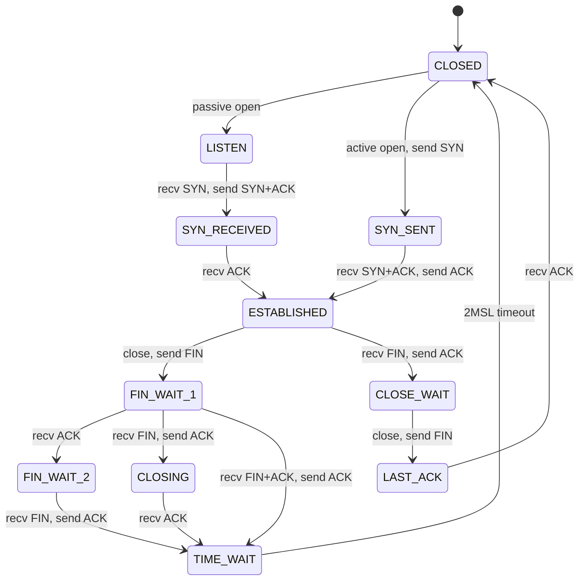

### Important States

| State        | Description                                              |
| ------------ | -------------------------------------------------------- |
| LISTEN       | Server waiting for incoming connections                  |
| SYN_SENT     | Client has sent SYN, waiting for SYN-ACK                 |
| SYN_RECEIVED | Server received SYN, sent SYN-ACK, waiting for ACK       |
| ESTABLISHED  | Connection open, data can flow both directions           |
| CLOSE_WAIT   | Received FIN from peer, waiting for application to close |
| TIME_WAIT    | Sent final ACK, waiting for delayed segments to expire   |

### The TIME_WAIT State

After closing a connection, the endpoint that sent the final ACK enters TIME_WAIT for **2×MSL** (Maximum Segment Lifetime, typically 60 seconds).

**Purpose:**

- Ensures delayed packets from the old connection don't corrupt a new connection using the same 4-tuple
- Allows retransmission of final ACK if lost

**Practical Impact:**

- Cannot immediately rebind to the same port
- Use `reuse_address` option during development to bypass this

---

## 5. TCP Reliability Mechanisms

### Sequence and Acknowledgment Numbers

TCP tracks every byte with sequence numbers:

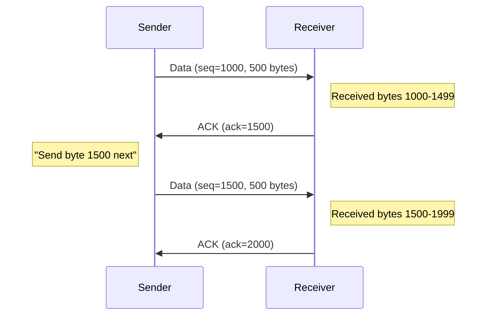

**Key insight:** The acknowledgment number indicates the **next byte expected**, not the last byte received. This is called a **cumulative acknowledgment**.

### Byte Stream vs Message Protocol

TCP is a **byte stream** protocol - it does not preserve message boundaries.

```
Application sends:     "Hello" (5 bytes) then "World" (5 bytes)

TCP might deliver:     "Hel" + "loWor" + "ld"
                   or: "HelloWorld"
                   or: "H" + "e" + "l" + "l" + "o" + "W" + "o" + "r" + "l" + "d"
```

**Consequence:** One `send()` call does NOT guarantee one `receive()` call. Applications must implement their own **message framing**:

| Framing Method | Description                         | Example                  |
| -------------- | ----------------------------------- | ------------------------ |
| Delimiter      | End messages with special character | `"Hello\n"`, `"World\n"` |
| Length prefix  | Send length before payload          | `[5]Hello[5]World`       |
| Fixed size     | All messages same length            | Pad to 64 bytes          |

### Retransmission Mechanisms

TCP ensures delivery through retransmission:

**1. Timeout-based Retransmission**

- Sender sets a timer when sending data
- If ACK doesn't arrive before timeout (RTO), retransmit
- RTO is calculated from measured round-trip times (RTT)

**2. Fast Retransmit**

- If sender receives **3 duplicate ACKs**, retransmit immediately
- Indicates packet loss (later packets arrived, but one is missing)
- Faster than waiting for timeout

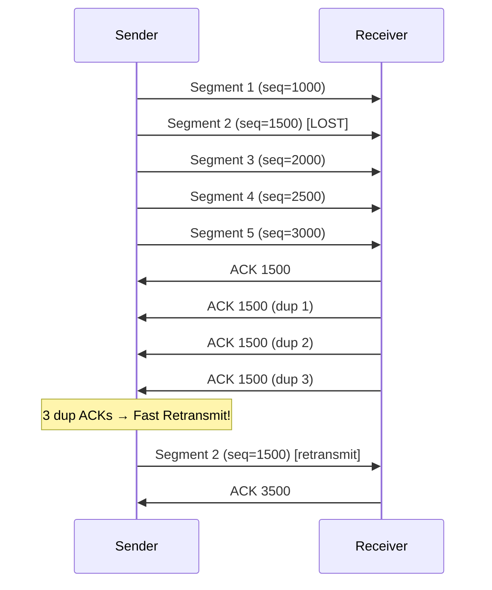

---

## 6. Flow Control

Flow control prevents a fast sender from overwhelming a slow receiver's buffer.

### Sliding Window Protocol

The receiver advertises its available buffer space in the **window** field of every ACK. The sender limits unacknowledged data to this amount.

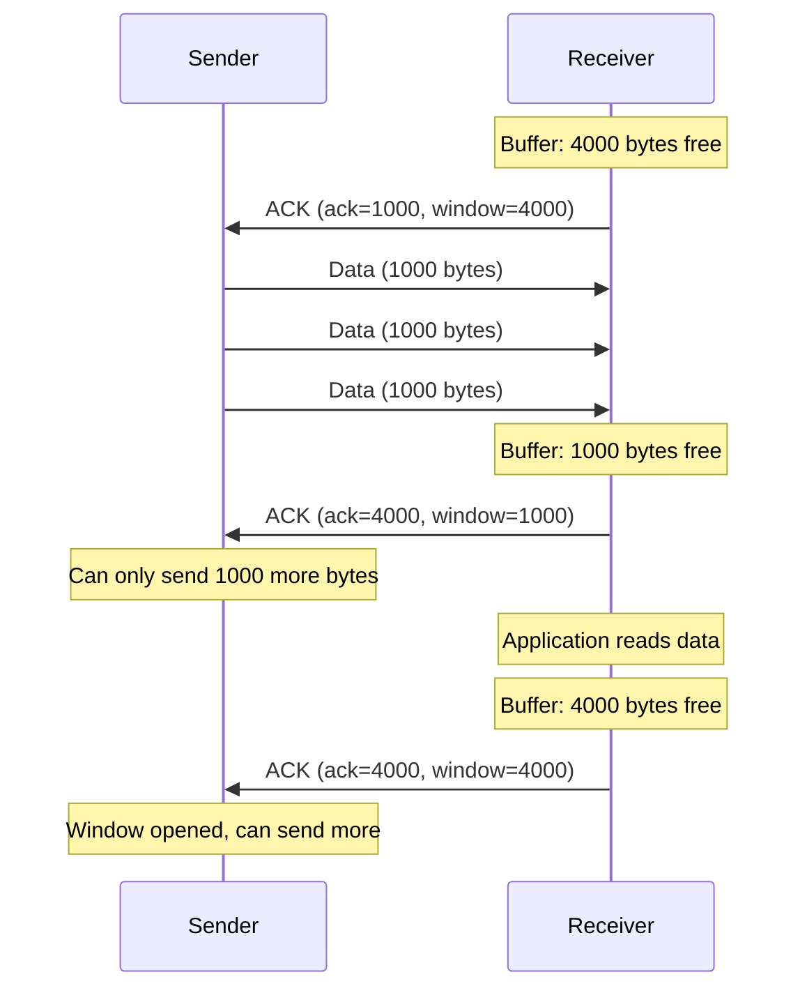

### Window Size Zero

When the receiver's buffer fills completely:

1. Receiver advertises **window = 0**
2. Sender stops transmitting data
3. Sender periodically sends **window probe** packets
4. When receiver has space, it advertises window > 0
5. Sender resumes transmission

This mechanism prevents buffer overflow and data loss at the receiver.

---

## 7. Congestion Control

While flow control protects the receiver, **congestion control** protects the network from being overwhelmed.

### Congestion Window (cwnd)

The sender maintains a **congestion window** that limits how much data can be in flight:

```
Effective Window = min(cwnd, receiver_advertised_window)
```

### Slow Start

Despite its name, slow start grows **exponentially**:

1. Start with cwnd = 1 MSS (Maximum Segment Size)
2. For each ACK received, increase cwnd by 1 MSS
3. This doubles cwnd every RTT


Slow start continues until:

- cwnd reaches **ssthresh** (slow start threshold)
- Packet loss is detected

### Congestion Avoidance (AIMD)

After cwnd reaches ssthresh, TCP switches to **Additive Increase, Multiplicative Decrease (AIMD)**:

- **Additive Increase**: Increase cwnd by ~1 MSS per RTT (linear growth)
- **Multiplicative Decrease**: On packet loss, cut cwnd in half

This creates the characteristic "sawtooth" pattern:

![AIMD Sawtooth](https://quickchart.io/chart?c=%7B%22type%22%3A%22line%22%2C%22data%22%3A%7B%22labels%22%3A%5B%220%22%2C%221%22%2C%222%22%2C%223%22%2C%224%22%2C%225%22%2C%226%22%2C%227%22%2C%228%22%2C%229%22%2C%2210%22%2C%2211%22%2C%2212%22%2C%2213%22%2C%2214%22%2C%2215%22%2C%2216%22%2C%2217%22%2C%2218%22%2C%2219%22%2C%2220%22%5D%2C%22datasets%22%3A%5B%7B%22label%22%3A%22cwnd%22%2C%22data%22%3A%5B1%2C2%2C4%2C8%2C16%2C17%2C18%2C19%2C20%2C21%2C22%2C11%2C12%2C13%2C14%2C15%2C16%2C17%2C18%2C9%2C10%5D%2C%22fill%22%3Afalse%2C%22borderColor%22%3A%22rgb%28255%2C%2099%2C%20132%29%22%2C%22tension%22%3A0%7D%2C%7B%22label%22%3A%22ssthresh%22%2C%22data%22%3A%5B64%2C64%2C64%2C64%2C16%2C16%2C16%2C16%2C16%2C16%2C16%2C11%2C11%2C11%2C11%2C11%2C11%2C11%2C11%2C9%2C9%5D%2C%22fill%22%3Afalse%2C%22borderColor%22%3A%22rgb%2854%2C%20162%2C%20235%29%22%2C%22borderDash%22%3A%5B5%2C5%5D%2C%22tension%22%3A0%7D%5D%7D%2C%22options%22%3A%7B%22title%22%3A%7B%22display%22%3Atrue%2C%22text%22%3A%22TCP%20Congestion%20Control%20%28AIMD%20Sawtooth%29%22%7D%2C%22scales%22%3A%7B%22xAxes%22%3A%5B%7B%22scaleLabel%22%3A%7B%22display%22%3Atrue%2C%22labelString%22%3A%22Time%20%28RTT%29%22%7D%7D%5D%2C%22yAxes%22%3A%5B%7B%22scaleLabel%22%3A%7B%22display%22%3Atrue%2C%22labelString%22%3A%22Window%20Size%20%28segments%29%22%7D%7D%5D%7D%7D%7D)

### Response to Packet Loss

| Event            | Action                                                                            |
| ---------------- | --------------------------------------------------------------------------------- |
| Timeout          | ssthresh = cwnd/2, cwnd = 1, restart slow start                                   |
| 3 Duplicate ACKs | ssthresh = cwnd/2, cwnd = ssthresh, continue congestion avoidance (fast recovery) |

**Example:** If cwnd = 12 and timeout occurs:

- New ssthresh = 12 ÷ 2 = 6
- New cwnd = 1
- TCP restarts slow start until cwnd reaches ssthresh (6)

---

## 8. Connection Termination

TCP uses a four-way handshake to close connections gracefully:

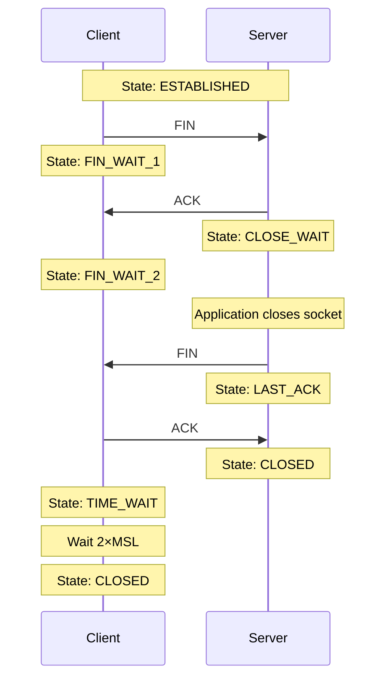

### Why Four Steps?

Unlike the handshake, termination is **asymmetric**:

- Each side independently closes its sending direction
- A connection can be **half-closed** (one direction closed, other open)
- This allows one side to signal "I'm done sending" while still receiving

### Graceful vs Abortive Close

| Close Type | Mechanism    | Effect                                     |
| ---------- | ------------ | ------------------------------------------ |
| Graceful   | FIN exchange | All buffered data delivered before close   |
| Abortive   | RST packet   | Immediate close, buffered data may be lost |

---

## 9. TCP vs UDP Comparison

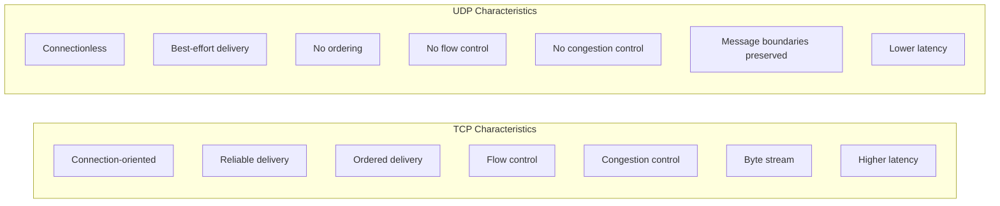

### Head-of-Line Blocking

A critical TCP limitation for real-time applications:

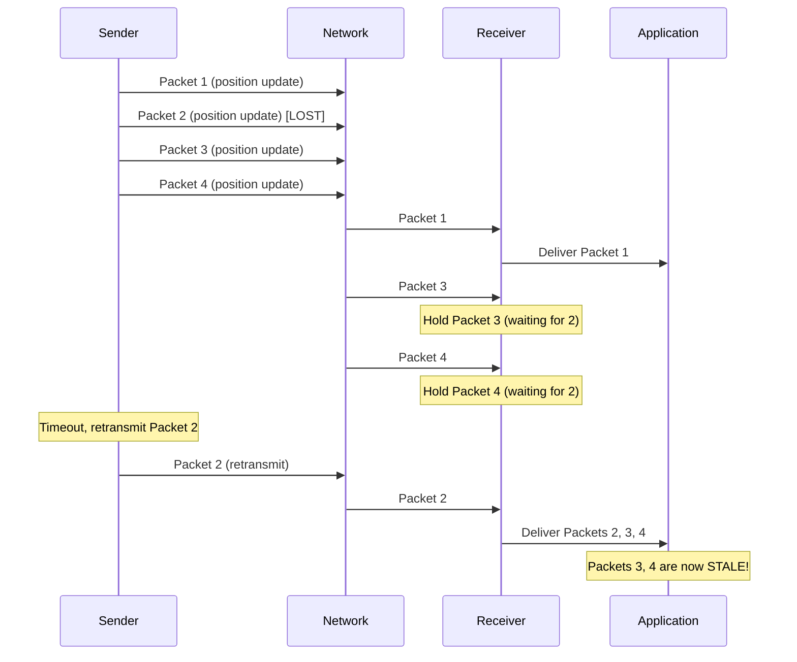

In games, stale position updates are worse than missing ones. This is why game state updates often use UDP.

### When to Choose Each Protocol

| TCP              | UDP                               |
| ---------------- | --------------------------------- |
| Chat messages    | Real-time game state              |
| File transfers   | Voice/video streaming             |
| Web browsing     | DNS queries                       |
| Email            | Live broadcasts                   |
| Database queries | Multiplayer game position updates |

---

## 10. TCP Programming with Boost.Asio

### Client Connection

```cpp
#include <boost/asio.hpp>
#include <iostream>

using boost::asio::ip::tcp;

int main() {
    boost::asio::io_context io_context;

    // Create socket
    tcp::socket socket(io_context);

    // Resolve hostname to IP address
    tcp::resolver resolver(io_context);
    auto endpoints = resolver.resolve("example.com", "80");

    // or use IP directly
    // auto endpoints = tcp::endpoint(boost::asio::ip::make_address("127.0.0.1"), 12345);

    // Connect (throws on failure)
    boost::asio::connect(socket, endpoints);

    std::cout << "Connected!" << std::endl;

    // ... send/receive data ...

    // Graceful shutdown
    socket.shutdown(tcp::socket::shutdown_both);
    socket.close();

    return 0;
}
```

### Server Setup

```cpp
#include <boost/asio.hpp>
#include <iostream>

using boost::asio::ip::tcp;

int main() {
    boost::asio::io_context io_context;

    // Create acceptor on port 12345
    tcp::acceptor acceptor(io_context, tcp::endpoint(tcp::v4(), 12345));

    // Enable port reuse (important for development)
    acceptor.set_option(tcp::acceptor::reuse_address(true));

    // Set listen backlog
    acceptor.listen(128);

    std::cout << "Server listening on port 12345..." << std::endl;

    while (true) {
        // Accept incoming connection
        tcp::socket socket(io_context);
        acceptor.accept(socket);

        std::cout << "Client connected: "
                  << socket.remote_endpoint() << std::endl;

        // Handle client...

        // Graceful close
        socket.shutdown(tcp::socket::shutdown_both);
        socket.close();
    }

    return 0;
}
```

### Important Socket Options

```cpp
// Allow binding to port in TIME_WAIT state
acceptor.set_option(tcp::acceptor::reuse_address(true));

// Enable TCP keepalive probes
socket.set_option(boost::asio::socket_base::keep_alive(true));

// Set linger behavior on close
socket.set_option(boost::asio::socket_base::linger(true, 30));
```

### Handling Partial Reads

Since TCP is a byte stream, you must handle partial data:

```cpp
// WRONG: Assumes all data arrives in one read
char buffer[1024];
size_t len = socket.read_some(boost::asio::buffer(buffer));

// CORRECT: Read until you have a complete message
std::string message;
boost::asio::streambuf buffer;

// Read until newline delimiter
boost::asio::read_until(socket, buffer, '\n');
std::istream is(&buffer);
std::getline(is, message);
```

### Graceful Shutdown Pattern

```cpp
void close_connection(tcp::socket& socket) {
    boost::system::error_code ec;

    // 1. Shutdown both directions (sends FIN)
    socket.shutdown(tcp::socket::shutdown_both, ec);
    if (ec) {
        std::cerr << "Shutdown error: " << ec.message() << std::endl;
    }

    // 2. Close the socket
    socket.close(ec);
    if (ec) {
        std::cerr << "Close error: " << ec.message() << std::endl;
    }
}
```

**Common mistake:** Calling `close()` without `shutdown()` may cause buffered data to be lost. Always shutdown first for graceful termination.

### Listen Backlog

The backlog parameter in `listen()` controls how many pending connections can queue:

```cpp
acceptor.listen(128);  // Up to 128 pending connections
```

If the application doesn't call `accept()` fast enough:

- Backlog fills up
- New connection attempts receive RST or are silently dropped
- Existing established connections are unaffected

---

## 11. Multi-Client Connection Management

Building a chatroom or multi-user server requires tracking multiple connected clients. This section shows modern C++ techniques that make concurrent programming easier for beginners.

### Server Architecture: start() and accept_connection()

A multi-client server has two main responsibilities:

1. **Accept Loop** — Continuously wait for new clients to connect
2. **Client Handlers** — Process messages from each connected client

These must happen **concurrently** — you can't stop accepting new clients while handling an existing one.

**The `start()` Function:**

The `start()` method initiates the accept loop. There are two common patterns:

**Pattern 1: Blocking Accept Loop**

```cpp
void start() {
    // Set socket options before accepting
    m_acceptor.set_option(tcp::acceptor::reuse_address(true));

    // Run the accept loop (blocks forever, accepting clients)
    accept_connection();
}

void accept_connection() {
    while (true) {
        // Create a new socket for this client
        tcp::socket socket(m_io_context);

        // Block until a client connects
        m_acceptor.accept(socket);

        // Create a session object (use std::move since sockets can't be copied)
        auto client = std::make_shared<ClientSession>(std::move(socket));

        std::cout << "[Server] New connection from: "
                  << client->socket().remote_endpoint() << "\n";

        // Spawn a thread to handle this client
        // The thread runs handle_client() independently
        std::thread([this, client]() {
            handle_client(client);
        }).detach();

        // Loop continues, ready to accept next client
    }
}
```

**Pattern 2: Async Accept (More Advanced)**

```cpp
void start() {
    m_acceptor.set_option(tcp::acceptor::reuse_address(true));
    accept_connection();  // Start the async chain
}

void accept_connection() {
    m_acceptor.async_accept(
        [this](boost::system::error_code ec, tcp::socket socket) {
            if (!ec) {
                auto client = std::make_shared<ClientSession>(std::move(socket));
                std::thread([this, client]() {
                    handle_client(client);
                }).detach();
            }
            accept_connection();  // Accept next client (async chain continues)
        });
}
```

::: tip "Which Pattern to Use?"

**Pattern 1 (blocking).** It's simpler to understand and debug.

`accept()` blocks until a client connects, then returns the new socket. You immediately spawn a thread for that client, then loop back to accept the next one.

**Common Mistake:** Don't call `io_context.run()` if you're using the blocking pattern, it's only needed for async operations.

:::

### Understanding `io_context.run()` for Async Operations

When using **Pattern 2 (async)**, you **must** call `io_context.run()` — this is the event loop that drives all async operations.

**What `io_context.run()` Does:**

1. **Blocks** the calling thread
2. **Waits** for async operations to complete (accepts, reads, writes)
3. **Dispatches** callbacks when events occur
4. **Returns** only when there's no more work (all sockets closed, no pending operations)

```cpp
int main() {
    boost::asio::io_context io_context;
    TcpChatServer server(io_context, 12345);

    server.start();  // Posts async_accept — returns immediately!

    // Without this, the program would exit immediately.
    // run() blocks and processes all async events.
    io_context.run();  // <-- Event loop starts here

    // Only reaches here when io_context has no more work
    return 0;
}
```

**The Event Loop Explained:**

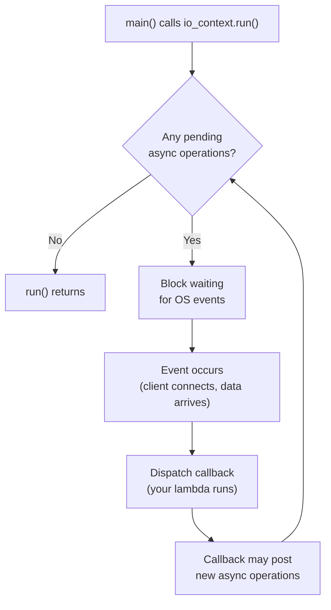

**Key Insight:** The "recursion" in async accept isn't really recursion:

```cpp
void accept_connection() {
    m_acceptor.async_accept([this](error_code ec, tcp::socket socket) {
        // ... handle connection ...
        accept_connection();  // Posts new operation, returns immediately
    });
    // Returns here immediately — stack unwinds
}
```

When the lambda calls `accept_connection()` again:

- It **posts** a new async operation to the io_context
- The lambda **returns** (stack unwinds completely)
- `io_context.run()` then dispatches the next event

Each callback runs with a **fresh stack frame** — no stack growth!

::: warning "Common Async Mistakes"

1. **Forgetting `io_context.run()`** — Program exits immediately
2. **Calling `run()` with blocking operations** — Defeats the purpose
3. **Letting `io_context` run out of work** — `run()` returns, program may exit

To keep the server running forever, ensure there's always at least one pending async operation (like `async_accept`).

:::

### Server Lifecycle: Startup and Graceful Shutdown

Here's the complete flow for a chat server:

**Server Startup Flow:**

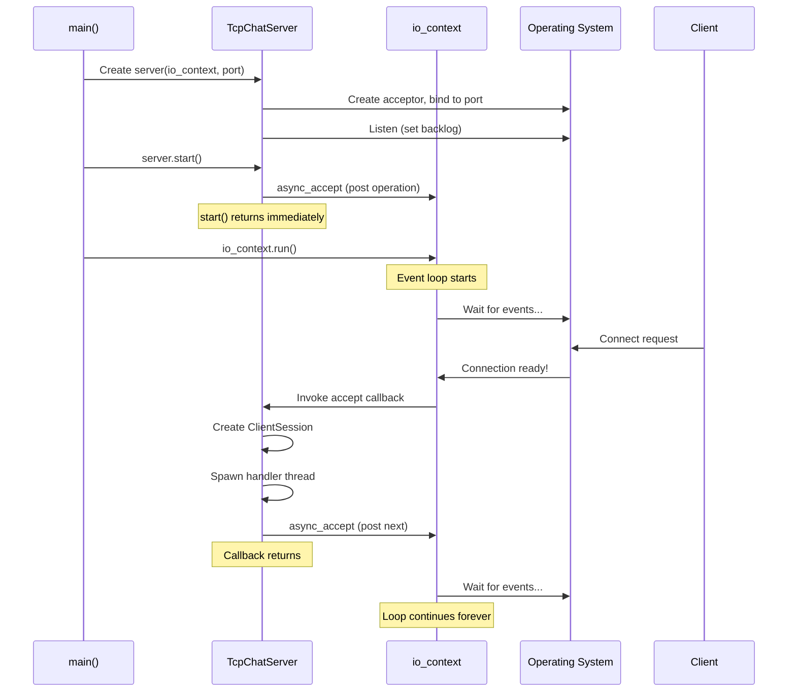

**Graceful Shutdown Flow (Server-Initiated or /quit):**

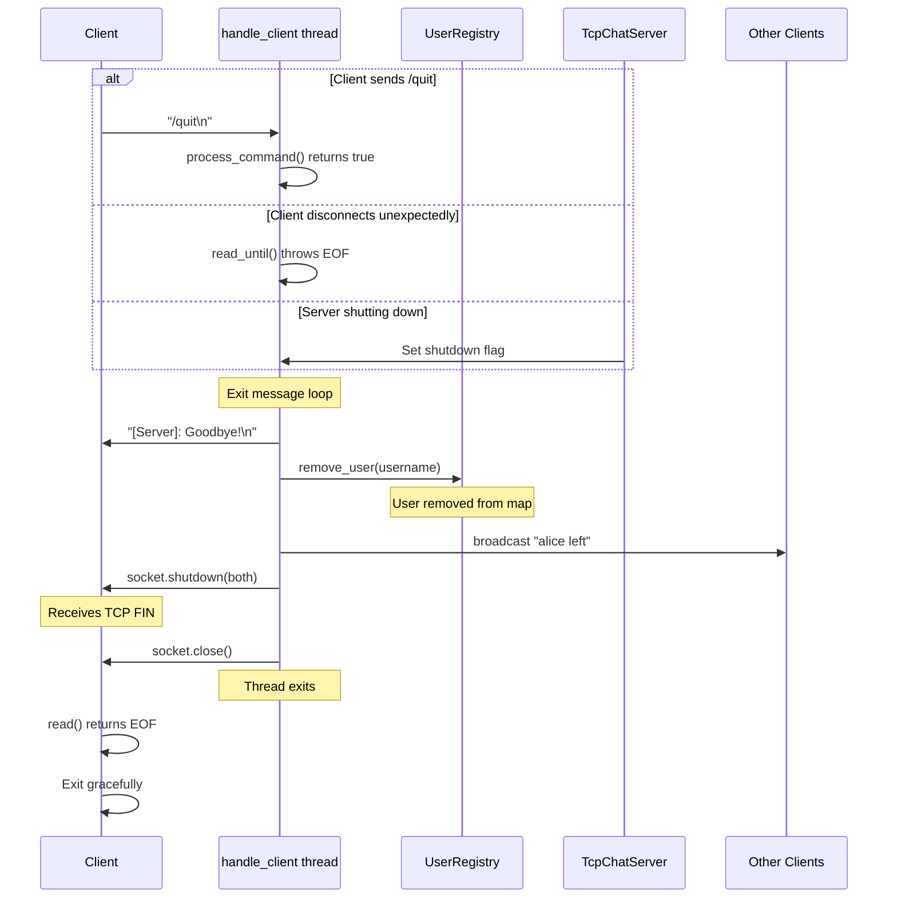

**Complete Server Lifecycle State Diagram:**

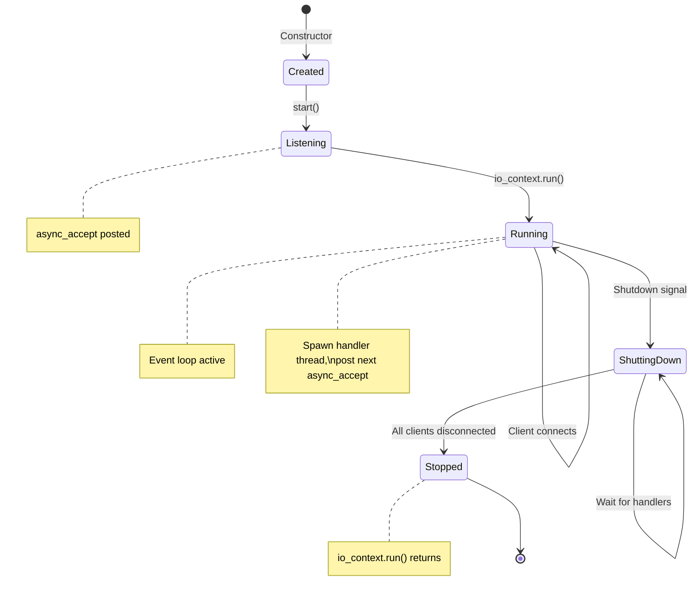

**The `handle_client()` Function:**

This runs in its own thread for each client:

```cpp
void handle_client(ClientPtr client) {
    try {
        // 1. Read username (first message from client)
        boost::asio::streambuf buffer;
        boost::asio::read_until(client->socket(), buffer, '\n');
        std::istream is(&buffer);
        std::string username;
        std::getline(is, username);

        client->set_username(username);

        // 2. Try to register (reject if name taken)
        if (!m_registry.add_user(username, client)) {
            boost::asio::write(client->socket(),
                boost::asio::buffer("[Server]: Username taken!\n"));
            return;  // End this handler
        }

        // 3. Announce join
        m_registry.broadcast("[Server]: " + username + " joined the chat\n", username);

        // 4. Message loop
        while (true) {
            boost::asio::read_until(client->socket(), buffer, '\n');
            std::istream msg_stream(&buffer);
            std::string message;
            std::getline(msg_stream, message);

            if (message.empty()) continue;

            // Check for commands
            if (message[0] == '/') {
                if (process_command(client, message)) {
                    break;  // /quit returns true
                }
            } else {
                // Regular message — broadcast to all
                m_registry.broadcast("[" + username + "]: " + message + "\n", username);
            }
        }

    } catch (std::exception& e) {
        // Client disconnected unexpectedly
    }

    // 5. Cleanup (always runs)
    std::string username = client->username();
    m_registry.remove_user(username);
    m_registry.broadcast("[Server]: " + username + " left the chat\n");

    boost::system::error_code ec;
    client->socket().shutdown(tcp::socket::shutdown_both, ec);
    client->socket().close(ec);
}
```

### User Registry with Modern C++

```cpp
#include <boost/asio.hpp>
#include <map>
#include <memory>
#include <shared_mutex>  // C++17
#include <atomic>
#include <thread>
#include <string>

using boost::asio::ip::tcp;

// Represents a connected user
struct User {
    std::string username;
    std::shared_ptr<tcp::socket> socket;
    std::atomic<bool> is_connected{true};  // Lock-free status flag
};

// Registry to track all connected users by username
class UserRegistry {
private:
    std::map<std::string, std::shared_ptr<User>> users;
    mutable std::shared_mutex registry_lock;  // Reader-writer lock (C++17)

public:
    // Add a new user to the registry
    bool add_user(const std::string& username,
                  std::shared_ptr<tcp::socket> socket) {
        std::unique_lock lock(registry_lock);  // Exclusive (write) lock

        if (users.contains(username)) {  // C++20 contains()
            return false;  // Username taken
        }

        auto user = std::make_shared<User>();
        user->username = username;
        user->socket = socket;
        users[username] = user;

        return true;
    }

    // Remove a user from the registry
    bool remove_user(const std::string& username) {
        std::unique_lock lock(registry_lock);
        return users.erase(username) > 0;
    }

    // Get a user by username (read-only, allows concurrent access)
    std::shared_ptr<User> get_user(const std::string& username) {
        std::shared_lock lock(registry_lock);  // Shared (read) lock

        auto it = users.find(username);
        return (it != users.end()) ? it->second : nullptr;
    }

    // Broadcast message to all users
    void broadcast_message(const std::string& from_user,
                          const std::string& message) {
        std::string formatted = from_user + ": " + message + "\n";

        std::shared_lock lock(registry_lock);  // Read lock for iteration

        for (auto& [username, user] : users) {
            if (username != from_user && user->is_connected) {
                try {
                    boost::asio::write(*user->socket,
                        boost::asio::buffer(formatted));
                } catch (...) {
                    // Handle write errors gracefully
                }
            }
        }
    }

    // Get list of all connected usernames
    std::vector<std::string> get_user_list() {
        std::shared_lock lock(registry_lock);

        std::vector<std::string> usernames;
        usernames.reserve(users.size());
        for (auto& [username, user] : users) {
            usernames.push_back(username);
        }
        return usernames;
    }

    // Get all connected users (returns the User objects, not just names)
    // Useful when you need access to sockets for direct messaging
    std::vector<std::shared_ptr<User>> get_all_users() {
        std::shared_lock lock(registry_lock);

        std::vector<std::shared_ptr<User>> all_users;
        all_users.reserve(users.size());
        for (auto& [username, user] : users) {
            all_users.push_back(user);
        }
        return all_users;
    }

    // Get count of connected users
    size_t user_count() {
        std::shared_lock lock(registry_lock);
        return users.size();
    }
};
```

### Modern Multi-Client Server with std::jthread

```cpp
// Forward declaration
void handle_client(std::shared_ptr<tcp::socket> socket,
                   std::string username,
                   UserRegistry& registry);

int main() {
    boost::asio::io_context io_context;
    UserRegistry registry;
    std::vector<std::jthread> client_threads;  // C++20: auto-joins on destruction

    tcp::acceptor acceptor(io_context,
        tcp::endpoint(tcp::v4(), 12345));
    acceptor.set_option(tcp::acceptor::reuse_address(true));
    acceptor.listen(128);

    std::cout << "Chatroom server listening on port 12345..." << std::endl;

    while (true) {
        auto socket = std::make_shared<tcp::socket>(io_context);
        acceptor.accept(*socket);

        std::cout << "New connection from: "
                  << socket->remote_endpoint() << std::endl;

        // Read username from client
        boost::asio::streambuf buffer;
        boost::asio::read_until(*socket, buffer, '\n');

        std::istream is(&buffer);
        std::string username;
        std::getline(is, username);

        // Try to register user
        if (!registry.add_user(username, socket)) {
            std::string error_msg = "ERROR: Username already taken\n";
            boost::asio::write(*socket,
                boost::asio::buffer(error_msg));
            socket->close();
            continue;
        }

        std::cout << "User '" << username << "' connected. "
                  << "Total users: " << registry.user_count() << std::endl;

        // Notify others
        registry.broadcast_message("SERVER",
            username + " joined the chatroom");

        // std::jthread automatically joins on destruction - no .detach() needed!
        client_threads.emplace_back([socket, username, &registry] () {
            handle_client(socket, username, registry);
        });
    }

    return 0;
}

// Handle individual client with cooperative cancellation support
void handle_client(std::shared_ptr<tcp::socket> socket,
                   std::string username,
                   UserRegistry& registry) {
    try {
        boost::asio::streambuf buffer;

        while (true) {
            // Read message from client
            boost::asio::read_until(*socket, buffer, '\n');

            std::istream is(&buffer);
            std::string message;
            std::getline(is, message);

            if (message == "QUIT") {
                break;
            }

            // Broadcast message to all users
            registry.broadcast_message(username, message);
        }
    } catch (std::exception& e) {
        std::cerr << "Error handling client " << username << ": "
                  << e.what() << std::endl;
    }

    // Mark as disconnected (atomic, no lock needed)
    if (auto user = registry.get_user(username)) {
        user->is_connected = false;
    }

    // Clean up
    registry.remove_user(username);
    try {
        socket->shutdown(tcp::socket::shutdown_both);
        socket->close();
    } catch (...) {}

    std::cout << "User '" << username << "' disconnected. "
              << "Remaining users: " << registry.user_count() << std::endl;

    registry.broadcast_message("SERVER",
        username + " left the chatroom");
}
```

### Processing Chat Commands

Chat applications often support **commands** that start with `/`. The server must distinguish between regular messages and commands, then dispatch to the appropriate handler.

**Command Detection Pattern:**

```cpp
void process_message(const std::string& username,
                     const std::string& message,
                     UserRegistry& registry,
                     tcp::socket& socket) {
    if (message.empty()) return;

    if (message[0] == '/') {
        // It's a command - parse and handle it
        handle_command(username, message, registry, socket);
    } else {
        // Regular message - broadcast to all users
        registry.broadcast_message(username, message);
    }
}
```

**Command Parsing:**

Commands typically follow the pattern: `/command [arguments...]`

```cpp
// Extract command name and arguments
std::string command_line = message.substr(1);  // Remove leading '/'
std::istringstream iss(command_line);

std::string command;
iss >> command;  // First word is the command name

// Remaining text is the arguments
std::string args;
std::getline(iss >> std::ws, args);  // Skip whitespace, get rest of line
```

**Common Command Structure:**

| Command | Arguments          | Action                                 |
| ------- | ------------------ | -------------------------------------- |
| `/quit` | None               | Disconnect gracefully                  |
| `/list` | None               | Send list of online users to requester |
| `/help` | None               | Send available commands to requester   |
| `/msg`  | `username message` | Send private message to one user       |
| `/nick` | `newname`          | Change the user's display name         |

### Graceful Disconnect with `/quit`

The `/quit` command requires coordination between client and server. Here's the complete flow:

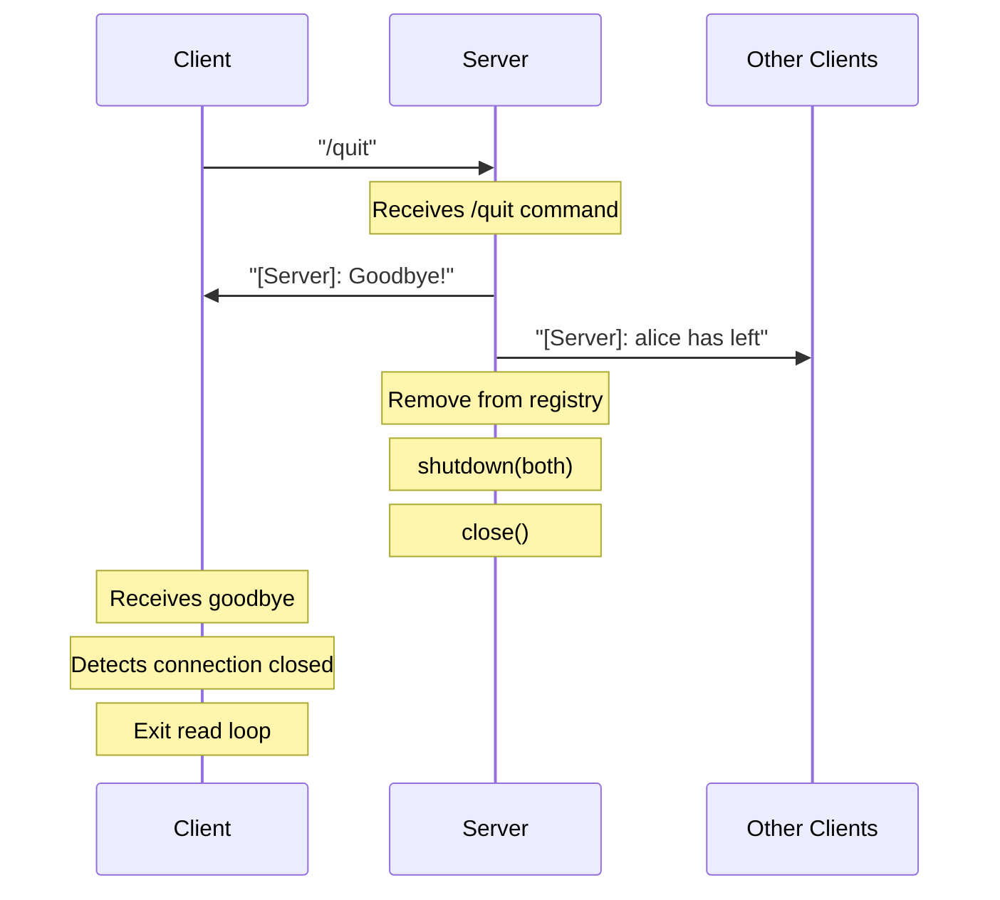

**Server-Side `/quit` Handler:**

```cpp
// In your command handler or message loop
if (command == "quit") {
    // 1. Send acknowledgment to the quitting client
    std::string goodbye = "[Server]: Goodbye, " + username + "!\n";
    boost::asio::write(client->socket(), boost::asio::buffer(goodbye));

    // 2. Signal that we should exit the message loop
    return true;  // Caller checks this and breaks the loop
}

// After the message loop exits:
void cleanup_client(const std::string& username,
                    tcp::socket& socket,
                    UserRegistry& registry) {
    // 3. Remove from registry BEFORE announcing (avoid race conditions)
    registry.remove_user(username);

    // 4. Announce departure to remaining users
    registry.broadcast("[Server]: " + username + " has left the chat\n");

    // 5. Graceful TCP shutdown sequence
    boost::system::error_code ec;
    socket.shutdown(tcp::socket::shutdown_both, ec);  // Send FIN
    socket.close(ec);
}
```

**Client-Side `/quit` Handler:**

The client needs to:

1. Detect when user types `/quit`
2. Send it to the server
3. Wait for server's goodbye (optional)
4. Close its own socket

```cpp
// Client main loop (pseudocode)
void client_main_loop(tcp::socket& socket) {
    // Start a thread to read from server
    std::jthread reader([&socket]() {
        try {
            boost::asio::streambuf buffer;
            while (true) {
                boost::asio::read_until(socket, buffer, '\n');
                std::istream is(&buffer);
                std::string line;
                std::getline(is, line);
                std::cout << line << std::endl;
            }
        } catch (boost::system::system_error& e) {
            // Connection closed by server - this is expected after /quit
            if (e.code() != boost::asio::error::eof) {
                std::cerr << "Read error: " << e.what() << std::endl;
            }
        }
    });

    // Main thread reads user input
    std::string input;
    while (std::getline(std::cin, input)) {
        // Send to server
        boost::asio::write(socket, boost::asio::buffer(input + "\n"));

        if (input == "/quit") {
            break;  // Exit input loop
        }
    }

    // Clean shutdown
    boost::system::error_code ec;
    socket.shutdown(tcp::socket::shutdown_both, ec);
    socket.close(ec);

    // Reader thread will exit when it gets EOF from closed socket
}
```

**Key Points for Graceful Disconnect:**

1. **Server sends goodbye first** — Client receives confirmation before connection drops

2. **Remove from registry before broadcast** — Prevents the leaving user from receiving their own departure message

3. **Always use `shutdown()` before `close()`** — Sends TCP FIN to notify peer cleanly

4. **Handle EOF on both sides** — When one side closes, the other receives `boost::asio::error::eof`

5. **Use error_code overload** — Don't throw exceptions during cleanup:
   ```cpp
   boost::system::error_code ec;
   socket.shutdown(tcp::socket::shutdown_both, ec);  // Won't throw
   socket.close(ec);  // Won't throw
   ```

**Common Mistake: Double-Close**

If you call `close()` on an already-closed socket, it may throw. Always check or use error_code:

```cpp
// Safe close pattern
if (socket.is_open()) {
    boost::system::error_code ec;
    socket.shutdown(tcp::socket::shutdown_both, ec);
    socket.close(ec);
}
```

**Sending Responses to Command Sender Only:**

Some commands (like `/list` or `/help`) should only respond to the user who sent them, not broadcast:

```cpp
void send_to_client(tcp::socket& socket, const std::string& message) {
    try {
        boost::asio::write(socket, boost::asio::buffer(message + "\n"));
    } catch (const std::exception& e) {
        // Handle write failure (client disconnected)
    }
}

// In command handler:
if (command == "help") {
    std::string help_text = "[Server]: Available commands: /quit, /list, /help\n";
    send_to_client(socket, help_text);
    return false;  // Don't disconnect
}
```

**Private Messages (`/msg`):**

Private messaging requires:

1. Parsing the target username and message content
2. Looking up the target user in the registry
3. Sending only to that user's socket

```cpp
if (command == "msg") {
    // Parse: first word is username, rest is message
    std::string target_user, private_message;
    iss >> target_user;
    iss >> std::ws;  // Skip whitespace before message
    std::getline(iss, private_message);

    if (target_user.empty() || private_message.empty()) {
        send_to_client(socket, "[Server]: Usage: /msg <username> <message>\n");
        return false;
    }

    // Look up target - you need get_user() that returns the session/socket
    // Then send only to that user
    // ...
}
```

::: tip "Command Handler Return Value"

A common pattern is for the command handler to return a `bool`:

- `true` = client should disconnect (e.g., `/quit`)
- `false` = continue processing messages

```cpp
bool handle_command(/* ... */) {
    if (command == "quit") return true;   // Exit loop
    if (command == "list") { /* ... */ return false; }
    if (command == "msg")  { /* ... */ return false; }
    // Unknown command
    send_to_client(socket, "[Server]: Unknown command. Try /help\n");
    return false;
}
```

:::

### Modern C++ Features Used

| Feature            | Benefit                                        |
| ------------------ | ---------------------------------------------- |
| `std::jthread`     | Automatic thread joining on scope exit (C++20) |
| `std::shared_lock` | Multiple readers can access simultaneously     |
| `std::unique_lock` | Exclusive access for writers                   |
| `std::atomic<>`    | Lock-free flag for connection status           |
| `std::shared_ptr`  | Automatic lifetime management across threads   |

### Why These Features Matter

**std::jthread (C++20)**

- Joins automatically when destroyed - no `.detach()` or manual joins
- Built-in cancellation with `stop_token`
- Much safer than `std::thread`

**std::shared_mutex / std::shared_lock (C++17)**

- Multiple threads can read simultaneously
- Only one thread can write at a time
- Better performance for read-heavy workloads (like broadcasting)

::: note "Simpler Alternative: std::mutex"

If you find `std::shared_mutex` confusing, you can use plain `std::mutex` with `std::lock_guard`:

```cpp
class SimpleRegistry {
    std::unordered_map<std::string, ClientPtr> users_;
    std::mutex mutex_;  // Simple exclusive lock

public:
    bool add_user(const std::string& username, ClientPtr client) {
        std::lock_guard<std::mutex> lock(mutex_);  // Auto-unlocks on scope exit
        if (users_.count(username)) return false;
        users_[username] = client;
        return true;
    }

    void remove_user(const std::string& username) {
        std::lock_guard<std::mutex> lock(mutex_);
        users_.erase(username);
    }
};
```

This is simpler but allows only one thread at a time (no concurrent reads). For small chatrooms (< 100 users), the performance difference is negligible.

:::

**std::atomic<bool>**

- Lock-free flag for checking connection status
- No mutex needed for simple boolean flags
- Extremely fast

**std::shared_ptr**

- Sockets survive even if thread exits unexpectedly
- Automatic cleanup when last reference is released
- No memory leaks from dangling pointers

### Move Semantics with Sockets

::: tip "Use std::move() When Passing Sockets"

If you're facing compilation errors when creating a `shared_ptr` to wrap a socket or session, you likely need **move semantics**.

**Problem:**

```cpp
tcp::socket socket(io_context);
acceptor.accept(socket);

// ERROR: tcp::socket is not copyable!
auto client = std::make_shared<ClientSession>(socket);
```

**Solution:**

```cpp
tcp::socket socket(io_context);
acceptor.accept(socket);

// CORRECT: Move the socket into the shared_ptr
auto client = std::make_shared<ClientSession>(std::move(socket));
```

**Why?** Sockets (and many I/O objects) own unique resources (file descriptors, handles). They **cannot be copied**, but they **can be moved**. `std::move()` transfers ownership without copying.

Move semantics can seem complex at first, but they're incredibly powerful for resource management. For a deeper understanding, watch: [Move Semantics in C++](https://www.youtube.com/watch?v=ehMg6zvXuMY)

:::

### Beginner-Friendly Pattern: Request-Response

For even simpler multi-client handling, consider a request-response pattern:

```cpp
// Simplified version - handle one message at a time
void handle_client_simple(std::shared_ptr<tcp::socket> socket,
                          std::string username,
                          UserRegistry& registry) {
    try {
        while (true) {
            // Read one message
            std::string message = read_message(socket);  // Your framing function

            if (message == "QUIT") break;

            // Broadcast immediately (fire-and-forget)
            registry.broadcast_message(username, message);
        }
    } catch (...) {}

    registry.remove_user(username);
    socket->close();
}
```

---

## 11b. Alternative Concurrency Models

While `std::jthread` is recommended for beginners, there are other approaches to handling multiple clients. Each has trade-offs in complexity, performance, and scalability.

### Comparison of Concurrency Models

| Model                              | Complexity | Scalability                | Best For                 |
| ---------------------------------- | ---------- | -------------------------- | ------------------------ |
| Thread per client (`std::jthread`) | Low        | Moderate (100s of clients) | Learning, simple servers |
| Async I/O (Boost.Asio)             | High       | Excellent (10,000s)        | Production servers       |

---

### Asynchronous I/O with Boost.Asio

Async I/O uses **callbacks** instead of threads. A single thread can handle thousands of connections by processing events as they occur.

**Key Concept:** Instead of blocking on `read()`, you say "call this function when data arrives."

```cpp
#include <boost/asio.hpp>
#include <memory>
#include <map>
#include <iostream>

using boost::asio::ip::tcp;

// Forward declarations
class ChatSession;
class ChatServer;

// Shared state for all sessions
class ChatRoom {
public:
    void join(std::shared_ptr<ChatSession> session) {
        sessions_[session->username()] = session;
    }

    void leave(const std::string& username) {
        sessions_.erase(username);
    }

    void broadcast(const std::string& from, const std::string& message);

private:
    std::map<std::string, std::shared_ptr<ChatSession>> sessions_;
};

// Represents one connected client
class ChatSession : public std::enable_shared_from_this<ChatSession> {
public:
    ChatSession(tcp::socket socket, ChatRoom& room)
        : socket_(std::move(socket)), room_(room) {}

    void start() {
        // First, read the username
        do_read_username();
    }

    void deliver(const std::string& message) {
        bool write_in_progress = !write_queue_.empty();
        write_queue_.push_back(message);
        if (!write_in_progress) {
            do_write();
        }
    }

    const std::string& username() const { return username_; }

private:
    void do_read_username() {
        auto self = shared_from_this();

        // Async read until newline - doesn't block!
        boost::asio::async_read_until(socket_, buffer_, '\n',
            [this, self](boost::system::error_code ec, std::size_t length) {
                if (!ec) {
                    std::istream is(&buffer_);
                    std::getline(is, username_);

                    std::cout << "User '" << username_ << "' connected\n";
                    room_.join(self);
                    room_.broadcast("SERVER", username_ + " joined the chat");

                    // Now start reading messages
                    do_read_message();
                }
            });
    }

    void do_read_message() {
        auto self = shared_from_this();

        boost::asio::async_read_until(socket_, buffer_, '\n',
            [this, self](boost::system::error_code ec, std::size_t length) {
                if (!ec) {
                    std::istream is(&buffer_);
                    std::string message;
                    std::getline(is, message);

                    if (message == "QUIT") {
                        room_.broadcast("SERVER", username_ + " left the chat");
                        room_.leave(username_);
                        socket_.close();
                        return;
                    }

                    room_.broadcast(username_, message);
                    do_read_message();  // Continue reading
                } else {
                    // Connection closed or error
                    room_.broadcast("SERVER", username_ + " disconnected");
                    room_.leave(username_);
                }
            });
    }

    void do_write() {
        auto self = shared_from_this();

        boost::asio::async_write(socket_,
            boost::asio::buffer(write_queue_.front()),
            [this, self](boost::system::error_code ec, std::size_t) {
                if (!ec) {
                    write_queue_.pop_front();
                    if (!write_queue_.empty()) {
                        do_write();  // Write next message
                    }
                }
            });
    }

    tcp::socket socket_;
    ChatRoom& room_;
    boost::asio::streambuf buffer_;
    std::string username_;
    std::deque<std::string> write_queue_;
};

// Broadcast implementation (needs ChatSession definition)
void ChatRoom::broadcast(const std::string& from, const std::string& message) {
    std::string formatted = "[" + from + "]: " + message + "\n";
    for (auto& [username, session] : sessions_) {
        if (username != from) {
            session->deliver(formatted);
        }
    }
}

// Accepts incoming connections
class ChatServer {
public:
    ChatServer(boost::asio::io_context& io_context, short port)
        : acceptor_(io_context, tcp::endpoint(tcp::v4(), port)) {
        acceptor_.set_option(tcp::acceptor::reuse_address(true));
        do_accept();
    }

private:
    void do_accept() {
        acceptor_.async_accept(
            [this](boost::system::error_code ec, tcp::socket socket) {
                if (!ec) {
                    std::make_shared<ChatSession>(
                        std::move(socket), room_)->start();
                }
                do_accept();  // Accept next connection
            });
    }

    tcp::acceptor acceptor_;
    ChatRoom room_;
};

int main() {
    boost::asio::io_context io_context;

    ChatServer server(io_context, 12345);

    std::cout << "Async chat server on port 12345\n";
    std::cout << "Single thread handling all clients!\n";

    // Run the event loop - processes all async operations
    io_context.run();

    return 0;
}
```

**Key Points:**

- **Single-threaded**: One thread handles ALL clients via event loop
- **Non-blocking**: `async_read_until` returns immediately
- **Callback chains**: Each operation triggers the next via lambdas
- **`shared_from_this()`**: Prevents session from being destroyed mid-operation
- **Scalable**: Can handle 10,000+ connections on one thread

---

### Which Model Should You Choose?

| Scenario                                 | Recommended Model         |
| ---------------------------------------- | ------------------------- |
| Learning / Assignment                    | `std::jthread` per client |
| Simple production server (< 100 clients) | `std::jthread` per client |
| Moderate scale (100-1000 clients)        | Boost.Asio async          |
| High scale (> 1000 clients)              | Boost.Asio async          |
| Game server (low latency)                | Boost.Asio async          |

---

## 12. Common TCP Issues and Debugging

### "Address Already in Use" Error

**Cause:** Trying to bind to a port still in TIME_WAIT state

**Solution:**

```cpp
acceptor.set_option(tcp::acceptor::reuse_address(true));
```

### Connection Refused

**Cause:** No process listening on the target port

**Debug:** Verify server is running, check firewall rules, confirm port number

### Data Loss on Close

**Cause:** Calling `close()` immediately without `shutdown()`

**Solution:** Always use graceful shutdown sequence

### Application Hangs on Read

**Cause:** TCP byte stream - waiting for more data that won't arrive

**Solution:** Implement proper message framing (length prefix or delimiter)

### Viewing Connection States

Use `netstat` or `ss` to inspect TCP connections:

**Linux/macOS:**

```bash
# Show all TCP connections
ss -tan

# Show connections with process info
ss -tanp

# Filter by state
ss -tan state established
ss -tan state time-wait
```

**Windows (PowerShell or Command Prompt):**

```powershell
# Show all TCP connections
netstat -an -p tcp

# Show connections with process IDs
netstat -ano -p tcp

# Show connections with process names (PowerShell)
Get-NetTCPConnection | Select-Object LocalAddress, LocalPort, RemoteAddress, RemotePort, State, OwningProcess

# Filter by state (PowerShell)
Get-NetTCPConnection -State Established
Get-NetTCPConnection -State TimeWait
```

---

## Summary

TCP provides reliable, ordered, byte-stream communication through:

1. **Three-way handshake** - Establishes connection and synchronizes sequence numbers
2. **Sequence/ACK numbers** - Track every byte for reliability and ordering
3. **Flow control** - Sliding window prevents receiver buffer overflow
4. **Congestion control** - Slow start and AIMD prevent network congestion
5. **Four-way termination** - Graceful connection close

**Key implementation points for Boost.Asio:**

- Use `reuse_address` option for development
- Handle partial reads - TCP doesn't preserve message boundaries
- Always `shutdown()` before `close()` for graceful termination
- Set appropriate listen backlog for your expected connection rate
- Maintain a user registry (map) keyed by username for multi-client servers
- Use `std::jthread` (C++20) for automatic thread cleanup - no `.detach()` needed
- Use `std::shared_mutex` for read-heavy workloads (multiple readers, one writer)
- Use `std::atomic<bool>` for simple lock-free status flags
- Use `std::shared_ptr` for safe socket ownership across threads

**For the chatroom assignment:**

- Design a user registry that stores connected clients by username
- Implement broadcast functionality to send messages to all users
- Process commands (messages starting with `/`) separately from regular chat
- For `/quit`: return from handler loop, clean up, announce departure
- For `/list`, `/help`: send response only to the requesting client
- For `/msg`: look up target user, send only to their socket
- Use `std::jthread` for automatic thread cleanup
- Use `std::shared_lock` for reads, `std::unique_lock` for writes (or simpler `std::mutex` with `std::lock_guard`)
- Clean up resources when users disconnect
- Compile with `-std=c++20` to access modern threading features

---
