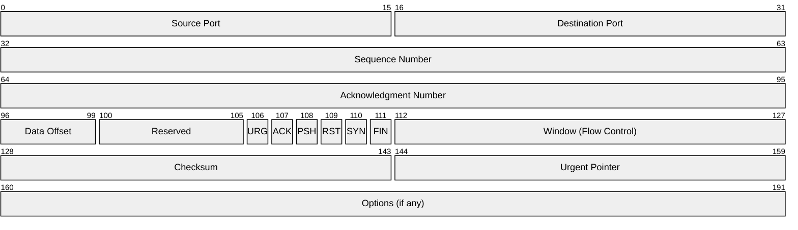

# TCP Introduction and Header Format

## Introduction to TCP

TCP (Transmission Control Protocol) is a **connection-oriented**, **reliable**, **byte-stream** protocol defined in RFC 793. Unlike UDP, TCP provides:

- **Reliable delivery** - Data is guaranteed to arrive, or the sender is notified of failure
- **Ordered delivery** - Bytes arrive in the same order they were sent
- **Error detection** - Checksums detect corrupted data
- **Flow control** - Prevents overwhelming slow receivers
- **Congestion control** - Prevents overwhelming the network

### When to Use TCP

| Use TCP For          | Why                                         |
| -------------------- | ------------------------------------------- |
| Chat applications    | Messages must arrive reliably and in order  |
| File transfers       | Every byte must be delivered correctly      |
| HTTP/HTTPS           | Web pages require complete, ordered content |
| Email (SMTP)         | Messages cannot be lost or corrupted        |
| Database connections | Queries and results must be reliable        |

---

## TCP Header Format

The TCP header contains all the control information needed for reliable communication:



### Key Header Fields

| Field                 | Size         | Purpose                                          |
| --------------------- | ------------ | ------------------------------------------------ |
| Source/Dest Port      | 16 bits each | Identify sending and receiving applications      |
| Sequence Number       | 32 bits      | Byte position of first data byte in this segment |
| Acknowledgment Number | 32 bits      | Next byte the receiver expects (cumulative ACK)  |
| Window                | 16 bits      | Receiver's available buffer space (flow control) |
| Flags                 | 6 bits       | SYN, ACK, FIN, RST, PSH, URG                     |

### The 4-Tuple Connection Identifier

A TCP connection is uniquely identified by four values:

```
(Source IP, Source Port, Destination IP, Destination Port)
```

This allows:

- A server to handle thousands of clients on the same port
- A client to have multiple connections to the same server
- NAT devices to track and translate connections
