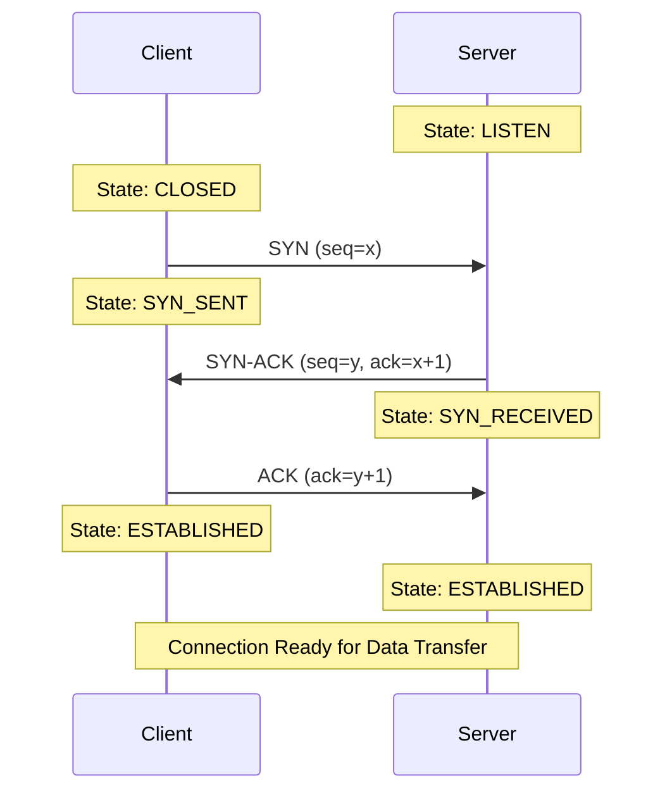
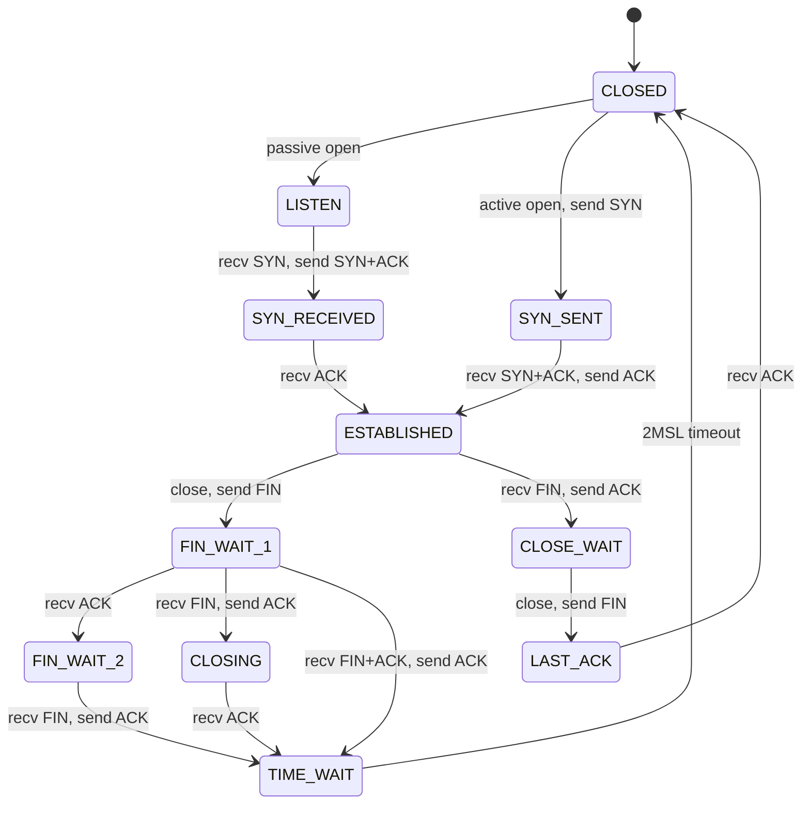

## TCP Three-Way Handshake

TCP uses a three-way handshake to establish a connection and synchronize sequence numbers between client and server.

### Handshake Steps

1. **SYN (Synchronize)**: Client sends a segment with SYN flag set and an initial sequence number (ISN)
2. **SYN-ACK**: Server acknowledges client's SYN and sends its own SYN with its ISN
3. **ACK**: Client acknowledges server's SYN, completing the handshake

### Why Three Steps?

- **Two-way synchronization**: Both sides must agree on initial sequence numbers
- **Prevents old duplicates**: Sequence numbers prevent stale connection attempts from being accepted
- **Resource allocation**: Server allocates resources only after receiving final ACK

### Connection Refused

When a client attempts to connect to a port with no listening server:

- The server's OS responds with a **RST** (reset) packet
- In Boost.Asio, `socket.connect()` throws `boost::system::system_error` with `connection_refused`

---

## 4. TCP Connection States

TCP connections progress through a series of states during their lifetime:

### Important States

| State        | Description                                              |
| ------------ | -------------------------------------------------------- |
| LISTEN       | Server waiting for incoming connections                  |
| SYN_SENT     | Client has sent SYN, waiting for SYN-ACK                 |
| SYN_RECEIVED | Server received SYN, sent SYN-ACK, waiting for ACK       |
| ESTABLISHED  | Connection open, data can flow both directions           |
| CLOSE_WAIT   | Received FIN from peer, waiting for application to close |
| TIME_WAIT    | Sent final ACK, waiting for delayed segments to expire   |

### The TIME_WAIT State

After closing a connection, the endpoint that sent the final ACK enters TIME_WAIT for **2×MSL** (Maximum Segment Lifetime, typically 60 seconds).

**Purpose:**

- Ensures delayed packets from the old connection don't corrupt a new connection using the same 4-tuple
- Allows retransmission of final ACK if lost

**Practical Impact:**

- Cannot immediately rebind to the same port
- Use `reuse_address` option during development to bypass this
