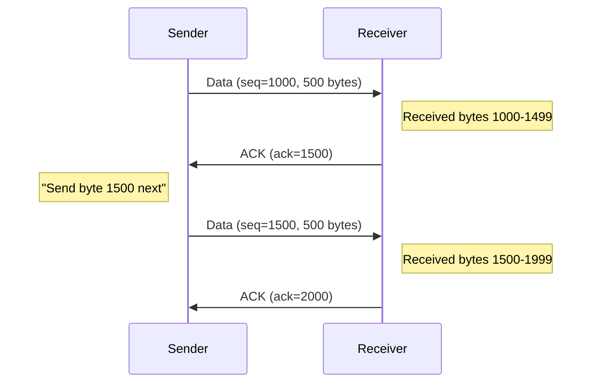
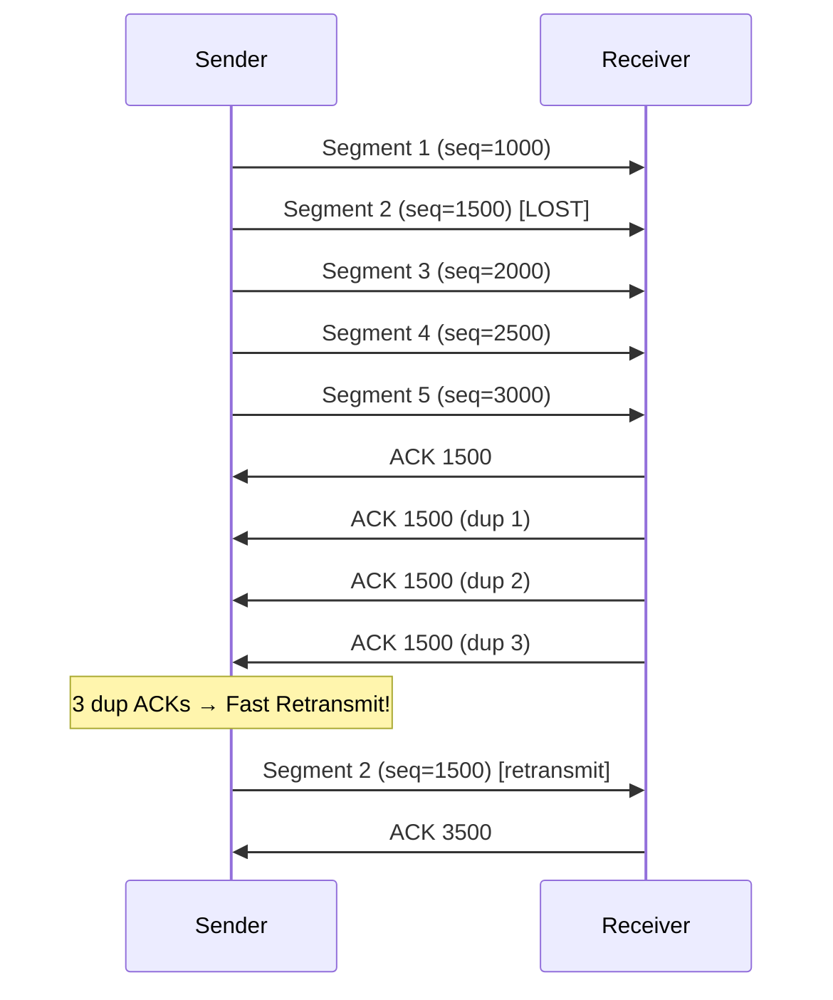

## TCP Reliability Mechanisms

### Sequence and Acknowledgment Numbers

TCP tracks every byte with sequence numbers:



**Key insight:** The acknowledgment number indicates the **next byte expected**, not the last byte received. This is called a **cumulative acknowledgment**.

### Byte Stream vs Message Protocol

TCP is a **byte stream** protocol - it does not preserve message boundaries.

```
Application sends:     "Hello" (5 bytes) then "World" (5 bytes)

TCP might deliver:     "Hel" + "loWor" + "ld"
                   or: "HelloWorld"
                   or: "H" + "e" + "l" + "l" + "o" + "W" + "o" + "r" + "l" + "d"
```

**Consequence:** One `send()` call does NOT guarantee one `receive()` call. Applications must implement their own **message framing**:

| Framing Method | Description                         | Example                  |
| -------------- | ----------------------------------- | ------------------------ |
| Delimiter      | End messages with special character | `"Hello\n"`, `"World\n"` |
| Length prefix  | Send length before payload          | `[5]Hello[5]World`       |
| Fixed size     | All messages same length            | Pad to 64 bytes          |

### Retransmission Mechanisms

TCP ensures delivery through retransmission:

**1. Timeout-based Retransmission**

- Sender sets a timer when sending data
- If ACK doesn't arrive before timeout (RTO), retransmit
- RTO is calculated from measured round-trip times (RTT)

**2. Fast Retransmit**

- If sender receives **3 duplicate ACKs**, retransmit immediately
- Indicates packet loss (later packets arrived, but one is missing)
- Faster than waiting for timeout


